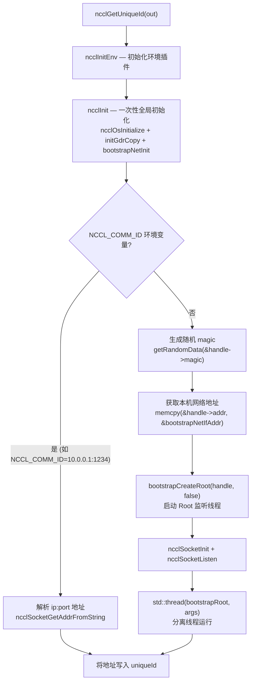
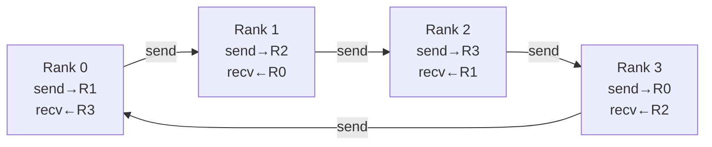
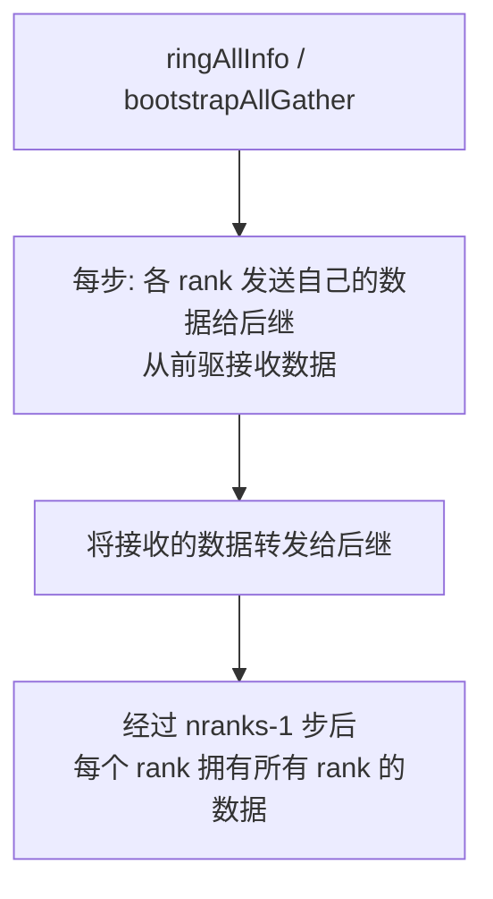
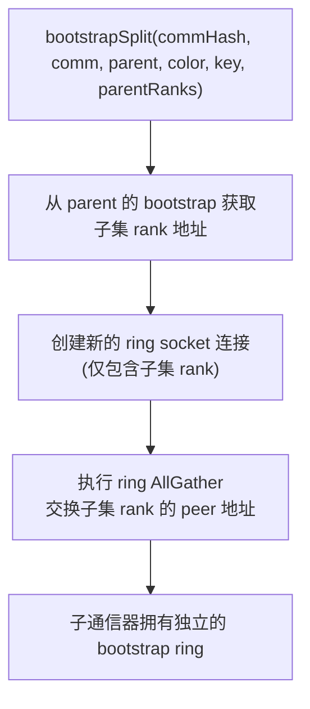

# NCCL Bootstrap 引导机制

Bootstrap 是 NCCL 各 rank 之间建立初始带外通信的机制。在通信器初始化之前，rank 之间无法使用 GPU 通信，必须通过 socket 建立初始连接、交换地址信息，才能构建后续的传输通道。

---

## 1. 核心数据结构

| 结构体 | 文件 | 用途 |
|--------|------|------|
| `ncclUniqueId` | nccl.h.in | 128 字节令牌，包含 Root 的 IP:port 或 magic+addr |
| `bootstrapHandle` | bootstrap.cc | 内部句柄：magic(64bit) + socket 地址 |
| `ncclBootstrapState` | bootstrap.cc | 每个 rank 的 bootstrap 状态：ring socket、peer 地址数组、magic |
| `extInfo` | bootstrap.cc | rank 向 Root 发送的信息：rank、nranks、offset、监听地址 |

---

## 2. UniqueId 生成与 Root 线程

### 2.1 ncclGetUniqueId 流程



### 2.2 Root 线程核心逻辑

Root 线程接收所有 rank 的连接，组织成环形拓扑：

```mermaid
flowchart TD
    A["bootstrapRoot 线程启动"] --> B["ncclSocketAccept — 阻塞等待 rank 连接"]
    B --> C["第一次连接: 确定 nranks\n分配 rankInfo[] + rankAddressesRoot[]"]
    C --> D["读取 rankInfo: rank, nranks, offset, addr"]
    D --> E{前一个 rank (localId-1) 已报到?}
    E -->|"是"| F["rootSend: 将当前 rank 地址\n发送给前一个 rank"]
    E -->|"否"| G["保存当前 rank 地址\n等待前一个 rank"]
    F --> H{后一个 rank (localId+1) 已报到?}
    G --> H
    H -->|"是"| I["将后一个 rank 的地址\n发送给当前 rank"]
    H -->|"否"| J["保存当前 rank 地址\n等待后一个 rank"]
    I --> K{所有 rank 都已报到?}
    J --> K
    K -->|"否"| B
    K -->|"是"| L["发送剩余 pending 信息\n确保每个 rank 都收到了后继地址"]
```

**多 Root 支持**: `ncclCommInitRankScalable` 使用 `rootIdFromRank()` 将 rank 分配到多个 Root，每个 Root 管理一部分 rank，跨 Root 边界进行 handoff。

---

## 3. bootstrapInit 完整流程

每个 rank 调用 `bootstrapInit` 与 Root 建立连接并形成环形通信：

```mermaid
flowchart TD
    A["bootstrapInit(nId, handles, comm, parent)"] --> B["分配 ncclBootstrapState"]
    B --> C["从 handle 获取 magic"]
    C --> D["Step 1: 创建 ring 监听 socket\ncreateListenSocket(magic, &listenSocket, &connectInfo.addr)"]

    D --> E["Step 2: 创建 root 监听 socket\ncreateListenSocket(root_magic, &listenSockRoot, &info.listenRootAddress)"]

    E --> F["Step 3: 延迟错峰 (大规模场景)\nif nRankRoot > threshold: sleep(localId / msg_rate)"]

    F --> G["Step 4: 发送 extInfo 到 Root\ninfo.rank, info.iroot, info.offset\nsendToRoot(handles[curr_root], comm, &info)"]

    G --> H["Step 5: 从 Root 接收 nextPeer\nncclSocketAccept(&sock, &listenSockRoot)\nsocketRecv(&sock, &nextPeer, sizeof(nextPeer))"]

    H --> I["Step 6: 连接 bootstrap ring\nsocketRingConnect(nextPeer.addr,\n&sendSocket, &listenSocket, &recvSocket, magic)"]

    I --> J["Step 7: 创建 proxy 监听 socket + UDS\ncreateListenSocket + getUDS"]

    J --> K["Step 8: 创建 P2P 监听 socket\ncreateListenSocket + peerP2pAddresses[rank]"]

    K --> L["Step 9: 可选 RAS 初始化\nif ncclParamRasEnable: ncclRasCommInit"]

    L --> M["Step 10: ring AllGather\nringAllInfo: 交换所有 rank 的\npeerP2pAddresses + peerProxyAddresses + peerProxyAddressesUDS"]

    M --> N["Step 11: 初始化 proxy 服务\nncclProxyInit(comm, proxySocket, peerProxyAddresses, peerProxyAddressesUDS)"]

    N --> O["Step 12: 可选 RAS addRanks\nif ncclParamRasEnable: ncclRasAddRanks"]
```



---

## 4. Bootstrap Ring 通信

### 4.1 Ring 拓扑

bootstrap 完成后，每个 rank 有一个发送 socket（连向后继）和一个接收 socket（来自前驱）：



### 4.2 Ring AllGather



4 rank 的 AllGather 过程：

| 步骤 | Rank 0 发送 | Rank 1 发送 | Rank 2 发送 | Rank 3 发送 |
|------|------------|------------|------------|------------|
| 0 | data[0] | data[1] | data[2] | data[3] |
| 1 | data[3] | data[0] | data[1] | data[2] |
| 2 | data[2] | data[3] | data[0] | data[1] |
| 3 | data[1] | data[2] | data[3] | data[0] |

---

## 5. Bootstrap Split

当通信器 split 或 shrink 时，需要从父 bootstrap 创建子 bootstrap ring：



---

## 6. 网络辅助 Bootstrap

当 `ncclParamBootstrapNetEnable()` 为真时，bootstrap 通信可走网络插件而非 socket：

| 路径 | 监听 | 连接 | AllGather |
|------|------|------|-----------|
| **Socket** | ncclSocketListen | socketRingConnect | socket 发送/接收 |
| **Net Plugin** | ncclNet->listen | netRingConnect | net send/recv |

网络路径适用于某些需要通过特定 NIC 进行 bootstrap 的场景。

---

## 7. 关键环境变量

| 变量 | 默认值 | 说明 |
|------|--------|------|
| `NCCL_COMM_ID` | — | Root 地址 (ip:port)，用于外部启动的 rank 0 |
| `NCCL_DEBUG_SUBSYS` | — | 包含 BOOTSTRAP 时打印 bootstrap 调试信息 |
| `NCCL_BOOTSTRAP_NET_ENABLE` | 0 | 使用网络插件进行 bootstrap 通信 |
| `NCCL_SOCKET_IFNAME` | — | 指定 bootstrap socket 使用的网络接口 |

---

## 8. 关键源文件

| 文件 | 行数 | 功能 |
|------|------|------|
| `src/bootstrap.cc` | 1306 | Bootstrap 完整实现：Root 线程、bootstrapInit、ring AllGather、socket 工具 |
| `src/misc/socket.cc` | ~500 | Socket 封装：connect、accept、send、recv |
| `src/misc/ipcsocket.cc` | ~300 | Unix Domain Socket 封装 |
