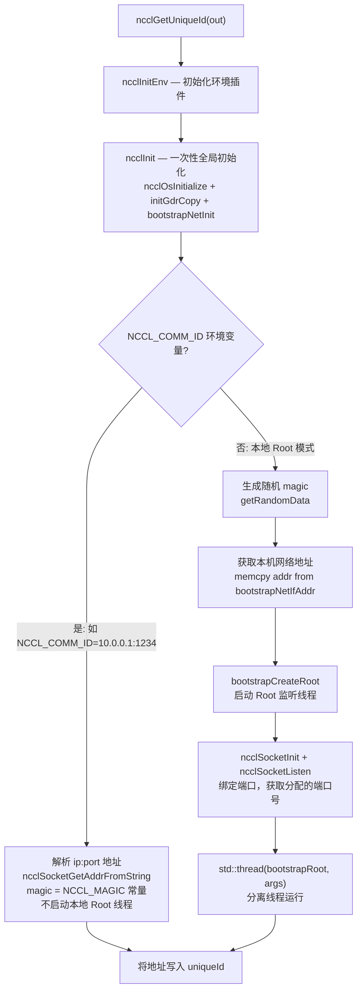
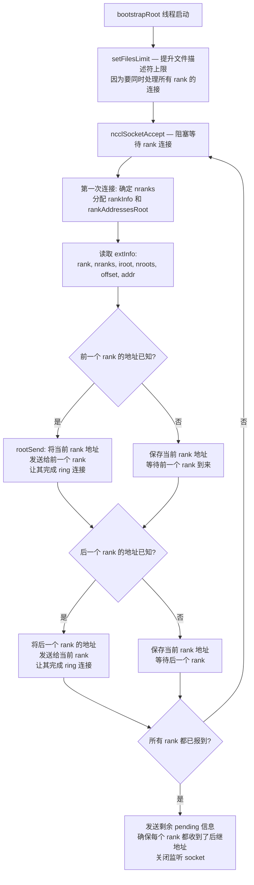
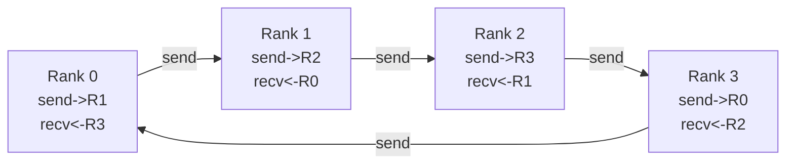
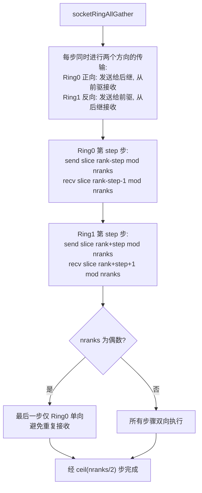
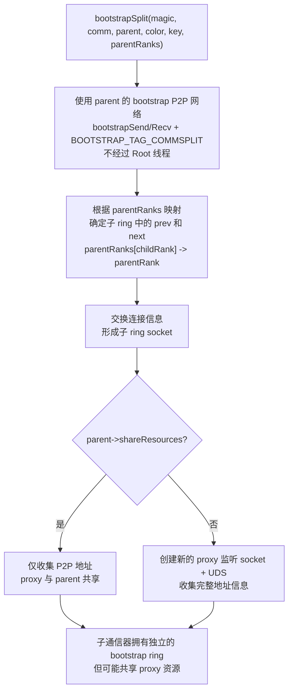

# NCCL Bootstrap 引导机制

Bootstrap 是 NCCL 各 rank 之间建立初始带外通信的机制。在通信器初始化之前，rank 之间无法使用 GPU 通信，必须通过 TCP socket 建立初始连接、交换地址信息，才能构建后续的传输通道。Bootstrap 本质上解决的是一个"鸡生蛋"问题：要建立高性能 GPU 通信，需要先知道对方的地址；而要知道对方地址，又需要先有通信手段。Bootstrap 用简单的 TCP socket 作为这个"第一性"通信方式。

---

## 1. 核心数据结构

| 结构体 | 文件 | 用途 |
|--------|------|------|
| `ncclUniqueId` | nccl.h.in | 128 字节令牌，包含 Root 的 IP:port 或 magic+addr，由用户通过 MPI_Broadcast 广播给所有 rank |
| `ncclBootstrapHandle` | bootstrap.h | 内部句柄：`magic`(64bit) + `addr`(socket 地址) + `nRanks`(grow 时已有 rank 数) |
| `bootstrapState` | bootstrap.cc | 每个 rank 的 bootstrap 状态：ring socket、peer 地址数组、magic、abortFlag |
| `extInfo` | bootstrap.cc | rank 向 Root 发送的信息：rank、nranks、offset、iroot、nroots、监听地址 |

`bootstrapState` 是 per-communicator 的 bootstrap 上下文，存储在 `comm->bootstrap` 中。它包含 ring 连接（用于 AllGather）、监听 socket、所有 peer 的地址，以及指向 comm 的 abortFlag 的指针。当通信器被撤销时，abortFlag 被设置，所有阻塞的 bootstrap 操作会及时退出，避免死锁。

`ncclBootstrapHandle` 必须能容纳在 `ncclUniqueId` 的 128 字节中。其中 `magic` 用于验证连接的合法性——每次 socket 连接建立后，双方会交换 magic 值，不匹配的连接会被拒绝。这可以防止同一机器上多个 NCCL 作业的 socket 互相干扰。

---

## 2. UniqueId 生成与 Root 线程

### 2.1 ncclGetUniqueId 流程

`ncclGetUniqueId` 只在 rank 0 上调用，生成一个全局唯一标识符，然后由用户通过 MPI_Broadcast 广播给所有 rank。

两种模式的区别：

- **本地 Root 模式**（默认）：rank 0 进程自己启动一个 Root 监听线程，其他 rank 连接到该线程。magic 由随机数生成，保证全局唯一性。
- **外部 Root 模式**（`NCCL_COMM_ID`）：Root 地址由外部指定（如作业调度器），rank 0 不启动本地 Root。magic 设为固定常量 `NCCL_MAGIC = 0x0280028002800280`。这种模式下，Root 可能是一个独立的服务进程。

### 2.2 Root 线程核心逻辑

Root 线程接收所有 rank 的连接，将它们组织成环形拓扑。Root 的核心职责是让每个 rank 知道其在 ring 中的后继（next peer）的地址。

Root 的关键设计是**即时转发**（Eager Forwarding）：不需要等所有 rank 到齐才开始分发地址。每收到一个 rank 的信息，就检查其前后 rank 是否已到达，如果已到达就立即转发。这大大减少了大规模场景下的 bootstrap 延迟。

在多 Root 场景下，每个 Root 管理一部分 rank。`rootIdFromRank(rank, nRanks, nRoots, offset)` 函数将 rank 分配到对应的 Root。rank 尽可能均匀地分布在各 Root 上：前几个 Root 多管理一个 rank。跨 Root 边界的 rank 之间，通过 "handoff" 机制交换地址——每个 Root 的第一个 rank 的前驱属于前一个 Root。

---

## 3. bootstrapInit 完整流程

每个 rank 调用 `bootstrapInit` 与 Root 建立连接并形成环形通信。这是整个 NCCL 初始化过程中最关键的步骤之一。

```mermaid
flowchart TD
    A["bootstrapInit(nHandles, handles, comm, parent)"] --> B["分配 bootstrapState\ncomm->bootstrap = state\n设置 magic"]
    B --> C["Step 1: 创建 ring 监听 socket\ncreateListenSocket(magic, listenSocket, connectInfo.addr)\n此地址将发送给 Root 用于 ring 连接"]
    C --> D["Step 2: 创建 root 监听 socket\ncreateListenSocket(root_magic, listenSockRoot, info.listenRootAddress)\nRoot 将通过此 socket 回调发送 nextPeer 地址"]
    D --> E["Step 3: 延迟错峰\nif nRankRoot > NCCL_UID_STAGGER_THRESHOLD (256):\nsleep(localId / NCCL_UID_STAGGER_RATE)\n避免大规模场景下 Root 收到同时连接风暴"]
    E --> F["Step 4: 发送 extInfo 到 Root\nsendToRoot: rank, iroot, offset, listenRootAddress\nRoot 据此知道当前 rank 的身份和回调地址"]
    F --> G["Step 5: 从 Root 接收 nextPeer\nncclSocketAccept(&sock, &listenSockRoot)\nsocketRecv(&sock, &nextPeer, sizeof(nextPeer))\n得到 ring 中后继 rank 的连接信息"]
    G --> H["Step 6: 建立 bootstrap ring\nsocketRingConnect 或 netRingConnect\n同时连接后继 + 接受前驱\n形成环形拓扑"]
    H --> I["Step 7: 创建 proxy 监听 socket + UDS\ncreateListenSocket + getUDS\n为后续 proxy 线程建立连接做准备"]
    I --> J["Step 8: 创建 P2P 监听 socket\ncreateListenSocket + peerP2pAddresses\n为后续 bootstrapSend/Recv 做准备"]
    J --> K["Step 9: 可选 RAS 初始化\nif ncclParamRasEnable: ncclRasCommInit"]
    K --> L["Step 10: ring AllGather\nringAllInfo: 交换所有 rank 的\npeerP2pAddresses + peerProxyAddresses + peerProxyAddressesUDS\n现在每个 rank 都知道了所有其他 rank 的地址"]
    L --> M["Step 11: 初始化 proxy 服务\nncclProxyInit(comm, proxySocket, peerProxyAddresses, peerProxyAddressesUDS)"]
    M --> N["Step 12: 可选 RAS addRanks\nif ncclParamRasEnable: ncclRasAddRanks"]
```

**关键细节说明**：

- **Step 3 错峰机制**：当每个 Root 管理 256 个以上 rank 时，rank 会按 `localId / 7000` 秒的间隔依次连接 Root。这避免了所有 rank 同时连接 Root 导致的"惊群效应"。在 4096 rank 的场景中，错峰时间约为 0.6 秒，比起所有 rank 同时连接 Root 导致的拥塞重试要快得多。

- **Step 6 Ring 建立**：`socketRingConnect` 同时执行 connect（连向后继）和 accept（接受前驱），两者并行进行。每个 rank 需要同时拥有一个发送 socket（连向后继）和一个接收 socket（来自前驱），才能构成完整的 ring。

- **Step 10 AllGather**：这一步完成后，每个 rank 都拥有了所有其他 rank 的三种地址：P2P 地址（用于 `bootstrapSend/Recv`）、proxy 地址（用于 proxy 线程连接）、UDS 地址（同一节点内的 proxy 通信）。这些地址是后续通道建立的基础。

---

## 4. Bootstrap Ring 通信

### 4.1 Ring 拓扑

Bootstrap 完成后，每个 rank 有一个发送 socket（连向后继）和一个接收 socket（来自前驱），构成逻辑环形拓扑：

Ring 拓扑的优势在于每个 rank 只需要两个连接（前驱和后继），而不是 N-1 个全互联连接。这让 bootstrap 的连接复杂度从 O(N^2) 降到 O(N)。

### 4.2 Ring AllGather

NCCL 实现了**双向双环 AllGather**算法，对于 N 个 rank 只需 `ceil(N/2)` 步即可完成（而非简单单环的 N-1 步）。

双向传输使用 `socketDoubleSendRecv` 实现，它先用 `ncclSocketMultiOp` 同时发起 2 个发送和 2 个接收操作，最大化带宽利用率。

4 rank 的 AllGather 数据分布过程：

| 步骤 | Rank 0 发送 | Rank 1 发送 | Rank 2 发送 | Rank 3 发送 |
|------|------------|------------|------------|------------|
| 0 | data[0] | data[1] | data[2] | data[3] |
| 1 | data[3] | data[0] | data[1] | data[2] |
| 2 | data[2] | data[3] | data[0] | data[1] |

4 个 rank 只需 2 步（ceil(4/2)=2），而非简单算法的 3 步。

---

## 5. P2P 通信 (bootstrapSend / bootstrapRecv)

除了 ring 通信，Bootstrap 还支持任意两个 rank 之间的直接 P2P 通信。

**`bootstrapSend(comm, peer, tag, data, size)`**：连接到 `peer` 的 P2P 监听 socket（地址来自 `state->peerP2pAddresses[peer]`），发送包含 `{rank, tag}` 的 ack，然后发送数据。

**`bootstrapRecv(comm, peer, tag, data, size)`**：从 P2P 监听 socket 接受连接。先检查"意外连接队列"（`unexConn`），看是否已有来自目标 peer 的连接。如果没有，则阻塞等待新连接。

意外连接队列是必要的，因为 TCP socket 无法预知哪个 peer 会先连接。当我们在等待 peer A 但 peer B 先连接时，peer B 的连接会被保存到队列中，等后续 `bootstrapRecv(peer=B)` 时直接取出使用，无需重新连接。

---

## 6. Bootstrap Barrier 和 Broadcast

**`bootstrapBarrier(comm)`**：使用 Dissemination 算法实现，只需 `log2(nranks)` 轮。每轮中，rank `r` 与 rank `(r +/- mask) % nranks` 交换数据。比 ring barrier 更高效，尤其在 rank 数较多时。

**`bootstrapBroadcast(comm, data, size, root)`**：简单的星形拓扑——root 向所有其他 rank 逐个发送。虽然不是最高效的广播算法，但 bootstrap 阶段数据量通常很小，简单实现即可。

---

## 7. Bootstrap Split

当通信器 split 或 shrink 时，需要从父 bootstrap 创建子 bootstrap ring：

Split 与 `bootstrapInit` 的关键区别：不使用 Root 线程，而是利用父通信器已有的 P2P 网络直接交换信息。这避免了为子通信器再启动一个 Root 线程的开销。

---

## 8. 网络辅助 Bootstrap

当 `ncclParamBootstrapNetEnable()` 为真时，bootstrap 通信可走网络插件（IB/RDMA）而非 TCP socket：

| 路径 | 监听 | 连接 | AllGather |
|------|------|------|-----------|
| **Socket** | ncclSocketListen | socketRingConnect | socketRingAllGather (双向双环) |
| **Net Plugin** | ncclNet->listen | netRingConnect | netRingAllGather (单向环) |

网络路径适用于需要通过特定 NIC 进行 bootstrap 的场景（如多网卡环境下指定 bootstrap 走特定网络）。注意 Net Plugin 路径使用简单的单向 ring AllGather（N-1 步），而 Socket 路径使用更高效的双向双环算法（ceil(N/2) 步）。

---

## 9. 错误处理与 Abort 集成

Bootstrap 操作是阻塞的，如果某个 rank 崩溃或网络分区，其他 rank 可能永久阻塞。为避免死锁，所有阻塞操作都集成了 abortFlag 检查。

**Socket 操作中的 abort 检查**：每次 `recv`/`send` 系统调用后，检查 `sock->abortFlag`（使用 `std::memory_order_acquire` 加载）。如果非零，立即返回 `ncclInternalError`。Socket 在有 abortFlag 时会被设为 `O_NONBLOCK`，确保 `recv`/`send` 不会无限阻塞。

**Net 路径中的 abort 检查**：`checkAbort` 函数每 10000 次迭代才实际读取一次 abortFlag（通过取模计数器实现），分摊原子加载的开销。

**连接重试**：Socket connect 对瞬态错误（`EINTR`、`EWOULDBLOCK`、`ECONNREFUSED` 等）最多重试 `NCCL_SOCKET_RETRY_CNT`（默认 34）次，重试间隔线性递增（100ms * 错误次数）。每次失败后重建 socket fd，因为失败连接后的 socket 状态是未定义的。

---

## 10. 关键环境变量

| 变量 | 默认值 | 说明 |
|------|--------|------|
| `NCCL_COMM_ID` | — | Root 地址 (ip:port)，用于外部启动的 rank 0 |
| `NCCL_DEBUG_SUBSYS` | — | 包含 BOOTSTRAP 时打印 bootstrap 调试信息 |
| `NCCL_BOOTSTRAP_NET_ENABLE` | 0 | 使用网络插件进行 bootstrap 通信 |
| `NCCL_SOCKET_IFNAME` | — | 指定 bootstrap socket 使用的网络接口 |
| `NCCL_UID_STAGGER_THRESHOLD` | 256 | 触发错峰连接的 rank 数阈值 |
| `NCCL_UID_STAGGER_RATE` | 7000 | 错峰速率 (rank/秒) |

---

## 11. 关键源文件

| 文件 | 行数 | 功能 |
|------|------|------|
| `src/bootstrap.cc` | 1306 | Bootstrap 完整实现：Root 线程、bootstrapInit、ring AllGather、P2P Send/Recv、Barrier、Broadcast、Split |
| `src/misc/socket.cc` | ~500 | Socket 封装：connect、accept、send、recv，含 abort 检查和状态机 |
| `src/misc/ipcsocket.cc` | ~300 | Unix Domain Socket 封装，用于同节点内 proxy 通信 |
| `src/include/bootstrap.h` | ~30 | Bootstrap 数据结构和接口声明 |
| `src/include/comm.h` | — | ncclComm 中的 bootstrap 相关字段 |
