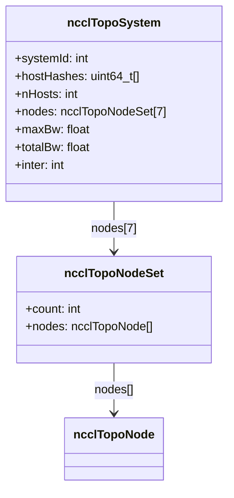
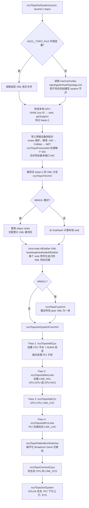
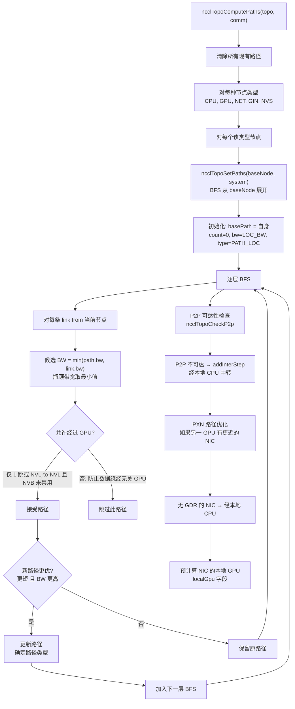
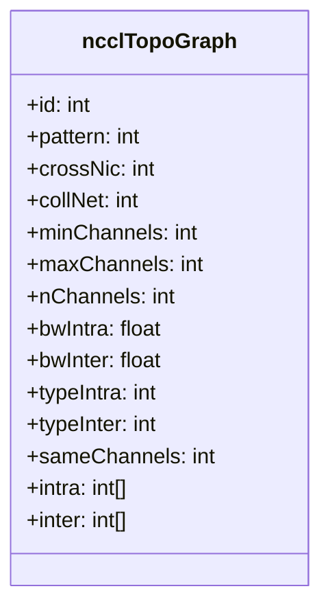
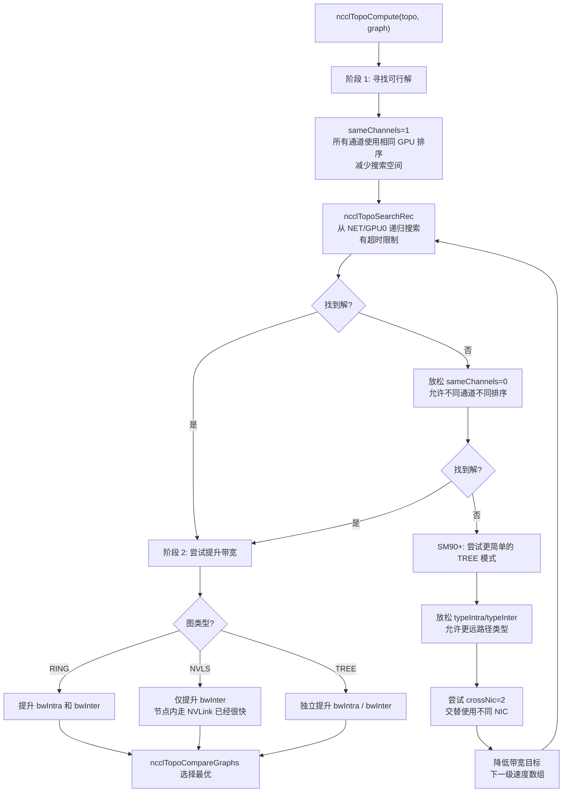
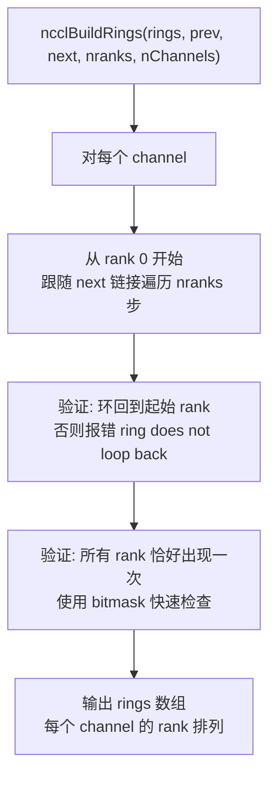
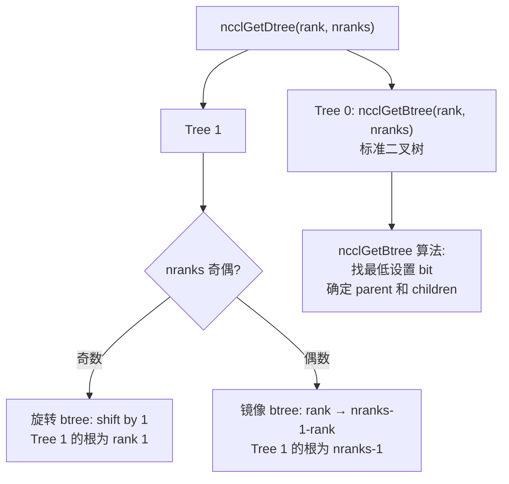

# NCCL 拓扑发现与图计算

拓扑系统是 NCCL 的核心基础设施之一，负责检测硬件拓扑、计算 rank 间路径、搜索最优通道分配，并指导算法和协议选择。拓扑信息决定了 NCCL 如何将通信映射到物理硬件——哪些 GPU 之间走 NVLink、哪些需要经 CPU 中转、跨节点走哪个 NIC，这些决策都基于拓扑系统提供的数据。

---

## 1. 拓扑节点与链路类型

### 1.1 节点类型 (7 种)

| 类型 | 值 | 说明 |
|------|---|------|
| GPU | 0 | GPU 设备，携带 rank、cudaCompCap、gdrSupport |
| PCI | 1 | PCI 交换机，携带 device 信息（vendor/device ID） |
| NVS | 2 | NVSwitch，多 GPU 间的 NVLink 汇聚点 |
| CPU | 3 | NUMA 域，携带 arch、vendor、model、affinity |
| NIC | 4 | 网络接口卡，携带 dev、pciId、bw、gdrSupport、collSupport、maxChannels |
| NET | 5 | 网络端点 |
| GIN | 6 | GIN 设备 |

每个节点的 ID 由 `systemId<<56 | localId` 构成，`systemId` 标识主机，`localId` 标识主机内的位置。

### 1.2 链路类型

| 类型 | 说明 | 典型带宽 |
|------|------|---------|
| LINK_LOC | 自身 | LOC_BW (5000 GB/s，表示无瓶颈) |
| LINK_NVL | NVLink | 架构相关 (12-40 GB/s per link) |
| LINK_C2C | C2C 芯片间直连 | 架构相关 |
| LINK_PCI | PCIe | width * speed / 80.0 GB/s |
| LINK_SYS | SMP 互连 (跨 NUMA) | 架构相关 (6-40 GB/s) |
| LINK_NET | 网络 | NIC 带宽 |

同类型链路到同一远端节点会自动聚合（带宽累加），而不是创建多条链路记录。例如两个 GPU 之间有 4 条 NVLink，会合并为一条 LINK_NVL 链路，带宽为 4 倍单链带宽。

### 1.3 路径类型 (12 种，按距离排序)

| 类型 | 值 | 说明 | 示例 |
|------|---|------|------|
| PATH_LOC | 0 | 自身 | GPU → 自身 |
| PATH_NVL | 1 | 直接 NVLink | 同 NVLink 域 GPU |
| PATH_NVB | 2 | 经中间 GPU 的 NVLink | GPU→NVS→GPU (经另一 GPU) |
| PATH_C2C | 3 | C2C 链路 | GPU→CPU (C2C) |
| PATH_PIX | 4 | 单 PCIe 桥 | 同 PCI switch 下 |
| PATH_PXB | 5 | 多 PCIe 桥 (不经 CPU) | 多级 PCI switch |
| PATH_P2C | 6 | GPU→C2C→CPU→PCI→NIC | C2C 路径到 NIC |
| PATH_PXN | 7 | GPU→NVLink→中间GPU→PCI→NIC | PXN 路径 |
| PATH_PHB | 8 | 经 PCIe 主桥/CPU | 跨 NUMA 但同主机 |
| PATH_SYS | 9 | 跨 NUMA SMP 互连 | 跨 CPU socket |
| PATH_NET | 10 | 经网络 | 跨节点 |
| PATH_DIS | 11 | 断开 | 不可达 |

路径类型在 BFS 过程中通过 `max(当前路径类型, 新链路类型)` 递增。这确保路径类型反映路径中最"远"的段。

---

## 2. 核心数据结构

### 2.1 拓扑节点

```mermaid
classDiagram
    class ncclTopoNode {
        +type: int
        +id: uint64_t
        +nlinks: int
        +links: ncclTopoLink[]
        +paths: ncclTopoLinkList[]
        +used: uint64_t
        +gpu: {dev, rank, cudaCompCap, gdrSupport}
        +net: {dev, pciId, bw, gdrSupport, collSupport, maxChannels}
        +cpu: {arch, vendor, model, affinity}
        +pci: {device}
    }

    class ncclTopoLink {
        +type: int
        +bw: float
        +remNode: ncclTopoNode*
    }

    class ncclTopoLinkList {
        +list: ncclTopoLink*[]
        +count: int
        +bw: float
        +type: int
    }

    ncclTopoNode --> ncclTopoLink : links[]
    ncclTopoNode --> ncclTopoLinkList : paths[]
    ncclTopoLink --> ncclTopoNode : remNode
    ncclTopoLinkList --> ncclTopoLink : list[]
```

`ncclTopoLinkList` 表示一条完整路径，其中 `bw` 是瓶颈带宽（路径中最窄的链路带宽），`count` 是跳数，`type` 是路径类型分类。每个节点为每种节点类型维护一组路径，可以快速查询到任意类型节点的最优路径。

### 2.2 拓扑系统



`ncclTopoSystem` 按 7 种节点类型组织所有拓扑节点。`maxBw` 和 `totalBw` 在搜索阶段用于确定通道带宽上限。`inter=1` 表示多节点拓扑，会影响通道搜索策略（需要考虑跨节点带宽）。

---

## 3. 拓扑发现流程

### 3.1 ncclTopoGetSystem 完整流程



**关键细节**：

- **GPU 检测**：只检测当前进程管理的 GPU（通过 `comm->peerInfo[comm->rank].busId`），然后标记 `keep=1`。其他 rank 的 GPU 信息通过后续的 AllGather 交换获得。

- **NIC 合并**：多端口 NIC 会被合并为单个 NIC 节点，合并策略由 `NCCL_NET_MERGE_LEVEL` 控制（默认 `PATH_PORT`，即同端口级别的 NIC 合并）。

- **MNNVL**（Multi-Node NVLink）：当 GPU 跨节点通过 NVLink 连接时，使用 clique 信息确定本地 rank 集合，并分配更大的 XML 缓冲区来容纳跨节点拓扑。

### 3.2 NVLink 带宽与计算能力的关系

NVLink 带宽由 `ncclTopoNVLinkBw(cudaCompCap)` 确定，单链带宽乘以链路数即为两 GPU 间总带宽：

| Compute Capability | NVLink 带宽 (per link) | 典型链路数 | 总带宽 |
|-------------------|----------------------|-----------|--------|
| SM60 (Pascal) | 18 GB/s | 4 | 72 GB/s |
| SM70 (Volta) | 20 GB/s | 6 | 120 GB/s |
| SM80 (Ampere A100) | 20 GB/s | 12 | 240 GB/s |
| SM86 (Ampere A30) | 12 GB/s | — | — |
| SM90 (Hopper) | 20.6 GB/s | 18 | 370.8 GB/s |
| SM100 (Blackwell) | 40.1 GB/s | 18 | 721.8 GB/s |

### 3.3 CPU 互连带宽

同主机不同 NUMA 域之间的带宽取决于 CPU 架构：

| CPU 架构 | 带宽 (GB/s) | 代表产品 |
|---------|------------|---------|
| BDW (Broadwell) | 6 | Xeon E5 v4 |
| SKL (Skylake) | 10 | Xeon SP |
| SRP (Sapphire Rapids) | 22 | Xeon 4th Gen |
| ERP (Emerald Rapids) | 40 | Xeon 5th Gen |
| AMD | 16 | EPYC |
| P9 (Power9) | 32 | POWER9 |
| ARM | 6 | Ampere |

CPU 型号通过 `familyId` 和 `modelId` 自动识别：Intel ERP (>=0xCF)、SRP (>=0x8F)、SKL (>=0x55)，其余为 BDW。

---

## 4. 路径计算 (BFS)

### 4.1 ncclTopoComputePaths 算法

`ncclTopoComputePaths` 对拓扑中的所有节点对计算最优路径，使用 BFS（广度优先搜索）从每个节点展开。



**BFS 的关键约束——GPU 路由限制**：数据不允许经过不相关的 GPU 中转（除非是单跳 NVLink）。具体规则是：只有当路径只有 1 跳、且链路类型为 NVLink、远端为 GPU 时，才允许路径经过 GPU。这防止了数据在 GPU 间"绕路"，把通信延迟转嫁给无辜的 GPU。违反此约束的路径被跳过，不会进入 BFS 的下一层。

**路径类型确定**：最终路径类型为 `max(当前路径类型, 新链路类型)`，取路径中最"远"的类型。特殊情况：PHB + C2C = P2C（GPU 经 C2C 到 CPU 再到 NIC），这是 Hopper 架构的典型路径。

### 4.2 后处理优化

BFS 完成后，还有几个重要的后处理步骤：

1. **P2P 检查**：对每对 GPU，检查路径类型是否在允许的 `p2pLevel` 内（默认 `PATH_PXB`）。超出时，通过 `addInterStep` 在路径中插入 CPU 中转节点。

2. **PXN 优化**：当 GPU `g` 到 NIC 的路径不佳（需经 CPU），但同节点另一个 GPU `g'` 通过 NVLink 连接到 `g` 且到 NIC 路径更好时，使用 `g'` 作为中继。路径变为 `g → NVLink → g' → PCI → NIC`，避免了 CPU 中转。

3. **GDR 检查**：如果 GPU 到 NIC 的路径优于 PHB 但 GDR 被禁用，则强制插入 CPU 中转步骤。

---

## 5. 通道搜索与图计算

### 5.1 图结构 (ncclTopoGraph)



`ncclTopoGraph` 描述了一种通道拓扑方案。`intra[]` 数组定义每个通道内 GPU 的排列顺序（影响 ring/tree 的构建），`inter[]` 数组定义每个通道使用的 NIC。`bwIntra` 和 `bwInter` 分别是节点内和跨节点每通道带宽。

### 5.2 搜索模式

| 模式 | 节点内 | 跨节点 |
|------|--------|--------|
| RING | GPUa→GPUb→...→GPUx→GPUa | NETn→GPUa→...→GPUx→NETn |
| TREE | GPUa→GPUb→...→GPUx | NETn→GPUa→...→GPUx, GPUa→NETn |
| SPLIT_TREE | 同 TREE | 发送和接收使用不同 NIC |
| NVLS | N/A | NETn→GPUhead, 经 NVSwitch |
| COLLNET_DIRECT | 所有 GPU 星形到 head | NETn→GPUhead→分发 |

### 5.3 两阶段搜索算法

通道搜索采用"先找到可行解，再优化带宽"的两阶段策略。



**阶段 1 的核心逻辑**：从最高带宽目标开始尝试。先要求所有通道使用相同的 GPU 排序（`sameChannels=1`），这极大缩小了搜索空间。如果找不到解，逐步放松约束——允许不同排序、允许更远路径、允许跨 NIC、最终降低带宽目标。每次放松后重新搜索，直到找到可行解。

**阶段 2 的优化**：找到可行解后，尝试在不增加通道数的前提下提升单通道带宽。通过递增速度数组中更高带宽的目标值来尝试。Ring 同时提升 intra 和 inter 带宽，Tree 可以独立优化两者。

### 5.4 图比较优先级

`ncclTopoCompareGraphs()` 按以下优先级选择最优方案：

1. **更多通道** (nChannels) — 并行度优先
2. **更高总带宽** (nChannels × bwIntra) — 吞吐量优先
3. **更少跳数** (nHops) — 延迟优先

### 5.5 GPU 排序启发式

`ncclTopoSearchNextGpuSort()` 按多维度权重排序候选下一个 GPU：

1. **interBw** (最重要) — 到该 GPU 的网络带宽，高优先
2. **interPciBw** — PCI 带宽
3. **interNhops** — 更少跳数优先
4. **intraBw** — 节点内带宽
5. **intraNhops** — 更少节点内跳数

在 NVSwitch 系统中，搜索被限制在相邻 GPU（索引相邻），这大幅减少了搜索空间，因为 NVSwitch 拓扑下所有 GPU 对称等价。

### 5.6 通道复制优化

`ncclTopoDupChannels` 在满足条件时将通道数翻倍（每通道带宽减半），条件是：
- 非 NVLS 模式
- 带宽 >= 25 GB/s
- SM90+ 时仅当带宽 < 50 GB/s 且通道数 > 4

这利用了"更多通道比更高单通道带宽更有利于并行"的特性。

---

## 6. Ring 和 Tree 构建

### 6.1 Ring 构建 (ncclBuildRings)



Ring 构建本质是验证——由搜索算法确定的 `prev[]` 和 `next[]` 数组是否构成合法环。验证包括闭环检查和完备性检查（每个 rank 出现且仅出现一次）。

### 6.2 双二叉树构建 (ncclGetDtree)



二叉树构建基于最低设置位（lowest set bit）算法。对于 rank `r`，找到其最低非零位 `bit`，则：
- **父节点**：`up = (r ^ bit) | (bit << 1)`，若超出 nranks 则 `up = r ^ bit`
- **子节点**：`down0 = r - bit/2`，`down1 = r + bit/2`

双树的关键特性：**每个 rank 至少在一个树中是叶子节点**。这使得 AllReduce 的 reduce 和 broadcast 可以流水线执行——在一个树的叶子节点完成 reduce 的同时，另一个树的根节点可以开始 broadcast，互不干扰。

Tree 0 结构 (16 rank):
```
        0──────────8
           /    \
          4      12
        /  \    /  \
       2    6  10   14
      /\  /\  /\   /\
     1 3 5 7 9 11 13 15
```

---

## 7. 关键环境变量

| 变量 | 说明 |
|------|------|
| `NCCL_TOPO_FILE` | 指定 XML 拓扑文件路径，跳过自动检测 |
| `NCCL_TOPO_DUMP_FILE` | 导出检测到的拓扑到文件，用于调试 |
| `NCCL_P2P_LEVEL` | 覆盖 P2P 路径类型阈值（默认 PATH_PXB） |
| `NCCL_P2P_DISABLE` | 禁用 P2P 直连，所有 GPU 间通信经 CPU |
| `NCCL_P2P_DISABLE_NVB` | 禁用 NVB 路径（经中间 GPU 的 NVLink） |
| `NCCL_SHM_DISABLE` | 禁用 SHM 传输 |
| `NCCL_CROSS_NIC` | 允许跨 NIC 通道 |
| `NCCL_IGNORE_DISABLED_P2P` | 忽略 NVML 报告的 P2P 禁用 |
| `NCCL_NET_MERGE_LEVEL` | NIC 合并级别 |

---

## 8. 关键源文件

| 文件 | 行数 | 功能 |
|------|------|------|
| `src/graph/topo.cc` | ~2000 | 拓扑发现、XML 解析、节点/链路创建、NIC 合并 |
| `src/graph/topo.h` | ~200 | 核心数据结构定义、链路类型、路径类型常量 |
| `src/graph/paths.cc` | ~800 | BFS 路径计算、P2P/GDR/PXN 检查与优化 |
| `src/graph/search.cc` | ~800 | 通道搜索算法、GPU 排序启发式、带宽优化 |
| `src/graph/rings.cc` | ~100 | Ring 构建与合法性验证 |
| `src/graph/trees.cc` | ~150 | 双二叉树构建 |
| `src/graph/xml.cc` | ~600 | XML 拓扑文件解析与生成 |
| `src/graph/connect.cc` | ~300 | 连接建立辅助函数 |
