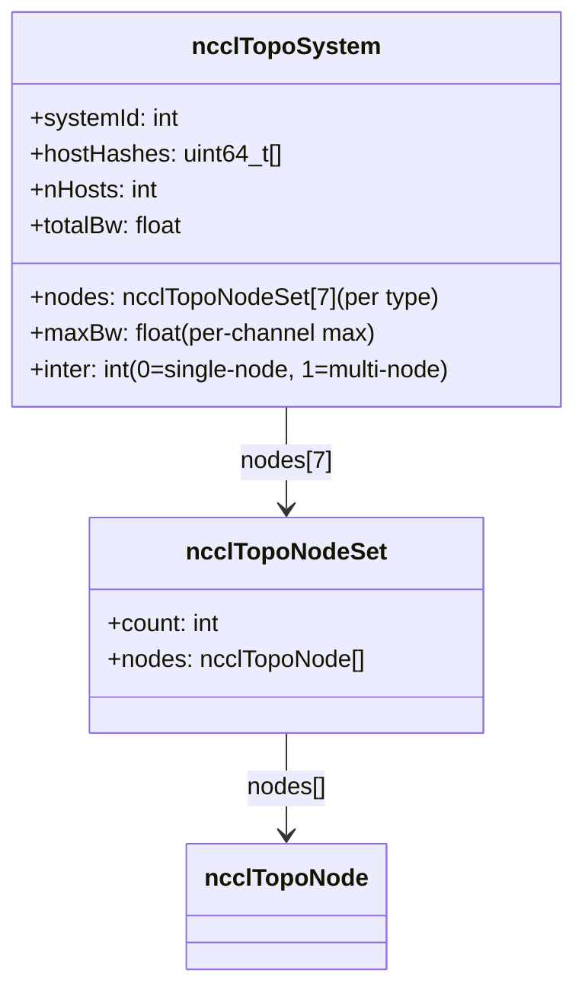
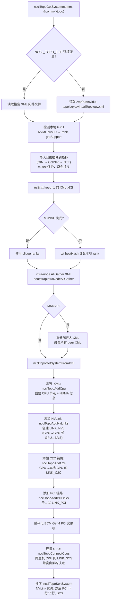
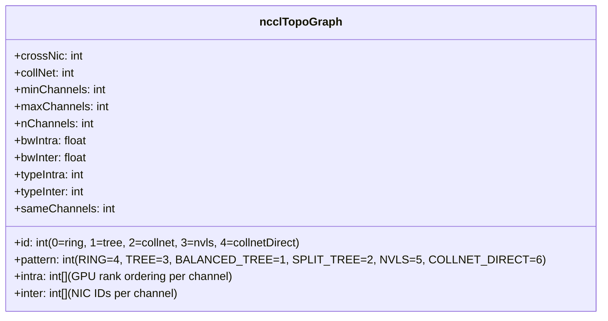
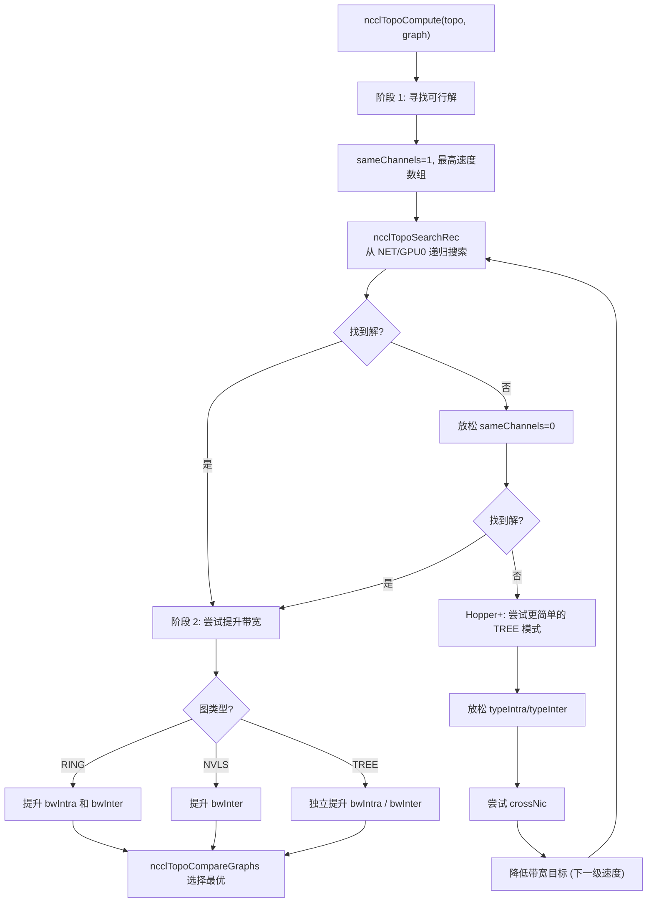
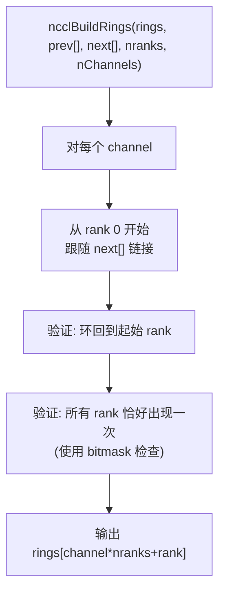
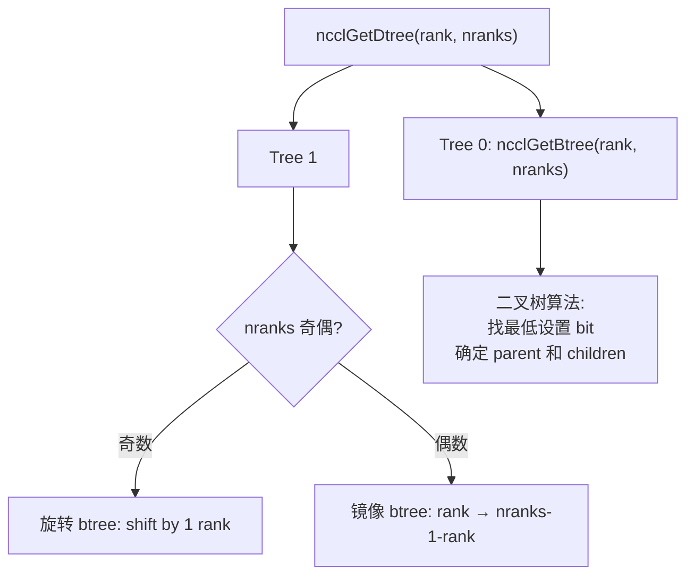

# NCCL 拓扑发现与图计算

拓扑系统是 NCCL 的核心基础设施之一，负责检测硬件拓扑、计算 rank 间路径、搜索最优通道分配，并指导算法和协议选择。

---

## 1. 拓扑节点与链路类型

### 1.1 节点类型 (7 种)

| 类型 | 值 | 说明 |
|------|---|------|
| GPU | 0 | GPU 设备，携带 rank、cudaCompCap、gdrSupport |
| PCI | 1 | PCI 交换机，携带 device 信息 |
| NVS | 2 | NVSwitch，多 GPU 间的 NVLink 汇聚点 |
| CPU | 3 | NUMA 域，携带 arch、vendor、model、affinity |
| NIC | 4 | 网络接口卡，携带 dev、pciId、bw、gdrSupport、collSupport |
| NET | 5 | 网络端点 |
| GIN | 6 | GIN 设备 |

### 1.2 链路类型

| 类型 | 说明 | 典型带宽 |
|------|------|---------|
| LINK_LOC | 自身 | LOC_BW |
| LINK_NVL | NVLink | 架构相关 (12-40 GB/s per link) |
| LINK_C2C | C2C 芯片间直连 | 架构相关 |
| LINK_PCI | PCIe | link_width * link_speed / 80.0 |
| LINK_SYS | SMP 互连 (跨 NUMA) | 架构相关 (6-40 GB/s) |
| LINK_NET | 网络 | NIC 带宽 |

### 1.3 路径类型 (12 种，按距离排序)

| 类型 | 值 | 说明 | 示例 |
|------|---|------|------|
| PATH_LOC | 0 | 自身 | GPU → 自身 |
| PATH_NVL | 1 | 直接 NVLink | 同 NVLink 域 GPU |
| PATH_NVB | 2 | 经中间 GPU 的 NVLink | GPU→NVS→GPU (经另一 GPU) |
| PATH_C2C | 3 | C2C 链路 | GPU→CPU (C2C) |
| PATH_PIX | 4 | 单 PCIe 桥 | 同 PCI switch 下 |
| PATH_PXB | 5 | 多 PCIe 桥 (不经 CPU) | 多级 PCI switch |
| PATH_P2C | 6 | GPU→C2C→CPU→PCI→NIC | C2C 路径到 NIC |
| PATH_PXN | 7 | GPU→NVLink→中间GPU→PCI→NIC | PXN 路径 |
| PATH_PHB | 8 | 经 PCIe 主桥/CPU | 跨 NUMA 但同主机 |
| PATH_SYS | 9 | 跨 NUMA SMP 互连 | 跨 CPU socket |
| PATH_NET | 10 | 经网络 | 跨节点 |
| PATH_DIS | 11 | 断开 | 不可达 |

---

## 2. 核心数据结构

### 2.1 拓扑节点

```mermaid
classDiagram
    class ncclTopoNode {
        +type: int (GPU/PCI/NVS/CPU/NIC/NET/GIN)
        +id: uint64_t (systemId<<56 | localId)
        +nlinks: int
        +links: ncclTopoLink[]
        +paths: ncclTopoLinkList[] (per node type)
        +used: uint64_t (bitmask)
        +gpu: {dev, rank, cudaCompCap, gdrSupport}
        +net: {dev, pciId, asic, port, bw, latency, gdrSupport, collSupport, maxChannels, localGpu}
        +cpu: {arch, vendor, model, affinity}
        +pci: {device}
    }

    class ncclTopoLink {
        +type: int (LINK_LOC/NVL/C2C/PCI/SYS/NET)
        +bw: float (GB/s)
        +remNode: ncclTopoNode*
    }

    class ncclTopoLinkList {
        +list: ncclTopoLink*[]
        +count: int (hops)
        +bw: float (bottleneck bandwidth)
        +type: int (PATH_LOC..PATH_DIS)
    }

    ncclTopoNode --> ncclTopoLink : links[]
    ncclTopoNode --> ncclTopoLinkList : paths[]
    ncclTopoLink --> ncclTopoNode : remNode
    ncclTopoLinkList --> ncclTopoLink : list[]
```

### 2.2 拓扑系统



---

## 3. 拓扑发现流程

### 3.1 ncclTopoGetSystem 完整流程



### 3.2 NVLink 带宽与计算能力的关系

| Compute Capability | NVLink 带宽 (per link) |
|-------------------|----------------------|
| SM60 (Pascal) | 18 GB/s |
| SM70 (Volta) | 20 GB/s |
| SM80 (Ampere) | 20 GB/s |
| SM86 (Ampere) | 12 GB/s |
| SM90 (Hopper) | 20.6 GB/s |
| SM100 (Blackwell) | 40.1 GB/s |

### 3.3 CPU 互连带宽

| CPU 架构 | 带宽 (GB/s) |
|---------|------------|
| BDW (Broadwell) | 6 |
| SKL (Skylake) | 10 |
| SRP (Sapphire Rapids) | 22 |
| ERP (Emerald Rapids) | 40 |
| AMD | 16 |
| P9 (Power9) | 32 |
| ARM | 6 |

---

## 4. 路径计算 (BFS)

### 4.1 ncclTopoComputePaths 算法

```mermaid
flowchart TD
    A["ncclTopoComputePaths(topo, comm)"] --> B["清除所有现有路径"]
    B --> C["对每种节点类型 (CPU/GPU/NET/GIN/NVS)"]
    C --> D["对每个该类型节点"]
    D --> E["ncclTopoSetPaths(baseNode, system)\nBFS 从 baseNode 展开"]

    E --> F["初始化: basePath = 自身\ncount=0, bw=LOC_BW, type=PATH_LOC"]
    F --> G["逐层 BFS"]
    G --> H["对每条 link from 当前节点"]
    H --> I["候选 BW = min(path.bw, link.bw)"]
    I --> J{允许经过 GPU?}
    J -->|"仅1跳 或 NVL-to-NVL 且 NVB 未禁用"| K["接受路径"]
    J -->|"否"| L["跳过此路径"]
    K --> M{新路径更优?\n(更短 且 BW 更高)}
    M -->|"是"| N["更新路径\n确定路径类型"]
    M -->|"否"| O["保留原路径"]
    N --> P["加入下一层 BFS"]
    O --> G
    P --> G

    G --> G1["GPU 间 P2P 可达性检查"]
    G1 --> G2["P2P 不可达 → addInterStep\n经本地 CPU 中转"]
    G2 --> G3["NIC PXN 路径优化\n如果另一 GPU 有更近的 NIC"]
    G3 --> G4["无 GDR 的 NIC → 经本地 CPU"]
    G4 --> G5["预计算 NIC 的本地 GPU"]
```

### 4.2 路径类型确定规则

在 BFS 过程中，路径类型取当前路径类型与新链路类型的较大值（即更"远"的类型）：

| 当前类型 | 新链路 | 结果类型 |
|---------|--------|---------|
| PATH_NVL | LINK_PCI | PATH_PIX (max(NVL,PIX)) |
| PATH_PIX | LINK_PCI (跨 PCI switch) | PATH_PXB |
| PATH_PIX/LINK_PCI | 通过 CPU | PATH_PHB |
| PATH_NVL | 多跳 NVLink | PATH_NVB |
| 任何 | LINK_SYS | PATH_SYS |
| 任何 | LINK_NET | PATH_NET |

### 4.3 P2P 可达性检查 (ncclTopoCheckP2p)

默认 p2pLevel = `PATH_PXB`。路径类型超过 p2pLevel 时，数据必须经 CPU 中转：

- AMD 且 ≤2 GPU: p2pLevel = `PATH_SYS` (更宽松)
- `NCCL_P2P_DISABLE=1`: 禁用 P2P，所有 GPU 间走 CPU
- `NCCL_P2P_LEVEL`: 用户覆盖 p2pLevel
- NVML 验证: 如果 NVML 报告 P2P 禁用但路径类型 ≤ PATH_NVB，则发出警告或错误

---

## 5. 通道搜索与图计算

### 5.1 图结构 (ncclTopoGraph)



### 5.2 搜索模式

| 模式 | 节点内 | 跨节点 |
|------|--------|--------|
| RING | GPUa→GPUb→...→GPUx→GPUa | NETn→GPUa→...→GPUx→NETn(或 m if crossNic) |
| TREE | GPUa→GPUb→...→GPUx | NETn→GPUa→...→GPUx, GPUa→NETn |
| SPLIT_TREE | 同 TREE | NETn→...→GPUx, GPUx→NETm |
| NVLS | N/A | NETn→GPUhead (per NIC), 经 NVSwitch |
| COLLNET_DIRECT | 所有 GPU 星形到 head | NETn→GPUhead→分发到本地 GPU |

### 5.3 两阶段搜索算法



### 5.4 图比较优先级

`ncclTopoCompareGraphs()` 按以下优先级选择：

1. **更多通道** (nChannels)
2. **更高总带宽** (nChannels × bwIntra)
3. **更少跳数** (nHops)

### 5.5 带宽速度数组

带宽目标从高到低尝试：

| 架构 | 节点内速度数组 (GB/s) |
|------|---------------------|
| SM100 | {90,80,70,60,50,45,40,30,24,20,19,18} |
| SM90 | {60,50,40,30,24,20,15,12,11,6,3} |
| SM80 | {40,30,20,18,15,12,10,9,7,6,5,4,3} |

### 5.6 GPU 排序启发式

`ncclTopoSearchNextGpuSort()` 按以下权重排序候选下一个 GPU：

1. **interBw** (最重要) — 到该 GPU 的网络带宽
2. **interPciBw** — PCI 带宽
3. **interNhops** — 更少跳数优先
4. **intraBw** — 节点内带宽
5. **intraNhops** — 更少节点内跳数

NVSwitch 系统中，相邻 GPU (相邻索引) 优先。

---

## 6. Ring 和 Tree 构建

### 6.1 Ring 构建 (ncclBuildRings)



### 6.2 双二叉树构建 (ncclGetDtree)



Tree 0 结构 (8 rank):
```
0──────────8
       /    \
      4      12
    /  \    /  \
   2    6  10   14
  /\  /\  /\   /\
 1 3 5 7 9 11 13 15
```

两个树确保每个 rank 至少在一个树中是叶子节点，使 AllReduce 的 reduce 和 broadcast 可以流水线执行。

---

## 7. 关键环境变量

| 变量 | 说明 |
|------|------|
| `NCCL_TOPO_FILE` | 指定 XML 拓扑文件路径 |
| `NCCL_TOPO_DUMP_FILE` | 导出检测到的拓扑到文件 |
| `NCCL_P2P_LEVEL` | 覆盖 P2P 路径类型阈值 |
| `NCCL_P2P_DISABLE` | 禁用 P2P 直连 |
| `NCCL_SHM_DISABLE` | 禁用 SHM 传输 |
| `NCCL_CROSS_NIC` | 允许跨 NIC 通道 |

---

## 8. 关键源文件

| 文件 | 行数 | 功能 |
|------|------|------|
| `src/graph/topo.cc` | ~2000 | 拓扑发现、XML 解析、节点/链路创建 |
| `src/graph/topo.h` | ~200 | 核心数据结构定义 |
| `src/graph/paths.cc` | ~800 | BFS 路径计算、P2P/GDR/PXN 检查 |
| `src/graph/search.cc` | ~800 | 通道搜索算法、GPU 排序 |
| `src/graph/rings.cc` | ~100 | Ring 构建 |
| `src/graph/trees.cc` | ~150 | 双二叉树构建 |
| `src/graph/xml.cc` | ~600 | XML 拓扑文件解析 |
| `src/graph/connect.cc` | ~300 | 连接建立辅助 |
