# NCCL 通道系统

通道 (Channel) 是 NCCL 中并行度的基本单位。每个通道代表一条独立的通信路径，拥有自己的 Ring/Tree 拓扑和 send/recv 连接器。多个通道并发运行以饱和硬件带宽。可以将通道理解为一条"虚拟线路"——GPU 内核的不同 block 各自操作一个通道，独立地传输数据的不同部分，从而实现并行传输。

---

## 1. 核心数据结构

### 1.1 主机端通道结构

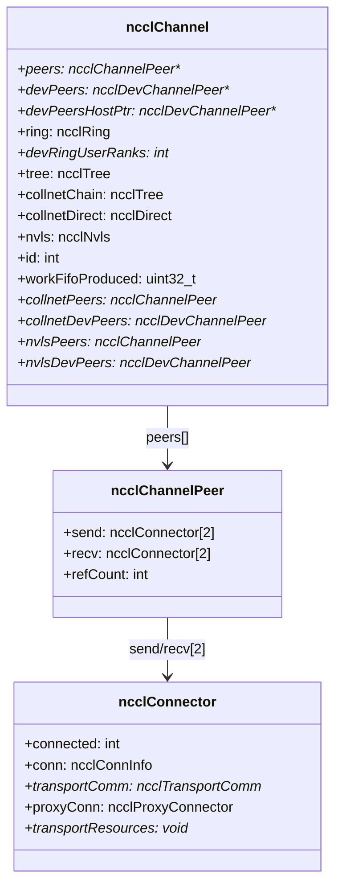

`peers` 是一个间接指针数组，大小为 `nRanks + 1 + nvlsRanks`。索引 0..nRanks-1 对应普通 rank，索引 nRanks 对应 CollNet 虚拟 peer，索引 nRanks+1..nRanks+nvlsRanks 对应 NVLS 本地 rank。这种布局让不同算法类型共享同一通道的 peer 数组空间。

`devPeers` 是 GPU 端的镜像——一个 GPU 上的指针数组，每个元素指向 GPU 上的 `ncclDevChannelPeer` 结构。设备内核通过二级间接寻址（先读 `devPeers[r]`，再读其中的 `send/recv`）访问连接信息。

### 1.2 连接器信息

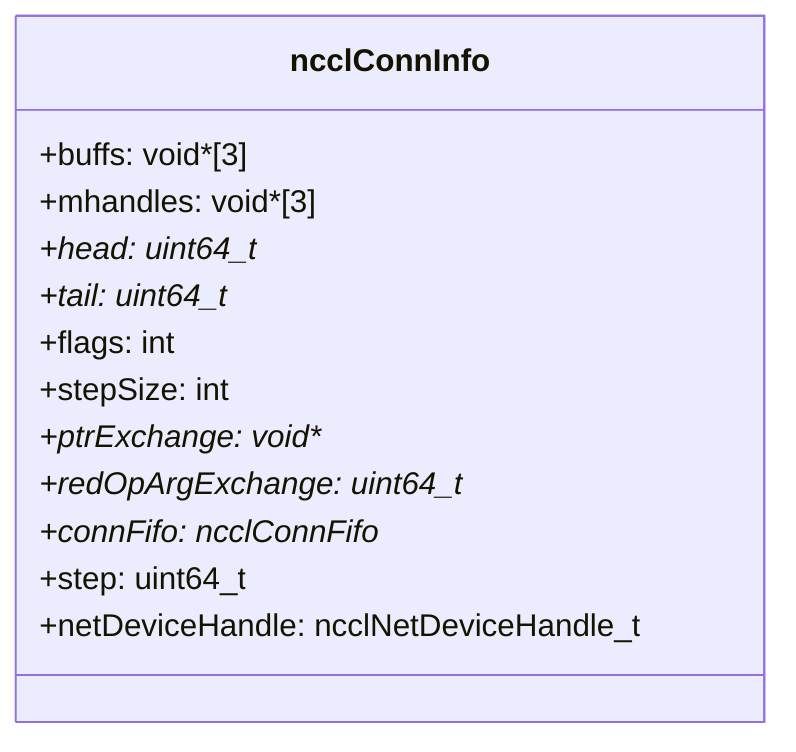

`ncclConnInfo` 是通道间数据流动的核心。关键字段的语义：

- **`buffs[3]`**：三种协议（Simple、LL、LL128）各自的数据缓冲区。对 recv 连接器，buffs 是本地缓冲区；对 send 连接器，buffs 指向远端的 recv 缓冲区。
- **`head`/`tail`**：生产者-消费者指针。send 端拥有 head 的本地副本，读取远端的 tail；recv 端拥有 tail 的本地副本，读取远端的 head。这是基于轮转槽的流控机制。
- **`stepSize`**：每个步（step）的字节数，决定了单次传输的数据量。
- **`ptrExchange`**：直连模式下的指针交换槽，用于 GPU 与 proxy 之间交换缓冲区地址。
- **`flags`**：包含 `NCCL_P2P_WRITE`、`NCCL_P2P_READ`、`NCCL_DIRECT_NIC` 等标志。

### 1.3 设备端算法数据结构

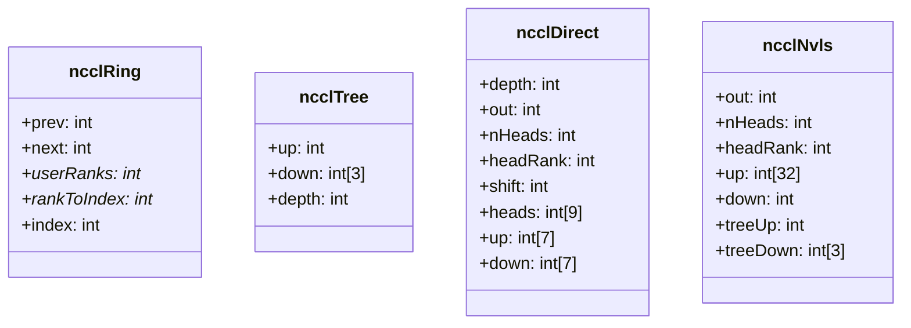

- **ncclRing**：`prev` 和 `next` 是 ring 中的前驱和后继 rank。`userRanks` 将内部索引映射到用户 rank，`rankToIndex` 是反向查找表。`index` 是当前 rank 在 ring 中的位置。
- **ncclTree**：二叉树结构，`up` 是父节点（-1 表示根），`down[3]` 最多 3 个子节点。`depth` 用于同步。
- **ncclDirect**：CollNet Direct 的星形拓扑。`heads[]` 存储本地 head rank 的旋转排列，`nHeads` 是并行 NIC 数，`up[]`/`down[]` 是节点内收集/分发连接。
- **ncclNvls**：NVLS 有双拓扑——扁平的 gather/scatter 结构（`up[32]`/`down`）和覆盖的树结构（`treeUp`/`treeDown[3]`）。最多 32 个本地 rank 可以向 NVLS 多播缓冲区汇聚数据。

---

## 2. 通道初始化

### 2.1 标准通道初始化

`initChannel` 是基础通道初始化函数，必须在 `initNvlsChannel` 和 `initCollnetChannel` 之前调用。

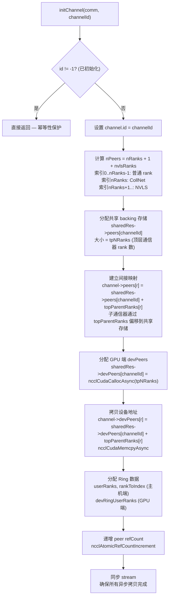

**Peer 共享机制**的核心是两级间接寻址。`sharedRes->peers[channelId]` 是底层数组（大小为 `tpNRanks`，即顶层通信器的 rank 数），所有共享相同 `sharedRes` 的通信器（如 split 产生的子通信器）都指向同一底层数组，但通过 `topParentRanks[r]` 偏移到不同的位置。这样 split 后的子通信器无需重新建立传输连接，直接复用父通信器的连接。

### 2.2 NVLS 通道初始化

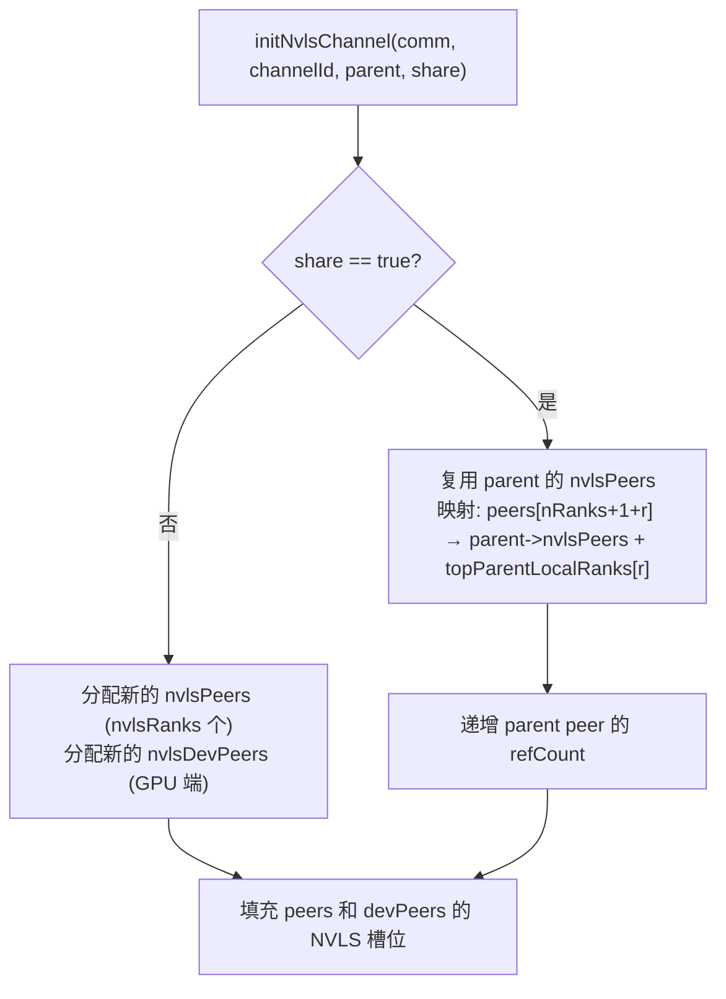

### 2.3 CollNet 通道初始化

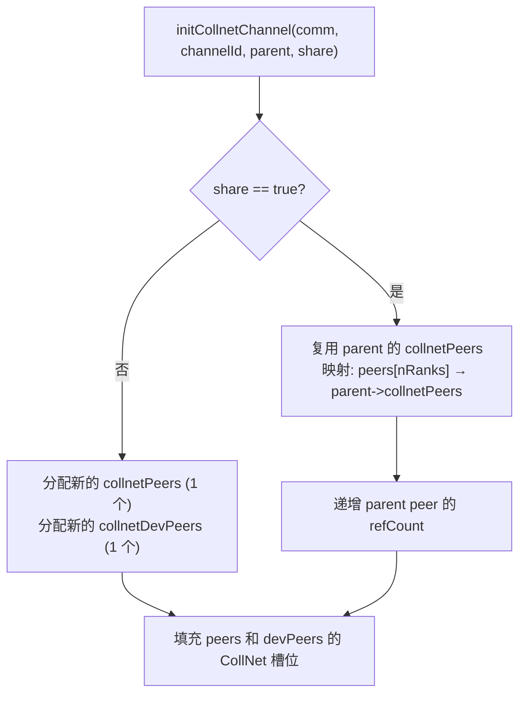

CollNet 只需要一个"虚拟" peer（索引 nRanks），因为它代表网络侧的集合通信根节点。NVLS 则需要 `nvlsRanks` 个 peer，因为每个 NVLS 本地 rank 都有独立的连接。

---

## 3. P2P 通道计算

### 3.1 每对 peer 的最小通道数

P2P 通信（Send/Recv）与集合通信使用不同的通道数策略。P2P 需要为每对 rank 计算足够多的通道以充分利用带宽。

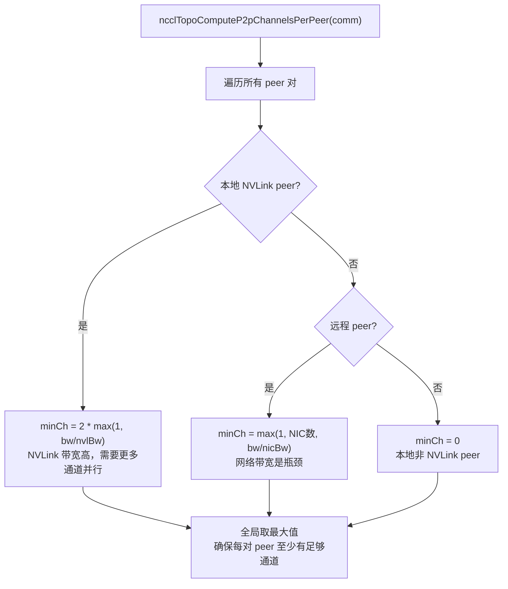

### 3.2 通道数圆整

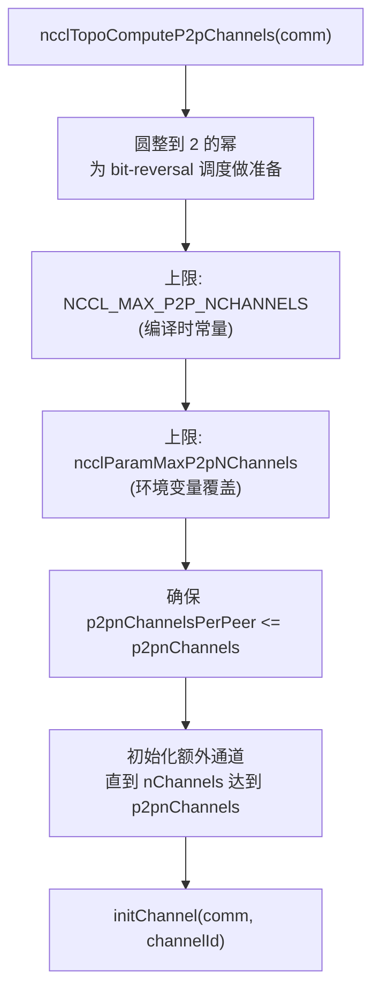

P2P 通道数必须是 2 的幂，因为 `ncclP2pChannelBaseForRound` 使用 bit-reversal 来分配通道。Bit-reversal 将 round 号的二进制位翻转，使通道访问模式更均匀地分布在所有通道上，避免热点。

---

## 4. 通道中的连接器

### 4.1 双连接器设计

每个 peer 的 send/recv 各有 2 个连接器，对应不同的传输路径：

| 索引 | 名称 | 用途 |
|------|------|------|
| 0 | Direct | 直接 P2P 读写 (NVLink/PCIe)，无需代理 |
| 1 | Proxy | 代理辅助，用于 NET/SHM 传输 |

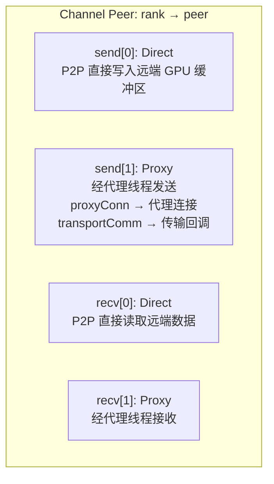

双连接器设计的目的是支持 Ring+Tree 混合算法。在同一个集合操作中，Ring 算法使用 direct 连接器直接读写 NVLink/PCIe 对端内存，Tree 算法可能使用 proxy 连接器经网络传输。两个连接器可以同时工作，互不干扰。

### 4.2 连接器选择逻辑

算法根据传输类型自动选择连接器：

- **P2P 传输**：使用 direct 连接器 (connIndex=0)，GPU 内核直接读写远端内存
- **NET 传输**：使用 proxy 连接器 (connIndex=1)，数据经 proxy 线程通过网络传输
- **SHM 传输**：使用 proxy 连接器，数据经 proxy 线程写入共享内存
- **CollNet 传输**：使用 proxy 连接器
- **NVLS 传输**：使用 direct 连接器 + NVLS 多播机制

### 4.3 传输回调 (transportComm)

每个连接器通过 `transportComm` 指针指向具体的传输实现（P2P/SHM/NET/COLLNET），这是面向对象的虚函数表模式。传输回调包括：

- **setup**：初始化连接，分配缓冲区
- **connect**：完成连接建立
- **free**：释放连接资源
- **proxyProgress**：proxy 线程调用的数据推进函数
- **proxyRegister/proxyDeregister**：RDMA 内存注册

---

## 5. 通道与算法数据的关系

### 5.1 每通道独立拓扑

每个通道拥有独立的 Ring/Tree 拓扑数据。不同通道使用不同的 GPU 排列顺序，实现负载均衡和带宽饱和。

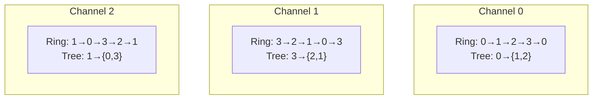

不同通道使用不同的 GPU 排序有三个好处：
1. **负载均衡**：各通道带宽均匀分配，避免某些链路过载
2. **容错**：某通道故障时其他通道仍可工作
3. **带宽饱和**：多路径并行传输充分利用所有可用链路

### 5.2 算法到通道的映射

| 算法 | 使用的通道数据 | 通道数 |
|------|---------------|--------|
| RING | ncclRing (prev/next) | comm->nChannels |
| TREE | ncclTree (up/down) | comm->nChannels |
| COLLNET_CHAIN | ncclTree (collnetChain) | comm->nChannels |
| COLLNET_DIRECT | ncclDirect (collnetDirect) | comm->nChannels |
| NVLS | ncclNvls | comm->nvlsChannels |

---

## 6. 通道在内核中的使用

### 6.1 blockIdx → channelId 映射

内核启动时，grid 大小 = nChannels，每个 block 对应一个通道：

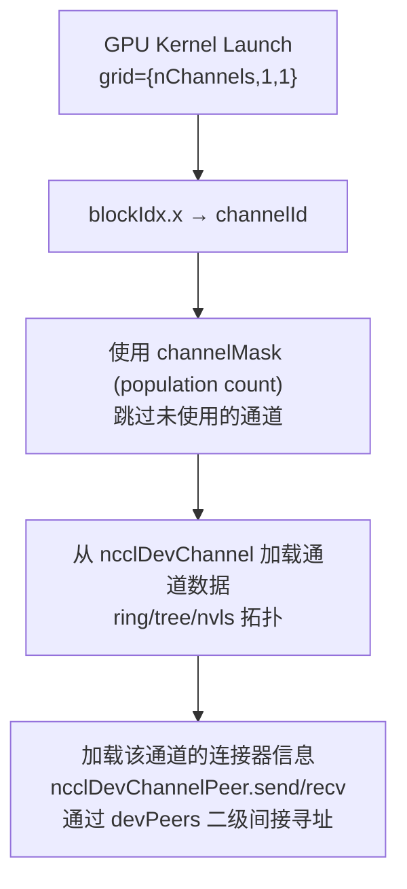

设备端的 `ncclDevChannel` 是主机端 `ncclChannel` 的精简镜像，去掉了所有主机端专用字段（如 `transportComm`、`proxyConn`、`refCount`），只保留 GPU 内核需要的数据（连接信息、拓扑数据）。

### 6.2 通道间工作分配

集合操作的数据被分割到多个通道：

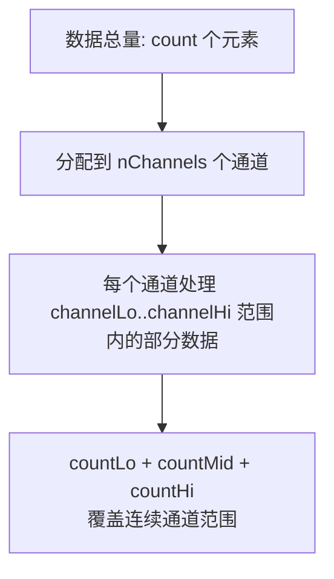

### 6.3 P2P 通道调度

P2P 操作（Send/Recv）使用 bit-reversal 调度将通信均匀分布到所有 P2P 通道上。`ncclP2pChannelBaseForRound` 计算 round 号的 bit-reversal 作为通道基址，避免所有 round 都从同一个通道开始，造成热点。在多节点场景中，调度还考虑 `p2pSchedGroupSize` 和 `NCCL_MAX_DEV_WORK_P2P_PER_BATCH`，将工作打包对齐 GPU 内核的批量结构。

---

## 7. 关键环境变量

| 变量 | 说明 |
|------|------|
| `NCCL_MIN_NCHANNELS` | 最小通道数 |
| `NCCL_MAX_NCHANNELS` | 最大通道数 |
| `NCCL_MAX_P2P_NCHANNELS` | P2P 最大通道数 |
| `NCCL_P2P_DISABLE` | 禁用 P2P，影响通道传输选择 |
| `NCCL_SPLIT_SHARE` | Split 时共享通道资源 |

---

## 8. 关键源文件

| 文件 | 功能 |
|------|------|
| `src/channel.cc` | 通道初始化、NVLS/CollNet 通道管理、peer 共享机制 |
| `src/include/channel.h` | 通道函数声明、P2P 通道调度 |
| `src/include/comm.h` | ncclChannel 结构定义、ncclComm 中的 channels 数组、sharedRes |
| `src/include/device.h` | ncclRing/Tree/Direct/Nvls 设备端结构、ncclDevChannelPeer、ncclDevChannel |
| `src/include/transport.h` | ncclChannelPeer、ncclConnector、ncclConnInfo、传输回调接口 |
