# NCCL 通道系统

通道 (Channel) 是 NCCL 中并行度的基本单位。每个通道代表一条独立的通信路径，拥有自己的 Ring/Tree 拓扑和 send/recv 连接器。多个通道并发运行以饱和硬件带宽。

---

## 1. 核心数据结构

### 1.1 主机端通道结构

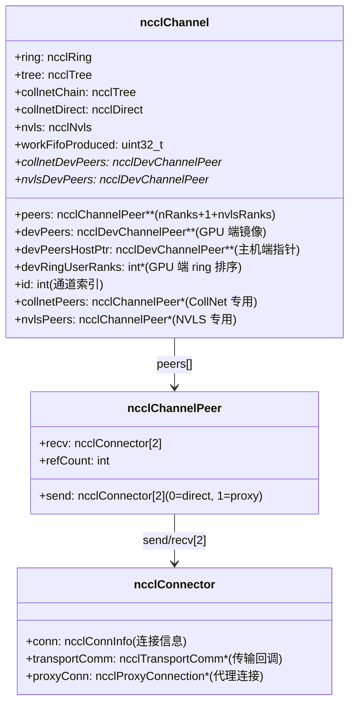

### 1.2 连接器信息

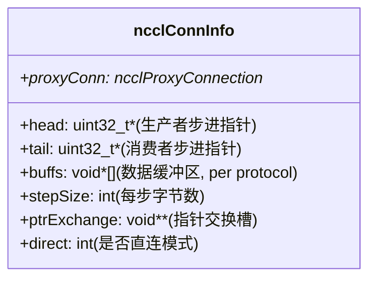

### 1.3 设备端算法数据结构

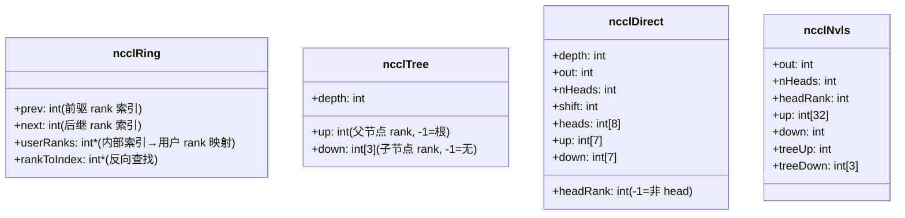

---

## 2. 通道初始化

### 2.1 标准通道初始化

```mermaid
flowchart TD
    A["initChannel(comm, channelId)"] --> B{id != -1? (已初始化)}
    B -->|"是"| C["直接返回"]
    B -->|"否"| D["设置 channel.id = channelId"]

    D --> E["计算 nPeers = nRanks + 1(collnet) + nvlsRanks"]
    E --> F["分配共享 peers:\nsharedRes->peers[channelId]"]
    F --> G["映射每个 rank 的 peer\nvia topParentRanks"]

    G --> H["分配 GPU 端 devPeers"]
    H --> I["cudaMemcpyAsync 拷贝地址"]

    I --> J["分配 Ring 数据:\nuserRanks, rankToIndex, devRingUserRanks"]
```

### 2.2 NVLS 通道初始化

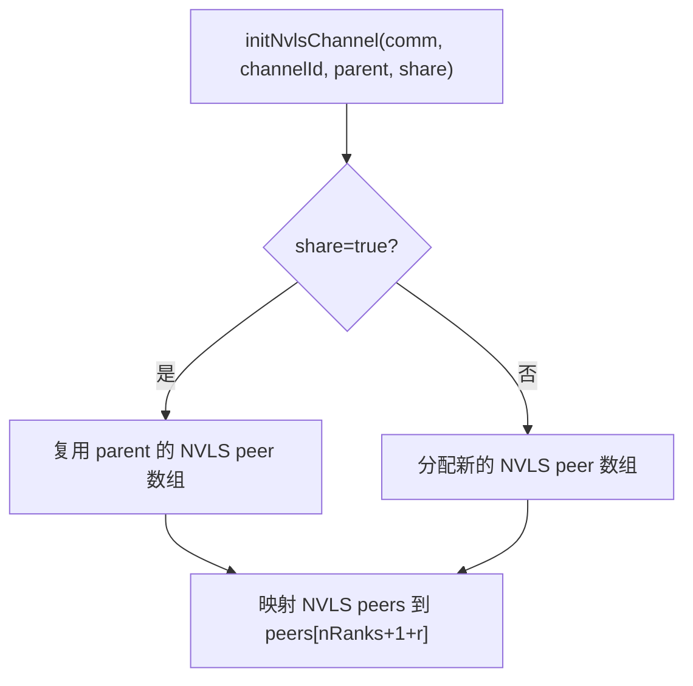

### 2.3 CollNet 通道初始化

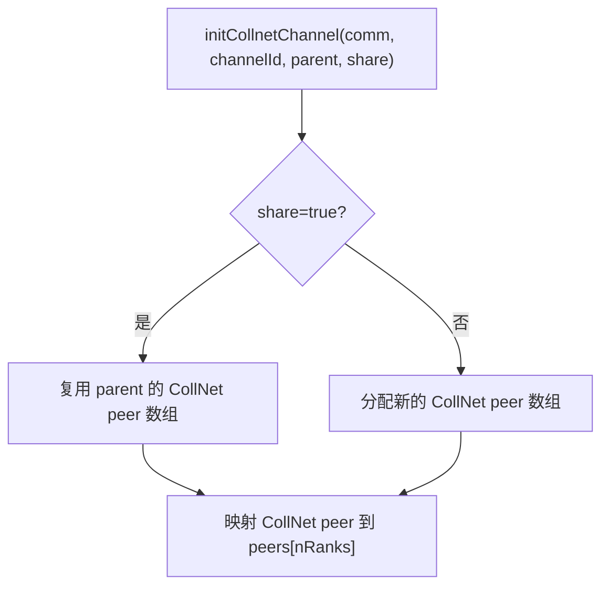

---

## 3. P2P 通道计算

### 3.1 每对 peer 的最小通道数

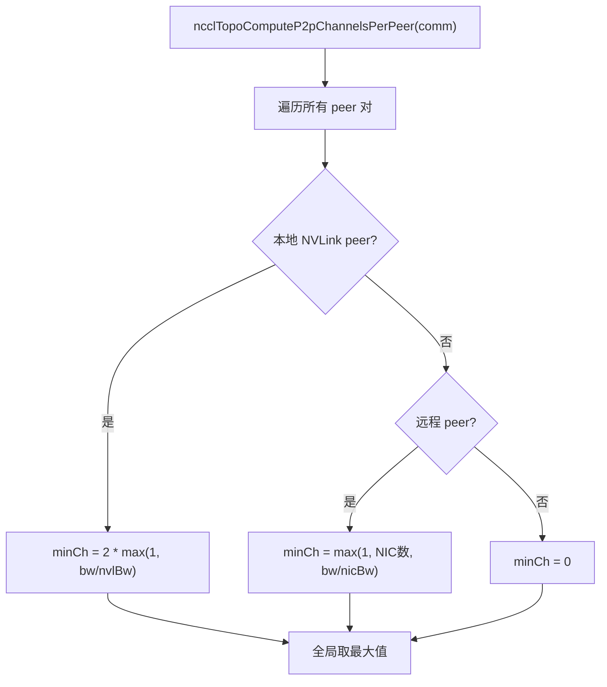

### 3.2 通道数圆整

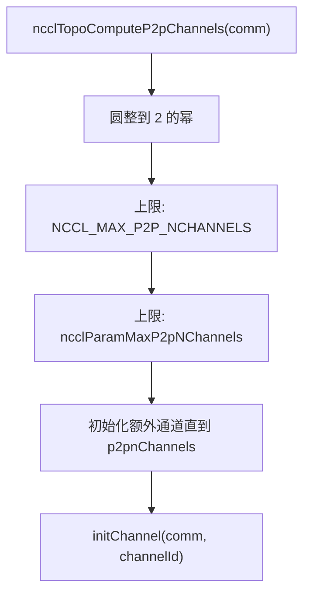

---

## 4. 通道中的连接器

### 4.1 双连接器设计

每个 peer 的 send/recv 各有 2 个连接器：

| 索引 | 名称 | 用途 |
|------|------|------|
| 0 | Direct | 直接 P2P 读写 (NVLink/PCIe)，无需代理 |
| 1 | Proxy | 代理辅助，用于 NET/SHM 传输 |

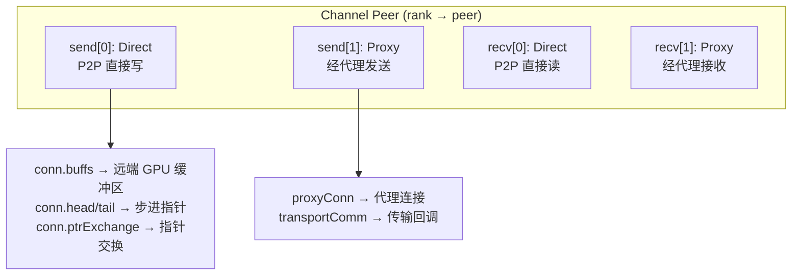

### 4.2 连接器选择逻辑

算法根据传输类型自动选择连接器：

- **P2P 传输**: 使用 direct 连接器 (connIndex=0)
- **NET 传输**: 使用 proxy 连接器 (connIndex=1)
- **SHM 传输**: 使用 proxy 连接器
- **CollNet 传输**: 使用 proxy 连接器
- **NVLS 传输**: 使用 direct + 特殊多播机制

---

## 5. 通道与算法数据的关系

### 5.1 每通道独立拓扑

每个通道拥有独立的 Ring/Tree 拓扑数据：

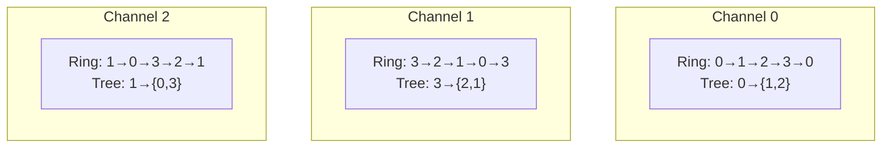

不同通道使用不同的 GPU 排序，实现：
- 负载均衡：各通道带宽均匀分配
- 容错：某通道故障时其他通道仍可工作
- 带宽饱和：多路径并行传输

### 5.2 算法到通道的映射

| 算法 | 使用的通道数据 | 通道数 |
|------|---------------|--------|
| RING | ncclRing (prev/next) | comm->nChannels |
| TREE | ncclTree (up/down) | comm->nChannels |
| COLLNET_CHAIN | ncclTree (collnetChain) | comm->nChannels |
| COLLNET_DIRECT | ncclDirect (collnetDirect) | comm->nChannels |
| NVLS | ncclNvls | comm->nvlsChannels |

---

## 6. 通道在内核中的使用

### 6.1 blockIdx → channelId 映射

内核启动时，grid 大小 = nChannels，每个 block 对应一个通道：

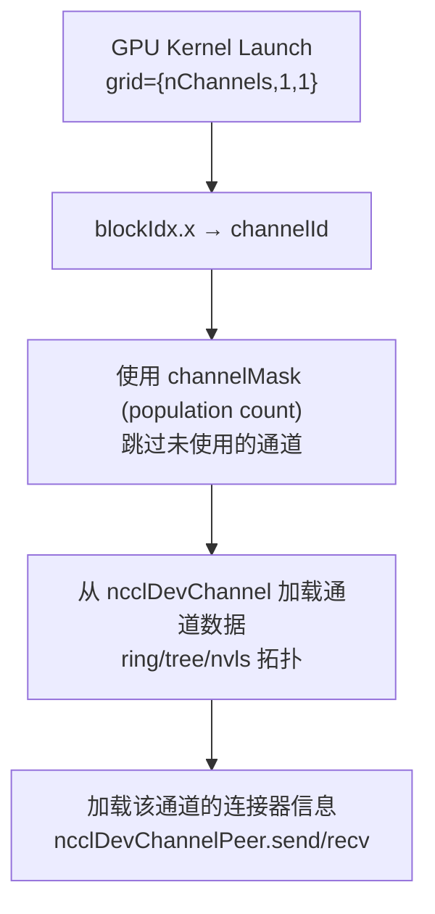

### 6.2 通道间工作分配

集合操作的数据被分割到多个通道：

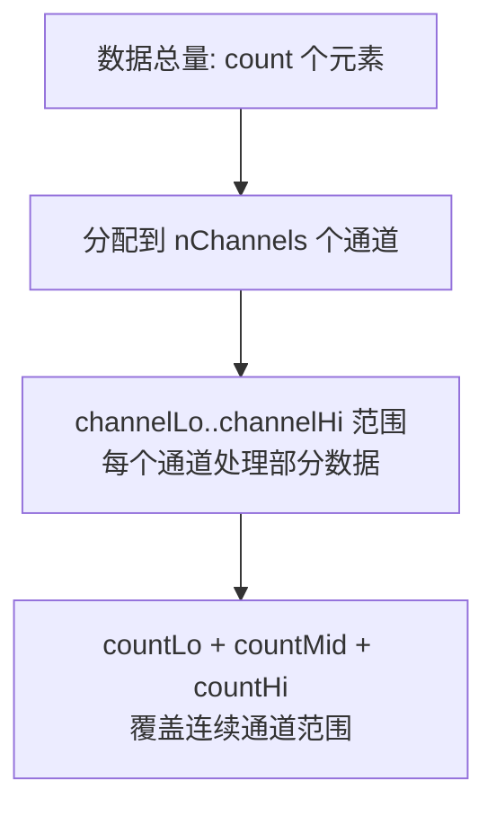

---

## 7. 关键环境变量

| 变量 | 说明 |
|------|------|
| `NCCL_MIN_NCHANNELS` | 最小通道数 |
| `NCCL_MAX_NCHANNELS` | 最大通道数 |
| `NCCL_MAX_P2P_NCHANNELS` | P2P 最大通道数 |
| `NCCL_P2P_DISABLE` | 禁用 P2P，影响通道传输选择 |
| `NCCL_SPLIT_SHARE` | Split 时共享通道资源 |

---

## 8. 关键源文件

| 文件 | 功能 |
|------|------|
| `src/channel.cc` | 通道初始化、NVLS/CollNet 通道管理 |
| `src/include/channel.h` | 通道函数声明、P2P 通道计算 |
| `src/include/comm.h` | ncclChannel 结构定义、ncclComm 中的 channels 数组 |
| `src/include/device.h` | ncclRing/Tree/Direct/Nvls 设备端结构 |
| `src/include/transport.h` | ncclChannelPeer、ncclConnector、ncclConnInfo |
