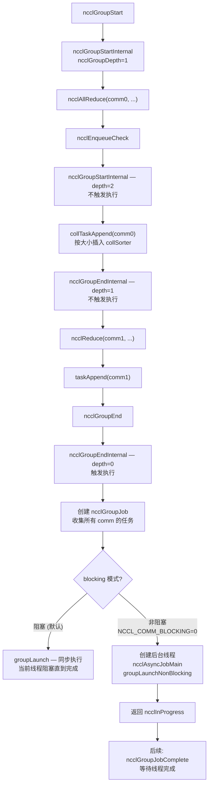
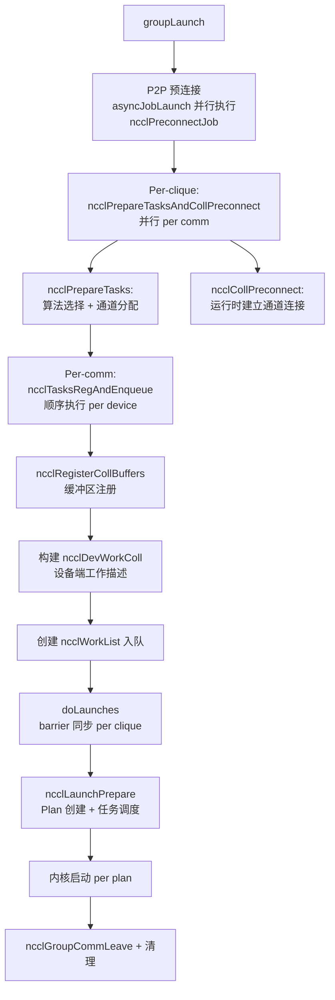
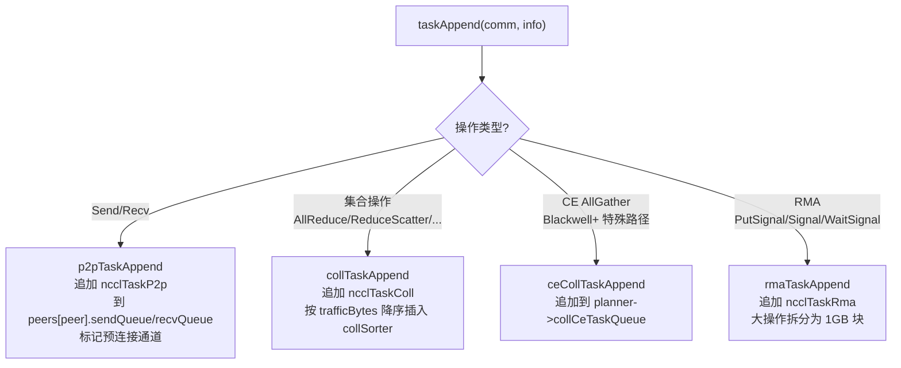
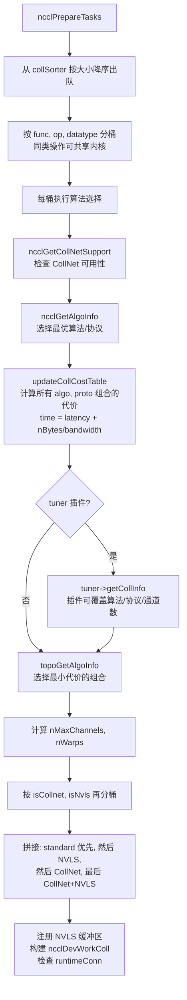
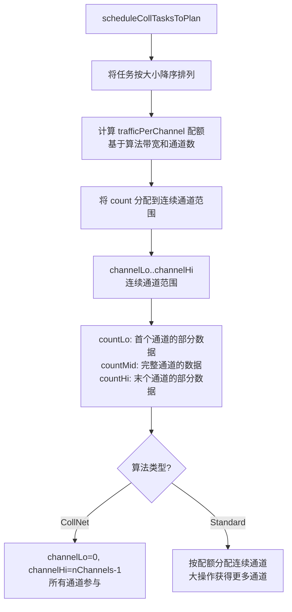
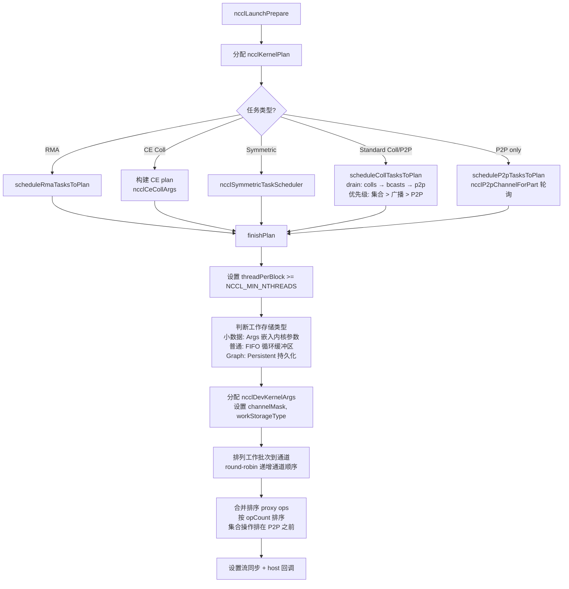
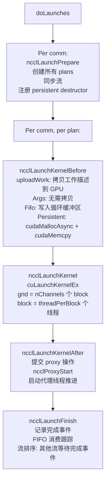
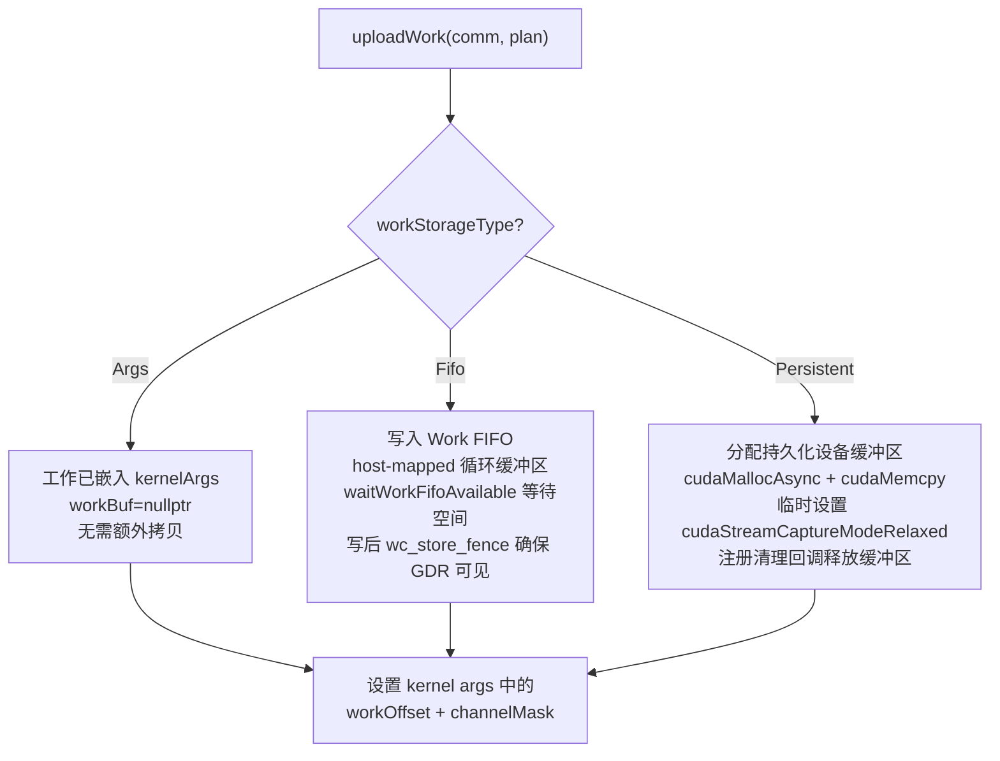

# NCCL 集合操作入队与执行

入队调度层是 NCCL 用户 API 到 GPU 内核之间的桥梁，负责任务排序、算法选择、通道分配和内核启动。可以将它理解为一个"编译器"——将用户的高级集合操作调用"编译"为 GPU 内核可以执行的低级工作描述。

---

## 1. 单独集合操作完整流程

以 `ncclAllReduce` 为例。用户调用时，NCCL 自动包装为 group 执行（隐式 group）：

```mermaid
flowchart TD
    A["ncclAllReduce(sendbuff, recvbuff,\ncount, datatype, op, comm, stream)"]
    A --> B["构造 ncclInfo\n{coll=ncclFuncAllReduce,\nbuffers, count, datatype, op,\nchunkSteps, sliceSteps}"]
    B --> C["ncclEnqueueCheck(&info)"]
    C --> C1["CommCheck — 通信器有效性\n检查是否被撤销"]
    C1 --> C2["ncclGroupStartInternal — depth=1\n隐式创建 group"]
    C2 --> C3["ncclCommEnsureReady\n确保通信器初始化完成"]
    C3 --> C4["ArgsCheck — 参数验证\n空指针检查、类型检查"]
    C4 --> C5["taskAppend → collTaskAppend\n任务追加到规划器"]
    C5 --> C6["ncclGroupCommJoin\n将 comm 加入 group"]
    C6 --> C7["ncclTaskCollSorterInsert\n按数据量降序插入排序器"]
    C7 --> C8["ncclGroupEndInternal — depth=0\n触发执行"]
    C8 --> D["创建 ncclGroupJob\n收集所有 comm 的任务"]
    D --> E["groupLaunch"]
    E --> E1["ncclPrepareTasks\n任务排序 + 算法选择 + 通道分配"]
    E1 --> E2["ncclCollPreconnect\n运行时通道连接"]
    E2 --> E3["ncclTasksRegAndEnqueue\n缓冲区注册 + 构建设备端工作描述"]
    E3 --> E4["doLaunches\n内核启动"]
    E4 --> E4a["ncclLaunchPrepare\n创建 kernel plan\n调度任务到通道"]
    E4a --> E4b["ncclLaunchKernelBefore\nuploadWork: 拷贝工作描述到 GPU"]
    E4b --> E4c["ncclLaunchKernel\ncuLaunchKernelEx 启动 GPU 内核"]
    E4c --> E4d["ncclLaunchKernelAfter\nuploadProxyOps + ncclProxyStart"]
    E4d --> E4e["ncclLaunchFinish\n记录事件, 流排序"]
```

每个步骤的关键作用：
- **ncclInfo 构造**：将用户参数统一为内部表示，包括算法特定的 chunk/slice 步数
- **Group 包装**：即使单个操作也会创建隐式 group，因为 NCCL 的执行引擎以 group 为单位调度
- **任务排序**：按数据量降序排列，大操作优先获得通道资源
- **算法选择**：基于拓扑代价表选择最优 (算法, 协议) 对
- **工作上传**：将工作描述从主机拷贝到 GPU，通过 FIFO 或持久化缓冲区

---

## 2. Group 操作流程

### 2.1 显式 Group

Group 允许用户将多个集合操作批量提交，NCCL 可以对它们进行联合优化。

Group 的核心优势：多个操作共享同一调度周期，NCCL 可以联合优化通道分配、合并 proxy 操作、减少流同步开销。

### 2.2 Group 内部执行

Clique 是共享同一 `intraComm0` 的通信器集合，通常是同一设备上的通信器。同一 clique 内的通信器需要 barrier 同步，确保所有通信器准备好后才启动内核。

---

## 3. 任务类型与路由

**特殊路由规则**：
- `ncclAlltoAll` 被分解为 per-rank 的 Send+Recv 对
- `ncclGather` 被分解为一个 Send (到 root) + 多个 Recv (仅 root)
- `ncclBroadcast` 在特定条件下被转换为 AllGatherV 路径
- count==0 的操作被直接跳过
- 单 rank 操作走 `ncclLaunchOneRank` 快速路径（直接 memcpy/reduce）

---

## 4. 算法选择 (ncclPrepareTasks 内部)

### 4.1 选择流程

算法选择的核心是代价模型。`updateCollCostTable` 为每个 (算法, 协议) 组合计算代价，公式为 `time = latency + nBytes / bandwidth`。不同算法有不同的延迟和带宽特性，代价表会根据拓扑信息计算实际可达带宽。Tuner 插件可以在代价计算后覆盖选择结果。

### 4.2 通道分配 (scheduleCollTasksToPlan)

通道分配的关键原则：大操作优先获得更多通道，以充分利用带宽。小操作可能只分配 1-2 个通道，而大操作可能使用所有通道。

---

## 5. Kernel Plan 构建

### 5.1 Plan 创建流程

Plan 是一次内核启动的完整描述，包括工作数据、proxy 操作、流同步信息。

### 5.2 工作存储类型

| 存储类型 | 用途 | 预算 | 生命周期 |
|---------|------|------|---------|
| Args | 小数据量，嵌入内核参数 | comm->workArgsBytes | 内核返回后自动失效 |
| Fifo | 非持久化 Plan，循环缓冲区 | FIFO 大小 / 2 | 内核消费后可回收 |
| Persistent | CUDA Graph 捕获的 Plan | 1 << 30 bytes | Graph 销毁时回收 |

`finishPlan` 会自动判断：如果工作数据足够小（总大小 <= `comm->workArgsBytes`），就从 Fifo 降级为 Args，避免 FIFO 空间浪费和同步开销。

---

## 6. 内核启动

### 6.1 启动序列

### 6.2 uploadWork 三条路径

### 6.3 内核启动属性

现代 GPU 支持多种启动属性，NCCL 会根据硬件能力使用：
- **Cluster (CGA)**：sm90+ 支持跨 SM 的线程集群，`clusterSize` 由通信器配置决定
- **Memory Sync Domain**：CUDA 12.0+ 支持，默认使用 remote domain，可通过 `NCCL_MEM_SYNC_DOMAIN` 配置
- **Launch Completion Event**：CUDA 12.3+ 支持，用于隐式启动排序
- **Programmatic Stream Serialization**：sm90+ 的 symmetric 集合操作使用

---

## 7. CUDA Graph 持久化路径

当用户流处于 CUDA Graph 捕获状态时，NCCL 自动切换到持久化路径：

1. **检测**：`ncclPlannerSetCapturingGraph` 在 `taskAppend` 时检测流捕获状态
2. **工作存储**：使用 Persistent 模式而非 Fifo，因为 Graph 可能被反复重放
3. **引用计数**：`persistentRefs++` / `localPersistentRefs++`，防止过早回收
4. **回收**：注册 `persistentDestructor` 到 CUDA Graph，Graph 销毁时通过 callbackQueue 异步回收
5. **捕获模式切换**：在需要 CUDA API 调用时（如 cudaFree），临时切换为 `cudaStreamCaptureModeRelaxed`

同一 clique 内不能混合捕获和非捕获通信器，否则报错。

---

## 8. 关键数据结构

| 结构体 | 用途 |
|--------|------|
| `ncclInfo` | API 调用参数 (coll, buffers, count, datatype, op, comm, stream, chunk/slice steps) |
| `ncclTaskColl` | 集合任务 (算法/协议/通道范围/工作描述/trafficBytes) |
| `ncclTaskP2p` | P2P 任务 (peer/缓冲区/通道/allowUB) |
| `ncclTaskRma` | RMA 任务 (peerWin/signalDescs) |
| `ncclKernelPlan` | 内核启动计划 (工作批次 + proxy ops + 内核参数) |
| `ncclDevWorkColl` | 设备端集合工作描述 (algo/proto/count/channelRange) |
| `ncclDevWorkP2p` | 设备端 P2P 工作描述 |
| `ncclDevWorkBatch` | 设备端批次头 (每通道每 plan 一个，含 workType/offsetBase) |
| `ncclProxyOp` | 代理操作描述 (CPU 端，由 proxy 线程执行) |
| `ncclGroupJob` | Group 执行上下文 (comm 列表/async jobs/错误状态) |
| `ncclKernelPlanner` | 每通信器规划器 (任务队列 + sorter + plan 队列) |

---

## 9. 关键源文件

| 文件 | 行数 | 功能 |
|------|------|------|
| `src/enqueue.cc` | 3097 | 入队、任务调度、Plan 构建、内核启动、工作上传 |
| `src/group.cc` | ~800 | Group 管理、groupLaunch、异步作业、错误清理 |
| `src/collectives.cc` | ~200 | API 入口 (ncclAllReduce 等)、ncclInfo 构造 |
| `src/include/enqueue.h` | ~50 | 入队函数声明 |
| `src/include/group.h` | ~150 | Group 内联辅助、ncclGroupJob 数据结构 |
| `src/include/info.h` | ~100 | ncclInfo 结构定义 |
