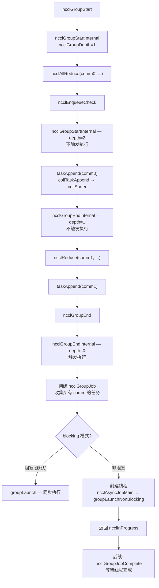
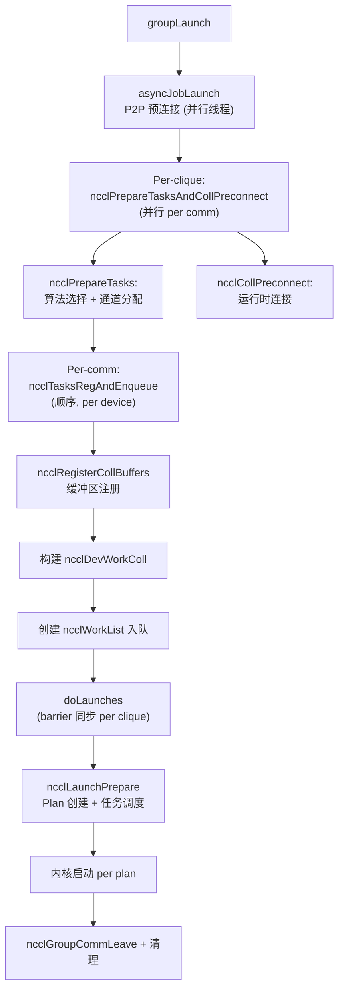
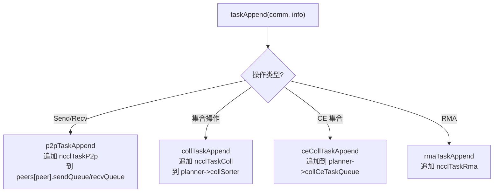
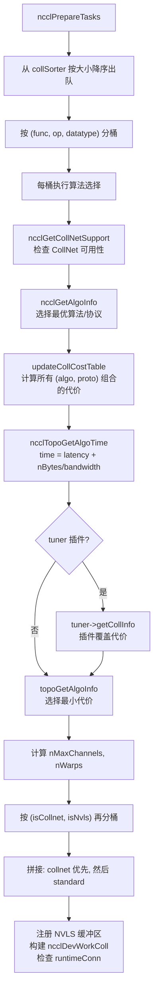
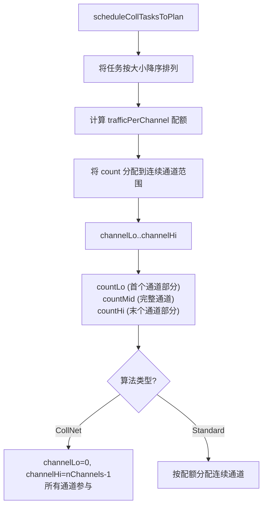
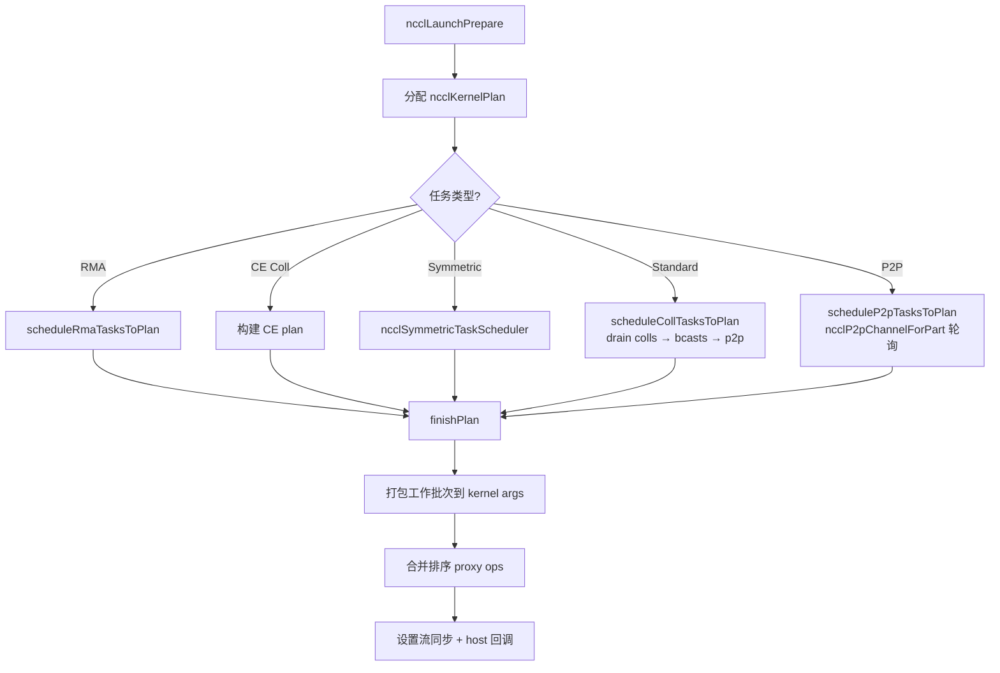
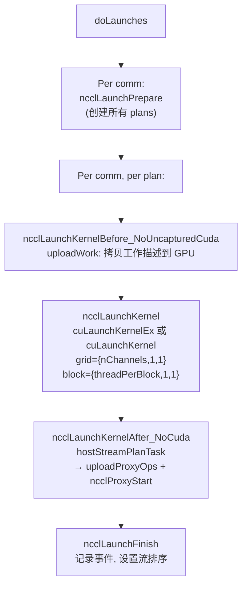
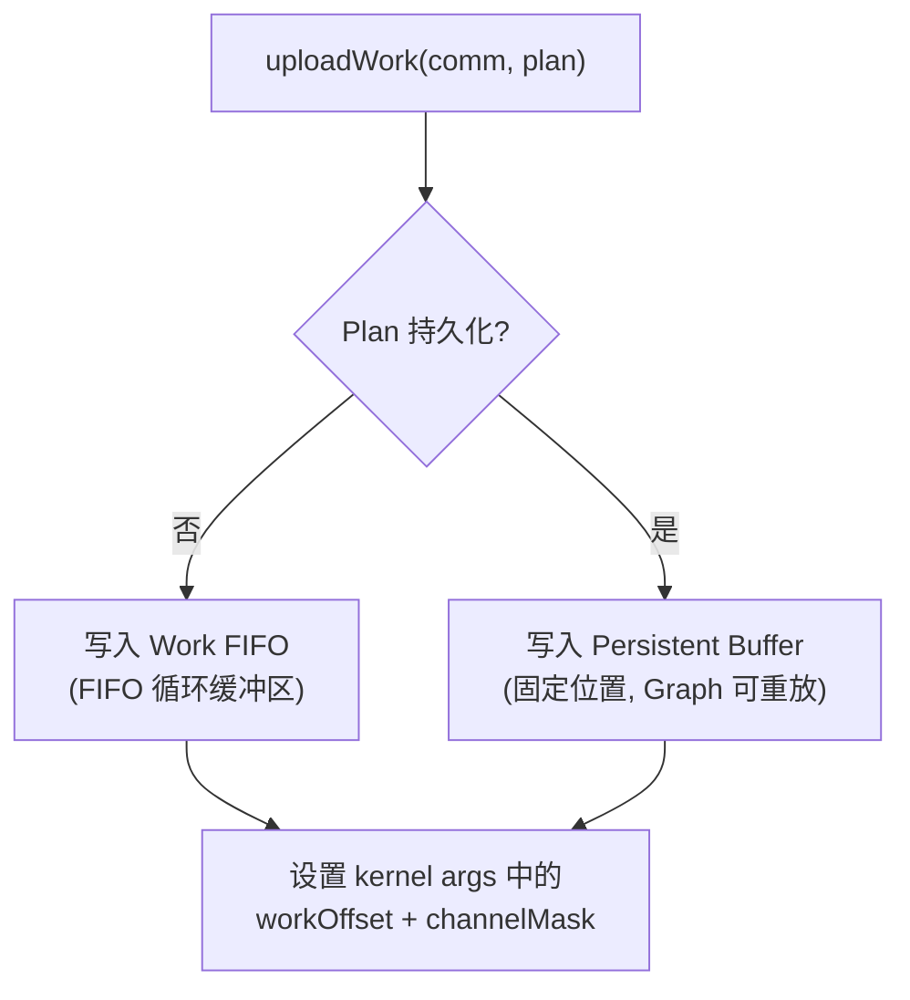

# NCCL 集合操作入队与执行

入队调度层是 NCCL 用户 API 到 GPU 内核之间的桥梁，负责任务排序、算法选择、通道分配和内核启动。

---

## 1. 单独集合操作完整流程

以 `ncclAllReduce` 为例，用户调用时 NCCL 自动包装为 group 执行：

```mermaid
flowchart TD
    A["ncclAllReduce(sendbuff, recvbuff,\ncount, datatype, op, comm, stream)"]
    A --> B["构造 ncclInfo\n{func=ncclFuncAllReduce, buffers, count, ...}"]
    B --> C["ncclEnqueueCheck(&info)"]

    C --> C1["CommCheck — 通信器有效性"]
    C1 --> C2["ncclGroupStartInternal — depth=1"]
    C2 --> C3["ncclCommEnsureReady — 确保通信器就绪"]
    C3 --> C4["ArgsCheck — 参数验证"]
    C4 --> C5["taskAppend → collTaskAppend"]
    C5 --> C6["ncclGroupCommJoin — 加入 group"]
    C6 --> C7["ncclTaskCollSorterInsert — 按大小排序插入"]
    C7 --> C8["ncclGroupEndInternal — depth=0\n触发执行"]

    C8 --> D["创建 ncclGroupJob"]
    D --> E["groupLaunch"]

    E --> E1["ncclPrepareTasks\n任务排序 + 算法选择 + 通道分配"]
    E1 --> E2["ncclCollPreconnect\n运行时通道连接 (若需要)"]
    E2 --> E3["ncclTasksRegAndEnqueue\n缓冲区注册 + 工作结构构建"]
    E3 --> E4["doLaunches\n内核启动"]

    E4 --> E4a["ncclLaunchPrepare\n创建 kernel plan"]
    E4a --> E4b["ncclLaunchKernelBefore\nuploadWork (拷贝到 GPU)"]
    E4b --> E4c["ncclLaunchKernel\ncuLaunchKernelEx (GPU 内核!)"]
    E4c --> E4d["ncclLaunchKernelAfter\nuploadProxyOps + ncclProxyStart"]
    E4d --> E4e["ncclLaunchFinish\n记录事件, 流排序"]
```

---

## 2. Group 操作流程

### 2.1 显式 Group

### 2.2 Group 内部执行

---

## 3. 任务类型与路由

---

## 4. 算法选择 (ncclPrepareTasks 内部)

### 4.1 选择流程

### 4.2 通道分配 (scheduleCollTasksToPlan)

---

## 5. Kernel Plan 构建

### 5.1 Plan 创建流程

### 5.2 工作存储类型

| 存储类型 | 用途 | 预算 |
|---------|------|------|
| `ncclDevWorkStorageTypeFifo` | 非持久化 Plan | FIFO 大小 / 2 |
| `ncclDevWorkStorageTypePersistent` | CUDA Graph 捕获的 Plan | 1 << 30 bytes |

---

## 6. 内核启动

### 6.1 启动序列

### 6.2 uploadWork 路径

---

## 7. 关键数据结构

| 结构体 | 用途 |
|--------|------|
| `ncclInfo` | API 调用参数 (func, buffers, count, datatype, op, comm, stream) |
| `ncclTaskColl` | 集合任务 (算法/协议/通道范围/工作描述) |
| `ncclTaskP2p` | P2P 任务 (peer/缓冲区/通道) |
| `ncclKernelPlan` | 内核启动计划 (工作批次 + proxy ops) |
| `ncclDevWorkColl` | 设备端集合工作描述 |
| `ncclDevWorkP2p` | 设备端 P2P 工作描述 |
| `ncclDevWorkBatch` | 设备端批次头 (每通道每 plan 一个) |
| `ncclProxyOp` | 代理操作描述 (CPU 端) |
| `ncclGroupJob` | Group 执行上下文 |
| `ncclKernelPlanner` | 每通信器规划器 (任务队列 + sorter + plan) |

---

## 8. 关键源文件

| 文件 | 行数 | 功能 |
|------|------|------|
| `src/enqueue.cc` | 3097 | 入队、任务调度、Plan 构建、内核启动 |
| `src/group.cc` | ~800 | Group 管理、groupLaunch |
| `src/collectives.cc` | ~200 | API 入口 (ncclAllReduce 等) |
| `src/include/enqueue.h` | ~50 | 入队函数声明 |
| `src/include/group.h` | ~150 | Group 内联辅助、数据结构 |
