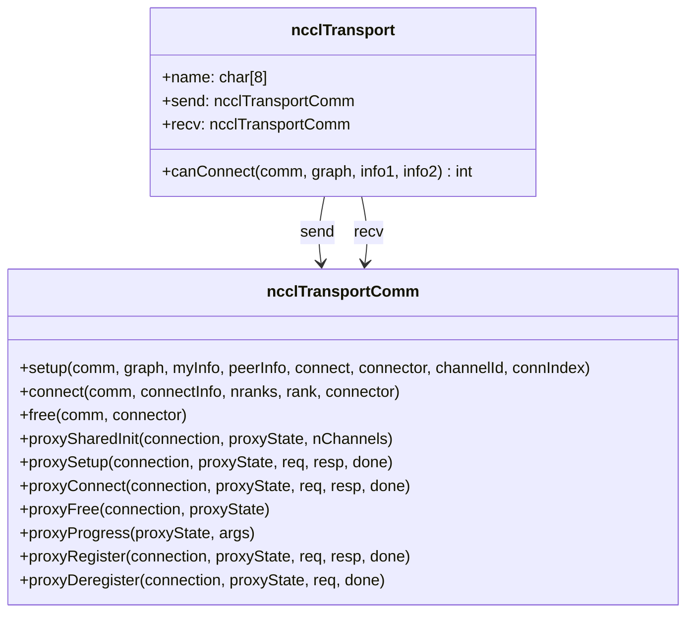
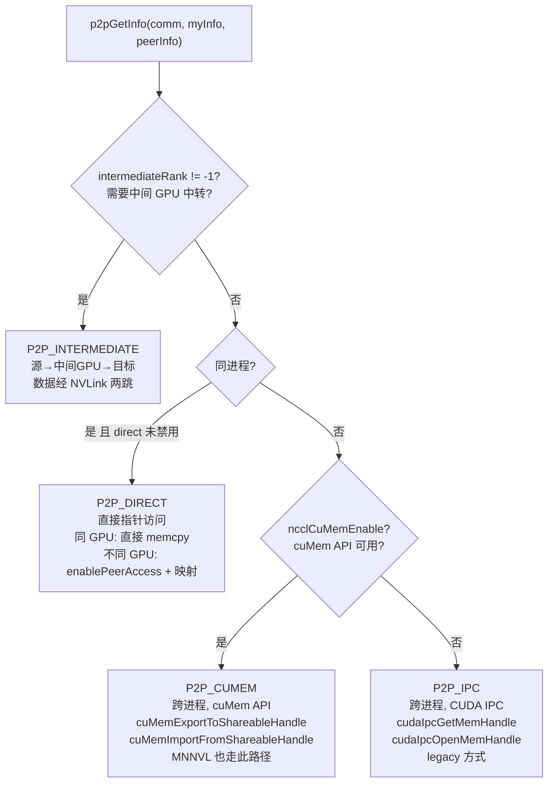
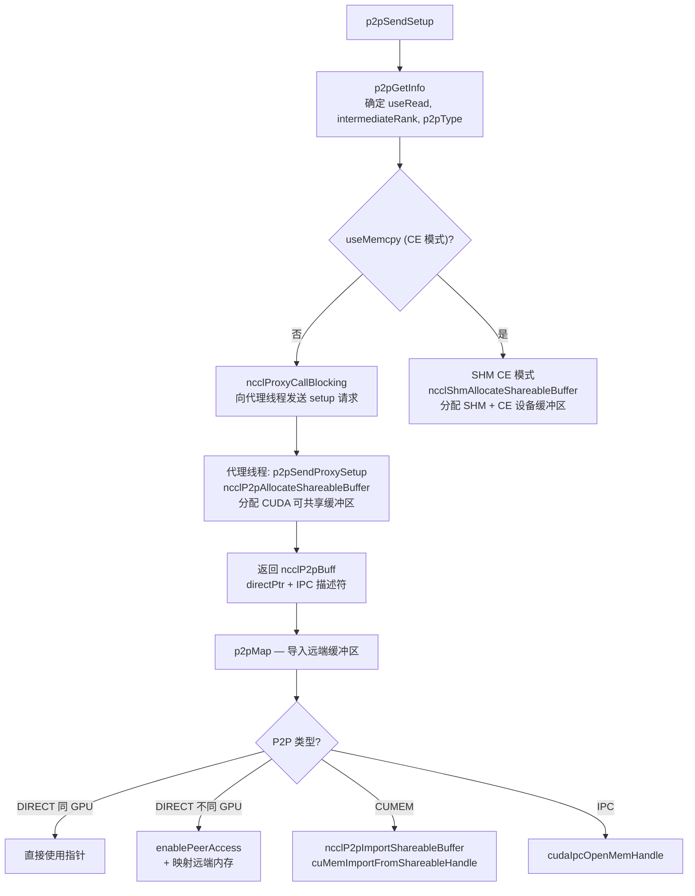
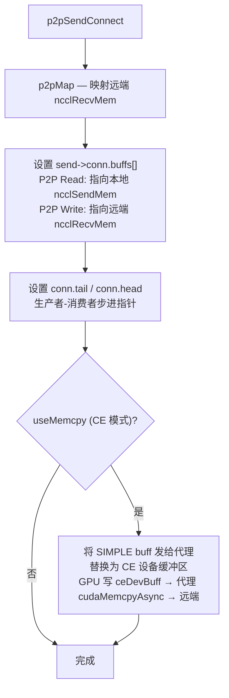
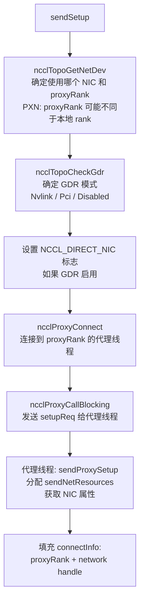
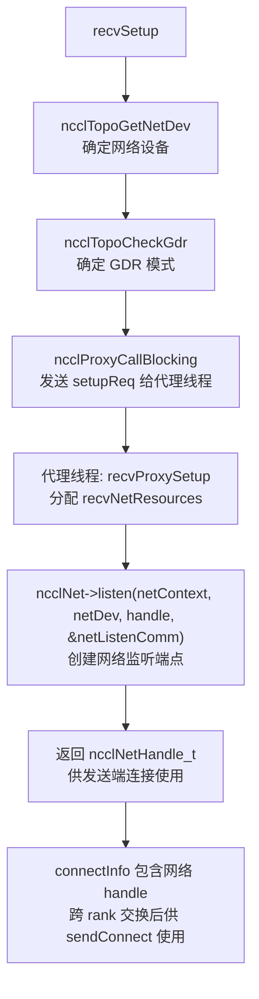
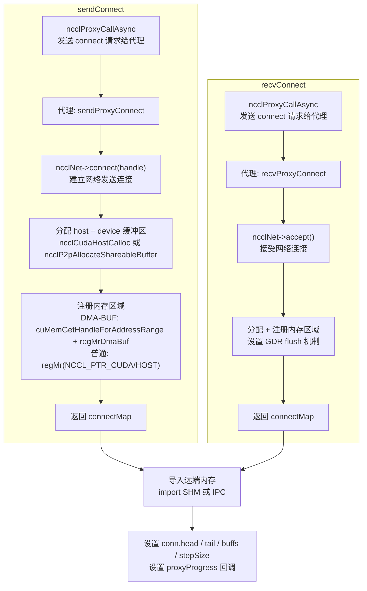
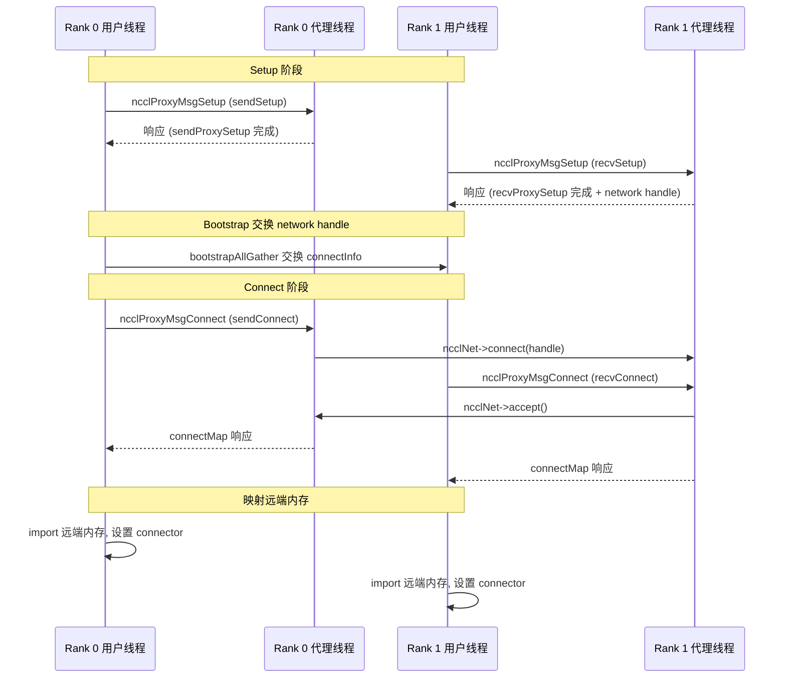

# NCCL 传输层架构

传输层是 NCCL 中数据搬运的核心抽象。所有传输实现统一的 `ncclTransport` 接口，使上层算法无需关心底层是 NVLink、PCIe、共享内存还是网络。每种传输负责连接建立、缓冲区分配、数据推进和资源释放的完整生命周期。

---

## 1. 传输接口定义

### 1.1 ncclTransport 结构

### 1.2 接口函数分类

传输接口分为**用户线程**调用和**代理线程**调用两大类，它们之间的通信通过 proxy 消息机制完成：

| 函数 | 执行线程 | 用途 |
|------|---------|------|
| `canConnect` | 用户线程 | 查询两个 rank 间能否建立连接 |
| `setup` | 用户线程 | 初始化连接、分配缓冲区、向代理发送 setup 请求 |
| `connect` | 用户线程 | 建立实际数据通路、映射远端内存 |
| `free` | 用户线程 | 释放连接器资源 |
| `proxySharedInit` | 代理线程 | 共享初始化（多通道复用） |
| `proxySetup` | 代理线程 | 代理端初始化（分配缓冲区、创建监听端点） |
| `proxyConnect` | 代理线程 | 代理端连接建立（网络连接、内存注册） |
| `proxyFree` | 代理线程 | 代理端资源释放 |
| `proxyProgress` | 代理线程 | **数据推进核心循环**，由 proxy 线程反复调用 |
| `proxyRegister` | 代理线程 | 缓冲区注册（RDMA 等） |
| `proxyDeregister` | 代理线程 | 缓冲区注销 |

用户线程和代理线程之间通过 `ncclProxyCallBlocking` / `ncclProxyCallAsync` 通信。用户线程将请求写入共享内存，代理线程读取请求、执行操作、写入响应。

---

## 2. 五种传输类型

| 传输 | ID | 名称 | 节点范围 | proxyProgress | 典型带宽 |
|------|---|------|---------|---------------|---------|
| P2P | 0 | "P2P" | 节点内 | 仅 CE memcpy 模式 | NVLink: 20-40 GB/s |
| SHM | 1 | "SHM" | 节点内 | 有 | 内存带宽 |
| NET | 2 | "NET" | 跨节点 | 有（核心） | IB: 12.5-25 GB/s |
| COLLNET | 3 | "CollNet" | 跨节点 | 有 | 取决于 SHARP |
| NVLS | — | "NVLS" | 节点内 | — | NVLink multicast |

---

## 3. P2P 传输

P2P 传输用于节点内 GPU 间通信，根据进程关系和硬件能力自动选择最优路径。

### 3.1 P2P 类型判定

P2P 的读写方向由拓扑决定：Ampere+ 架构的 NVLink 连接默认使用 P2P Read（GPU 直接读取远端数据），因为 Read 在 NVLink 上效率更高。其他情况使用 P2P Write（GPU 写入远端缓冲区）。用户可通过 `NCCL_P2P_READ_ENABLE` 覆盖。

### 3.2 P2P Send Setup 流程

### 3.3 P2P Connect 流程

CE (Copy Engine) 模式是一种特殊的 P2P 路径：GPU 不直接访问远端内存，而是写入本地 CE 缓冲区，由代理线程通过 `cudaMemcpyAsync` 将数据复制到远端。这在某些硬件配置下（如 PCIe 拓扑不佳）可能比直接 P2P 更高效。

---

## 4. NET 传输

NET 传输用于跨节点通信，是 NCCL 中最复杂的传输类型。它依赖网络插件（IB 或 Socket）和代理线程来推进数据传输。

### 4.1 Send Setup 流程

### 4.2 Recv Setup 流程

### 4.3 NET Connect 流程

NET Connect 是异步的，使用 `ncclProxyCallAsync` 和 `ncclPollProxyResponse`。

### 4.4 NET Proxy Progress

NET 代理推进是网络数据传输的核心，分为发送和接收两个方向：

**sendProxyProgress** 三个阶段：
1. **Post to GPU**：为共享模式计算缓冲区偏移，推进 `sendHead`
2. **Send to network**：检查 GPU 数据是否就绪（`connFifo[buffSlot].size != -1`），调用 `ncclNet->isend` 发送数据
3. **Completion**：调用 `ncclNet->test` 检查发送完成，完成后重置 FIFO 槽

**recvProxyProgress** 四个阶段：
1. **Post receives**：调用 `ncclNet->irecv` 发布接收缓冲区
2. **Network completion**：调用 `ncclNet->test` 检查接收完成，如果需要 GDR flush 则执行
3. **Flush completion**：检查 flush 完成，更新 `recvTail` 通知 GPU
4. **GPU acknowledgment**：读取 `sendMem->head` 确认 GPU 已消费数据

### 4.5 GDR (GPUDirect RDMA)

GDR 允许 NIC 直接访问 GPU 内存，避免数据经 CPU 中转。GDR 模式由 `ncclTopoCheckGdr` 确定：

- **NVLink GDR**：GPU 通过 C2C/NVLink 路径到 NIC，最高性能
- **PCIe GDR**：GPU 通过 PCIe 路径到 NIC，需要 DMA-BUF 映射

GDR Flush 机制确保 NIC 的 DMA 写入对 GPU 可见：
- **GDRcopy flush**：通过 PCIe 读操作确保可见性
- **Network flush**：通过 `ncclNet->iflush` 请求
- **GDRcopy sync**：将同步变量放在 GPU 可直接访问的内存中

---

## 5. SHM 传输

SHM 传输用于同节点、跨进程的 GPU 间通信，通过 `/dev/shm` 共享内存实现。

- **canConnect**：仅当两个 peer 的 `hostHash` 和 `shmDev` 相同时返回 1
- **缓冲区分配**：优先使用 cuMem host API，否则创建 `/dev/shm/nccl-*` 文件
- **CE memcpy 模式**：代理线程通过 `cudaMemcpyAsync` 在设备缓冲区和 SHM 缓冲区之间复制数据
- **连接流程**：Setup 创建 SHM 缓冲区并返回 IPC 描述符，Connect 导入远端 SHM 缓冲区

---

## 6. NVLS 传输

NVLS (NVLink SHARP) 利用 NVSwitch 的硬件多播/归约能力，实现高效的集合操作加速。

- **canConnect**：始终返回 0（NVLS 不用于 P2P）
- **内存模型**：每个 rank 有 UC (Unicast) 和 MC (Multicast) 两种内存
  - UC：物理设备内存，通过 `cuMemCreate` + `cuMemMap` 分配
  - MC：多播组内存，通过 `cuMulticastCreate` 创建，所有 rank 通过 `cuMulticastAddDevice` 加入，通过 `cuMulticastBindMem` 绑定 UC 内存
- **数据流**：ReduceScatter 时，各 rank 写入 MC 缓冲区，NVSwitch 硬件自动归约；Broadcast 时，从 MC 缓冲区读取
- **缓冲区注册**：用户缓冲区可通过 `cuMulticastBindAddr` 直接绑定到 MC 组，避免中间拷贝

---

## 7. CollNet 传输

CollNet 传输将集合操作卸载到网络侧的 SHARP/Switch 硬件。

- **canConnect**：始终返回 0（CollNet 不用于 P2P）
- **N-way 连接**：与 NET 的 1:1 连接不同，CollNet 使用集合式连接——所有 rank 的 handle 传递给代理，代理调用 `ncclCollNet->connect` 创建集合通信器
- **代理推进**：发送端调用 `collNetIallreduce` / `collNetIallgather` / `collNetIreducescatter`，接收端等待完成并处理 GDR flush
- **注册缓冲区路径**：用户缓冲区可直接注册到网络插件，SHARP 硬件直接访问，避免中间拷贝

---

## 8. 传输连接建立总体序列

一次完整的跨节点集合操作连接建立序列：

---

## 9. 关键环境变量

| 变量 | 说明 |
|------|------|
| `NCCL_P2P_DISABLE` | 禁用 P2P 直连 |
| `NCCL_P2P_LEVEL` | 覆盖 P2P 路径类型阈值 |
| `NCCL_P2P_READ_ENABLE` | 覆盖 P2P Read/Write 方向 |
| `NCCL_P2P_DIRECT_DISABLE` | 禁用 P2P 直接指针访问 |
| `NCCL_SHM_DISABLE` | 禁用 SHM 传输 |
| `NCCL_P2P_USE_CUDA_MEMCPY` | 启用 CE memcpy 模式 |
| `NCCL_NET_GDR_LEVEL` | GPUDirect RDMA 级别 |
| `NCCL_GDRCOPY_FLUSH_ENABLE` | GDRcopy flush |
| `NCCL_GDRCOPY_SYNC_ENABLE` | GDRcopy sync |
| `NCCL_NVLS_ENABLE` | NVLS 启用 (0/1/2=auto) |

---

## 10. 关键源文件

| 文件 | 行数 | 功能 |
|------|------|------|
| `src/include/transport.h` | ~250 | ncclTransport / ncclTransportComm 接口定义 |
| `src/transport/p2p.cc` | ~1300 | P2P 传输实现，含 CE memcpy、IPC 注册 |
| `src/transport/shm.cc` | ~800 | SHM 传输实现，含 CE memcpy |
| `src/transport/net.cc` | ~1900 | NET 传输实现，含 GDR、DMA-BUF |
| `src/transport/net_socket.cc` | ~600 | NET Socket 后端 |
| `src/transport/net_ib/` | ~2000 | NET IB 后端 |
| `src/transport/coll_net.cc` | ~1200 | CollNet 传输实现 |
| `src/transport/nvls.cc` | ~800 | NVLS 传输实现 |
