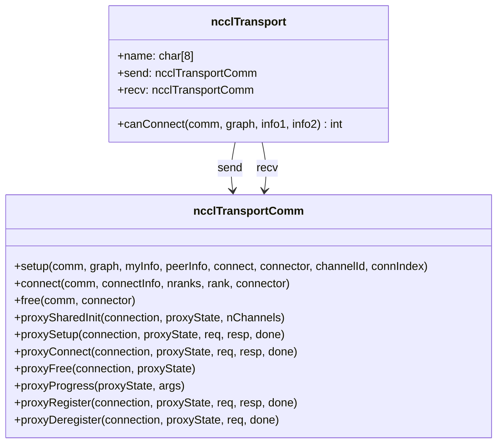
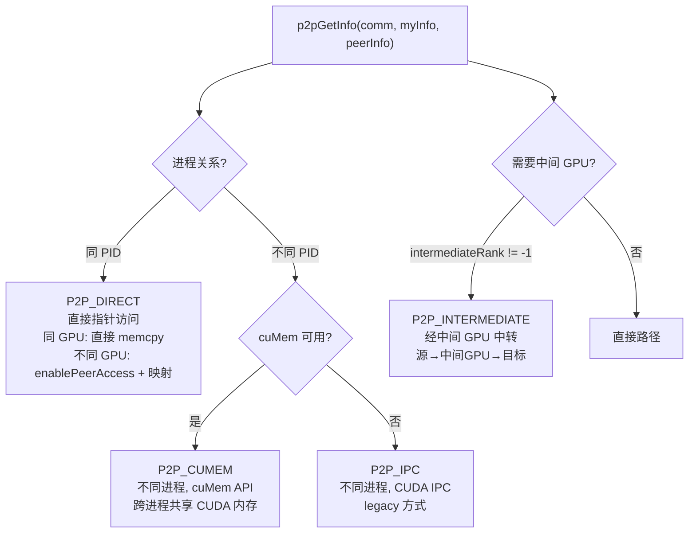
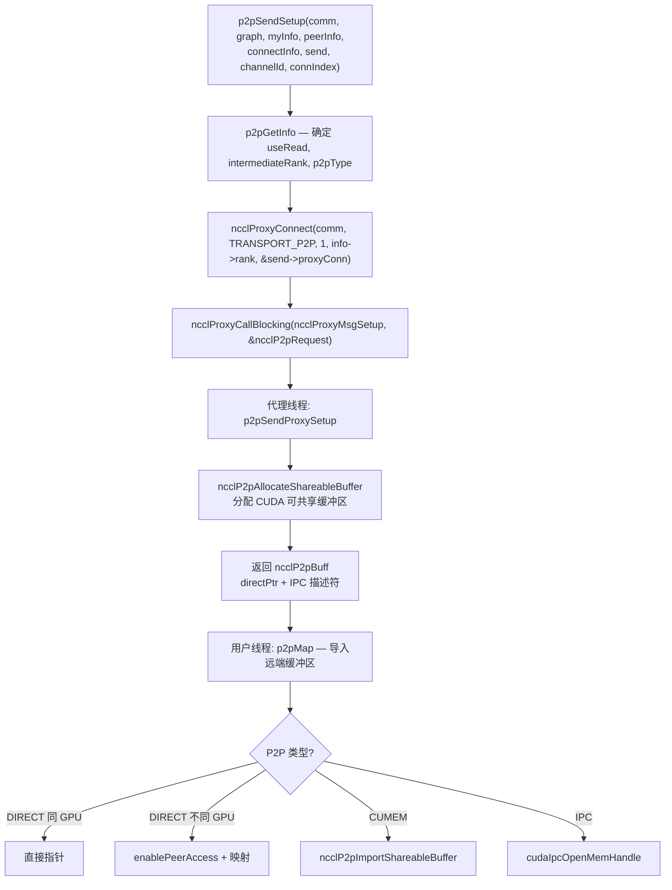
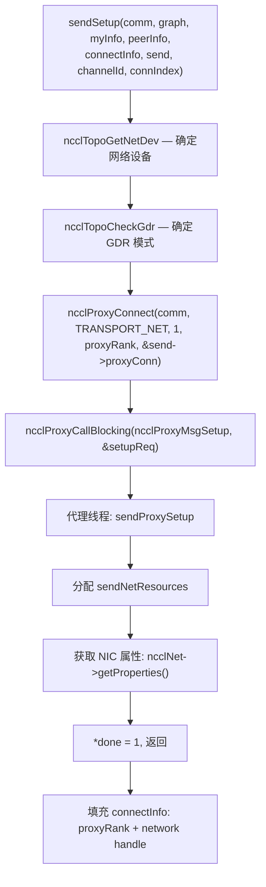
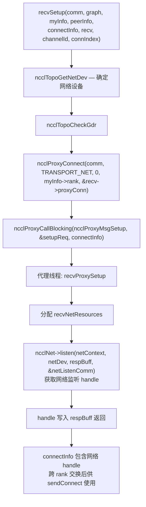
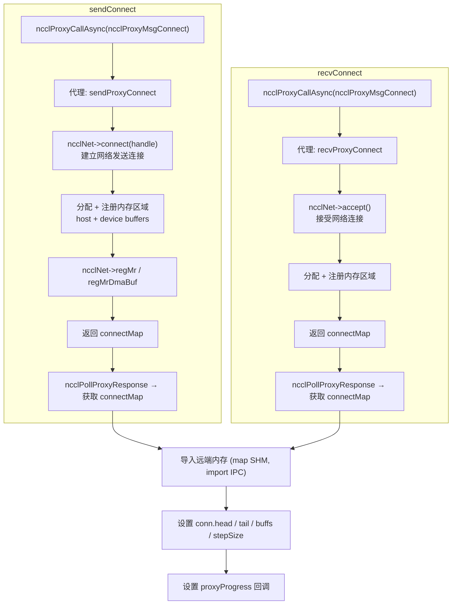
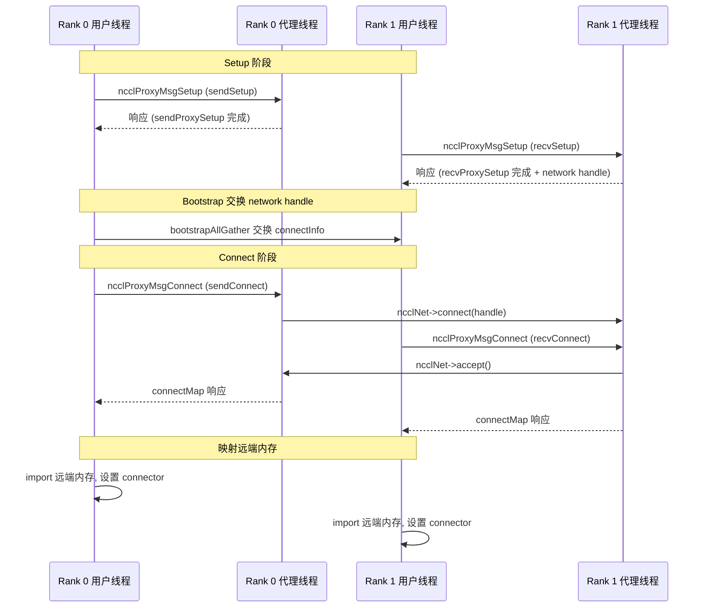

# NCCL 传输层架构

传输层是 NCCL 中数据搬运的核心抽象。所有传输实现统一的 `ncclTransport` 接口，使上层算法无需关心底层是 NVLink、PCIe、共享内存还是网络。

---

## 1. 传输接口定义

### 1.1 ncclTransport 结构



### 1.2 接口函数分类

| 函数 | 执行线程 | 用途 |
|------|---------|------|
| `canConnect` | 用户线程 | 查询两个 rank 间能否建立连接 |
| `setup` | 用户线程 | 初始化连接、分配缓冲区、与代理通信 |
| `connect` | 用户线程 | 建立实际数据通路、映射远端内存 |
| `free` | 用户线程 | 释放连接器资源 |
| `proxySharedInit` | 代理线程 | 共享初始化 (多通道复用) |
| `proxySetup` | 代理线程 | 代理端初始化 (分配缓冲区、监听) |
| `proxyConnect` | 代理线程 | 代理端连接建立 (网络连接、内存注册) |
| `proxyFree` | 代理线程 | 代理端资源释放 |
| `proxyProgress` | 代理线程 | 数据推进核心循环 |
| `proxyRegister` | 代理线程 | 缓冲区注册 |
| `proxyDeregister` | 代理线程 | 缓冲区注销 |

---

## 2. 五种传输类型

| 传输 | ID | 名称 | 节点范围 | proxyProgress | 典型带宽 |
|------|---|------|---------|---------------|---------|
| P2P | 0 | "P2P" | 节点内 | 仅 CE memcpy 模式 | NVLink: 20-40 GB/s |
| SHM | 1 | "SHM" | 节点内 | 有 | 内存带宽 |
| NET | 2 | "NET" | 跨节点 | 有 (核心) | IB: 12.5-25 GB/s |
| COLLNET | 3 | "CollNet" | 跨节点 | 有 | 取决于 SHARP |
| NVLS | — | "NVLS" | 节点内 | — | NVLink multicast |

---

## 3. P2P 传输

### 3.1 P2P 类型



### 3.2 P2P Send Setup 流程



### 3.3 P2P Connect 流程

```mermaid
flowchart TD
    A["p2pSendConnect(comm, connectInfo, nranks, rank, send)"]
    A --> B["p2pMap — 映射远端内存 → remDevMem"]
    B --> C["设置 send->conn.buffs[]\n从远端内存"]
    C --> D["设置 conn.tail / conn.head / conn.ptrExchange"]
    D --> E{useMemcpy (CE 模式)?}
    E -->|"是"| F["ncclProxyCallBlocking(ncclProxyMsgConnect)\n替换 SIMPLE buff 为 CE 设备缓冲区"]
    E -->|"否"| G["完成"]
    F --> G
```

---

## 4. NET 传输

### 4.1 Send Setup 流程



### 4.2 Recv Setup 流程



### 4.3 NET Connect 流程



---

## 5. 传输连接建立总体序列

一次完整的跨节点集合操作连接建立序列：



---

## 6. 关键源文件

| 文件 | 行数 | 功能 |
|------|------|------|
| `src/include/transport.h` | ~250 | ncclTransport / ncclTransportComm 接口定义 |
| `src/transport/p2p.cc` | ~1300 | P2P 传输实现 |
| `src/transport/shm.cc` | ~800 | SHM 传输实现 |
| `src/transport/net.cc` | ~1900 | NET 传输实现 |
| `src/transport/net_socket.cc` | ~600 | NET Socket 后端 |
| `src/transport/net_ib/` | ~2000 | NET IB 后端 |
| `src/transport/coll_net.cc` | ~1200 | CollNet 传输实现 |
| `src/transport/nvls.cc` | ~800 | NVLS 传输实现 |
