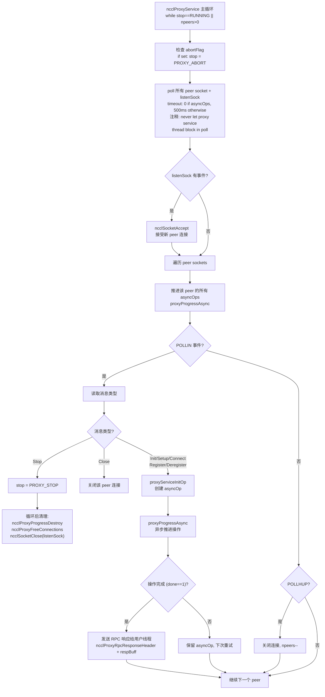
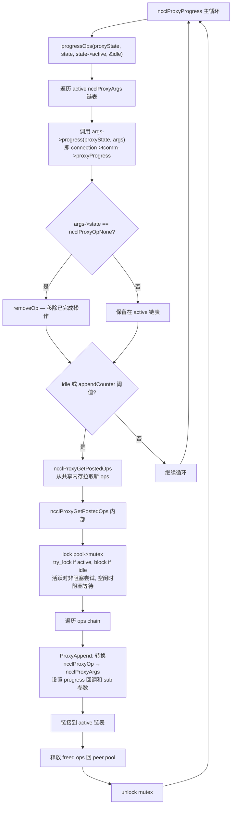
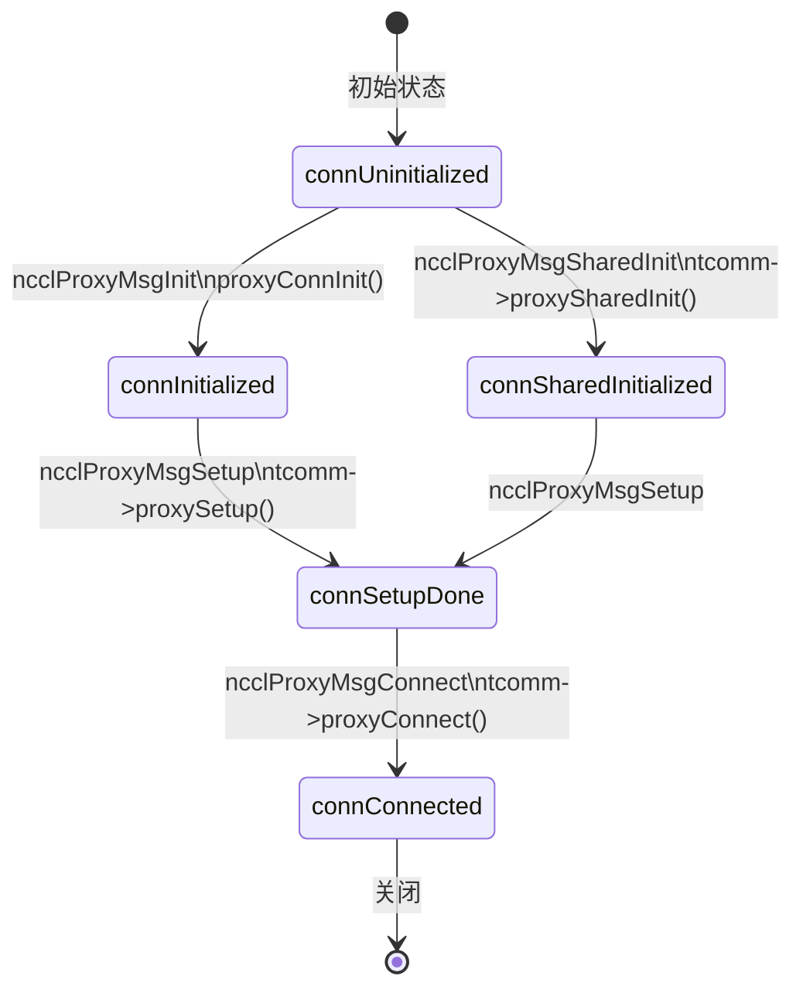
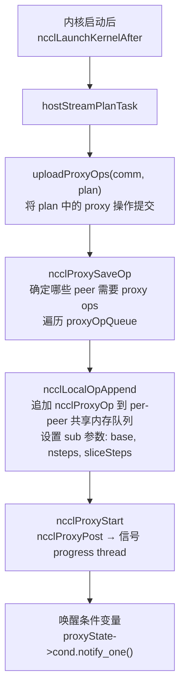
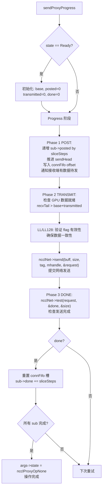
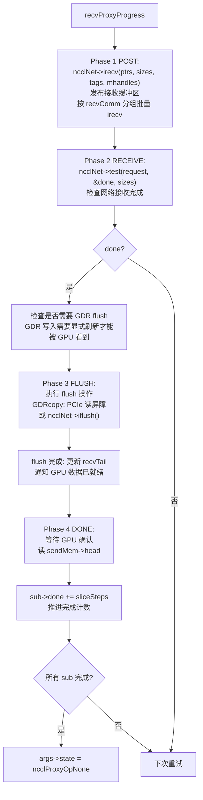

# NCCL 代理线程架构

代理线程负责主机端的数据推进，特别是 NET 和 SHM 传输的发送/接收操作。GPU 内核只负责在 GPU 侧读写缓冲区，实际的网络 I/O 由代理线程完成。这种架构的核心原因是：网络操作（如 IB Verbs 的 send/recv）需要在 CPU 端调用，GPU 内核无法直接发起网络 I/O。

---

## 1. 三线程模型

每个 GPU 设备运行三个代理线程，各司其职：

| 线程 | 入口函数 | 职责 |
|------|---------|------|
| Service | ncclProxyService | 接受连接、处理 RPC、创建异步操作 |
| Progress | ncclProxyProgress | 拉取操作、执行数据推进 |
| UDS | ncclProxyServiceUDS | Unix Domain Socket 处理 cuMem FD |

三线程分离的关键设计理念：Service 线程处理连接建立等低频控制操作，Progress 线程专注于高频的数据推进，两者互不阻塞。UDS 线程处理 cuMem 文件描述符交换，这是一种特殊的跨进程内存共享机制。

---

## 2. Service Thread 主循环

Service 线程是代理的控制面，通过 poll() 多路复用处理来自所有 peer 的 RPC 请求。

Service 线程的关键设计：**永不阻塞**。poll 超时设置为 0（有异步操作时）或 500ms（无操作时），确保 abortFlag 能被及时检查。如果有异步操作正在进行，使用 0 超时实现忙等，避免延迟数据推进。

---

## 3. Progress Thread 主循环

Progress 线程是代理的数据面，负责实际的网络 I/O。

Progress 线程的锁策略很精巧：当有活跃操作时，使用 `try_lock` 非阻塞获取 mutex，避免阻塞数据推进；当空闲时，阻塞等待 mutex，让 CPU 可以休眠。`appendCounter` 阈值机制确保不会频繁获取 mutex：每隔一定次数的操作推进后才拉取新操作。

---

## 4. 连接状态机

代理连接经历从初始化到就绪的状态转换：

- **SharedInit** 路径用于多通道共享同一个连接资源（如 NET 传输中多个通道共用一个网络连接）
- **Init** 路径为每个通道创建独立连接
- 只有到达 `connConnected` 状态后，连接才能用于数据传输

---

## 5. RPC 协议

用户线程和代理线程之间通过 socket 进行 RPC 通信，采用请求-响应模式。

### 5.1 请求格式

| 字段 | 类型 | 说明 |
|------|------|------|
| type | int | 消息类型 (Init/Setup/Connect/Register/...) |
| connection | void* | 代理端连接标识 |
| reqSize | int | 请求体大小 |
| respSize | int | 期望响应体大小 |
| reqBuff | bytes | 请求体数据 |
| opId | void* | 操作标识，用于匹配响应 |

### 5.2 响应格式

| 字段 | 类型 | 说明 |
|------|------|------|
| opId | void* | 匹配请求的操作标识 |
| res | ncclResult_t | 操作结果 |
| respSize | int | 响应体大小 |
| respBuff | bytes | 响应体数据 |

异步操作模式：用户线程通过 `ncclProxyCallAsync` 发送请求后，可以继续做其他工作，稍后通过 `ncclPollProxyResponse` 接收响应。阻塞模式 `ncclProxyCallBlocking` 则循环等待直到收到响应。

---

## 6. 数据推进路径

### 6.1 从内核启动到代理提交

### 6.2 NET Send Proxy Progress

发送端代理推进分为三个阶段，采用流水线设计：

### 6.3 NET Recv Proxy Progress

接收端代理推进分为四个阶段：

接收端的 GDR flush 是性能关键路径。当 NIC 通过 RDMA 直接写入 GPU 内存时，GPU 可能看不到最新数据（因为 PCIe 写入可能被缓存）。flush 操作通过读取 GPU 内存的某个地址来强制刷新 PCIe 缓冲区，确保 GPU 能看到所有数据。

---

## 7. 代理消息类型

| 类型 | 值 | 处理函数 | 用途 |
|------|---|---------|------|
| ncclProxyMsgInit | 1 | proxyConnInit | 创建新连接 |
| ncclProxyMsgSharedInit | 2 | tcomm->proxySharedInit | 多通道共享初始化 |
| ncclProxyMsgSetup | 3 | tcomm->proxySetup | 代理端初始化（分配缓冲区/监听） |
| ncclProxyMsgConnect | 4 | tcomm->proxyConnect | 建立数据通路（网络连接/内存注册） |
| ncclProxyMsgClose | 6 | 关闭连接 | 关闭 peer 连接 |
| ncclProxyMsgAbort | 7 | 中止操作 | 异常终止 |
| ncclProxyMsgStop | 8 | 停止线程 | 终止 Service 线程 |
| ncclProxyMsgGetFd | 9 | proxyGetFd | UDS: 获取 cuMem FD |
| ncclProxyMsgQueryFd | 10 | proxyQueryFd | UDS: 查询 FD |
| ncclProxyMsgRegister | 11 | tcomm->proxyRegister | 缓冲区注册 |
| ncclProxyMsgDeregister | 12 | tcomm->proxyDeregister | 缓冲区注销 |

---

## 8. 关键数据结构

| 结构体 | 文件 | 用途 |
|--------|------|------|
| `ncclProxyState` | proxy.h | 代理全局状态（线程、socket、操作池、条件变量） |
| `ncclProxyConnection` | proxy.h | 每连接代理端状态（transportResources, tcomm, 连接状态） |
| `ncclProxyArgs` | proxy.h | 进度操作结构（subs[], progress 回调, 状态, done 计数） |
| `ncclProxySubArgs` | proxy.h | 子操作（connection, base, posted/received/transmitted/done, requests） |
| `ncclProxyOp` | proxy.h | 共享内存中的操作描述（由用户线程写入，Progress 线程读取） |
| `ncclProxyPool` | proxy.h | per-peer 共享内存操作队列（mutex 保护） |

---

## 9. 关键源文件

| 文件 | 行数 | 功能 |
|------|------|------|
| `src/proxy.cc` | 1967 | 代理线程完整实现：Service/Progress/UDS 主循环、RPC 处理、操作调度 |
| `src/include/proxy.h` | ~450 | 代理数据结构和声明 |
