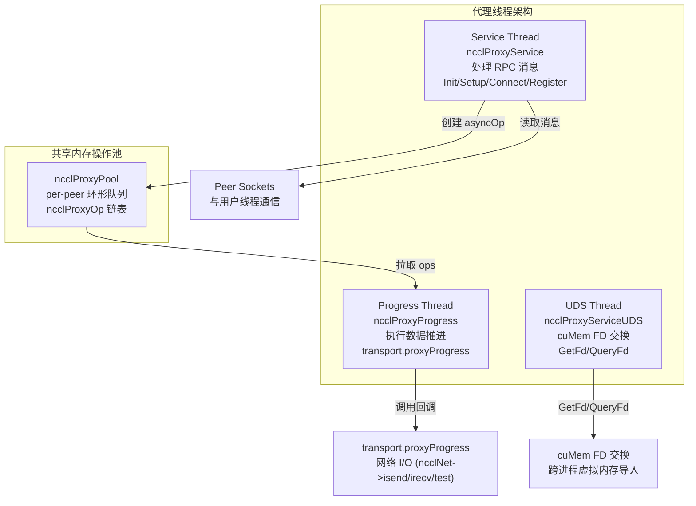
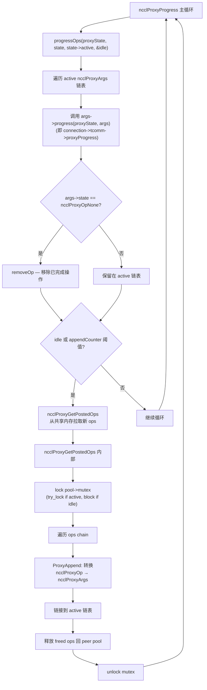
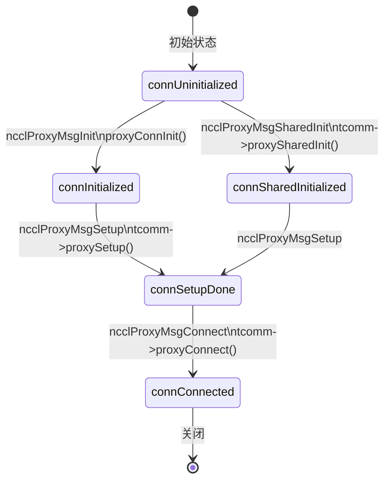
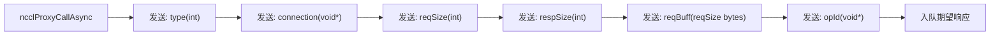
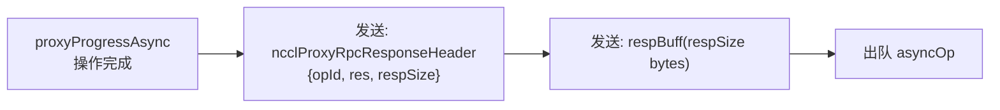
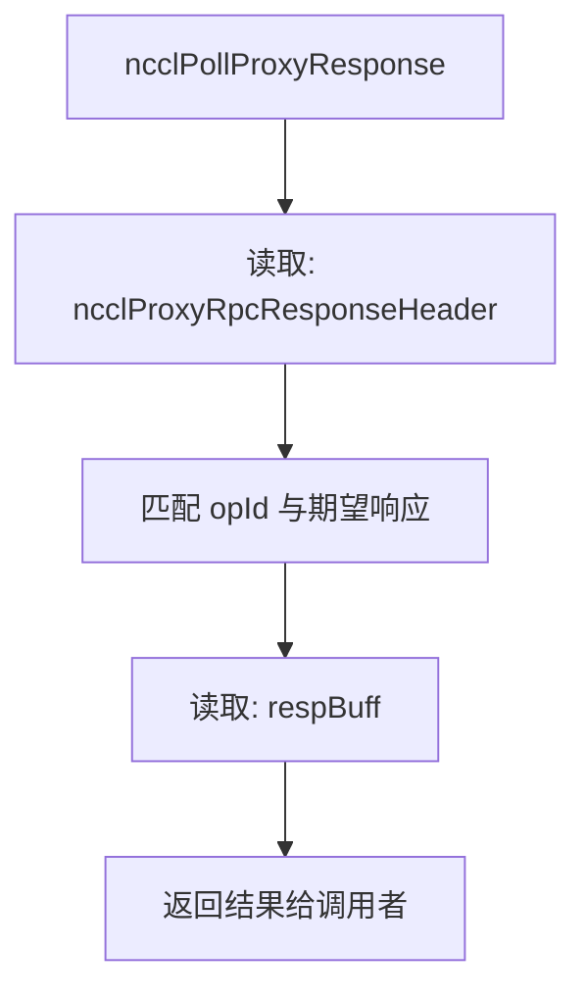
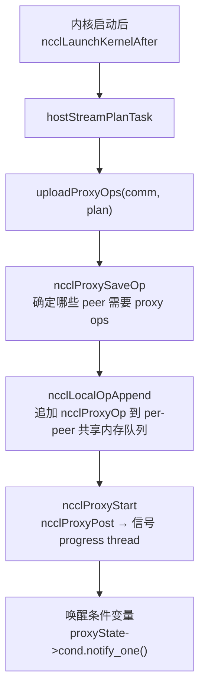
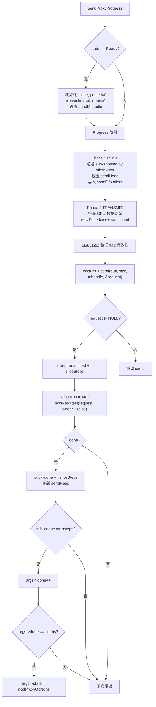
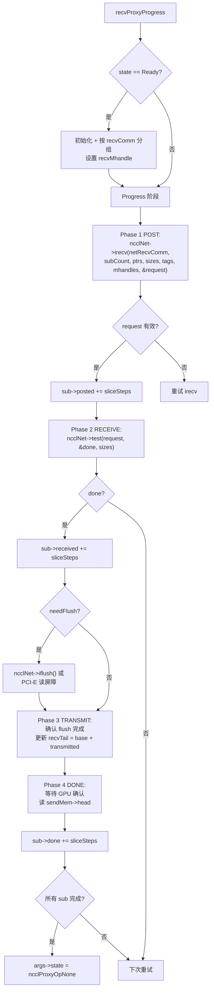

# NCCL 代理线程架构

代理线程负责主机端的数据推进，特别是 NET 和 SHM 传输的发送/接收操作。GPU 内核只负责在 GPU 侧读写缓冲区，实际的网络 I/O 由代理线程完成。

---

## 1. 三线程模型

每个 GPU 设备运行三个代理线程：



| 线程 | 入口函数 | 职责 |
|------|---------|------|
| Service | ncclProxyService | 接受连接、处理 RPC、创建异步操作 |
| Progress | ncclProxyProgress | 拉取操作、执行数据推进 |
| UDS | ncclProxyServiceUDS | Unix Domain Socket 处理 cuMem FD |

---

## 2. Service Thread 主循环

```mermaid
flowchart TD
    A["ncclProxyService 主循环\nwhile (stop==RUNNING || npeers>0)"] --> B["检查 abortFlag\nif set: stop = PROXY_ABORT"]

    B --> C["poll() 所有 peer socket + listenSock\ntimeout: 0 if asyncOps, 500ms otherwise"]

    C --> D{listenSock 有事件?}
    D -->|"是"| E["ncclSocketAccept\n接受新 peer 连接\npeers[s], pollfds[s]"]
    D -->|"否"| F["遍历 peer sockets"]
    E --> F

    F --> G["推进该 peer 的所有 asyncOps\nproxyProgressAsync"]

    G --> H{POLLIN 事件?}
    H -->|"是"| I["读取消息类型"]
    H -->|"否"| J{POLLHUP?}
    J -->|"是"| K["关闭连接\nnpeers--"]
    J -->|"否"| L["继续下一个 peer"]

    I --> M{消息类型?}
    M -->|Stop| N["stop = PROXY_STOP"]
    M -->|Close| O["关闭该 peer 连接"]
    M -->|Init/Setup/Connect\nRegister/Deregister| P["proxyServiceInitOp\n创建 asyncOp"]
    P --> Q["proxyProgressAsync\n异步推进操作"]

    Q --> R{操作完成 (done=1)?}
    R -->|"是"| S["发送 RPC 响应给用户线程\nncclProxyRpcResponseHeader + respBuff"]
    R -->|"否"| T["保留 asyncOp\n下次重试"]

    S --> L
    T --> L
    K --> L
    N --> U["循环后清理:\nncclProxyProgressDestroy\nncclProxyFreeConnections\nncclSocketClose(listenSock)"]
```

---

## 3. Progress Thread 主循环



---

## 4. 连接状态机



---

## 5. RPC 协议

### 5.1 用户线程 → 代理线程 (请求)



### 5.2 代理线程 → 用户线程 (响应)



### 5.3 用户线程接收响应



---

## 6. 数据推进路径

### 6.1 用户线程到代理线程的操作提交



### 6.2 NET Send Proxy Progress



### 6.3 NET Recv Proxy Progress



---

## 7. 代理消息类型

| 类型 | 值 | 处理函数 | 用途 |
|------|---|---------|------|
| ncclProxyMsgInit | 1 | proxyConnInit | 创建新连接 |
| ncclProxyMsgSharedInit | 2 | tcomm->proxySharedInit | 多通道共享初始化 |
| ncclProxyMsgSetup | 3 | tcomm->proxySetup | 代理端初始化 |
| ncclProxyMsgConnect | 4 | tcomm->proxyConnect | 建立数据通路 |
| ncclProxyMsgStart | 5 | (未使用) | — |
| ncclProxyMsgClose | 6 | 关闭连接 | 关闭 peer 连接 |
| ncclProxyMsgAbort | 7 | 中止操作 | 异常终止 |
| ncclProxyMsgStop | 8 | 停止线程 | 终止 Service 线程 |
| ncclProxyMsgGetFd | 9 | proxyGetFd | UDS: 获取 cuMem FD |
| ncclProxyMsgQueryFd | 10 | proxyQueryFd | UDS: 查询 FD |
| ncclProxyMsgRegister | 11 | tcomm->proxyRegister | 缓冲区注册 |
| ncclProxyMsgDeregister | 12 | tcomm->proxyDeregister | 缓冲区注销 |

---

## 8. 关键数据结构

| 结构体 | 文件 | 用途 |
|--------|------|------|
| `ncclProxyState` | proxy.h | 代理全局状态 (线程、socket、操作池) |
| `ncclProxyConnection` | proxy.h | 每连接代理端状态 (transportResources, tcomm, 连接状态) |
| `ncclProxyArgs` | proxy.h | 进度操作结构 (subs[], progress 回调, 状态) |
| `ncclProxySubArgs` | proxy.h | 子操作 (connection, base, posted/received/transmitted/done, requests[]) |
| `ncclProxyOp` | proxy.h | 共享内存中的操作描述 |
| `ncclProxyPool` | proxy.h | per-peer 共享内存操作队列 |

---

## 9. 关键源文件

| 文件 | 行数 | 功能 |
|------|------|------|
| `src/proxy.cc` | 1967 | 代理线程完整实现 |
| `src/include/proxy.h` | ~450 | 代理数据结构和声明 |
