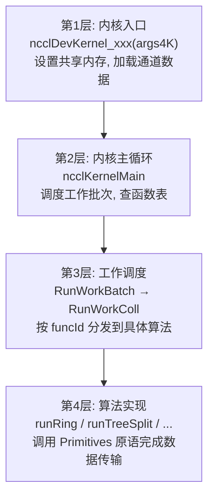
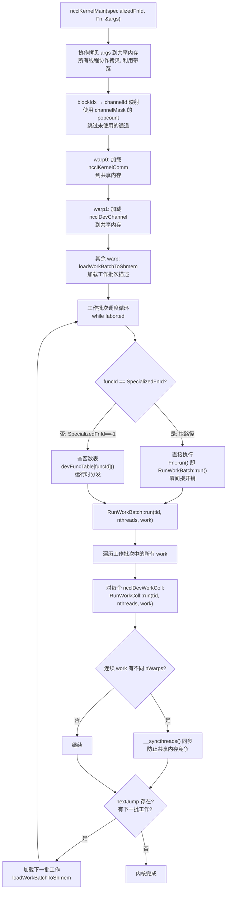
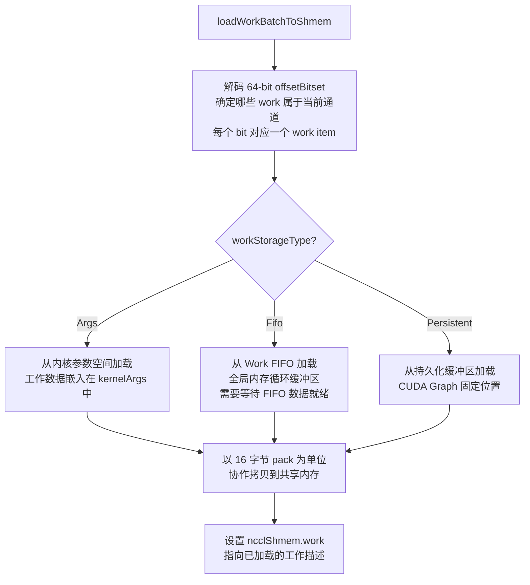
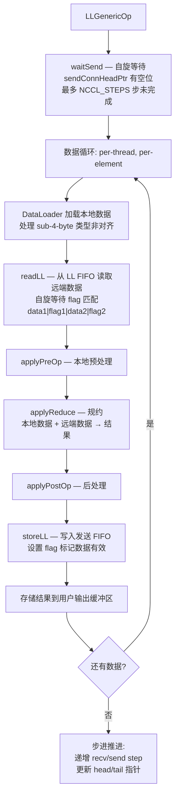
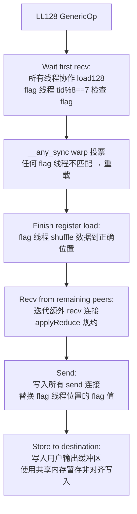
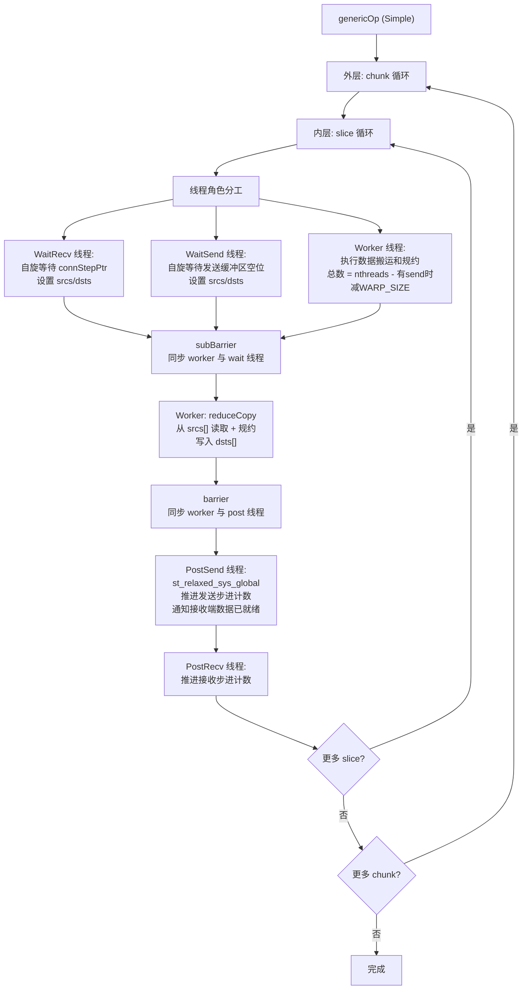
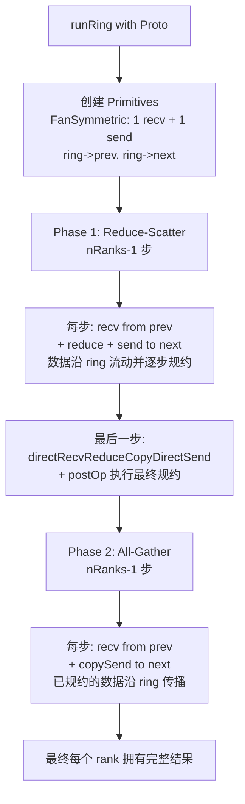
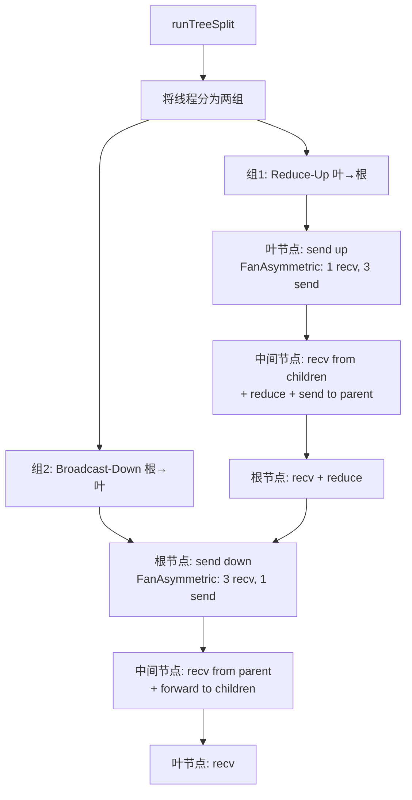
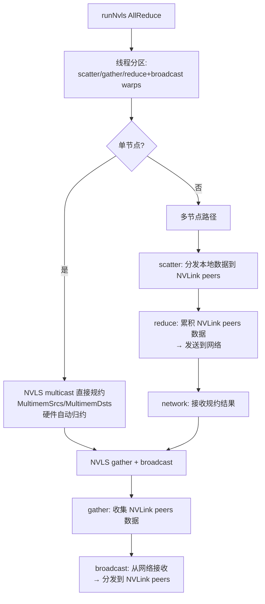
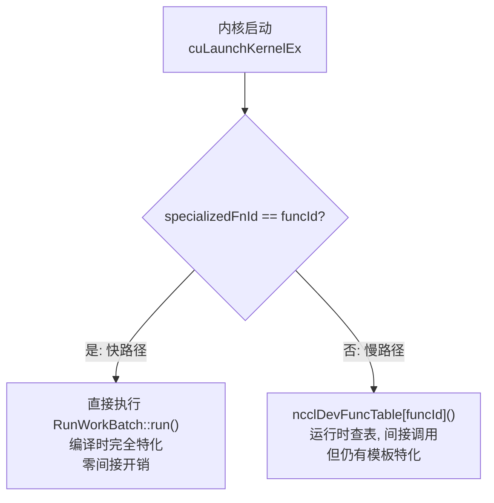

# NCCL GPU 设备端内核架构

设备端内核是 NCCL 在 GPU 上执行的实际工作单元。从内核入口到协议原语再到算法实现，形成四层调度架构。每一层都有明确的职责边界：内核入口管理执行上下文，主循环负责工作调度，工作批次执行具体集合操作，算法实现通过协议原语完成数据传输。

---

## 1. 四层调度架构



---

## 2. 内核入口与主循环

### 2.1 内核定义

NCCL 使用模板特化生成大量内核变体，每个变体对应一种 (集合操作, 数据类型, 规约操作, 算法, 协议) 组合：

```c
// 特化内核 (由 generate.py 生成)
DEFINE_ncclDevKernel(suffix, coll, redop, ty, algo, proto, specializedFnId)
  __global__ void ncclDevKernel_##suffix(ncclDevKernelArgs4K args4K) {
    ncclKernelMain<specializedFnId, RunWorkBatch<coll, ty, redop<ty>, algo, proto>>(&args4K.args);
  }

// 通用内核 (处理非特化的 funcId)
__global__ void ncclDevKernel_Generic(ncclDevKernelArgs4K args4K) {
  ncclKernelMain<-1, RunWorkNop>(&args4K.args);
}
```

特化内核的优势：编译时完全确定所有模板参数，编译器可以进行激进的内联和优化，消除虚函数调用开销。通用内核通过函数表间接调用，灵活性更高但性能略低。

### 2.2 ncclKernelMain 流程



---

## 3. 工作批次加载

`loadWorkBatchToShmem` 从内核参数或工作 FIFO 加载工作描述：



工作批次加载使用共享内存暂存工作描述，这比直接从全局内存读取快得多。所有线程协作拷贝（每个线程拷贝一部分），充分利用全局内存带宽。

---

## 4. 协议原语层

Primitives 是 NCCL 设备端代码的核心抽象。每个算法（Ring、Tree、NVLS 等）通过调用 Primitives 的 send/recv/reduce 等原语来完成数据传输，而不需要关心底层协议细节。

### 4.1 三种协议对比

| 特性 | LL (Low Latency) | LL128 | Simple |
|------|-----------------|-------|--------|
| 同步机制 | 每 8B 数据 + 4B flag | 每 16 元素 1 个 flag 字 | 无逐元素 flag，依赖步进计数 |
| 数据效率 | 50% | 93.75% | ~100% |
| 延迟 | 最低 | 中等 | 最高 |
| 适用场景 | 小消息 (<8KB) | 中等消息 (8KB-256KB) | 大消息 (>256KB) |
| 传输方式 | GPU 直连 P2P | GPU 直连 P2P | 代理辅助 (NET/SHM) |

### 4.2 LL 协议操作流程

LL 协议使用内联 flag 实现低延迟同步。每个 FIFO 行为 16 字节：8 字节数据 + 两个 4 字节 flag。



LL 的 flag 检查是每元素级别，开销很大（50% 带宽浪费），但延迟极低——数据一到达就能被消费，无需等待整个 slice 完成。

### 4.3 LL128 协议操作流程

LL128 使用 128 字节 cache line 同步，每 16 个元素只有 1 个 flag 字（1/8 线程负责检查 flag）。



LL128 相比 LL 的关键改进：flag 开销从 50% 降到 6.25%，同时保持较低的延迟。利用了 GPU 的 128 字节 cache line 特性，一次 load128 指令加载整行数据。

### 4.4 Simple 协议操作流程

Simple 协议是大消息的主力协议，采用线程角色分工模式：



Simple 协议的关键设计：线程分为 Wait/Worker/Post 三种角色。Wait 线程自旋等待数据就绪（不消耗计算资源），Worker 线程执行实际的数据搬运和规约，Post 线程在 Worker 完成后推进步进计数。这种分工让每种角色都能高效执行，避免条件分支的浪费。

---

## 5. 算法实现

### 5.1 Ring AllReduce

Ring AllReduce 分为 Reduce-Scatter 和 All-Gather 两个阶段：



Ring 算法在 nRanks-1 步中完成每个阶段，总数据传输量 = nBytes * (nRanks-1) / nRanks（每步只传输 1/nRanks 的数据）。在 NVLink 互连下，Ring 可以充分利用双向带宽。

### 5.2 Tree AllReduce

Tree AllReduce 使用双二叉树，将线程分为两组并行执行 reduce 和 broadcast：



双树的关键优势：reduce 和 broadcast 可以流水线执行——当一个树的 reduce 阶段完成一部分时，另一个树就可以开始 broadcast，减少总体延迟。

### 5.3 NVLS AllReduce

NVLS 利用 NVSwitch 的硬件多播/归约能力：



NVLS 的核心优势：NVSwitch 硬件可以在多播写入时自动执行归约操作，减少了 GPU 侧的计算量。

---

## 6. 内核代码生成 (generate.py)

NCCL 使用 Python 脚本自动生成内核变体，避免手动编写大量模板实例化代码。

### 6.1 生成策略

generate.py 枚举所有有效的 (集合操作, 数据类型, 规约操作, 算法, 协议) 组合，为每个组合生成特化内核。等价组合（如 signed/unsigned int 使用相同的规约内核）会被合并以减少二进制大小。

### 6.2 调度路径



### 6.3 生成输出

| 输出文件 | 内容 |
|---------|------|
| `device_table.cu` | ncclDevFunc_* 函数定义 + ncclDevFuncTable[] 函数表 |
| `host_table.cc` | ncclDevFuncRowToId[], ncclDevKernelList[] 等主机端查找表 |
| `per-collective .cu` | DEFINE_ncclDevKernel (特化内核) + DEFINE_ncclDevFunc (函数表条目) |

---

## 7. 关键源文件

| 文件 | 行数 | 功能 |
|------|------|------|
| `src/device/common.h` | ~500 | 内核入口定义、ncclKernelMain、RunWorkBatch/Coll |
| `src/device/common.cu` | ~50 | Generic 内核定义 |
| `src/device/primitives.h` | ~200 | Primitives 模板声明 |
| `src/device/prims_ll.h` | ~300 | LL 协议原语 |
| `src/device/prims_ll128.h` | ~300 | LL128 协议原语 |
| `src/device/prims_simple.h` | ~350 | Simple 协议原语 |
| `src/device/all_reduce.h` | ~500 | AllReduce 算法 (Ring/Tree/NVLS/CollNet) |
| `src/device/all_gather.h` | ~300 | AllGather 算法 |
| `src/device/reduce_scatter.h` | ~300 | ReduceScatter 算法 |
| `src/device/broadcast.h` | ~200 | Broadcast 算法 |
| `src/device/reduce.h` | ~200 | Reduce 算法 |
| `src/device/sendrecv.h` | ~200 | Send/Recv 实现 |
| `src/device/generate.py` | ~600 | 内核变体自动生成 |
