# NCCL GPU 设备端内核架构

设备端内核是 NCCL 在 GPU 上执行的实际工作单元。从内核入口到协议原语再到算法实现，形成四层调度架构。

---

## 1. 四层调度架构

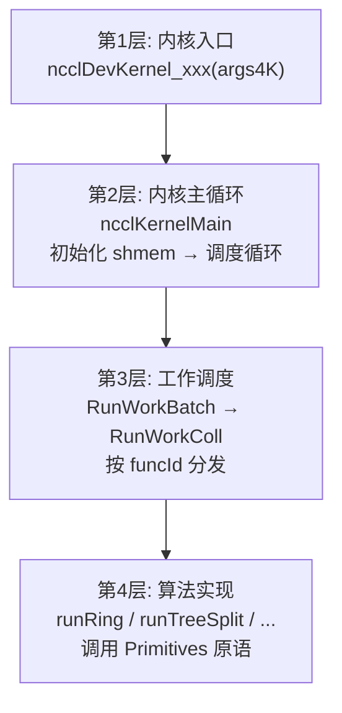

---

## 2. 内核入口与主循环

### 2.1 内核定义

特化内核 (由 `generate.py` 生成):
```c
DEFINE_ncclDevKernel(suffix, coll, redop, ty, algo, proto, specializedFnId)
  __global__ void ncclDevKernel_##suffix(ncclDevKernelArgs4K args4K) {
    ncclKernelMain<specializedFnId, RunWorkBatch<coll, ty, redop<ty>, algo, proto>>(&args4K.args);
  }
```

通用内核:
```c
__global__ void ncclDevKernel_Generic(ncclDevKernelArgs4K args4K) {
  ncclKernelMain<-1, RunWorkNop>(&args4K.args);
}
```

### 2.2 ncclKernelMain 流程

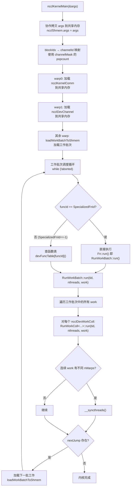

---

## 3. 工作批次加载

`loadWorkBatchToShmem` 从内核参数或工作 FIFO 加载工作描述：

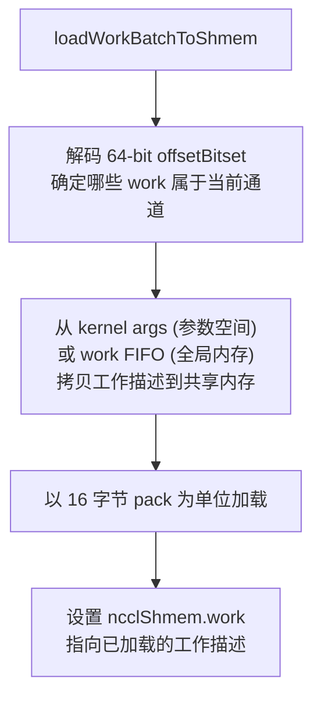

---

## 4. 协议原语层

### 4.1 Primitives 模板

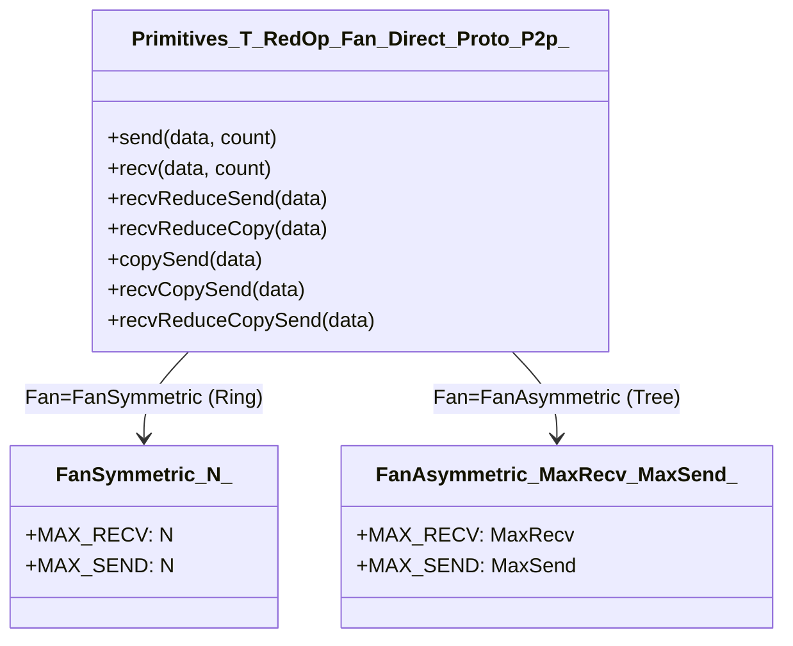

**模板参数**:
- **T**: 数据类型 (int, float, half, ...)
- **RedOp**: 规约操作 (Sum, Prod, Min, Max, ...)
- **Fan**: FanSymmetric\<N\> (Ring) 或 FanAsymmetric\<MaxRecv, MaxSend\> (Tree)
- **Direct**: 是否启用直连 (P2P/NVLS 读写)
- **Proto**: ProtoLL / ProtoLL128 / ProtoSimple
- **P2p**: 是否 SendRecv 模式

### 4.2 三种协议对比

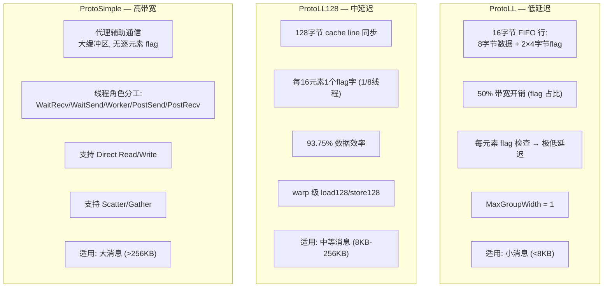

### 4.3 LL 协议操作流程

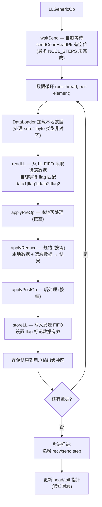

### 4.4 LL128 协议操作流程

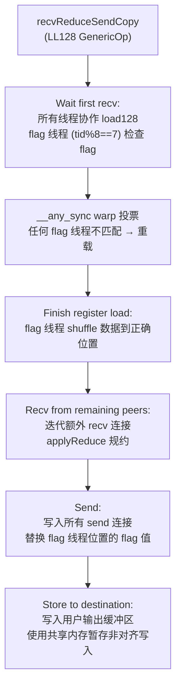

### 4.5 Simple 协议操作流程

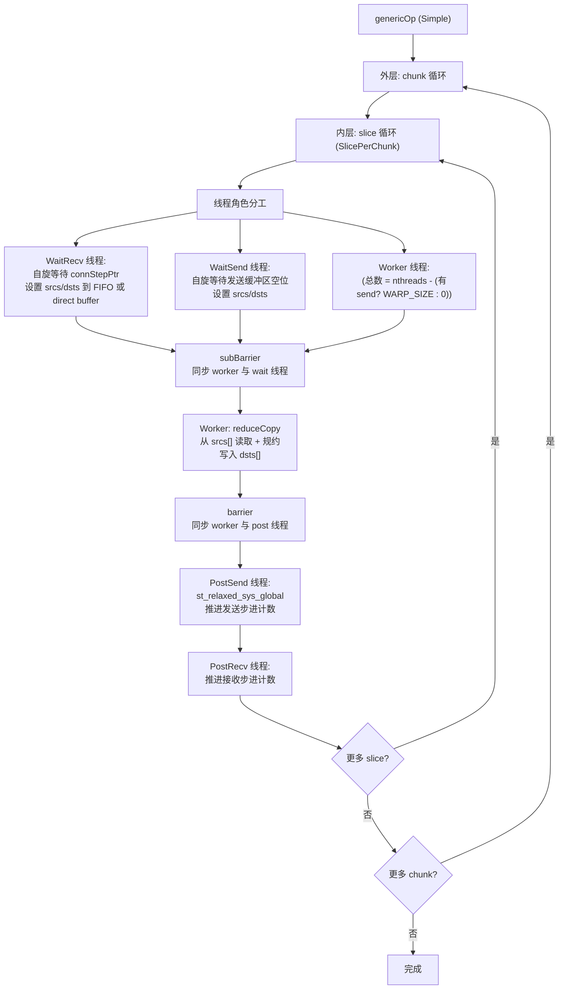

---

## 5. 算法实现

### 5.1 Ring AllReduce

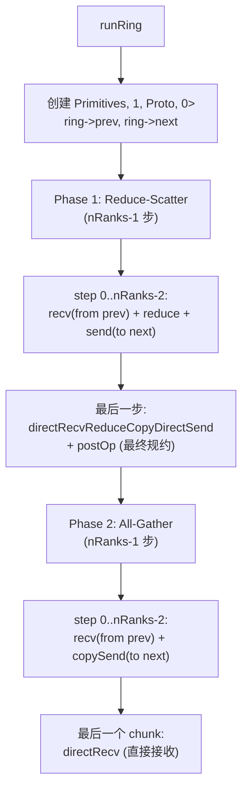

### 5.2 Tree AllReduce

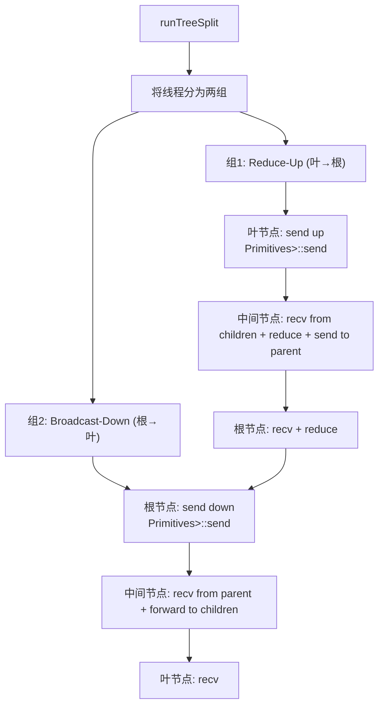

### 5.3 NVLS AllReduce

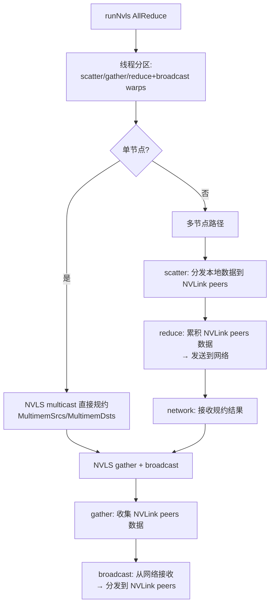

### 5.4 CollNet Direct AllReduce

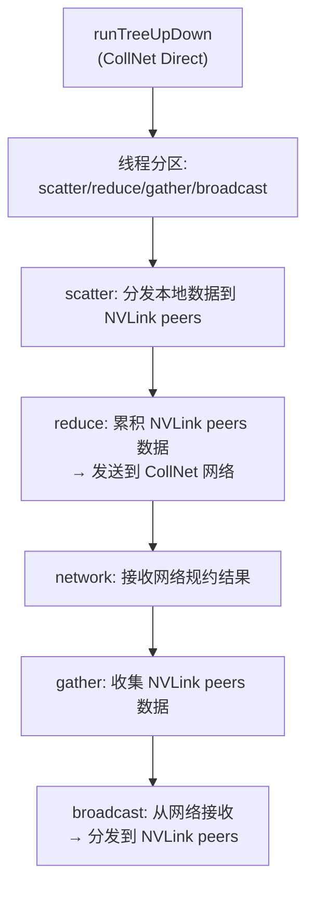

---

## 6. 内核代码生成 (generate.py)

### 6.1 生成流程

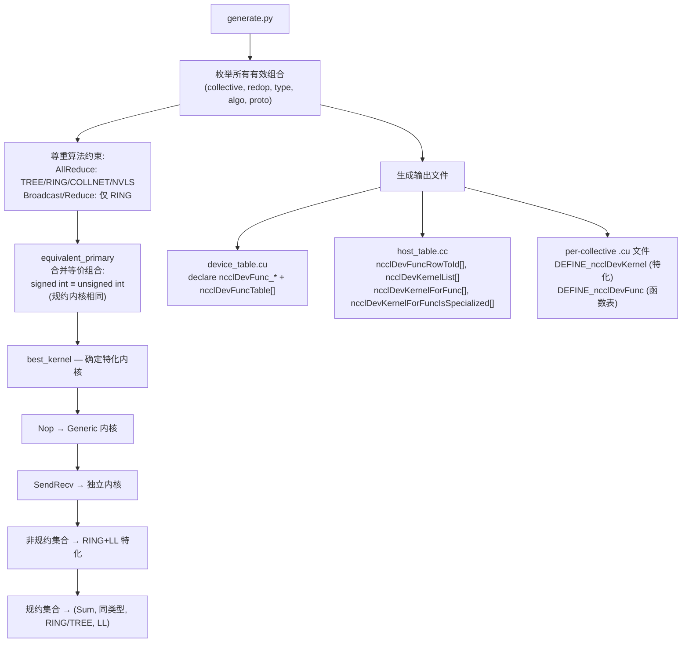

### 6.2 调度路径

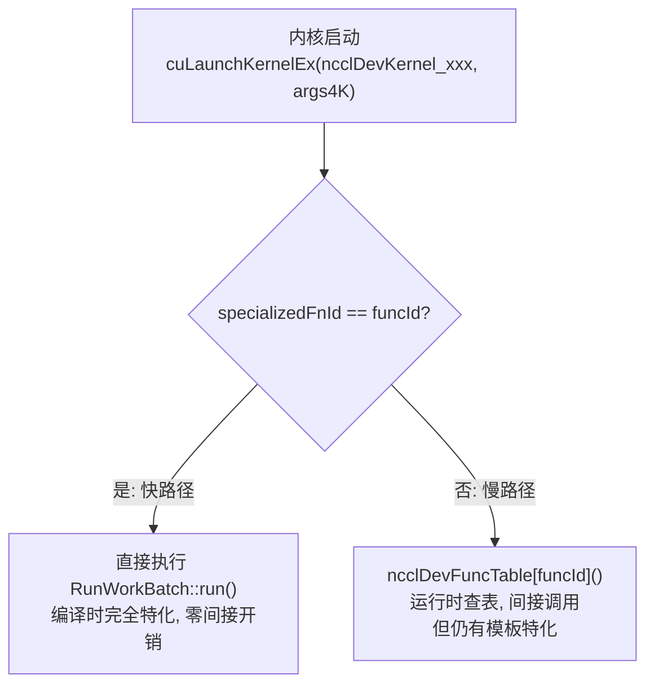

### 6.3 ONLY_FUNCS 过滤

`ONLY_FUNCS` 环境变量允许开发时只编译指定函数，减少二进制大小。

---

## 7. 关键源文件

| 文件 | 行数 | 功能 |
|------|------|------|
| `src/device/common.h` | ~500 | 内核入口定义、ncclKernelMain、RunWorkBatch/Coll |
| `src/device/common.cu` | ~50 | Generic 内核定义 |
| `src/device/primitives.h` | ~200 | Primitives 模板声明 |
| `src/device/prims_ll.h` | ~300 | LL 协议原语 |
| `src/device/prims_ll128.h` | ~300 | LL128 协议原语 |
| `src/device/prims_simple.h` | ~350 | Simple 协议原语 |
| `src/device/all_reduce.h` | ~500 | AllReduce 算法 (Ring/Tree/NVLS/CollNet) |
| `src/device/all_gather.h` | ~300 | AllGather 算法 |
| `src/device/reduce_scatter.h` | ~300 | ReduceScatter 算法 |
| `src/device/broadcast.h` | ~200 | Broadcast 算法 |
| `src/device/reduce.h` | ~200 | Reduce 算法 |
| `src/device/sendrecv.h` | ~200 | Send/Recv 实现 |
| `src/device/generate.py` | ~600 | 内核变体自动生成 |
