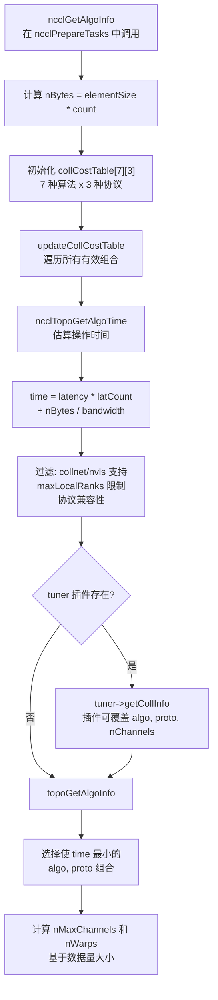
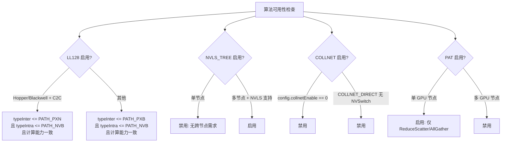

# NCCL 算法与协议选择

算法与协议选择决定了每次集合操作使用哪种通信模式和传输协议，直接影响延迟和带宽性能。NCCL 使用基于拓扑的代价模型自动选择最优组合，也支持用户通过环境变量覆盖。

---

## 1. 可选算法 (7 种)

| 算法 | 值 | 描述 | 典型场景 |
|------|---|------|---------|
| NCCL_ALGO_TREE | 0 | 双二叉树 | 中等消息、多节点 |
| NCCL_ALGO_RING | 1 | 环形 | 大消息、高带宽 |
| NCCL_ALGO_COLLNET_DIRECT | 2 | 集合网络直连 | SHARP 可用、小消息 |
| NCCL_ALGO_COLLNET_CHAIN | 3 | 集合网络链式 | SHARP 可用、中等消息 |
| NCCL_ALGO_NVLS | 4 | NVLink SHARP | 单/多节点 NVLS |
| NCCL_ALGO_NVLS_TREE | 5 | NVLS + Tree 跨节点 | 多节点 NVLS |
| NCCL_ALGO_PAT | 6 | 并行 Alltoall Tree | 单 GPU 节点 AlltoAll |

## 2. 可选协议 (3 种)

| 协议 | 值 | 描述 | 数据效率 | 延迟 |
|------|---|------|---------|------|
| NCCL_PROTO_LL | 0 | 低延迟 | 50% (8B data + 8B flags) | 最低 |
| NCCL_PROTO_LL128 | 1 | 低延迟 128 字节 | 93.75% (15/16 data) | 中 |
| NCCL_PROTO_SIMPLE | 2 | 简单 (代理辅助) | ~100% | 最高 |

三种协议形成明确的性能梯度：LL 牺牲带宽换取最低延迟，Simple 牺牲延迟换取最大带宽，LL128 是两者的折中。

---

## 3. 算法/函数兼容性

| 集合操作 | 支持的算法 | 不支持的算法 |
|---------|-----------|------------|
| Broadcast | RING | TREE, COLLNET, NVLS, PAT |
| Reduce | RING | TREE, COLLNET, NVLS, PAT |
| ReduceScatter | PAT, RING, NVLS, COLLNET_DIRECT | TREE, COLLNET_CHAIN, NVLS_TREE |
| AllGather | PAT, RING, NVLS, COLLNET_DIRECT | TREE, COLLNET_CHAIN, NVLS_TREE |
| AllReduce | TREE, RING, COLLNET_DIRECT, COLLNET_CHAIN, NVLS, NVLS_TREE | PAT |

**协议约束**：
- NVLS / NVLS_TREE: 仅支持 SIMPLE 协议（NVLS 硬件多播不需要逐元素同步）
- PAT: 仅支持 SIMPLE 协议，需要 SM60+
- COLLNET_DIRECT / COLLNET_CHAIN: 非 SIMPLE 协议时 busBw = 0（不可用，因为 CollNet 通过代理传输）

---

## 4. 选择流程

代价模型的核心公式：`time = latency * latCount + nBytes / bandwidth`。其中 latency 取决于算法和网络拓扑，bandwidth 取决于通道数和协议效率。Tuner 插件可以在代价计算后覆盖选择结果，适用于特定工作负载的优化。

---

## 5. 带宽模型

### 5.1 带宽修正

原始带宽 `busBw = nChannels * bw`，然后根据算法和协议组合进行修正：

| 算法 + 协议 | 带宽修正 | 原因 |
|------------|---------|------|
| RING + LL | `min(llMaxBw, busBw * 0.5)` | LL 的 50% flag 开销 |
| RING + LL128 | `min(busBw * 0.92, nCh * perChMaxRingLL128Bw)` | 6.25% flag 开销 + 通道上限 |
| RING + Simple | 不变 | 无额外开销 |
| TREE + Simple | `min(busBw * 0.92, nCh * perChMaxTreeBw)` | 双树带宽共享 |
| TREE + LL | `min(busBw / 3.8, llMaxBw)` | Tree 的 LL 开销极大 |
| NVLS | `busBw *= nvlsEfficiency * (nCh-1)/nCh` | 硬件效率 + 管理开销 |
| PAT | `busBw *= 0.75` | 25% 协议开销 |

### 5.2 算法带宽转换

| 算法 | 转换公式 | 说明 |
|------|---------|------|
| RING | `algoBw = busBw * nRanks / (nRanks-1)` | Ring 需要 nRanks-1 步传 nRanks 份数据 |
| TREE | `algoBw = busBw * 0.5` | 双树各处理一半 |
| NVLS / NVLS_TREE | `algoBw = busBw * nRanks / nsteps` | 取决于步数 |
| COLLNET | `algoBw = busBw * 0.5` | 半双工 |
| PAT | `algoBw = busBw * 0.5` | 半双工 |

---

## 6. 延迟模型

### 6.1 基础延迟 (微秒)

| | Tree (LL/LL128/Simple) | Ring (LL/LL128/Simple) |
|--|------------------------|------------------------|
| **base** | 6.8 / 14.0 / 8.4 | 6.6 / 14.0 / 8.4 |
| **NVLink** | 0.6 / 1.25 / 4.0 | 0.6 / 1.9 / 3.4 |
| **PCI** | 1.0 / 1.9 / 4.0 | 1.0 / 2.5 / 5.7 |
| **NET** | 5.0 / 8.5 / 14.0 | 2.7 / 4.0 / 14.0 |

### 6.2 算法延迟公式

| 算法 | 延迟公式 |
|------|---------|
| RING | `base + (nsteps-nInterSteps)*intraLat + nInterSteps*interLat` |
| TREE + AllReduce | `base + 2*((ppn-1)*intraLat + log2(nNodes)*interLat)` |
| COLLNET_DIRECT | `base + 2*(min(1,ppn-1)*intraLat + (ppn-1)*0.4) + interLat` |
| COLLNET_CHAIN | `base + 2*(ppn-1)*intraLat + interLat` |
| NVLS | `intraLat + (nNodes>1 ? interLat : 0)` |
| NVLS_TREE | `base + intraLat + 2*log2(nNodes)*interLat` |
| PAT | `base + log2(nNodes)*(interLat/3.5) + nRanks*2.8` |

Tree 的 AllReduce 延迟包含 reduce 和 broadcast 两个阶段（乘 2），每个阶段需要沿树上下传播。NVLS 的延迟最低，因为它只需要一步硬件多播。

---

## 7. 启用/禁用逻辑

---

## 8. 用户覆盖

| 环境变量 | 作用 |
|---------|------|
| `NCCL_ALGO` | 覆盖算法选择 (可按集合操作指定) |
| `NCCL_PROTO` | 覆盖协议选择 |
| `NCCL_ALGO_REDUCESCATTER` | 仅覆盖 ReduceScatter 的算法 |
| `NCCL_ALGO_ALLREDUCE` | 仅覆盖 AllReduce 的算法 |
| `NCCL_ALGO_ALLGATHER` | 仅覆盖 AllGather 的算法 |
| `NCCL_MAX_NCHANNELS` | 限制最大通道数 |
| `NCCL_MIN_NCHANNELS` | 设置最小通道数 |

---

## 9. 通道和线程调优

选定的算法/协议还影响通道数和每通道线程数：

| 场景 | nMaxChannels | nWarps |
|------|-------------|--------|
| 小消息 (nBytes < 32KB) | min(nChannels, 4) | 2 |
| 中等消息 | min(nChannels, 8) | 4 |
| 大消息 | nChannels | 4-8 |
| NVLS | nvlsChannels | 按算法 |
| CollNet | nChannels | 按算法 |

小消息使用更少的通道和线程，避免过多的同步开销抵消并行收益。

---

## 10. 关键源文件

| 文件 | 行数 | 功能 |
|------|------|------|
| `src/graph/tuning.cc` | ~800 | 带宽/延迟模型、算法/协议选择 |
| `src/enqueue.cc` (ncclGetAlgoInfo) | ~200 | 代价表更新和最终选择 |
| `src/include/plugin/nccl_tuner.h` | ~100 | 算法/协议枚举定义 |
