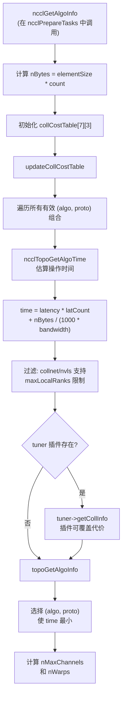
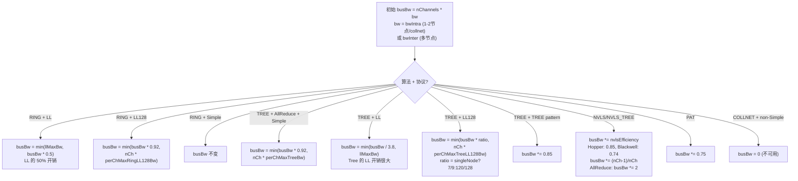
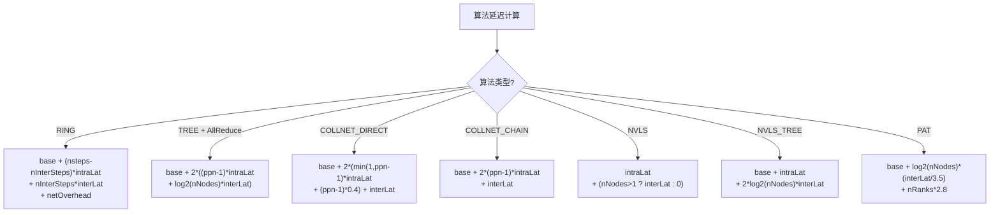
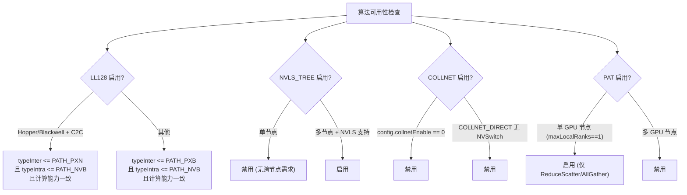
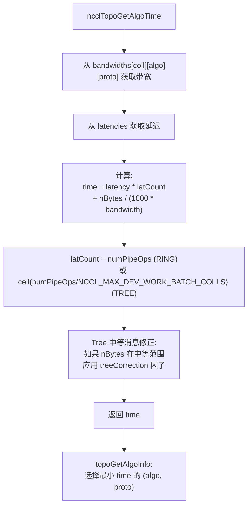

# NCCL 算法与协议选择

算法与协议选择决定了每次集合操作使用哪种通信模式和传输协议，直接影响延迟和带宽性能。

---

## 1. 可选算法 (7 种)

| 算法 | 值 | 描述 | 典型场景 |
|------|---|------|---------|
| NCCL_ALGO_TREE | 0 | 双二叉树 | 中等消息、多节点 |
| NCCL_ALGO_RING | 1 | 环形 | 大消息、高带宽 |
| NCCL_ALGO_COLLNET_DIRECT | 2 | 集合网络直连 | SHARP 可用、小消息 |
| NCCL_ALGO_COLLNET_CHAIN | 3 | 集合网络链式 | SHARP 可用、中等消息 |
| NCCL_ALGO_NVLS | 4 | NVLink SHARP | 单/多节点 NVLS |
| NCCL_ALGO_NVLS_TREE | 5 | NVLS + Tree 跨节点 | 多节点 NVLS |
| NCCL_ALGO_PAT | 6 | 并行 Alltoall Tree | 单 GPU 节点 AlltoAll |

## 2. 可选协议 (3 种)

| 协议 | 值 | 描述 | 数据效率 | 延迟 |
|------|---|------|---------|------|
| NCCL_PROTO_LL | 0 | 低延迟 | 50% (8B data + 8B flags) | 最低 |
| NCCL_PROTO_LL128 | 1 | 低延迟 128 字节 | 93.75% (15/16 data) | 中 |
| NCCL_PROTO_SIMPLE | 2 | 简单 (代理辅助) | ~100% | 最高 |

---

## 3. 算法/函数兼容性

| 集合操作 | 支持的算法 | 不支持的算法 |
|---------|-----------|------------|
| Broadcast | RING | TREE, COLLNET, NVLS, PAT |
| Reduce | RING | TREE, COLLNET, NVLS, PAT |
| ReduceScatter | PAT, RING, NVLS, COLLNET_DIRECT | TREE, COLLNET_CHAIN, NVLS_TREE |
| AllGather | PAT, RING, NVLS, COLLNET_DIRECT | TREE, COLLNET_CHAIN, NVLS_TREE |
| AllReduce | TREE, RING, COLLNET_DIRECT, COLLNET_CHAIN, NVLS, NVLS_TREE | PAT |

**协议约束**:
- NVLS / NVLS_TREE: 仅支持 SIMPLE 协议
- PAT: 仅支持 SIMPLE 协议，需要 SM60+
- COLLNET_DIRECT / COLLNET_CHAIN: 非 SIMPLE 协议时 busBw = 0 (不可用)

---

## 4. 选择流程

---

## 5. 带宽模型

### 5.1 带宽计算

### 5.2 算法带宽转换

| 算法 | 转换公式 | 说明 |
|------|---------|------|
| RING | algoBw = busBw * nRanks / (nRanks-1) | Ring 需要 nRanks-1 步传 nRanks 份数据 |
| TREE | algoBw = busBw * 0.5 | 双树各处理一半 |
| NVLS / NVLS_TREE | algoBw = busBw * nRanks / nsteps | 取决于步数 |
| COLLNET_DIRECT/CHAIN | algoBw = busBw * 0.5 | 半双工 |
| PAT | algoBw = busBw * 0.5 | 半双工 |

---

## 6. 延迟模型

### 6.1 基础延迟和硬件延迟

| | Tree (LL/LL128/Simple) μs | Ring (LL/LL128/Simple) μs |
|--|---------------------------|---------------------------|
| **base** | 6.8 / 14.0 / 8.4 | 6.6 / 14.0 / 8.4 |
| **NVLink** | 0.6 / 1.25 / 4.0 | 0.6 / 1.9 / 3.4 |
| **PCI** | 1.0 / 1.9 / 4.0 | 1.0 / 2.5 / 5.7 |
| **NET** | 5.0 / 8.5 / 14.0 | 2.7 / 4.0 / 14.0 |

### 6.2 算法延迟公式

---

## 7. 启用/禁用逻辑

### 7.1 算法可用性检查

### 7.2 用户覆盖

| 环境变量 | 作用 |
|---------|------|
| `NCCL_ALGO` | 覆盖算法选择 (可按集合操作指定) |
| `NCCL_PROTO` | 覆盖协议选择 |
| `NCCL_ALGO_REDUCESCATTER` | 仅覆盖 ReduceScatter 的算法 |
| `NCCL_ALGO_ALLREDUCE` | 仅覆盖 AllReduce 的算法 |

---

## 8. 代价计算与最终选择

---

## 9. 通道和线程调优

选定的算法/协议还影响通道数和每通道线程数：

| 场景 | nMaxChannels | nWarps |
|------|-------------|--------|
| 小消息 (nBytes < 32KB) | min(nChannels, 4) | 2 |
| 中等消息 | min(nChannels, 8) | 4 |
| 大消息 | nChannels | 4-8 |
| NVLS | nvlsChannels | 按算法 |
| CollNet | nChannels | 按算法 |

---

## 10. 关键源文件

| 文件 | 行数 | 功能 |
|------|------|------|
| `src/graph/tuning.cc` | ~800 | 带宽/延迟模型、算法/协议选择 |
| `src/enqueue.cc` (ncclGetAlgoInfo) | ~200 | 代价表更新和最终选择 |
| `src/include/plugin/nccl_tuner.h` | ~100 | 算法/协议枚举定义 |
