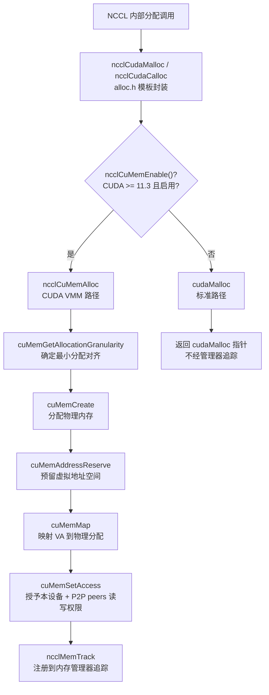
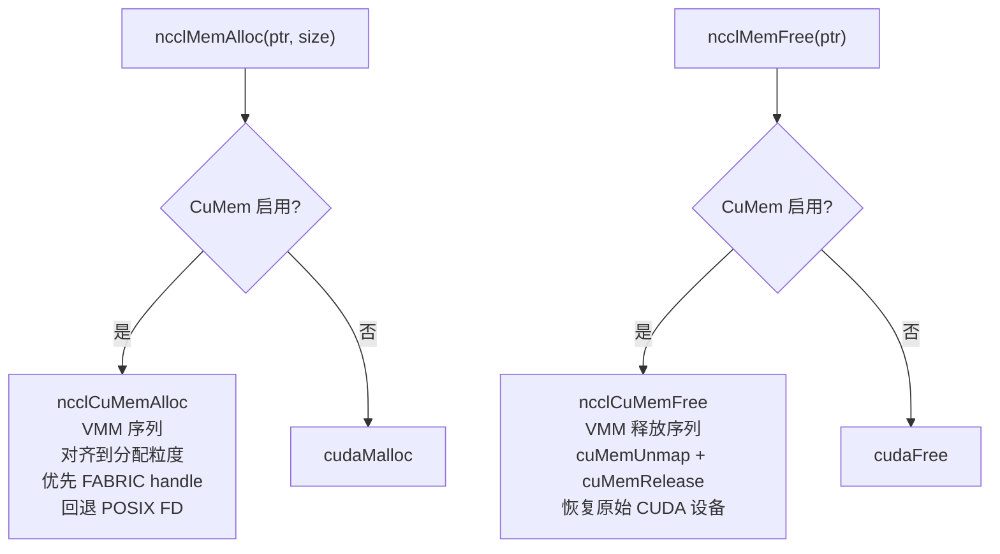
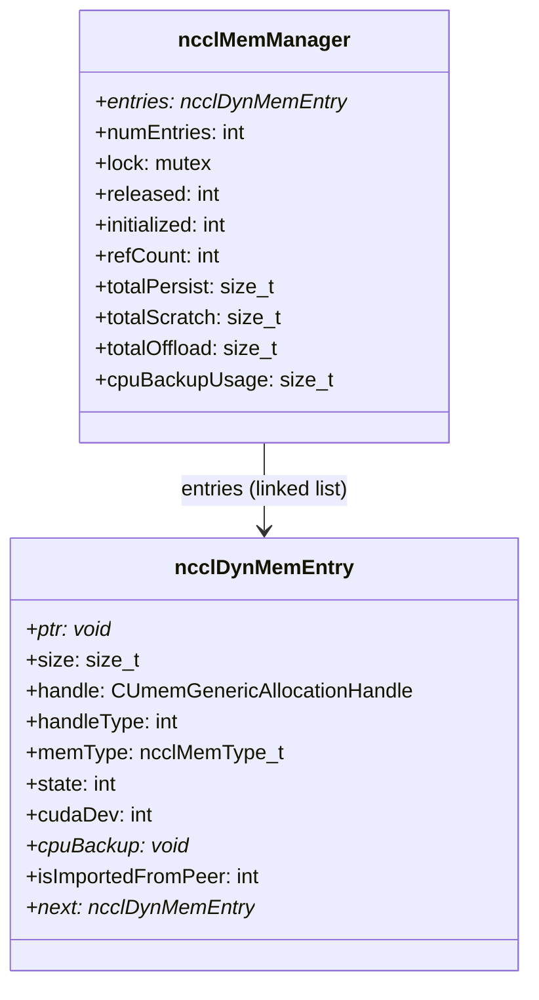
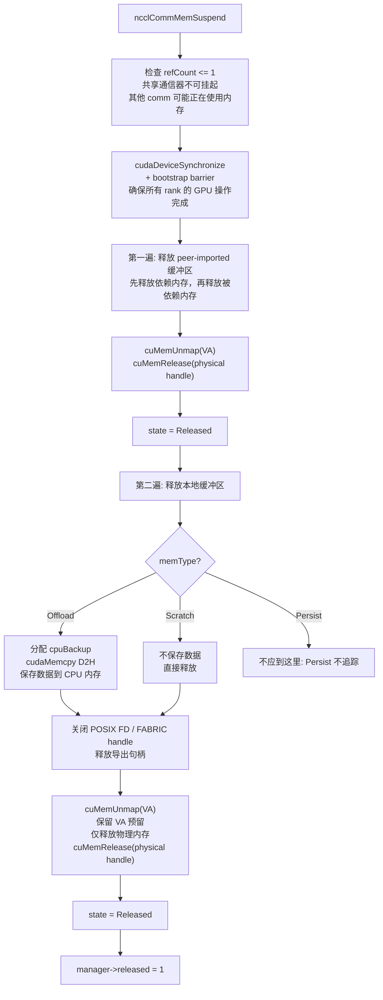
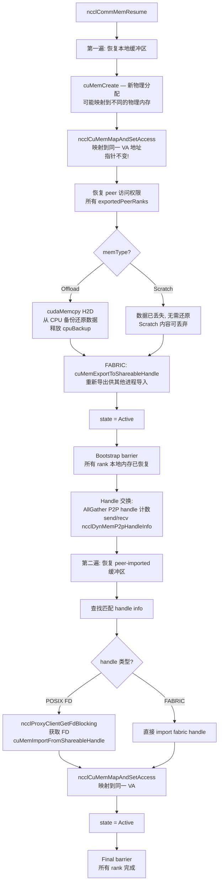
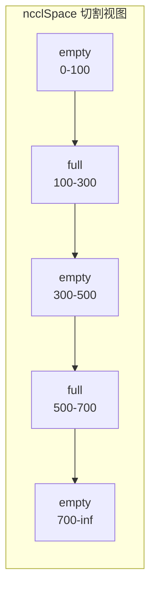
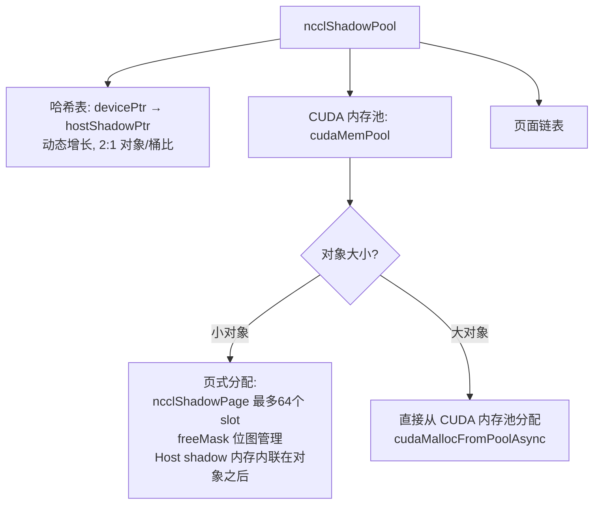

# NCCL 内存管理系统

NCCL 内存管理分三层：底层 CuMem 虚拟内存管理分配器、中层内存管理器（挂起/恢复）、上层类型安全分配接口。CuMem 提供跨进程内存共享能力，内存管理器支持运行时挂起和恢复以释放 GPU 显存，分配接口提供统一的类型安全 API。

---

## 1. 分配架构总览

CuMem (CUDA Virtual Memory Management) 是 CUDA 11.3 引入的 API，允许精细控制 GPU 内存的虚拟地址空间。与 `cudaMalloc` 的关键区别：

1. **物理和虚拟分离**：`cuMemCreate` 分配物理内存，`cuMemAddressReserve` 预留虚拟地址，`cuMemMap` 将两者绑定。挂起时可以解除映射（释放物理内存）但保留虚拟地址，恢复时重新分配物理内存并映射到同一虚拟地址。
2. **跨进程共享**：通过 `cuMemExportToShareableHandle` 导出句柄，其他进程通过 `cuMemImportFromShareableHandle` 导入，实现零拷贝跨进程共享。
3. **访问控制**：`cuMemSetAccess` 可以精确控制哪些设备可以访问该内存。

### 1.1 CuMem Handle 类型

| Handle 类型 | CUDA 版本 | 用途 |
|------------|----------|------|
| `CU_MEM_HANDLE_TYPE_POSIX_FILE_DESCRIPTOR` | >= 11.3 | POSIX FD，用于跨进程共享，通过 Unix Domain Socket 传递 |
| `CU_MEM_HANDLE_TYPE_FABRIC` | >= 12.3 | Fabric handle，更高效，优先选择，无需 FD 传递 |

### 1.2 ncclMemAlloc / ncclMemFree (公共 API)

---

## 2. 内存类型与内存管理器

### 2.1 三种内存类型

| 类型 | 值 | 挂起行为 | 追踪方式 |
|------|---|---------|---------|
| ncclMemPersist | 0 | 永不释放 | 仅原子计数，不创建链表条目 |
| ncclMemScratch | 1 | 直接释放（不保存内容） | 链表条目 |
| ncclMemOffload | 2 | 拷贝到 CPU，恢复时还原 | 链表条目 |

Persist 内存用于通信器的核心数据结构（如通道、连接信息），不能被挂起。Scratch 内存用于临时工作缓冲区，挂起后数据可丢弃。Offload 内存用于需要保留的数据（如注册缓冲区），挂起前保存到 CPU 内存。

### 2.2 内存管理器结构

`ncclDynMemEntry` 是内存追踪的基本单元。`state` 字段标记当前是 Active 还是 Released。对于 Offload 类型，`cpuBackup` 指向 CPU 端的备份数据。`isImportedFromPeer` 标记该内存是否从其他 rank 导入（跨进程共享），恢复时需要重新导入。

---

## 3. 挂起与恢复

挂起/恢复机制允许 NCCL 在不需要 GPU 通信时释放显存，在需要时恢复。这对于多租户 GPU 场景非常有用——通信空闲时将显存让给计算任务。

### 3.1 挂起流程 (ncclCommMemSuspend)

挂起的关键设计：**保留虚拟地址，释放物理内存**。这样恢复时可以将新的物理内存映射到同一虚拟地址，所有指向该地址的指针（如 GPU 内核中的连接器指针）无需更新。

### 3.2 恢复流程 (ncclCommMemResume)

恢复需要两遍，因为 peer-imported 内存依赖本地内存的 handle。第一遍恢复本地内存并导出 handle，通过 AllGather 交换 handle 后，第二遍才能导入远端内存。

### 3.3 公共 API

| API | 说明 |
|-----|------|
| `ncclCommSuspend(comm, flags)` | 挂起通信器内存。需 `NCCL_SUSPEND_MEM` flag。拒绝 refCount>1 |
| `ncclCommResume(comm)` | 恢复通信器内存 |
| `ncclCommMemStats(comm, stats)` | 查询内存统计: total/persist/suspend/suspended |

---

## 4. 子分配器

### 4.1 ncclSpace — 偏移量子分配器

ncclSpace 从一个大的连续地址空间中分配和释放段，用于管理 NVLS 的信号/计数器索引空间。

**数据结构**：使用升序排列的切割点数组 `cuts[]` 描述边界。不变量：段 `i` 为 "full" 当 `i % 2 != count % 2`，否则为 "empty"。最后一段始终为 empty。

**操作**：
- `ncclSpaceAlloc`：线性扫描空段，首次适配。快速路径移动边界；慢速路径 insertSegment
- `ncclSpaceFree`：线性扫描满段。快速路径收缩；慢速路径 insertSegment
- `insertSegment`：插入两个切割点，然后压缩相邻零大小空段

### 4.2 ncclShadowPool — 设备/主机影射对象池

ShadowPool 为小对象提供高效的设备/主机配对内存分配，每个设备内存对象都有对应的主机端 "影子" 内存。

---

## 5. 分配接口 (alloc.h)

### 5.1 核心 API

| 函数 | 用途 |
|------|------|
| `ncclCudaMalloc(ptr, count)` | GPU 内存分配，CuMem 或 cudaMalloc |
| `ncclCudaCalloc(ptr, count)` | 同上 + 零初始化（side stream） |
| `ncclCudaCallocAsync(ptr, count, stream)` | 同上 + 在指定 stream 上零初始化 |
| `ncclCudaFree(ptr)` | GPU 内存释放 |
| `ncclCudaHostCalloc(ptr, count)` | 固定主机内存 (cudaHostAllocMapped) |
| `ncclCalloc(ptr, count)` | 普通主机内存 (calloc) |
| `ncclIbMalloc(ptr, size)` | 页对齐分配 (posix_memalign，用于 IB 注册) |

### 5.2 智能指针

| 类型 | 用途 |
|------|------|
| `ncclUniquePtr<T>` | RAII 封装，自动调用 std::free |
| `ncclUniqueArrayPtr<T>` | 数组版本 RAII |

---

## 6. 关键源文件

| 文件 | 行数 | 功能 |
|------|------|------|
| `src/allocator.cc` | ~600 | CuMem 分配器、ncclSpace、ncclShadowPool |
| `src/mem_manager.cc` | ~1000 | 内存管理器、挂起/恢复 |
| `src/include/alloc.h` | ~500 | 分配接口模板封装 |
| `src/include/mem_manager.h` | ~150 | 内存管理器数据结构 |
| `src/include/allocator.h` | ~60 | ncclSpace/ShadowPool 声明 |
