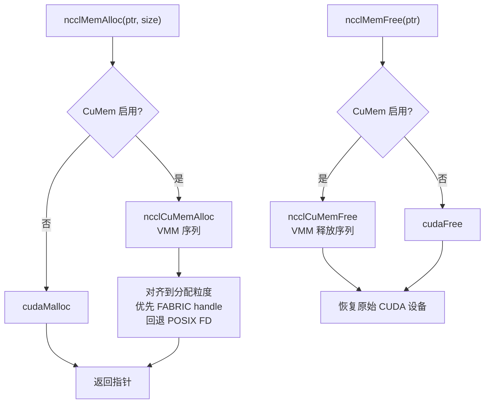
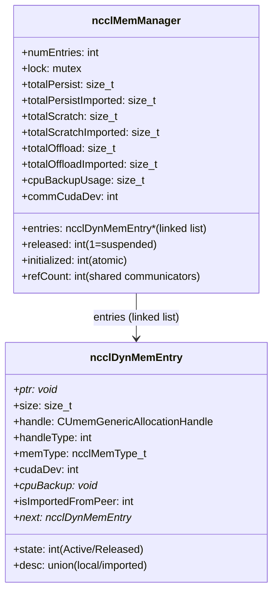
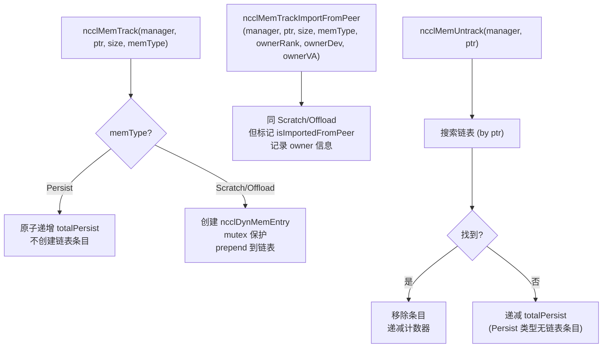
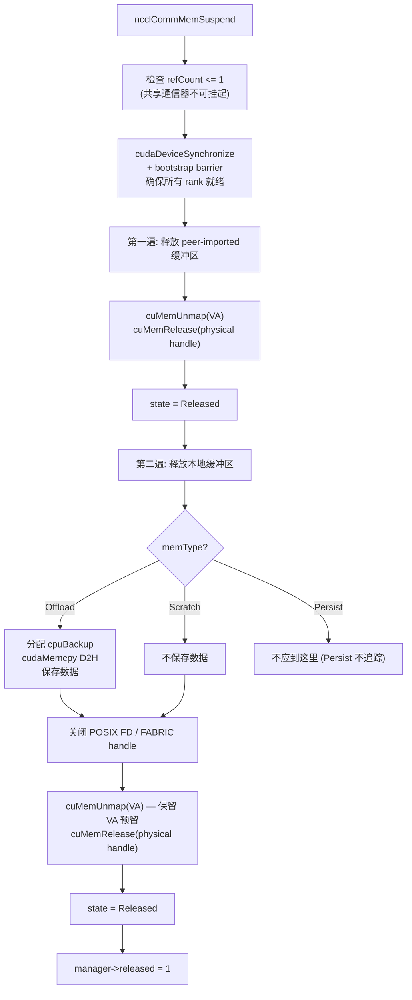
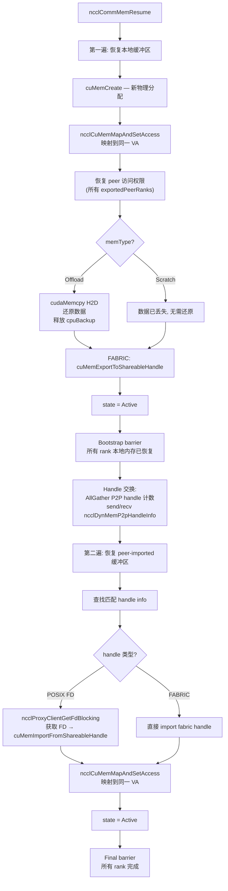
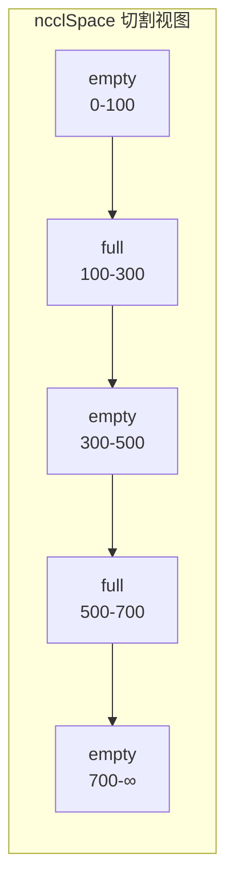
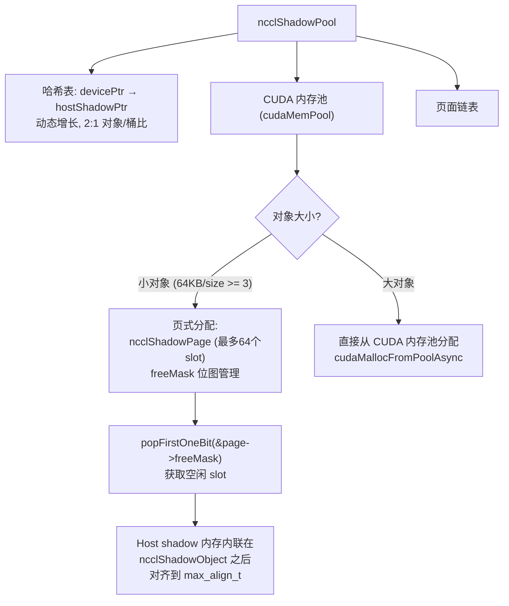

# NCCL 内存管理系统

NCCL 内存管理分三层：底层 CuMem 虚拟内存管理分配器、中层内存管理器（挂起/恢复）、上层类型安全分配接口。

---

## 1. 分配架构总览

```mermaid
flowchart TD
    A["NCCL 内部分配调用"] --> B["ncclCudaMalloc / ncclCudaCalloc\n(alloc.h 模板封装)"]
    B --> C{ncclCuMemEnable()?}
    C -->|"是 (CUDA >= 11.3)"| D["ncclCuMemAlloc\nCUDA VMM 路径"]
    C -->|"否"| E["cudaMalloc\n标准路径"]

    D --> D1["cuMemGetAllocationGranularity — 对齐"]
    D1 --> D2["cuMemCreate — 分配物理内存"]
    D2 --> D3["cuMemAddressReserve — 预留虚拟地址"]
    D3 --> D4["cuMemMap — 映射 VA 到物理分配"]
    D4 --> D5["cuMemSetAccess — 授予本设备+P2P peers 读写"]
    D5 --> D6["ncclMemTrack — 注册到内存管理器"]

    E --> F["返回 cudaMalloc 指针\n(不经管理器追踪)"]
```

### 1.1 CuMem Handle 类型

| Handle 类型 | CUDA 版本 | 用途 |
|------------|----------|------|
| `CU_MEM_HANDLE_TYPE_POSIX_FILE_DESCRIPTOR` | >= 11.3 | POSIX FD，用于跨进程共享 |
| `CU_MEM_HANDLE_TYPE_FABRIC` | >= 12.3 | Fabric handle，更高效，优先选择 |

### 1.2 ncclMemAlloc / ncclMemFree (公共 API)



---

## 2. 内存类型与内存管理器

### 2.1 三种内存类型

| 类型 | 值 | 行为 | 追踪方式 |
|------|---|------|---------|
| ncclMemPersist | 0 | 永不释放 | 仅原子计数，不创建链表条目 |
| ncclMemScratch | 1 | 挂起时直接释放 (不保存内容) | 链表条目 |
| ncclMemOffload | 2 | 挂起前拷贝到 CPU，恢复时还原 | 链表条目 |

### 2.2 内存管理器结构



### 2.3 追踪流程



---

## 3. 挂起与恢复

### 3.1 挂起流程 (ncclCommMemSuspend)



### 3.2 恢复流程 (ncclCommMemResume)



### 3.3 公共 API

| API | 说明 |
|-----|------|
| `ncclCommSuspend(comm, flags)` | 挂起通信器内存。需 `NCCL_SUSPEND_MEM` flag。拒绝 refCount>1 |
| `ncclCommResume(comm)` | 恢复通信器内存 |
| `ncclCommMemStats(comm, stats)` | 查询内存统计: total/persist/suspend/suspended |

---

## 4. 子分配器

### 4.1 ncclSpace — 偏移量子分配器



**数据结构**:
```c
struct ncclSpace {
    int count;      // 切割点数量
    int capacity;   // 分配容量
    int64_t* cuts;  // 升序排列的边界值
};
```

**不变量**: 段 `i` 为 "full" 当 `i % 2 != count % 2`，否则为 "empty"。最后一段始终为 empty。

**操作**:
- `ncclSpaceAlloc`: 线性扫描空段，首次适配。快速路径移动边界；慢速路径 insertSegment
- `ncclSpaceFree`: 线性扫描满段。快速路径收缩；慢速路径 insertSegment
- `insertSegment`: 插入两个切割点，然后压缩相邻零大小空段

### 4.2 ncclShadowPool — 设备/主机影射对象池



---

## 5. 分配接口 (alloc.h)

### 5.1 核心 API

| 函数 | 用途 |
|------|------|
| `ncclCudaMalloc(ptr, count, manager, memType)` | GPU 内存分配，CuMem 或 cudaMalloc |
| `ncclCudaCalloc(ptr, count, manager, memType)` | 同上 + 零初始化 (side stream) |
| `ncclCudaCallocAsync(ptr, count, stream, manager, memType)` | 同上 + 在指定 stream 上零初始化 |
| `ncclCudaFree(ptr, numSegments)` | GPU 内存释放 |
| `ncclCudaHostCalloc(ptr, count)` | 固定主机内存 (cudaHostAllocMapped) |
| `ncclCalloc(ptr, count)` | 普通主机内存 (malloc + memset) |
| `ncclRealloc(ptr, oldCount, newCount)` | 增长主机分配 |
| `ncclIbMalloc(ptr, size)` | 页对齐分配 (posix_memalign, 用于 IB 注册) |

### 5.2 智能指针

| 类型 | 用途 |
|------|------|
| `ncclUniquePtr<T>` | RAII 封装，std::unique_ptr<T, decltype(&std::free)> |
| `ncclUniqueArrayPtr<T>` | 数组版本 RAII |

---

## 6. 关键源文件

| 文件 | 行数 | 功能 |
|------|------|------|
| `src/allocator.cc` | ~600 | CuMem 分配器、ncclSpace、ncclShadowPool |
| `src/mem_manager.cc` | ~1000 | 内存管理器、挂起/恢复 |
| `src/include/alloc.h` | ~500 | 分配接口模板封装 |
| `src/include/mem_manager.h` | ~150 | 内存管理器数据结构 |
| `src/include/allocator.h` | ~60 | ncclSpace/ShadowPool 声明 |
