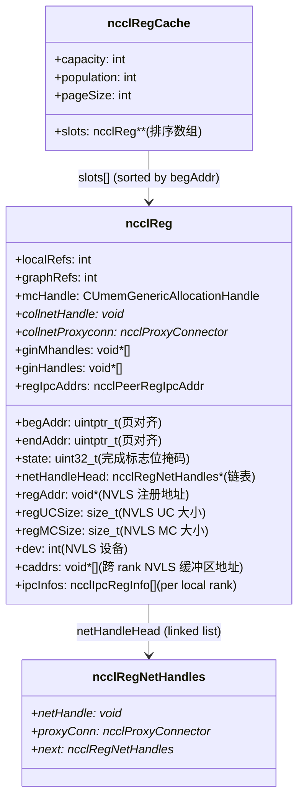
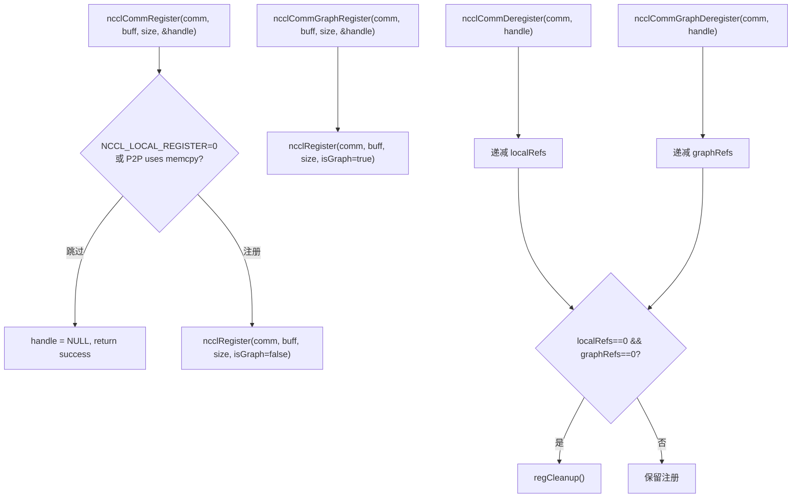
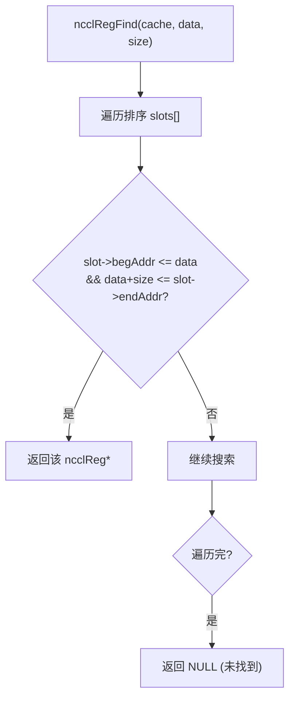
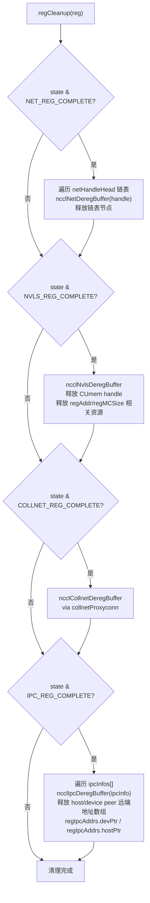
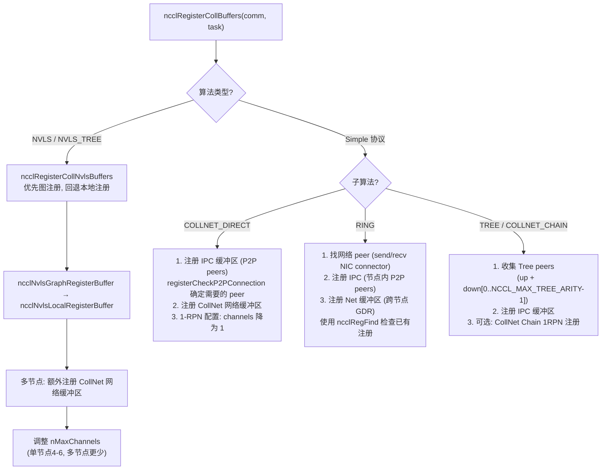
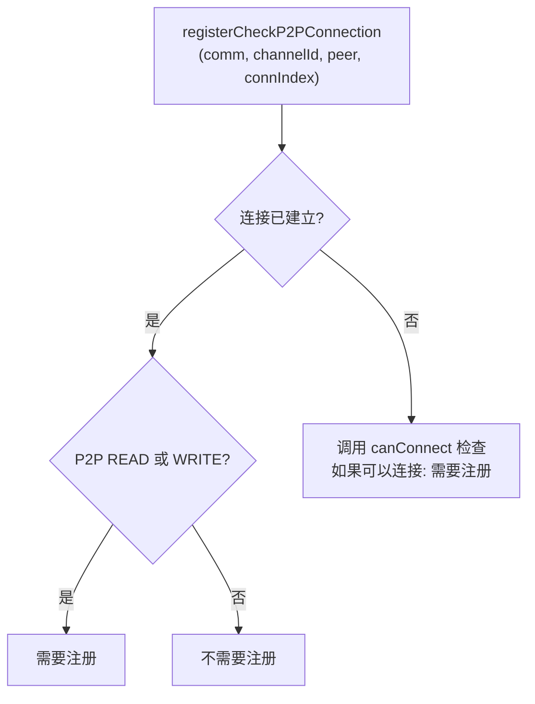
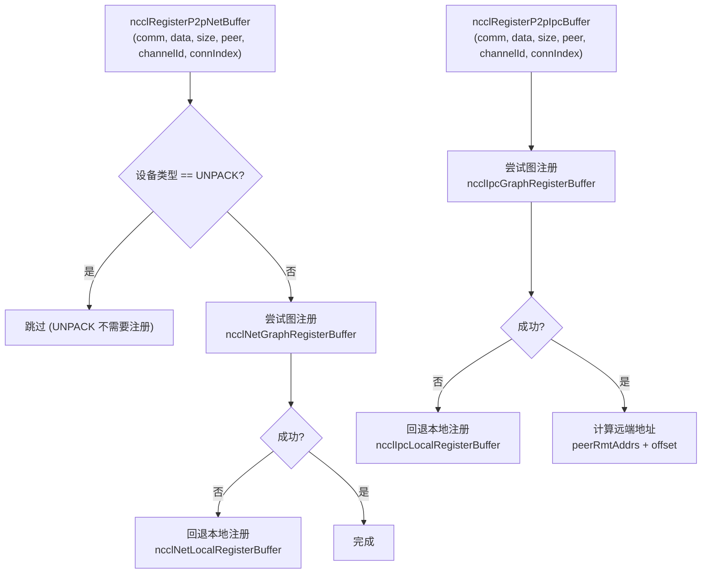

# NCCL 缓冲区注册机制

缓冲区注册将用户缓冲区在 NIC/GPU/NVLS 上提前注册，避免每次集合操作重复注册开销。注册缓存 (RegCache) 管理所有已注册的缓冲区，支持引用计数和多种传输类型的注册。

---

## 1. 注册缓存架构

### 1.1 核心数据结构



### 1.2 注册状态标志

| 标志 | 说明 |
|------|------|
| `NET_REG_COMPLETE` | 网络注册完成 |
| `NVLS_REG_COMPLETE` | NVLS 注册完成 |
| `NVLS_REG_POSSIBLE` | NVLS 注册可行 |
| `NVLS_REG_NO_SUPPORT` | NVLS 不支持 |
| `COLLNET_REG_COMPLETE` | CollNet 注册完成 |
| `IPC_REG_COMPLETE` | IPC 注册完成 |

---

## 2. 注册流程

### 2.1 用户 API



### 2.2 ncclRegister 内部流程

```mermaid
flowchart TD
    A["ncclRegister(comm, buff, size, isGraph)"] --> B["页对齐:\nbegAddr = alignDown(buff)\nendAddr = alignUp(buff+size)"]
    B --> C["遍历排序缓存 slots[]"]
    C --> D{已有 slot 完全包含 [begAddr, endAddr]?}
    D -->|"是"| E["增加引用计数\nlocalRefs++ 或 graphRefs++\n返回该 slot"]
    D -->|"否"| F["在排序位置插入新 slot"]
    F --> F1{capacity 够?}
    F1 -->|"否"| G["容量翻倍 (初始32)\nrealloc + memmove"]
    F1 -->|"是"| H["memmove 腾出空间"]
    G --> H
    H --> I["创建新 ncclReg\n设置 begAddr/endAddr\n初始化引用计数\nisGraph? graphRefs=1 : localRefs=1"]
    I --> J["返回 ncclReg* 作为 handle"]
```

### 2.3 缓存查找 (ncclRegFind)



---

## 3. 注销与清理



---

## 4. 集合级注册策略

### 4.1 注册路径选择



### 4.2 registerCheckP2PConnection



### 4.3 IPC-only 优化

当单节点且仅 IPC 注册成功时，通道数限制为 16 (如果原通道数在 16-24 之间)。

---

## 5. P2P Send/Recv 注册



---

## 6. 图注册 vs 本地注册

| 方式 | 适用场景 | 特点 |
|------|---------|------|
| **Graph 注册** | CUDA Graph 捕获 | 缓冲区在 Graph 生命周期内有效，可跨重放复用 |
| **本地注册** | 非捕获路径 | 每次注册独立，引用计数管理生命周期 |

图注册优先尝试，失败后回退到本地注册。

---

## 7. 关键源文件

| 文件 | 行数 | 功能 |
|------|------|------|
| `src/register/register.cc` | ~400 | 注册缓存、注册/注销、缓存查找 |
| `src/register/coll_reg.cc` | ~600 | 集合级缓冲区注册 (NVLS/IPC/Net/CollNet) |
| `src/register/sendrecv_reg.cc` | ~200 | P2P send/recv 缓冲区注册 |
| `src/include/register.h` | ~80 | 核心数据结构定义 |
| `src/include/register_inline.h` | ~30 | ncclRegFind 内联查找 |
