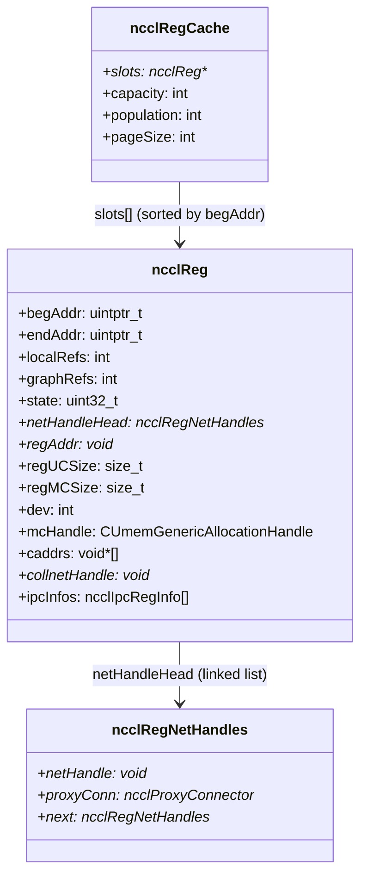
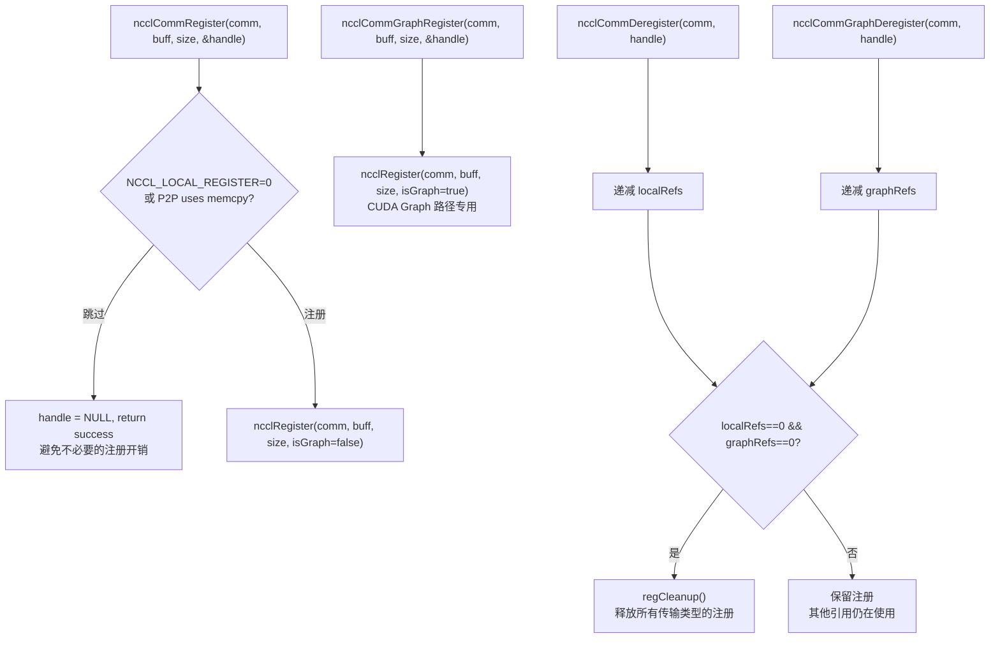
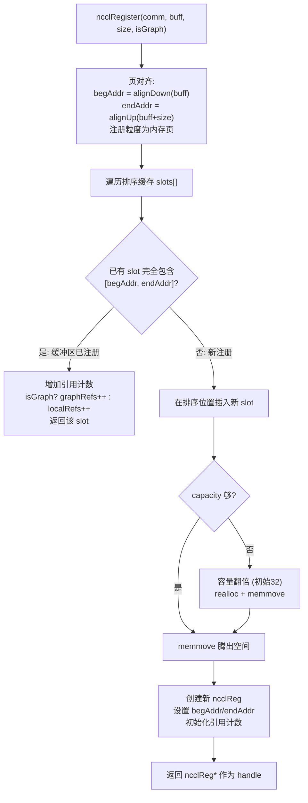
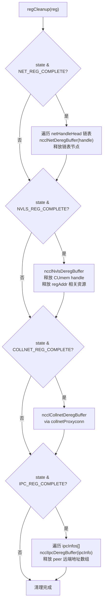
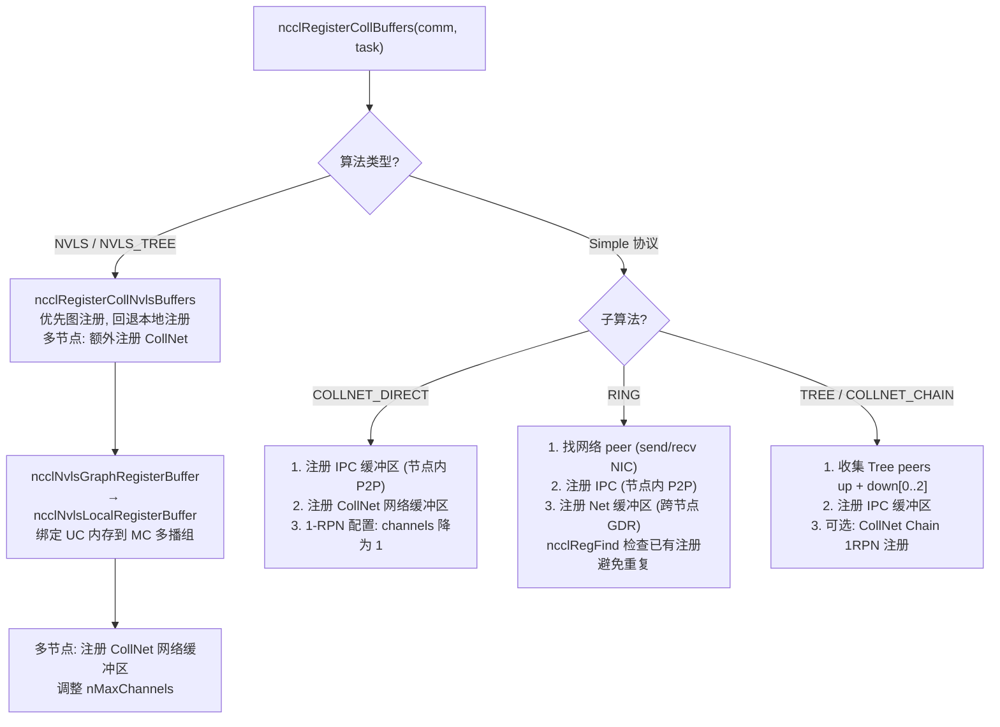

# NCCL 缓冲区注册机制

缓冲区注册将用户缓冲区在 NIC/GPU/NVLS 上提前注册，避免每次集合操作重复注册开销。注册缓存 (RegCache) 管理所有已注册的缓冲区，支持引用计数和多种传输类型的注册。注册的本质是告诉硬件"这个内存区域我后续会频繁使用，请提前做好访问准备"——例如在 NIC 上注册用于 RDMA，在 NVSwitch 上注册用于多播。

---

## 1. 注册缓存架构

### 1.1 核心数据结构

`ncclRegCache` 使用按地址排序的数组存储所有注册条目，支持 O(log n) 的二分查找。每个 `ncclReg` 条目记录一段连续内存区域（页对齐），包含多种传输类型的注册句柄。

`localRefs` 和 `graphRefs` 是两个独立的引用计数器：`localRefs` 由 `ncclCommRegister` 递增，`graphRefs` 由 `ncclCommGraphRegister` 递增。只有两者都为 0 时才清理注册。

### 1.2 注册状态标志

| 标志 | 说明 |
|------|------|
| `NET_REG_COMPLETE` | 网络注册完成（NIC 上注册了 RDMA 访问） |
| `NVLS_REG_COMPLETE` | NVLS 注册完成（NVSwitch 上绑定了多播组） |
| `NVLS_REG_POSSIBLE` | NVLS 注册可行（硬件支持） |
| `NVLS_REG_NO_SUPPORT` | NVLS 不支持此缓冲区 |
| `COLLNET_REG_COMPLETE` | CollNet 注册完成 |
| `IPC_REG_COMPLETE` | IPC 注册完成（跨进程共享） |

---

## 2. 注册流程

### 2.1 用户 API

Graph 注册和普通注册的区别：Graph 注册的缓冲区在 CUDA Graph 生命周期内必须保持有效，因此使用独立的引用计数器。

### 2.2 ncclRegister 内部流程

缓存的核心优化：如果新注册的缓冲区已经被现有条目包含（页对齐后），直接增加引用计数而不创建新条目。这避免了重复注册同一内存页的开销。

---

## 3. 注销与清理

当引用计数归零时，`regCleanup` 按传输类型依次清理：

---

## 4. 集合级注册策略

集合操作启动时，`ncclRegisterCollBuffers` 根据算法类型决定需要注册哪些传输路径：

注册策略的关键原则：
- **按需注册**：只注册算法实际需要的传输路径，避免浪费
- **避免重复**：使用 `ncclRegFind` 检查已有注册，相同内存区域不重复注册
- **优先图注册**：CUDA Graph 路径优先使用 `GraphRegister`，缓冲区在 Graph 生命周期内有效

---

## 5. 图注册 vs 本地注册

| 方式 | 适用场景 | 引用计数 | 生命周期 |
|------|---------|---------|---------|
| **Graph 注册** | CUDA Graph 捕获 | graphRefs++ | Graph 销毁时 graphRefs-- |
| **本地注册** | 非捕获路径 | localRefs++ | Deregister 时 localRefs-- |

两者独立计数，只有当 `localRefs == 0 && graphRefs == 0` 时才清理注册。这意味着即使在 CUDA Graph 捕获期间调用 `ncclCommDeregister`，注册也不会被过早清理（因为 graphRefs 仍为正）。

---

## 6. 关键源文件

| 文件 | 行数 | 功能 |
|------|------|------|
| `src/register/register.cc` | ~400 | 注册缓存、注册/注销、缓存查找 |
| `src/register/coll_reg.cc` | ~600 | 集合级缓冲区注册 (NVLS/IPC/Net/CollNet) |
| `src/register/sendrecv_reg.cc` | ~200 | P2P send/recv 缓冲区注册 |
| `src/include/register.h` | ~80 | 核心数据结构定义 |
| `src/include/register_inline.h` | ~30 | ncclRegFind 内联查找 |
