# NCCL RMA 远程内存访问

RMA (Remote Memory Access) 提供单边通信原语 (Put, Signal, WaitSignal)，支持两个可并行运行的后端：CE (Copy Engine, 节点内 NVLink) 和 Proxy (GIN 网络, 跨节点)。

RMA 的核心价值在于**无需对方参与**即可完成数据传输和通知。传统集合通信要求所有 rank 同时调用相同的集合操作（如 AllReduce），而 RMA 允许一个 rank 单方面向远端写入数据并发出信号，远端 rank 可以在任意后续时刻通过 WaitSignal 检查信号是否到达。这种解耦模型特别适用于**异步流水线**和**生产者-消费者模式**，例如在一个 rank 上完成计算后立即 Put 数据到下游 rank，而下游 rank 在需要数据时才 WaitSignal。

双后端设计（CE + Proxy）的动机是**覆盖异构拓扑**：节点内的 GPU 通过 NVLink 直连，使用 CE 后端可以直接 cudaMemcpyAsync，延迟极低；跨节点的 GPU 之间必须经过网络（InfiniBand 等），必须依赖 GIN (GPU-Initiated Networking) 的 RDMA 能力。当一次操作的目标 peer 同时包含节点内和节点外的 rank 时，两个后端并行执行，充分利用所有可用带宽。

---

## 1. RMA 架构总览

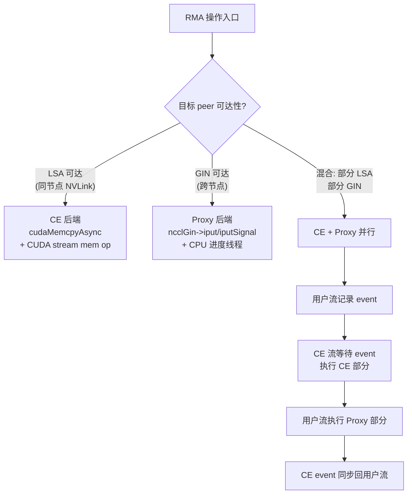

架构入口从用户调用 `ncclRmaPut` 或 `ncclRmaWaitSignal` 开始。系统首先判断每个目标 peer 的可达性：通过 `isLsaAccessible()` 函数检查 peer 是否在本地 LSA (Local Symmetric Address) 团队中——如果在，则该 peer 可以通过 NVLink 直接访问，走 CE 后端；否则走 GIN 网络的 Proxy 后端。

**混合模式的并行执行**是这个架构最精妙的部分。当一次操作同时需要 CE 和 Proxy 时（例如 4-GPU 节点中 2 个本地 peer + 2 个远程 peer），代码在用户流上记录一个 CUDA event，然后让 CE 流等待该 event 后执行本地拷贝，同时用户流继续执行 Proxy 路径。最后 CE 流记录 event 并同步回用户流。这样 NVLink 拷贝和网络传输**真正并行**，总延迟由较慢的路径决定，而非两者之和。具体实现见 `rma.cc` 中的 `ncclRmaPut` 和 `ncclRmaWaitSignal`，它们都遵循相同的 event 记录 -> 双流并行 -> event 同步模式。

---

## 2. 核心数据结构

### 2.1 顶层结构

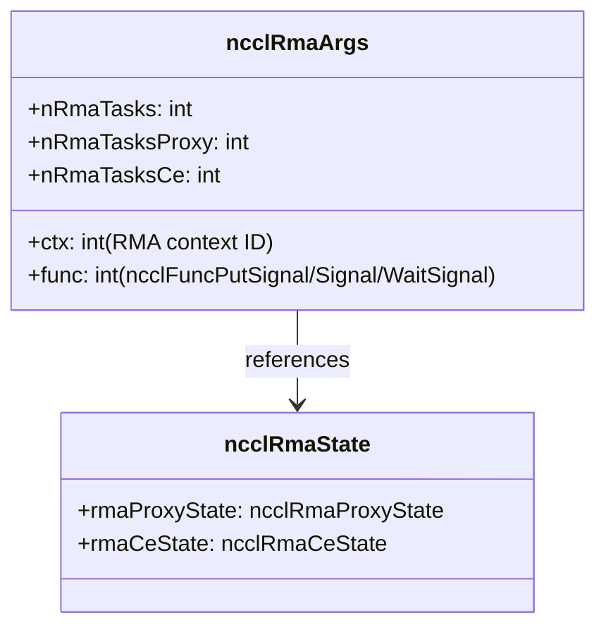

`ncclRmaArgs` 是调度层创建的参数块，挂载在 `ncclKernelPlan` 上。`ctx` 字段标识使用哪个 RMA context——这很重要，因为 NCCL 支持多个 RMA context 并发操作（由 `NCCL_NUM_RMA_CTX` 控制），不同 context 有独立的信号缓冲区和序列号空间，避免了操作间的干扰。`nRmaTasksCe` 和 `nRmaTasksProxy` 分别统计两种后端的任务数，用于决定是否进入混合并行模式。

`ncclRmaState` 是通信器级别的状态，包含两个独立的后端状态。这种分离设计意味着 CE 和 Proxy 可以完全独立地初始化和销毁——如果系统没有 GIN 设备，Proxy 后端永远不会被初始化，不影响 CE 后端的正常工作。

### 2.2 CE 后端结构

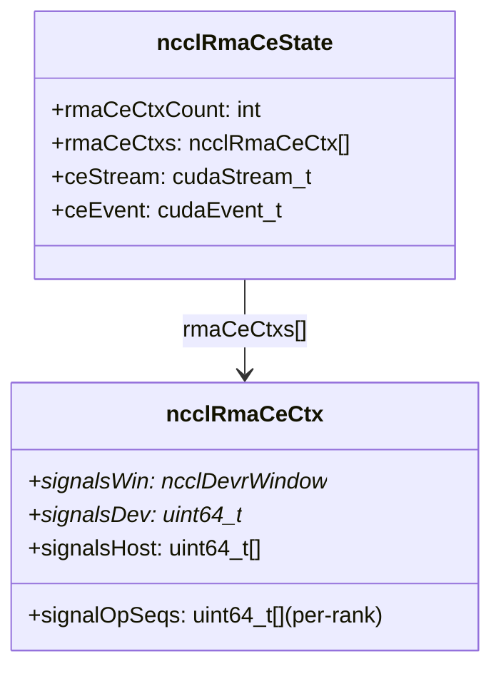

CE 后端的关键设计是 **per-rank 信号计数器**。`signalOpSeqs[peerRank]` 记录了发往该 peer 的累计信号数，每次 Put+Signal 操作递增。`signalsDev` 是设备端信号缓冲区，直接通过 `cudaMemcpyAsync` 写入——因为 CE 走 NVLink，写远端 rank 的信号槽位和写本地内存一样简单。`signalsHost` 是主机端影子副本，用于 WaitSignal 时计算期望值（避免从设备读回数据）。

`ceStream` 和 `ceEvent` 是混合并行模式的核心设施：`ceStream` 是一条非阻塞 CUDA 流，独立于用户流运行，允许 CE 操作与 Proxy 操作并行；`ceEvent`（禁用计时以减少开销）用于两条流之间的同步点。如果只有一个后端参与，这些设施不会被使用。

### 2.3 Proxy 后端结构

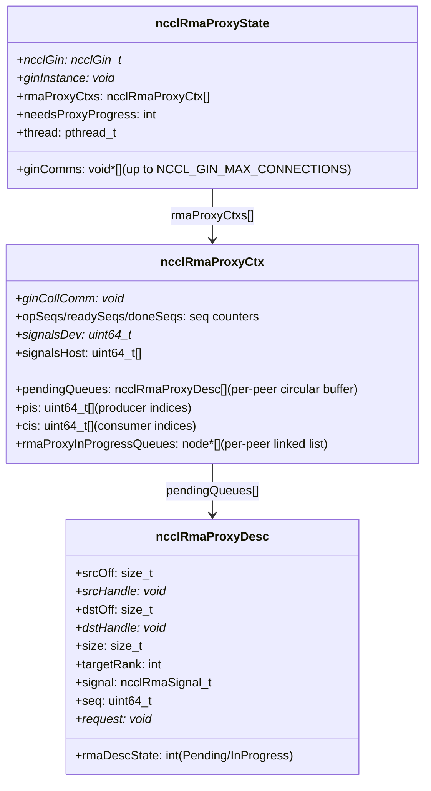

Proxy 后端是 RMA 中最复杂的部分，因为它需要**协调 GPU 和 CPU 之间的异步操作**。

`ncclRmaProxyDesc` 是一个操作描述符，包含 RDMA 所需的全部信息：源/目标的偏移和内存句柄（由 GIN 的 RMA 内存注册提供）、数据大小、目标 rank、信号描述以及序列号。`rmaDescState` 追踪描述符处于 Pending（等待 CPU 线程处理）还是 InProgress（RDMA 操作已提交但未完成）状态。

`ncclRmaProxyCtx` 的 **per-peer 环形缓冲区** (`pendingQueues`) 是 GPU-CPU 通信的核心桥梁。GPU 端作为生产者递增 `pi`，CPU 进度线程作为消费者递增 `ci`。当环形缓冲区满时（`pi - ci >= queueSize`），GPU 端代码会 yield 等待，这保证了不会丢失操作描述符。

三计数器 (`opSeqs`/`readySeqs`/`doneSeqs`) 实现了无需内核启动的 GPU-CPU 同步管道（详见第 7.2 节）。

`ncclRmaProxyState` 管理多个 GIN communicator 连接（最多 `NCCL_GIN_MAX_CONNECTIONS` 个），以及一个可选的 CPU 进度线程。`needsProxyProgress` 标志决定了是否需要专用线程——某些 GIN 实现可能自带进度机制，此时不需要 NCCL 额外创建线程。

---

## 3. 操作类型

| 操作 | 说明 | CE 路径 | Proxy 路径 |
|------|------|---------|-----------|
| **Put** | 写数据到远端 rank | cudaMemcpyAsync | ncclGin->iput |
| **Put+Signal** | 写数据 + 原子通知 | cudaMemcpyAsync + 写 signal | ncclGin->iputSignal |
| **Signal** | 仅原子通知 (无数据) | 写 signal | ncclGin->iputSignal (data=0) |
| **WaitSignal** | 等待远端通知 | WAIT_VALUE_64 | WAIT_VALUE_64 |

四种操作的语义设计遵循**最小正交原则**：Put 是纯数据传输，Signal 是纯通知，Put+Signal 是两者的原子组合（远端要么看到数据和信号同时到达，要么都看不到），WaitSignal 是接收端的同步原语。

**为什么需要单独的 Signal 操作？** 在很多控制流场景中，数据已经通过其他方式（如常规集合操作）传到了远端，只需要一个轻量的通知来触发下游处理。单独的 Signal 避免了零长度 Put 的语义歧义和开销。

**Put+Signal 的原子性保证**至关重要：如果分开调用 Put 和 Signal，远端可能在数据尚未完全写入时就看到信号，导致读取到不完整的数据。Put+Signal 确保信号只在数据完整写入后才被设置，这是正确性的基础保证。

在 CE 路径中，Put 和 Signal 分别通过两次独立的 `cudaMemcpyAsync` 实现——但由于 NVLink 传输是顺序的（同一 CUDA 流中），信号写入一定在数据写入之后完成，从而保证了等效的原子性。在 Proxy 路径中，GIN 的 `iputSignal` 是原生的 RDMA 写+通知操作，由硬件保证原子性。

---

## 4. Put 执行流程

### 4.1 任务调度 (scheduleRmaTasksToPlan)

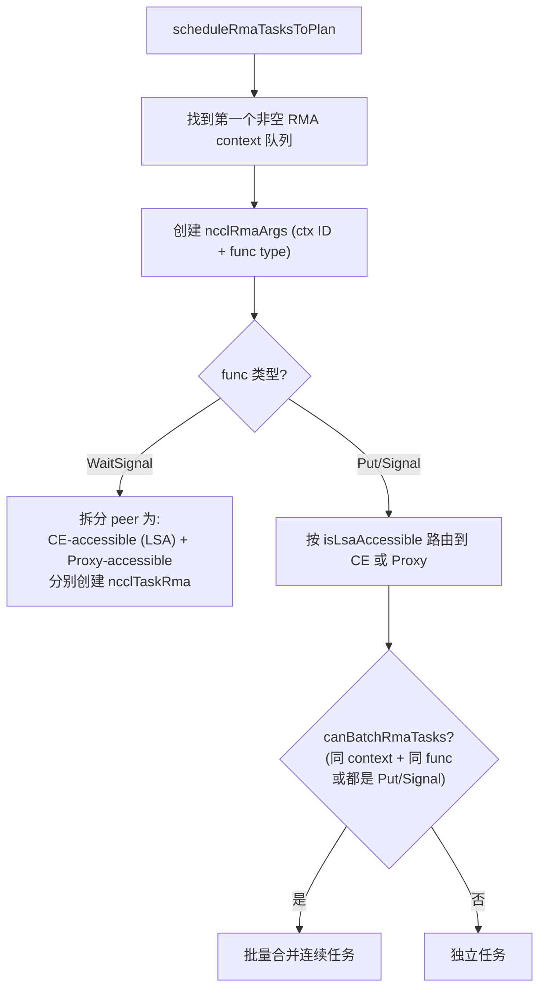

调度层负责将用户发起的 RMA 操作转化为可执行的任务。`scheduleRmaTasksToPlan` 从 RMA context 队列中取出待执行的操作，根据操作类型和 peer 可达性分配到不同的后端。

**WaitSignal 的特殊处理**：与 Put/Signal 不同，WaitSignal 可能需要同时等待来自 CE peer 和 Proxy peer 的信号。因此代码将 WaitSignal 的 peer 列表拆分为 CE-accessible 和 Proxy-accessible 两组，分别为每组创建 `ncclTaskRma`。这就是为什么 `ncclRmaArgs` 有 `nRmaTasksCe` 和 `nRmaTasksProxy` 两个计数器——它们对应同一个 WaitSignal 操作的不同 peer 子集。

**批量合并** (`canBatchRmaTasks`) 是一个重要的性能优化：当多个连续的 Put/Signal 操作属于同一个 RMA context 且操作类型兼容时，它们可以合并为一个任务，减少 GPU kernel launch 和 CUDA stream mem op 的开销。这在大量小消息场景下尤为有效。

### 4.2 CE Put 执行

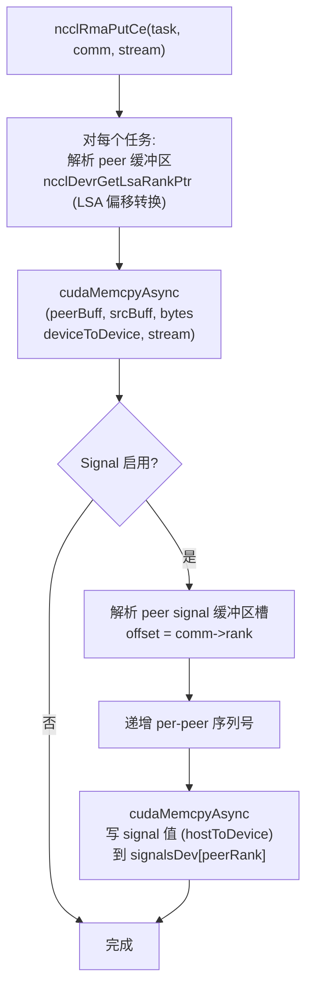

CE Put 执行路径是整个 RMA 中最简洁的，因为它充分利用了 NVLink 的对称寻址能力。

**地址转换的关键步骤**：`ncclDevrGetLsaRankPtr` 将 peer 的窗口偏移量转换为实际的设备指针。在 LSA 团队中，所有 rank 的缓冲区被映射到一个连续的 128GB 虚拟地址空间（`lsaFlatBase`），peer 的地址可以通过 `lsaFlatBase + lsaPeer * bigSize + offset` 直接计算出来，无需任何查表或间接寻址。这就是"对称内存"的核心价值——远端地址可以纯算术计算，无需握手或查表。

数据拷贝使用标准的 `cudaMemcpyAsync`，direction 为 `cudaMemcpyDeviceToDevice`。在 NVLink 上，这就是一次高速的 P2P 传输，带宽可达数百 GB/s。

**信号写入**使用 `cudaMemcpyAsync` 的 `cudaMemcpyHostToDevice` 模式将 host 端计算的信号值写入 peer 的信号缓冲区。虽然这看起来比直接用 CUDA stream memory operation 效率低，但它保证了跨 NVLink 域的写入正确性——stream mem op 只能写本地可寻址的内存。

### 4.3 Proxy Put 执行

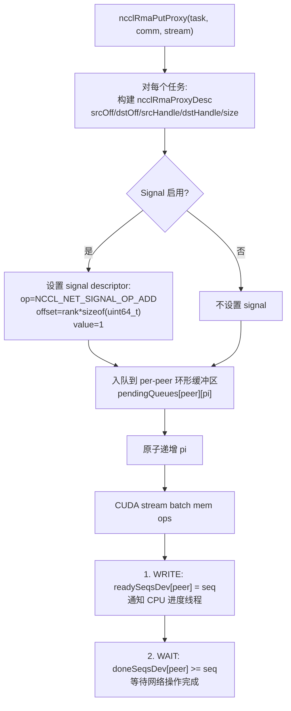

Proxy Put 执行路径展示了 GPU-CPU 协同工作的完整流程。

**描述符构建**：每个 Put 操作被封装为一个 `ncclRmaProxyDesc`，包含 RDMA 所需的全部信息。`srcHandle` 和 `dstHandle` 是 GIN 注册的内存句柄（类似 IBV 的 MR lkey/rkey），GIN 硬件通过这些句柄可以直接访问远程内存，无需 CPU 参与。`srcOff` 和 `dstOff` 是窗口内的偏移量，与句柄组合后可以定位到精确的缓冲区位置。

**信号描述**：当 Signal 启用时，描述符附带一个 `ncclRmaSignal_t` 结构，指定信号操作类型为 `NCCL_NET_SIGNAL_OP_ADD`（原子加），目标偏移为 `rank * sizeof(uint64_t)`（写入远端信号缓冲区的对应槽位），值为 1。使用 ADD 而非 WRITE 是因为多个 rank 可能同时向同一个 peer 发送信号，ADD 操作保证了计数器的正确累加。

**环形缓冲区入队**：描述符被写入 `pendingQueues[peer * queueSize + (pi & (queueSize-1))]`，然后原子递增 `pi`。如果缓冲区已满，代码会先 flush 已有的 batch mem op，然后 yield 等待 CPU 进度线程消费。这个 back-pressure 机制防止了 GPU 端无限生产导致内存耗尽。

**CUDA stream batch mem ops** 是整个流程的同步枢纽（详见第 7.2 节）。两步操作——WRITE readySeqs 和 WAIT doneSeqs——实现了轻量级的 GPU-CPU-GPU 同步，无需任何内核启动。

---

## 5. Proxy 进度线程

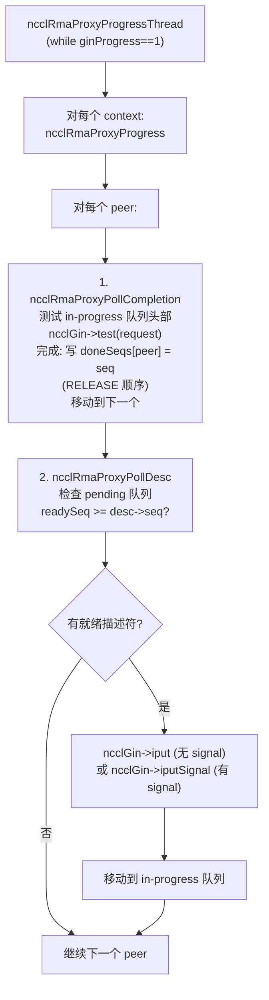

Proxy 进度线程是 CPU 端的核心驱动，负责将 GPU 提交的 RDMA 请求真正发送到网络。

**为什么需要 CPU 线程？** GIN (GPU-Initiated Networking) 虽然名为"GPU 发起的网络"，但在当前实现中，RDMA 操作的发起仍然需要 CPU 调用 GIN 插件的 `iput`/`iputSignal` 接口。GPU 端只负责构建描述符和设置同步标志，真正的网络 I/O 由 CPU 代理完成。这种设计是因为 RDMA 操作涉及复杂的队列管理、错误处理和重传逻辑，这些在 CPU 上实现比在 GPU 上更可靠和灵活。

**两阶段轮询**：线程在每个 peer 上执行两个阶段。第一阶段 (`ncclRmaProxyPollCompletion`) 检查已提交的 RDMA 操作是否完成——通过调用 `ncclGin->test(request)` 查询完成状态。完成后，以 RELEASE 内存序写入 `doneSeqs[peer]`，确保之前的 RDMA 写入对 GPU 可见。第二阶段 (`ncclRmaProxyPollDesc`) 检查是否有新的待处理描述符——通过比较 `readySeqs[peer]` 和描述符的序列号。如果描述符就绪，调用 `ncclGin->iput` 或 `iputSignal` 发起 RDMA 操作，然后将描述符移到 in-progress 链表。

**线程生命周期管理**：进度线程通过 `ginProgress` 状态变量控制。`1` 表示正常运行，`-1` 表示应退出，`0` 表示暂停等待（使用条件变量），`-2` 表示遇到错误。这种状态机设计允许通信器销毁时优雅地停止线程。

---

## 6. WaitSignal 执行

### 6.1 CE WaitSignal

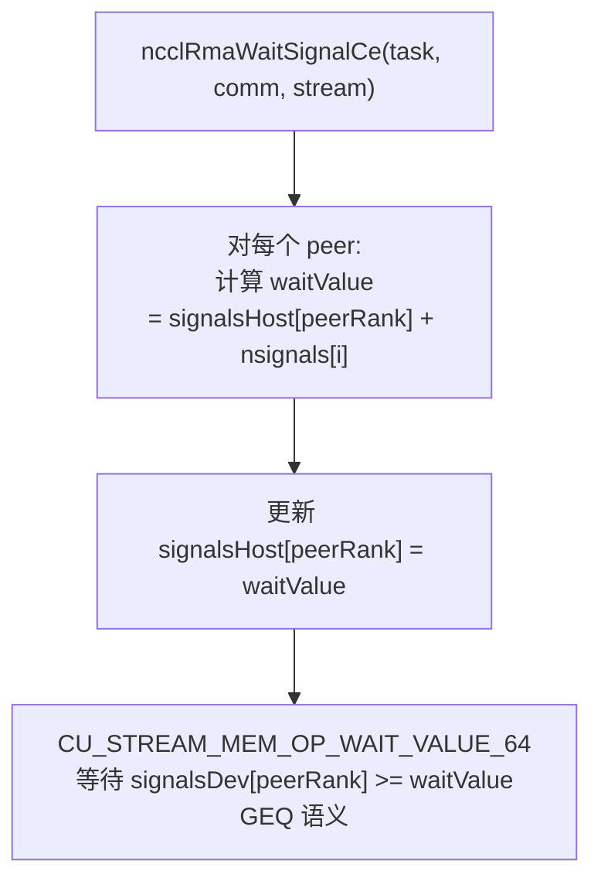

CE WaitSignal 使用 CUDA stream memory operation 的 `WAIT_VALUE_64` 原语在 GPU 流中插入一个等待点。这个等待是**非阻塞的**——它不会阻塞 CPU，只是在 GPU 流中建立一个依赖关系：后续操作只有在信号值满足条件后才会开始执行。

**期望值计算**：`signalsHost[peerRank]` 维护了该 peer 之前已经看到的信号值，`nsignals[i]` 是本次 WaitSignal 期望收到的新信号数。两者的和就是本次需要等待的目标值。更新 `signalsHost` 确保了下次 WaitSignal 不会重复等待已到达的信号。

**GEQ (大于等于) 语义**：使用 `>=` 而非 `==` 是关键设计——因为信号值是单调递增的（ADD 操作），多个信号可能合并到达，使用 GEQ 语义确保了即使信号值超过了期望值（例如多个 Put+Signal 几乎同时完成），等待也能正确解除。

### 6.2 Proxy WaitSignal

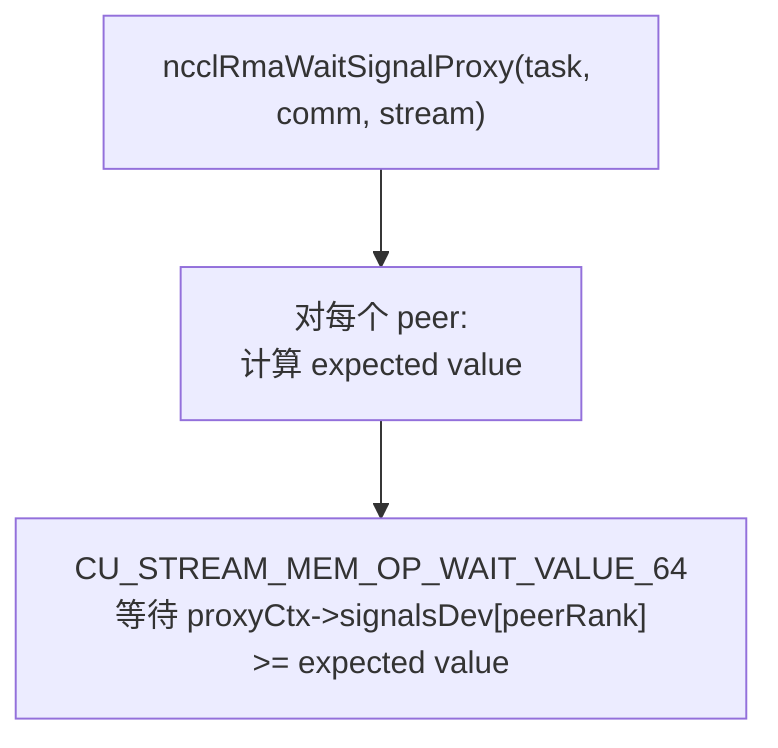

Proxy WaitSignal 与 CE WaitSignal 的机制完全相同——都是 `WAIT_VALUE_64` + GEQ 语义。区别在于等待的信号缓冲区不同：CE 路径等待的是 CE context 的 `signalsDev`（由 NVLink 直接写入），Proxy 路径等待的是 Proxy context 的 `signalsDev`（由 CPU 进度线程在 RDMA 完成后写入）。

**这种统一性是有意为之的**：对调用者而言，无论信号来自 NVLink 还是网络，WaitSignal 的行为完全一致。这大大简化了上层逻辑——调用者不需要关心信号的传输路径。

---

## 7. 信号协议

### 7.1 信号缓冲区布局

```
offset [0]:        rank 0 的信号 (uint64_t)
offset [1]:        rank 1 的信号
...
offset [nRanks-1]: rank nRanks-1 的信号
offset [nRanks]:   聚合信号 (保留)
```

每个 rank 拥有自己的信号槽位，由所有其他 rank 共同写入。这种布局使得任意 rank i 只需查看 `signals[myRank]` 就能知道自己收到了多少信号，而无需遍历所有 peer 的信号。

**为什么使用 per-rank 槽位而不是单一计数器？** 如果所有 rank 写同一个计数器，ADD 操作虽然原子但会丢失来源信息——你无法知道哪个 rank 发了信号、发了几个。per-rank 槽位保留了完整的来源信息，WaitSignal 可以精确等待特定 peer 的特定数量信号。

**聚合信号槽位** (`offset[nRanks]`) 是保留字段，用于未来可能的"等待所有 rank"的快捷操作——一次等待聚合值就等于等待所有 rank 的信号总和，避免逐一检查每个槽位。

### 7.2 Proxy 三计数器同步

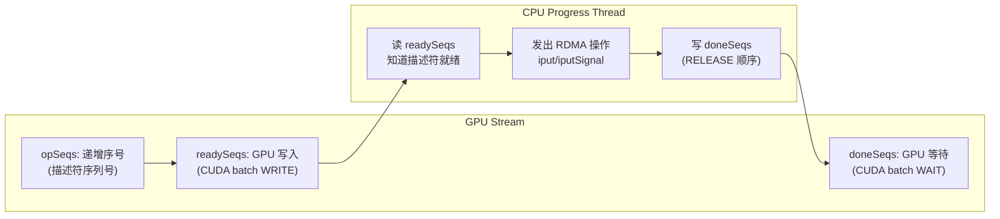

这个三计数器协议实现了 GPU→CPU→Network→CPU→GPU 的完整同步管道，无需任何内核启动。

这是 Proxy 后端最核心的设计创新。传统的 GPU-CPU 同步需要通过内核启动或 cuStreamCallback 等重量级机制，延迟在微秒级别。三计数器协议将同步成本降低到了**纳秒级别**——只有两次 CUDA stream memory operation（一次 WRITE，一次 WAIT），这些操作在 GPU stream 中作为轻量级命令执行，不涉及任何 CPU 中断或内核调用。

**三计数器各自的角色**：
- **opSeqs**：GPU 端分配的递增序列号，每创建一个描述符就递增。它赋予了描述符全局顺序——CPU 端可以按序处理，避免乱序完成导致的一致性问题。
- **readySeqs**：GPU 写入，CPU 读取。GPU 端在提交描述符到环形缓冲区后，通过 CUDA batch WRITE 将 `readySeqs[peer]` 更新为最新描述符的序列号。CPU 进度线程在轮询时读取 `readySeqs[peer]`，如果大于等于某个待处理描述符的序列号，就说明该描述符已经就绪可以发起 RDMA。
- **doneSeqs**：CPU 写入（RELEASE 顺序），GPU 等待。CPU 进度线程在 RDMA 操作完成后，以 RELEASE 内存序写入 `doneSeqs[peer] = seq`。GPU 端通过 CUDA batch WAIT 等待 `doneSeqs[peer] >= seq`，确保后续操作能看到 RDMA 写入的数据。

**RELEASE 顺序的意义**：`doneSeqs` 的写入必须使用 RELEASE 语义（在 x86 上是 `mfence` + store，在 ARM 上是 `dmb ish` + store），确保 RDMA 写入的数据对 GPU 可见先于 `doneSeqs` 的更新。否则 GPU 可能在数据尚未到达时就看到 `doneSeqs` 更新，读到过时数据。

---

## 8. CE 初始化

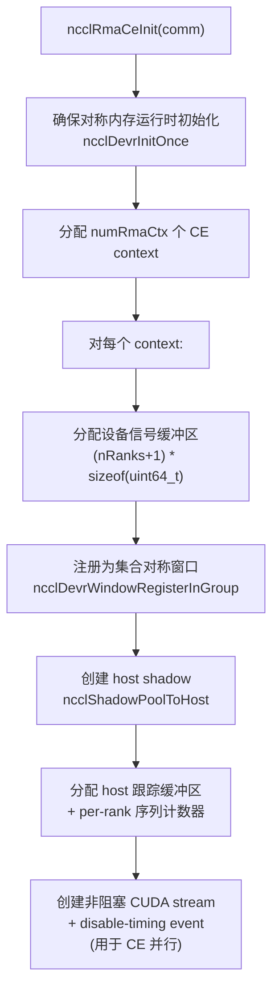

CE 初始化的核心任务是**建立对称信号缓冲区**和**准备并行执行设施**。

**ncclDevrInitOnce** 确保对称内存运行时（devr）已经初始化。这是必须的先决条件，因为 CE 后端依赖 LSA 寻址能力——没有对称内存，就无法通过 `ncclDevrGetLsaRankPtr` 计算 peer 的缓冲区地址。

**信号缓冲区注册为对称窗口** (`ncclDevrWindowRegisterInGroup` + `NCCL_WIN_COLL_SYMMETRIC`) 是 CE 信号机制的关键。注册后，所有 rank 的信号缓冲区被映射到对称地址空间，任一 rank 都可以通过 LSA 偏移直接写入远端 rank 的信号槽位，无需知道远端的实际物理地址。这种"注册一次，全局可见"的模型大大简化了跨 rank 的内存访问。

**Host shadow** (`ncclShadowPoolToHost`) 为设备端对称窗口创建一个主机端可访问的映射。这是 WaitSignal 计算期望值所必需的——`signalsHost` 数组需要跟踪每个 peer 的信号累加值，而这个值只在主机端维护（避免频繁的 device-to-host 拷贝）。

**非阻塞 CUDA stream** (`cudaStreamNonBlocking`) 确保了 CE 流不会与默认流同步，从而实现与用户流的真正并行。**禁用计时的 event** (`cudaEventDisableTiming`) 减少了 event 创建和记录的开销，因为 CE event 只用于同步，不用于计时。

---

## 9. Proxy 连接建立

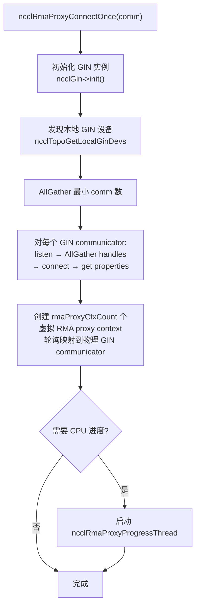

Proxy 连接建立是一个多步骤的分布式协商过程，涉及所有 rank 的协调。

**GIN 实例初始化** (`ncclGin->init()`) 加载并初始化 GIN 插件。GIN 是 NCCL 的 GPU-Initiated Networking 抽象，允许 GPU 直接发起网络操作。在 RMA 场景中，GIN 提供 RDMA Put 和 Signal 的能力。

**本地 GIN 设备发现** (`ncclTopoGetLocalGinDevs`) 查询拓扑系统找到本节点上的 GIN 设备（通常是 BlueField DPU 或 ConnectX NIC 支持 DOCA GPUNetIO 的实例）。如果节点没有 GIN 设备，Proxy 后端不会被初始化。

**AllGather 最小 comm 数** 是一个关键的优化步骤：每个 rank 可能需要不同数量的 GIN communicator（取决于其 GIN 设备数），所有 rank 必须就最小值达成一致，以确保所有 rank 都能建立相同数量的连接。这个协商避免了部分 rank 建立了连接而其他 rank 无法匹配的情况。

**虚拟 RMA proxy context 轮询映射**：创建的虚拟 context 数量（`rmaProxyCtxCount`，由 `NCCL_NUM_RMA_CTX` 控制）可能多于物理 GIN communicator 数量。多个虚拟 context 通过 round-robin 方式映射到同一个物理 communicator，实现了多路复用——不同的 RMA context 共享同一组网络连接，但各自维护独立的信号和队列状态。

**CPU 进度线程的条件启动**：如果 GIN 插件自身提供了操作进度机制（`needsProxyProgress == false`），则不需要 NCCL 创建专用线程。这避免了不必要的 CPU 开销，特别是在 GIN 硬件可以自主完成 RDMA 操作的未来架构中。

---

## 10. 关键源文件

| 文件 | 行数 | 功能 |
|------|------|------|
| `src/rma/rma.cc` | ~300 | RMA 顶层调度、Put/WaitSignal 入口 |
| `src/rma/rma_ce.cc` | ~300 | CE 后端 (NVLink) |
| `src/rma/rma_proxy.cc` | ~600 | Proxy 后端 (GIN 网络)、进度线程 |
| `src/include/rma/rma.h` | ~40 | 顶层数据结构 |
| `src/include/rma/rma_ce.h` | ~50 | CE 数据结构 |
| `src/include/rma/rma_proxy.h` | ~120 | Proxy 数据结构 |
