# NCCL RMA 远程内存访问

RMA (Remote Memory Access) 提供单边通信原语 (Put, Signal, WaitSignal)，支持两个可并行运行的后端：CE (Copy Engine, 节点内 NVLink) 和 Proxy (GIN 网络, 跨节点)。

---

## 1. RMA 架构总览

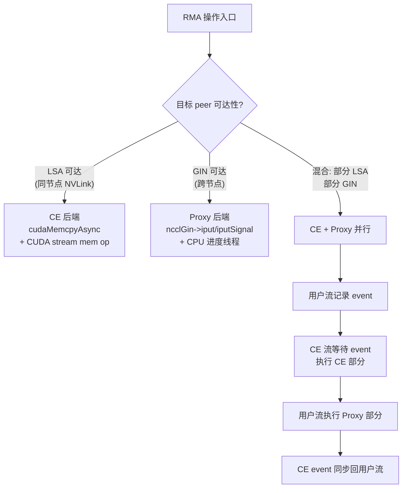

---

## 2. 核心数据结构

### 2.1 顶层结构

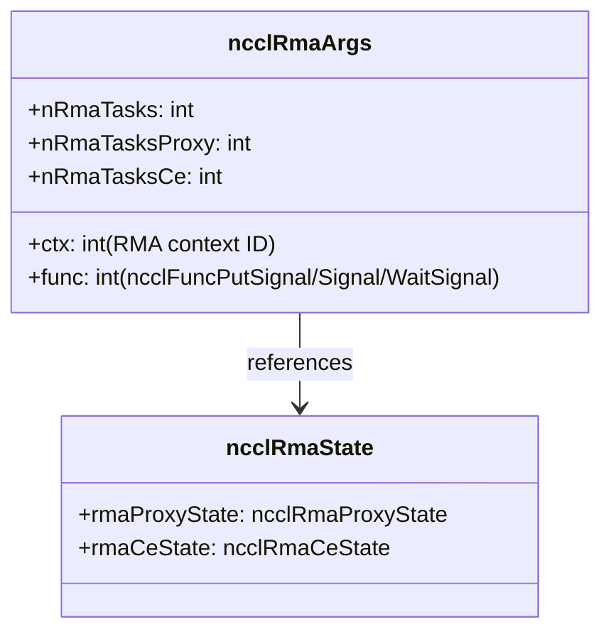

### 2.2 CE 后端结构

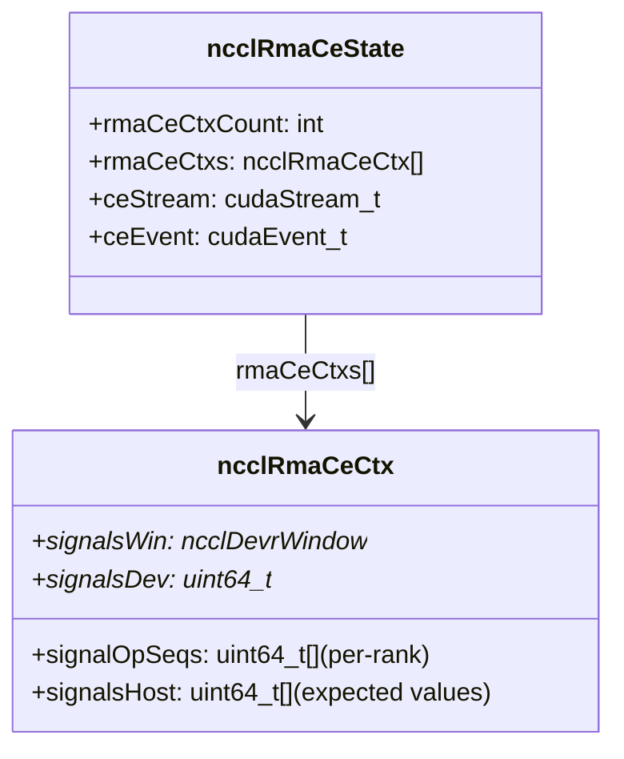

### 2.3 Proxy 后端结构

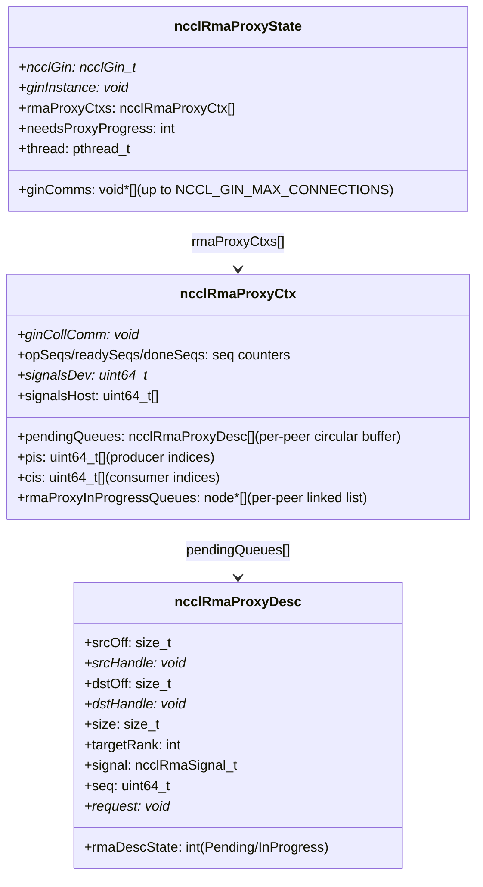

---

## 3. 操作类型

| 操作 | 说明 | CE 路径 | Proxy 路径 |
|------|------|---------|-----------|
| **Put** | 写数据到远端 rank | cudaMemcpyAsync | ncclGin->iput |
| **Put+Signal** | 写数据 + 原子通知 | cudaMemcpyAsync + 写 signal | ncclGin->iputSignal |
| **Signal** | 仅原子通知 (无数据) | 写 signal | ncclGin->iputSignal (data=0) |
| **WaitSignal** | 等待远端通知 | WAIT_VALUE_64 | WAIT_VALUE_64 |

---

## 4. Put 执行流程

### 4.1 任务调度 (scheduleRmaTasksToPlan)

```mermaid
flowchart TD
    A["scheduleRmaTasksToPlan"] --> B["找到第一个非空 RMA context 队列"]
    B --> C["创建 ncclRmaArgs (ctx ID + func type)"]

    C --> D{func 类型?}
    D -->|"WaitSignal"| D1["拆分 peer 为:\nCE-accessible (LSA) + Proxy-accessible\n分别创建 ncclTaskRma"]
    D -->|"Put/Signal"| D2["按 isLsaAccessible 路由到 CE 或 Proxy"]

    D2 --> E{canBatchRmaTasks?\n(同 context + 同 func\n或都是 Put/Signal)}
    E -->|"是"| F["批量合并连续任务"]
    E -->|"否"| G["独立任务"]
```

### 4.2 CE Put 执行

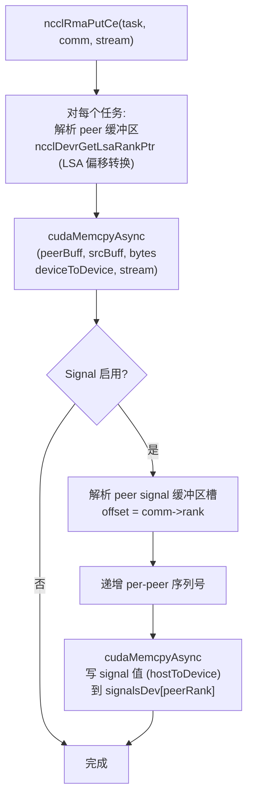

### 4.3 Proxy Put 执行

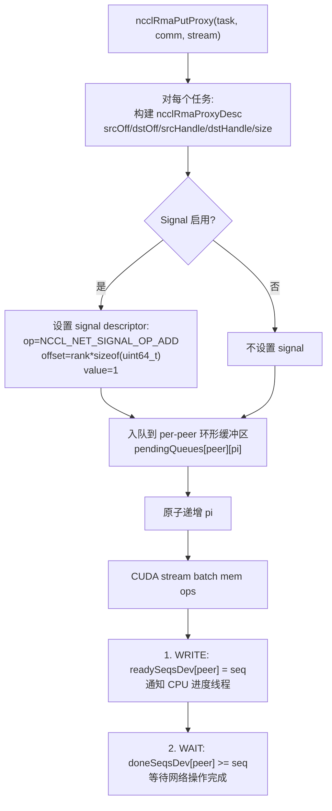

---

## 5. Proxy 进度线程

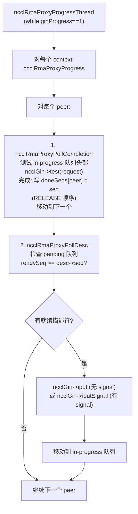

---

## 6. WaitSignal 执行

### 6.1 CE WaitSignal

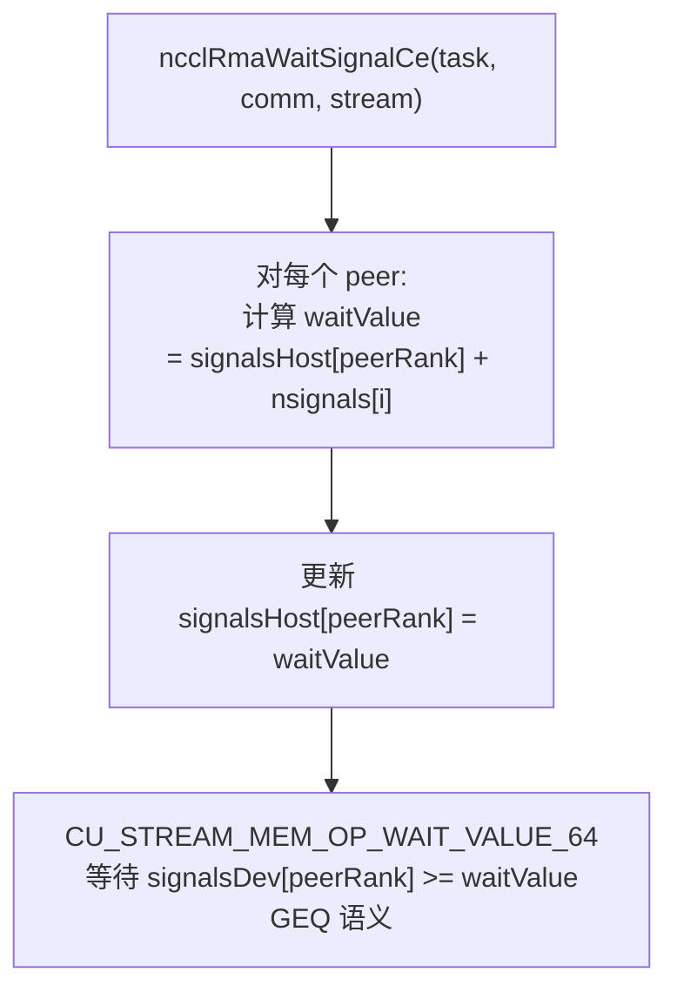

### 6.2 Proxy WaitSignal

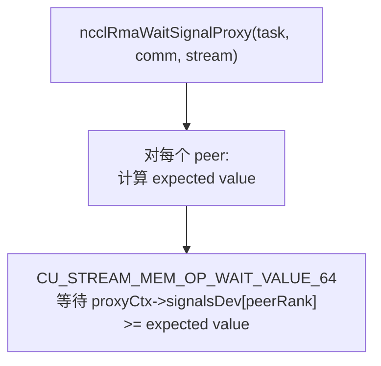

---

## 7. 信号协议

### 7.1 信号缓冲区布局

```
offset [0]:        rank 0 的信号 (uint64_t)
offset [1]:        rank 1 的信号
...
offset [nRanks-1]: rank nRanks-1 的信号
offset [nRanks]:   聚合信号 (保留)
```

### 7.2 Proxy 三计数器同步

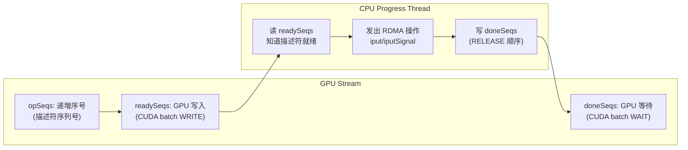

这个三计数器协议实现了 GPU→CPU→Network→CPU→GPU 的完整同步管道，无需任何内核启动。

---

## 8. CE 初始化

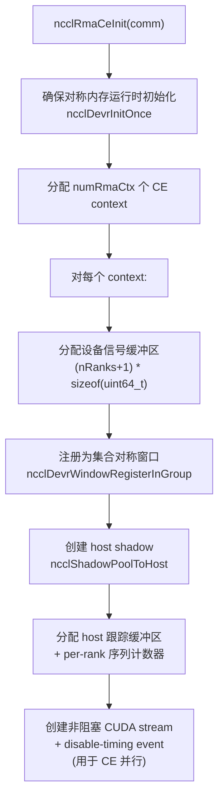

---

## 9. Proxy 连接建立

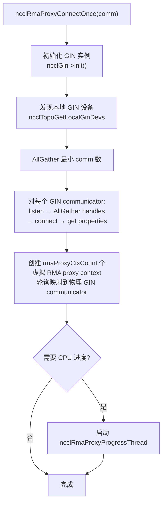

---

## 10. 关键源文件

| 文件 | 行数 | 功能 |
|------|------|------|
| `src/rma/rma.cc` | ~300 | RMA 顶层调度、Put/WaitSignal 入口 |
| `src/rma/rma_ce.cc` | ~300 | CE 后端 (NVLink) |
| `src/rma/rma_proxy.cc` | ~600 | Proxy 后端 (GIN 网络)、进度线程 |
| `src/include/rma/rma.h` | ~40 | 顶层数据结构 |
| `src/include/rma/rma_ce.h` | ~50 | CE 数据结构 |
| `src/include/rma/rma_proxy.h` | ~120 | Proxy 数据结构 |
