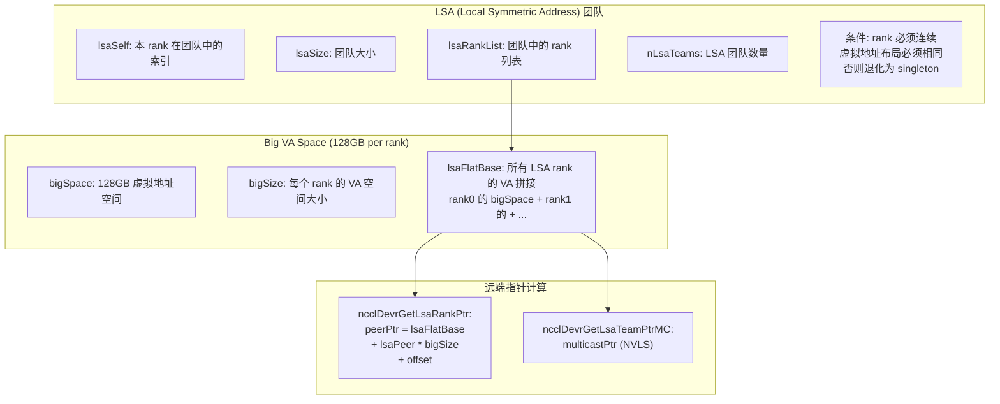
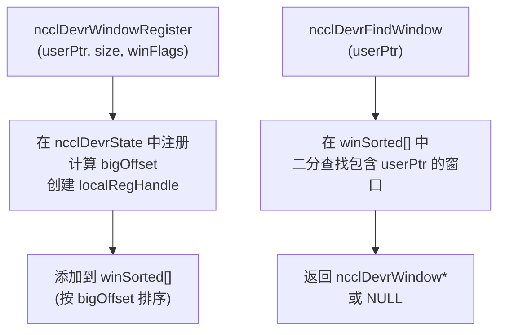
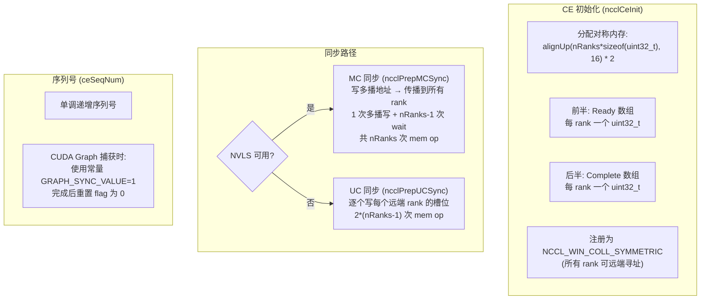
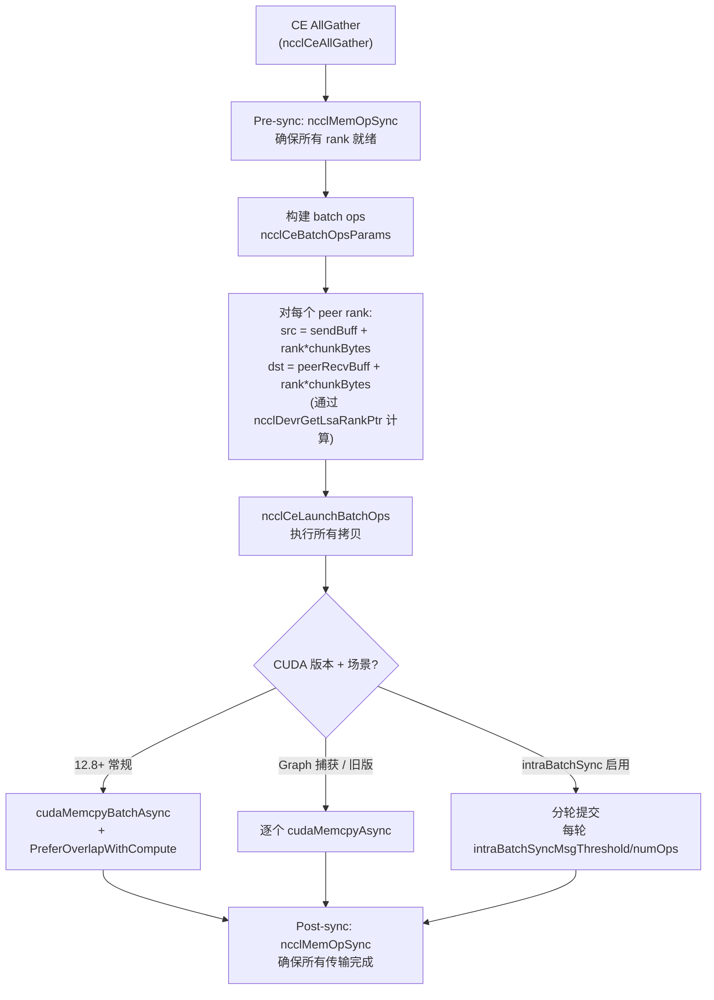
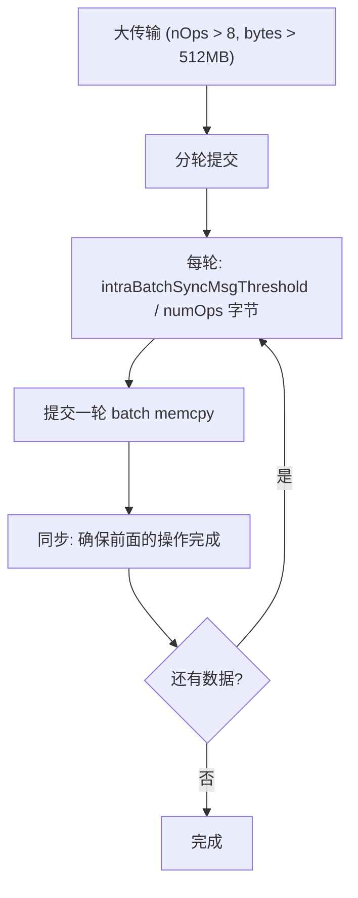
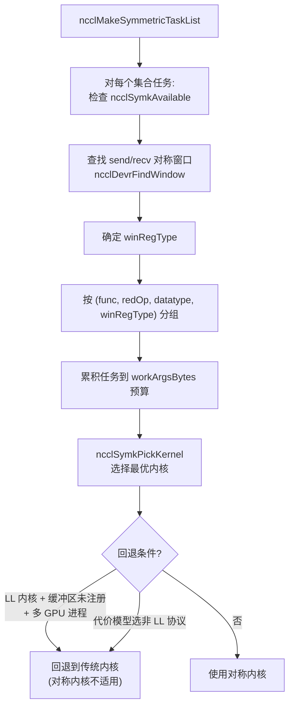
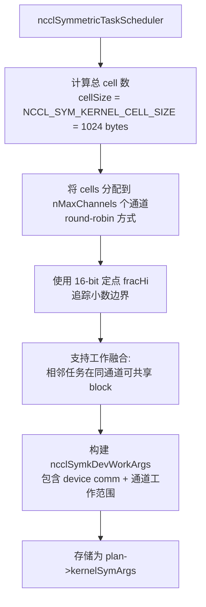

# NCCL 对称内存与 CE 集合操作

对称内存 (Symmetric Memory) 是 NCCL 的高级内存抽象，为 CE 集合操作和对称内核提供 LSA (Local Symmetric Address) 团队和大 VA 空间支持，使 GPU 内核能够直接计算远端 rank 的缓冲区地址。

对称内存解决的核心问题是**远端寻址**。在传统集合通信中，GPU 内核只能访问本地内存，远端数据必须通过传输层（P2P/NET）搬运。而对称内存通过将所有 rank 的缓冲区映射到统一的虚拟地址空间，使得 GPU 代码可以像访问本地内存一样访问远端 rank 的数据——只需要一个简单的算术计算就能得到远端地址。这消除了传输层的协议开销，使 CE 集合操作能够直接用 `cudaMemcpyAsync` 完成跨 rank 拷贝，也使对称内核能够通过 `multimem_st_global` 指令直接写入远端内存。

---

## 1. 对称内存运行时 (devr)

### 1.1 核心概念

**LSA 团队**是对称内存的基本组织单元。同一个 LSA 团队中的 rank 满足两个条件：(1) rank 编号连续，(2) 虚拟地址布局相同。条件(1)使得 rank 索引可以直接用作数组下标；条件(2)确保了相同的窗口偏移量在所有 rank 上对应相同的相对位置。

**为什么要求 rank 连续？** LSA 的远端寻址公式 `lsaFlatBase + lsaPeer * bigSize + offset` 中，`lsaPeer` 是 0-based 的团队内索引。如果 rank 不连续（例如只有 rank 0, 3, 7），那么 `lsaPeer` 到实际 rank 的映射就不简单了，增加了计算复杂度。连续 rank 使得这个映射退化为简单的偏移，GPU 内核可以用一条乘加指令完成。

**退化为 singleton** 是一个安全的降级策略：当 LSA 团队条件不满足时（例如跨节点的 rank 虚拟地址布局不同），该 rank 自成一组，`lsaSize=1`。此时对称内存机制不会崩溃，只是无法享受跨 rank 的直接寻址能力——相关操作会回退到传统的传输路径。

**Big VA Space** 是 NVIDIA CUDA 的虚拟地址管理特性。每个 rank 分配 128GB 的虚拟地址空间（实际物理内存按需分配），所有 LSA 团队成员的空间拼接成 `lsaFlatBase`。这个巨大的地址空间预留使得偏移计算永远不会溢出，也使得多播地址（NVLS）可以在同一地址空间中分配。

**两种远端指针计算方式**：
- `ncclDevrGetLsaRankPtr`：计算单播远端地址，用于 CE 集合操作中的点对点拷贝。纯算术计算，零开销。
- `ncclDevrGetLsaTeamPtrMC`：计算多播地址，用于 NVLS (NVLink SHARP) 的多播操作。多播地址指向 NVLS 硬件，一次写入自动传播到所有团队成员。

### 1.2 窗口注册

窗口注册是对称内存的"发布"机制——只有通过窗口注册的缓冲区才能被远端 rank 通过 LSA 寻址访问。

**注册流程**：`ncclDevrWindowRegister` 将用户缓冲区映射到 big VA 空间中的某个偏移位置 (`bigOffset`)。这个偏移是全局一致的——所有 rank 上相同逻辑位置的缓冲区获得相同的 bigOffset，这是对称寻址的基础。`localRegHandle` 是 CUDA 的内存注册句柄，允许跨进程访问。

**二分查找窗口**：`ncclDevrFindWindow` 根据用户指针查找所属的窗口。这在对称内核启动时被频繁调用——内核需要知道每个缓冲区对应哪个窗口，以便计算远端地址。窗口按 `bigOffset` 排序（`winSorted[]`），查找复杂度 O(log N)，对性能影响可忽略。

**winFlags 的作用**：注册时的标志位决定窗口的可见性范围。`NCCL_WIN_COLL_SYMMETRIC` 表示窗口在所有 LSA 团队成员间对称可见，这是 CE 集合操作和对称内核的前提条件。

### 1.3 窗口注册类型

| 类型 | 值 | 含义 |
|------|---|------|
| `ncclSymSendNonregRecvNonreg` | 0 | 发送/接收都未注册 |
| `ncclSymSendNonregRecvReg` | 1 | 仅接收端注册 (CE 可用) |
| `ncclSymSendRegRecvNonreg` | 2 | 仅发送端注册 |
| `ncclSymSendRegRecvReg` | 3 | 双端注册 (对称内核可用) |

注册类型的组合决定了哪些对称操作可以使用该缓冲区。**CE 集合操作**只需要接收端注册（类型 1 或 3），因为 CE 操作是从发送端向接收端拷贝，接收端必须通过对称窗口可寻址。**对称内核**需要双端注册（类型 3），因为内核代码直接在发送端计算远端接收端的地址，两端都必须在 LSA 空间中注册。

这种分级的注册机制是一个重要的**性能与灵活性权衡**：强制双端注册会增加初始化开销和内存占用，但很多场景（如 CE 集合操作）并不需要发送端注册。通过区分注册类型，NCCL 允许用户按需注册，减少不必要的开销。

---

## 2. CE 集合操作

### 2.1 支持条件

| 条件 | 要求 |
|------|------|
| CUDA 版本 | >= 12.5 |
| 节点范围 | 仅单节点 |
| 对称内存 | 必须启用 (comm->symmetricSupport) |
| 缓冲区注册 | 发送端和接收端必须通过对称窗口注册 |
| 支持的集合 | AllGather, AlltoAll, Scatter, Gather |
| 不支持 | 规约操作 (Reduce, AllReduce 等) |

**CUDA 12.5 最低版本要求**源于 `cudaMemcpyBatchAsync` API 的引入。这个批量拷贝 API 允许在一次调用中提交多个 `cudaMemcpyAsync` 操作，GPU 硬件可以更高效地调度这些拷贝，减少提交开销。在 CUDA 12.8+ 中，还支持 `PreferOverlapWithCompute` 标志，进一步优化拷贝与计算的并行度。

**仅单节点**限制是因为 CE 集合操作依赖 NVLink 的 P2P 拷贝能力。跨节点的拷贝必须经过网络（IB/RoCE），需要传输层的 Proxy 线程参与，不在 CE 的设计范围内。

**不支持规约操作**是 CE 集合操作的固有局限：`cudaMemcpyAsync` 只能做数据搬运，不能做算术运算。AllReduce 等规约操作需要 GPU 内核执行加法/乘法等计算，CE 无法胜任。这类操作由对称内核处理。

### 2.2 同步协议

CE 同步协议保证所有 rank 在数据拷贝开始前都已就绪（Pre-sync），在拷贝完成后才继续执行（Post-sync）。这类似于 MPI 的 barrier 语义，但完全在 GPU stream 中实现，不涉及 CPU。

**Ready/Complete 双数组设计**：Ready 数组在 Pre-sync 阶段使用，每个 rank 写入自己的 Ready 槽位并等待其他 rank 的槽位；Complete 数组在 Post-sync 阶段使用，逻辑相同。分离两个数组避免了同一内存位置的写-读竞争，也使得 Pre-sync 和 Post-sync 可以使用不同的序列号。

**MC 同步 vs UC 同步的性能差异巨大**：在有 NVLS 硬件时，MC 同步只需 1 次多播写 + nRanks-1 次 wait，总共 nRanks 次 stream mem op；UC 同步需要向 nRanks-1 个远端分别写入，加上 nRanks-1 次 wait，总共 2*(nRanks-1) 次。在大规模系统中（如 256 GPU），MC 同步的 mem op 数量从 510 降到 256，显著减少 GPU command buffer 的压力。

**CUDA Graph 兼容性**：CE 操作需要在 CUDA Graph 捕获模式下正常工作。但 Graph 捕获时不能使用动态序列号（因为 Graph 会重放多次），因此代码使用常量 `GRAPH_SYNC_VALUE=1` 替代递增的 `ceSeqNum`。每次操作完成后重置 flag 为 0，为下次重放做准备。这个技巧使得 CE 集合操作既支持即时执行也支持 Graph 捕获。

### 2.3 CE AllGather 流程

CE AllGather 是对称内存最典型的应用场景。每个 rank 向所有其他 rank 的接收缓冲区写入自己的数据块，实现全收集。

**Pre-sync 的必要性**：在开始拷贝前，必须确保所有 rank 的接收缓冲区已经准备好。如果 rank A 开始向 rank B 的缓冲区写入，而 rank B 还在使用该缓冲区做其他操作，就会产生数据竞争。Pre-sync 通过写入并等待 Ready 数组，确保所有 rank 都到了同一起跑线。

**地址计算**是 CE AllGather 最优雅的部分：`dst = peerRecvBuff + rank*chunkBytes` 中，`peerRecvBuff` 通过 `ncclDevrGetLsaRankPtr` 从 LSA 空间计算得到，无需任何握手或查表。每个 rank 的源地址和目标地址都可以在 O(1) 时间内确定，这意味着构建 nRanks 个拷贝操作的时间复杂度是 O(nRanks)，与传统的传输层路径无异。

**三种拷贝执行路径的选择逻辑**：
- **cudaMemcpyBatchAsync** (CUDA 12.8+)：最优路径，一次 API 调用提交所有拷贝，GPU 硬件可以优化调度顺序和并行度。`PreferOverlapWithCompute` 标志允许拷贝与计算重叠，进一步隐藏延迟。
- **逐个 cudaMemcpyAsync** (Graph 捕获或旧版 CUDA)：兼容路径，逐个提交拷贝操作。虽然提交开销更大，但支持 CUDA Graph 捕获（`cudaMemcpyBatchAsync` 在 Graph 捕获时可能不可用）。
- **分轮提交** (intraBatchSync)：大规模场景下的安全路径，见下节。

**Post-sync** 确保所有拷贝完成后才能继续执行后续操作，防止在数据尚未完全到达时就开始使用结果。

### 2.4 其他 CE 集合

| 集合 | 数据流 |
|------|--------|
| **AlltoAll** | src[dstRank] → peerDst[myRank] |
| **Scatter** | 仅 root: rootSend[peer] → peerRecv |
| **Gather** | 仅 root: peerSend → rootRecv[peer] |

**AlltoAll** 是 AllGather 的一般化——每个 rank 向每个其他 rank 发送不同的数据块，而非相同的数据块。地址计算更复杂：源端需要从 `src[dstRank]` 读取，目标端写入 `peerDst[myRank]`，但对称内存使得两个地址都可以通过 LSA 偏移直接计算。

**Scatter 和 Gather** 是一对对称操作。Scatter 仅 root rank 向所有 peer 发送数据（peer 各收到不同的块）；Gather 仅 root rank 从所有 peer 收集数据。非 root rank 在 Scatter 中只接收、在 Gather 中只发送，因此拷贝操作数量约为 AllGather 的一半。

### 2.5 Intra-Batch 同步

大规模场景下 (numOps > intraBatchSyncFreq=8, 总量 > 512MB)，启用批内同步：

**为什么大规模传输需要批内同步？** 当 nRanks 很大（例如 256 GPU）且每个 rank 的数据块也很大时，一次 AllGather 可能包含 255 个 cudaMemcpyAsync，总量超过 512GB。如果一次性提交所有拷贝，GPU 的命令缓冲区可能溢出，或者 NVLink 的流量控制队列可能饱和，导致死锁或性能严重退化。

**分轮提交策略**：将总数据量按 `intraBatchSyncMsgThreshold / numOps` 切分为多轮，每轮提交不超过这个阈值的数据量。每轮结束后插入一次同步（等待 Complete 数组），确保前一轮的拷贝已经完成再提交下一轮。

**阈值的计算逻辑**：`intraBatchSyncMsgThreshold`（默认 512MB）除以 `numOps`（拷贝操作数量）得到每轮每个操作的字节数。这种按操作数量分摊的方式确保了每轮的总数据量与操作数量成正比，避免小操作占用过多的同步轮次。

---

## 3. 对称内核

### 3.1 内核 ID 与选择

| 集合操作 | 内核 ID | 说明 |
|---------|---------|------|
| AllReduce | AGxLL_R, AGxLLMC_R | AllGather(LL) + Reduce(LL/MC) |
| AllReduce | RSxLD_AGxST, RSxLDMC_AGxSTMC | ReduceScatter(LD) + AllGather(ST/MC) |
| AllReduce | RailRing_LsaSTMC | 多轨 Ring + LSA ST MC |
| AllGather | LL, LLMC, ST, STMC | 按协议和是否多播分类 |
| AllGather | RailRing_LsaSTMC | 多轨 Ring + LSA ST MC |
| ReduceScatter | LL, LD, LDMC | 按协议和是否多播分类 |
| ReduceScatter | RailA2A_LsaLD, RailA2A_LsaLDMC | 多轨 AlltoAll + LSA |

`_MC` 后缀 = 多播 (NVLS) 变体。`RailRing`/`RailA2A` = GIN 多轨算法。

对称内核是 NCCL 中**最高性能的集合操作实现**，因为它将数据传输和计算完全放在 GPU 上执行，消除了 CPU 和传输层的所有开销。

**AllReduce 的两种分解策略**：
- **AG+R (AllGather + Reduce)**：先 AllGather 收集所有 rank 的数据，然后本地 Reduce。适合小数据量场景，因为 AllGather 的通信量是 O(nRanks * dataSize)。
- **RS+AG (ReduceScatter + AllGather)**：先 ReduceScatter 分散规约，再 AllGather 收集结果。通信量是 O(nRanks * dataSize / nRanks) = O(dataSize)，适合大数据量场景。

**协议缩写的含义**：
- **LL** (Low Latency)：使用 64-bit 线程级协议，延迟最低但带宽利用率不如其他协议。
- **LD** (Low Latency Direct)：LL 的直接变体，减少了中间缓冲。
- **ST** (Simple)：标准协议，带宽利用率高但延迟较大。
- **MC** (MultiCast)：NVLS 多播变体，利用硬件多播减少通信次数。

**RailRing/RailA2A** 是针对多轨网络拓扑优化的算法。在多轨系统中（每个 GPU 连接到多个 NIC），传统单环路径只能利用一条网络链路。RailRing 将数据分散到多个轨道（每条对应一个 NIC），通过多个并行环充分利用所有网络带宽。`_Lsa` 前缀表示这些算法使用 LSA 寻址来计算远端缓冲区地址。

### 3.2 任务调度

任务调度决定了一个集合操作是否使用对称内核，以及使用哪个对称内核变体。

**ncclSymkAvailable 检查**是第一道门槛，验证对称内核的基本前提条件是否满足：CUDA 版本、对称内存支持、LSA 团队有效性等。如果基本条件不满足，直接跳过后续所有检查，回退到传统内核。

**窗口注册类型 (winRegType) 的关键作用**：对称内核需要双端注册 (SendReg+RecvReg)，如果任一端未注册，就不能使用对称内核。这是因为对称内核的 GPU 代码直接通过 LSA 地址读写远端缓冲区，未注册的缓冲区在 LSA 空间中不可寻址。

**按 (func, redOp, datatype, winRegType) 分组**：相同分组的任务可以共享同一个内核实例，减少内核启动次数。例如，多个连续的 AllReduce 操作如果使用相同的规约操作和数据类型，可以在一个内核中完成。

**回退条件解释**：
- **LL 内核 + 缓冲区未注册 + 多 GPU 进程**：LL 协议的对称内核在多 GPU 进程场景下，如果缓冲区未注册，可能导致地址映射不一致（不同 GPU 看到的虚拟地址不同）。为安全起见回退到传统内核。
- **代价模型选非 LL 协议**：当代价模型判断 LL 协议不是最优选择时（通常因为数据量大），如果 LL 协议是对称内核唯一支持的协议，则回退到传统内核使用 Simple 或 LL128 协议。

### 3.3 工作分配

工作分配将集合操作的工作量分割为 1024 字节的 cell，然后均匀分配到多个通道（channel）上并行执行。

**Cell 大小选择 (1024 bytes)** 是性能与负载均衡的权衡。Cell 太大（如 1MB）会导致少量 cell 间的负载不均；Cell 太小（如 16 bytes）会增加调度开销和同步成本。1024 bytes 在大多数 GPU 架构上提供了良好的负载均衡，同时 cell 数量不会过多。

**Round-robin 分配**是最简单的均匀分配策略，但可能出现 cell 数量不能被通道数整除的情况。此时部分通道多一个 cell，最大不均衡为 1 个 cell (1024 bytes)，在典型的大数据量场景下可以忽略。

**16-bit 定点 fracHi** 是一个精巧的数值技巧：用 16-bit 定点数表示小数部分的位置边界，避免了浮点运算在 GPU 内核中的性能损失。GPU 的整数运算远快于浮点运算，这个选择在热路径上节省了宝贵的 ALU 周期。

**工作融合**：当多个相邻任务被分配到同一通道时，它们可以共享同一个 CUDA block 执行，避免多次内核启动。这在 NCCL group 语义下特别有效——用户在 `ncclGroupStart()` 和 `ncclGroupEnd()` 之间提交多个集合操作时，这些操作会被融合到同一次内核启动中。

### 3.4 设备端原语

| 原语 | 说明 |
|------|------|
| `ncclSymPtr<T>` | 对称指针: window + offset → localPtr() / multimemPtr() |
| `ncclLsaPointerGetter<T>` | 计算 per-LSA-rank 指针: lsaFlatBase + lsaPeer * stride4G |
| `bcastMultimem` | 多播广播: multimem_st_global 指令, 128B chunk 展开循环 |
| `ncclSymkSmemPartition` | 动态共享内存分区 |

**ncclSymPtr** 是对称内核中最基础的抽象。它封装了从"窗口 + 偏移"到"实际设备指针"的转换逻辑。`localPtr()` 返回本地可访问的指针（用于读操作），`multimemPtr()` 返回多播指针（用于 NVLS 写操作）。这种封装使得内核代码不需要关心底层地址映射细节，只需统一使用 `ncclSymPtr` 接口。

**ncclLsaPointerGetter** 是 `ncclDevrGetLsaRankPtr` 的设备端版本。公式 `lsaFlatBase + lsaPeer * stride4G` 中，`stride4G` 是 4GB 对齐的步长（即 `bigSize` 的 4GB 对齐版本），确保了指针算术不会溢出 40-bit 的 NVLink 地址空间。

**bcastMultimem** 是 NVLS 多播的核心原语。`multimem_st_global` 是 NVIDIA GPU 的特殊指令，一次存储操作同时写入多个 NVLink 连接的 GPU。128B chunk 展开循环利用了 GPU 的 128 字节缓存行宽度，最大化每次多播写入的数据吞吐量。

**ncclSymkSmemPartition** 管理动态共享内存的分区。在对称内核中，多个操作可能共享同一个 CUDA block，每个操作需要独立的共享内存区域。`ncclSymkSmemPartition` 按操作索引分配共享内存偏移，确保不同操作不会互相覆盖。

---

## 4. 关键源文件

| 文件 | 行数 | 功能 |
|------|------|------|
| `src/ce_coll.cc` | ~700 | CE 集合操作实现 |
| `src/include/ce_coll.h` | ~60 | CE 数据结构 |
| `src/scheduler/symmetric_sched.cc` | ~200 | 对称内核任务调度 |
| `src/include/dev_runtime.h` | ~100 | 对称内存运行时 (ncclDevrState) |
| `src/include/sym_kernels.h` | ~120 | 对称内核状态 (ncclSymkState) |
| `src/device/symmetric/primitives.cuh` | ~200 | 对称内核设备端原语 |
