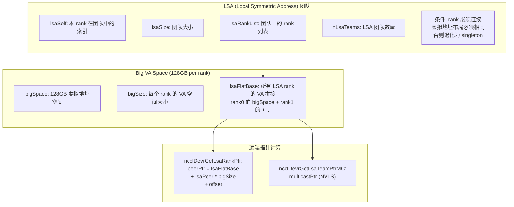
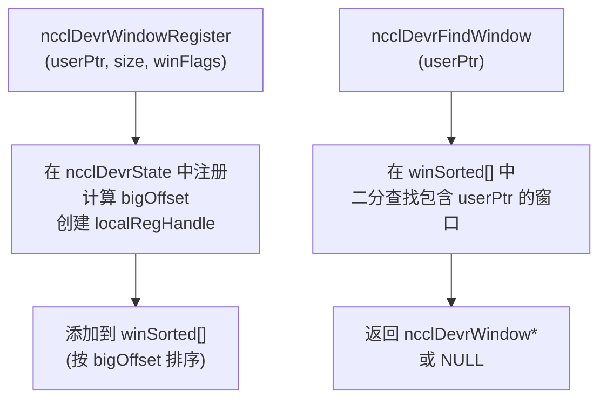
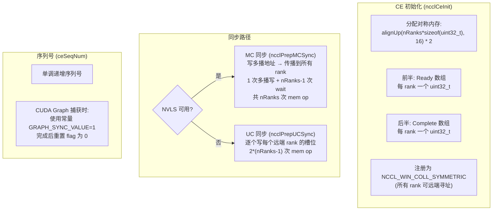
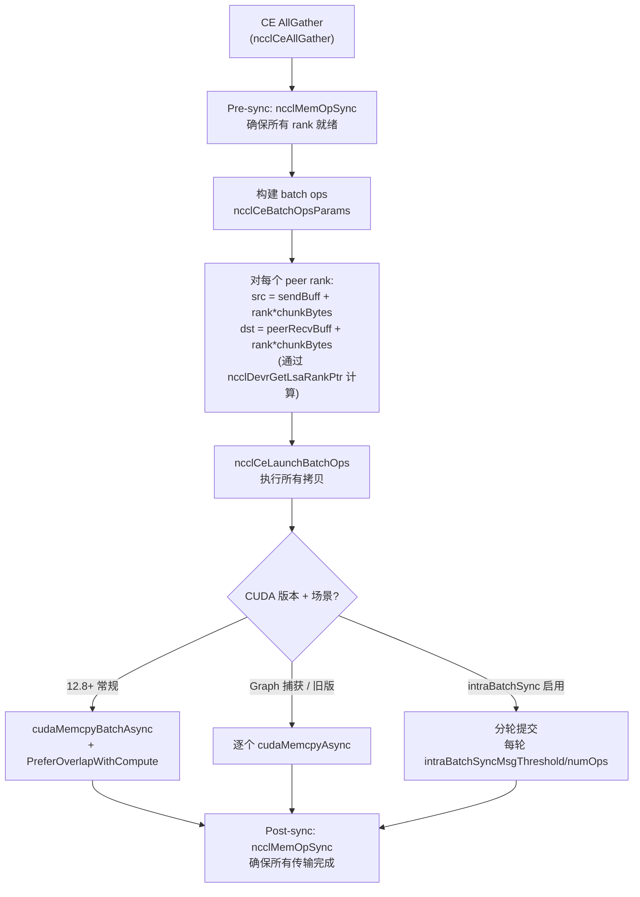
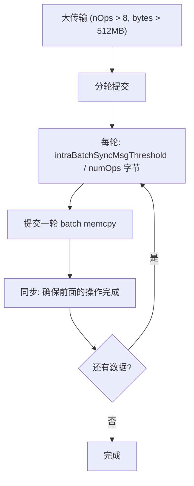
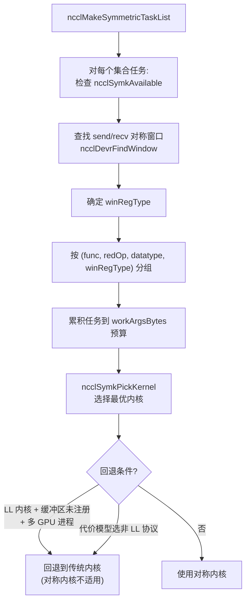
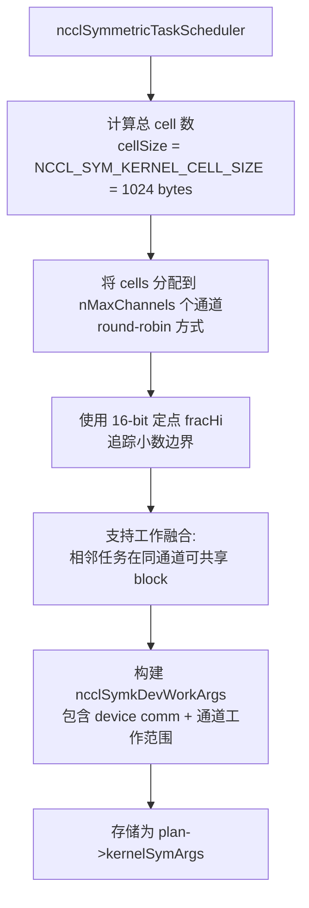

# NCCL 对称内存与 CE 集合操作

对称内存 (Symmetric Memory) 是 NCCL 的高级内存抽象，为 CE 集合操作和对称内核提供 LSA (Local Symmetric Address) 团队和大 VA 空间支持，使 GPU 内核能够直接计算远端 rank 的缓冲区地址。

---

## 1. 对称内存运行时 (devr)

### 1.1 核心概念

### 1.2 窗口注册

### 1.3 窗口注册类型

| 类型 | 值 | 含义 |
|------|---|------|
| `ncclSymSendNonregRecvNonreg` | 0 | 发送/接收都未注册 |
| `ncclSymSendNonregRecvReg` | 1 | 仅接收端注册 (CE 可用) |
| `ncclSymSendRegRecvNonreg` | 2 | 仅发送端注册 |
| `ncclSymSendRegRecvReg` | 3 | 双端注册 (对称内核可用) |

---

## 2. CE 集合操作

### 2.1 支持条件

| 条件 | 要求 |
|------|------|
| CUDA 版本 | >= 12.5 |
| 节点范围 | 仅单节点 |
| 对称内存 | 必须启用 (comm->symmetricSupport) |
| 缓冲区注册 | 发送端和接收端必须通过对称窗口注册 |
| 支持的集合 | AllGather, AlltoAll, Scatter, Gather |
| 不支持 | 规约操作 (Reduce, AllReduce 等) |

### 2.2 同步协议

### 2.3 CE AllGather 流程

### 2.4 其他 CE 集合

| 集合 | 数据流 |
|------|--------|
| **AlltoAll** | src[dstRank] → peerDst[myRank] |
| **Scatter** | 仅 root: rootSend[peer] → peerRecv |
| **Gather** | 仅 root: peerSend → rootRecv[peer] |

### 2.5 Intra-Batch 同步

大规模场景下 (numOps > intraBatchSyncFreq=8, 总量 > 512MB)，启用批内同步：

---

## 3. 对称内核

### 3.1 内核 ID 与选择

| 集合操作 | 内核 ID | 说明 |
|---------|---------|------|
| AllReduce | AGxLL_R, AGxLLMC_R | AllGather(LL) + Reduce(LL/MC) |
| AllReduce | RSxLD_AGxST, RSxLDMC_AGxSTMC | ReduceScatter(LD) + AllGather(ST/MC) |
| AllGather | LL, LLMC, ST, STMC | 按协议和是否多播分类 |
| AllGather | RailRing_LsaSTMC | 多轨 Ring + LSA ST MC |
| ReduceScatter | LL, LD, LDMC | 按协议和是否多播分类 |
| ReduceScatter | RailA2A_LsaLD, RailA2A_LsaLDMC | 多轨 AlltoAll + LSA |

`_MC` 后缀 = 多播 (NVLS) 变体。`RailRing`/`RailA2A` = GIN 多轨算法。

### 3.2 任务调度

### 3.3 工作分配

### 3.4 设备端原语

| 原语 | 说明 |
|------|------|
| `ncclSymPtr<T>` | 对称指针: window + offset → localPtr() / multimemPtr() |
| `ncclLsaPointerGetter<T>` | 计算 per-LSA-rank 指针: lsaFlatBase + lsaPeer * stride4G |
| `bcastMultimem` | 多播广播: multimem_st_global 指令, 128B chunk 展开循环 |
| `ncclSymkSmemPartition` | 动态共享内存分区 |

---

## 4. 关键源文件

| 文件 | 行数 | 功能 |
|------|------|------|
| `src/ce_coll.cc` | ~700 | CE 集合操作实现 |
| `src/include/ce_coll.h` | ~60 | CE 数据结构 |
| `src/scheduler/symmetric_sched.cc` | ~200 | 对称内核任务调度 |
| `src/include/dev_runtime.h` | ~100 | 对称内存运行时 (ncclDevrState) |
| `src/include/sym_kernels.h` | ~120 | 对称内核状态 (ncclSymkState) |
| `src/device/symmetric/primitives.cuh` | ~200 | 对称内核设备端原语 |
