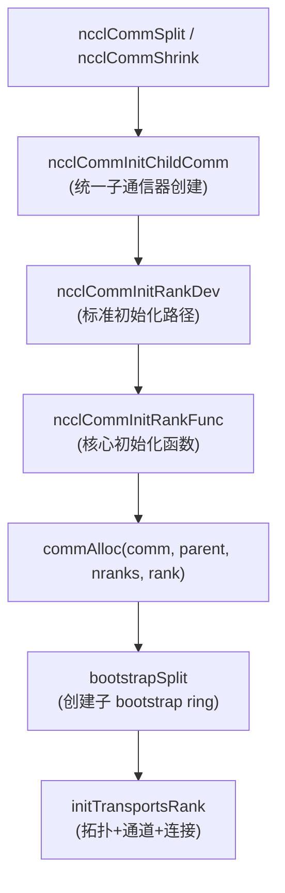
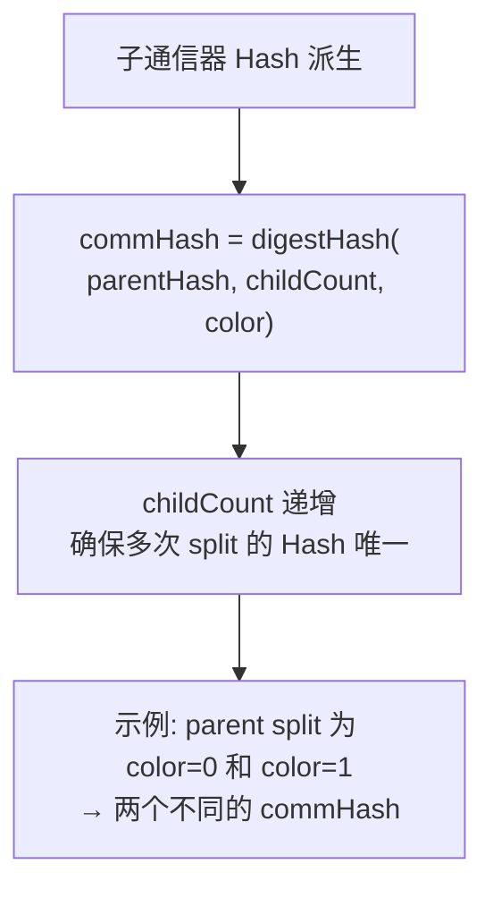
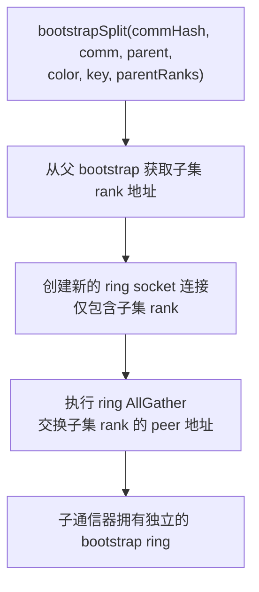
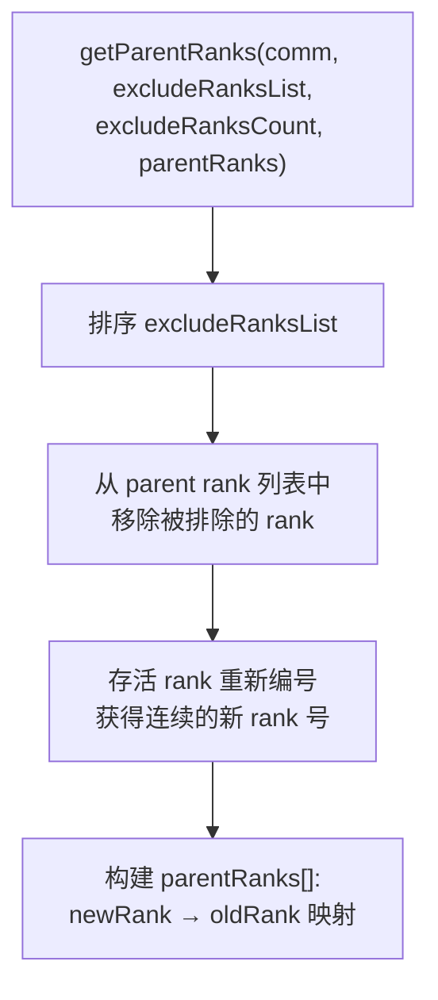
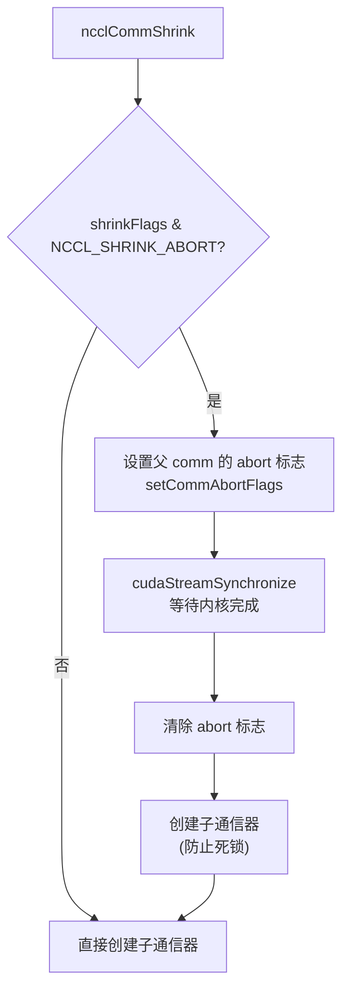
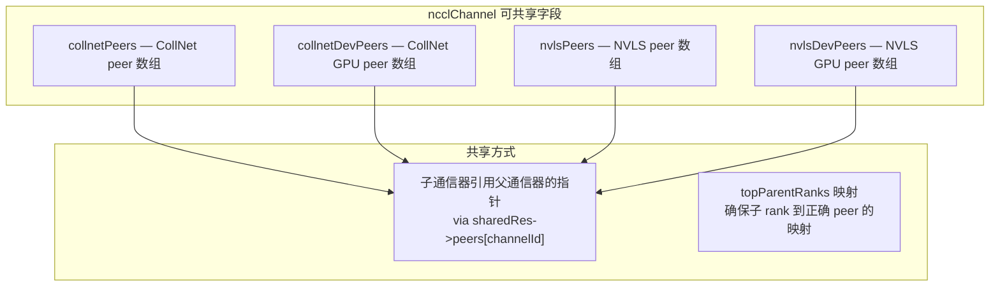
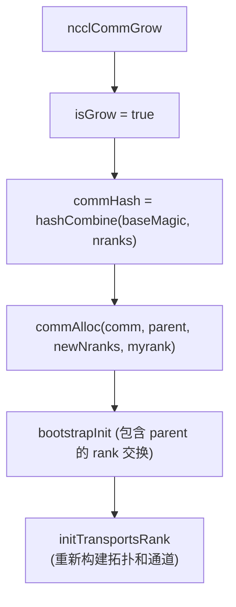

# NCCL 通信器分裂与收缩

Split 和 Shrink 机制允许从父通信器创建子通信器，分别用于 rank 分组和故障恢复。两者共享统一的子通信器创建逻辑，关键差异在于资源共享策略。

---

## 1. API

| API | 签名 | 用途 |
|-----|------|------|
| **ncclCommSplit** | `(comm, color, key, newcomm, config)` | 按 color 分组，按 key 排序 |
| **ncclCommShrink** | `(comm, excludeRanksList, count, newcomm, config, shrinkFlags)` | 移除故障 rank |
| **ncclCommGrow** | `(comm, newcomm, config)` | 扩展通信器 (添加新 rank) |

---

## 2. 统一子通信器创建



---

## 3. Split 流程

### 3.1 Rank 确定 (commGetSplitInfo)

```mermaid
flowchart TD
    A["commGetSplitInfo(comm, color, key, commSplitInfo)"] --> B["每个 rank 填充:\nsplitInfo[rank].color = color\nsplitInfo[rank].key = key"]

    B --> C["bootstrapAllGather\n交换所有 rank 的 (color, key)"]

    C --> D["按 color 分组"]
    D --> E{color == NCCL_SPLIT_NOCOLOR (负数)?}
    E -->|"是"| F["该 rank 不加入任何子通信器\nnewcomm = NULL"]
    E -->|"否"| G["同 color 的 rank 分到一组\n组内按 key 排序确定新 rank"]

    G --> H["构建 parentRanks[]:\nchildRank → parentRank 映射"]
```

### 3.2 Hash 派生



### 3.3 Bootstrap Split



---

## 4. Shrink 流程

### 4.1 Rank 确定 (getParentRanks)



### 4.2 Shrink Abort 模式



---

## 5. 资源共享

### 5.1 共享决策

```mermaid
flowchart TD
    A["shareResources 决策"] --> B{parent 被撤销 (revokedFlag)?}
    B -->|"是"| C["shareResources = false"]

    B -->|"否"| D{Split 或 Shrink?}
    D -->|"Split"| E{config.splitShare 启用?\n(NCCL_COMM_SPLIT_SHARE_RESOURCES)"]
    E -->|"是"| F["shareResources = true"]
    E -->|"否"| C

    D -->|"Shrink"| G{NCCL_SHRINK_ABORT 标志?}
    G -->|"是"| H["shareResources = false\n(abort 模式不共享)"]
    G -->|"否"| I{config.shrinkShare 启用?\n(NCCL_COMM_SHRINK_SHARE_RESOURCES)"]
    I -->|"是"| F
    I -->|"否"| C
```

### 5.2 共享 vs 独立资源

| 资源 | 共享路径 | 独立路径 |
|------|---------|---------|
| **SharedResources** | `comm->sharedRes = parent->sharedRes` refcount++ | 全新分配 (deviceStream, hostStream, launchEvent, scratchEvent, peers[]) |
| **Proxy 状态** | `comm->proxyState = parent->sharedRes->proxyState` refcount++ | ncclProxyCreate (新代理线程) |
| **网络插件** | ncclNetInitFromParent (复用) | ncclNetInit (新实例) |
| **GIN 状态** | ncclGinInitFromParent (复用) | ncclGinInit (新实例) |
| **内存管理器** | `comm->memManager = parent->memManager` refcount++ | 新实例 |
| **Abort 标志** | 共享 parent 的 abortFlag/abortFlagDev refcount++ | 新分配 |
| **通道 Peers** | 复用 sharedRes->peers[channelId] (collnetPeers/nvlsPeers 可共享) | 全新分配 |

### 5.3 共享通道 Peer 机制

ncclChannel 中标记为 "comm split sharable" 的字段：



---

## 6. Grow 流程

Grow 用于向现有通信器添加新 rank：



---

## 7. 关键环境变量

| 变量 | 默认值 | 说明 |
|------|--------|------|
| `NCCL_COMM_SPLIT_SHARE_RESOURCES` | 0 | Split 时是否共享资源 |
| `NCCL_COMM_SHRINK_SHARE_RESOURCES` | 0 | Shrink 时是否共享资源 |
| `NCCL_SPLIT_SHARE` | — | 等同于 SPLIT_SHARE_RESOURCES |

---

## 8. 关键源文件

| 文件 | 行数 | 功能 |
|------|------|------|
| `src/init.cc` (ncclCommSplit) | ~100 | Split API 入口 |
| `src/init.cc` (ncclCommShrink) | ~100 | Shrink API 入口 |
| `src/init.cc` (ncclCommInitChildComm) | ~200 | 统一子通信器创建 |
| `src/init.cc` (commGetSplitInfo) | ~80 | Split rank 确定 |
| `src/init.cc` (getParentRanks) | ~40 | Shrink rank 确定 |
| `src/init.cc` (commAlloc) | ~130 | 通信器分配 + 资源共享 |
| `src/include/comm.h` | — | shareResources/isGrow 等字段 |
