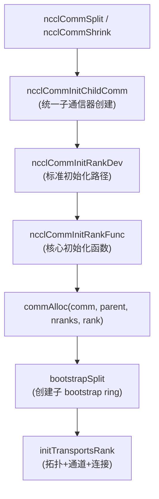
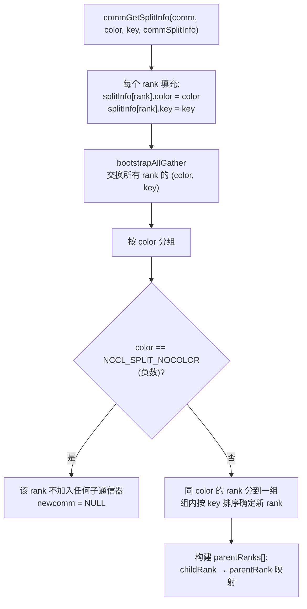
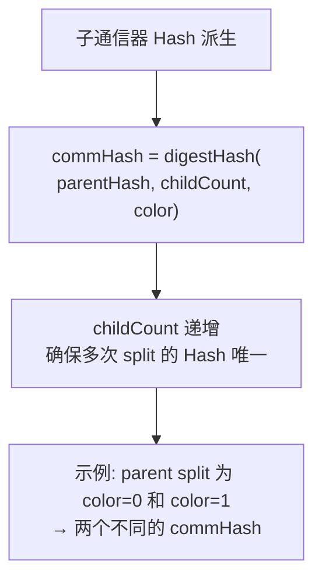
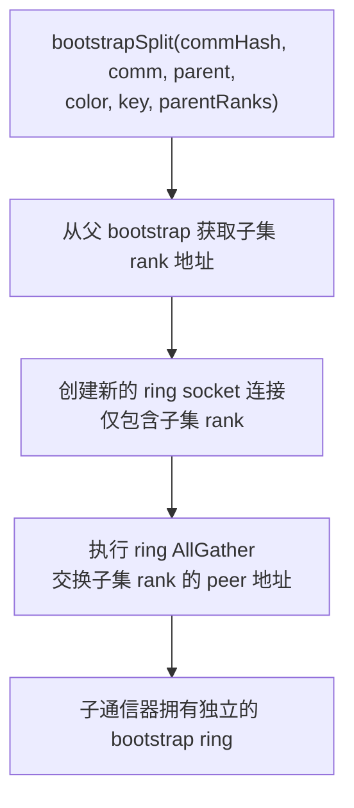
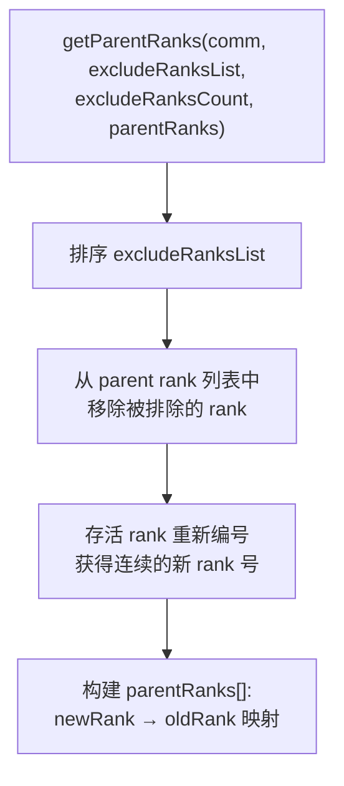
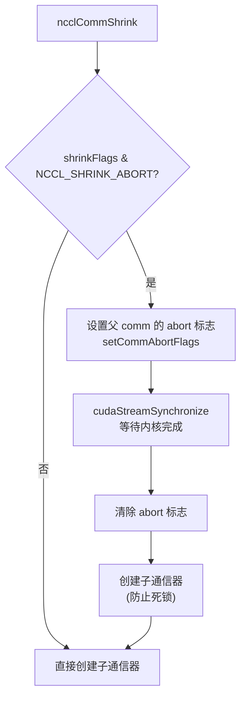
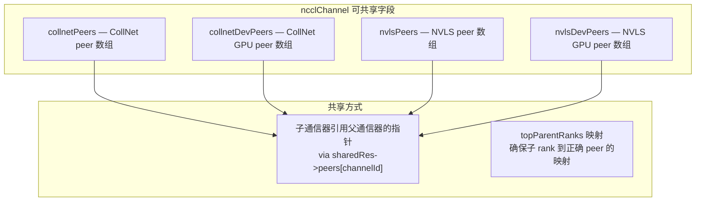
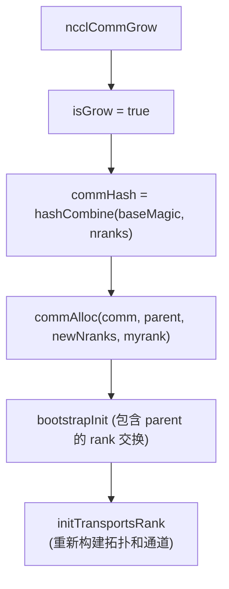

# NCCL 通信器分裂与收缩

Split 和 Shrink 机制允许从父通信器创建子通信器，分别用于 rank 分组和故障恢复。两者共享统一的子通信器创建逻辑，关键差异在于资源共享策略。

Split 和 Shrink 看起来相似——都是从父通信器派生子通信器——但它们的设计驱动力完全不同。Split 的动机是**应用层的并行分解**：用户通过 MPI-style 的 color/key 机制将全局通信器划分为独立的子组，每个子组可以独立执行集合操作。Shrink 的动机是**系统层的容错**：当某些 rank 发生故障时，从通信器中移除故障 rank，让存活 rank 继续工作。这两种截然不同的使用场景导致了它们在资源共享策略上的关键差异——Split 的子通信器可以与父通信器共享资源（因为两者可能同时活跃），而 Shrink 的子通信器在 abort 模式下必须独立分配资源（因为父通信器可能已处于不确定状态）。

---

## 1. API

| API | 签名 | 用途 |
|-----|------|------|
| **ncclCommSplit** | `(comm, color, key, newcomm, config)` | 按 color 分组，按 key 排序 |
| **ncclCommShrink** | `(comm, excludeRanksList, count, newcomm, config, shrinkFlags)` | 移除故障 rank |
| **ncclCommGrow** | `(comm, newcomm, config)` | 扩展通信器 (添加新 rank) |

**ncclCommSplit** 遵循 MPI_Comm_split 的语义：相同 color 的 rank 被分到同一子通信器，key 决定子通信器内的 rank 顺序。color 为 `NCCL_SPLIT_NOCOLOR`（负数）的 rank 不加入任何子通信器，其 `newcomm` 被设为 `NULL`。

**ncclCommShrink** 是 NCCL 特有的容错 API。`excludeRanksList` 指定要移除的故障 rank 列表，`shrinkFlags` 控制行为模式——`NCCL_SHRINK_ABORT` 标志指示父通信器即将被废弃，子通信器需要安全地接管。

**ncclCommGrow** 向现有通信器添加新 rank，用于弹性扩展场景。与 Split/Shrink 不同，Grow 创建的子通信器可能包含父通信器中不存在的全新 rank。

---

## 2. 统一子通信器创建



Split 和 Shrink 共享 `ncclCommInitChildComm` 作为统一的子通信器创建入口。这个函数处理参数验证、子通信器分配和初始化调用，屏蔽了 Split/Shrink 的差异。

**为什么统一入口很重要？** Split 和 Shrink 的初始化流程有 90% 相同——都需要分配 `ncclComm` 结构、建立 bootstrap 通信、发现拓扑、创建通道。唯一的不同在于：(1) rank 列表的确定方式（Split 用 color/key，Shrink 用排除列表），(2) 资源共享决策。统一入口将共同逻辑集中在一处，避免了代码重复和维护负担。

**初始化流程与普通通信器相同**：`ncclCommInitRankDev` → `ncclCommInitRankFunc` 是标准的初始化路径，子通信器走与 `ncclCommInitRank` 完全一样的流程。这意味着子通信器拥有完整的拓扑、通道和传输连接，是一个完全独立的通信实体（除非资源共享启用）。

**commAlloc 中的资源共享决策**：`commAlloc` 是共享与独立路径的分叉点。如果 `shareResources` 为 true，子通信器复用父通信器的设备流、代理线程、网络插件等；否则全部分配新实例。详见第 5 节。

---

## 3. Split 流程

### 3.1 Rank 确定 (commGetSplitInfo)



Rank 确定是 Split 的核心语义——决定哪些 rank 在同一子通信器中，以及各自的 rank 号。

**AllGather 交换 (color, key)**：所有 rank 必须知道其他 rank 的 color 和 key 才能正确分组。`bootstrapAllGather` 通过 bootstrap ring 交换这些信息，确保每个 rank 都有全局一致的视图。这一步是同步的——所有 rank 必须都调用了 `ncclCommSplit` 后才能继续。

**key 排序决定新 rank 号**：同一 color 组内的 rank 按 key 升序排列，key 最小的 rank 获得子通信器中的 rank 0，以此类推。这提供了灵活的 rank 重编号机制——例如，可以通过设置 key 为原始 rank 号来保持子通信器内的 rank 顺序与父通信器一致。

**parentRanks[] 映射**：这是一个从子通信器 rank 到父通信器 rank 的反向映射。例如，如果父通信器的 rank 2 和 rank 5 被分到同一子通信器（子 rank 0 和 1），则 `parentRanks[0]=2, parentRanks[1]=5`。这个映射在资源共享时至关重要——子通信器需要通过 `topParentRanks` 找到正确的父通信器 peer 连接。

### 3.2 Hash 派生



**commHash 的唯一性保证**是分布式系统正确性的基础。NCCL 使用 commHash 来标识通信器，在 bootstrap 和网络连接中用于匹配正确的 peer。如果两个通信器的 hash 相同，可能导致消息发送到错误的通信器。

**childCount 递增**确保了即使对同一父通信器进行多次 Split（使用相同的 color），每次 Split 产生不同的 hash。例如，先 `split(color=0)` 再 `split(color=0)`，第二次的 hash 包含了更大的 `childCount`，因此与第一次不同。

**digestHash 的输入包含三个元素**：`parentHash` 保证了不同父通信器的子通信器不会碰撞；`childCount` 保证了同一父通信器的不同次 Split 不会碰撞；`color` 保证了同一次 Split 的不同 color 组不会碰撞。三重保护确保了 hash 的全局唯一性。

### 3.3 Bootstrap Split



Bootstrap Split 为子通信器创建独立的 bootstrap 通信网络。Bootstrap 是 NCCL 初始化阶段使用的带外通信机制（基于 TCP socket），用于 rank 间的地址交换和同步。

**独立的 bootstrap ring** 是子通信器独立性的根本保证。如果子通信器共享父通信器的 bootstrap ring，那么 bootstrap 消息可能在错误的 rank 之间传递——父通信器的 rank 3 可能收到属于子通信器的消息。独立的 ring 确保了子通信器的 bootstrap 操作完全隔离。

**Ring AllGather** 是 bootstrap 的标准通信模式：每个 rank 向右邻发送自己的地址，然后转发收到的地址，经过 nRanks-1 步后，所有 rank 都拥有完整的地址表。这个 O(nRanks) 的步骤确保了子通信器中所有 rank 都能建立直接的 socket 连接。

---

## 4. Shrink 流程

### 4.1 Rank 确定 (getParentRanks)



Shrink 的 rank 确定比 Split 简单——没有 color/key 的概念，只是从父通信器中移除指定的 rank。

**排序 excludeRanksList** 是一个预处理步骤，确保后续的排除操作可以使用二分查找（O(log N)）而非线性扫描（O(N)）。`ncclCommInitChildComm` 中的 `qsort` 调用完成了这个排序。

**连续重新编号**是关键设计：移除故障 rank 后，剩余 rank 的编号可能出现空隙（例如 0,1,3,4，跳过了 2）。NCCL 要求子通信器的 rank 编号是连续的 0 到 nRanks-1，因此需要重新映射。`parentRanks[newRank] = oldRank` 记录了这个映射，使得子通信器中的 rank i 可以找到其在父通信器中的原始 rank。

**与 Split 的 parentRanks 对比**：虽然数据结构相同（都是 childRank → parentRank 映射），但构建逻辑完全不同。Split 基于 color 分组和 key 排序，映射可能是不连续的；Shrink 基于 exclude 列表的补集，映射保持了原始顺序（只是跳过了被排除的 rank）。

### 4.2 Shrink Abort 模式



Abort 模式是 Shrink 最复杂的部分，处理"父通信器即将被废弃"的场景。

**setCommAbortFlags 的作用**：设置 `comm->abortFlag` 和 `comm->abortFlagDev`（设备端可见的标志）。这些标志通知所有正在运行的操作"尽快终止"——GPU 内核在每个迭代开始时检查 `abortFlagDev`，如果发现被设置就提前退出。这避免了在 Shrink 过程中内核无限等待一个已死的 peer。

**cudaStreamSynchronize 的必要性**：设置 abort 标志后，必须等待所有正在运行的 CUDA 内核完成（或被 abort）。否则，在创建子通信器的过程中，旧的内核可能还在访问已被废弃的通信器资源，导致数据竞争或段错误。`cudaStreamSynchronize` 保证了所有内核都已经停止。

**防止死锁**是 abort 模式的核心关切。如果父通信器的某些 rank 已经崩溃，而存活 rank 还在 bootstrap 同步中等待崩溃 rank 的响应，就会永久阻塞。创建子通信器时，所有参与者都是存活 rank，不会等待已崩溃的 rank，从而打破了死锁。

**为什么 abort 模式下不共享资源？** 父通信器可能处于不确定状态——某些内核可能被 abort 中断，留下了不一致的内部状态（如部分写入的通道缓冲区、未完成的代理操作）。如果子通信器共享这些资源，可能继承不一致的状态，导致后续操作出错。因此 abort 模式强制独立分配资源，虽然开销更大但确保了正确性。

---

## 5. 资源共享

### 5.1 共享决策

```mermaid
flowchart TD
    A["shareResources 决策"] --> B{"parent 被撤销\n(revokedFlag)?"}
    B -->|"是"| C["shareResources = false"]

    B -->|"否"| D{"Split 或 Shrink?"}
    D -->|"Split"| E{"config.splitShare 启用?\n(NCCL_COMM_SPLIT_SHARE_RESOURCES)"}
    E -->|"是"| F["shareResources = true"]
    E -->|"否"| C

    D -->|"Shrink"| G{"NCCL_SHRINK_ABORT 标志?"}
    G -->|"是"| H["shareResources = false\n(abort 模式不共享)"]
    G -->|"否"| I{"config.shrinkShare 启用?\n(NCCL_COMM_SHRINK_SHARE_RESOURCES)"]
    I -->|"是"| F
    I -->|"否"| C
```

资源共享决策是 Split 和 Shrink 最关键的设计分歧点。决策逻辑实现在 `ncclCommInitChildComm` 中的一行代码：

```cpp
comm->shareResources = !comm->revokedFlag && (isShrink ? (!(flags & NCCL_SHRINK_ABORT) && comm->config.shrinkShare) : comm->config.splitShare);
```

**三层决策逻辑**：
1. **父通信器被撤销 (revokedFlag)**：无条件不共享。被撤销的通信器可能正在被销毁，共享其资源是不安全的。
2. **Shrink + ABORT 标志**：不共享。如上节所述，abort 模式下父通信器状态不确定。
3. **配置开关**：默认关闭（`NCCL_COMM_SPLIT_SHARE_RESOURCES=0`），用户需要显式启用。这是保守的策略——资源共享虽然减少了开销，但增加了父子通信器之间的耦合，可能导致意外的性能干扰。

**为什么默认不共享？** 资源共享意味着父子通信器使用同一个代理线程、同一个网络插件实例和同一组通道 peer。如果父通信器和子通信器同时执行集合操作（这在 Split 场景中很常见），它们会竞争同一组资源，可能导致性能下降甚至死锁。默认不共享确保了完全的隔离性，代价是更高的内存和线程开销。

### 5.2 共享 vs 独立资源

| 资源 | 共享路径 | 独立路径 |
|------|---------|---------|
| **SharedResources** | `comm->sharedRes = parent->sharedRes` refcount++ | 全新分配 (deviceStream, hostStream, launchEvent, scratchEvent, peers[]) |
| **Proxy 状态** | `comm->proxyState = parent->sharedRes->proxyState` refcount++ | ncclProxyCreate (新代理线程) |
| **网络插件** | ncclNetInitFromParent (复用) | ncclNetInit (新实例) |
| **GIN 状态** | ncclGinInitFromParent (复用) | ncclGinInit (新实例) |
| **内存管理器** | `comm->memManager = parent->memManager` refcount++ | 新实例 |
| **Abort 标志** | 共享 parent 的 abortFlag/abortFlagDev refcount++ | 新分配 |
| **通道 Peers** | 复用 sharedRes->peers[channelId] (collnetPeers/nvlsPeers 可共享) | 全新分配 |

**引用计数 (refcount) 管理**：所有共享资源都通过引用计数管理生命周期。子通信器创建时 refcount++，销毁时 refcount--，最后一个引用者负责实际释放。这防止了"父通信器先销毁导致子通信器访问已释放内存"的 use-after-free 问题。

**Proxy 共享的深层含义**：共享代理线程意味着父通信器和子通信器的网络操作由同一个线程驱动。这减少了线程数，但也意味着父通信器的网络延迟可能影响子通信器的操作完成时间。在高并发场景下，代理线程可能成为瓶颈。

**网络插件共享 (ncclNetInitFromParent)**：网络插件的初始化通常涉及分配 IBV 保护域、创建 QP 等昂贵操作。从父通信器复用这些资源可以节省数百毫秒的初始化时间和数 MB 的内存。但这也意味着父子通信器共享同一个 IBV 保护域，如果一个通信器的操作异常，可能影响另一个。

**Abort 标志共享**：共享 abort 标志意味着父通信器被 abort 时，子通信器也能感知到。这在故障级联场景下很重要——如果父通信器发现故障并 abort，子通信器不应该继续使用已不一致的资源。独立分配的 abort 标志则允许子通信器在父通信器 abort 后继续正常运行。

### 5.3 共享通道 Peer 机制

ncclChannel 中标记为 "comm split sharable" 的字段：



**为什么只有这四个字段可共享？** CollNet 和 NVLS 的 peer 结构代表的是硬件级的连接资源——CollNet 对应集合网络（如 SHARP）的 QP，NVLS 对应 NVLink SHARP 的多播组。这些资源的创建涉及硬件注册和跨进程协商，开销极大。而且这些硬件连接是按物理 GPU 分配的，与逻辑 rank 编号无关——子通信器只是复用了父通信器已建立的硬件通道。

**topParentRanks 映射**解决了子通信器与父通信器 rank 编号不同的问题。子通信器的 rank i 对应父通信器的 `topParentRanks[i]`，通过这个映射可以找到正确的 peer 连接。例如，子通信器需要向 rank 2 发送数据，但 rank 2 在父通信器中实际是 rank 5，就需要通过 `topParentRanks[2]=5` 找到父通信器的 peer[5] 连接。

---

## 6. Grow 流程

Grow 用于向现有通信器添加新 rank：



Grow 与 Split/Shrink 的根本区别在于：它不是从父通信器的现有成员中选择子集，而是**引入全新的 rank**。这使得 Grow 适用于弹性扩展场景——例如，在新 GPU 加入集群后，将它们纳入现有通信器。

**isGrow 标志的作用**：`isGrow=true` 影响了 `commAlloc` 中的资源分配逻辑。在 Grow 场景中，新 rank 可能不在父通信器的 LSA 团队中（因为它们是新加入的节点），因此不能共享对称内存资源。`isGrow` 标志确保了正确的资源分配策略。

**hashCombine 的输入**：Grow 使用 `baseMagic`（通信器的基础标识）和新的 `nranks` 组合 hash，确保每次 Grow 操作产生唯一的 commHash。与 Split 的 `digestHash(parentHash, childCount, color)` 不同，Grow 不需要 color（因为没有分组概念），但需要 nranks（因为每次 Grow 后 rank 数量不同）。

**bootstrapInit 的特殊性**：Grow 的 bootstrap 初始化需要同时包含父通信器的 rank 和新加入的 rank。这比 Split 的 bootstrapSplit 更复杂，因为新 rank 之前不在 bootstrap ring 中，需要通过特殊的"邀请"机制加入。

---

## 7. 关键环境变量

| 变量 | 默认值 | 说明 |
|------|--------|------|
| `NCCL_COMM_SPLIT_SHARE_RESOURCES` | 0 | Split 时是否共享资源 |
| `NCCL_COMM_SHRINK_SHARE_RESOURCES` | 0 | Shrink 时是否共享资源 |
| `NCCL_SPLIT_SHARE` | — | 等同于 SPLIT_SHARE_RESOURCES |

默认值都为 0（不共享），体现了 NCCL 的保守设计哲学——默认选择最安全的路径，用户可以按需启用优化。

**`NCCL_SPLIT_SHARE` 是 `NCCL_COMM_SPLIT_SHARE_RESOURCES` 的简写**，提供更短的名称方便使用。两个变量效果完全相同，如果同时设置，后设置的生效。

---

## 8. 关键源文件

| 文件 | 行数 | 功能 |
|------|------|------|
| `src/init.cc` (ncclCommSplit) | ~100 | Split API 入口 |
| `src/init.cc` (ncclCommShrink) | ~100 | Shrink API 入口 |
| `src/init.cc` (ncclCommInitChildComm) | ~200 | 统一子通信器创建 |
| `src/init.cc` (commGetSplitInfo) | ~80 | Split rank 确定 |
| `src/init.cc` (getParentRanks) | ~40 | Shrink rank 确定 |
| `src/init.cc` (commAlloc) | ~130 | 通信器分配 + 资源共享 |
| `src/include/comm.h` | — | shareResources/isGrow 等字段 |
