# NCCL RAS 容错可用性服务

RAS (Resilience Availability Service) 是 NCCL 内置的分布式监控子系统，在所有 NCCL 进程间形成监控网格，实现故障检测、peer 生命周期管理和外部状态查询。

RAS 的设计哲学是**零侵入监控**——它不修改 NCCL 的核心通信路径，而是作为一个独立的后台线程运行，通过独立的 socket 网络进行监控和故障检测。这意味着即使 RAS 本身出现故障或性能下降，也不会影响正常的集合通信操作。同时，RAS 的环形网络拓扑使得故障信息可以在 O(N) 步内传播到所有进程，实现了快速的全局故障感知。

RAS 在 NCCL 的容错体系中扮演"耳目"的角色：它负责**发现**和**报告**故障，但不负责**恢复**。故障恢复由 Shrink 机制完成（见 `13-split-shrink.md`），RAS 只是提供了触发恢复所需的信息。

---

## 1. RAS 架构总览

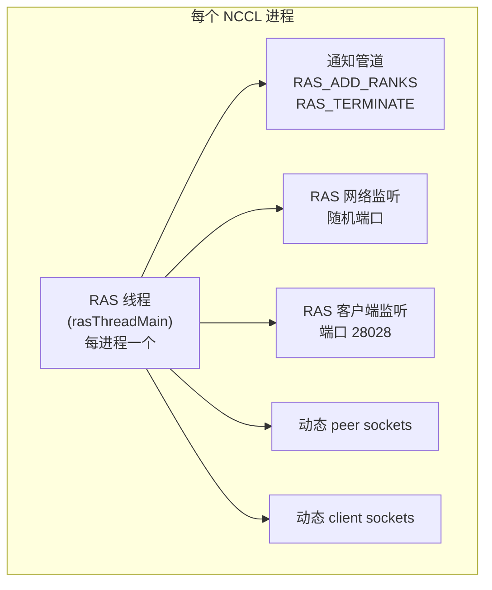

RAS 架构的核心是一个**每进程一个的专用线程** (`rasThreadMain`)。这个线程独立于 NCCL 的通信线程运行，负责处理所有 RAS 相关的事件。

**通知管道 (Notification Pipe)** 是 NCCL 通信线程与 RAS 线程之间的异步通信通道。当新的 NCCL 通信器被创建或销毁时，通信线程通过管道向 RAS 线程发送 `RAS_ADD_RANKS` 或 `RAS_TERMINATE` 通知。使用管道（而非共享变量+锁）的原因是管道天然集成到 `poll()` 事件循环中，不需要额外的同步机制。管道消息大小被限制在 `PIPE_BUF` 以内（通常 4096 字节），确保写入是原子的。

**RAS 网络监听** 在随机端口上监听，用于接收其他 NCCL 进程的 peer 连接。随机端口避免了与其他服务的端口冲突，端口号在 bootstrap 阶段通过 AllGather 交换给所有 peer。

**RAS 客户端监听** 在固定端口 28028 上监听，供外部监控工具（如 `ncclras` CLI）连接。固定端口使得运维人员无需知道动态端口就能查询系统状态。

**动态 peer/client sockets** 是 RAS 事件循环中管理的活跃连接。peer sockets 连接到其他 NCCL 进程的 RAS 线程，client sockets 连接到外部监控工具。两者都被纳入 `poll()` 事件循环中统一处理。

---

## 2. RAS 环形网络拓扑

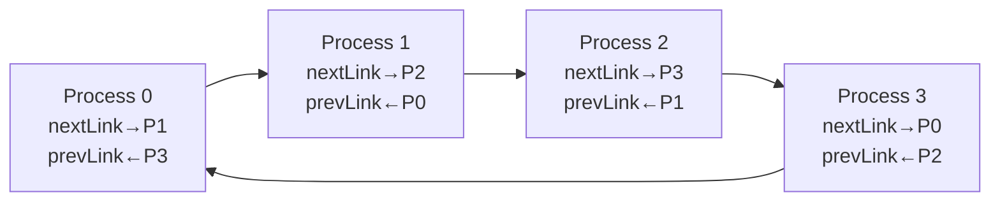

每个 link (`rasLink`) 包含一个 `rasLinkConn` 链表：
- 第一个条目是主连接
- 额外条目是故障恢复时创建的 fallback 连接
- 主连接恢复后，fallback 被清理 (`rasLinkSanitizeFallbacks`)

Peer 计算逻辑 (`rasLinkCalculatePeer`):
- 沿 `rasPeers` 排序数组，按 link 方向遍历
- 跳过 dead peer
- Fallback-of-fallback 时跳过同一节点的所有 peer

**为什么选择环形拓扑？** 环形拓扑是分布式监控中最简单的容错拓扑——每个进程只需要维护两个连接（next 和 prev），信息可以通过两个方向传播。与全连接拓扑相比，环形将每进程的连接数从 O(N) 降低到 O(1)，大幅减少了连接管理和心跳开销。与树形拓扑相比，环形没有单点故障——任意一个连接断开，信息仍可通过另一方向绕行。

**Fallback 连接链表**是环形拓扑容错的关键机制。当主连接断开时，RAS 尝试与下一个存活的 peer 建立 fallback 连接。这个新 peer 可能跳过了多个死掉的 peer。如果这个 fallback 连接也断了，再建立 fallback-of-fallback，以此类推。链表结构自然地表示了这种级联的 fallback 关系。

**rasLinkSanitizeFallbacks** 在主连接恢复后被调用，清理不再需要的 fallback 连接。这避免了 fallback 链表无限增长——当主连接稳定后，fallback 连接只占用文件描述符和内存而不提供额外价值。

**Peer 计算中的节点跳过**：在 fallback-of-fallback 场景下，如果下一个 peer 与当前 peer 在同一物理节点上，则跳过该节点上的所有 peer。这是因为同一节点的 peer 通常共享网络路径——如果一个 peer 不可达，同一节点的其他 peer 大概率也不可达。跳过它们减少了无效的连接尝试，加速了 fallback 的建立。

---

## 3. 连接生命周期

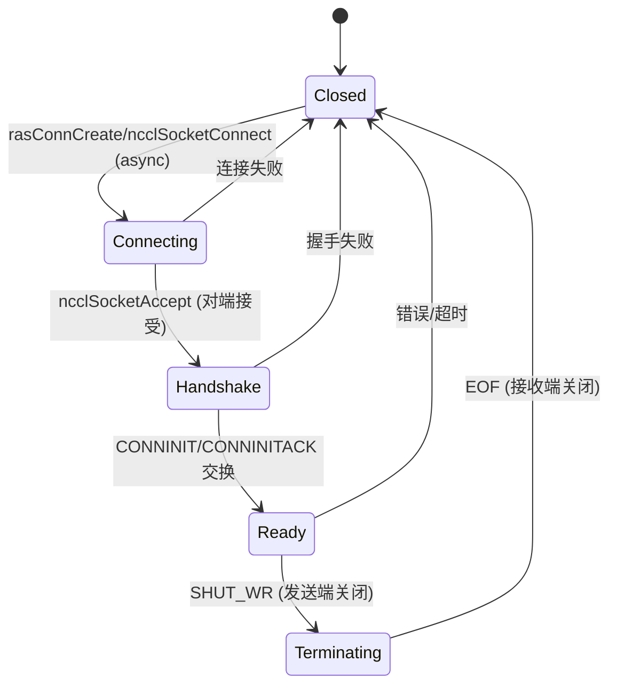

**连接竞态解决**: 地址较小的一方发起连接。

**握手协议**:
- 发送: `RAS_MSG_CONNINIT` (NCCL 版本、监听地址、peers hash)
- 响应: `RAS_MSG_CONNINITACK` (可包含 NACK 拒绝)

连接生命周期管理是 RAS 网络可靠性的基础。

**连接竞态问题**：当两个 RAS 线程同时尝试连接对方时（每个都在另一方的随机端口上发起连接），会建立两条冗余连接。通过"地址较小的一方发起连接"的规则，只有一端发起连接，另一端被动接受，确保两个进程之间只有一条连接。地址比较基于 socket 地址的字节序比较，是确定性的。

**CONNINIT 握手**：连接建立后，发起方发送 `RAS_MSG_CONNINIT` 消息，包含自己的 NCCL 版本号、RAS 监听地址和已知 peer 列表的 hash。接受方验证版本兼容性，如果兼容则回复 `CONNINITACK`，否则回复 NACK 并关闭连接。版本检查防止了不同版本的 NCCL 进程建立不兼容的 RAS 连接。

**peers hash 在握手中的作用**：如果发起方和接受方的 peers hash 相同，说明双方已经拥有相同的全局视图，不需要交换 peer 更新消息。这避免了每次新连接建立时都发送完整的 peer 列表，减少了带宽消耗。

**SHUT_WR 优雅关闭**：当需要关闭连接时，先关闭写端（`SHUT_WR`），进入 Terminating 状态，等待对端读完缓冲区中的数据后关闭读端（EOF）。这确保了关闭前所有已发送的消息都能被对端接收，避免了消息丢失。

---

## 4. 消息协议

### 4.1 消息类型

| 类型 | 方向 | 用途 |
|------|------|------|
| `CONNINIT` | 连接方 → 接受方 | 握手发起 |
| `CONNINITACK` | 接受方 → 连接方 | 握手响应 |
| `KEEPALIVE` | 双向 | 心跳 (peers hash, dead hash, link mask, wallclock) |
| `PEERSUPDATE` | 双向 | peer 列表同步 (delta + full dead peers) |
| `COLLREQ` | 发起方 → 下游 | 集合操作请求 (broadcast/gather) |
| `COLLRESP` | 下游 → 上游 | 集合操作响应 |

消息协议设计体现了**最小化通信量**的原则。

**KEEPALIVE 消息的多重功能**：看似简单的心跳消息实际上携带了丰富的状态信息——peers hash 和 dead hash 使得对端可以判断是否需要发送 peer 更新；link mask 标识了连接在环中的方向；wallclock 用于时钟偏差检测。这种"搭便车"设计将多个功能合并到一条消息中，减少了网络流量。

**PEERSUPDATE 的 delta 机制**：peer 列表更新不是发送完整列表，而是发送增量变化——新增了哪些 peer、哪些 peer 变成了 dead。在大规模系统中（数千 GPU），完整 peer 列表可能达数百 KB，而增量更新通常只有几十字节。但 dead peer 列表始终是完整的（因为 dead peer 不会复活），这确保了新连接的对端可以获得完整的 dead peer 信息。

### 4.2 消息发送

消息入队到 per-connection `ncclIntruQueue<rasMsgMeta>` 发送队列，包含：
- 入队时间
- 发送进度偏移
- 消息长度

**异步发送队列**避免了发送方阻塞在慢速对端上。消息入队后立即返回，RAS 线程在 `poll()` 循环中检测到 socket 可写时才实际发送。发送进度偏移 (`sendOffset`) 追踪了部分发送的状态——如果一次 `write()` 只能发送部分消息，偏移量记录了下次应该从哪里继续。

**入队时间**用于超时检测：如果一条消息在队列中停留过久（远端长时间不读取），可能意味着对端已经无响应，应该触发故障检测流程。

### 4.3 Peer 更新去重

每个连接追踪 4 个 hash 值：

| Hash | 用途 |
|------|------|
| `lastSentPeersHash` | 上次发送的 peer 列表 hash |
| `lastRecvPeersHash` | 上次接收的 peer 列表 hash |
| `lastSentDeadPeersHash` | 上次发送的 dead peer hash |
| `lastRecvDeadPeersHash` | 上次接收的 dead peer hash |

仅当 hash 不同时才发送/处理更新。

**四 hash 去重机制**是 RAS 在大规模系统中保持低开销的关键。没有去重，每次 peer 列表变化都会触发所有连接上的全量更新，在 N 进程系统中产生 O(N^2) 条消息。有了去重，只有真正需要更新的连接才发送消息，且 KEEPALIVE 中的 hash 比较使得更新可以在心跳中触发，无需额外消息。

**hash 计算的开销**：peer 列表的 hash 通过对排序后的 peer 地址数组计算简单 hash 得到，复杂度 O(N)。但这个计算只在 peer 列表变化时才需要（不是每条消息都重新计算），且结果被缓存直到下次变化。

---

## 5. 故障检测与恢复

### 5.1 超时升级机制

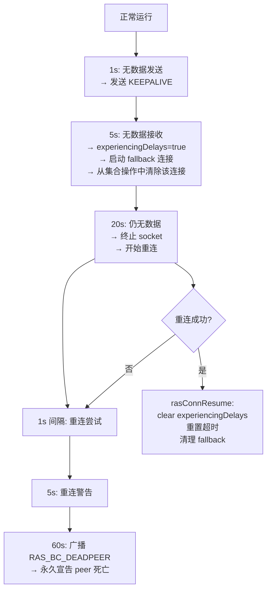

超时升级机制是 RAS 故障检测的核心，采用**渐进式响应**策略——从轻量级的心跳到重量级的 peer 死亡宣告，每一步都比上一步更激进。

**第一阶段：1s 无数据发送 → KEEPALIVE**。这是最轻量的响应，只是发一条心跳消息探测对端是否存活。在正常情况下，1s 内总会有数据交换（至少是其他 peer 的更新消息），无数据发送通常意味着暂时没有活动，不一定表示故障。

**第二阶段：5s 无数据接收 → experiencingDelays**。这是一个关键的状态转换——5s 没有收到任何数据，对端可能已经无响应。`experiencingDelays=true` 标志触发了两个重要动作：(1) 启动 fallback 连接，准备绕过可能故障的 peer；(2) 从集合操作中清除该连接，避免集合操作卡在等待这个 peer 上。**从集合操作中清除**是保护性措施——即使 peer 只是暂时延迟，也不应该阻塞其他 peer 的集合操作进展。

**第三阶段：20s 无数据 → 终止 socket + 重连**。此时对端几乎确定已经故障，socket 被主动关闭，开始周期性重连尝试。关闭 socket 而非继续等待的原因是：TCP 的默认重传超时可达 15 分钟，远比 RAS 的检测窗口长，主动关闭可以更快地回收资源。

**第四阶段：60s 重连失败 → 宣告 peer 死亡**。如果 60s 内都无法重连，对端被认为是永久故障。`RAS_BC_DEADPEER` 广播沿环双向洪泛到所有进程，触发全局的故障处理流程。

**重连成功路径 (rasConnResume)**：如果重连成功，系统会清除 `experiencingDelays` 标志，重置所有超时计时器，并清理 fallback 连接。这确保了系统在短暂网络抖动后能恢复正常运行，不会留下残留的 fallback 连接消耗资源。

### 5.2 Dead Peer 广播

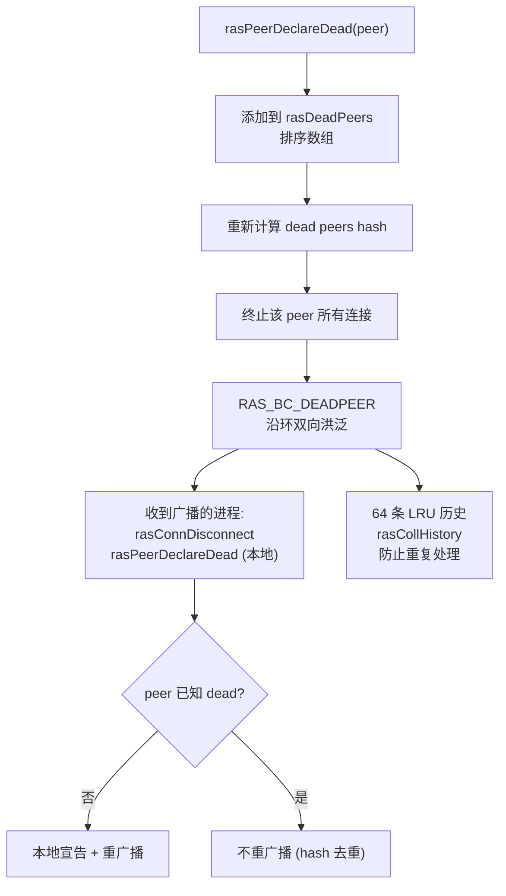

Dead Peer 广播是 RAS 将局部故障信息传播为全局共识的机制。

**rasDeadPeers 排序数组**：dead peer 列表保持排序，使得 hash 计算是确定性的（相同内容产生相同 hash），也使得查找和插入操作可以通过二分查找在 O(log N) 时间内完成。排序保证了所有进程对相同的 dead peer 集合计算出的 hash 完全一致，这是去重机制正确性的前提。

**终止所有连接**：peer 被宣告死亡后，与该 peer 的所有 socket 连接被立即关闭。这释放了文件描述符和缓冲区内存，也防止了已死 peer 的 socket 在 TCP 重传中浪费网络带宽。

**双向洪泛**：广播沿环的两个方向（next 和 prev link）同时传播。在最坏情况下（环的中间 peer 死亡），信息需要经过 N/2 步才能到达最远的 peer。双向洪泛将这个时间减半到 N/4 步。

**LRU 历史去重 (rasCollHistory)**：64 条 LRU 记录保存了最近处理过的集合操作 ID。当收到一个广播时，先检查历史——如果已经处理过相同 ID 的广播，直接丢弃，不重广播。这防止了广播在环中无限循环——没有去重，一条广播会永远在环中传播，因为每个 peer 都会重广播给它除了来源之外的两个邻居。

**hash 去重作为第二道防线**：即使 LRU 历史已满（64 条不足以覆盖所有活跃广播），hash 去重也能防止重复处理。如果收到的广播中的 dead peers hash 与本地相同，说明这个 peer 已经被本地宣告为 dead，不需要再次处理。hash 去重是 O(1) 的，比遍历 LRU 历史更高效。

---

## 6. 集合操作

### 6.1 Broadcast

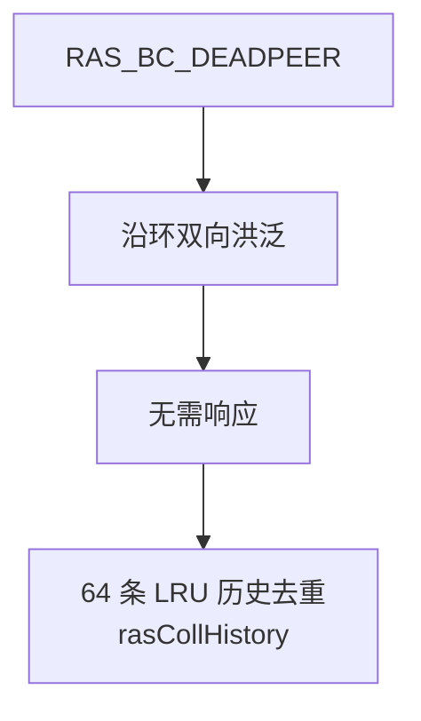

RAS Broadcast 是最简单的集合操作——单向洪泛，无需响应。这种"fire-and-forget"设计使得广播的延迟仅取决于环的跳数，不受响应收集时间的影响。

**为什么不需要响应？** Dead peer 广播是事实声明而非请求——"peer X 已经死了"是一个确定的事实，不需要确认。即使某个进程没有收到广播，它最终也会通过自己的超时机制发现同一个 peer 死亡。广播只是加速了故障感知，不是唯一的发现机制。

### 6.2 Gather 集合

| 类型 | 收集内容 |
|------|---------|
| `RAS_COLL_CONNS` | 连接行程时间统计 (min/max/sum/count) |
| `RAS_COLL_COMMS` | 每通信器数据: rank 信息、操作计数、状态标志 |

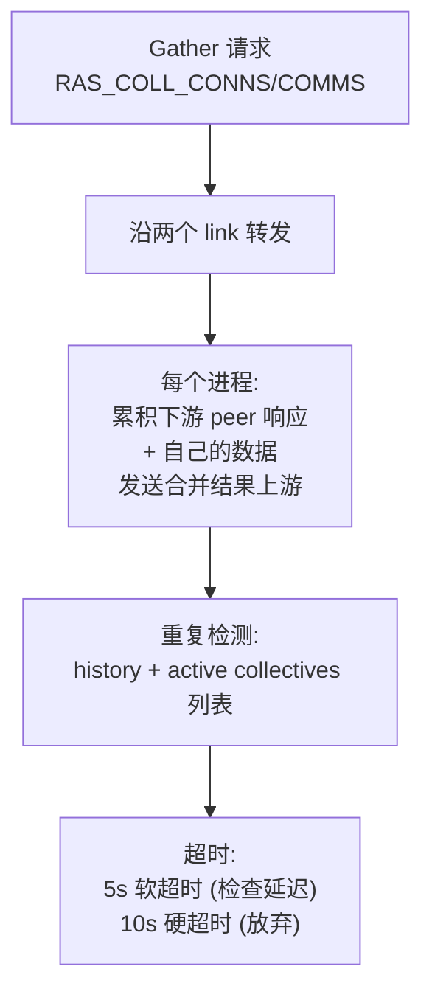

Gather 集合用于从所有进程收集状态信息，是外部监控工具（`ncclras` CLI）获取全局视图的主要方式。

**两阶段累积**：Gather 请求沿环的两个方向传播，每个进程在转发前将下游的响应与自己的数据合并。最终，发起者从两个方向收到两份完整的聚合结果。这种"沿途合并"策略使得每个进程只需要发送一次聚合数据（而非逐级转发所有原始数据），总网络流量从 O(N^2) 降低到 O(N)。

**重复检测**：与广播类似，Gather 请求也可能在环中循环。`rasCollHistory` 和活跃集合列表共同防止重复处理——活跃列表追踪当前正在进行的集合操作，确保同一请求不会被启动两次。

**软/硬超时设计**：5s 软超时只是记录一个警告，不中断操作，给延迟的 peer 额外的时间响应。10s 硬超时则放弃等待，用已收集到的部分数据返回结果。这种渐进式超时在分布式系统中是常见的模式——既保证了最终完成，又避免了无限等待。

---

## 7. Peer 管理

### 7.1 Peer 信息结构

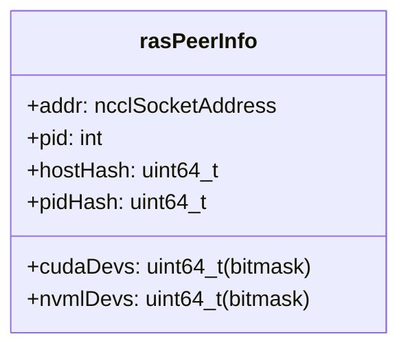

`rasPeerInfo` 封装了一个 NCCL 进程的身份信息，用于在 RAS 网络中唯一标识和定位一个进程。

**cudaDevs/nvmlDevs 位掩码**：用 64-bit 位掩码表示进程使用的 GPU 设备列表。bit i 置位表示该进程使用了 GPU i。这种紧凑的表示方式使得 peer 的 GPU 使用信息可以在一条消息中传输，也支持快速的集合操作（如"哪些 GPU 正在被使用"可以通过 OR 运算一步完成）。

**hostHash 和 pidHash**：主机哈希用于判断两个 peer 是否在同一物理节点上（相同 hostHash = 同节点），这在故障检测中有重要意义——同节点的 peer 共享网络路径，一个不可达通常意味着另一个也不可达。pidHash 用于识别同一节点上的不同进程，在多进程场景下避免混淆。

### 7.2 Peer 添加

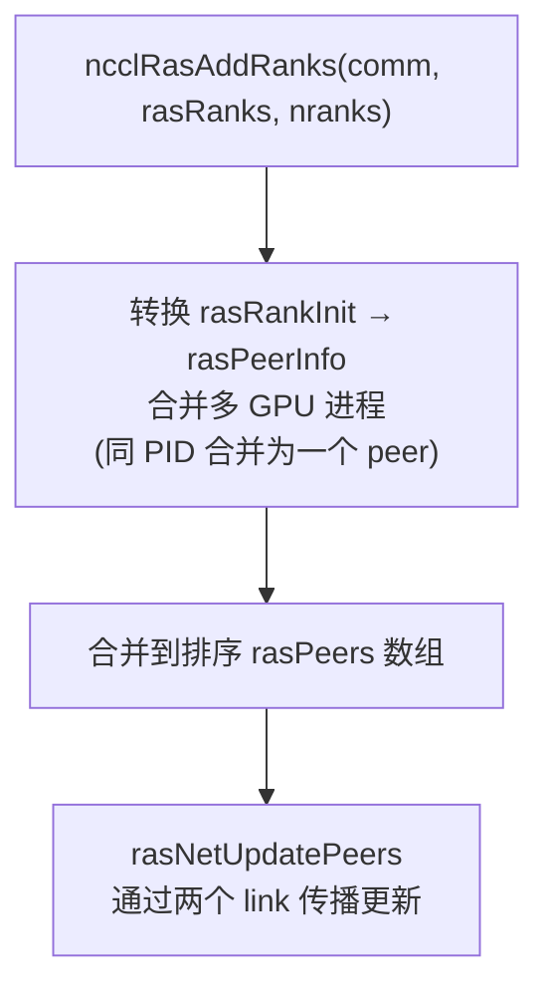

Peer 添加发生在新 NCCL 通信器被创建时，将新通信器的 rank 信息注入 RAS 网络。

**多 GPU 进程合并**：一个 MPI 进程可能管理多个 GPU（例如 MPI rank 0 管理 GPU 0,1,2,3），但 RAS 只需要为每个进程建立一个 peer 条目。合并逻辑通过 pidHash 识别同一进程的多个 rank，将它们的 GPU 位掩码 OR 在一起，创建单一的 `rasPeerInfo`。这减少了 RAS 网络中的 peer 数量（从 GPU 数量降低到 MPI 进程数量），减轻了环形网络的连接压力。

**排序数组合并**：新 peer 被插入到排序的 `rasPeers` 数组中，保持按地址排序。排序数组支持 O(log N) 的查找和 O(N) 的插入（通过 memmove），在 peer 数量通常不超过数百的场景下性能足够。

**rasNetUpdatePeers**：通过环的两个 link 传播 peer 更新消息。更新消息包含新增 peer 的完整信息和新的 dead peers hash。对端收到后检查 hash，如果与自己不同则触发进一步的更新交换。这种"推-拉"模式确保了 peer 信息最终一致——虽然不能保证所有进程在同一时刻拥有完全相同的视图，但任何变化最终都会传播到所有进程。

---

## 8. 外部客户端接口

### 8.1 文本协议

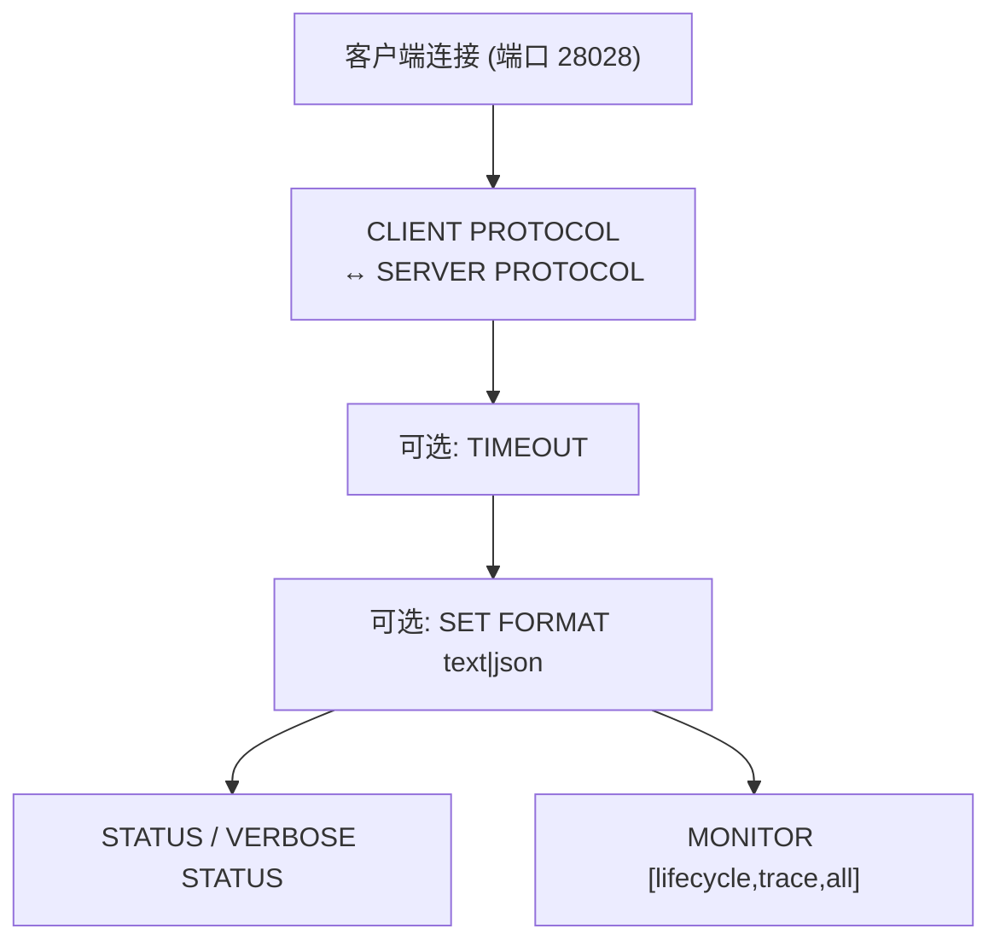

外部客户端接口采用**人类可读的文本协议**，这使得运维人员可以直接通过 `telnet` 或 `nc` 连接到 RAS 端口查询状态，无需专用工具。

**协议版本协商**：客户端和服务器交换协议版本号，取两者支持的最高版本作为通信版本。这保证了向后兼容——旧版客户端可以连接新版 RAS 服务器，反之亦然。

**格式选择 (text/json)**：text 格式适合人工阅读，json 格式适合程序解析。运维人员通常使用 text 格式快速查看状态，自动化监控脚本使用 json 格式解析输出。

### 8.2 状态查询流程

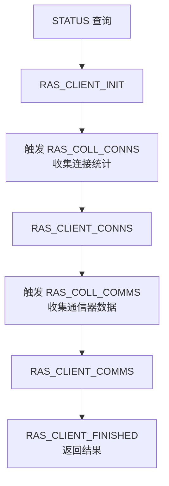

状态查询是一个两阶段 gather 操作，先后收集连接统计和通信器数据。

**为什么分两阶段？** 连接统计和通信器数据来自不同的 gather 操作，每个 gather 需要沿环传播并收集所有 peer 的响应。分开执行两个 gather 比合并为一个更简单，也避免了单个 gather 操作的响应过大。

**RAS_CLIENT_INIT/CONNS/COMMS/FINISHED** 是查询的状态机，追踪当前处于哪个阶段。客户端可以通过 `TIMEOUT` 命令设置超时——如果某个 gather 操作在超时时间内未完成，返回已收集到的部分结果。

### 8.3 监控事件

| 事件组 | 事件 |
|--------|------|
| **lifecycle** | PEER_NEW, PEER_DEAD, PEER_CONNECTING, PEER_CONNECTED, PEER_RECOVERED |
| **trace** | PEER_UNRESPONSIVE, PEER_DISCONNECTED, PEER_SEND_STUCK, PEER_KEEPALIVE_TIMEOUT, PEER_TIMEOUT_DEAD, PEER_RETRY, PEER_INIT_TIMEOUT |
| **all** | 以上所有 |

**lifecycle 事件**提供了 peer 状态变化的完整生命周期：从发现新 peer (NEW)，到建立连接 (CONNECTING → CONNECTED)，到故障检测 (DEAD)，到恢复 (RECOVERED)。运维人员通常只监控 lifecycle 事件，就能获得系统健康状态的完整视图。

**trace 事件**提供了更细粒度的故障诊断信息：PEER_UNRESPONSIVE 表示对端延迟但未死亡；PEER_SEND_STUCK 表示发送队列积压；PEER_KEEPALIVE_TIMEOUT 表示心跳超时。这些事件帮助运维人员区分"对端真的挂了"和"网络暂时抖动"。

**MONITOR 模式**是持续监控模式——客户端连接后，RAS 线程在每次发生相关事件时主动推送通知，而非等待客户端轮询。这大大减少了查询延迟，使得运维人员可以近乎实时地感知系统状态变化。

---

## 9. 关键源文件

| 文件 | 行数 | 功能 |
|------|------|------|
| `src/ras/ras.cc` | ~800 | RAS 主线程、事件循环、消息分发 |
| `src/ras/ras_internal.h` | ~600 | 所有 RAS 数据结构和声明 |
| `src/ras/rasnet.cc` | ~800 | 网络连接、keep-alive、故障恢复 |
| `src/ras/peers.cc` | ~400 | Peer 管理、dead peer 广播 |
| `src/ras/collectives.cc` | ~300 | RAS 集合操作 (broadcast/gather) |
| `src/ras/client_support.cc` | ~400 | 外部客户端接口 |
| `src/ras/client.cc` | ~200 | 独立 CLI 客户端 |
