# NCCL RAS 容错可用性服务

RAS (Resilience Availability Service) 是 NCCL 内置的分布式监控子系统，在所有 NCCL 进程间形成监控网格，实现故障检测、peer 生命周期管理和外部状态查询。

---

## 1. RAS 架构总览

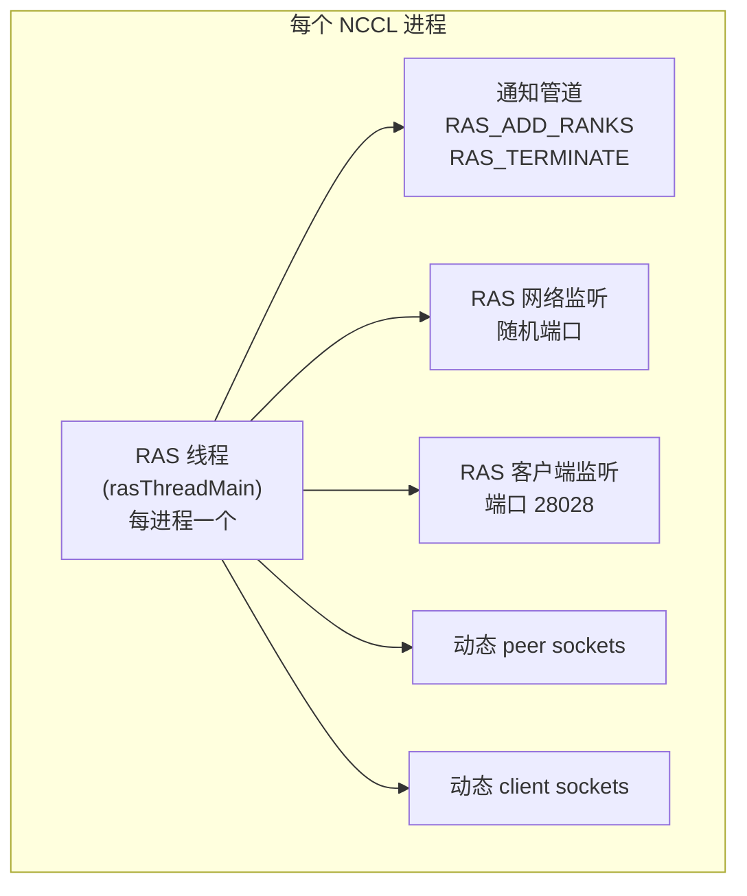

---

## 2. RAS 环形网络拓扑

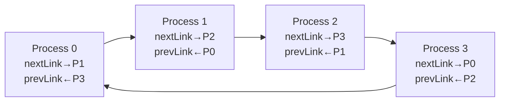

每个 link (`rasLink`) 包含一个 `rasLinkConn` 链表：
- 第一个条目是主连接
- 额外条目是故障恢复时创建的 fallback 连接
- 主连接恢复后，fallback 被清理 (`rasLinkSanitizeFallbacks`)

Peer 计算逻辑 (`rasLinkCalculatePeer`):
- 沿 `rasPeers` 排序数组，按 link 方向遍历
- 跳过 dead peer
- Fallback-of-fallback 时跳过同一节点的所有 peer

---

## 3. 连接生命周期

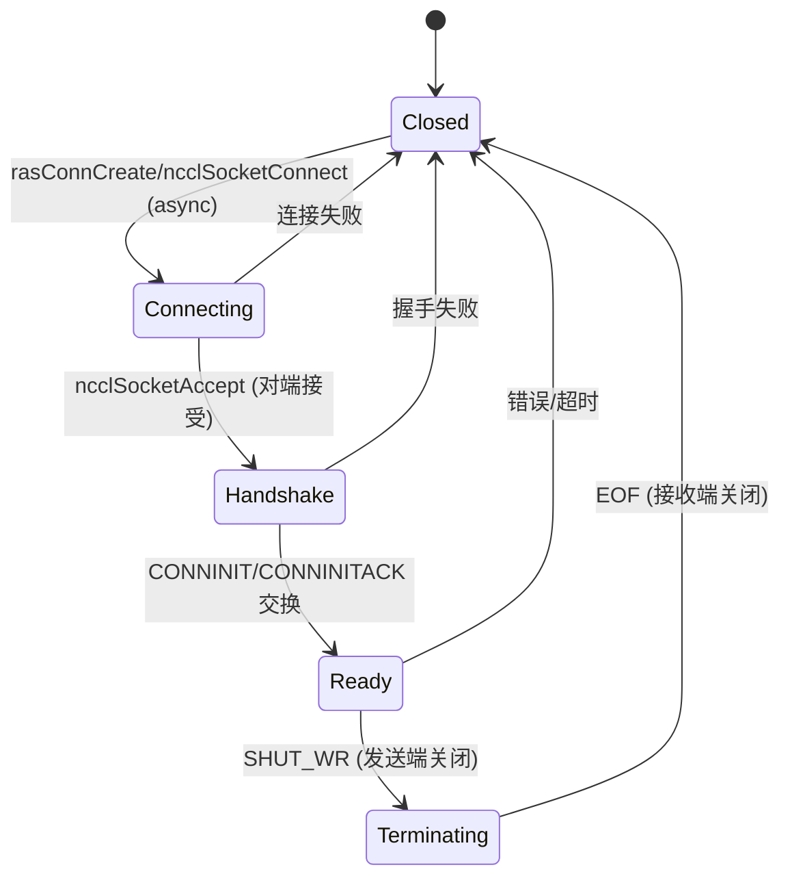

**连接竞态解决**: 地址较小的一方发起连接。

**握手协议**:
- 发送: `RAS_MSG_CONNINIT` (NCCL 版本、监听地址、peers hash)
- 响应: `RAS_MSG_CONNINITACK` (可包含 NACK 拒绝)

---

## 4. 消息协议

### 4.1 消息类型

| 类型 | 方向 | 用途 |
|------|------|------|
| `CONNINIT` | 连接方 → 接受方 | 握手发起 |
| `CONNINITACK` | 接受方 → 连接方 | 握手响应 |
| `KEEPALIVE` | 双向 | 心跳 (peers hash, dead hash, link mask, wallclock) |
| `PEERSUPDATE` | 双向 | peer 列表同步 (delta + full dead peers) |
| `COLLREQ` | 发起方 → 下游 | 集合操作请求 (broadcast/gather) |
| `COLLRESP` | 下游 → 上游 | 集合操作响应 |

### 4.2 消息发送

消息入队到 per-connection `ncclIntruQueue<rasMsgMeta>` 发送队列，包含：
- 入队时间
- 发送进度偏移
- 消息长度

### 4.3 Peer 更新去重

每个连接追踪 4 个 hash 值：

| Hash | 用途 |
|------|------|
| `lastSentPeersHash` | 上次发送的 peer 列表 hash |
| `lastRecvPeersHash` | 上次接收的 peer 列表 hash |
| `lastSentDeadPeersHash` | 上次发送的 dead peer hash |
| `lastRecvDeadPeersHash` | 上次接收的 dead peer hash |

仅当 hash 不同时才发送/处理更新。

---

## 5. 故障检测与恢复

### 5.1 超时升级机制

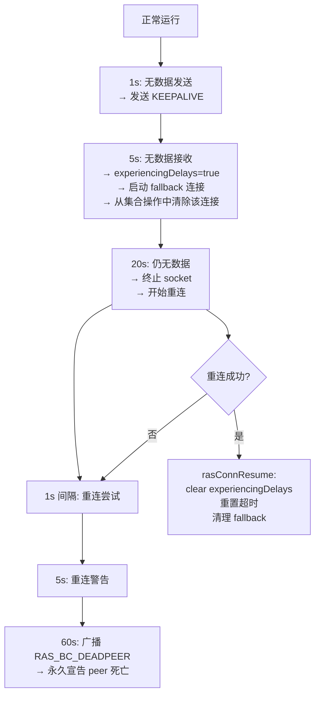

### 5.2 Dead Peer 广播

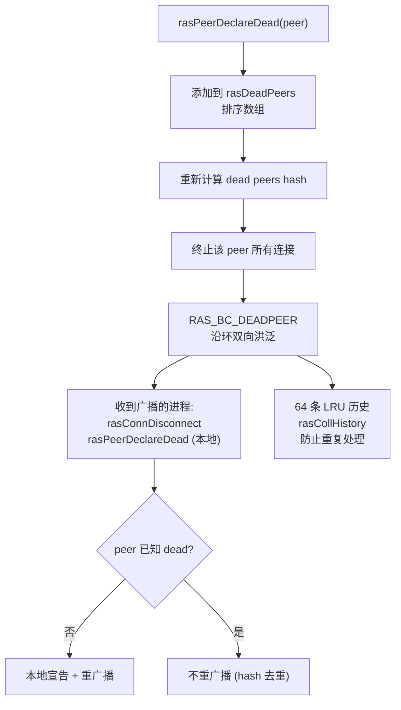

---

## 6. 集合操作

### 6.1 Broadcast

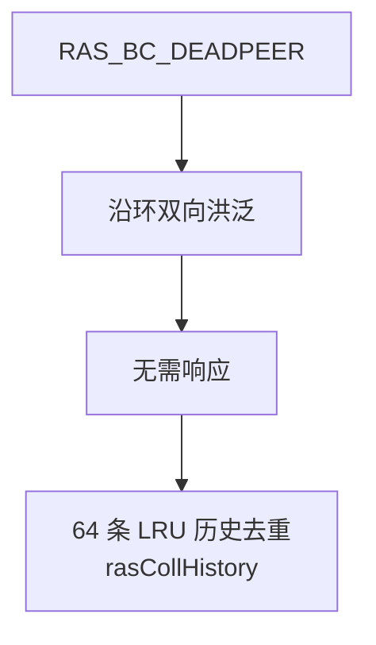

### 6.2 Gather 集合

| 类型 | 收集内容 |
|------|---------|
| `RAS_COLL_CONNS` | 连接行程时间统计 (min/max/sum/count) |
| `RAS_COLL_COMMS` | 每通信器数据: rank 信息、操作计数、状态标志 |

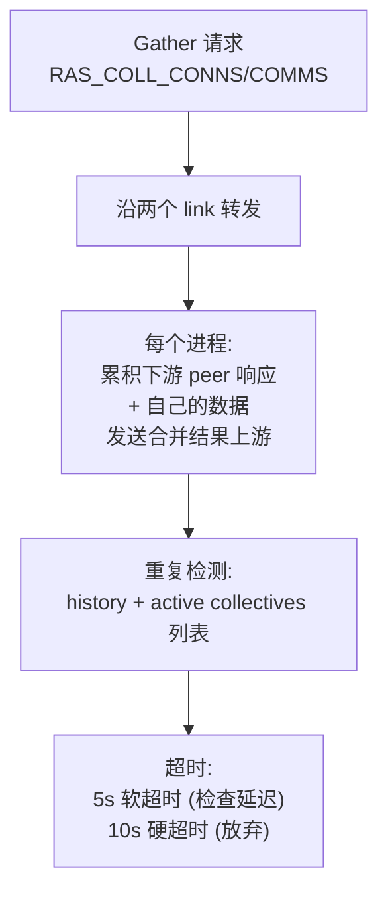

---

## 7. Peer 管理

### 7.1 Peer 信息结构

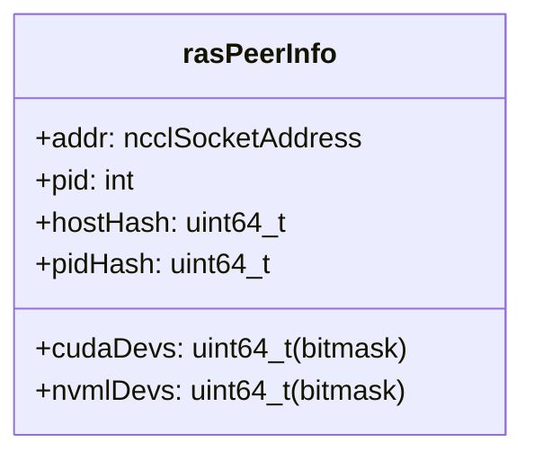

### 7.2 Peer 添加

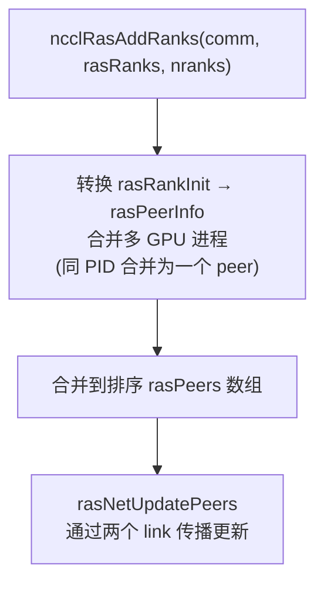

---

## 8. 外部客户端接口

### 8.1 文本协议

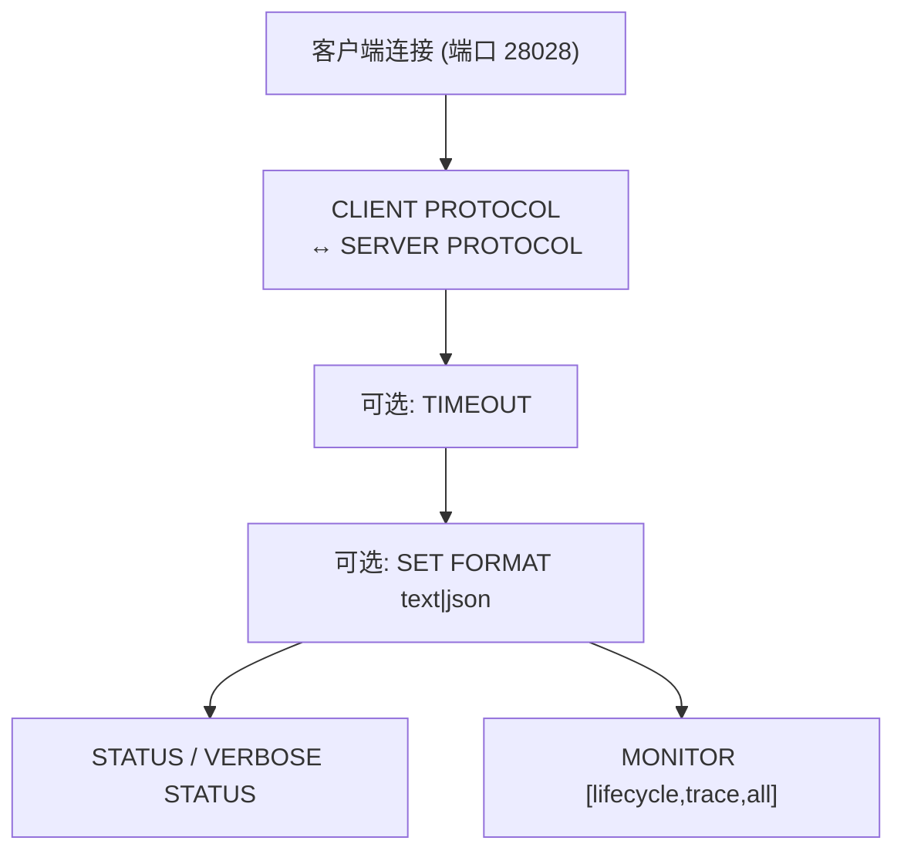

### 8.2 状态查询流程

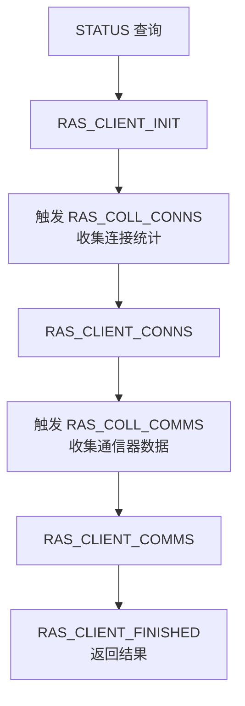

### 8.3 监控事件

| 事件组 | 事件 |
|--------|------|
| **lifecycle** | PEER_NEW, PEER_DEAD, PEER_CONNECTING, PEER_CONNECTED, PEER_RECOVERED |
| **trace** | PEER_UNRESPONSIVE, PEER_DISCONNECTED, PEER_SEND_STUCK, PEER_KEEPALIVE_TIMEOUT, PEER_TIMEOUT_DEAD, PEER_RETRY, PEER_INIT_TIMEOUT |
| **all** | 以上所有 |

---

## 9. 关键源文件

| 文件 | 行数 | 功能 |
|------|------|------|
| `src/ras/ras.cc` | ~800 | RAS 主线程、事件循环、消息分发 |
| `src/ras/ras_internal.h` | ~600 | 所有 RAS 数据结构和声明 |
| `src/ras/rasnet.cc` | ~800 | 网络连接、keep-alive、故障恢复 |
| `src/ras/peers.cc` | ~400 | Peer 管理、dead peer 广播 |
| `src/ras/collectives.cc` | ~300 | RAS 集合操作 (broadcast/gather) |
| `src/ras/client_support.cc` | ~400 | 外部客户端接口 |
| `src/ras/client.cc` | ~200 | 独立 CLI 客户端 |
