# NCCL GIN GPU 发起网络

GIN (GPU-Initiated Networking) 使 GPU 能够直接发起网络操作 (RDMA put, signal)，无需 CPU 介入。通过插件架构支持两种后端：GDAKI (GPU 直连) 和 Proxy (CPU 辅助)。

GIN 的核心动机是消除传统集合通信中的 CPU 瓶颈。在常规 NCCL 流程中，GPU 内核完成数据准备后必须通知 CPU，再由 CPU 发起 RDMA 操作，这一来回的延迟可达微秒级。GIN 让 GPU 内核直接编程 NIC 完成网络传输，将端到端延迟从"GPU→CPU→NIC"缩短为"GPU→NIC"，这对延迟敏感的集合通信（特别是小消息 AllReduce）至关重要。GIN 插件架构（`ncclGin_t`）定义在 `src/include/plugin/nccl_gin.h` 中，遵循 NCCL 标准插件模式：通过 `NCCL_GIN_PLUGIN` 环境变量指定 `.so` 路径，运行时 `dlopen` 加载。

---

## 1. 双后端架构

NCCL 提供两种 GIN 后端，核心区别在于 GPU 是否能直接编程 NIC。选择哪种后端不是用户手动决定的——NCCL 在初始化时自动检测硬件能力并选择最优路径。

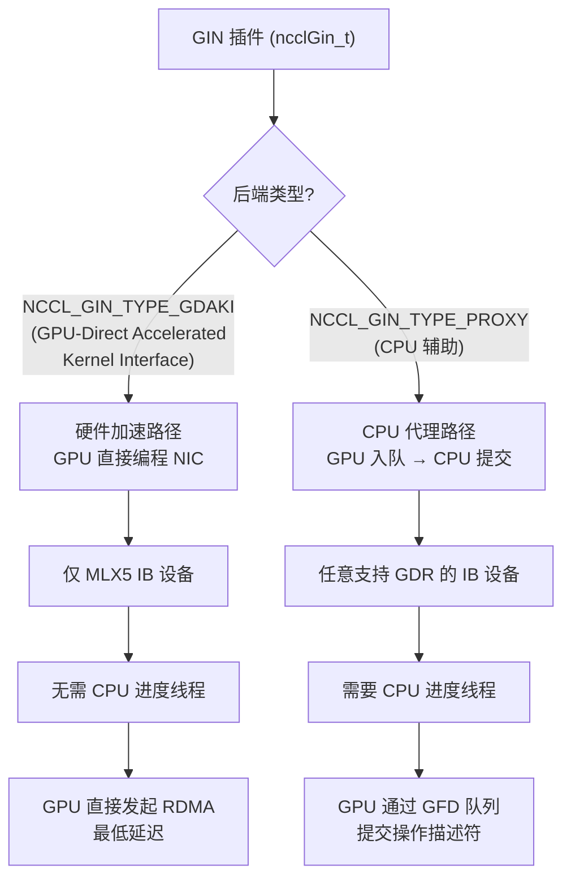

**GDAKI 后端**（GPU-Direct Accelerated Kernel Interface）是理想路径：GPU 内核直接通过 DOCA GPUNetIO 或类似机制编程 Mellanox ConnectX NIC 的硬件队列，CPU 完全不参与数据路径。这要求 NIC 是 MLX5 系列（因为 GDAKI 依赖 mlx5 驱动的特定硬件能力），且系统需配置 GDR（GPUDirect RDMA）支持。在 `src/transport/net_ib/gin.cc` 的 `ncclGinIbInitType` 函数中，NCCL 会检查 `IB_PROVIDER_MLX5` 标志和 GDR 可用性来决定是否可以使用 GDAKI。

**Proxy 后端**是兼容性回退路径：GPU 不能直接操作 NIC，而是将操作描述符写入一个 GPU-CPU 共享队列（GFD 队列），由一个专用 CPU 进度线程轮询该队列并代为提交 RDMA 操作。这种方式虽然引入了 CPU 开销，但可以在任何支持 GPUDirect RDMA 的 IB 设备上工作，不限于 MLX5。GFD（GPU Functional Descriptor）队列是此路径的核心数据结构——它本质是一个位于 GPU 可写内存中的环形缓冲区，GPU 内核作为生产者写入描述符，CPU 线程作为消费者读取并执行。

后端选择逻辑实现在 `setLocalGinType`（`src/gin/gin_host.cc`）中：首先检查 `NCCL_GIN_ENABLE` 是否为 1，然后调用 `ncclGin->getProperties` 查询插件的 `netDeviceType`，如果返回 `NCCL_NET_DEVICE_GIN_PROXY` 或 `NCCL_NET_DEVICE_GIN_GDAKI`，则设置相应的后端类型。

---

## 2. GIN 状态与连接

### 2.1 核心数据结构

GIN 状态存储在 `ncclComm->sharedRes->ginState` 中，作为 per-device 共享资源，同一设备上的多个通信器共享同一个 GIN 状态。这种设计避免了重复初始化 IB 设备和创建 QP。

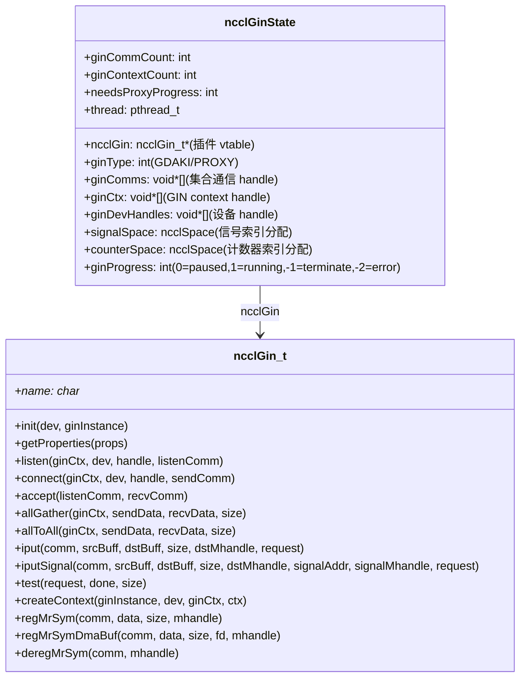

`ncclGinState` 中的 `signalSpace` 和 `counterSpace` 是两个 `ncclSpace` 类型的索引分配器，分别管理信号索引和完成计数器索引的分配。`ncclSpace` 提供并发安全的索引分配/释放，这在多通信器共享同一 GIN 上下文时至关重要——每个 Put+Signal 操作需要一个唯一的信号地址，每个完成通知需要一个唯一的计数器槽位。`signalSpace` 的默认大小由 `NCCL_GIN_SIGNAL_POOL_SIZE`（默认 512K）控制，`counterSpace` 由 `NCCL_GIN_COUNTER_POOL_SIZE`（默认 512K）控制。

`ginProgress` 字段控制进度线程的生命周期：0 表示暂停（初始状态），1 表示运行中，-1 表示应终止，-2 表示遇到错误。进度线程在 `ncclGinProgress` 函数中轮询这个字段来决定自己的行为。

`ncclGin_t` 的 `iput` 和 `iputSignal` 是两个核心操作接口。`iput` 执行简单的 RDMA 写（将本地数据推送到远端内存），`iputSignal` 在 RDMA 写完成后额外发送一个原子信号通知远端——这类似于 NCCL 常规传输中 "Proxy 写数据 + 写 done 标志" 的模式，但由 GIN 插件在更底层完成。

### 2.2 连接建立

GIN 连接建立发生在通信器初始化阶段（`ncclGinConnectOnce`），与常规 NCCL 传输连接建立并行进行。每个 GIN 连接本质上是一个全互联的集合通信组——不是简单的点对点连接，而是一个所有 rank 互相连通的网络。

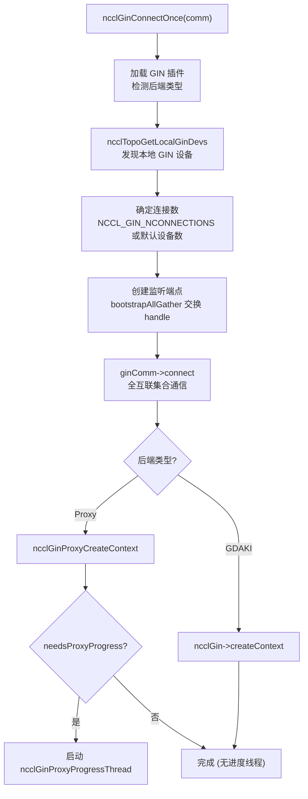

连接建立的第一步是设备发现。`ncclTopoGetLocalGinDevs` 扫描拓扑中标记为 GIN 设备的 IB 网卡，这决定了每个节点上可用的 GIN 通道数。连接数由 `NCCL_GIN_NCONNECTIONS` 环境变量控制，默认等于本地 GIN 设备数量——每个设备对应一个独立的 GIN 连接，以最大化带宽利用。

连接建立使用 bootstrap 网络交换监听端点信息：每个 rank 创建监听端点，通过 `bootstrapAllGather` 收集所有 rank 的端点 handle，然后调用 `ginComm->connect` 建立全互联的集合通信组。这个全互联拓扑意味着每个 rank 与所有其他 rank 建立了直接的 QP 对，支持后续的 `allGather` 和 `allToAll` 操作。

连接建立后，根据后端类型创建上下文。Proxy 后端需要额外的步骤：创建 GFD 队列、注册内存区域、分配信号/计数器空间，以及——如果 `needsProxyProgress` 为真——启动专用进度线程。GDAKI 后端则简单得多，直接调用 `ncclGin->createContext` 即可，因为 GPU 直接操作硬件，不需要 CPU 辅助。

---

## 3. GIN Proxy 后端

Proxy 后端是 GIN 的兼容性实现，适用于不支持 GDAKI 的 IB 设备。其核心思想是：GPU 内核将操作描述符写入共享队列，CPU 进度线程从队列中取出描述符并提交 IB 操作。

### 3.1 Proxy Context 结构

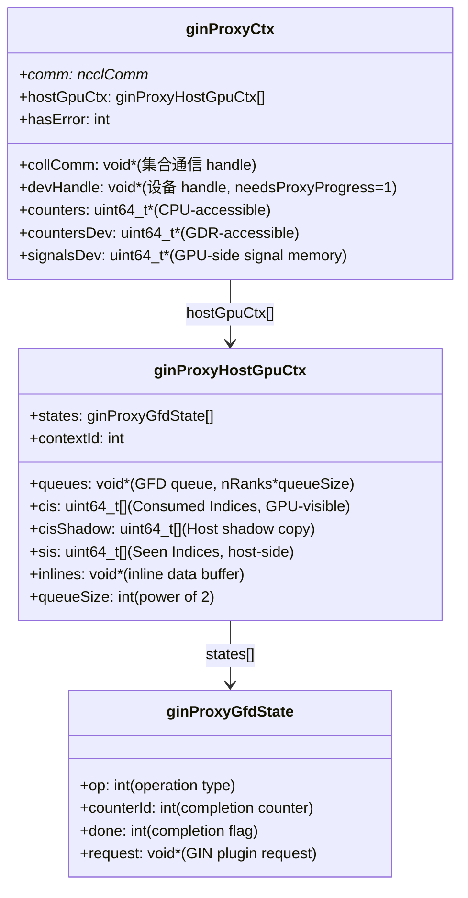

`ginProxyCtx` 是 Proxy 后端的核心上下文。每个 GIN 代理连接对应一个 `ginProxyCtx`，它管理着与所有 peer rank 的 GFD 队列。`counters` 和 `countersDev` 是完成计数器的两个视图：`counters` 是 CPU 可访问的本地副本（用于主机端查询），`countersDev` 是通过 GDR 映射到 GPU 地址空间的副本（GPU 内核通过原子操作递增来标记完成）。`signalsDev` 是位于 GPU 内存的信号区域，用于远端 rank 的 Put+Signal 操作——远端执行 RDMA 原子加到这个地址来通知本地 GPU 操作已完成。

`ginProxyHostGpuCtx` 管理 per-rank 的 GFD 队列状态。每个 rank 对应一段独立的队列空间（大小为 `queueSize`，必须是 2 的幂以便用位运算取模）。`cis`（Consumed Indices）是 GPU 可见的消费索引，`cisShadow` 是 CPU 端的影子副本——CPU 在处理完 GFD 后更新 `cisShadow`，然后批量写入 GPU 可见的 `cis`，以减少跨总线写操作。`sis`（Seen Indices）跟踪 CPU 已读取但可能尚未完成的位置。`inlines` 缓冲区用于存储 GFD 描述符中的内联数据——小到可以直接嵌入描述符的数据不需要额外的 RDMA 读。

### 3.2 Proxy 操作流程

Proxy 操作流程是 GIN 的核心运行时路径，展现了 GPU 和 CPU 如何通过 GFD 队列协同工作。

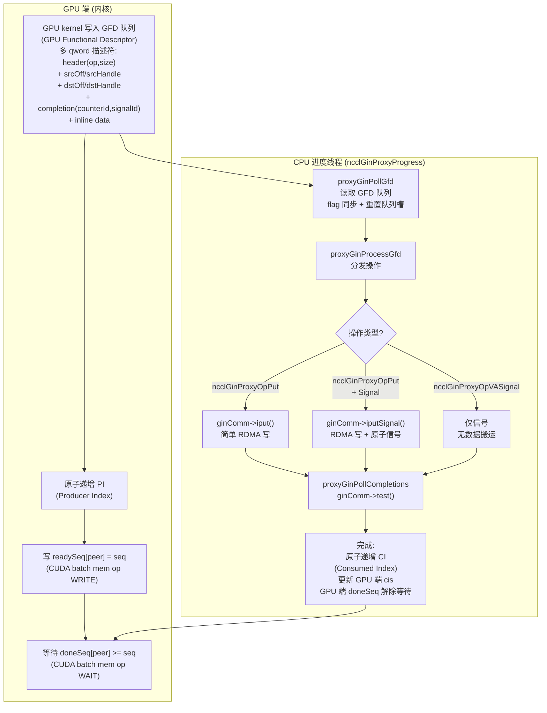

GPU 端的操作流程遵循经典的生产者-消费者模式。GPU 内核首先构造 GFD 描述符并写入队列，每个描述符是一个多 qword 结构，包含操作类型、源/目标偏移和内存句柄、完成通知信息（counterId 和 signalId），以及可选的内联数据。写完描述符后，GPU 原子递增 Producer Index（PI），然后使用 CUDA batch memory operation（`st.release` + `ld.acquire` 语义）写入 `readySeq[peer]` 来通知 CPU 有新工作。最后 GPU 在 `doneSeq[peer]` 上自旋等待完成——这个等待使用 CUDA 的 `ld.acquire` 语义，确保在看到完成标志后能正确观察到远端写入的数据。

CPU 进度线程在 `ncclGinProxyProgress` 中运行无限循环，持续调用 `proxyGinPollGfd` 轮询所有 peer 的 GFD 队列。当发现新描述符时，调用 `proxyGinProcessGfd` 根据操作类型分发：`ncclGinProxyOpPut` 调用 `ginComm->iput` 执行简单 RDMA 写；带 Signal 的 Put 操作调用 `ginComm->iputSignal` 在数据写入后额外执行原子信号；`ncclGinProxyOpVASignal` 仅发送信号不搬运数据（用于纯通知场景，如 barrier 同步）。操作提交后，CPU 通过 `proxyGinPollCompletions` 调用 `ginComm->test` 轮询完成，完成后递增 CI 并更新 GPU 端的 `cis`，使 GPU 的 `doneSeq` 条件满足从而解除等待。

这种设计的关键优势是 GPU 不需要等待 CPU——GPU 只需写入描述符然后自旋等待完成标志，整个过程没有系统调用或 CPU 中断。延迟主要取决于 CPU 进度线程的轮询频率，而这通过专用线程保证了极低的响应延迟。

### 3.3 内存注册

GIN Proxy 的内存注册需要特别处理 CUDA 指针，因为 IB 设备需要知道 GPU 内存的物理地址才能执行 RDMA 操作。

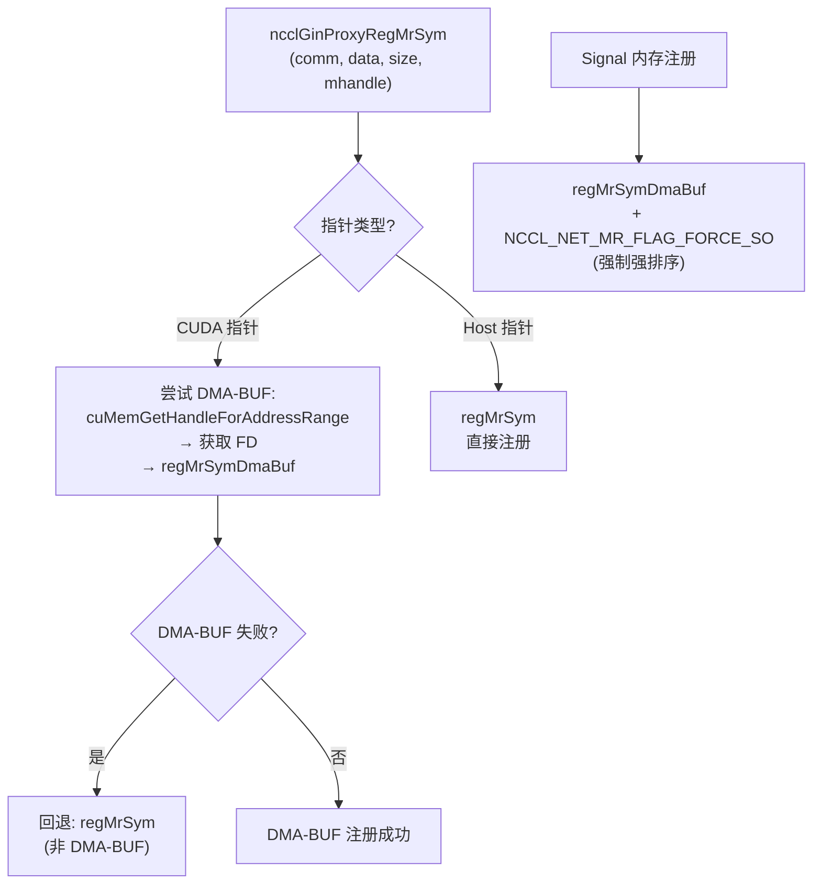

内存注册的核心选择是 DMA-BUF vs 传统注册。DMA-BUF 是 Linux 内核提供的零拷贝 GPU 内存共享机制：通过 `cuMemGetHandleForAddressRange` 获取 CUDA 内存的文件描述符（FD），然后通过 `regMrSymDmaBuf` 将 FD 传递给 IB 驱动，驱动直接映射 GPU 物理内存。这比传统方式（依赖 `nv_peer_mem` 内核模块做 GPU 内存到 IB 的映射）更高效且更通用。如果 DMA-BUF 注册失败（例如驱动版本不支持或 GPU 内存不可导出），则回退到传统的 `regMrSym` 路径。

Signal 内存的注册有一个特殊标记：`NCCL_NET_MR_FLAG_FORCE_SO`（Force Strong Ordering）。这个标记要求 IB 驱动确保对该内存区域的原子操作严格遵守程序顺序。这是因为信号内存用于 Put+Signal 操作的完成通知——如果远端写数据后再发信号，本地必须先看到数据再看到信号。在默认的弱排序 IB 语义下，数据和信号可能乱序到达，`FORCE_SO` 标志告诉 IB 硬件在信号地址上强制内存排序保证。

---

## 4. GIN GDAKI 后端

### 4.1 特点

GDAKI 后端代表 GIN 的终极目标：GPU 完全绕过 CPU，直接编程网络硬件。

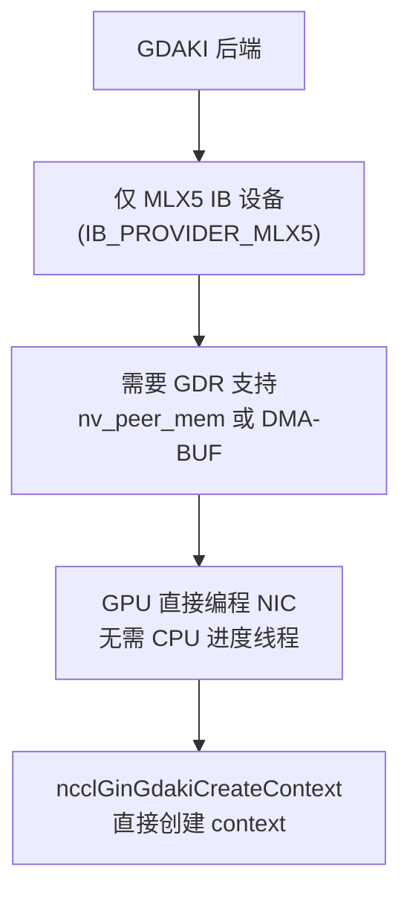

GDAKI 依赖 Mellanox ConnectX 系列网卡的硬件能力——具体来说是 DOCA GPUNetIO 提供的 GPU 直连编程接口。GPU 内核可以通过该接口直接向 NIC 的发送队列提交工作请求，无需经过 CPU。这使得 GIN 操作的延迟仅取决于 GPU-NIC 之间的 PCIe/NVLink 延迟（通常为亚微秒级），而非 GPU→CPU→NIC 的多跳路径（通常为数微秒）。

GDAKI 后端不需要 `ncclGinProxyProgressThread`，因为没有 CPU 进度线程需要管理。上下文创建通过 `ncclGin->createContext` 直接完成，返回的上下文包含 GPU 可直接访问的 NIC 队列信息。这种简化不仅降低了延迟，还减少了 CPU 资源占用——在多通信器场景下，每个 Proxy 后端都需要一个专用 CPU 线程，而 GDAKI 后端则完全不需要。

### 4.2 IB 集成 (gin.cc)

NCCL 的 IB 传输层内置了 GIN 支持，通过 `ncclGinIb` 模块自动选择后端。

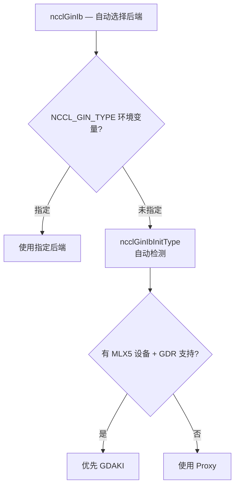

自动检测逻辑在 `ncclGinIbInitType` 中实现。该函数检查系统中是否存在 MLX5 IB 设备（通过 `IB_PROVIDER_MLX5` 标志识别）以及是否支持 GPUDirect RDMA（通过尝试注册 GPU 内存来验证）。如果两个条件都满足，则优先选择 GDAKI 后端，因为它提供最低延迟；否则回退到 Proxy 后端。用户可以通过 `NCCL_GIN_TYPE` 环境变量强制指定后端类型（`GDAKI` 或 `PROXY`），覆盖自动检测结果——这在调试或性能调优时很有用。

### 4.3 集合通信

每个 GIN 连接使用全互联的 send/recv QP 对：

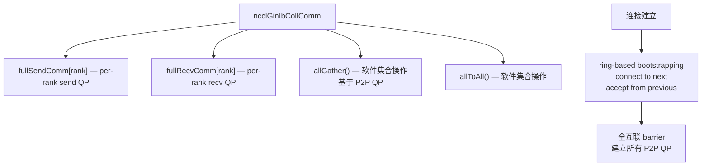

GIN 的集合通信建立在全互联 QP 拓扑上：每个 rank 与所有其他 rank 各建立一个 send QP 和一个 recv QP，形成 N*(N-1) 个点对点连接。`allGather` 和 `allToAll` 操作在这个全互联拓扑上以软件方式实现——通过多个点对点 send/recv 操作组合完成，而非使用 IB 硬件集合能力。

连接建立采用 ring-based bootstrapping 策略：每个 rank 连接下一个 rank 并接受上一个 rank 的连接，形成逻辑环。环建立后，通过 barrier 同步确保所有 rank 就绪，然后建立剩余的点对点 QP 形成全互联拓扑。这种两阶段策略避免了同时建立 N^2 个连接可能导致的资源争用。

---

## 5. IB 层 Proxy 实现

### 5.1 RDMA Put (ncclGinIbProxyIPut)

`ncclGinIbProxyIPut` 是 Proxy 后端最基本的操作——执行一次 RDMA 写，将本地数据推送到远端内存。

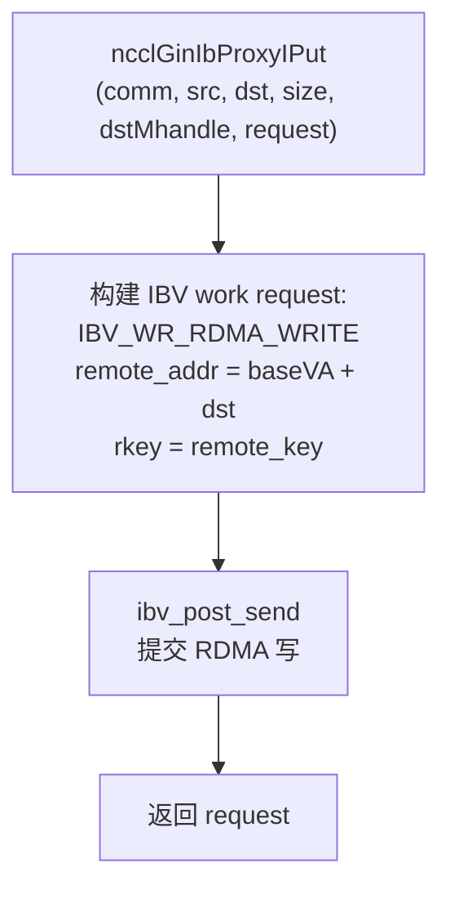

RDMA Put 操作的核心是一个 `IBV_WR_RDMA_WRITE` 工作请求。远端地址由两部分组成：`baseVA`（远端内存区域的基础虚拟地址，在连接建立时通过 handle 交换获得）加上 `dst` 偏移量；`rkey` 是远端内存区域的远程密钥，授权本地 NIC 写入该区域。操作通过 `ibv_post_send` 提交到 NIC 的发送队列，NIC 硬件异步完成数据传输。函数立即返回一个 `request` 句柄，调用者稍后通过 `test` 查询完成状态。

### 5.2 RDMA Put + Signal (ncclGinIbProxyIPutSignal)

Put+Signal 是 GIN 中最常用的操作类型——先传输数据，再通知远端数据已就绪。

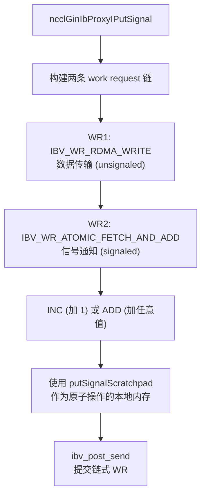

Put+Signal 操作的关键是两条工作请求的链式提交。第一条 WR（`IBV_WR_RDMA_WRITE`）执行数据传输，标记为 unsignaled（不产生完成队列事件，减少 CQE 开销）。第二条 WR（`IBV_WR_ATOMIC_FETCH_AND_ADD`）在数据传输完成后执行原子加操作到远端信号地址，标记为 signaled（产生完成事件）。两条 WR 通过 `next` 指针链接，IB 硬件保证按顺序执行——这是 RDMA 语义的基本保证：同一 QP 上的操作严格按提交顺序完成。

原子操作使用 `putSignalScratchpad` 作为本地内存目标（`IBV_WR_ATOMIC_FETCH_AND_ADD` 需要一个本地缓冲区来存储原子操作前的旧值，但 GIN 不使用这个旧值，因此使用一个专用的 scratchpad 地址）。INC 模式（加 1）用于简单的完成通知，ADD 模式（加任意值）用于传递额外的元数据（如完成的字节数）。

### 5.3 完成 Test (ncclGinIbProxyTest)

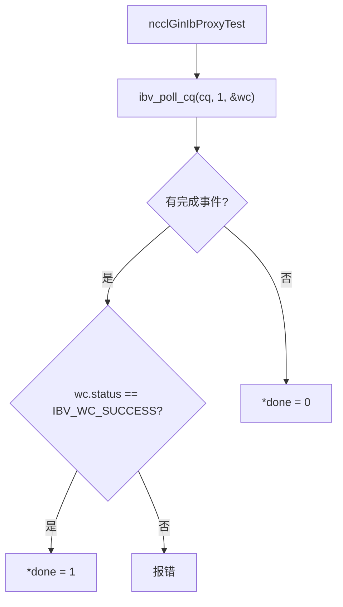

完成测试使用 `ibv_poll_cq` 轮询完成队列。只有 signaled 的 WR 才会产生 CQE（完成队列事件），所以 Put+Signal 操作中只有第二条 WR（原子信号）的完成会被轮询到。如果 CQE 的 status 不是 `IBV_WC_SUCCESS`，则报告错误。如果队列为空，则返回 `done = 0`，调用者稍后重试。这种非阻塞的轮询模式与 NCCL 的代理线程模型一致——代理线程在紧凑循环中轮询所有活跃操作，避免阻塞。

---

## 6. 关键环境变量

| 变量 | 说明 |
|------|------|
| `NCCL_GIN_PLUGIN` | GIN 插件库路径 |
| `NCCL_GIN_TYPE` | 强制后端类型 (GDAKI/PROXY) |
| `NCCL_GIN_NCONNECTIONS` | GIN 连接数 |
| `NCCL_GIN_ENABLE` | 启用/禁用 GIN (默认 1) |
| `NCCL_GIN_SIGNAL_POOL_SIZE` | 信号索引池大小 (默认 512K) |
| `NCCL_GIN_COUNTER_POOL_SIZE` | 计数器索引池大小 (默认 512K) |
| `NCCL_GIN_PROXY_QUEUE_SIZE` | Proxy GFD 队列大小 (默认 -1 自动) |

---

## 7. 关键源文件

| 文件 | 行数 | 功能 |
|------|------|------|
| `src/gin/gin_host.cc` | ~500 | GIN 连接管理、进度线程 |
| `src/gin/gin_host_proxy.cc` | ~600 | GIN Proxy 后端 |
| `src/transport/net_ib/gin.cc` | ~800 | IB 层 GIN 实现 (GDAKI/Proxy) |
| `src/include/plugin/nccl_gin.h` | ~100 | GIN 插件接口定义 |
