# NCCL GIN GPU 发起网络

GIN (GPU-Initiated Networking) 使 GPU 能够直接发起网络操作 (RDMA put, signal)，无需 CPU 介入。通过插件架构支持两种后端：GDAKI (GPU 直连) 和 Proxy (CPU 辅助)。

---

## 1. 双后端架构

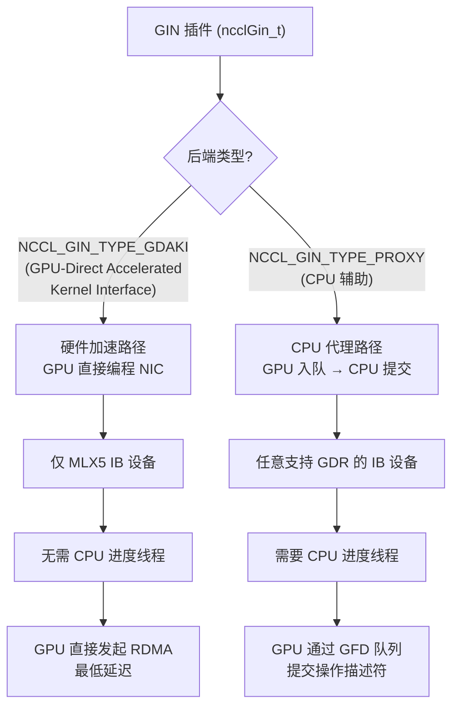

---

## 2. GIN 状态与连接

### 2.1 核心数据结构

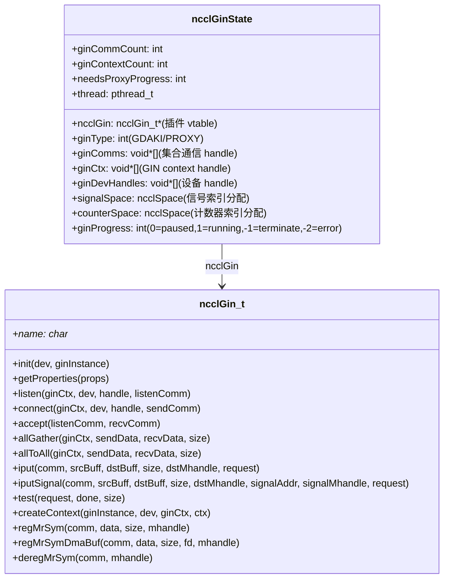

### 2.2 连接建立

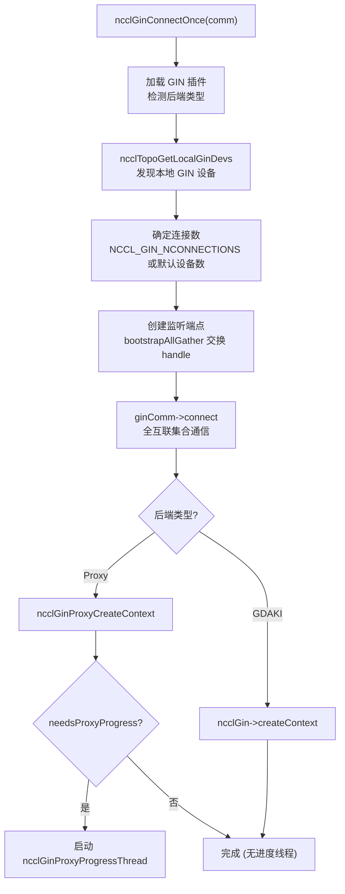

---

## 3. GIN Proxy 后端

### 3.1 Proxy Context 结构

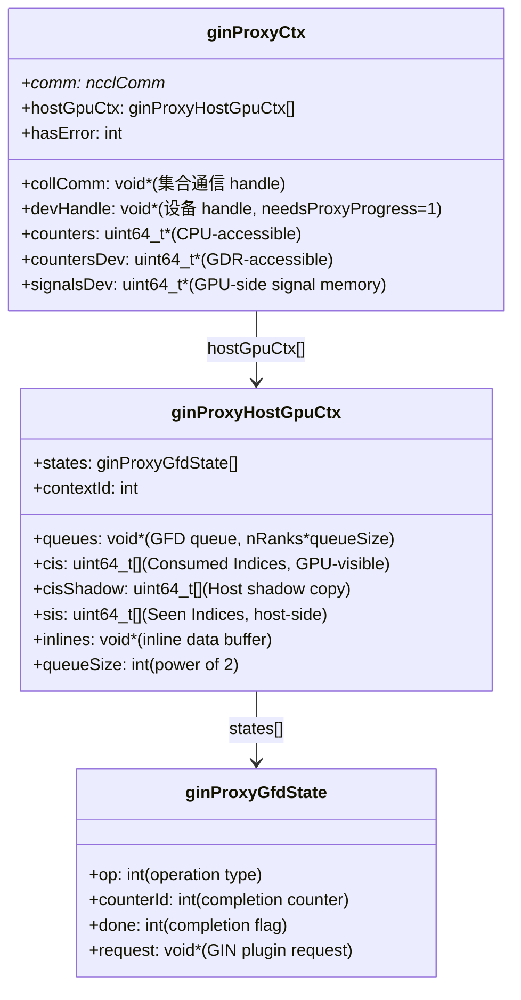

### 3.2 Proxy 操作流程

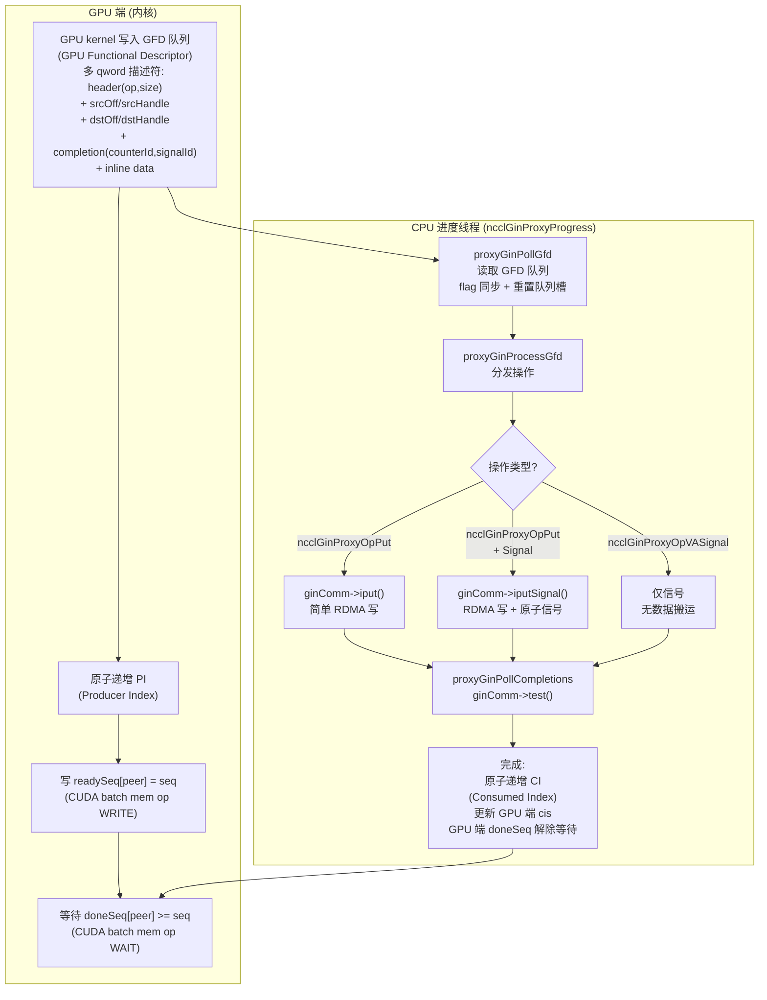

### 3.3 内存注册

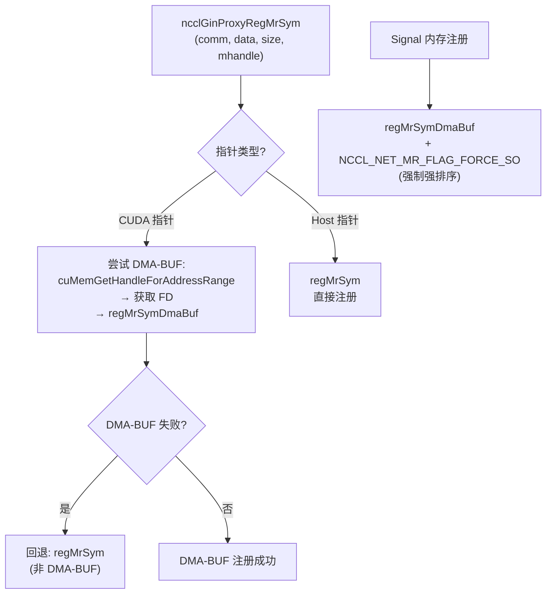

---

## 4. GIN GDAKI 后端

### 4.1 特点

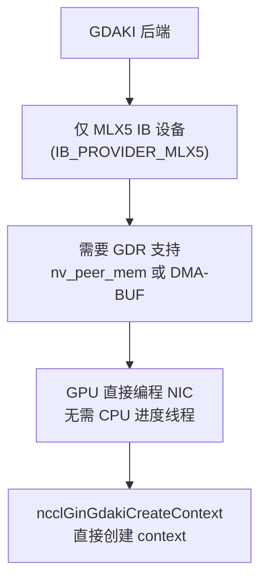

### 4.2 IB 集成 (gin.cc)

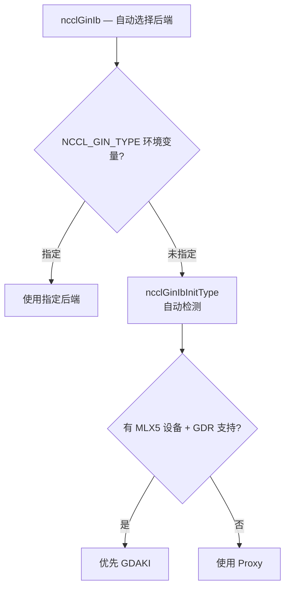

### 4.3 集合通信

每个 GIN 连接使用全互联的 send/recv QP 对：

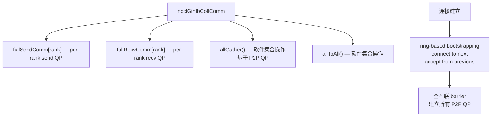

---

## 5. IB 层 Proxy 实现

### 5.1 RDMA Put (ncclGinIbProxyIPut)

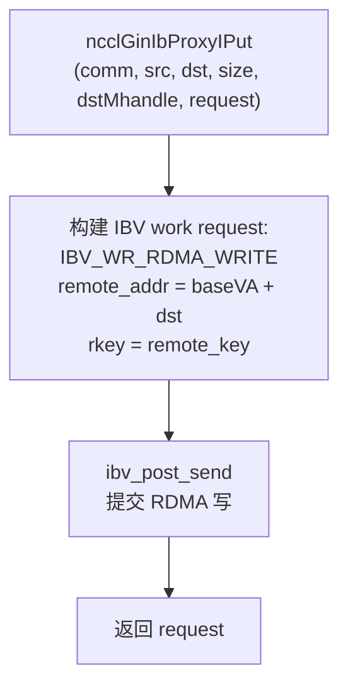

### 5.2 RDMA Put + Signal (ncclGinIbProxyIPutSignal)

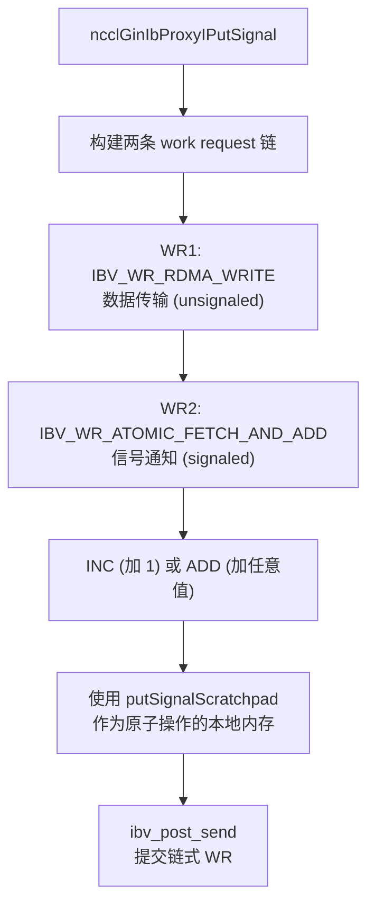

### 5.3 完成 Test (ncclGinIbProxyTest)

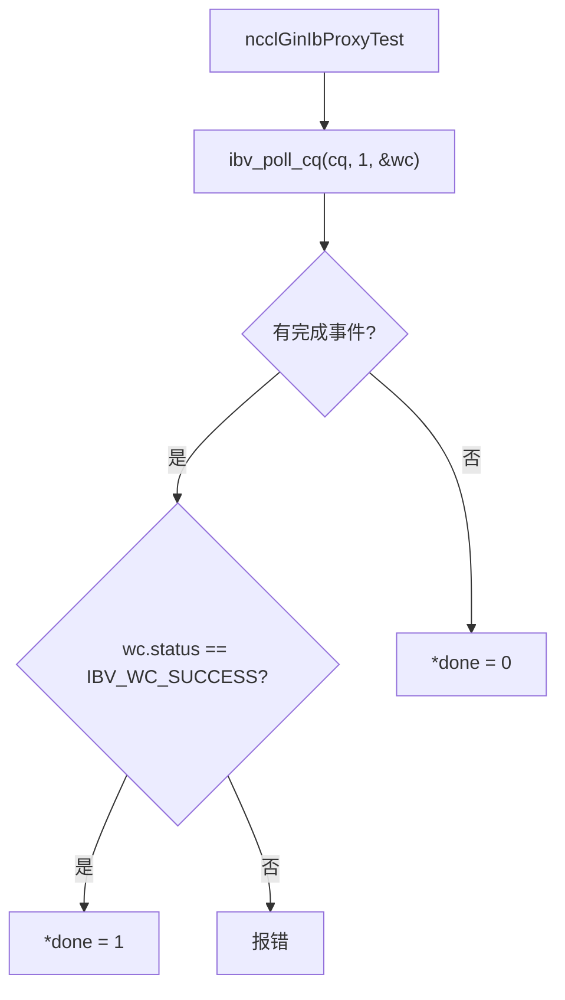

---

## 6. 关键环境变量

| 变量 | 说明 |
|------|------|
| `NCCL_GIN_PLUGIN` | GIN 插件库路径 |
| `NCCL_GIN_TYPE` | 强制后端类型 (GDAKI/PROXY) |
| `NCCL_GIN_NCONNECTIONS` | GIN 连接数 |

---

## 7. 关键源文件

| 文件 | 行数 | 功能 |
|------|------|------|
| `src/gin/gin_host.cc` | ~500 | GIN 连接管理、进度线程 |
| `src/gin/gin_host_proxy.cc` | ~600 | GIN Proxy 后端 |
| `src/transport/net_ib/gin.cc` | ~800 | IB 层 GIN 实现 (GDAKI/Proxy) |
| `src/include/plugin/nccl_gin.h` | ~100 | GIN 插件接口定义 |
