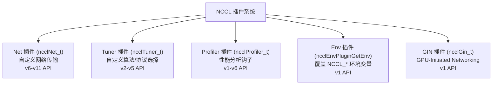
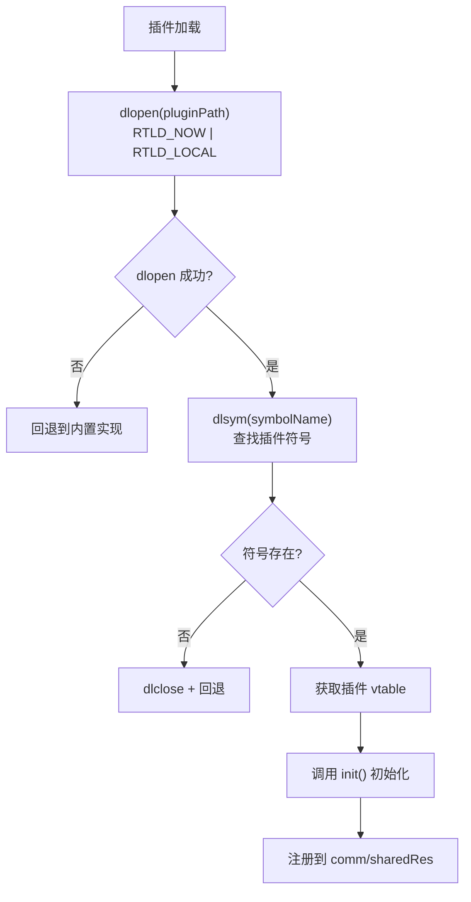
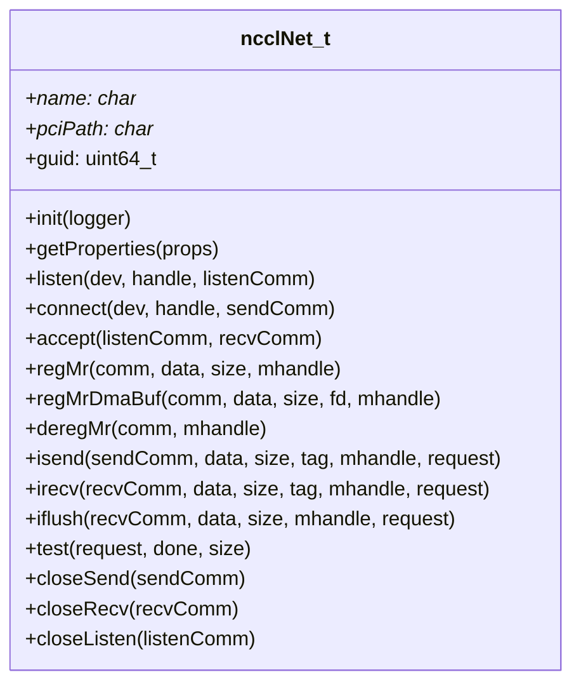
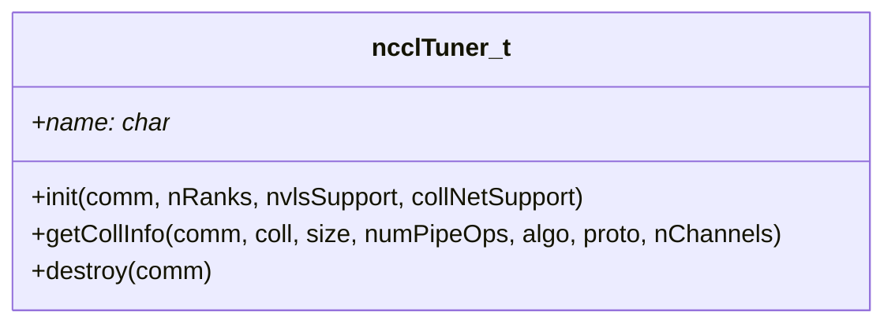
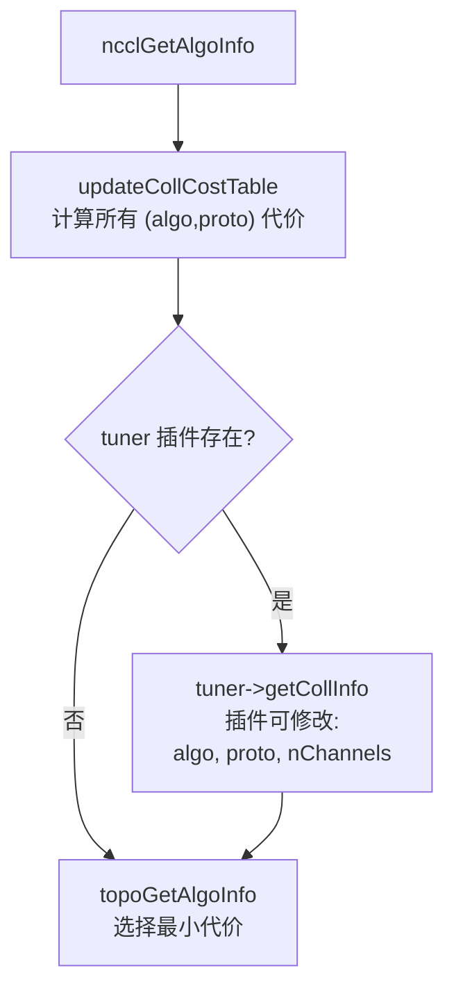
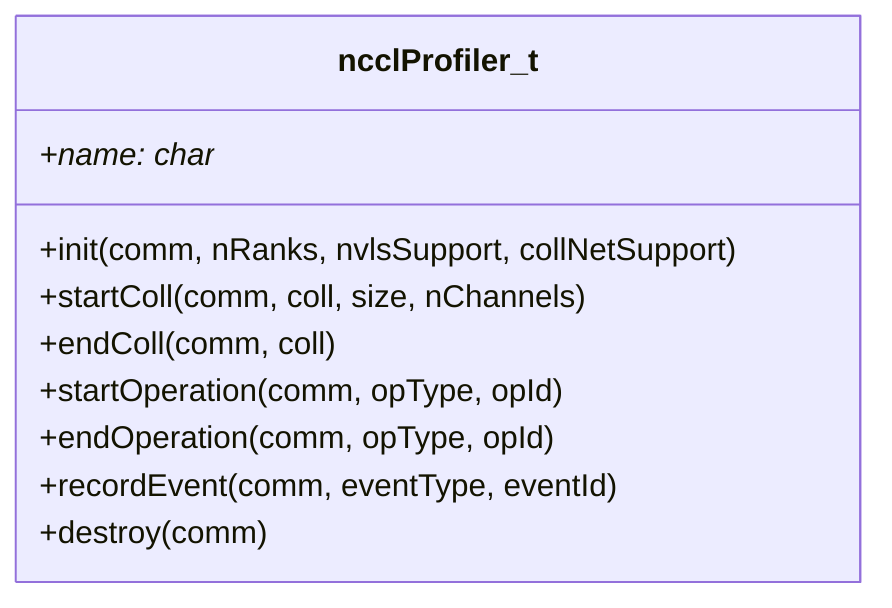
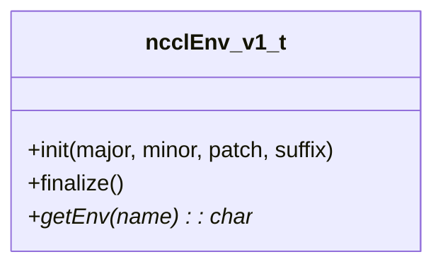
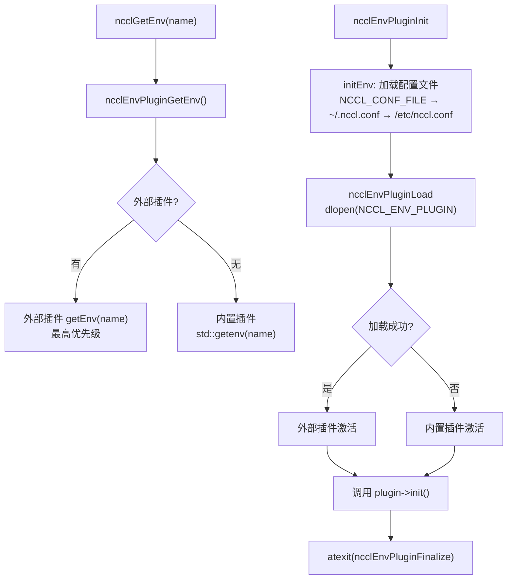
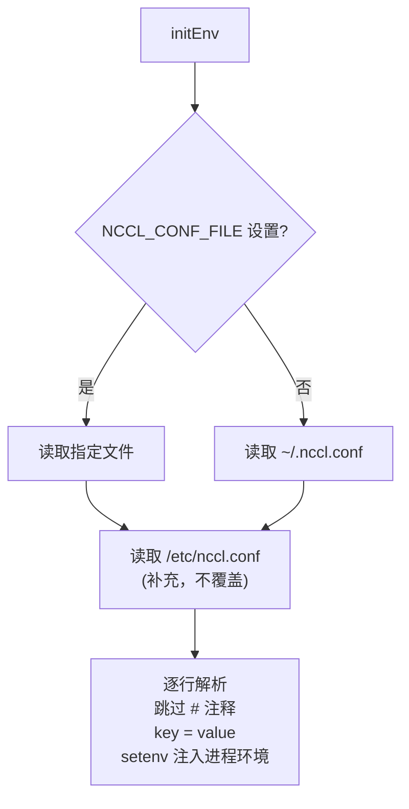

# NCCL 插件系统

NCCL 插件系统允许外部库覆盖或扩展 NCCL 的核心行为，包括网络传输、算法选择、性能分析、环境变量和 GPU 发起网络。

---

## 1. 五种插件类型

| 插件类型 | 环境变量 | 加载时机 | 接口版本 |
|---------|---------|---------|---------|
| Net | `NCCL_NET_PLUGIN` | ncclNetPluginInit | v6-v11 |
| Tuner | `NCCL_TUNER_PLUGIN` | initTransportsRank | v2-v5 |
| Profiler | `NCCL_PROFILER_PLUGIN` | ncclProfilerPluginInit | v1-v6 |
| Env | `NCCL_ENV_PLUGIN` | ncclInitEnv | v1 |
| GIN | `NCCL_GIN_PLUGIN` | ncclGinInit (commAlloc) | v1 |

---

## 2. 插件加载通用流程

---

## 3. Net 插件

### 3.1 接口 (ncclNet_t)

### 3.2 版本差异

| 版本 | 新增能力 |
|------|---------|
| v6 | 基础接口 |
| v7 | regMrDmaBuf (DMA-BUF 注册) |
| v8 | 多 recv (irecv 支持多个缓冲区) |
| v9 | pullProxy (拉取式代理) |
| v10 | collNet 支持 |
| v11 | 完整 collNet + GIN 集成 |

### 3.3 内置 Net 实现

| 实现 | 文件 | 传输方式 |
|------|------|---------|
| Socket | transport/net_socket.cc | TCP Socket |
| IB | transport/net_ib/ | InfiniBand Verbs |

---

## 4. Tuner 插件

### 4.1 接口 (ncclTuner_t)

### 4.2 工作方式

Tuner 插件可以覆盖 NCCL 的自动算法选择，适用于特定工作负载的优化。

---

## 5. Profiler 插件

### 5.1 接口 (ncclProfiler_t)

### 5.2 钩子点

| 事件 | 时机 |
|------|------|
| startColl | 集合操作开始 |
| endColl | 集合操作结束 |
| startOperation | 内核/代理操作开始 |
| endOperation | 内核/代理操作结束 |
| recordEvent | 自定义事件记录 |

---

## 6. Env 插件

### 6.1 接口 (ncclEnv_v1_t)

### 6.2 双插件架构

### 6.3 配置文件解析

---

## 7. GIN 插件

参见 [15-gin.md](15-gin.md)。接口定义在 `ncclGin_t` 中，通过 `NCCL_GIN_PLUGIN` 环境变量加载。

---

## 8. 插件示例

NCCL 仓库内置了多个插件示例，位于 `plugins/` 目录：

| 目录 | 类型 | 说明 |
|------|------|------|
| `plugins/net/` | Net | 网络传输插件模板和示例 |
| `plugins/tuner/example/` | Tuner | Tuner 示例 + 测试 |
| `plugins/tuner/basic/` | Tuner | 基础 Tuner 实现 |
| `plugins/profiler/` | Profiler | Profiler 接口定义 |
| `plugins/profiler/example/` | Profiler | Profiler 示例 |
| `plugins/profiler/inspector/` | Profiler | Inspector Profiler 实现 |
| `plugins/env/` | Env | Env 插件示例 |
| `plugins/mixed/` | Mixed | 混合插件 (同时提供多种类型) |

---

## 9. 关键源文件

| 文件 | 功能 |
|------|------|
| `src/plugin/net.cc` | Net 插件加载 |
| `src/plugin/tuner.cc` | Tuner 插件加载 |
| `src/plugin/profiler.cc` | Profiler 插件加载 |
| `src/plugin/env.cc` | Env 插件加载和双插件调度 |
| `src/plugin/env/env_v1.cc` | 内置 Env 插件 (getenv) |
| `src/include/plugin/` | 插件接口定义头文件 |
