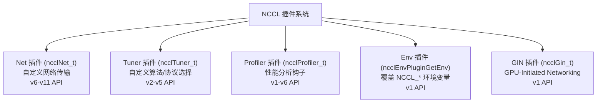
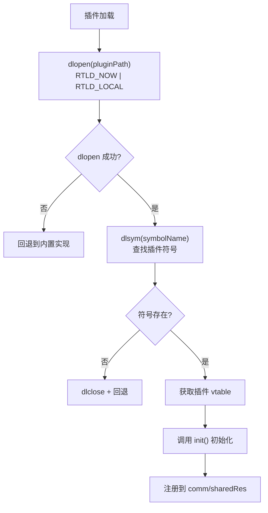
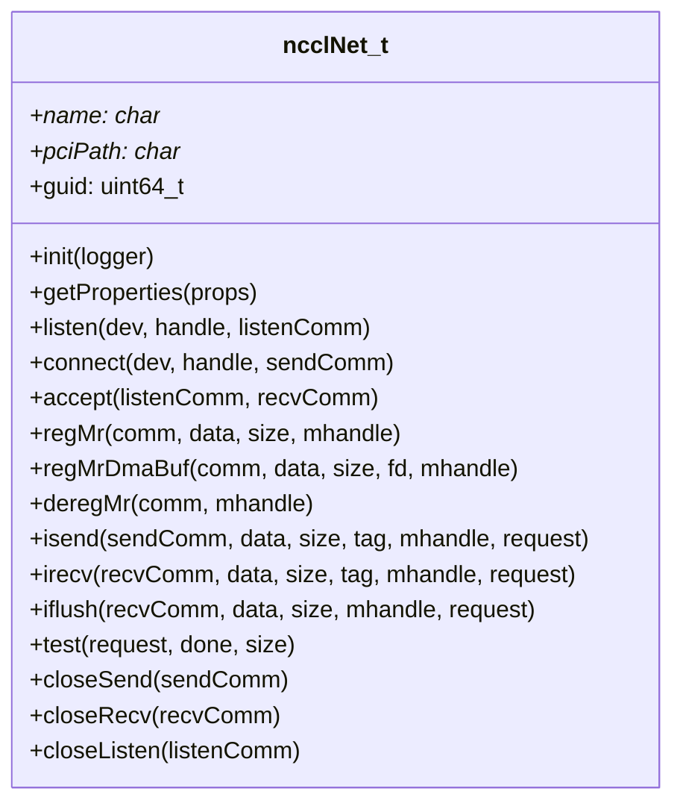
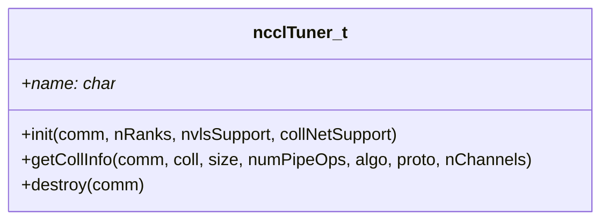
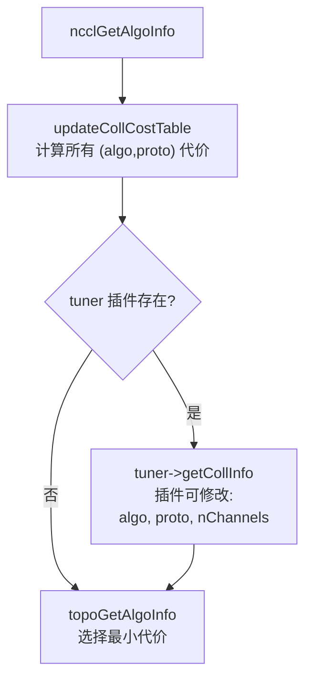
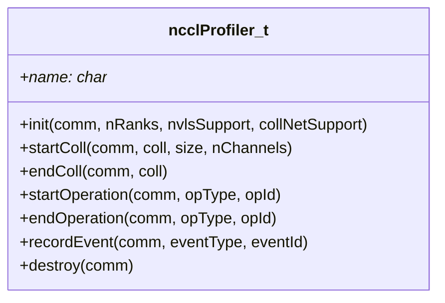
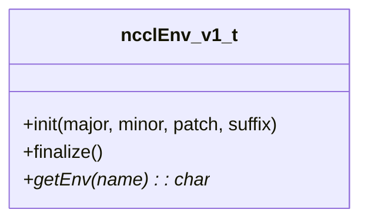
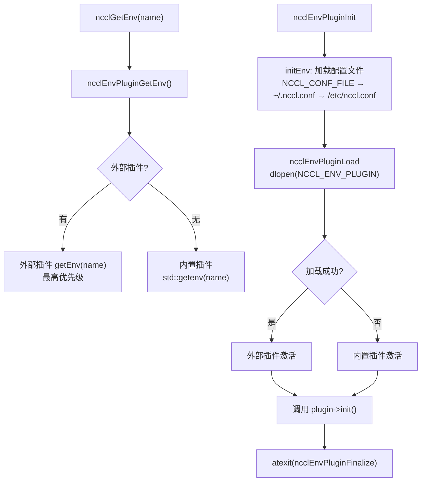
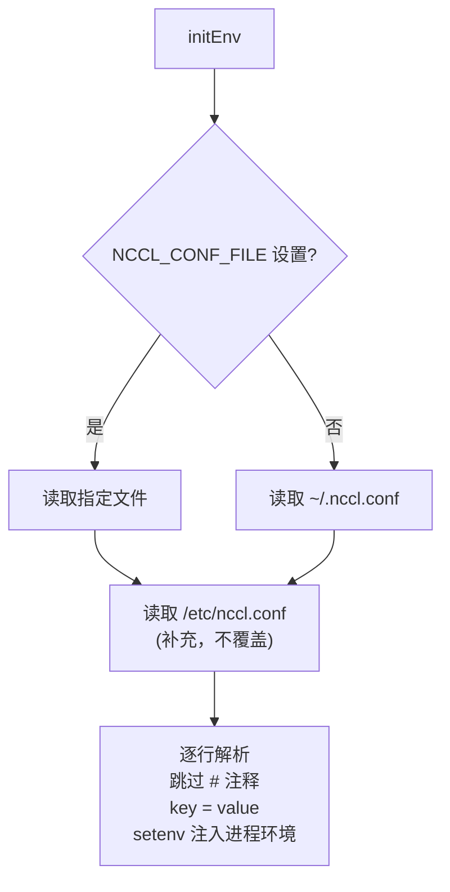

# NCCL 插件系统

NCCL 插件系统允许外部库覆盖或扩展 NCCL 的核心行为，包括网络传输、算法选择、性能分析、环境变量和 GPU 发起网络。

插件系统的设计哲学是"内置可替换"：NCCL 为每类功能提供了高质量的内置实现（如 Socket/IB 网络传输、基于拓扑的自动算法选择），但允许用户通过加载外部 `.so` 库来覆盖默认行为。这使得 NCCL 可以适配非标准硬件（自定义网络设备）、特定工作负载（优化算法选择）或特殊运维需求（性能监控和环境变量管理），而无需修改 NCCL 源码。每个插件类型通过一个 `NCCL_*_PLUGIN` 环境变量指定 `.so` 路径，运行时通过 `dlopen`/`dlsym` 动态加载。

---

## 1. 五种插件类型

NCCL 定义了五种独立的插件类型，每种服务于不同的扩展需求。

| 插件类型 | 环境变量 | 加载时机 | 接口版本 |
|---------|---------|---------|---------|
| Net | `NCCL_NET_PLUGIN` | ncclNetPluginInit | v6-v11 |
| Tuner | `NCCL_TUNER_PLUGIN` | initTransportsRank | v2-v5 |
| Profiler | `NCCL_PROFILER_PLUGIN` | ncclProfilerPluginInit | v1-v6 |
| Env | `NCCL_ENV_PLUGIN` | ncclInitEnv | v1 |
| GIN | `NCCL_GIN_PLUGIN` | ncclGinInit (commAlloc) | v1 |

五种插件类型在 NCCL 初始化的不同阶段加载，且彼此独立——可以同时加载多个类型的插件。Env 插件最先加载（在 `ncclInitEnv` 阶段），因为它可能影响其他所有插件的加载行为（例如通过覆盖 `NCCL_NET_PLUGIN` 来改变要加载的 Net 插件）。Net 和 Tuner 插件在通信器初始化时加载。Profiler 插件也在早期加载以尽早开始收集数据。GIN 插件在 `commAlloc` 阶段加载，因为 GIN 需要与通信器的通道和传输层深度集成。

---

## 2. 插件加载通用流程

所有插件类型共享相同的加载模式：尝试加载外部插件，失败则回退到内置实现。

插件加载的健壮性设计值得注意。`dlopen` 使用 `RTLD_NOW | RTLD_LOCAL` 标志：`RTLD_NOW` 在加载时立即解析所有符号（而不是延迟到使用时），这样可以尽早发现缺少依赖等问题；`RTLD_LOCAL` 使插件的符号不污染全局命名空间，避免不同插件之间的符号冲突。如果 `dlopen` 失败（例如文件不存在或缺少依赖库），NCCL 不会报错，而是静默回退到内置实现——这保证了即使没有安装外部插件，NCCL 也能正常工作。

符号查找使用 `dlsym` 获取插件的 vtable（虚函数表），例如 Net 插件的 `ncclNet_t` 结构。vtable 包含函数指针和元数据（如名称、版本号），NCCL 通过 vtable 调用插件功能。获取 vtable 后，NCCL 调用插件的 `init` 函数进行初始化——这是插件执行一次性设置（如打开设备、分配资源）的机会。初始化成功后，vtable 指针被注册到通信器的共享资源（`sharedRes`）或全局变量中，后续操作通过这些注册的指针调用插件。

如果符号查找失败（例如 `.so` 文件存在但不包含预期的符号名，说明版本不兼容），NCCL 会 `dlclose` 卸载插件并回退到内置实现，同时在日志中记录原因（如果 `NCCL_DEBUG=INFO`）。

---

## 3. Net 插件

Net 插件是最重要和最复杂的插件类型，它允许替换 NCCL 的网络传输层。这在以下场景中至关重要：使用自定义网络硬件（如专用互连）、需要特定的网络优化（如用户态 TCP 栈）、或在虚拟化环境中使用虚拟网络设备。

### 3.1 接口 (ncclNet_t)

`ncclNet_t` 定义了网络传输的完整生命周期。连接建立遵循 listen/connect/accept 三步模式，与 socket API 类似：接收端调用 `listen` 创建监听端点，发送端调用 `connect` 发起连接，接收端再调用 `accept` 完成连接建立。这种异步握手模式使得 NCCL 可以在多个连接之间并行建立。

内存注册是 Net 插件的核心功能。`regMr` 将内存区域注册到 NIC，使其可用于 RDMA 操作；`regMrDmaBuf` 是 DMA-BUF 版本，接受文件描述符而非虚拟地址，适用于 GPU 内存的零拷贝注册。两种注册方式都返回一个 `mhandle`（Memory Handle），在后续的 `isend`/`irecv` 调用中传递，告诉 NIC 数据缓冲区的位置。

数据传输通过 `isend`/`irecv` 发起，`test` 查询完成。这是非阻塞接口——`isend`/`irecv` 立即返回一个 `request` 句柄，调用者在后续的 `test` 调用中轮询完成状态。`iflush` 用于确保 `irecv` 的数据在 CPU 端可见（在某些 IB 配置中，数据可能只到达 NIC 缓存而未写入主机内存）。

### 3.2 版本差异

| 版本 | 新增能力 |
|------|---------|
| v6 | 基础接口 |
| v7 | regMrDmaBuf (DMA-BUF 注册) |
| v8 | 多 recv (irecv 支持多个缓冲区) |
| v9 | pullProxy (拉取式代理) |
| v10 | collNet 支持 |
| v11 | 完整 collNet + GIN 集成 |

Net 插件 API 从 v6 到 v11 经历了多次扩展。v7 新增的 `regMrDmaBuf` 是一个重要的性能优化——它允许 IB 驱动通过 DMA-BUF 文件描述符直接映射 GPU 内存，无需 `nv_peer_mem` 内核模块。v8 的多 recv 支持允许一次 `irecv` 指定多个缓冲区，减少了小消息场景下的函数调用开销。v9 的 `pullProxy` 改变了代理线程的工作方式：传统模式是发送端推送数据，pullProxy 模式允许接收端主动拉取。v10 和 v11 逐步增加了对集合网络（CollNet）和 GIN 的集成支持。

NCCL 通过检查 `ncclNet_t` 结构的大小来判断插件版本——较新版本的接口在结构末尾增加了字段，老版本的插件结构更小。这种向后兼容设计保证了老版本的 Net 插件仍能在新版本 NCCL 中使用。

### 3.3 内置 Net 实现

| 实现 | 文件 | 传输方式 |
|------|------|---------|
| Socket | transport/net_socket.cc | TCP Socket |
| IB | transport/net_ib/ | InfiniBand Verbs |

NCCL 内置了两种网络实现。Socket 实现使用 TCP 协议，是最基本的网络传输——它不需要特殊硬件，但性能受限于 TCP 协议栈的开销和内核上下文切换。IB 实现使用 InfiniBand Verbs API，直接操作 NIC 硬件，提供 RDMA 能力和极低延迟。IB 实现还包含了 GPUDirect RDMA 支持（允许 NIC 直接读写 GPU 内存）和 GIN 集成，是高性能场景的首选。

---

## 4. Tuner 插件

Tuner 插件允许外部逻辑覆盖 NCCL 的自动算法/协议选择，适用于对特定通信模式有深入了解的用户。

### 4.1 接口 (ncclTuner_t)

Tuner 接口只有四个函数，但影响深远。`init` 在通信器创建时调用，传入 rank 数量和硬件能力（NVLS 和 CollNet 支持），使 Tuner 可以一次性评估运行环境。`getCollInfo` 是核心函数——NCCL 在每次集合操作的算法选择阶段调用它，传入操作类型（AllReduce/AllGather/etc.）、数据大小和流水线深度，Tuner 可以修改 `algo`（算法）、`proto`（协议）和 `nChannels`（通道数）三个输出参数来影响算法选择。`destroy` 在通信器销毁时调用，用于清理资源。

### 4.2 工作方式

Tuner 的工作方式是"建议而非命令"。NCCL 首先通过 `updateCollCostTable` 计算所有 (算法, 协议) 组合的代价，这是一个基于拓扑和带宽模型的解析估算。如果有 Tuner 插件，NCCL 调用 `getCollInfo` 让插件有机会修改算法选择。然而，Tuner 的输出不是最终决定——NCCL 仍然会通过 `topoGetAlgoInfo` 验证选择的合法性（例如确保所选算法在当前拓扑下可用），并在 Tuner 的建议不合法时回退。

Tuner 插件可以覆盖 NCCL 的自动算法选择，适用于特定工作负载的优化。例如，一个深度学习训练框架可能知道某些 AllReduce 操作总是以特定大小模式出现，可以基于经验数据为这些模式选择最优算法，而不是依赖 NCCL 的通用代价模型。NCCL 仓库中的 `plugins/tuner/example/` 提供了一个完整的 Tuner 示例实现。

---

## 5. Profiler 插件

Profiler 插件提供集合操作和底层操作的性能分析钩子，用于构建自定义的性能监控和诊断工具。

### 5.1 接口 (ncclProfiler_t)

Profiler 接口提供了两级监控粒度。`startColl`/`endColl` 覆盖用户可见的集合操作（如一次 `ncclAllReduce` 调用），提供了操作类型、数据大小和使用的通道数等信息。`startOperation`/`endOperation` 覆盖更底层的操作（如一次内核启动或一次代理操作），每个操作有唯一的 `opId` 用于匹配 start/end 对。`recordEvent` 允许在任意时间点记录自定义事件，灵活性最高。

### 5.2 钩子点

| 事件 | 时机 |
|------|------|
| startColl | 集合操作开始 |
| endColl | 集合操作结束 |
| startOperation | 内核/代理操作开始 |
| endOperation | 内核/代理操作结束 |
| recordEvent | 自定义事件记录 |

Profiler 钩子被嵌入到 NCCL 的关键路径中。`startColl` 在 `ncclLaunchPrepare` 中调用，`endColl` 在集合操作完成时调用。`startOperation`/`endOperation` 分别在内核启动前和代理操作完成后调用。这些钩子的调用开销极低（通常只是一个函数指针调用），但为外部工具提供了完整的操作生命周期视图。

`plugins/profiler/example/` 中有一个简单的 Profiler 示例，`plugins/profiler/inspector/` 中的 Inspector Profiler 提供了更完整的实现，可以输出详细的操作时间线。

---

## 6. Env 插件

Env 插件是所有插件中最先加载的，因为它影响所有其他 NCCL 参数的读取方式。

### 6.1 接口 (ncclEnv_v1_t)

Env 插件接口极其简洁——只有三个函数。`init` 接收 NCCL 版本号，使插件可以针对不同版本调整行为。`finalize` 在进程退出时调用（通过 `atexit` 注册），用于清理资源。`getEnv` 是核心函数：给定环境变量名（如 `"NCCL_DEBUG"`），返回其值，或返回 `NULL` 表示未设置。

### 6.2 双插件架构

Env 插件采用双插件架构——始终有一个内置插件和一个可选的外部插件同时存在，外部插件优先。

双插件架构的关键在于 `ncclEnvPluginGetEnv` 函数的调度逻辑：它先查询外部插件，如果外部插件返回 `NULL`（表示未设置），再查询内置插件。这意味着外部插件可以覆盖任何环境变量，但不能阻止内置插件提供默认值。

`ncclEnvPluginInit` 的执行顺序很重要：首先调用 `initEnv` 加载配置文件（将配置文件中的键值对通过 `setenv` 注入进程环境），然后尝试加载外部 Env 插件。配置文件先于外部插件加载，这意味着配置文件中的设置可以被外部插件覆盖。无论外部插件是否加载成功，都会调用 `plugin->init()` 并注册 `atexit` 清理函数，确保一致的初始化/清理生命周期。

### 6.3 配置文件解析

配置文件解析使用 `std::call_once` 保证只执行一次，避免多线程重复加载。解析逻辑简单而实用：跳过 `#` 开头的注释行，解析 `key=value` 格式的配置项，然后通过 `ncclOsSetEnv`（底层调用 `setenv`）注入进程环境。由于 `setenv` 不会覆盖已存在的环境变量，所以加载顺序决定了优先级：用户配置文件（`~/.nccl.conf` 或 `NCCL_CONF_FILE`）后加载，其值会覆盖先加载的系统配置文件（`/etc/nccl.conf`）中相同的键。

---

## 7. GIN 插件

参见 [15-gin.md](15-gin.md)。接口定义在 `ncclGin_t` 中，通过 `NCCL_GIN_PLUGIN` 环境变量加载。

GIN 插件与其他插件类型有一个重要区别：它不仅提供独立的 GIN 功能，还与 Net 插件深度集成。内置的 IB Net 插件（`src/transport/net_ib/gin.cc`）实现了 `ncclGin_t` 接口，这意味着 GIN 功能可以作为 Net 插件的一部分提供，而不需要单独的 `.so` 文件。当用户同时指定了自定义 Net 插件和 GIN 插件时，两者独立加载，NCCL 在运行时根据设备能力决定使用哪个后端。

---

## 8. 插件示例

NCCL 仓库内置了多个插件示例，位于 `plugins/` 目录：

| 目录 | 类型 | 说明 |
|------|------|------|
| `plugins/net/` | Net | 网络传输插件模板和示例 |
| `plugins/tuner/example/` | Tuner | Tuner 示例 + 测试 |
| `plugins/tuner/basic/` | Tuner | 基础 Tuner 实现 |
| `plugins/profiler/` | Profiler | Profiler 接口定义 |
| `plugins/profiler/example/` | Profiler | Profiler 示例 |
| `plugins/profiler/inspector/` | Profiler | Inspector Profiler 实现 |
| `plugins/env/` | Env | Env 插件示例 |
| `plugins/mixed/` | Mixed | 混合插件 (同时提供多种类型) |

`plugins/mixed/` 是一个特别有用的参考——它展示了如何在一个 `.so` 中同时导出多种插件类型的符号。这在实际部署中很常见：一个厂商可能希望同时提供自定义网络传输、算法调优和性能监控功能，使用单一 `.so` 简化了分发和版本管理。NCCL 通过为每种插件类型使用不同的导出符号名（如 `ncclNetPlugin_v11`、`ncclTunerPlugin_v5` 等）来避免符号冲突。

---

## 9. 关键源文件

| 文件 | 功能 |
|------|------|
| `src/plugin/net.cc` | Net 插件加载 |
| `src/plugin/tuner.cc` | Tuner 插件加载 |
| `src/plugin/profiler.cc` | Profiler 插件加载 |
| `src/plugin/env.cc` | Env 插件加载和双插件调度 |
| `src/plugin/env/env_v1.cc` | 内置 Env 插件 (getenv) |
| `src/include/plugin/` | 插件接口定义头文件 |
