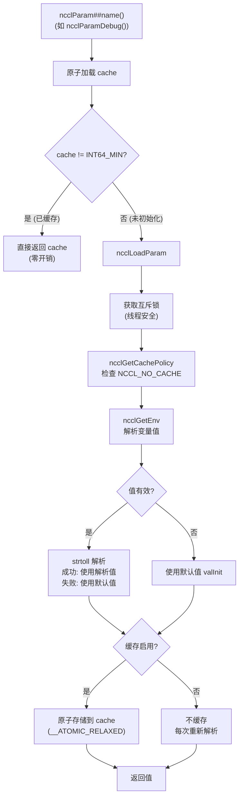
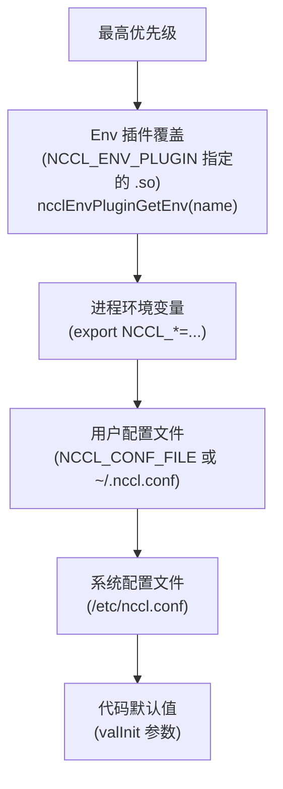

# NCCL 环境变量系统与配置

NCCL 通过 `NCCL_*` 环境变量控制几乎所有运行时行为。环境变量系统支持懒加载、缓存、配置文件和插件覆盖。

---

## 1. NCCL_PARAM 宏机制

### 1.1 宏定义

```c
#define NCCL_PARAM(name, env, val, ...)                          \
  int64_t ncclParam##name() {                                     \
    static int64_t cache = INT64_MIN;                             \
    static int64_t noCache = INT64_MIN;                           \
    int64_t valInit = (int64_t)(val);                             \
    if (__atomic_load_n(&cache, __ATOMIC_RELAXED) != INT64_MIN)  \
      return cache;                                               \
    int64_t v = ncclLoadParam("NCCL_" #env, valInit, ##__VA_ARGS__); \
    return v;                                                     \
  }
```

### 1.2 调用流程



---

## 2. 缓存控制

### 2.1 NCCL_NO_CACHE

| 值 | 效果 |
|-----|------|
| `ALL` | 禁用所有参数缓存 |
| `DEBUG,NET` | 仅禁用 DEBUG 和 NET 参数的缓存 |
| 未设置 | 所有参数正常缓存 |

### 2.2 缓存 vs 不缓存

| 模式 | 首次调用 | 后续调用 | 适用场景 |
|------|---------|---------|---------|
| 缓存 (默认) | 加锁+解析+存储 | 原子加载 (纳秒级) | 绝大多数参数 |
| 不缓存 | 加锁+解析 | 加锁+解析 | 需要运行时动态变化的参数 |

---

## 3. 配置解析优先级



配置文件通过 `setenv` 注入进程环境，因此优先级低于直接 export 的环境变量，但高于代码默认值。

---

## 4. 配置文件格式

```ini
# 注释行 (以 # 开头)
# 格式: key = value

NCCL_DEBUG=INFO
NCCL_DEBUG_SUBSYS=INIT,COLL
NCCL_NET_GDR_LEVEL=5
NCCL_IB_DISABLE=0
NCCL_SOCKET_IFNAME=eth0
```

加载顺序：
1. `/etc/nccl.conf` — 系统级
2. `NCCL_CONF_FILE` 或 `~/.nccl.conf` — 用户级

系统配置先加载，用户配置后加载（可覆盖）。

---

## 5. 关键环境变量分类

### 5.1 调试与日志

| 变量 | 默认值 | 说明 |
|------|--------|------|
| `NCCL_DEBUG` | WARN | 日志级别: VERSION/WARN/INFO/TRACE/ABORT |
| `NCCL_DEBUG_SUBSYS` | — | 日志子系统: INIT/COLL/P2P/SHM/NET/GRAPH/TUNING/ENV/ALLOC/CALL/PROXY/NVLS/BOOTSTRAP/REG/PROFILE/RAS |
| `NCCL_DEBUG_FILE` | — | 日志输出文件路径 |

### 5.2 网络

| 变量 | 默认值 | 说明 |
|------|--------|------|
| `NCCL_NET` | — | 网络插件名称 |
| `NCCL_NET_PLUGIN` | — | 网络插件 .so 路径 |
| `NCCL_SOCKET_IFNAME` | — | Socket 网络接口 |
| `NCCL_IB_DISABLE` | 0 | 禁用 IB |
| `NCCL_IB_HCA` | — | IB HCA 列表 |
| `NCCL_NET_GDR_LEVEL` | — | GPUDirect RDMA 级别 |

### 5.3 拓扑

| 变量 | 默认值 | 说明 |
|------|--------|------|
| `NCCL_TOPO_FILE` | — | 指定 XML 拓扑文件 |
| `NCCL_TOPO_DUMP_FILE` | — | 导出检测到的拓扑 |
| `NCCL_P2P_DISABLE` | 0 | 禁用 P2P 直连 |
| `NCCL_P2P_LEVEL` | — | 覆盖 P2P 路径类型阈值 |
| `NCCL_SHM_DISABLE` | 0 | 禁用 SHM 传输 |

### 5.4 通道与算法

| 变量 | 默认值 | 说明 |
|------|--------|------|
| `NCCL_ALGO` | — | 覆盖算法选择 |
| `NCCL_PROTO` | — | 覆盖协议选择 |
| `NCCL_MIN_NCHANNELS` | 1 | 最小通道数 |
| `NCCL_MAX_NCHANNELS` | — | 最大通道数 |
| `NCCL_MAX_P2P_NCHANNELS` | — | P2P 最大通道数 |
| `NCCL_MAX_CTAS` | — | 最大 CTA 数 |
| `NCCL_MIN_CTAS` | — | 最小 CTA 数 |

### 5.5 代理

| 变量 | 默认值 | 说明 |
|------|--------|------|
| `NCCL_PROXY_THREADS` | — | 代理线程数 |
| `NCCL_NSOCKS_PER_THREAD` | — | 每线程 socket 数 |

### 5.6 插件

| 变量 | 默认值 | 说明 |
|------|--------|------|
| `NCCL_TUNER_PLUGIN` | — | Tuner 插件路径 |
| `NCCL_PROFILER_PLUGIN` | — | Profiler 插件路径 |
| `NCCL_ENV_PLUGIN` | — | Env 插件路径 |
| `NCCL_GIN_PLUGIN` | — | GIN 插件路径 |

### 5.7 高级

| 变量 | 默认值 | 说明 |
|------|--------|------|
| `NCCL_COMM_ID` | — | Root 地址 (ip:port) |
| `NCCL_COMM_BLOCKING` | 1 | 阻塞初始化 |
| `NCCL_BUFFSIZE_REGISTER` | — | 注册缓冲区大小 |
| `NCCL_NO_CACHE` | — | 禁用参数缓存 |
| `NCCL_CROSS_NIC` | 0 | 允许跨 NIC 通道 |
| `NCCL_RUNTIME_CONNECT` | 0 | 运行时连接 (懒连接) |

---

## 6. 关键源文件

| 文件 | 行数 | 功能 |
|------|------|------|
| `src/include/param.h` | ~300 | NCCL_PARAM 宏定义、所有参数声明 |
| `src/misc/param.cc` | ~200 | ncclLoadParam、缓存策略、ncclGetEnv |
| `src/plugin/env.cc` | ~100 | Env 插件加载和双插件调度 |
| `src/plugin/env/env_v1.cc` | ~50 | 内置 Env 插件 (getenv) |
| `src/include/env.h` | ~30 | Env 插件接口 |
