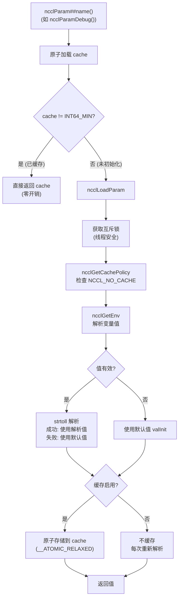
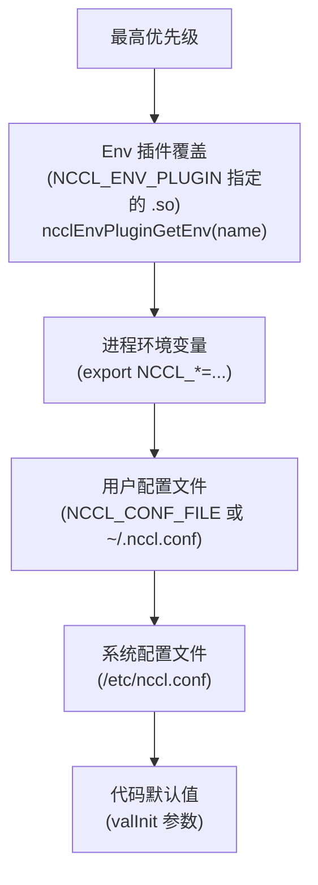

# NCCL 环境变量系统与配置

NCCL 通过 `NCCL_*` 环境变量控制几乎所有运行时行为。环境变量系统支持懒加载、缓存、配置文件和插件覆盖。

NCCL 的环境变量系统远不止简单的 `getenv` 调用——它是一个精心设计的多层系统，需要在以下约束间取得平衡：线程安全（多通信器可能并发读取同一参数）、性能（某些参数在热路径上被频繁读取）、灵活性（支持配置文件和插件覆盖），以及可调试性（需要记录参数来源）。`NCCL_PARAM` 宏是整个系统的核心抽象，它将所有这些需求封装在一个简洁的声明式接口中。

---

## 1. NCCL_PARAM 宏机制

### 1.1 宏定义

```c
#define NCCL_PARAM(name, env, val, ...)                          \
  int64_t ncclParam##name() {                                     \
    static int64_t cache = INT64_MIN;                             \
    static int64_t noCache = INT64_MIN;                           \
    int64_t valInit = (int64_t)(val);                             \
    if (__atomic_load_n(&cache, __ATOMIC_RELAXED) != INT64_MIN)  \
      return cache;                                               \
    int64_t v = ncclLoadParam("NCCL_" #env, valInit, ##__VA_ARGS__); \
    return v;                                                     \
  }
```

`NCCL_PARAM` 宏是 NCCL 参数系统的声明式接口。在 `src/include/param.h` 中，每个参数通过一行宏调用声明，例如 `NCCL_PARAM(Debug, DEBUG, WARN)` 会生成 `ncclParamDebug()` 函数，读取 `NCCL_DEBUG` 环境变量，默认值为 `WARN`。

宏的精妙之处在于其缓存策略。每个生成的函数包含一个 `static int64_t cache` 变量，初始值为 `INT64_MIN`（一个不可能成为有效参数值的哨兵值）。首次调用时 `cache` 等于 `INT64_MIN`，触发完整的环境变量解析流程；解析完成后将结果原子存储到 `cache`，后续调用直接返回缓存值。这个快速路径只需要一个 `__atomic_load_n` 操作——在 x86 上这是一个普通的 MOV 指令，开销接近于零。

`__ATOMIC_RELAXED` 内存序的选择也是有意的：缓存值只需要最终一致性，不需要与其它内存操作建立 happens-before 关系。即使某个线程短暂地读到旧缓存值（在另一个线程刚更新缓存后），也不会导致功能错误——参数值在初始化后通常不会改变，而偶尔多读一次旧值在性能上远好于每次都加锁。

### 1.2 调用流程



当快速路径（缓存命中）未命中时，进入 `ncclLoadParam` 的慢速路径。慢速路径首先获取一个全局互斥锁——这保证了多线程并发初始化时只有一个线程执行解析，其他线程在锁释放后可以直接从 `cache` 读取结果。获取锁后再次检查 `cache`（double-checked locking 模式），如果已被其他线程填充则直接返回。

解析过程调用 `ncclGetEnv`（这是 Env 插件系统的入口），然后通过 `strtoll` 将字符串转换为整数。如果字符串格式无效（`strtoll` 设置了 `errno`），则回退到默认值并在日志中记录警告。解析完成后，根据缓存策略决定是否将结果写入 `cache`。

整个流程的关键设计决策是：慢速路径虽然需要加锁，但它只发生一次（对于缓存参数）——后续所有调用都走快速路径。这使得 NCCL 参数读取在稳态下的开销几乎为零，对集合通信的性能没有任何影响。

---

## 2. 缓存控制

缓存是 NCCL 参数系统的关键性能优化，但在某些场景下需要禁用。

### 2.1 NCCL_NO_CACHE

| 值 | 效果 |
|-----|------|
| `ALL` | 禁用所有参数缓存 |
| `DEBUG,NET` | 仅禁用 DEBUG 和 NET 参数的缓存 |
| 未设置 | 所有参数正常缓存 |

`NCCL_NO_CACHE` 的解析在 `ncclGetEnvNoCacheOnce` 中完成（通过 `std::call_once` 保证只执行一次）。它将逗号分隔的子系统名解析到一个 `unordered_set` 中。`ncclGetCachePolicy` 函数检查当前参数的环境变量名前缀是否在这个集合中——例如 `NCCL_NO_CACHE=DEBUG,NET` 会禁用 `NCCL_DEBUG` 和所有 `NCCL_NET_*` 变量的缓存。

### 2.2 缓存 vs 不缓存

| 模式 | 首次调用 | 后续调用 | 适用场景 |
|------|---------|---------|---------|
| 缓存 (默认) | 加锁+解析+存储 | 原子加载 (纳秒级) | 绝大多数参数 |
| 不缓存 | 加锁+解析 | 加锁+解析 | 需要运行时动态变化的参数 |

绝大多数 NCCL 参数在初始化后不会改变，缓存是安全的且性能最优。但少数参数需要动态响应环境变化——例如 `NCCL_DEBUG` 可能被信号处理器临时修改以诊断问题，此时不缓存确保每次读取都能看到最新值。禁用缓存的代价是每次读取都需要加锁和字符串解析，但这对性能的影响可以忽略不计，因为不缓存的参数很少在热路径上被频繁读取。

---

## 3. 配置解析优先级

NCCL 的配置系统有五层优先级，从高到低依次为：



优先级的设计意图是给不同角色不同层级的控制权。系统管理员通过 `/etc/nccl.conf` 设置集群级默认值（例如所有作业使用特定的 IB HCA），普通用户通过 `~/.nccl.conf` 或环境变量覆盖不适合自己的默认值（例如调试时提高日志级别），而 Env 插件提供了编程化的最高优先级覆盖——适用于作业调度系统在启动时注入特定配置的场景。

配置文件通过 `setenv` 注入进程环境，因此优先级低于直接 export 的环境变量，但高于代码默认值。这是因为 `setenv` 不覆盖已存在的环境变量——如果一个变量已经在进程环境中（通过 `export` 设置），`setenv` 调用不会改变它。这种"先设置者赢"的语义自然地实现了优先级。

---

## 4. 配置文件格式

```ini
# 注释行 (以 # 开头)
# 格式: key = value

NCCL_DEBUG=INFO
NCCL_DEBUG_SUBSYS=INIT,COLL
NCCL_NET_GDR_LEVEL=5
NCCL_IB_DISABLE=0
NCCL_SOCKET_IFNAME=eth0
```

配置文件格式极其简单——每行一个 `key=value` 对，`#` 开头的行是注释，空行被忽略。这种设计是有意的：NCCL 配置通常只有寥寥几行，不需要复杂的节（section）或继承机制。

加载顺序：
1. `/etc/nccl.conf` — 系统级
2. `NCCL_CONF_FILE` 或 `~/.nccl.conf` — 用户级

系统配置先加载，用户配置后加载（可覆盖）。加载逻辑在 `initEnvFunc` 中实现，使用 `std::call_once` 保证只执行一次。文件解析通过 `setEnvFile` 函数逐行处理：跳过注释行，解析 `key=value` 格式，然后调用 `ncclOsSetEnv`（底层 `setenv`）注入进程环境。`setenv` 的不覆盖语义确保了后加载的用户配置可以覆盖系统配置中相同的键，但不会覆盖已通过 `export` 设置的环境变量。

---

## 5. 关键环境变量分类

### 5.1 调试与日志

| 变量 | 默认值 | 说明 |
|------|--------|------|
| `NCCL_DEBUG` | WARN | 日志级别: VERSION/WARN/INFO/TRACE/ABORT |
| `NCCL_DEBUG_SUBSYS` | — | 日志子系统: INIT/COLL/P2P/SHM/NET/GRAPH/TUNING/ENV/ALLOC/CALL/PROXY/NVLS/BOOTSTRAP/REG/PROFILE/RAS |
| `NCCL_DEBUG_FILE` | — | 日志输出文件路径 |

调试变量是排查 NCCL 问题的第一工具。`NCCL_DEBUG=TRACE` 会记录每个操作的详细时间线，包括内核启动、代理操作、通道使用等，但会产生大量输出（可能影响性能）。`NCCL_DEBUG_SUBSYS` 允许精细控制只记录特定子系统的日志——例如 `NCCL_DEBUG_SUBSYS=NET` 只记录网络相关操作，大幅减少日志量。`NCCL_DEBUG_FILE` 将日志输出到文件而非 stderr，在多 rank 场景下特别有用（避免日志交错），NCCL 会自动在文件名中添加 rank ID 后缀。

### 5.2 网络

| 变量 | 默认值 | 说明 |
|------|--------|------|
| `NCCL_NET` | — | 网络插件名称 |
| `NCCL_NET_PLUGIN` | — | 网络插件 .so 路径 |
| `NCCL_SOCKET_IFNAME` | — | Socket 网络接口 |
| `NCCL_IB_DISABLE` | 0 | 禁用 IB |
| `NCCL_IB_HCA` | — | IB HCA 列表 |
| `NCCL_NET_GDR_LEVEL` | — | GPUDirect RDMA 级别 |

网络变量控制 NCCL 如何使用网络硬件。`NCCL_IB_DISABLE=1` 强制使用 Socket 传输（用于在 IB 环境中排查问题）。`NCCL_IB_HCA` 指定使用哪些 IB 设备，格式为 `mlx5_0:1,mlx5_1:1`（设备名:端口），在多网卡系统中用于避免使用错误的网卡。`NCCL_NET_GDR_LEVEL` 控制 GPUDirect RDMA 的使用策略，从 0（禁用）到 5（强制使用），影响 NIC 是否直接读写 GPU 内存。

### 5.3 拓扑

| 变量 | 默认值 | 说明 |
|------|--------|------|
| `NCCL_TOPO_FILE` | — | 指定 XML 拓扑文件 |
| `NCCL_TOPO_DUMP_FILE` | — | 导出检测到的拓扑 |
| `NCCL_P2P_DISABLE` | 0 | 禁用 P2P 直连 |
| `NCCL_P2P_LEVEL` | — | 覆盖 P2P 路径类型阈值 |
| `NCCL_SHM_DISABLE` | 0 | 禁用 SHM 传输 |

拓扑变量影响 NCCL 如何发现和利用硬件拓扑。`NCCL_TOPO_FILE` 允许提供预计算的拓扑文件，跳过运行时的拓扑发现（在某些系统上拓扑发现可能耗时数十秒）。`NCCL_P2P_DISABLE=1` 禁用 NVLink/PCIe P2P 传输，强制所有同节点通信走 SHM——这在 P2P 访问不稳定时是必要的回退。`NCCL_SHM_DISABLE=1` 则禁用共享内存传输，强制同节点 GPU 间也走 P2P 或网络路径。

### 5.4 通道与算法

| 变量 | 默认值 | 说明 |
|------|--------|------|
| `NCCL_ALGO` | — | 覆盖算法选择 |
| `NCCL_PROTO` | — | 覆盖协议选择 |
| `NCCL_MIN_NCHANNELS` | 1 | 最小通道数 |
| `NCCL_MAX_NCHANNELS` | — | 最大通道数 |
| `NCCL_MAX_P2P_NCHANNELS` | — | P2P 最大通道数 |
| `NCCL_MAX_CTAS` | — | 最大 CTA 数 |
| `NCCL_MIN_CTAS` | — | 最小 CTA 数 |

通道和算法变量提供了对 NCCL 核心通信策略的精细控制。`NCCL_ALGO=Ring` 或 `NCCL_ALGO=Tree` 强制使用特定算法，覆盖 NCCL 的自动选择——这在调试或已知最优算法的场景中有用。`NCCL_MAX_NCHANNELS` 限制并发通道数，在带宽不是瓶颈但延迟更重要时可以降低通道数以减少资源占用。CTA（Cooperative Thread Array，即 CUDA 线程块）数控制每个通道的 GPU 线程并行度——更多 CTA 提供更好的带宽但占用更多 GPU 资源。

### 5.5 代理

| 变量 | 默认值 | 说明 |
|------|--------|------|
| `NCCL_PROXY_THREADS` | — | 代理线程数 |
| `NCCL_NSOCKS_PER_THREAD` | — | 每线程 socket 数 |

代理变量控制 NCCL 的 CPU 端进度线程行为。代理线程负责推进网络传输（特别是发送端的代理操作），线程数影响 CPU 端的并行度。在 CPU 资源紧张的场景下，减少代理线程数可以降低 CPU 开销，但可能影响网络传输的及时性。

### 5.6 插件

| 变量 | 默认值 | 说明 |
|------|--------|------|
| `NCCL_TUNER_PLUGIN` | — | Tuner 插件路径 |
| `NCCL_PROFILER_PLUGIN` | — | Profiler 插件路径 |
| `NCCL_ENV_PLUGIN` | — | Env 插件路径 |
| `NCCL_GIN_PLUGIN` | — | GIN 插件路径 |

### 5.7 高级

| 变量 | 默认值 | 说明 |
|------|--------|------|
| `NCCL_COMM_ID` | — | Root 地址 (ip:port) |
| `NCCL_COMM_BLOCKING` | 1 | 阻塞初始化 |
| `NCCL_BUFFSIZE_REGISTER` | — | 注册缓冲区大小 |
| `NCCL_NO_CACHE` | — | 禁用参数缓存 |
| `NCCL_CROSS_NIC` | 0 | 允许跨 NIC 通道 |
| `NCCL_RUNTIME_CONNECT` | 0 | 运行时连接 (懒连接) |

高级变量提供了额外的调优能力。`NCCL_CROSS_NIC=1` 允许通道使用不同的 NIC，在多网卡环境中提高带宽利用率，但可能增加乱序到达的风险。`NCCL_RUNTIME_CONNECT=1` 启用懒连接模式——不在初始化时建立所有连接，而是在首次使用时按需建立，这可以显著减少初始化时间，特别是大规模部署时。

---

## 6. 关键源文件

| 文件 | 行数 | 功能 |
|------|------|------|
| `src/include/param.h` | ~300 | NCCL_PARAM 宏定义、所有参数声明 |
| `src/misc/param.cc` | ~200 | ncclLoadParam、缓存策略、ncclGetEnv |
| `src/plugin/env.cc` | ~100 | Env 插件加载和双插件调度 |
| `src/plugin/env/env_v1.cc` | ~50 | 内置 Env 插件 (getenv) |
| `src/include/env.h` | ~30 | Env 插件接口 |

`src/include/param.h` 是整个参数系统的中心——它不仅定义了 `NCCL_PARAM` 宏，还包含了所有 NCCL 参数的声明。每个参数一行宏调用，参数名、环境变量名和默认值一目了然。这种声明式设计使得添加新参数只需一行代码，而所有缓存、线程安全、解析逻辑都由宏自动处理。
