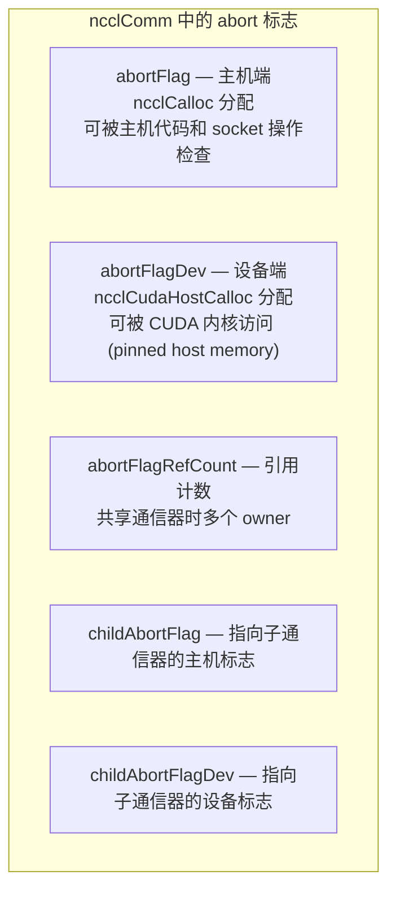
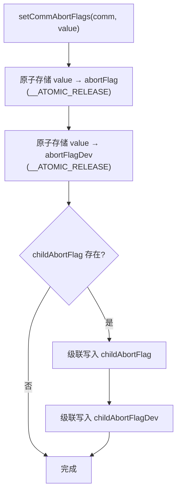
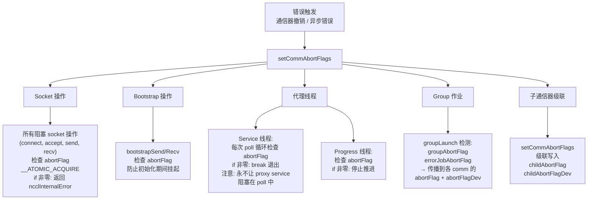
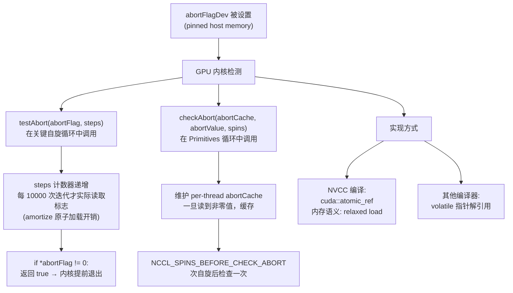
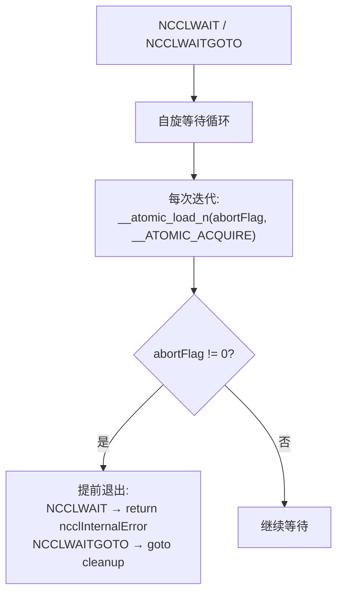
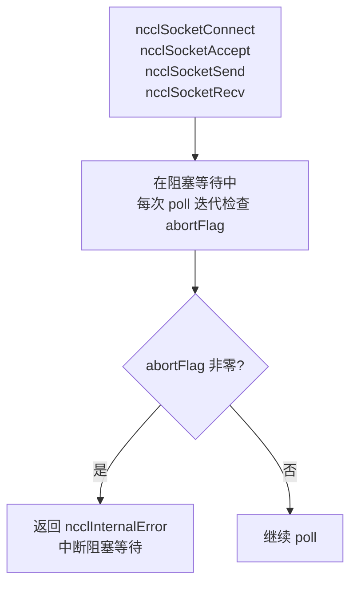
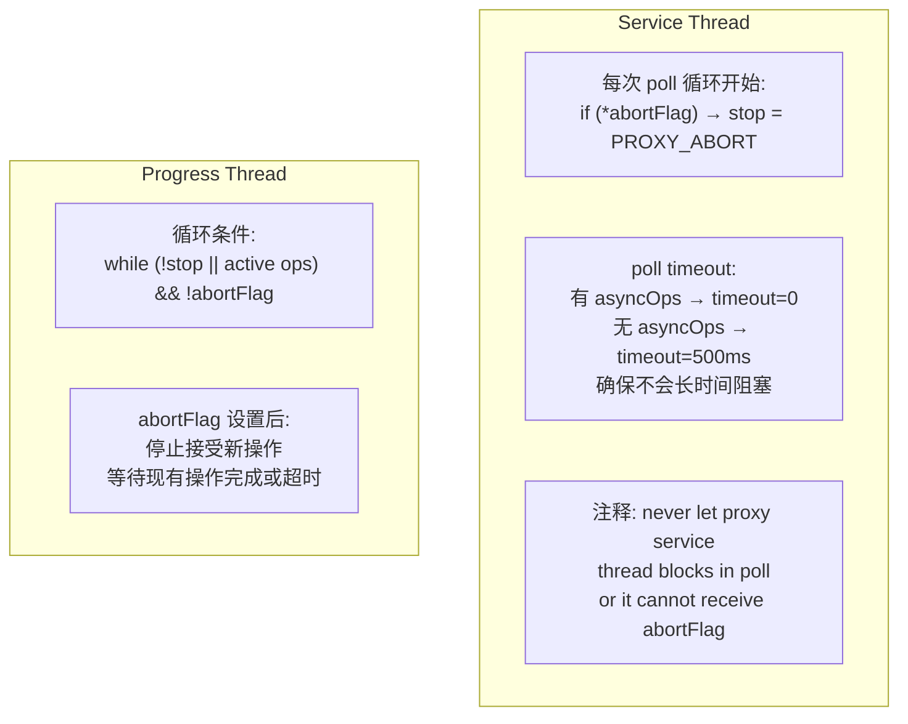
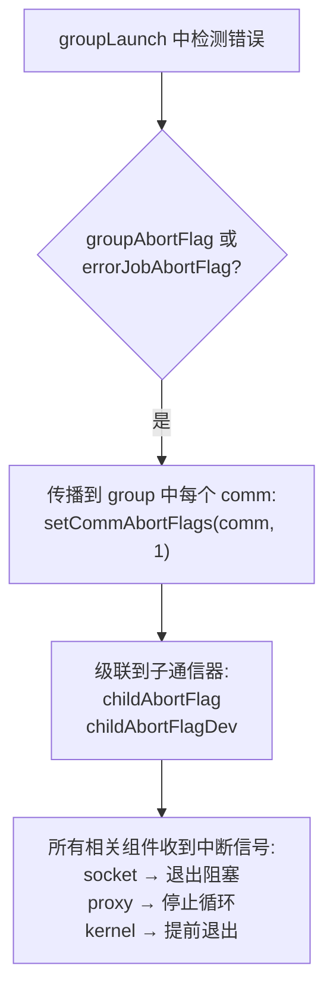
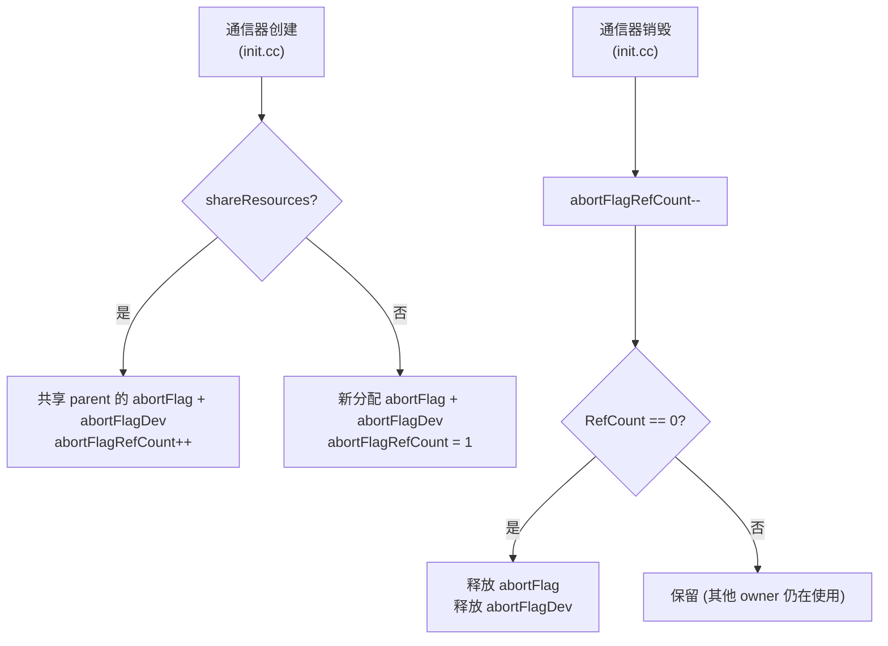
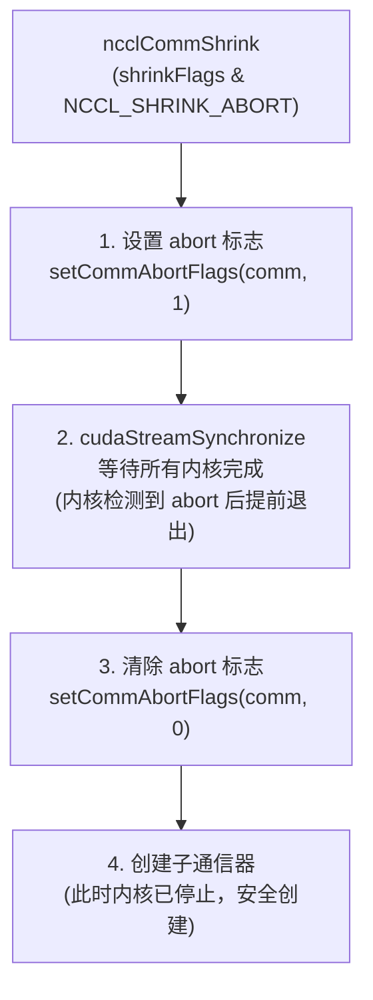

# NCCL 错误处理与中断机制

NCCL 通过双 abort 标志（主机端 + 设备端）实现多层次的中断传播，确保通信器出错时各组件（socket、代理线程、GPU 内核）都能及时退出，避免死锁。

---

## 1. 双 Abort 标志架构

### 1.1 标志位置

### 1.2 标志设置

---

## 2. 中断传播路径

### 2.1 主机端传播

### 2.2 设备端传播

---

## 3. NCCLWAIT 宏

用于主机端阻塞等待中检查 abort：

---

## 4. Socket 集成

所有 socket 操作（connect、accept、send、recv）都存储 `abortFlag` 指针：

同样适用于 IPC socket (`ipcsocket.h`, `ipcsocket.cc`)。

---

## 5. 代理线程 Abort 集成

---

## 6. Group Abort 传播

---

## 7. Abort 标志的引用计数

---

## 8. Shrink Abort 模式中的 Abort 使用

这防止了 Shrink 操作期间的死锁：如果内核仍在运行且持有资源，直接创建子通信器可能导致资源竞争。

---

## 9. 关键源文件

| 文件 | 功能 |
|------|------|
| `src/include/comm.h` | abortFlag/abortFlagDev/childAbortFlag 字段 |
| `src/init.cc` | setCommAbortFlags、引用计数、Shrink abort |
| `src/group.cc` | Group abort 传播 |
| `src/proxy.cc` | 代理线程 abort 检查 |
| `src/misc/socket.cc` | Socket abort 检查 |
| `src/include/nccl_device/utility.h` | 设备端 testAbort |
| `src/device/primitives.h` | 设备端 checkAbort |
| `src/include/checks.h` | NCCLWAIT/NCCLWAITGOTO 宏 |
