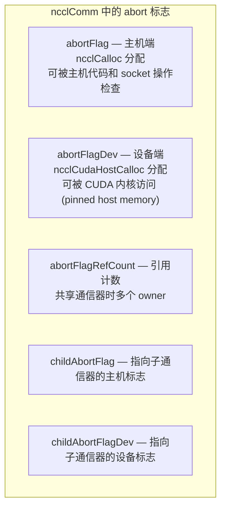
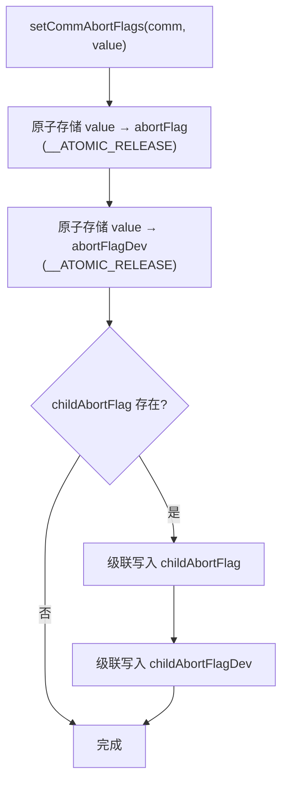
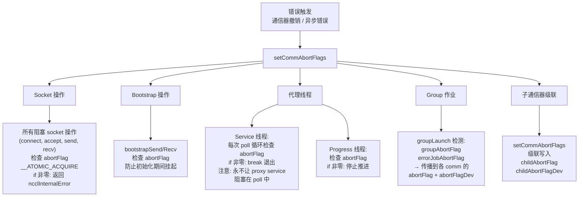
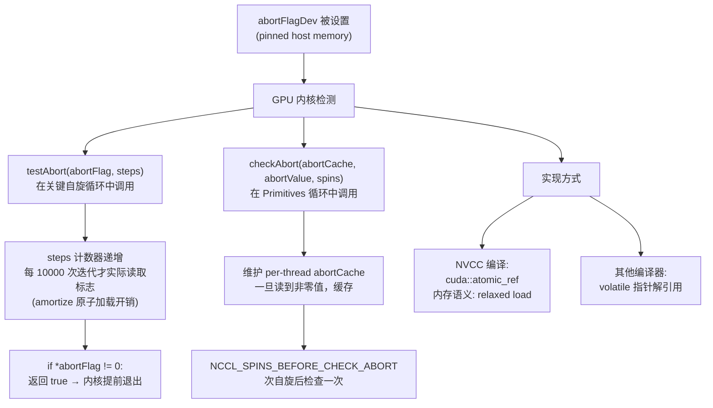
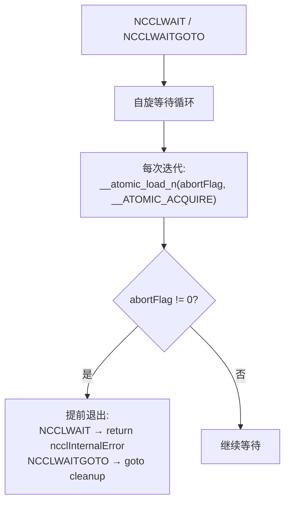
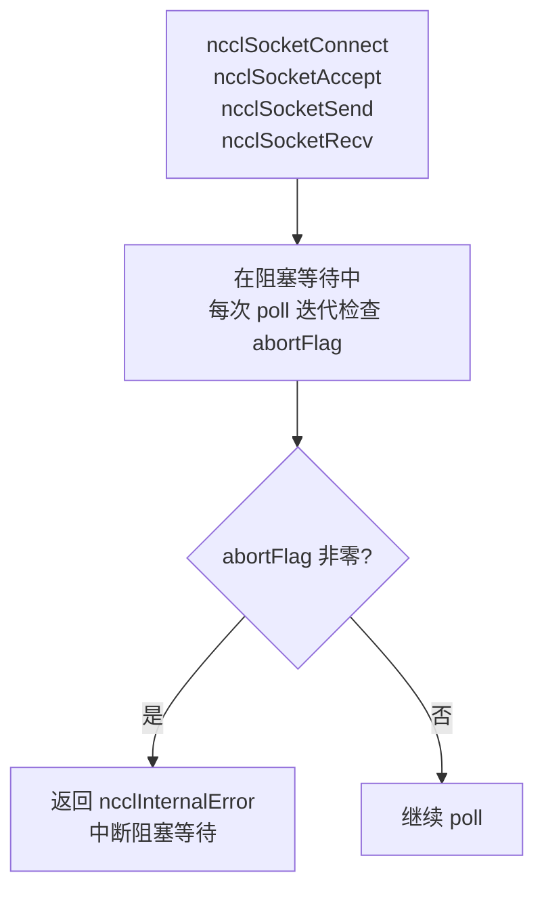
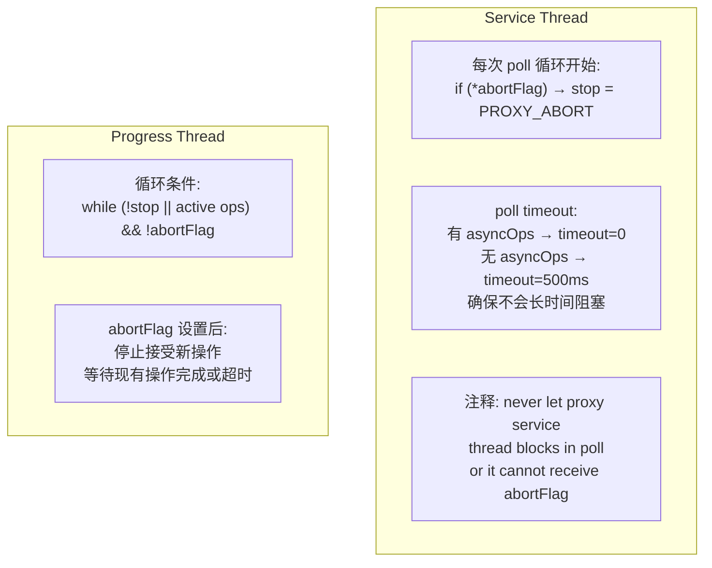
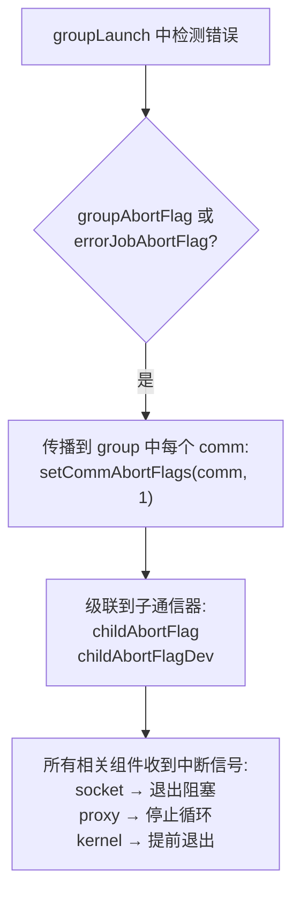
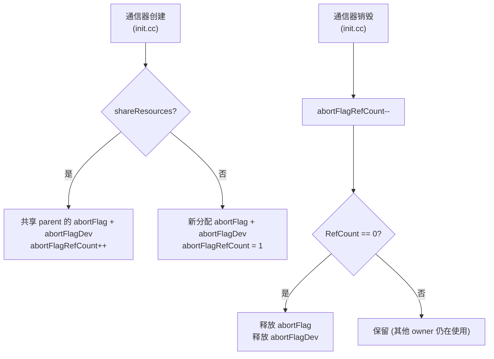
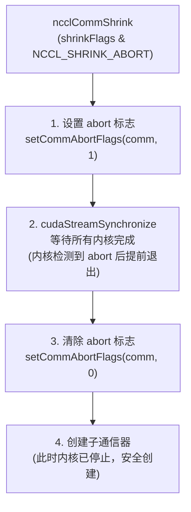

# NCCL 错误处理与中断机制

NCCL 通过双 abort 标志（主机端 + 设备端）实现多层次的中断传播，确保通信器出错时各组件（socket、代理线程、GPU 内核）都能及时退出，避免死锁。

NCCL 的分布式特性使得错误处理尤为困难：一个 rank 上的错误（如 NIC 故障）可能导致其他 rank 的集合操作永远等待，形成全局死锁。NCCL 的 abort 机制就是为了解决这个问题——当任何组件检测到错误时，它设置 abort 标志，这个标志通过主机端和设备端两条路径传播到所有相关组件，使它们都能及时退出等待状态。这种"设置标志 + 主动轮询"的模式避免了信号/中断的复杂性，同时保证了在微秒级延迟内所有组件都能响应错误。

---

## 1. 双 Abort 标志架构

### 1.1 标志位置

NCCL 使用两个独立的 abort 标志，分别服务于主机端和设备端组件。

为什么需要两个标志而不是一个？这是因为 CPU 和 GPU 的内存访问模型不同。`abortFlag` 是普通的主机内存，CPU 可以通过标准原子操作快速读取，但对 GPU 来说访问主机内存非常慢（需要 PCIe 事务）。`abortFlagDev` 是通过 `ncclCudaHostCalloc` 分配的 pinned host memory，GPU 可以通过 PCIe 直接访问——虽然比访问 GPU 本地内存慢，但远比让 GPU 发起主机函数调用快。两个标志指向不同的内存位置，但在 `setCommAbortFlags` 中始终同步写入，保证一致性。

`childAbortFlag` 和 `childAbortFlagDev` 是指向子通信器 abort 标志的指针，支持级联传播。当父通信器（用户级 `ncclComm_t`）设置 abort 时，需要同时通知所有内部子通信器（per-device 子通信器），因为子通信器的组件（代理线程、内核）可能正在独立运行。这种指针间接设计避免了在父通信器中维护子通信器列表——子通信器在创建时将自己的 abort 标志地址写入父通信器的 `childAbortFlag` 指针。

`abortFlagRefCount` 管理标志的生命周期。当多个通信器共享资源（`shareResources` 模式）时，它们共享同一个 abort 标志，引用计数跟踪有多少个用户。只有当引用计数降为零时才释放标志内存，防止某个通信器销毁时释放仍在使用的标志。

### 1.2 标志设置

`setCommAbortFlags` 使用 `__ATOMIC_RELEASE` 内存序写入两个标志。Release 语义确保所有在写入之前的内存操作（例如设置错误码、更新状态）对读取 abort 标志的线程可见——当 CPU 端代码看到 abort 标志非零时，它可以安全地读取之前写入的错误信息，不会看到过期的数据。这是 release-acquire 同步模式的标准应用。

写入顺序是先主机端后设备端，保证 CPU 端组件先收到通知（CPU 端的响应速度通常更重要，因为 CPU 组件负责网络操作和资源管理）。如果存在子通信器，则继续级联写入——这确保了一个通信器的错误能传播到所有相关的子通信器，避免部分组件仍在运行而其他已停止的不一致状态。

---

## 2. 中断传播路径

### 2.1 主机端传播

主机端的 abort 传播覆盖了所有可能阻塞的组件，确保没有任何组件会永久等待。

Socket 操作的 abort 检查是最关键的传播路径。在 NCCL 初始化期间，大量的 socket 连接建立操作（bootstrap rendezvous、transport connection）可能阻塞数十秒。如果对端 rank 崩溃，本地 socket 操作会永远阻塞。NCCL 在所有 socket 操作的 poll 循环中检查 `abortFlag`——每次 `poll` 超时后（通常 500ms），检查 abort 标志是否被设置，如果是则立即返回 `ncclInternalError`。`__ATOMIC_ACQUIRE` 读取确保能看到 `setCommAbortFlags` 中的 RELEASE 写入所保护的所有之前的内存操作。

Bootstrap 操作的 abort 检查防止初始化期间的死锁。Bootstrap 是 NCCL 初始化最脆弱的阶段——所有 rank 必须互相 rendezvous，任何一个 rank 的缺席都会导致其他 rank 永久等待。abort 标志允许一个 rank 在检测到自己无法继续时（例如 CUDA 错误）通知本地所有 bootstrap 操作退出。

代理线程的 abort 集成需要特别注意。Service 线程（处理新连接和异步操作）在每次 poll 循环开始时检查 abort 标志，但关键是 poll 的 timeout 设置：有 `asyncOps` 时 timeout=0（非阻塞），无 `asyncOps` 时 timeout=500ms。这保证了即使没有活跃操作，Service 线程也不会长时间阻塞在 poll 中，能够在 500ms 内响应 abort。代码中的注释"never let proxy service thread blocks in poll or it cannot receive abortFlag"精确地描述了这个设计意图。

Group 作业的 abort 传播处理了一个特殊场景：在一个 `ncclGroupStart`/`ncclGroupEnd` 块中，多个通信器可能同时发起操作。如果其中任何一个操作失败，`groupAbortFlag` 或 `errorJobAbortFlag` 被设置，`groupLaunch` 函数检测到后将其传播到组内所有通信器的 abort 标志——这确保了组内所有操作都能被取消，避免部分完成的不一致状态。

### 2.2 设备端传播

设备端的 abort 传播让 GPU 内核能够及时退出自旋等待，避免浪费 GPU 资源和阻塞后续操作。

设备端的 abort 检查面临一个独特的挑战：从 GPU 读取 pinned host 内存比读取 GPU 本地内存慢得多（需要跨越 PCIe 总线），而 abort 检查嵌入在集合通信的最内层循环中——如果每次迭代都检查 abort 标志，会显著降低正常路径的性能。NCCL 通过两种策略来 amortize 这个开销：

`testAbort` 函数使用 `steps` 计数器——每次调用递增计数器，只有当计数器是 10000 的倍数时才实际读取 abort 标志。这意味着在正常情况下，abort 检查的开销被分摊到了 10000 次循环迭代中。虽然这增加了 abort 响应延迟（最多 10000 次迭代），但在集合通信的典型循环中，10000 次迭代通常只需要数十微秒，延迟是可接受的。

`checkAbort` 函数在 Primitives 层使用，它维护一个 per-thread 的 `abortCache`。一旦读到非零值（abort 触发），缓存该值——后续调用直接返回缓存的非零值而不再读取标志内存。这避免了 abort 后的冗余内存访问。`NCCL_SPINS_BEFORE_CHECK_ABORT` 定义了两次 abort 检查之间的自旋次数，与 `testAbort` 的分摊策略类似。

两种实现方式反映了 CUDA 编程的兼容性需求：NVCC 编译器支持 `cuda::atomic_ref`（C++ 标准原子操作的 CUDA 扩展），提供类型安全的原子加载；其他编译器（如 GCC，在某些跨平台编译场景中使用）回退到 `volatile` 指针解引用——虽然不是严格意义上的原子操作，但在 x86/ARM 上对对齐的 32 位整数读取天然是原子的。

---

## 3. NCCLWAIT 宏

用于主机端阻塞等待中检查 abort：

NCCLWAIT 宏用于主机端的自旋等待场景——例如等待 GPU 内核完成、等待代理操作返回等。与 socket 操作的 poll 模式不同，NCCLWAIT 是紧凑的自旋循环，每次迭代都检查 abort 标志。这是因为自旋循环本身开销极低（没有系统调用），额外的原子读取开销可以接受。

两个变体 `NCCLWAIT` 和 `NCCLWAITGOTO` 提供不同的退出语义：`NCCLWAIT` 直接 `return ncclInternalError`，适用于简单函数；`NCCLWAITGOTO` 执行 `goto cleanup`，适用于需要在退出前释放资源的复杂函数。这种区分避免了在简单场景中引入不必要的 cleanup 逻辑。

---

## 4. Socket 集成

所有 socket 操作（connect、accept、send、recv）都存储 `abortFlag` 指针：

Socket 是 NCCL 中最容易导致长时间阻塞的组件——网络延迟、对端故障、路由问题都可能导致 connect/accept 操作阻塞数十秒甚至更久。NCCL 在所有 socket 操作中使用非阻塞模式 + `poll` 轮询，在每次 poll 超时后检查 abort 标志。Poll 的超时时间设为 500ms，这是响应延迟和 CPU 开销之间的折衷——更短的超时降低延迟但增加 CPU 使用率（更多 poll 系统调用），更长的超时则反之。

同样适用于 IPC socket (`ipcsocket.h`, `ipcsocket.cc`)。IPC socket 用于同节点进程间通信（例如与 RAS daemon 通信），虽然本地通信的阻塞风险较低，但统一的 abort 检查确保了一致的行为。

---

## 5. 代理线程 Abort 集成

代理线程的 abort 集成需要区分两种线程角色。Service 线程负责接受新连接和处理连接管理事件，它在每次 poll 循环开始时检查 abort 标志。关键设计决策是 poll 的 timeout 设置：有异步操作时 timeout=0（非阻塞），无异步操作时 timeout=500ms。这保证了即使没有活跃操作，Service 线程也最多在 500ms 内响应 abort。如果 timeout 设置为 -1（无限等待），Service 线程将在 poll 中永久阻塞，无法响应 abort——这是一个会导致整个通信器死锁的严重 bug，代码注释特意强调了这一点。

Progress 线程负责推进数据传输操作，它的循环条件包含 abort 检查：`while (!stop || active ops) && !abortFlag`。当 abort 标志被设置后，Progress 线程停止接受新操作，但仍会等待现有操作完成——这是为了避免在 RDMA 操作中途退出导致远端状态不一致。然而，如果远端也设置了 abort（因为对端 rank 也在退出），远端的操作会很快完成或失败，Progress 线程不会等待太久。

---

## 6. Group Abort 传播

Group abort 处理了一个微妙的并发问题。在 `ncclGroupStart`/`ncclGroupEnd` 块中，用户可能在多个通信器上同时发起操作，这些操作在 `groupLaunch` 中批量提交。如果其中任何一个操作失败，`groupAbortFlag`（组级标志）或 `errorJobAbortFlag`（错误作业标志）被设置，`groupLaunch` 遍历组内所有通信器，对每个通信器调用 `setCommAbortFlags(comm, 1)`。

这种全组传播是必要的，因为集合操作要求所有 rank 参与——一个 rank 的失败意味着所有 rank 的操作都无法完成。如果不传播 abort，其他通信器的内核将永远在等待失败 rank 的数据，形成 GPU 端死锁。通过传播 abort，所有通信器的内核都能在微秒级内退出，GPU 资源可以被释放用于错误恢复或作业重启。

---

## 7. Abort 标志的引用计数

引用计数机制处理了 `shareResources` 场景下的 abort 标志生命周期。当使用 `ncclCommSplit` 或 `ncclCommFinalize` 创建子通信器时，子通信器可以共享父通信器的资源（包括 abort 标志），此时 `abortFlagRefCount` 递增。只有当最后一个共享者销毁时（`RefCount` 降为零），abort 标志内存才被释放。

这种设计防止了一个常见的 use-after-free bug：如果子通信器先于父通信器销毁并释放了 abort 标志，父通信器的代理线程可能在后续的 abort 检查中访问已释放的内存。引用计数确保内存的生命周期覆盖所有使用者的生命周期。

---

## 8. Shrink Abort 模式中的 Abort 使用

Shrink 操作中的 abort 使用展示了一个有趣的模式：**临时设置然后清除 abort 标志**。这在其他场景中是不安全的（因为某些组件可能已经因为 abort 而退出了关键循环），但在 Shrink 场景下是安全的，因为 Shrink 操作在设置 abort 后立即同步等待所有内核完成（`cudaStreamSynchronize`），确保没有内核仍在运行。

这防止了 Shrink 操作期间的死锁：如果内核仍在运行且持有资源，直接创建子通信器可能导致资源竞争。

Shrink 的四步流程——设置 abort → 等待完成 → 清除 abort → 创建子通信器——本质上是一个"优雅停机 + 重启"模式。设置 abort 使内核提前退出自旋循环（否则它们会永远等待其他 rank 的数据），`cudaStreamSynchronize` 确保内核确实已停止，清除 abort 为后续的子通信器操作恢复干净状态，最后创建子通信器在安全的环境中重新开始通信。

---

## 9. 关键源文件

| 文件 | 功能 |
|------|------|
| `src/include/comm.h` | abortFlag/abortFlagDev/childAbortFlag 字段 |
| `src/init.cc` | setCommAbortFlags、引用计数、Shrink abort |
| `src/group.cc` | Group abort 传播 |
| `src/proxy.cc` | 代理线程 abort 检查 |
| `src/misc/socket.cc` | Socket abort 检查 |
| `src/include/nccl_device/utility.h` | 设备端 testAbort |
| `src/device/primitives.h` | 设备端 checkAbort |
| `src/include/checks.h` | NCCLWAIT/NCCLWAITGOTO 宏 |
