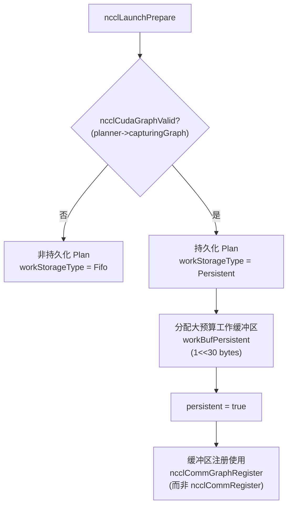
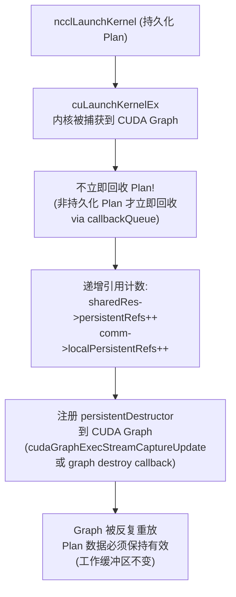
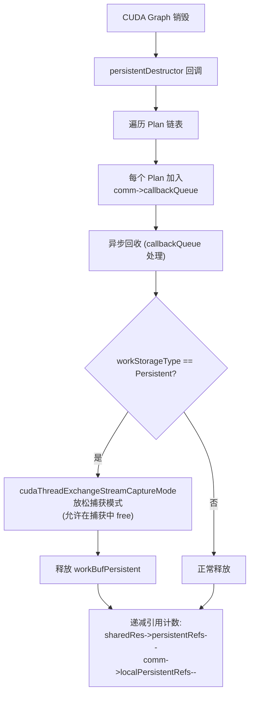
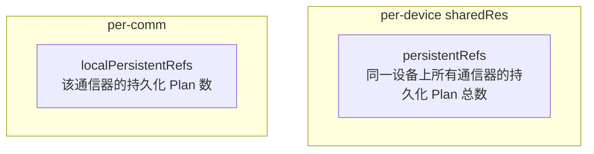
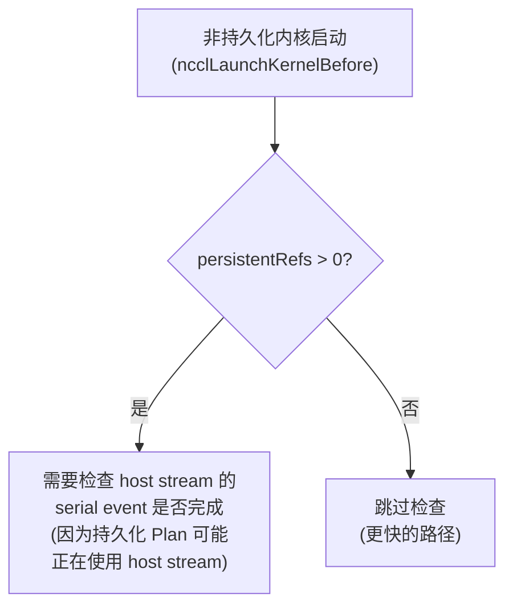
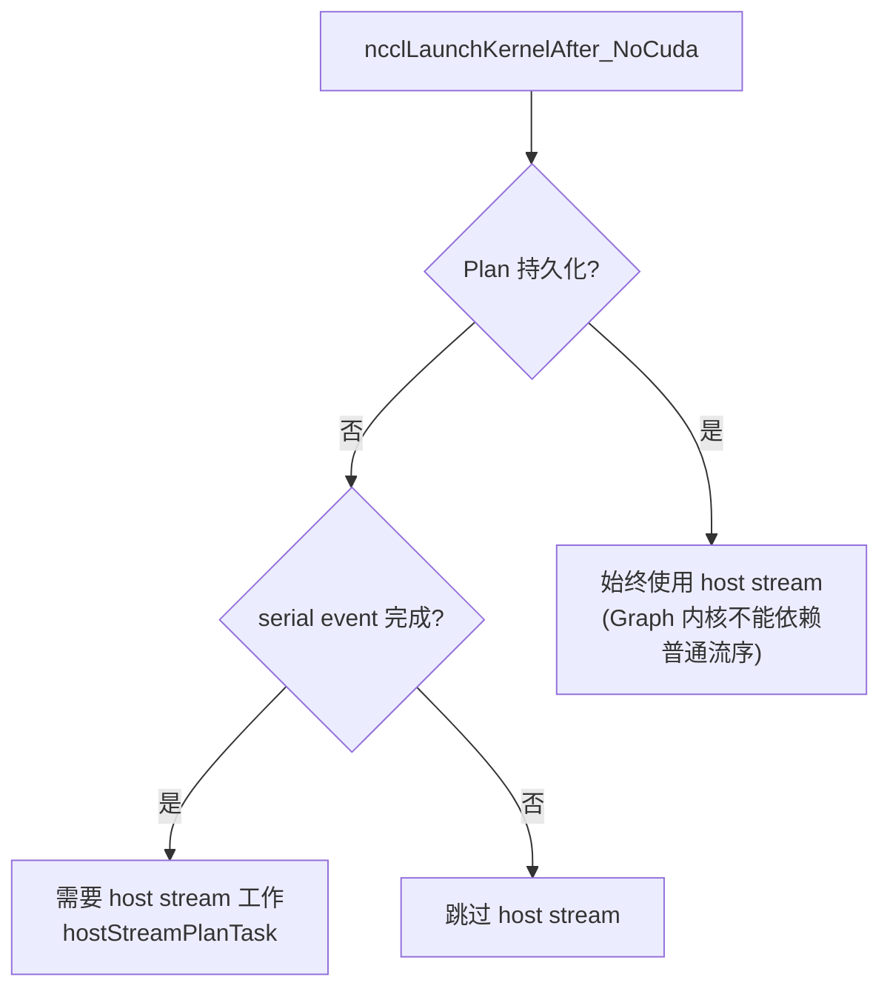
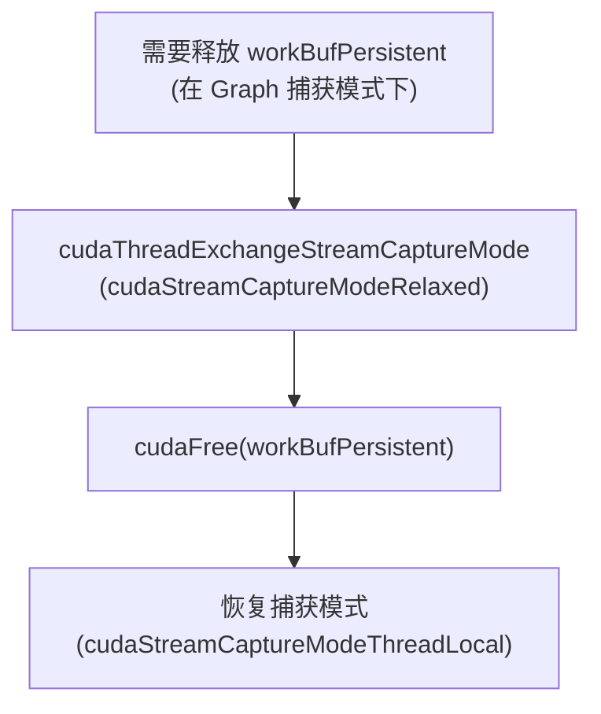
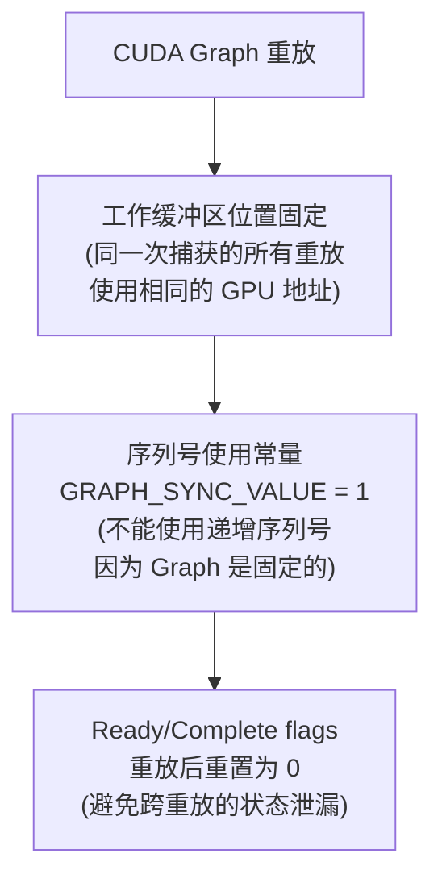
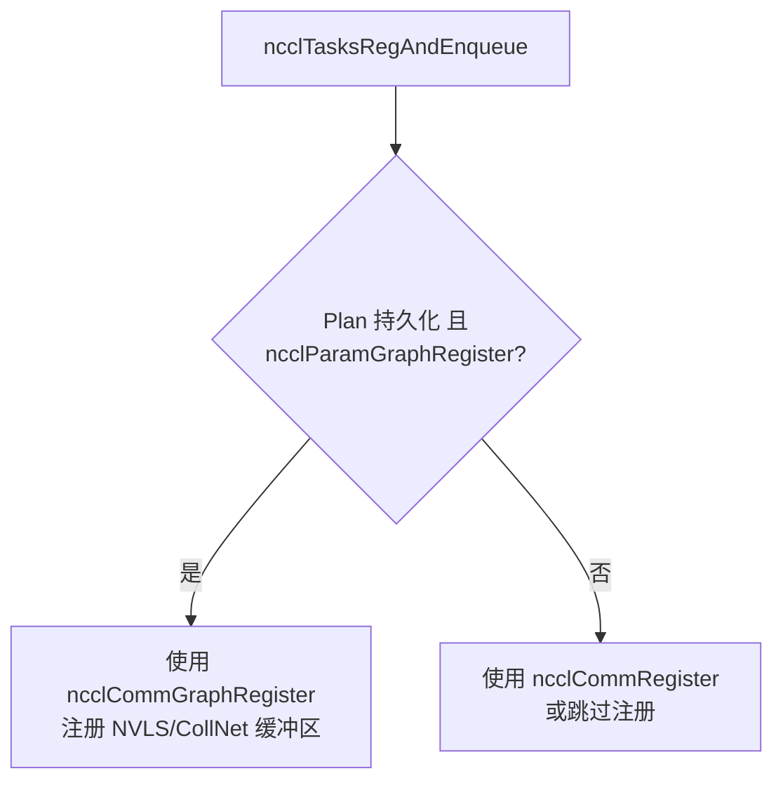

# NCCL CUDA Graph 持久化集合

"持久化" (Persistent) 在 NCCL 中与 CUDA Graph 捕获同义。被捕获到 CUDA Graph 中的 Plan 称为持久化 Plan，因为 Graph 可能被反复重放，Plan 数据必须在 Graph 生命周期内保持有效。

CUDA Graph 是 NVIDIA 提供的执行图优化技术——它将一系列 GPU 操作（内核启动、内存拷贝等）捕获为一个图结构，后续可以反复重放整个图，省去了每次执行的 CPU 端启动开销。对于 NCCL 这种每次集合操作都需要多次内核启动的场景，CUDA Graph 可以显著降低 CPU 端延迟。然而，CUDA Graph 带来了一个根本性约束：**图中的所有 GPU 地址和参数在图的生命周期内必须保持有效**——这意味着 NCCL 的 Plan 数据（包含通道状态、工作缓冲区等）不能在操作完成后立即释放，而必须"持久化"直到图被销毁。

---

## 1. 持久化 vs 非持久化对比

| 方面 | 非持久化 Plan | 持久化 Plan |
|------|-------------|------------|
| **触发条件** | 正常执行 (非 Graph 捕获) | CUDA Graph 捕获中 |
| **工作存储** | FIFO (预算 = FIFO 大小 / 2) | Persistent buffer (预算 = 1<<30 bytes) |
| **回收时机** | 内核启动后立即回收 | Graph 销毁时回收 |
| **引用计数** | 无 | persistentRefs++ / localPersistentRefs++ |
| **Host stream** | 检查 serial event 后决定 | 始终使用 host stream |
| **缓冲区注册** | ncclCommRegister | ncclCommGraphRegister |
| **序列号** | 动态递增 | 使用常量 GRAPH_SYNC_VALUE=1 |

持久化和非持久化 Plan 的核心区别在于**工作存储的生命周期管理**。非持久化 Plan 使用 FIFO 作为工作存储——FIFO 是一个环形缓冲区，多个 Plan 依次写入，内核启动后对应的空间可以立即被下一个 Plan 复用。这种设计非常高效（FIFO 大小通常是数百 MB，足以容纳多个并发 Plan），但有一个前提：写入 FIFO 的数据在一次操作后就不再需要。

持久化 Plan 不能使用 FIFO，因为 Graph 可能被重放任意次——如果使用 FIFO，第二次重放时 FIFO 的读位置已经移动，上一次写入的工作数据已被覆盖。因此持久化 Plan 使用独立的 Persistent buffer（大小为 1<<30 = 1GB），并且在整个 Graph 生命周期内保持此缓冲区有效。这个 1GB 预算看似很大，但在实际使用中通常足够——单个 Plan 的工作数据通常只有数十 MB，1GB 可以容纳多个并发 Plan。

序列号的区别也源于 Graph 的固定性。非持久化 Plan 使用递增序列号来同步不同 rank 的操作——每次操作分配一个新的序列号，避免与之前的操作混淆。但 CUDA Graph 是固定的：图中的参数在捕获时确定，不能在重放时修改。因此持久化 Plan 使用常量 `GRAPH_SYNC_VALUE=1` 作为序列号，并在每次重放后将 ready/complete 标志重置为 0，确保下次重放时序列号仍然有效。

---

## 2. 持久化 Plan 生命周期

### 2.1 创建与捕获

持久化 Plan 的创建起点在 `ncclLaunchPrepare` 中。该函数通过检查 `ncclCudaGraphValid(planner->capturingGraph)` 来判断当前是否在 CUDA Graph 捕获模式下——CUDA 运行时在流捕获开始时会标记当前流的状态，NCCL 通过 `cudaStreamIsCapturing` 和 `cudaStreamGetCaptureInfo` 查询此状态。

如果检测到 Graph 捕获，NCCL 将 `workStorageType` 设置为 `Persistent`，并分配大预算工作缓冲区。这个缓冲区通过 `uploadWork` 函数分配，大小固定为 1<<30 bytes（1GB），使用 `ncclCalloc` 在主机端分配并通过 `cudaMemcpy` 复制到设备端。缓冲区的 GPU 地址在捕获时被嵌入到内核参数中，由于 Graph 重放时使用相同的 GPU 地址，工作数据在重放间保持有效。

缓冲区注册使用 `ncclCommGraphRegister` 而非 `ncclCommRegister`——这两个注册函数的引用计数机制不同（`graphRefs` vs `localRefs`），确保 Graph 相关注册的生命周期与 Graph 而非普通操作绑定。

### 2.2 启动与保持

持久化 Plan 的启动有一个关键区别：**不立即回收**。非持久化 Plan 在内核启动后将自身加入 `comm->callbackQueue`，由回调机制在下一次操作时回收其工作存储。但持久化 Plan 的工作存储必须在整个 Graph 生命周期内有效，因此不能加入 `callbackQueue`——取而代之的是递增引用计数，表示"这个 Plan 的数据正在被 Graph 使用"。

引用计数使用两个计数器：`sharedRes->persistentRefs`（per-device 全局计数）和 `comm->localPersistentRefs`（per-通信器计数）。双计数器的设计是因为同一个设备上的多个通信器可能同时拥有持久化 Plan——`sharedRes->persistentRefs` 用于判断设备上是否有任何持久化 Plan（影响 host stream 的使用策略），`comm->localPersistentRefs` 用于跟踪单个通信器的持久化 Plan 数量（影响通信器的销毁逻辑）。

`persistentDestructor` 是回收的触发点。NCCL 使用 CUDA 的图更新回调（`cudaGraphExecStreamCaptureUpdate`）或图销毁回调（graph destroy callback）来注册 `persistentDestructor`——当 Graph 被销毁或更新时，CUDA 运行时调用此回调，NCCL 在回调中将 Plan 加入 `callbackQueue` 进行异步回收。这种回调机制确保了回收时机与 Graph 生命周期精确同步。

### 2.3 销毁与回收

持久化 Plan 的销毁面临一个特殊挑战：`persistentDestructor` 可能在 Graph 捕获模式仍活跃时被调用（例如在 Graph 更新操作期间）。在流捕获模式下，CUDA 不允许执行某些操作（如 `cudaFree`），因为它们会破坏捕获的完整性。

NCCL 使用 `cudaThreadExchangeStreamCaptureMode` 来临时放松捕获模式——将模式从 `cudaStreamCaptureModeThreadLocal`（严格模式，禁止任何可能影响捕获的操作）切换到 `cudaStreamCaptureModeRelaxed`（宽松模式，允许在捕获中执行内存管理操作）。释放完 `workBufPersistent` 后，立即恢复严格模式。这种模式切换是线程本地的，不影响其他线程的捕获状态。

引用计数在回收完成后递减。如果 `sharedRes->persistentRefs` 降为零，NCCL 知道设备上不再有任何持久化 Plan，可以恢复更激进的非持久化优化路径（如跳过 host stream 的 serial event 检查）。

---

## 3. 引用计数与同步

### 3.1 两个引用计数器

双引用计数器的设计反映了 NCCL 的多通信器架构。在典型的多 GPU 训练中，每个 GPU 对应一个 `ncclComm_t` 通信器，但同一设备上的通信器共享 `sharedRes`（包括代理线程、FIFO 等）。`persistentRefs` 回答的问题是"这个设备上是否有任何持久化 Plan？"——这影响设备级决策，例如是否需要使用 host stream。`localPersistentRefs` 回答的问题是"这个通信器有多少持久化 Plan？"——这影响通信器级决策，例如通信器销毁时是否需要等待持久化 Plan 回收。

### 3.2 同步影响

持久化 Plan 对非持久化 Plan 的性能有影响。当设备上有持久化 Plan 存在时（`persistentRefs > 0`），非持久化内核启动必须检查 host stream 的 serial event 是否完成——因为持久化 Plan 始终使用 host stream（见 3.3 节），如果非持久化内核不等待 host stream 完成，可能与持久化 Plan 的 host stream 操作产生竞争。

这个检查在 `ncclLaunchKernelBefore` 中执行。当 `persistentRefs == 0` 时，NCCL 可以跳过 serial event 检查，走更快的路径——这是为什么引用计数如此重要的性能原因之一：准确跟踪持久化 Plan 的存在使得非持久化路径可以避免不必要的同步。

### 3.3 Host Stream 处理

Host stream 的处理是持久化 Plan 的另一个关键差异。非持久化 Plan 只在 serial event 完成时使用 host stream（用于代理操作等需要 CPU 辅助的任务），否则跳过以减少延迟。但持久化 Plan **始终使用 host stream**，原因是 CUDA Graph 内核不能依赖普通的流序语义。

在非 Graph 执行中，NCCL 依赖 CUDA 流的顺序保证：同一流上的操作按提交顺序执行。但 CUDA Graph 重放时，所有内核作为一个原子单元执行——图内内核之间没有传统的流序依赖，它们的执行顺序由图的结构决定。这意味着 NCCL 不能依赖"代理操作在内核之前完成"这样的隐式保证，必须通过 host stream 显式同步。Host stream 是一个独立的 CUDA 流，用于执行与图内内核相关的 CPU 辅助操作（如代理推进），它通过事件与主流同步，确保操作的正确顺序。

---

## 4. CUDA Graph 捕获模式

### 4.1 流捕获切换

在持久化 Plan 需要执行 CUDA 操作（如释放工作缓冲区）时：

流捕获模式切换是 NCCL 与 CUDA Graph 交互中最微妙的操作。CUDA 的流捕获模式控制哪些操作在捕获期间是允许的——严格模式（`cudaStreamCaptureModeThreadLocal`）禁止可能修改图结构的操作（如 `cudaFree`、`cudaMemcpy` 等），宽松模式（`cudaStreamCaptureModeRelaxed`）允许这些操作但会终止相关流的捕获。

NCCL 在 `persistentDestructor` 中需要释放 `workBufPersistent`，而此时可能仍有流处于捕获状态。直接调用 `cudaFree` 会导致 CUDA 运行时报错（非法操作在捕获流上）。通过临时切换到宽松模式，`cudaFree` 被允许执行——它不会终止捕获，但会正确释放 GPU 内存。释放完成后立即恢复严格模式，确保后续操作不会意外破坏捕获。

这种模式切换是线程本部的，只影响调用线程的捕获状态，不会干扰其他线程的流捕获。三步操作（切换→释放→恢复）必须紧凑执行，中间不能插入任何可能依赖捕获状态的操作。

### 4.2 Graph 重放约束

CUDA Graph 的固定性带来了三个重要约束。

第一，工作缓冲区位置固定。Graph 捕获时，内核参数中的 GPU 地址被固化到图中，重放时不能修改。这意味着所有重放使用相同的工作缓冲区地址——这实际上是优势而非限制，因为 NCCL 可以预分配缓冲区并确保它在重放间保持有效（这就是持久化 Plan 存在的原因）。

第二，序列号不能递增。非持久化 Plan 使用递增序列号同步不同 rank 的操作，每次操作获得唯一序列号。但 Graph 是固定的——参数在捕获时确定，重放时不能改变。如果使用递增序列号，第二次重放时序列号已变化但图中的参数仍是旧值，导致同步混乱。解决方案是使用常量 `GRAPH_SYNC_VALUE = 1`——所有重放使用相同的序列号，同步通过 ready/complete 标志而非序列号区分。

第三，标志必须在重放后重置。因为序列号是常量（始终为 1），ready 和 complete 标志在操作完成后值为 1。如果不重置，下一次重放时其他 rank 的内核可能看到上一次的 complete 标志，误以为操作已完成。NCCL 在每次重放后将这些标志重置为 0，确保下次重放的同步逻辑正确工作。重置操作嵌入在集合通信内核的尾部，作为正常流程的一部分执行。

---

## 5. 持久化与缓冲区注册

### 5.1 图注册 vs 普通注册

| 方面 | ncclCommRegister | ncclCommGraphRegister |
|------|-----------------|----------------------|
| 引用计数 | localRefs++ | graphRefs++ |
| 注册优先级 | 本地注册 | 优先图注册，回退本地 |
| 生命周期 | deregister 时递减 | graph deregister 时递减 |
| 两计数器独立 | localRefs 和 graphRefs 分别计数 | 仅当两者都为 0 时才清理 |

缓冲区注册是 NCCL 利用 NVLS（NVLink SHARP）和 CollNet（集合网络）硬件加速的前提——这些硬件需要知道缓冲区的物理地址才能执行直接内存操作。图注册和普通注册使用独立的引用计数器，确保 Graph 相关的注册不会干扰非 Graph 操作的注册，反之 versa。

`ncclCommGraphRegister` 优先尝试图注册，如果失败（例如当前不在 Graph 捕获模式下）则回退到本地注册。回退行为确保了即使在 Graph 相关逻辑出问题时，缓冲区注册仍然成功——虽然可能无法利用 NVLS/CollNet 加速，但基本的通信功能不受影响。只有当 `localRefs` 和 `graphRefs` 都为零时，注册信息才会被完全清理，防止过早释放仍在使用的注册。

### 5.2 注册在 Plan 中的应用

注册决策在 `ncclTasksRegAndEnqueue` 中做出，这个函数负责注册缓冲区并将任务加入执行队列。对于持久化 Plan 且 `ncclParamGraphRegister` 启用的情况，使用 `ncclCommGraphRegister`；否则使用 `ncclCommRegister` 或跳过注册。

`NCCL_GRAPH_REGISTER` 参数（默认启用）控制是否为 Graph 中的操作注册缓冲区。在某些场景下，注册可能因为硬件限制或驱动 bug 而失败，此时禁用 Graph 注册可以避免问题——代价是无法使用 NVLS/CollNet 加速，但基本的通信仍然正常。

---

## 6. 关键源文件

| 文件 | 功能 |
|------|------|
| `src/enqueue.cc` (ncclLaunchPrepare) | Plan 创建，检测 Graph 捕获 |
| `src/enqueue.cc` (uploadWork) | 工作存储类型选择 (Fifo/Persistent) |
| `src/enqueue.cc` (ncclLaunchKernelAfter) | 持久化 Plan 的 host stream 处理 |
| `src/enqueue.cc` (persistentDestructor) | Graph 销毁时的 Plan 回收 |
| `src/register/register.cc` | 图注册 vs 普通注册的引用计数 |
| `src/include/comm.h` | persistentRefs / localPersistentRefs 字段 |
