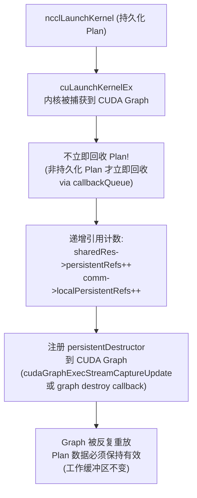
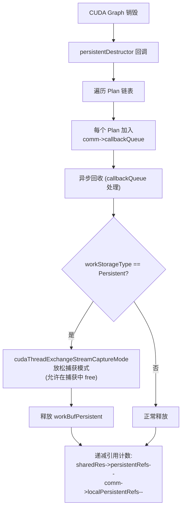
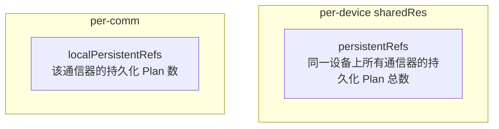
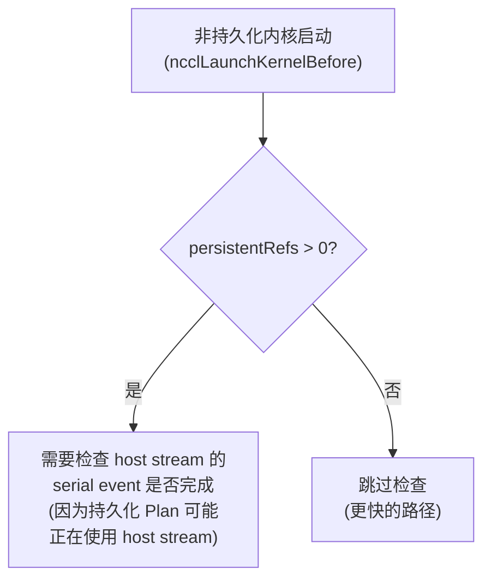
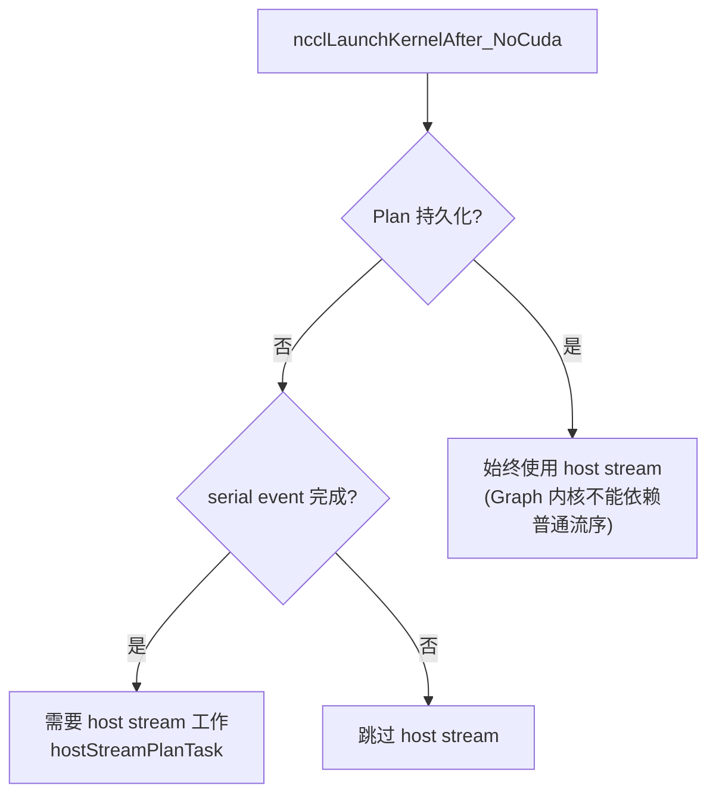
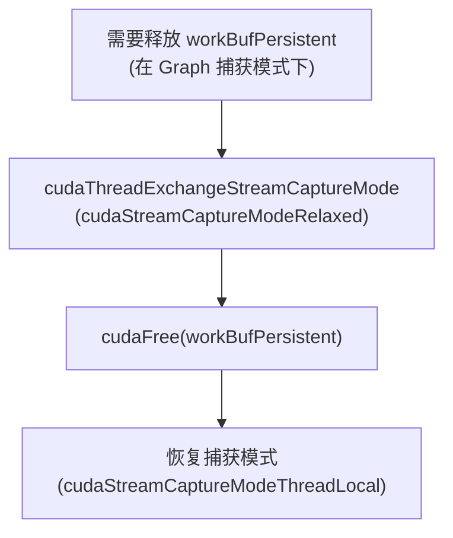
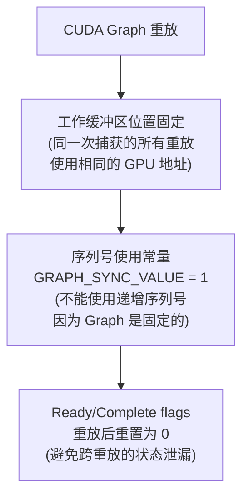
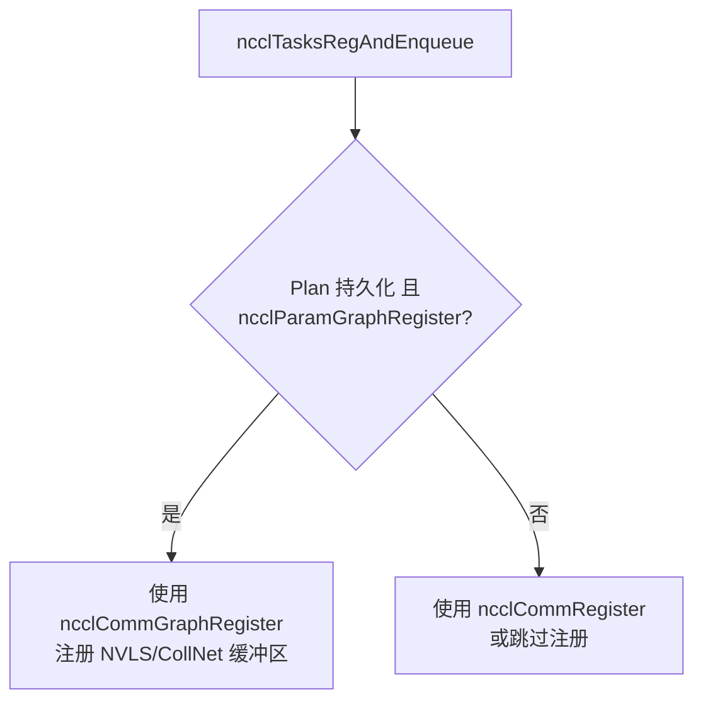

# NCCL CUDA Graph 持久化集合

"持久化" (Persistent) 在 NCCL 中与 CUDA Graph 捕获同义。被捕获到 CUDA Graph 中的 Plan 称为持久化 Plan，因为 Graph 可能被反复重放，Plan 数据必须在 Graph 生命周期内保持有效。

---

## 1. 持久化 vs 非持久化对比

| 方面 | 非持久化 Plan | 持久化 Plan |
|------|-------------|------------|
| **触发条件** | 正常执行 (非 Graph 捕获) | CUDA Graph 捕获中 |
| **工作存储** | FIFO (预算 = FIFO 大小 / 2) | Persistent buffer (预算 = 1<<30 bytes) |
| **回收时机** | 内核启动后立即回收 | Graph 销毁时回收 |
| **引用计数** | 无 | persistentRefs++ / localPersistentRefs++ |
| **Host stream** | 检查 serial event 后决定 | 始终使用 host stream |
| **缓冲区注册** | ncclCommRegister | ncclCommGraphRegister |
| **序列号** | 动态递增 | 使用常量 GRAPH_SYNC_VALUE=1 |

---

## 2. 持久化 Plan 生命周期

### 2.1 创建与捕获

```mermaid
flowchart TD
    A["ncclLaunchPrepare"] --> B{ncclCudaGraphValid?\n(planner->capturingGraph)"}
    B -->|"否"| C["非持久化 Plan\nworkStorageType = Fifo"]
    B -->|"是"| D["持久化 Plan\nworkStorageType = Persistent"]

    D --> D1["分配大预算工作缓冲区\nworkBufPersistent\n(1<<30 bytes)"]
    D1 --> D2["persistent = true"]
    D2 --> D3["缓冲区注册使用\nncclCommGraphRegister\n(而非 ncclCommRegister)"]
```

### 2.2 启动与保持



### 2.3 销毁与回收



---

## 3. 引用计数与同步

### 3.1 两个引用计数器



### 3.2 同步影响



### 3.3 Host Stream 处理



---

## 4. CUDA Graph 捕获模式

### 4.1 流捕获切换

在持久化 Plan 需要执行 CUDA 操作（如释放工作缓冲区）时：



### 4.2 Graph 重放约束



---

## 5. 持久化与缓冲区注册

### 5.1 图注册 vs 普通注册

| 方面 | ncclCommRegister | ncclCommGraphRegister |
|------|-----------------|----------------------|
| 引用计数 | localRefs++ | graphRefs++ |
| 注册优先级 | 本地注册 | 优先图注册，回退本地 |
| 生命周期 | deregister 时递减 | graph deregister 时递减 |
| 两计数器独立 | localRefs 和 graphRefs 分别计数 | 仅当两者都为 0 时才清理 |

### 5.2 注册在 Plan 中的应用



---

## 6. 关键源文件

| 文件 | 功能 |
|------|------|
| `src/enqueue.cc` (ncclLaunchPrepare) | Plan 创建，检测 Graph 捕获 |
| `src/enqueue.cc` (uploadWork) | 工作存储类型选择 (Fifo/Persistent) |
| `src/enqueue.cc` (ncclLaunchKernelAfter) | 持久化 Plan 的 host stream 处理 |
| `src/enqueue.cc` (persistentDestructor) | Graph 销毁时的 Plan 回收 |
| `src/register/register.cc` | 图注册 vs 普通注册的引用计数 |
| `src/include/comm.h` | persistentRefs / localPersistentRefs 字段 |
