# NCCL 整体架构与流程详细分析

> 版本: NCCL 2.29.7

---

## 目录

1. [整体架构概览](#1-整体架构概览)
2. [通信器初始化流程](#2-通信器初始化流程)
3. [Bootstrap 引导流程](#3-bootstrap-引导流程)
4. [拓扑发现与图计算](#4-拓扑发现与图计算)
5. [通道系统](#5-通道系统)
6. [集合操作入队与执行](#6-集合操作入队与执行)
7. [传输层架构](#7-传输层架构)
8. [代理线程架构](#8-代理线程架构)
9. [GPU 设备端内核架构](#9-gpu-设备端内核架构)
10. [算法与协议选择](#10-算法与协议选择)
11. [插件系统](#11-插件系统)
12. [内存管理系统](#12-内存管理系统)
13. [缓冲区注册机制](#13-缓冲区注册机制)
14. [RMA 远程内存访问](#14-rma-远程内存访问)
15. [对称内存与 CE 集合操作](#15-对称内存与-ce-集合操作)
16. [通信器分裂与收缩](#16-通信器分裂与收缩)
17. [RAS 容错可用性服务](#17-ras-容错可用性服务)
18. [GIN GPU 发起网络](#18-gin-gpu-发起网络)
19. [环境变量系统与配置](#19-环境变量系统与配置)
20. [错误处理与中断机制](#20-错误处理与中断机制)
21. [CUDA Graph 持久化集合](#21-cuda-graph-持久化集合)
22. [NCCL 关键机制全景图](#22-nccl-关键机制全景图)

---

## 1. 整体架构概览

NCCL 采用分层架构，从用户 API 到 GPU 内核逐层深入：

```
┌─────────────────────────────────────────────────────┐
│                   用户 API 层                        │
│  ncclAllReduce / ncclAllGather / ncclSend/Recv ...  │
├─────────────────────────────────────────────────────┤
│                   入队调度层                         │
│  enqueue.cc / group.cc / scheduler                  │
│  任务排序 → 算法选择 → 通道分配 → 内核启动           │
├─────────────────────────────────────────────────────┤
│                   图/拓扑层                          │
│  topo.cc / paths.cc / search.cc / tuning.cc         │
│  硬件拓扑发现 → 路径计算 → 通道搜索 → 参数调优       │
├──────────────┬──────────────────────────────────────┤
│   传输层      │           代理线程层                  │
│ P2P/SHM/NET  │  proxy service + progress threads    │
│ COLLNET/NVLS │  主机端网络/SHM数据搬运               │
├──────────────┴──────────────────────────────────────┤
│               GPU 设备端内核层                        │
│  protocol primitives (LL/LL128/Simple)               │
│  algorithm implementations (Ring/Tree/NVLS/CollNet)  │
├─────────────────────────────────────────────────────┤
│               引导层 (Bootstrap)                     │
│  socket-based rendezvous / ring AllGather            │
├─────────────────────────────────────────────────────┤
│               插件层 (Plugin)                        │
│  net / tuner / profiler / env / gin                  │
└─────────────────────────────────────────────────────┘
```

**核心执行模型**：

1. 用户调用集合通信 API（如 `ncclAllReduce`），进入**入队层**
2. 操作被附加到一个**通道（Channel）**，通道拥有预建立的**传输连接**
3. **GPU 内核**（`src/device/`）使用协议原语（LL/LL128/Simple）执行实际数据搬运
4. **代理线程**推进主机端的网络和共享内存操作
5. **拓扑/图系统**在通信器初始化时确定最优算法、协议和通道分配
6. **插件**可以覆盖网络传输、算法调优、性能分析和环境配置

---

## 2. 通信器初始化流程

### 2.1 总体流程

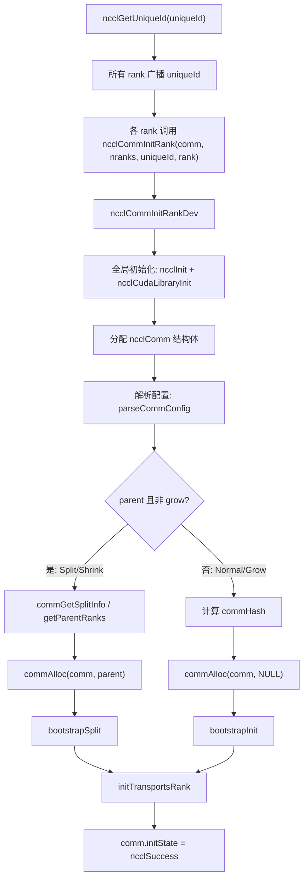

### 2.2 ncclCommInitRank 详细调用序列

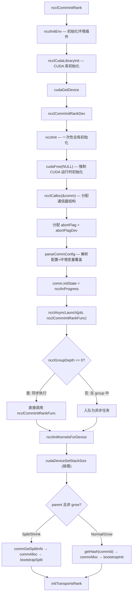

### 2.3 initTransportsRank 详细阶段

`initTransportsRank` 是初始化中最复杂的函数（约1600行），包含以下阶段：

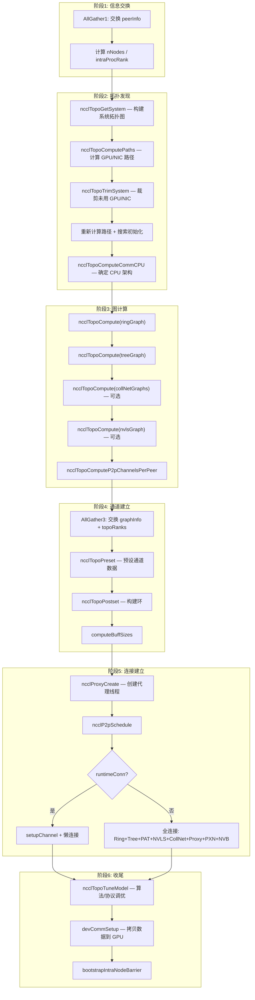

---

## 3. Bootstrap 引导流程

Bootstrap 负责在各 rank 之间建立初始的带外通信，使它们能够交换连接信息。

### 3.1 uniqueId 生成与 Root 线程

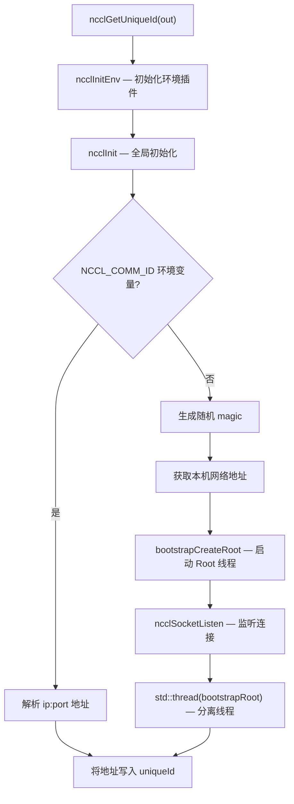

### 3.2 Bootstrap Root 协调逻辑

Root 线程负责接收所有 rank 的连接请求，并组织成环形拓扑：

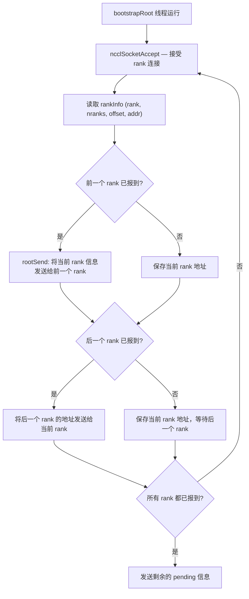

### 3.3 bootstrapInit 详细流程

每个 rank 执行 `bootstrapInit` 与 Root 建立连接并形成环形通信：

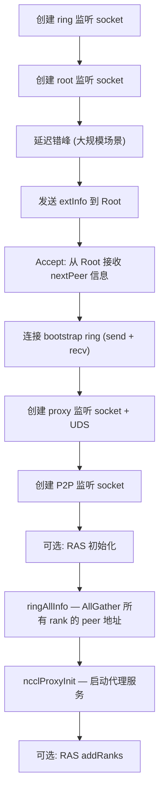

### 3.4 Ring AllGather

Bootstrap ring 建立后，使用环形 AllGather 交换所有 rank 的地址信息：

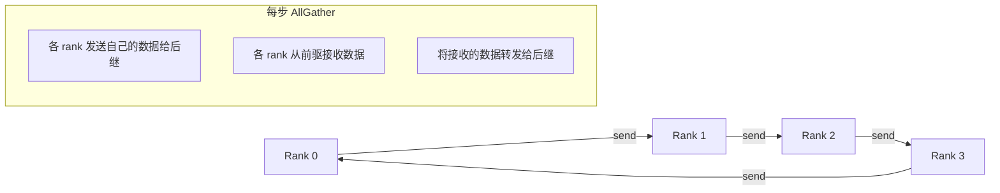

经过 `nranks - 1` 步后，每个 rank 都拥有所有 rank 的地址信息。

---

## 4. 拓扑发现与图计算

### 4.1 拓扑节点类型与链路类型

**节点类型 (7种)**：

| 类型 | 值 | 说明 |
|------|---|------|
| GPU | 0 | GPU 设备 |
| PCI | 1 | PCI 交换机 |
| NVS | 2 | NVSwitch |
| CPU | 3 | NUMA 域 |
| NIC | 4 | 网络接口卡 |
| NET | 5 | 网络端点 |
| GIN | 6 | GIN 设备 |

**链路类型**：

| 类型 | 说明 |
|------|------|
| LINK_LOC | 本地 (同一设备) |
| LINK_NVL | NVLink |
| LINK_C2C | C2C (芯片间直连) |
| LINK_PCI | PCIe |
| LINK_SYS | SMP 互连 (跨 NUMA) |
| LINK_NET | 网络 |

**路径类型 (按距离排序)**：

| 类型 | 值 | 说明 |
|------|---|------|
| PATH_LOC | 0 | 自身 |
| PATH_NVL | 1 | 直接 NVLink |
| PATH_NVB | 2 | 经中间 GPU 的 NVLink |
| PATH_C2C | 3 | C2C 链路 |
| PATH_PIX | 4 | 单 PCIe 桥 |
| PATH_PXB | 5 | 多 PCIe 桥 (不经 CPU) |
| PATH_P2C | 6 | GPU→C2C→CPU→PCI→NIC |
| PATH_PXN | 7 | GPU→NVLink→中间GPU→PCI→NIC |
| PATH_PHB | 8 | 经 PCIe 主桥/CPU |
| PATH_SYS | 9 | 跨 NUMA SMP 互连 |
| PATH_NET | 10 | 经网络 |
| PATH_DIS | 11 | 断开 |

### 4.2 拓扑发现流程

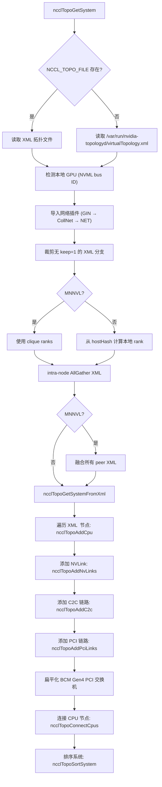

### 4.3 路径计算 (BFS)

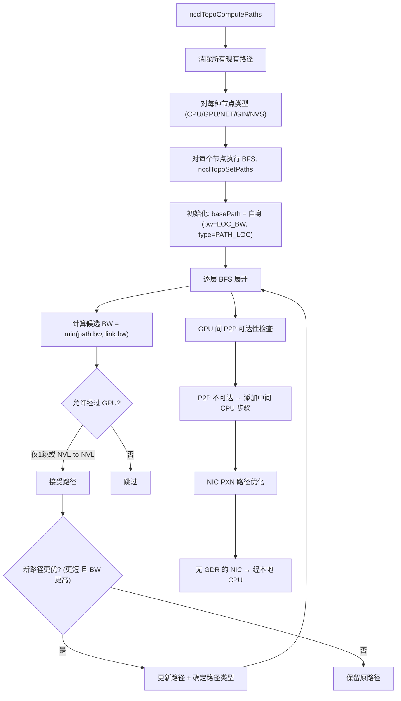

### 4.4 图计算与通道搜索

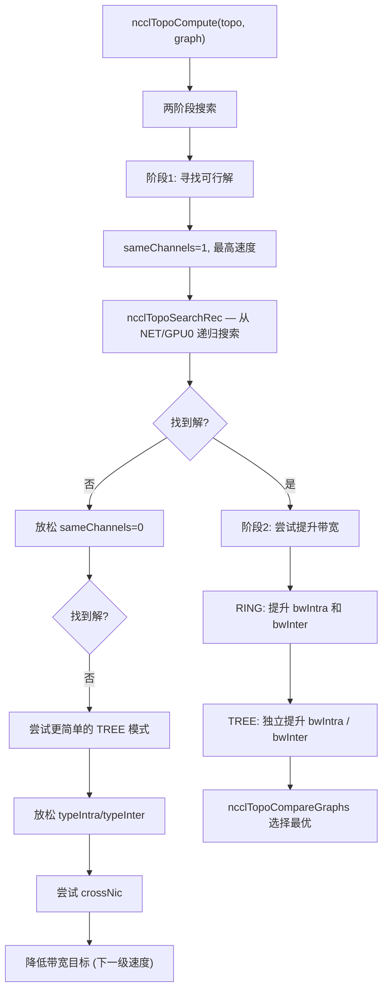

### 4.5 搜索模式

| 模式 | 节点内 | 跨节点 |
|------|--------|--------|
| RING | GPUa→GPUb→...→GPUx→GPUa | NETn→GPUa→...→GPUx→NETn/m |
| TREE | GPUa→GPUb→...→GPUx | NETn→GPUa→...→GPUx + GPUa→NETn |
| SPLIT_TREE | 同 TREE | NETn→...→GPUx, GPUx→NETm |
| NVLS | N/A | NETn→GPUhead, 经 NVSwitch |
| COLLNET_DIRECT | 所有 GPU 星形到 head | NETn→GPUhead→分发 |

---

## 5. 通道系统

### 5.1 通道结构

通道 (Channel) 是 NCCL 中并行度的基本单位，每个通道代表一条独立的通信路径。多个通道并发运行以饱和带宽。

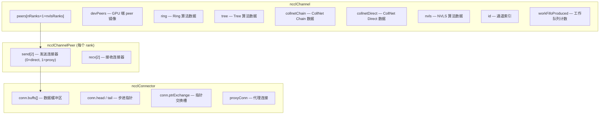

### 5.2 算法数据结构

**Ring** (`ncclRing`):
- `prev` / `next` — 相邻 rank 索引
- `userRanks` — 内部索引到用户 rank 的映射
- `rankToIndex` — 反向查找

**Tree** (`ncclTree`, 双二叉树):
- `up` — 父节点 rank (-1 表示根)
- `down[3]` — 子节点 rank (-1 表示无子节点)
- `depth` — 树深度

**Double Binary Tree** 结构示意:

```
Tree 0:                     Tree 1:
  0--------8                  3-------11
      /    \                   / \      / \
     4      12                1   7    9   5
    / \    / \               /\  /\   /\  /\
   2   6  10  14            0 2 5 6 8 10 4 7
  /\ /\ /\ /\
 1 3 5 7 9 11 ...
```

两个树确保每个 rank 至少在一个树中是叶子节点，使得 AllReduce 的 reduce 和 broadcast 可以流水线执行。

---

## 6. 集合操作入队与执行

### 6.1 单独集合操作完整流程

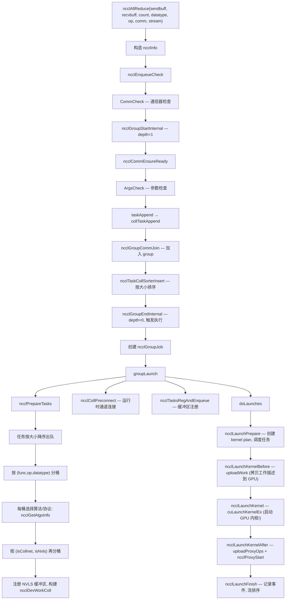

### 6.2 Group 操作流程

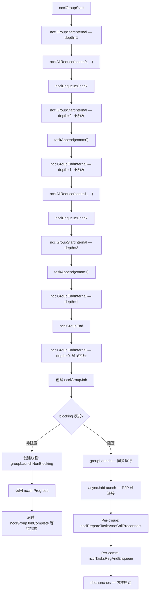

### 6.3 任务调度与通道分配

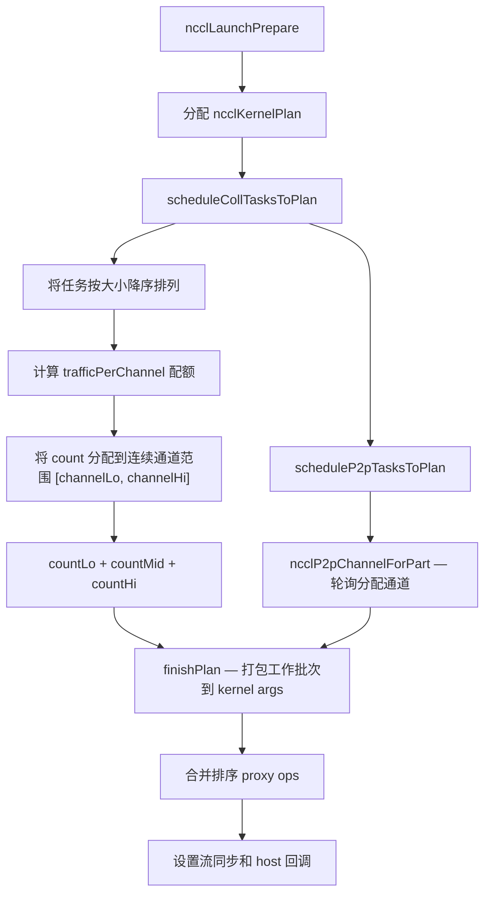

### 6.4 算法选择流程

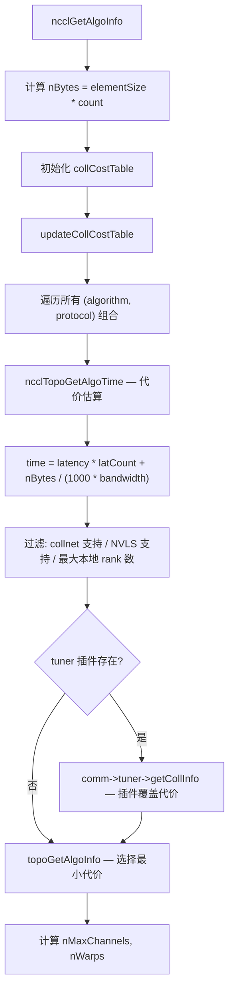

---

## 7. 传输层架构

### 7.1 传输接口

所有传输实现统一的 `ncclTransport` 接口：

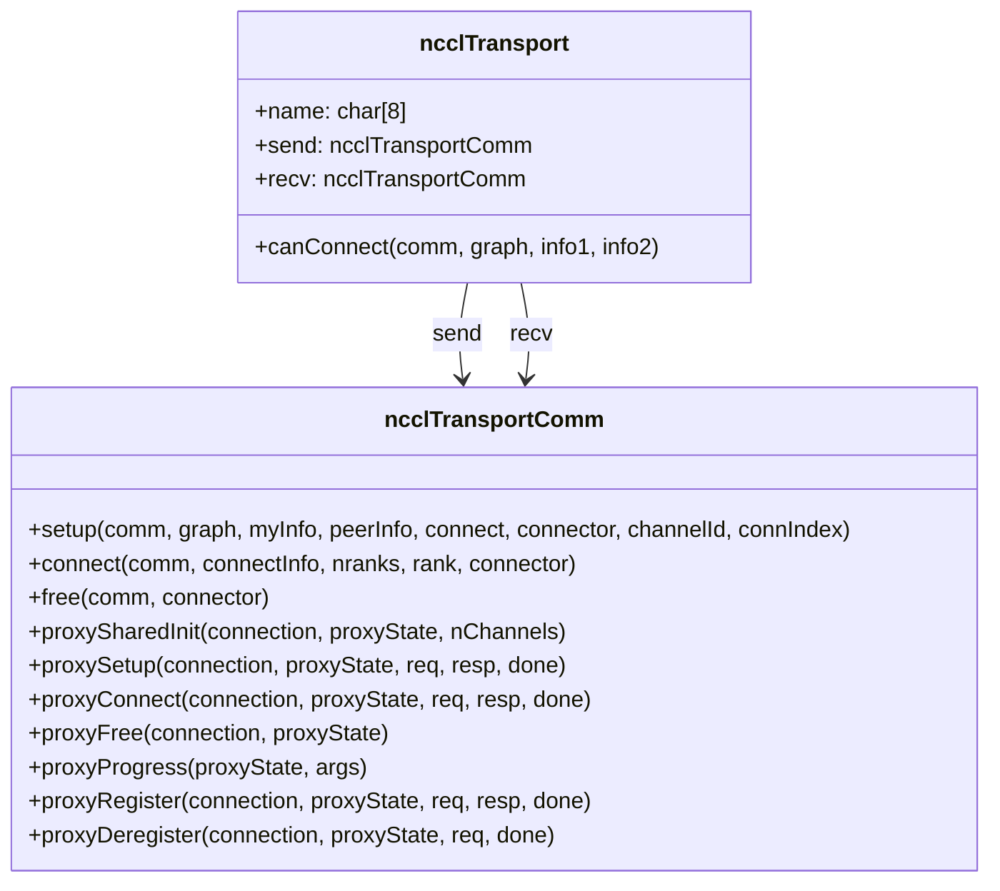

**5种传输类型**：

| 传输 | ID | 说明 | proxyProgress |
|------|---|------|--------------|
| P2P | 0 | GPU 间 NVLink/PCIe 直连 | 仅 CE memcpy 模式 |
| SHM | 1 | 节点内共享内存 | 有 |
| NET | 2 | 跨节点 IB/socket 网络 | 有 (核心) |
| COLLNET | 3 | 集合网络卸载 | 有 |
| NVLS | — | NVLink SHARP 多播 | — |

### 7.2 P2P 传输连接建立

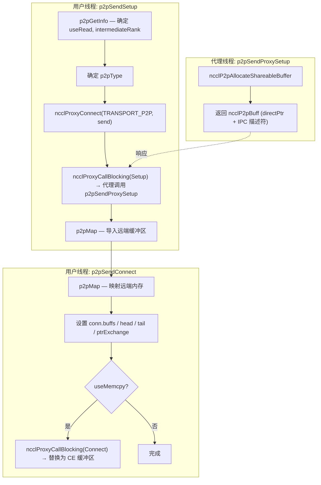

**P2P 类型**：
- `P2P_DIRECT`: 同进程，直接指针访问
- `P2P_IPC`: 不同进程，CUDA IPC
- `P2P_CUMEM`: 不同进程，cuMem API
- `P2P_INTERMEDIATE`: 经中间 GPU 中转

### 7.3 NET 传输连接建立

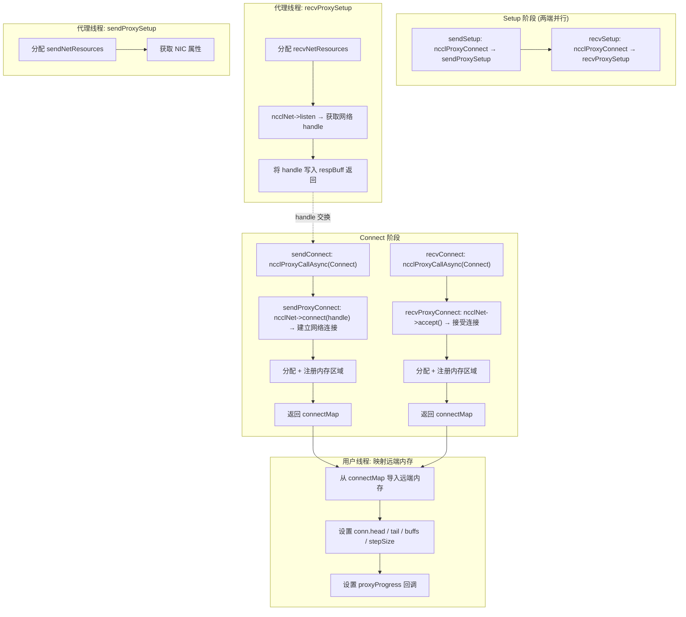

---

## 8. 代理线程架构

### 8.1 三线程模型

每个 GPU 设备运行三个代理线程：

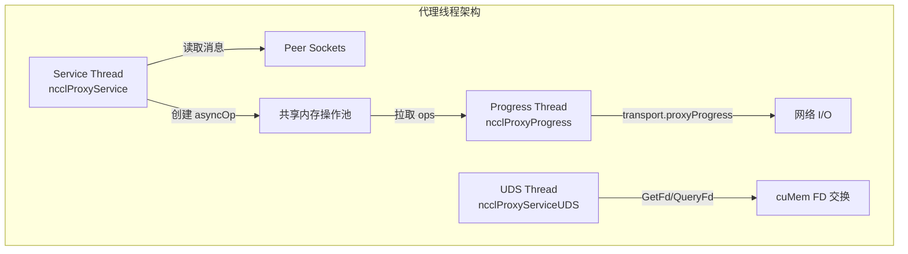

### 8.2 Service Thread 主循环

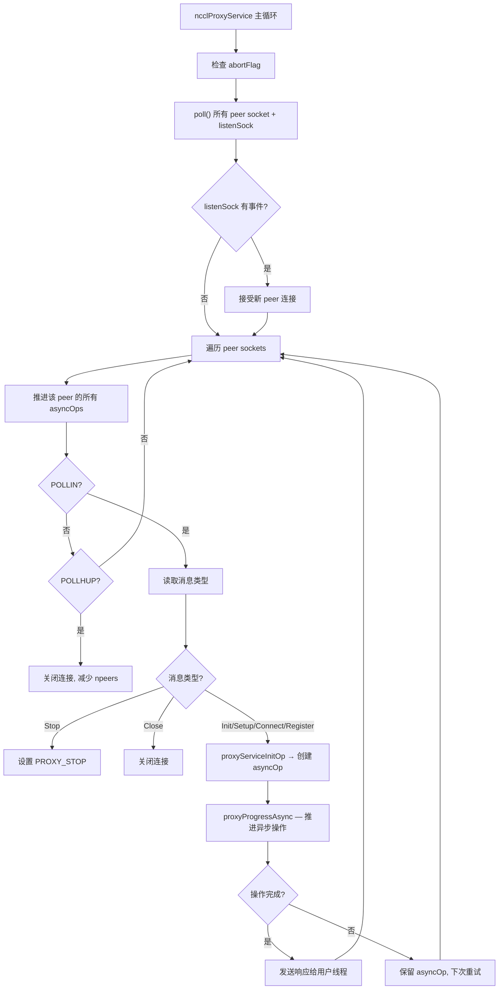

### 8.3 Progress Thread 主循环

```mermaid
flowchart TD
    A["ncclProxyProgress 主循环"] --> B["progressOps — 遍历 active 链表"]
    B --> C["调用 args->progress(proxyState, args)"]
    C --> D{args->state == ncclProxyOpNone?}
    D -->|是| E["removeOp — 移除已完成操作"]
    D -->|否| F["保留在 active 链表"]
    E --> G{idle 或 appendCounter 阈值?}
    F --> G
    G -->|是| H["ncclProxyGetPostedOps — 从共享内存拉取新 ops"]
    G -->|否| I["继续循环"]
    H --> J["ProxyAppend — 转换 ncclProxyOp → ncclProxyArgs"]
    J --> K["链接到 active 链表"]
    K --> A
```

### 8.4 连接状态机

```mermaid
stateDiagram-v2
    [*] --> connUninitialized
    connUninitialized --> connInitialized : ncclProxyMsgInit
    connUninitialized --> connSharedInitialized : ncclProxyMsgSharedInit
    connInitialized --> connSetupDone : ncclProxyMsgSetup
    connSharedInitialized --> connSetupDone : ncclProxyMsgSetup
    connSetupDone --> connConnected : ncclProxyMsgConnect
    connConnected --> [*]
```

### 8.5 NET 代理数据推进流程

#### Send Proxy Progress

```mermaid
flowchart TD
    A["sendProxyProgress"] --> B{state == Ready?}
    B -->|是| C["初始化: base, posted/transmitted/done=0"]
    B -->|否| D["Progress 阶段"]
    C --> D

    D --> E["Phase 1 POST: 递增 posted, 设置 sendHead"]
    E --> F["Phase 2 TRANSMIT: 检查 GPU 数据就绪 (recvTail > base+transmitted)"]
    F --> F1["LL/LL128: 验证 flag 有效性"]
    F1 --> F2["ncclNet->isend(buff, size, ..., &request)"]
    F2 --> G["Phase 3 DONE: ncclNet->test(request, &done, &size)"]
    G --> G1{done?}
    G1 -->|是| G2["sub->done += sliceSteps, 更新 sendHead"]
    G1 -->|否| H["下次重试"]
    G2 --> I{sub->done == nsteps?}
    I -->|是| J["args->done++"]
    I -->|否| H
    J --> K{args->done == nsubs?}
    K -->|是| L["args->state = ncclProxyOpNone"]
    K -->|否| H
```

#### Recv Proxy Progress

```mermaid
flowchart TD
    A["recvProxyProgress"] --> B{state == Ready?}
    B -->|是| C["初始化 + 按 recvComm 分组"]
    B -->|否| D["Progress 阶段"]
    C --> D

    D --> E["Phase 1 POST: ncclNet->irecv(ptrs, sizes, mhandles, &request)"]
    E --> F["Phase 2 RECEIVE: ncclNet->test(request, &done, sizes)"]
    F --> F1{done?}
    F1 -->|是| F2["sub->received += sliceSteps"]
    F1 -->|否| F3["下次重试"]
    F2 --> F4{needFlush?}
    F4 -->|是| F5["ncclNet->iflush() 或 PCI-E 读屏障"]
    F4 -->|否| G
    F5 --> G["Phase 3 TRANSMIT: 确认 flush 完成"]
    G --> G1["更新 recvTail = base + transmitted"]
    G1 --> H["Phase 4 DONE: 等待 GPU 确认 (读 sendMem.head)"]
    H --> H1["sub->done += sliceSteps"]
    H1 --> I{所有 sub 完成?}
    I -->|是| J["args->state = ncclProxyOpNone"]
    I -->|否| F3
```

---

## 9. GPU 设备端内核架构

### 9.1 内核启动与调度

```mermaid
flowchart TD
    A["用户线程: cuLaunchKernelEx"] --> B["GPU: ncclDevKernel_xxx(args4K)"]

    B --> C["ncclKernelMain<specializedFnId, RunWorkBatch>"]
    C --> D["协作拷贝 args 到共享内存"]
    D --> E["blockIdx → channelId 映射 (popcount)"]
    E --> F["warp0: 加载 ncclKernelComm"]
    F --> G["warp1: 加载 ncclDevChannel"]
    G --> H["其余 warp: loadWorkBatchToShmem"]
    H --> I["工作批次调度循环"]

    I --> J{funcId == SpecializedFnId?}
    J -->|是| K["直接执行: RunWorkBatch::run()"]
    J -->|否| L["查函数表: ncclDevFuncTable[funcId]()"]

    K --> M["RunWorkColl::run(tid, nthreads, work)"]
    L --> M
    M --> N["算法实现 (e.g. runRing, runTreeSplit)"]
    N --> O["Primitives::send/recv/reduceCopy"]
    O --> P{nextJump 存在?}
    P -->|是| Q["加载下一批工作"]
    P -->|否| R["内核完成"]
    Q --> I
```

### 9.2 协议原语架构

```mermaid
classDiagram
    class Primitives {
        +T: 数据类型
        +RedOp: 规约操作
        +Fan: FanSymmetric 或 FanAsymmetric
        +Direct: 是否直连
        +Proto: 协议类型
        +P2p: 是否 SendRecv
        +send(data, count)
        +recv(data, count)
        +recvReduceSend(data)
        +recvReduceCopy(data)
        +copySend(data)
        +recvCopySend(data)
        +recvReduceCopySend(data)
    }

    class ProtoLL {
        +16字节 FIFO 行: 8字节数据 + 2×4字节flag
        +50% 带宽开销
        +极低延迟
        +MaxGroupWidth = 1
    }

    class ProtoLL128 {
        +128字节 cache line 同步
        +每16元素1个flag字 (1/8线程)
        +93.75% 数据效率
        +warp 级操作
    }

    class ProtoSimple {
        +代理辅助通信
        +大缓冲区, 无逐元素 flag
        +线程角色分工:
          WaitRecv/WaitSend/PostSend/PostRecv/Worker
        +支持 Direct Read/Write
        +支持 Scatter/Gather
    }

    Primitives <|-- ProtoLL : Proto=ProtoLL
    Primitives <|-- ProtoLL128 : Proto=ProtoLL128
    Primitives <|-- ProtoSimple : Proto=ProtoSimple
```

### 9.3 LL 协议操作流程

```mermaid
flowchart TD
    A["LLGenericOp<RECV, SEND, SrcBuf, DstBuf>"] --> B["waitSend — 等待发送缓冲区有空位"]
    B --> C["数据循环 (per-thread)"]
    C --> D["DataLoader 加载本地数据 (处理非对齐)"]
    D --> E["readLL — 从 LL FIFO 读取远端数据 (自旋等待 flag 匹配)"]
    E --> F["applyPreOp (按需)"]
    F --> G["applyReduce (按需)"]
    G --> H["applyPostOp (按需)"]
    H --> I["storeLL — 写入发送 FIFO"]
    I --> J["存储结果到用户输出缓冲区"]
    J --> K{还有数据?}
    K -->|是| C
    K -->|否| L["步进推进: 递增 recv/send step"]
    L --> M["更新 head/tail 指针"]
```

### 9.4 Simple 协议操作流程

```mermaid
flowchart TD
    A["genericOp (Simple)"] --> B["外层: chunk 循环"]
    B --> C["内层: slice 循环 (SlicePerChunk)"]
    C --> D["WaitRecv 线程: 自旋等待 connStepPtr 推进"]
    D --> D1["设置 srcs/dsts 指针到 FIFO 或 direct buffer"]
    D1 --> E["WaitSend 线程: 自旋等待发送缓冲区空位"]
    E --> E1["设置 srcs/dsts 指针"]
    E1 --> F["subBarrier — 同步 worker 与 wait 线程"]
    F --> G["Worker 线程: reduceCopy<Unroll>"]
    G --> G1["从 srcs[] 读取 + 规约"]
    G1 --> G2["写入 dsts[]"]
    G2 --> H["barrier — 同步 worker 与 post 线程"]
    H --> I["PostSend 线程: st_relaxed_sys_global 推进步进计数"]
    I --> J["PostRecv 线程: 推进步进计数"]
    J --> K{更多 slice?}
    K -->|是| C
    K -->|否| L{更多 chunk?}
    L -->|是| B
    L -->|否| M["完成"]
```

### 9.5 AllReduce 算法实现

#### Ring AllReduce

```mermaid
flowchart TD
    A["runRing<T, RedOp, Proto>"] --> B["创建 Primitives<FanSymmetric<1>>"]
    B --> C["Phase 1: Reduce-Scatter"]
    C --> C1["for step = 0 to nranks-2"]
    C1 --> C2["recv(from prev) + reduce + send(to next)"]
    C2 --> C3["最后一步: directRecvReduceCopyDirectSend + postOp"]
    C3 --> D["Phase 2: All-Gather"]
    D --> D1["for step = 0 to nranks-2"]
    D1 --> D2["recv(from prev) + copySend(to next)"]
    D2 --> D3["最后一个 chunk: directRecv"]
```

数据流示意 (4 rank):

```mermaid
flowchart LR
    subgraph "Reduce-Scatter (3步)"
        direction TB
        RS1["Step1: A←D, B←A, C←B, D←C"]
        RS2["Step2: A←C, B←D, C←A, D←B"]
        RS3["Step3: A←B, B←C, C←D, D←A"]
    end

    subgraph "All-Gather (3步)"
        direction TB
        AG1["Step4: 各 rank 传递已规约的 chunk"]
        AG2["Step5: 继续传递"]
        AG3["Step6: 所有 rank 拥有完整结果"]
    end

    RS1 --> RS2 --> RS3 --> AG1 --> AG2 --> AG3
```

#### Tree AllReduce

```mermaid
flowchart TD
    A["runTreeSplit"] --> B["将线程分为两组"]
    B --> C["组1: Reduce-Up (叶→根)"]
    B --> D["组2: Broadcast-Down (根→叶)"]

    C --> C1["叶节点: send up"]
    C1 --> C2["中间节点: recv from children + reduce + send to parent"]
    C2 --> C3["根节点: recv + reduce"]

    D --> D1["根节点: send down"]
    D1 --> D2["中间节点: recv from parent + forward to children"]
    D2 --> D3["叶节点: recv"]

    C3 --> D1
```

#### NVLS AllReduce

```mermaid
flowchart TD
    A["runNvls AllReduce"] --> B["线程分区: scatter/gather/reduce+broadcast warps"]
    B --> C{单节点?}
    C -->|是| D["NVLS multicast 直接规约"]
    C -->|否| E["scatter + reduce + network send"]
    D --> F["NVLS gather + broadcast"]
    E --> E1["scatter: 分发本地数据到 NVLink peers"]
    E1 --> E2["reduce: 累积 NVLink peers 数据 → 发送到网络"]
    E2 --> E3["network: 接收规约结果"]
    E3 --> F
    F --> F1["gather: 收集 NVLink peers 数据"]
    F1 --> F2["broadcast: 从网络接收 → 分发到 NVLink peers"]
```

### 9.6 内核代码生成 (generate.py)

`generate.py` 自动生成内核和函数表基础设施，避免手动编写大量模板组合：

```mermaid
flowchart TD
    A["generate.py"] --> B["枚举所有 (collective, redop, type, algo, proto) 组合"]
    B --> C["equivalent_primary — 合并等价组合 (如 signed/unsigned int)"]
    C --> D["best_kernel — 确定每个主函数的特化内核"]
    D --> D1["Nop → Generic 内核"]
    D1 --> D2["SendRecv → 独立内核"]
    D2 --> D3["非规约集合 (AllGather等) → RING+LL 特化"]
    D3 --> D4["规约集合 → (Sum, 同类型, RING/TREE, LL) 特化"]

    B --> E["生成文件"]
    E --> E1["device_table.cu — ncclDevFuncTable[] 函数指针数组"]
    E --> E2["host_table.cc — ncclDevKernelForFunc[] 等主机端表"]
    E --> E3["all_reduce_sum_f32.cu 等按集合类型分文件"]
    E3 --> E4["DEFINE_ncclDevKernel — 特化内核"]
    E4 --> E5["DEFINE_ncclDevFunc — 函数表条目"]
```

---

## 10. 算法与协议选择

### 10.1 算法类型

| 算法 | 值 | 描述 |
|------|---|------|
| NCCL_ALGO_TREE | 0 | 双二叉树 |
| NCCL_ALGO_RING | 1 | 环形 |
| NCCL_ALGO_COLLNET_DIRECT | 2 | 集合网络直连 |
| NCCL_ALGO_COLLNET_CHAIN | 3 | 集合网络链式 |
| NCCL_ALGO_NVLS | 4 | NVLink SHARP |
| NCCL_ALGO_NVLS_TREE | 5 | NVLS + Tree 跨节点 |
| NCCL_ALGO_PAT | 6 | 并行 Alltoall Tree |

### 10.2 协议类型

| 协议 | 值 | 描述 | 适用场景 |
|------|---|------|---------|
| NCCL_PROTO_LL | 0 | 低延迟 (8字节+flags) | 小消息, 低延迟优先 |
| NCCL_PROTO_LL128 | 1 | 低延迟 128字节行 | 中等消息 |
| NCCL_PROTO_SIMPLE | 2 | 简单 (代理辅助) | 大消息, 带宽优先 |

### 10.3 算法/函数兼容性

| 集合操作 | 支持的算法 |
|---------|-----------|
| Broadcast | RING |
| Reduce | RING |
| ReduceScatter | PAT, RING, NVLS, COLLNET_DIRECT |
| AllGather | PAT, RING, NVLS, COLLNET_DIRECT |
| AllReduce | TREE, RING, COLLNET_DIRECT, COLLNET_CHAIN, NVLS, NVLS_TREE |

### 10.4 带宽模型

```mermaid
flowchart TD
    A["初始 busBw = nChannels * bw"] --> B{算法 + 协议?}

    B -->|"RING + LL"| C["busBw = min(llMaxBw, busBw * 0.5)"]
    B -->|"RING + LL128"| D["busBw = min(busBw * 0.92, nCh * maxRingLL128Bw)"]
    B -->|"TREE + AllReduce + Simple"| E["busBw = min(busBw * 0.92, nCh * maxTreeBw)"]
    B -->|"TREE + LL"| F["busBw = min(busBw / 3.8, llMaxBw)"]
    B -->|"TREE + LL128"| G["busBw = min(busBw * ratio, nCh * maxTreeLL128Bw)"]
    B -->|"NVLS/NVLS_TREE"| H["busBw *= nvlsEfficiency * (nCh-1)/nCh"]
    B -->|"PAT"| I["busBw *= 0.75"]
    B -->|"COLLNET + non-Simple"| J["busBw = 0"]

    C --> K["转换为算法 BW"]
    D --> K
    E --> K
    F --> K
    G --> K
    H --> K
    I --> K
    J --> K

    K --> L["time = latency * latCount + nBytes / (1000 * bandwidth)"]
```

### 10.5 延迟模型

```mermaid
flowchart TD
    A["算法延迟计算"] --> B{算法类型?}
    B -->|"RING"| C["base + (nsteps-nInterSteps)*intraLat + nInterSteps*interLat"]
    B -->|"TREE + AllReduce"| D["base + 2*((ppn-1)*intraLat + log2(nNodes)*interLat)"]
    B -->|"COLLNET_DIRECT"| E["base + 2*(min(1,ppn-1)*intraLat + (ppn-1)*0.4) + interLat"]
    B -->|"COLLNET_CHAIN"| F["base + 2*(ppn-1)*intraLat + interLat"]
    B -->|"NVLS"| G["intraLat + (nNodes>1 ? interLat : 0)"]
    B -->|"NVLS_TREE"| H["base + intraLat + 2*log2(nNodes)*interLat"]
    B -->|"PAT"| I["base + log2(nNodes)*(interLat/3.5) + nRanks*2.8"]
```

**硬件延迟参考**:

| 链路类型 | Tree (LL/LL128/Simple) | Ring (LL/LL128/Simple) |
|---------|----------------------|----------------------|
| NVLink | 0.6 / 1.25 / 4.0 μs | 0.6 / 1.9 / 3.4 μs |
| PCI | 1.0 / 1.9 / 4.0 μs | 1.0 / 2.5 / 5.7 μs |
| NET | 5.0 / 8.5 / 14 μs | 2.7 / 4.0 / 14.0 μs |

---

## 11. 插件系统

### 11.1 五种插件类型

```mermaid
flowchart TD
    A["NCCL 插件系统"] --> B["Net 插件 (ncclNet_t)"]
    A --> C["Tuner 插件 (ncclTuner_t)"]
    A --> D["Profiler 插件 (ncclProfiler_t)"]
    A --> E["Env 插件 (ncclEnvPluginGetEnv)"]
    A --> F["GIN 插件 (ncclGin_t)"]

    B --> B1["自定义网络传输 (v6-v11 API)"]
    B1 --> B2["NCCL_NET_PLUGIN 环境变量指定路径"]

    C --> C1["自定义算法/协议选择 (v2-v5 API)"]
    C1 --> C2["NCCL_TUNER_PLUGIN 指定路径"]

    D --> D1["性能分析钩子 (v1-v6 API)"]
    D1 --> D2["NCCL_PROFILER_PLUGIN 指定路径"]

    E --> E1["覆盖 NCCL_* 环境变量"]
    E1 --> E2["NCCL_ENV_PLUGIN 指定路径"]

    F --> F1["GPU-Initiated Networking (DOCA GPUNetIO)"]
    F1 --> F2["NCCL_GIN_PLUGIN 指定路径"]
```

### 11.2 插件加载流程

```mermaid
flowchart TD
    A["ncclPluginInit — 初始化所有插件"] --> B["ncclNetPluginInit"]
    B --> B1["dlopen(NCCL_NET_PLUGIN)"]
    B1 --> B2["dlsym(ncclNetPlugin_v11) → ncclNet_t"]

    A --> C["ncclTunerPluginLoad (在 initTransportsRank 中)"]
    C --> C1["dlopen(NCCL_TUNER_PLUGIN)"]
    C1 --> C2["dlsym(ncclTunerPlugin_v5) → ncclTuner_t"]

    A --> D["ncclProfilerPluginInit"]
    D --> D1["dlopen(NCCL_PROFILER_PLUGIN)"]
    D1 --> D2["dlsym(ncclProfilerPlugin_v6) → ncclProfiler_t"]

    A --> E["ncclEnvPluginInit (在 ncclInitEnv 中)"]
    E --> E1["dlopen(NCCL_ENV_PLUGIN)"]
    E1 --> E2["dlsym(ncclEnvPluginGetEnv)"]

    A --> F["ncclGinInit (在 commAlloc 中)"]
    F --> F1["dlopen(NCCL_GIN_PLUGIN)"]
    F1 --> F2["dlsym(ncclGinPlugin_v1) → ncclGin_t"]
```

---

## 附录 A: 关键源文件索引

| 文件 | 行数 | 核心功能 |
|------|------|---------|
| `src/init.cc` | 3153 | 通信器初始化、拓扑发现、通道设置、传输选择、split/shrink |
| `src/enqueue.cc` | 3097 | 集合操作入队、任务调度、内核启动 |
| `src/proxy.cc` | 1967 | 代理线程管理、数据推进 |
| `src/bootstrap.cc` | 1306 | 带外引导、rank 间初始会合 |
| `src/graph/topo.cc` | ~2000 | 硬件拓扑检测、XML 解析、节点创建 |
| `src/graph/paths.cc` | ~800 | BFS 路径计算、P2P 检查 |
| `src/graph/search.cc` | ~800 | 通道搜索算法、GPU 排序启发式 |
| `src/graph/tuning.cc` | ~800 | 带宽/延迟模型、算法/协议选择 |
| `src/device/common.h` | ~500 | 内核入口、工作调度框架 |
| `src/device/prims_simple.h` | ~350 | Simple 协议原语 |
| `src/device/prims_ll128.h` | ~300 | LL128 协议原语 |
| `src/device/prims_ll.h` | ~300 | LL 协议原语 |
| `src/device/all_reduce.h` | ~500 | AllReduce 算法实现 |
| `src/device/generate.py` | ~600 | 内核变体自动生成 |
| `src/transport/p2p.cc` | ~1300 | P2P 传输实现 |
| `src/transport/net.cc` | ~1900 | NET 传输实现 |
| `src/group.cc` | ~800 | Group 操作管理 |
| `src/channel.cc` | ~200 | 通道初始化/释放 |
| `src/allocator.cc` | ~600 | CuMem 分配器、ncclSpace 子分配器、ncclShadowPool |
| `src/mem_manager.cc` | ~1000 | 内存管理器、GPU 内存挂起/恢复 |
| `src/register/register.cc` | ~400 | 注册缓存、注册/注销逻辑 |
| `src/register/coll_reg.cc` | ~600 | 集合级缓冲区注册 (NVLS/IPC/Net/CollNet) |
| `src/register/sendrecv_reg.cc` | ~200 | P2P send/recv 缓冲区注册 |
| `src/rma/rma.cc` | ~300 | RMA 顶层调度、Put/WaitSignal |
| `src/rma/rma_ce.cc` | ~300 | RMA CE 后端 (NVLink 对称内存) |
| `src/rma/rma_proxy.cc` | ~600 | RMA Proxy 后端 (GIN 网络) |
| `src/ce_coll.cc` | ~700 | CE 集合操作 (AllGather/AlltoAll/Scatter/Gather) |
| `src/scheduler/symmetric_sched.cc` | ~200 | 对称内核任务调度 |
| `src/ras/ras.cc` | ~800 | RAS 主线程、事件循环、消息分发 |
| `src/ras/rasnet.cc` | ~800 | RAS 网络、keep-alive、故障恢复 |
| `src/ras/peers.cc` | ~400 | RAS peer 管理、dead peer 广播 |
| `src/gin/gin_host.cc` | ~500 | GIN 连接管理、进度线程 |
| `src/gin/gin_host_proxy.cc` | ~600 | GIN Proxy 后端 (CPU 辅助) |
| `src/transport/net_ib/gin.cc` | ~800 | GIN IB 传输 (GDAKI/Proxy) |
| `src/misc/param.cc` | ~200 | 参数加载、缓存、配置文件解析 |
| `src/plugin/env.cc` | ~100 | 环境插件加载和调度 |

---

## 12. 内存管理系统

NCCL 内存管理分为三层：底层 CUDA Virtual Memory Management (CuMem) 分配器、内存管理器 (挂起/恢复)、以及类型安全的分配接口。

### 12.1 分配架构

```mermaid
flowchart TD
    A["NCCL 内部分配调用"] --> B["ncclCudaMalloc / ncclCudaCalloc"]
    B --> C{ncclCuMemEnable?}
    C -->|是| D["ncclCuMemAlloc — CuMem VMM 路径"]
    C -->|否| E["cudaMalloc — 回退路径"]

    D --> D1["cuMemGetAllocationGranularity — 对齐"]
    D1 --> D2["cuMemCreate — 分配物理内存"]
    D2 --> D3["cuMemAddressReserve — 预留虚拟地址"]
    D3 --> D4["cuMemMap — 映射 VA 到物理分配"]
    D4 --> D5["cuMemSetAccess — 授予本设备+P2P peer 读写权限"]
    D5 --> D6["ncclMemTrack — 注册到内存管理器"]

    E --> F["直接返回 cudaMalloc 指针"]
```

### 12.2 内存类型与挂起/恢复

```mermaid
flowchart TD
    subgraph "三种内存类型"
        P["ncclMemPersist — 持久内存\n永不释放，仅统计追踪"]
        S["ncclMemScratch — 暂存内存\n挂起时直接释放 (不保存内容)"]
        O["ncclMemOffload — 卸载内存\n挂起前拷贝到 CPU，恢复时还原"]
    end

    subgraph "挂起流程 (ncclCommMemSuspend)"
        A1["cudaDeviceSynchronize + bootstrap barrier"]
        A1 --> A2["第一遍: unmap 所有 peer-imported 缓冲区"]
        A2 --> A3["第二遍: 本地缓冲区"]
        A3 --> A4["Offload: cudaMemcpy D2H + 保存 CPU 备份"]
        A4 --> A5["关闭 POSIX FD / FABRIC handle"]
        A5 --> A6["cuMemUnmap + cuMemRelease (保留 VA 预留)"]
        A6 --> A7["released = 1"]
    end

    subgraph "恢复流程 (ncclCommMemResume)"
        B1["第一遍: 重新创建物理分配 + 重新映射到同一 VA"]
        B1 --> B2["Offload: cudaMemcpy H2D + 释放 CPU 备份"]
        B2 --> B3["恢复 peer 访问权限"]
        B3 --> B4["Bootstrap barrier — 所有 rank 本地内存已恢复"]
        B4 --> B5["AllGather + send/recv: 重新交换 P2P handle"]
        B5 --> B6["第二遍: 重新导入 peer 缓冲区"]
        B6 --> B7["Final barrier"]
    end
```

### 12.3 子分配器

**ncclSpace** — 基于偏移量的子分配器，将连续整数范围分为交替的 full/empty 段：

```mermaid
flowchart LR
    subgraph "ncclSpace 切割视图"
        E1["empty"] --> F1["full"] --> E2["empty"] --> F2["full"] --> E3["empty (frontier)"]
    end
```

- 不在 GPU 内存内存储元数据（元数据在主机端）
- `ncclSpaceAlloc`: 线性扫描空段，首次适配
- `ncclSpaceFree`: 线性扫描满段，快速路径收缩边界，慢速路径 insertSegment

**ncclShadowPool** — 设备/主机影射对象池，维护 device 指针到 host 影射的哈希表：

```mermaid
flowchart TD
    A["ncclShadowPool"] --> B["哈希表: devicePtr → hostShadowPtr"]
    A --> C["CUDA 内存池 (cudaMemPool)"]
    A --> D["页面链表"]

    B --> B1["动态增长, 保持 2:1 对象/桶比"]
    C --> C1["小对象: 页式分配 (64KB/页, freeMask 位图)"]
    C --> C2["大对象: 直接从 CUDA 内存池分配"]
```

---

## 13. 缓冲区注册机制

缓冲区注册将用户缓冲区在 NIC/GPU/NVLS 上提前注册，避免每次集合操作重复注册开销。

### 13.1 注册缓存架构

```mermaid
flowchart TD
    A["ncclCommRegister(comm, buff, size, &handle)"] --> B["页对齐 [begAddr, endAddr]"]
    B --> C["遍历排序缓存 slots[]"]
    C --> D{已有 slot 完全包含?}
    D -->|是| E["增加引用计数, 复用"]
    D -->|否| F["在排序位置插入新 slot (容量翻倍增长)"]
    F --> G["返回 ncclReg* 作为 handle"]

    subgraph "ncclReg 记录"
        H["begAddr, endAddr — 页对齐边界"]
        I["localRefs, graphRefs — 引用计数"]
        J["state — 完成标志位掩码"]
        K["NET_REG_COMPLETE | NVLS_REG_COMPLETE"]
        L["COLLNET_REG_COMPLETE | IPC_REG_COMPLETE"]
        M["netHandleHead — 网络注册 handle 链表"]
        N["mcHandle — NVLS CUmem 句柄"]
        O["collnetHandle / collnetProxyconn"]
        P["ipcInfos[] — IPC 注册信息 (per local rank)"]
    end
```

### 13.2 注销与清理流程

```mermaid
flowchart TD
    A["ncclCommDeregister(comm, handle)"] --> B["递减引用计数 (localRefs 或 graphRefs)"]
    B --> C{两者都为 0?}
    C -->|否| D["保留注册"]
    C -->|是| E["regCleanup"]

    E --> F{NET_REG_COMPLETE?}
    F -->|是| G["遍历 netHandleHead, ncclNetDeregBuffer"]
    F -->|否| H{NVLS_REG_COMPLETE?}
    G --> H
    H -->|是| I["ncclNvlsDeregBuffer (释放 CUmem handle)"]
    H -->|否| J{COLLNET_REG_COMPLETE?}
    I --> J
    J -->|是| K["ncclCollnetDeregBuffer"]
    J -->|否| L{IPC_REG_COMPLETE?}
    K --> L
    L -->|是| M["遍历 ipcInfos[], ncclIpcDeregBuffer, 释放 peer 地址数组"]
```

### 13.3 集合级注册策略

```mermaid
flowchart TD
    A["ncclRegisterCollBuffers"] --> B{算法类型?}

    B -->|"NVLS / NVLS_TREE"| C["优先图注册, 回退本地注册\n注册 NVLS 缓冲区 + 可选 CollNet 网络缓冲区"]
    B -->|"Simple 协议"| D{子算法?}

    D -->|"COLLNET_DIRECT"| E["注册 IPC 缓冲区 (P2P peers)\n+ CollNet 网络缓冲区"]
    D -->|"RING"| F["注册 IPC (节点内 P2P)\n+ Net 缓冲区 (跨节点 GDR)"]
    D -->|"TREE / COLLNET_CHAIN"| G["收集 Tree 结构 peers (up+down)\n注册 IPC + 可选 CollNet Chain 1RPN"]
```

---

## 14. RMA 远程内存访问

RMA 提供单边通信原语 (Put, Signal, WaitSignal)，支持两个可并行运行的后端。

### 14.1 双后端架构

```mermaid
flowchart TD
    A["RMA 操作入口"] --> B{目标 peer 可达性?}

    B -->|"LSA 可达 (同节点 NVLink)"| C["CE 后端\nCopy Engine"]
    B -->|"GIN 可达 (跨节点)"| D["Proxy 后端\nGIN 网络"]

    C --> C1["cudaMemcpyAsync — 数据传输"]
    C1 --> C2["CUDA stream mem op — 信号同步"]

    D --> D1["ncclGin->iput / iputSignal — RDMA 传输"]
    D1 --> D2["CPU 进度线程 — 提交+完成轮询"]
    D2 --> D3["readySeqs/doneSeqs — GPU↔CPU 同步管道"]

    B -->|"混合场景"| E["CE + Proxy 并行执行"]
    E --> E1["用户流记录 event"]
    E1 --> E2["CE 流等待 event → 执行 CE 部分"]
    E2 --> E3["用户流执行 Proxy 部分"]
    E3 --> E4["CE event 同步回用户流"]
```

### 14.2 RMA Proxy GPU↔CPU 同步管道

```mermaid
flowchart LR
    subgraph "GPU Stream"
        G1["构建 ncclRmaProxyDesc\n入队到 per-peer 环形缓冲区"]
        G2["写 readySeqs[peer] = seq\n(CUDA batch mem op WRITE)"]
        G3["等待 doneSeqs[peer] >= seq\n(CUDA batch mem op WAIT)"]
    end

    subgraph "CPU Progress Thread"
        C1["轮询: readySeqs >= desc->seq?"]
        C2["ncclGin->iput / iputSignal\n发出 RDMA 操作"]
        C3["ncclGin->test — 检查完成"]
        C4["写 doneSeqs[peer] = seq\n(RELEASE 顺序)"]
    end

    G1 --> G2 --> C1 --> C2 --> C3 --> C4 --> G3
```

### 14.3 信号协议

每个 rank 维护一个信号缓冲区：

```
offset [0]:        rank 0 的信号 (uint64_t)
offset [1]:        rank 1 的信号
...
offset [nRanks-1]: rank nRanks-1 的信号
offset [nRanks]:   聚合信号
```

- **Put + Signal**: RDMA 写数据 → 原子 ADD 到目标 rank 的信号槽
- **WaitSignal**: `CU_STREAM_MEM_OP_WAIT_VALUE_64` 等待信号值 >= 预期值

---

## 15. 对称内存与 CE 集合操作

对称内存 (Symmetric Memory) 是 CE 集合操作和对称内核的基础设施层，提供 LSA (Local Symmetric Address) 团队和大 VA 空间抽象。

### 15.1 对称内存运行时架构

```mermaid
flowchart TD
    subgraph "ncclDevrState — 对称运行时"
        A["LSA Teams: lsaSelf, lsaSize, lsaRankList, nLsaTeams"]
        B["Big VA Space: bigSpace (128GB), bigSize, lsaFlatBase"]
        C["Window 注册表: sorted winSorted[], winCount"]
        D["peer 指针计算函数"]
    end

    A --> A1["连续且相同布局的虚拟地址空间组\n如果 rank 不连续则退化为 singleton"]
    B --> B1["lsaFlatBase = 各 LSA rank big VA 拼接\npeer 指针 = lsaFlatBase + lsaRank*bigSize + offset"]
    C --> C1["ncclDevrFindWindow — 排序查找\nncclDevrGetLsaRankPtr — 计算远端指针\nncclDevrGetLsaTeamPtrMC — 计算多播地址"]
```

### 15.2 CE 集合操作

CE 集合操作将数据搬运从 SM 内核卸载到 GPU Copy Engine，释放 GPU 计算资源。

**支持条件**: 单节点 + 对称内存启用 + 缓冲区通过对称窗口注册

```mermaid
flowchart TD
    A["CE 集合操作 (CUDA 12.5+)"] --> B["支持: AllGather / AlltoAll / Scatter / Gather"]
    B --> C["不支持: 规约操作 (仍在 SM 路径)"]

    C --> D["两阶段同步协议"]
    D --> D1["Ready 数组: 各 rank 写入 flag 表示就绪"]
    D1 --> D2["Complete 数组: 各 rank 写入 flag 表示完成"]

    D1 --> E{NVLS 可用?}
    E -->|是| F["MC 同步: 写多播地址 → 传播到所有 rank\n仅需 nRanks 次 mem op"]
    E -->|否| G["UC 同步: 逐个写每个远端 rank 的槽位\n需 2*(nRanks-1) 次 mem op"]

    F --> H["ncclCeLaunchBatchOps"]
    G --> H

    H --> I{CUDA 版本?}
    I -->|"12.8+"| J["cudaMemcpyBatchAsync\n+ PreferOverlapWithCompute"]
    I -->|更早| K["逐个 cudaMemcpyAsync"]

    J --> L{intraBatchSync?}
    L -->|是| M["分轮提交 (每轮 intraBatchSyncMsgThreshold/numOps)"]
    L -->|否| N["一次性提交"]
```

### 15.3 对称内核

对称内核使用 SM 直接读写对称内存，支持远端访问和多播存储：

```mermaid
flowchart TD
    A["对称内核选择 (ncclMakeSymmetricTaskList)"] --> B["检查 ncclSymkAvailable"]
    B --> C["查找 send/recv 对称窗口: ncclDevrFindWindow"]
    C --> D["确定 winRegType"]
    D --> E["按 (func, redOp, datatype, winRegType) 分组"]
    E --> F["ncclSymkPickKernel — 选择最优内核"]

    subgraph "支持的内核 ID"
        G["AllReduce: AGxLL_R, AGxLLMC_R\nRSxLD_AGxST, RSxLDMC_AGxSTMC"]
        H["AllGather: LL, LLMC, ST, STMC\nRailRing_LsaSTMC"]
        I["ReduceScatter: LL, LD, LDMC\nRailA2A_LsaLD, RailA2A_LsaLDMC"]
    end

    F --> J{回退条件?}
    J -->|"LL 内核 + 缓冲区未注册\n且多 GPU 进程"| K["回退到传统内核流水线"]
    J -->|"代价模型选择非 LL 协议"| K
    J -->|否| L["ncclSymmetricTaskScheduler — 分配通道"]
```

---

## 16. 通信器分裂与收缩

### 16.1 Split 与 Shrink 统一机制

```mermaid
flowchart TD
    A["ncclCommSplit / ncclCommShrink"] --> B["ncclCommInitChildComm — 统一子通信器创建"]

    B --> C{Split 或 Shrink?}
    C -->|"Split: ncclCommSplit"| D["commGetSplitInfo\nAllGather (color, key)\n按 color 分组, 按 key 排序"]
    C -->|"Shrink: ncclCommShrink"| E["getParentRanks\n移除 excludeRanksList\n存活 rank 重编号"]

    D --> F["bootstrapSplit — 从父通信器创建子 bootstrap ring"]
    E --> G["bootstrapSplit"]

    F --> H["子 commHash = digestHash(parentHash, childCount, color)"]
    G --> H

    H --> I{shareResources?}
    I -->|是| J["共享资源路径"]
    I -->|否| K["独立资源路径"]
```

### 16.2 资源共享决策

```mermaid
flowchart TD
    A["shareResources 决策"] --> B{parent 被撤销?}
    B -->|是| C["shareResources = false"]
    B -->|否| D{Split 或 Shrink?}
    D -->|"Split"| E{config.splitShare 启用?}
    D -->|"Shrink"| F{NCCL_SHRINK_ABORT 标志?}
    F -->|是| G["shareResources = false (abort 模式不共享)"]
    F -->|否| H{config.shrinkShare 启用?}
    E -->|是| I["shareResources = true"]
    E -->|否| C
    H -->|是| I
    H -->|否| C
```

### 16.3 共享与独立资源对比

| 资源 | 共享路径 | 独立路径 |
|------|---------|---------|
| **SharedResources** (通道 peers, 流, 事件) | 引用父 comm 的 sharedRes (refcount++) | 全新分配 |
| **Proxy 状态** | 共享父 proxyState (无新代理线程) | ncclProxyCreate (新代理线程) |
| **网络插件** | ncclNetInitFromParent (复用) | ncclNetInit (新实例) |
| **GIN 状态** | ncclGinInitFromParent (复用) | ncclGinInit (新实例) |
| **内存管理器** | 共享 (refcount++) | 新实例 |
| **Abort 标志** | 共享父 abortFlag/abortFlagDev (refcount++) | 新分配 |

**Shrink Abort 模式**: 当 `shrinkFlags & NCCL_SHRINK_ABORT` 时，先设置父 comm 的 abort 标志 → stream synchronize 等待内核完成 → 清除 abort 标志 → 创建子 comm。防止错误恢复期间死锁。

---

## 17. RAS 容错可用性服务

RAS 是 NCCL 内置的分布式监控子系统，在所有 NCCL 进程间形成监控网格，实现故障检测、peer 生命周期管理和外部状态查询。

### 17.1 RAS 架构

```mermaid
flowchart TD
    A["RAS 线程 (每进程一个)"] --> B["poll() 事件循环"]
    B --> B1["通知管道 (ADD_RANKS / TERMINATE)"]
    B --> B2["RAS 网络监听 socket — 接受 inter-peer 连接"]
    B --> B3["RAS 客户端监听 socket — 接受外部查询 (端口 28028)"]
    B --> B4["动态 peer sockets"]
    B --> B5["动态 client sockets"]

    B --> C["四类超时处理"]
    C --> C1["socket 超时 (卡住的发送, 空闲连接)"]
    C --> C2["连接超时 (重试失败连接, 60s 后宣告 dead)"]
    C --> C3["链路超时 (keep-alive: 1s 间隔, 5s 警告, 20s 错误)"]
    C --> C4["集合操作超时 (5s 软, 10s 硬)"]
```

### 17.2 RAS 环形拓扑与故障检测

```mermaid
flowchart TD
    subgraph "RAS 环形网络"
        P0["Process 0"] -->|"nextLink (+1)"| P1["Process 1"]
        P1 --> P2["Process 2"]
        P2 --> P3["Process 3"]
        P3 --> P0
    end

    subgraph "故障检测升级"
        T1["1s: 发送 KEEPALIVE"] --> T2["5s: 无数据 → experiencingDelays=true\n启动 fallback 连接"]
        T2 --> T3["20s: 终止 socket\n开始重连"]
        T3 --> T4["60s: 广播 RAS_BC_DEADPEER\n永久宣告 peer 死亡"]
    end

    subgraph "Dead Peer 广播"
        D1["rasPeerDeclareDead"] --> D2["添加到 rasDeadPeers 排序数组"]
        D2 --> D3["重新计算 hash"]
        D3 --> D4["RAS_BC_DEADPEER 沿环双向洪泛"]
        D4 --> D5["各进程本地宣告 dead + 重广播"]
        D5 --> D6["基于 hash 去重, 防止无限传播"]
    end
```

### 17.3 RAS 外部客户端接口

外部客户端连接到端口 28028，使用文本协议：

```mermaid
flowchart TD
    A["客户端连接 (端口 28028)"] --> B["CLIENT PROTOCOL <version> — 握手"]
    B --> C["可选: TIMEOUT <seconds> — 设置超时"]
    C --> D["可选: SET FORMAT text|json"]
    D --> E["STATUS / VERBOSE STATUS — 查询状态"]
    D --> F["MONITOR [lifecycle,trace,all] — 订阅事件"]

    E --> E1["RAS_CLIENT_INIT → CONNS → COMMS → FINISHED"]
    E1 --> E2["触发 RAS_COLL_CONNS → RAS_COLL_COMMS 集合操作"]
    E2 --> E3["返回: rank 信息, 操作计数, 状态标志"]

    F --> F1["事件过滤: PEER_NEW/DEAD/CONNECTING\nPEER_RECOVERED/UNRESPONSIVE\nPEER_DISCONNECTED/SEND_STUCK\nKEEPALIVE_TIMEOUT/TIMEOUT_DEAD"]
```

---

## 18. GIN GPU 发起网络

GIN 使 GPU 能够直接发起网络操作 (RDMA put, signal)，无需 CPU 介入，通过插件架构支持两种后端。

### 18.1 GIN 双后端架构

```mermaid
flowchart TD
    A["GIN 插件 (ncclGin_t)"] --> B{后端类型?}

    B -->|"NCCL_GIN_TYPE_GDAKI\n(GPU-Direct Accelerated Kernel Interface)"| C["硬件加速路径\nGPU 直接编程 NIC"]
    C --> C1["仅 MLX5 IB 设备"]
    C1 --> C2["无需 CPU 进度线程"]
    C2 --> C3["GPU 直接发起 RDMA 操作"]

    B -->|"NCCL_GIN_TYPE_PROXY\n(CPU 辅助)"| D["CPU 代理路径\nGPU 入队 → CPU 提交"]
    D --> D1["任意支持 GDR 的 IB 设备"]
    D1 --> D2["需要 CPU 进度线程"]
    D2 --> D3["GPU 通过 GFD 队列提交操作"]
```

### 18.2 GIN Proxy 操作流程

```mermaid
flowchart TD
    subgraph "GPU 端"
        G1["GPU kernel 写入 GFD 队列\n(GPU Functional Descriptor)"]
        G1 --> G2["原子递增 PI (Producer Index)"]
        G2 --> G3["写 readySeq[peer] = seq\n通知 CPU 有新操作"]
        G3 --> G4["等待 doneSeq[peer] >= seq\n等待网络操作完成"]
    end

    subgraph "CPU 进度线程 (ncclGinProxyProgress)"
        C1["轮询: readySeq >= desc->seq?"]
        C1 --> C2["proxyGinPollGfd — 读取 GFD\nflag 同步 + 重置队列槽"]
        C2 --> C3["proxyGinProcessGfd — 分发操作"]
        C3 --> C4{操作类型?}
        C4 -->|"Put"| C5["ginComm->iput()"]
        C4 -->|"Put+Signal"| C6["ginComm->iputSignal()"]
        C4 -->|"VASignal"| C7["仅信号, 无数据"]
        C5 --> C8["proxyGinPollCompletions\nginComm->test()"]
        C6 --> C8
        C7 --> C8
        C8 --> C9["原子递增 CI (Consumed Index)\nGPU 端 doneSeq 解除等待"]
    end

    G1 --> C1
    C9 --> G4
```

### 18.3 GIN 连接建立

```mermaid
flowchart TD
    A["ncclGinConnectOnce"] --> B["加载 GIN 插件, 检测后端类型"]
    B --> C["ncclTopoGetLocalGinDevs — 发现本地 GIN 设备"]
    C --> D["确定连接数 (NCCL_GIN_NCONNECTIONS 或默认设备数)"]
    D --> E["创建监听端点, bootstrapAllGather 交换 handle"]
    E --> F["ginComm->connect — 全互联集合通信"]
    F --> G{后端类型?}
    G -->|"Proxy"| H["ncclGinProxyCreateContext"]
    G -->|"GDAKI"| I["ncclGin->createContext"]
    H --> J{needsProxyProgress?}
    I --> K["完成 (无进度线程)"]
    J -->|是| L["启动 ncclGinProxyProgressThread"]
    J -->|否| K
```

---

## 19. 环境变量系统与配置

### 19.1 参数解析架构

```mermaid
flowchart TD
    A["NCCL_PARAM 宏生成的 ncclParam##name()"] --> B["原子加载 cache 值"]
    B --> C{"cache == INT64_MIN (未初始化)?"}
    C -->|否| D["直接返回缓存值 (零开销)"]
    C -->|是| E["ncclLoadParam — 互斥锁保护"]

    E --> F["ncclGetCachePolicy — 检查 NCCL_NO_CACHE"]
    F --> G["ncclGetEnv — 解析变量值"]
    G --> H{缓存启用?}
    H -->|是| I["原子存储到 cache"]
    H -->|否| J["不缓存, 每次重新解析"]

    G --> K["ncclEnvPluginGetEnv — 通过插件查询"]
    K --> L{外部插件存在?}
    L -->|是| M["外部插件 getEnv(name)"]
    L -->|否| N["内置插件: std::getenv(name)"]
```

### 19.2 配置解析优先级

```mermaid
flowchart TD
    A["1. 系统配置文件: /etc/nccl.conf"] --> B["2. 用户配置文件: NCCL_CONF_FILE 或 ~/.nccl.conf"]
    B --> C["3. 进程环境变量 (export NCCL_*)"]
    C --> D["4. 环境插件覆盖 (NCCL_ENV_PLUGIN)"]

    A --> A1["解析每行 (跳过 # 注释)\nsetenv 注入进程环境"]
    B --> B1["覆盖系统配置"]
    C --> C1["覆盖配置文件"]
    D --> D1["最高优先级, 可覆盖一切"]
```

**NCCL_NO_CACHE**: 设置为 `ALL` 或逗号分隔的变量名列表，可禁用指定参数的缓存，使其每次调用都重新读取。

---

## 20. 错误处理与中断机制

### 20.1 双 abort 标志架构

```mermaid
flowchart TD
    subgraph "ncclComm 中的 abort 标志"
        A["abortFlag — 主机端 (ncclCalloc)"]
        B["abortFlagDev — 设备端 (ncclCudaHostCalloc, 可从 CUDA 内核访问)"]
        C["abortFlagRefCount — 共享引用计数"]
        D["childAbortFlag — 指向子通信器的标志"]
        D2["childAbortFlagDev — 指向子通信器的设备标志"]
    end

    subgraph "setCommAbortFlags"
        E["原子存储 (release 顺序) 到 abortFlag"]
        F["原子存储到 abortFlagDev"]
        G["级联到 childAbortFlag / childAbortFlagDev"]
    end
```

### 20.2 中断传播路径

```mermaid
flowchart TD
    A["错误触发: 通信器撤销 / 异步错误"] --> B["setCommAbortFlags"]
    B --> C["主机端传播"]
    B --> D["设备端传播"]
    B --> E["子通信器级联"]

    C --> C1["阻塞 socket 操作: memory_order_acquire 检查\n返回 ncclInternalError"]
    C1 --> C2["Bootstrap 操作: 检查 abortFlag 防止挂起"]
    C2 --> C3["代理 Service 线程: 每 poll 循环检查\nbreak 退出循环"]
    C3 --> C4["NCCLWAIT 宏: 自旋等待中检查\n提前退出返回 ncclInternalError"]
    C4 --> C5["Group 作业: 检测到 abort 传播到各 comm"]

    D --> D1["GPU 内核: testAbort 每 10000 步检查一次\namortize 原子加载开销"]
    D1 --> D2["Primitives: checkAbort 缓存 abortCache\nNCCL_SPINS_BEFORE_CHECK_ABORT 次后检查"]
    D2 --> D3["内核提前退出, 避免无限自旋"]
```

---

## 21. CUDA Graph 持久化集合

"持久化"在 NCCL 中与 CUDA Graph 捕获同义——被捕获到 CUDA Graph 中的 plan 称为持久化 plan，因为 Graph 可能被反复重放。

### 21.1 持久化 vs 非持久化对比

```mermaid
flowchart TD
    A["内核启动"] --> B{ncclCudaGraphValid?}
    B -->|否: 非持久化| C["非持久化 Plan"]
    B -->|是: Graph 捕获中| D["持久化 Plan"]

    C --> C1["工作存储: FIFO (预算=FIFO大小/2)"]
    C --> C2["启动后立即回收: 加入 callbackQueue"]
    C --> C3["流序检查: 检查 serial event 是否完成"]

    D --> D1["工作存储: Persistent (预算=1<<30 bytes)"]
    D --> D2["启动后不回收: 必须存活以供 Graph 重放"]
    D --> D3["persistentRefs++ / localPersistentRefs++"]
    D --> D4["Graph 销毁时: persistentDestructor 回收"]
    D --> D5["始终使用 host stream 路径"]
    D --> D6["缓冲区注册: 图注册模式 (ncclCommGraphRegister)"]
```

### 21.2 持久化 Plan 生命周期

```mermaid
flowchart TD
    A["CUDA Graph 捕获开始"] --> B["ncclLaunchPrepare 检测 capturingGraph"]
    B --> C["创建持久化 Plan\nworkStorageType = Persistent"]
    C --> D["cuLaunchKernelEx — 内核被捕获到 Graph"]
    D --> E["persistentRefs++, localPersistentRefs++"]
    E --> F["persistentDestructor 注册到 Graph"]

    F --> G["Graph 被反复重放\nPlan 数据必须保持有效"]

    G --> H["Graph 销毁"]
    H --> I["persistentDestructor 回调"]
    I --> J["遍历 Plan 链表, 加入 callbackQueue"]
    J --> K["异步回收: 释放 workBufPersistent\n(cudaThreadExchangeStreamCaptureMode 放松捕获模式)"]
    K --> L["persistentRefs--, localPersistentRefs--"]
```

---

## 22. NCCL 关键机制全景图

以下是 NCCL 所有重要机制和子领域的完整分类，标注各机制之间的关系：

```mermaid
flowchart TD
    subgraph "用户接口层"
        API["集合通信 API\nAllReduce/AllGather/SendRecv/..."]
        RMA_API["RMA API\nPut/Signal/WaitSignal"]
        WIN_API["Window API\nncclWindowCreate/Register"]
        REG_API["注册 API\nncclCommRegister/Deregister"]
        SUS_API["挂起/恢复 API\nncclCommSuspend/Resume"]
        SPLIT_API["分裂/收缩 API\nncclCommSplit/Shrink"]
    end

    subgraph "调度与执行层"
        ENQ["入队调度\nenqueue.cc / group.cc"]
        ALGO["算法选择\ntuning.cc / tuner plugin"]
        PLAN["Plan 构建\n通道分配 + 工作打包"]
        LAUNCH["内核启动\ncuLaunchKernelEx"]
        PROXY_OP["代理操作提交\nuploadProxyOps + ncclProxyStart"]
        GRAPH["CUDA Graph 持久化\nPlan 生命周期管理"]
    end

    subgraph "设备端执行层"
        KERNEL["GPU 内核\nncclKernelMain → RunWorkBatch"]
        PRIM["协议原语\nLL / LL128 / Simple"]
        SYMK["对称内核\nLSA 直读/多播存储"]
        CE["CE 集合操作\ncudaMemcpyBatchAsync"]
    end

    subgraph "传输层"
        P2P["P2P 传输\nNVLink/PCIe 直连"]
        SHM["SHM 传输\n节点内共享内存"]
        NET["NET 传输\nIB/Socket 网络"]
        COLLNET_T["CollNet 传输\n集合网络卸载"]
        NVLS_T["NVLS 传输\nNVLink SHARP 多播"]
    end

    subgraph "代理层"
        SVC["Service Thread\nRPC 消息分发"]
        PRG["Progress Thread\n数据推进循环"]
        UDS["UDS Thread\ncuMem FD 交换"]
    end

    subgraph "基础设施层"
        BOOT["Bootstrap\nsocket 会合 + ring AllGather"]
        TOPO["拓扑发现\nXML/检测 + BFS 路径计算"]
        SEARCH["通道搜索\nGPU 排序 + 图搜索"]
        CHAN["通道系统\n独立通信路径并行"]
        MEM["内存管理\nCuMem 分配器 + 挂起/恢复"]
        REG["缓冲区注册\n缓存 + NVLS/IPC/Net/CollNet"]
        SYM["对称内存\nLSA 团队 + Big VA + 窗口注册"]
    end

    subgraph "容错与监控层"
        RAS["RAS\nring 拓扑 + keep-alive + 故障检测"]
        ABORT["Abort 机制\n双标志 + 多级传播"]
    end

    subgraph "高级网络层"
        GIN["GIN\nGDAKI/Proxy 双后端"]
        GIN_PROXY["GIN Proxy\nGFD 队列 + CPU 进度线程"]
        RMA_CE["RMA CE\nNVLink cudaMemcpy"]
        RMA_PROXY["RMA Proxy\nGIN RDMA + seq 同步"]
    end

    subgraph "配置与插件层"
        ENV["环境变量系统\nNCCL_PARAM + 缓存 + 配置文件"]
        PLUGINS["插件系统\nNet/Tuner/Profiler/Env/GIN"]
    end

    API --> ENQ
    RMA_API --> RMA_CE
    RMA_API --> RMA_PROXY
    REG_API --> REG
    SUS_API --> MEM
    SPLIT_API --> BOOT
    WIN_API --> SYM

    ENQ --> ALGO --> PLAN --> LAUNCH
    PLAN --> PROXY_OP
    LAUNCH --> GRAPH

    LAUNCH --> KERNEL --> PRIM
    LAUNCH --> SYMK --> SYM
    PLAN --> CE --> SYM

    PROXY_OP --> SVC
    PROXY_OP --> PRG

    PRIM --> P2P
    PRIM --> SHM
    PRIM --> NET
    PRIM --> COLLNET_T
    PRIM --> NVLS_T
    SYMK --> NVLS_T

    SVC --> P2P
    SVC --> NET
    PRG --> NET
    PRG --> SHM

    BOOT --> TOPO --> SEARCH --> CHAN
    CHAN --> P2P
    CHAN --> NET

    RMA_CE --> SYM
    RMA_PROXY --> GIN --> GIN_PROXY

    RAS --> ABORT
    ABORT --> SVC
    ABORT --> PRG
    ABORT --> KERNEL

    ENV --> PLUGINS
    PLUGINS --> NET
    PLUGINS --> ALGO
```

### 22.1 机制分类总表

| 类别 | 机制 | 核心文件 | 关键能力 |
|------|------|---------|---------|
| **调度执行** | 入队调度 | enqueue.cc, group.cc | 任务排序、算法选择、Plan 构建、内核启动 |
| | CUDA Graph 持久化 | enqueue.cc | Graph 捕获的 Plan 生命周期管理 |
| **设备端** | GPU 内核 | device/common.h | ncclKernelMain → RunWorkBatch → RunWorkColl |
| | 协议原语 | device/prims_*.h | LL/LL128/Simple 三种数据传输协议 |
| | 对称内核 | device/symmetric/ | LSA 直读/多播存储的 SM 集合内核 |
| | CE 集合 | ce_coll.cc | Copy Engine 卸载 (AllGather/AlltoAll/Scatter/Gather) |
| | 代码生成 | device/generate.py | 自动生成内核变体和函数表 |
| **传输** | P2P 传输 | transport/p2p.cc | NVLink/PCIe 直连 (DIRECT/IPC/CUMEM/INTERMEDIATE) |
| | SHM 传输 | transport/shm.cc | 节点内共享内存 |
| | NET 传输 | transport/net.cc | IB/Socket 跨节点网络 |
| | CollNet 传输 | transport/coll_net.cc | 集合网络卸载 (SHARP) |
| | NVLS 传输 | transport/nvls.cc | NVLink SHARP 多播 |
| **代理** | 代理三线程 | proxy.cc | Service + Progress + UDS 三线程模型 |
| | 连接状态机 | proxy.cc/proxy.h | Uninit → Init → Setup → Connected |
| | RPC 协议 | proxy.cc/proxy.h | socket RPC + 共享内存操作池 |
| **基础设施** | Bootstrap | bootstrap.cc | socket 会合 + ring AllGather |
| | 拓扑发现 | graph/topo.cc | XML 检测 + BFS 路径 + 12 种路径类型 |
| | 通道搜索 | graph/search.cc | 两阶段搜索 + GPU 排序启发式 |
| | 通道系统 | channel.cc | 独立通信路径 + Ring/Tree/NVLS 算法数据 |
| | 算法选择 | graph/tuning.cc | 带宽/延迟代价模型 + 7 算法 × 3 协议 |
| **内存** | CuMem 分配器 | allocator.cc | CUDA VMM + ncclSpace 子分配 + ShadowPool |
| | 内存管理器 | mem_manager.cc | 挂起/恢复 + CPU 备份 + P2P handle 重交换 |
| | 缓冲区注册 | register/ | 注册缓存 + NVLS/IPC/Net/CollNet 四类注册 |
| | 对称内存 | include/dev_runtime.h | LSA 团队 + Big VA + 窗口注册 + peer 指针计算 |
| **高级通信** | RMA | rma/ | Put/Signal/WaitSignal + CE/Proxy 双后端 |
| | GIN | gin/ | GDAKI (GPU 直连 NIC) / Proxy (CPU 辅助) 双后端 |
| **容错** | RAS | ras/ | ring 监控 + keep-alive + 故障检测 + dead peer 广播 |
| | Abort 机制 | init.cc, proxy.cc | 双标志 (host+device) + 多级传播 + 级联 |
| **通信器管理** | Split/Shrink | init.cc | 通信器分裂/收缩 + 资源共享 |
| **配置** | 环境变量 | misc/param.cc | NCCL_PARAM 宏 + 缓存 + 配置文件 + 插件覆盖 |
| | 插件系统 | plugin/ | Net/Tuner/Profiler/Env/GIN 五类插件 |
