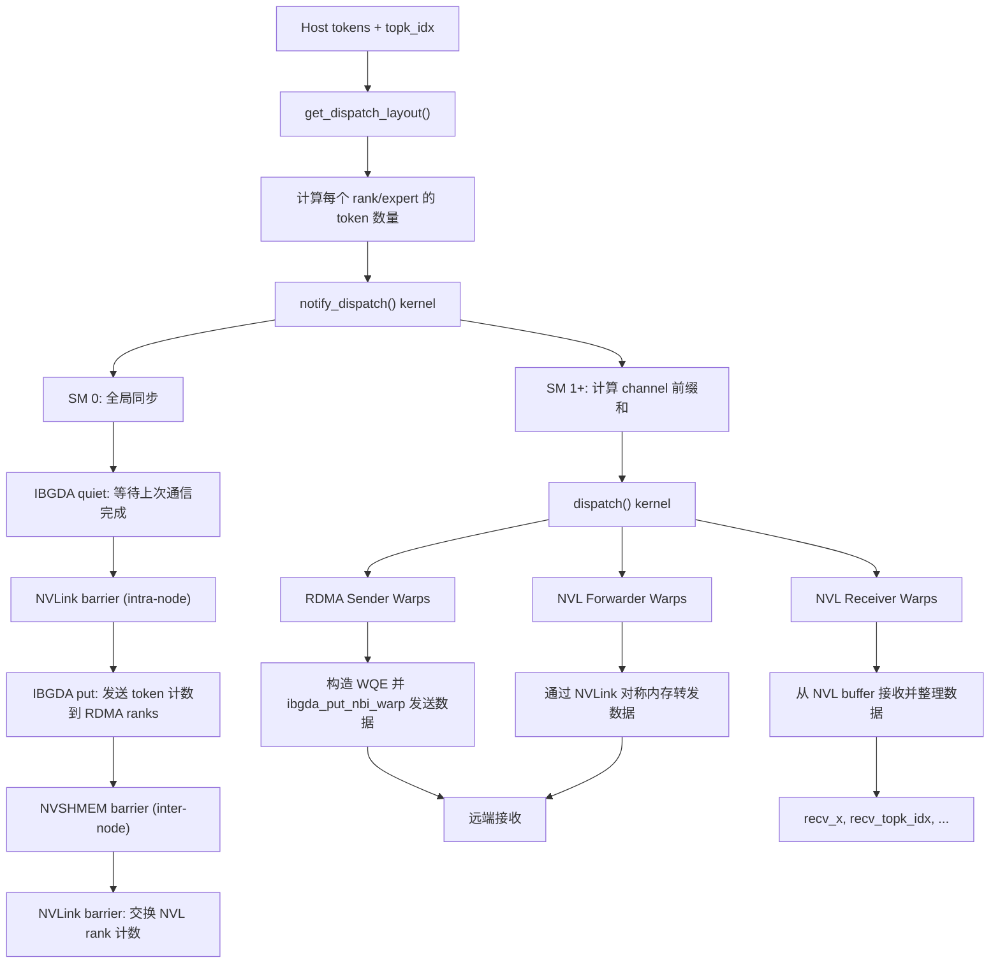
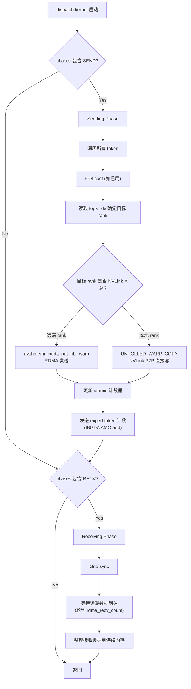
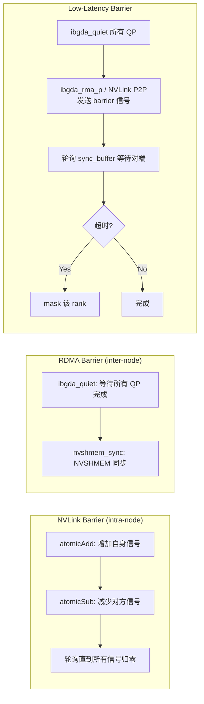
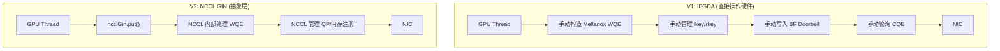
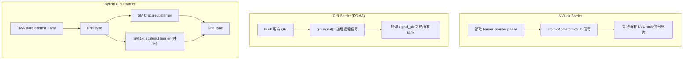
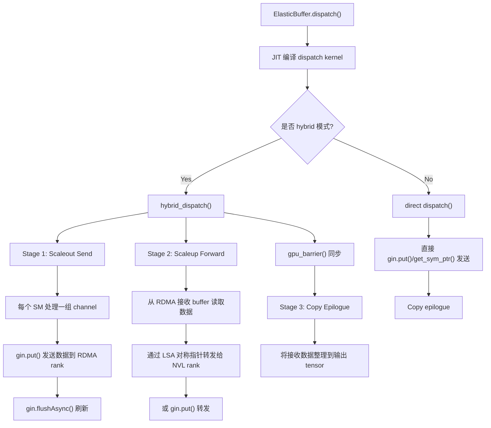
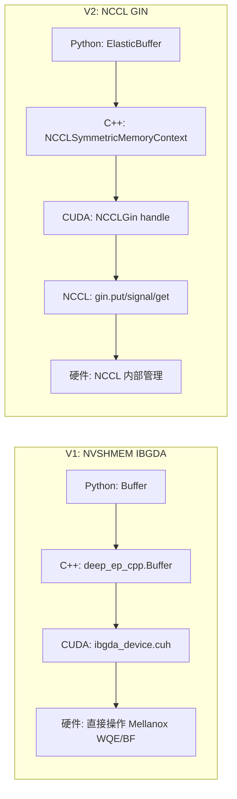
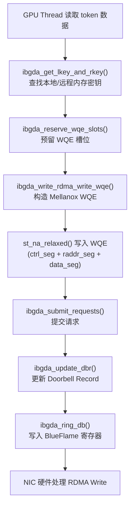
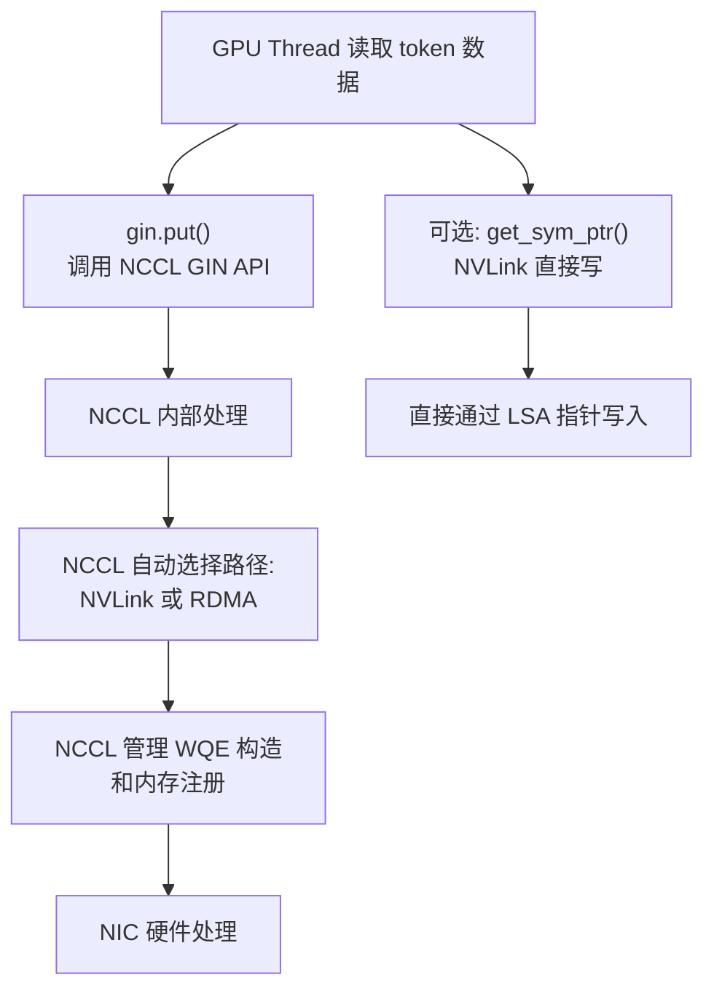
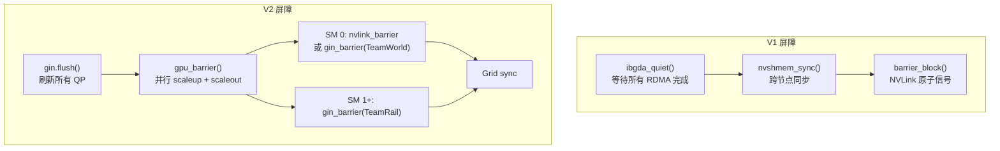

# DeepEP 通信机制深度解析

## 目录

1. [概述](#1-概述)
2. [V1: NVSHMEM IBGDA 通信后端](#2-v1-nvshmem-ibgda-通信后端)
3. [V2: NCCL GIN 通信后端 (epv2-release)](#3-v2-nccl-gin-通信后端-epv2-release)
4. [V1 vs V2 对比分析](#4-v1-vs-v2-对比分析)
5. [附录: 关键术语表](#5-附录-关键术语表)

---

## 1. 概述

DeepEP 是一个面向 MoE (Mixture-of-Experts) 专家并行的高性能通信库，提供 GPU all-to-all kernel (dispatch 和 combine)。项目经历了两个大版本的通信后端演进：

| | V1 (main 分支) | V2 (epv2-release 分支) |
|---|---|---|
| **通信后端** | NVSHMEM + IBGDA | NCCL Gin |
| **RDMA 机制** | GPU 直接构造 Mellanox WQE | NCCL Gin 抽象层 |
| **NVLink 通信** | CUDA 虚拟内存共享 + 自定义屏障 | NCCL LSA (Local Shared Address) 对称指针 |
| **编译方式** | 预编译 (setup.py) | JIT 运行时编译 |
| **API 风格** | 分离的高吞吐/低延迟接口 | 统一的 ElasticBuffer 接口 |

---

## 2. V1: NVSHMEM IBGDA 通信后端

### 2.1 IBGDA 原理

**IBGDA** (InfiniBand GPUDirect RDMA Async) 是 NVSHMEM 提供的一种**GPU 发起的 RDMA 通信机制**，允许 GPU 线程直接在设备端构造 InfiniBand Work Queue Entry (WQE) 并提交到网卡，无需 CPU 介入。

#### 核心思想

传统 RDMA 通信流程：
```
GPU -> CPU (发起通信请求) -> NIC (RDMA 操作) -> 远端 NIC -> 远端 GPU 内存
```

IBGDA 通信流程：
```
GPU 直接构造 WQE -> NIC (RDMA 操作) -> 远端 NIC -> 远端 GPU 内存
```

#### 关键技术要素

| 要素 | 说明 |
|---|---|
| **QP (Queue Pair)** | InfiniBand 可靠连接，每对 rank 间有独立的发送/接收队列 |
| **WQE (Work Queue Entry)** | 描述一次 RDMA 操作的工作队列条目，由 GPU 直接在显存中构造 |
| **DBR (Doorbell Record)** | 通知 NIC 有新 WQE 的机制，GPU 通过 memory-mapped I/O 写入 |
| **BF (BlueFlame)** | Mellanox 网卡的 doorbell 寄存器，GPU 直接写入触发发送 |
| **LKey/RKey** | 本地/远程内存注册密钥，用于 RDMA 访问验证 |
| **CQE (Completion Queue Entry)** | 操作完成通知，GPU 通过轮询 CQ 确认完成 |

### 2.2 IBGDA 代码实现详解

IBGDA 的核心实现位于 `csrc/kernels/ibgda_device.cuh`，该文件从 NVSHMEM 源码修改而来。

#### 2.2.1 字节序转换

RDMA 操作需要网络字节序 (Big-Endian)，而 GPU 使用 Little-Endian，因此需要高效转换：

```cuda
// 64位主机序到网络序 (ibgda_device.cuh:20-36)
__device__ static __forceinline__ uint64_t HtoBE64(uint64_t x) {
    uint64_t ret;
    asm("{\n\t"
        ".reg .b32 lo, hi, new_lo, new_hi, ign;\n\t"
        "mov.b64 {lo,hi}, %1;\n\t"
        "prmt.b32 new_hi, lo, ign, 0x0123;\n\t"  // 字节重排
        "prmt.b32 new_lo, hi, ign, 0x0123;\n\t"
        "mov.b64 %0, {new_lo,new_hi};\n\t"
        "}" : "=l"(ret) : "l"(x));
    return ret;
}
```

#### 2.2.2 QP 管理

每个 rank 对应多个 QP (Queue Pair)，用于并行通信：

```cuda
// 获取到目标 rank 的 RC (Reliable Connection) QP (ibgda_device.cuh:93-96)
__device__ static __forceinline__ nvshmemi_ibgda_device_qp_t* ibgda_get_rc(int pe, int id) {
    auto state = ibgda_get_state();
    return ibgda_get_rc_impl(state, pe, id);
}
```

v1/v2 的 QP 实现差异 (支持 NVSHMEM v1/v2 两种状态结构):
```cuda
// ibgda_device.cuh:80-91
template <typename StateType>
__device__ static __forceinline__ nvshmemi_ibgda_device_qp_t* ibgda_get_rc_impl(...) {
    const auto num_rc_per_pe = state->num_rc_per_pe;
    if constexpr (std::is_same_v<StateType, nvshmemi_ibgda_device_state_v1>) {
        return &state->globalmem.rcs[pe * num_rc_per_pe * ... + id % ...];
    } else {
        return &state->globalmem.rcs[pe + npes * id];
    }
}
```

#### 2.2.3 WQE 构造与发送

**RDMA Write WQE** — 用于发送大块数据:

```cuda
// ibgda_device.cuh:291-330
__device__ static __forceinline__ void ibgda_write_rdma_write_wqe(
    nvshmemi_ibgda_device_qp_t* qp,
    uint64_t laddr, __be32 lkey,     // 本地地址和密钥
    uint64_t raddr, __be32 rkey,     // 远程地址和密钥
    uint32_t bytes,                   // 传输字节数
    uint16_t wqe_idx, void** out_wqes) {
    
    // 构造 Mellanox 硬件 WQE 段:
    // 1. ctrl_seg: 控制段 (操作码、QP号等)
    // 2. raddr_seg: 远程地址段
    // 3. data_seg: 数据段 (本地地址和长度)
    
    ctrl_seg.opmod_idx_opcode = HtoBE32((wqe_idx << 8) | MLX5_OPCODE_RDMA_WRITE);
    raddr_seg.raddr = HtoBE64(raddr);
    data_seg.byte_count = HtoBE32(bytes);
    data_seg.lkey = lkey;
    data_seg.addr = HtoBE64(laddr);
    
    // 使用 relaxed store 写入 WQE (不破坏缓存)
    st_na_relaxed(ctrl_seg_ptr, ...);
    st_na_relaxed(raddr_seg_ptr, ...);
    st_na_relaxed(data_seg_ptr, ...);
}
```

**RDMA Write Inline WQE** — 用于小数据量 (如通知信号):

```cuda
// ibgda_device.cuh:180-213
__device__ static __forceinline__ void ibgda_write_rdma_write_inl_wqe(...) {
    // 内联数据直接嵌入 WQE，无需额外数据段
    // 适用于 < 4 字节的信号传输
    inl_seg.byte_count = HtoBE32(4 | MLX5_INLINE_SEG);
    ctrl_seg.opmod_idx_opcode = HtoBE32(
        (wqe_idx << 8) | (有imm ? MLX5_OPCODE_RDMA_WRITE_IMM : MLX5_OPCODE_RDMA_WRITE));
}
```

#### 2.2.4 内存密钥管理

IBGDA 需要管理本地和远程内存的注册密钥：

```cuda
// ibgda_device.cuh:215-243
__device__ static __forceinline__ uint64_t ibgda_get_lkey_and_rkey(...) {
    // 基于 NVSHMEM heap 地址偏移计算密钥索引
    uint64_t idx = ((laddr - heap_start) >> log2_cumem_granularity) * num_devices_initialized + dev_idx;
    auto device_key = state->constmem.lkeys[idx];  // 本地密钥 (编译时常量内存)
    
    // 远程密钥 (可能在常量内存或全局内存中)
    idx = ((roffset >> ...) * npes) * num_devices_initialized + dst_pe * ...;
    if (idx < NVSHMEMI_IBGDA_MAX_CONST_RKEYS)
        device_key = state->constmem.rkeys[idx];   // 常量内存 (快速路径)
    else
        device_key = state->globalmem.rkeys[idx];  // 全局内存 (慢速路径)
    
    // 返回本地/远程 chunk 的最小值 (处理跨 chunk 的情况)
    return min(lchunk_size, rchunk_size);
}
```

#### 2.2.5 Warp 级 Put 操作

`nvshmemi_ibgda_put_nbi_warp` 是最核心的批量数据传输原语，整个 warp 协作发送：

```cuda
// ibgda_device.cuh:346-391
template <bool kAlwaysDoPostSend = false>
__device__ static __forceinline__ void nvshmemi_ibgda_put_nbi_warp(
    uint64_t req_rptr, uint64_t req_lptr, size_t bytes,
    int dst_pe, int qp_id, int lane_id, int message_idx) {
    
    // 1. 每个 lane 计算一段数据的 lkey/rkey
    //    因为内存可能跨注册 chunk 边界，最多拆成3段
    auto qp = ibgda_get_rc(dst_pe, qp_id);
    while (remaining_bytes > 0) {
        if (lane_id == num_wqes)
            my_chunk_size = min(remaining_bytes, ibgda_get_lkey_and_rkey(...));
        chunk_size = __shfl_sync(0xffffffff, my_chunk_size, num_wqes);
        remaining_bytes -= chunk_size;
        ++num_wqes;
    }
    
    // 2. Lane 0 预留 WQE 槽位
    base_wqe_idx = ibgda_reserve_wqe_slots(qp, num_wqes);
    base_wqe_idx = __shfl_sync(0xffffffff, base_wqe_idx, 0);
    
    // 3. 每个 lane 写入各自的 WQE
    if (lane_id < num_wqes) {
        auto wqe_ptr = ibgda_get_wqe_ptr(qp, wqe_idx);
        ibgda_write_rdma_write_wqe(qp, my_laddr, my_lkey, my_raddr, my_rkey, ...);
    }
    __syncwarp();
    
    // 4. Lane 0 提交请求
    if (lane_id == 0)
        ibgda_submit_requests<kAlwaysDoPostSend>(qp, base_wqe_idx, num_wqes, message_idx);
    __syncwarp();
}
```

#### 2.2.6 Doorbell 机制

```cuda
// ibgda_device.cuh:130-136 — Ring Doorbell
__device__ static __forceinline__ void ibgda_ring_db(...) {
    auto bf_ptr = reinterpret_cast<uint64_t*>(qp->tx_wq.bf);  // BlueFlame 寄存器
    // 构造 ctrl segment 并写入 BF 寄存器
    ibgda_ctrl_seg_t ctrl_seg = {
        .opmod_idx_opcode = HtoBE32(prod_idx << 8),
        .qpn_ds = HtoBE32(qp->qpn << 8)
    };
    st_na_release(bf_ptr, *(reinterpret_cast<uint64_t*>(&ctrl_seg)));
}

// ibgda_device.cuh:138-151 — Post Send (完整提交流程)
__device__ static __forceinline__ void ibgda_post_send(...) {
    ibgda_lock_acquire(&mvars->post_send_lock);     // 获取锁
    old_prod_idx = atomicMax(&mvars->tx_wq.prod_idx, new_prod_idx);
    if (new_prod_idx > old_prod_idx) {
        ibgda_update_dbr(qp, new_prod_idx);  // 更新 Doorbell Record
        ibgda_ring_db(qp, new_prod_idx);      // 敲响 BlueFlame 寄存器
    }
    ibgda_lock_release(&mvars->post_send_lock);     // 释放锁
}
```

#### 2.2.7 完成确认 (CQ Polling)

```cuda
// ibgda_device.cuh:475-496
__device__ static __forceinline__ void ibgda_poll_cq(...) {
    // 轮询完成队列，检查 WQE 是否已被硬件处理
    do {
        wqe_counter = HtoBE16(ld_na_relaxed(&cqe64->wqe_counter));
    } while ((idx - wqe_counter - 2) < ncqes);  // 等待直到指定 WQE 完成
    *cq->cons_idx = idx;
}

// ibgda_device.cuh:499-504 — Quiet: 等待所有发送完成
__device__ static __forceinline__ void nvshmemi_ibgda_quiet(int dst_pe, int qp_id) {
    auto qp = ibgda_get_rc(dst_pe, qp_id);
    uint64_t prod_idx = ld_na_relaxed(qp->tx_wq.prod_idx);
    ibgda_poll_cq(qp->tx_wq.cq, prod_idx);  // 阻塞等待
}
```

### 2.3 NVSHMEM 运行时初始化

初始化位于 `csrc/kernels/runtime.cu`：

```cuda
// runtime.cu:49-73
int init(const std::vector<uint8_t>& root_unique_id_val, int rank, int num_ranks, ...) {
    // 1. 使用 NVSHMEM unique ID 初始化
    nvshmemx_set_attr_uniqueid_args(rank, num_ranks, &root_unique_id, &attr);
    nvshmemx_init_attr(NVSHMEMX_INIT_WITH_UNIQUEID, &attr);
    
    // 2. 低延迟模式: 创建子 RDMA team
    if (low_latency_mode and num_ranks > NUM_MAX_NVL_PEERS) {
        nvshmem_team_split_strided(NVSHMEM_TEAM_WORLD,
            rank % NUM_MAX_NVL_PEERS, NUM_MAX_NVL_PEERS,
            num_ranks / NUM_MAX_NVL_PEERS, ...);
    }
    
    // 3. 全局屏障
    nvshmem_barrier_all();
    return nvshmem_my_pe();
}
```

### 2.4 Python 层 IBGDA 配置

在 `deep_ep/buffer.py` 中，Buffer 初始化时配置 IBGDA 环境变量：

```python
# buffer.py:106-122
if self.runtime.get_num_rdma_ranks() > 1 or low_latency_mode:
    os.environ['NVSHMEM_DISABLE_P2P'] = '0'         # 启用 NVLink P2P
    os.environ['NVSHMEM_IB_ENABLE_IBGDA'] = '1'      # 启用 IBGDA
    os.environ['NVSHMEM_IBGDA_NUM_RC_PER_PE'] = f'{num_qps_per_rank}'  # QP数量
    os.environ['NVSHMEM_QP_DEPTH'] = str(self.nvshmem_qp_depth)        # QP深度
    os.environ['NVSHMEM_MAX_TEAMS'] = '7'             # 减少team数节省内存
    os.environ['NVSHMEM_DISABLE_NVLS'] = '1'          # 禁用 NVLink SHArP
    os.environ['NVSHMEM_CUMEM_GRANULARITY'] = f'{2 ** 29}'  # 内存粒度 512MB
```

### 2.5 V1 Normal 模式通信流程

Normal 模式用于训练和推理预填充，采用**非对称域转发** (asymmetric-domain forwarding)。



#### Normal 模式 Dispatch 详细步骤

1. **Notify 阶段** (`notify_dispatch` kernel, `internode.cu`):
   - SM 0 负责全局同步和计数交换
   - 先 `ibgda_quiet` 等待上次 RDMA 操作完成
   - 通过 `nvshmem_sync` 和 `nvshmemi_ibgda_put_nbi_warp` 将 token 计数发送给所有 RDMA rank
   - 通过 NVLink `barrier_block` 在同节点 rank 间交换计数
   - SM 1+ 计算 channel 级别的 token 前缀和

2. **Data Dispatch 阶段** (`dispatch` kernel, `internode.cu`):
   - 多个 SM 并行工作，每个 SM 处理一个 channel
   - **RDMA Sender Warps**: 将 token 数据写入对称 buffer，通过 `nvshmemi_ibgda_put_nbi_warp` 发送给远端 RDMA rank
   - **NVL Forwarder Warps**: 将 RDMA 接收到的数据通过 NVLink 转发给同节点的其他 rank
   - **NVL Receiver Warps**: 从 NVL buffer 中接收并整理数据

### 2.6 V1 Low-Latency 模式通信流程

Low-Latency 模式用于推理解码，使用**纯 RDMA** 通信。



#### Low-Latency 关键设计

- **无 CPU 同步**: 所有操作在 GPU 完成，支持 CUDA graph
- **按 expert 分配 warp group**: 每个 warp group 负责一个 expert
- **双 buffer 轮换**: 只有 2 个 buffer 轮换使用
- **超时与容错**: 支持动态 rank masking (`mask_buffer_ptr`)

### 2.7 V1 内存管理

#### NVLink Buffer (CUDA Virtual Memory)

```cuda
// deep_ep.cpp: SharedMemoryAllocator
// 使用 CUDA Virtual Memory API 分配跨 GPU 可见的内存
cuMemCreate(&handle, size, &prop);        // 创建物理内存分配
cuMemAddressReserve(ptr, size, ...);       // 预留虚拟地址空间
cuMemMap(ptr, size, 0, handle, 0);         // 映射物理到虚拟
cuMemSetAccess(ptr, size, access_desc, ...); // 设置所有 GPU 可访问
```

所有同节点 GPU 共享同一块虚拟地址，通过 NVLink P2P 直接读写。

#### RDMA Buffer (NVSHMEM Symmetric Memory)

```cuda
// runtime.cu:76
void* alloc(size_t size, size_t alignment) {
    return nvshmem_align(alignment, size);  // NVSHMEM 对称内存分配
}
```

所有 rank 的 RDMA buffer 在相同偏移处可被远程访问，通过 IBGDA 进行 RDMA 读写。

### 2.8 V1 通信屏障机制



---

## 3. V2: NCCL GIN 通信后端 (epv2-release)

### 3.1 NCCL GIN 原理

**NCCL GIN** (Global InfiniBand Network) 是 NVIDIA NCCL 2.30+ 提供的**设备端通信抽象层**，允许 GPU 线程通过统一的 API 进行 NVLink 和 RDMA 通信，无需直接操作硬件 WQE。

#### GIN 核心概念

| 概念 | 说明 |
|---|---|
| **ncclGin** | GIN 设备端句柄，封装 QP 资源，提供 `put`/`get`/`signal`/`flush` 等 API |
| **ncclTeam** | 通信组抽象: `TeamWorld` (全局), `TeamLsa` (NVLink 本地), `TeamRail` (同 GPU 位置的跨节点 rank) |
| **ncclWindow** | 对称内存窗口，类似 NVSHMEM 的 symmetric heap |
| **LSA (Local Shared Address)** | NVLink 域内的对称地址空间，支持直接指针访问 |
| **ncclDevComm** | 设备端通信器，包含 GIN 上下文和 QP 资源 |

#### GIN vs IBGDA 的本质区别



### 3.2 GIN 代码实现详解

#### 3.2.1 Backend 抽象层

V2 引入了 backend 抽象，支持多种通信后端 (`csrc/kernels/backend/api.cuh`):

```cuda
namespace deep_ep::nccl {
    // NCCL GIN 后端
    pybind11::bytearray get_local_unique_id();
    int64_t create_nccl_comm(...);
    std::tuple<int, int> get_physical_domain_size(...);  // RDMA/NVL rank 数
    std::tuple<int, int> get_logical_domain_size(...);   // scaleout/scaleup rank 数
    
    struct NCCLSymmetricMemoryContext { ... };  // 对称内存上下文
}

namespace deep_ep::nvshmem {
    // NVSHMEM 后端 (兼容 V1)
    void* alloc(...);
    void barrier(...);
}

namespace deep_ep::cuda_driver {
    // CUDA Driver 后端 (批量内存操作)
    void batched_write(...);
    void batched_wait(...);
}
```

#### 3.2.2 NCCL Communicator 初始化

```cuda
// backend/nccl.cu
int64_t create_nccl_comm(const pybind11::bytearray& root_unique_id_bytes,
                         const int& num_ranks, const int& rank_idx) {
    ncclUniqueId root_unique_id;
    std::memcpy(&root_unique_id, root_unique_id_str.c_str(), sizeof(ncclUniqueId));
    
    ncclComm_t comm;
    NCCL_CHECK(ncclCommInitRank(&comm, num_ranks, root_unique_id, rank_idx));
    return reinterpret_cast<int64_t>(comm);
}
```

#### 3.2.3 NCCLSymmetricMemoryContext — 对称内存管理

这是 V2 的核心数据结构，管理 NCCL GIN 的对称内存窗口：

```cuda
// backend/nccl.cu
NCCLSymmetricMemoryContext::NCCLSymmetricMemoryContext(
    const int64_t& nccl_comm, ..., const int& num_allocated_qps) {
    
    // 1. 复用已有 NCCL 通信器
    comm = reinterpret_cast<ncclComm_t>(nccl_comm);
    
    // 2. 查询 GIN 类型 (检查是否可用)
    ncclCommProperties props;
    NCCL_CHECK(ncclCommQueryProperties(comm, &props));
    EP_HOST_ASSERT(props.railedGinType != NCCL_GIN_TYPE_NONE && "GIN unavailable");
    
    // 3. 创建设备端通信器 (请求 GIN 资源)
    ncclDevCommRequirements_t reqs = {};
    reqs.ginContextCount = num_allocated_qps;    // QP 数量
    reqs.ginExclusiveContexts = true;             // 独占模式
    reqs.ginQueueDepth = 1024;                    // WQ 深度
    reqs.ginTrafficClass = sl_idx;                // 服务级别 (VL)
    reqs.ginSignalCount = num_ranks + 4;          // 信号数量 (用于屏障)
    reqs.ginConnectionType = allow_hybrid_mode ?
        NCCL_GIN_CONNECTION_RAIL : NCCL_GIN_CONNECTION_FULL;  // 连接类型
    NCCL_CHECK(ncclDevCommCreate(comm, &reqs, &dev_comm));
    
    // 4. 查询域信息
    num_nvl_ranks = dev_comm.lsaSize;   // NVLink 域大小
    nvl_rank_idx = dev_comm.lsaRank;    // 本 rank 在 NVLink 域的索引
    num_rdma_ranks = num_ranks / num_nvl_ranks;
    
    // 5. 分配对称内存并注册窗口
    NCCL_CHECK(ncclMemAlloc(&raw_window_ptr, size));
    NCCL_CHECK(ncclCommWindowRegister(comm, raw_window_ptr, size, &window, NCCL_WIN_DEFAULT));
    
    // 6. 获取 LSA 映射指针 (NVLink 域内直接访问)
    NCCL_CHECK(ncclGetLsaDevicePointer(window, 0, nvl_rank_idx, &mapped_window_ptr));
    
    // 7. 获取所有 NVLink 对等 rank 的指针
    for (int i = 0; i < num_nvl_ranks; ++i)
        NCCL_CHECK(ncclGetLsaDevicePointer(window, 0, i, &nvl_window_ptrs[i]));
}
```

#### 3.2.4 NCCLGin Handle — 设备端操作封装

`deep_ep/include/deep_ep/common/handle.cuh` 中定义了 `NCCLGin` 结构体，封装了所有 GIN 设备端操作：

```cuda
struct NCCLGin {
    ncclGin gin;              // GIN 句柄
    ncclTeam team_world, team_lsa, team_rail;  // 通信组
    
    // 初始化: 从设备通信器获取 GIN 和 Team
    __device__ NCCLGin(const ncclDevComm_t& nccl_dev_comm,
                       const ncclWindow_t& nccl_window,
                       const int& qp_idx = 0, ...) :
        gin(ncclGin(nccl_dev_comm, qp_idx, resource_sharing_mode)),
        team_world(ncclTeamWorld(nccl_dev_comm)),
        team_lsa(ncclTeamLsa(nccl_dev_comm)),
        team_rail(ncclTeamRail(nccl_dev_comm)) { ... }
```

**对称指针获取**:
```cuda
    // 获取跨 rank 对称指针 (NVLink 可达时返回直接指针，否则返回 nullptr)
    template <typename team_t, typename dtype_t>
    __device__ dtype_t* get_sym_ptr(dtype_t* ptr, const int& dst_rank_idx) const {
        if (not is_nvlink_accessible<team_t>(dst_rank_idx))
            return nullptr;  // 需要 RDMA
        
        // 转换为 NVLink 域内 rank 索引
        const auto dst_nvl_rank_idx = ...;
        return ncclGetLsaPointer(nccl_window, get_sym_offset(ptr), dst_nvl_rank_idx);
    }
```

**Put 操作**:
```cuda
    // 统一的数据发送 API
    template <typename team_t>
    __device__ void put(void* recv_sym_ptr, void* send_sym_ptr,
                        const int& num_bytes, const int& dst_rank_idx, ...) {
        // NCCL GIN 处理路由: NVLink 或 RDMA 自动选择
        gin.put(TEAM_WORLD_RAIL(), dst_rank_idx,
                nccl_window, recv_offset,
                nccl_window, send_offset,
                num_bytes, ...);
    }
```

**Signal 操作 (原子远程更新)**:
```cuda
    // 远程原子加 (用于屏障和通知)
    template <typename team_t, typename dtype_t>
    __device__ void red_add_rel(dtype_t* sym_ptr, const dtype_t& value,
                                const int& dst_rank_idx, ...) {
        const auto dst_ptr = get_sym_ptr<team_t>(sym_ptr, dst_rank_idx);
        if (dst_ptr != nullptr) {
            // NVLink 可达: 直接原子操作
            ptx::red_add_rel_sys(dst_ptr, value);
        } else {
            // RDMA: 使用 GIN signal
            gin.signal(TEAM_WORLD_RAIL(), dst_rank_idx,
                       ncclGin_VASignalAdd(nccl_window, offset, value), ...);
        }
    }
```

#### 3.2.5 GIN QP 资源共享模式

```cuda
// common/comm.cuh
template <int kNumSMs, int kNumQPs, int kNumChannelsPerSM>
__device__ __forceinline__ std::pair<int, ncclGinResourceSharingMode> get_qp_mode(
    const int& sm_idx, const int& channel_in_sm_idx, ...) {
    
    constexpr auto kSharingCTA = NCCL_GIN_RESOURCE_SHARING_CTA;  // CTA 独占
    constexpr auto kSharingGPU  = NCCL_GIN_RESOURCE_SHARING_GPU;  // GPU 共享
    
    if constexpr (kNumQPs == 1)
        return {0, kSharingGPU};
    
    if constexpr (kNumSMs <= kNumAvailableQPs) {
        // 每个 SM 独占一个 QP
        return {kQPStartIdx + sm_idx + ..., kSharingCTA};
    } else {
        // 所有 SM 共享所有 QP
        return {kQPStartIdx + (global_channel_idx % kNumAvailableQPs), kSharingGPU};
    }
}
```

### 3.3 V2 屏障机制

V2 实现了更灵活的多级屏障：



关键代码 (`common/comm.cuh`):

```cuda
// 统一的 GPU barrier — scaleup 和 scaleout 并行执行
template <bool kIsScaleupNVLink, int kNumScaleoutRanks, int kNumScaleupRanks, ...>
__forceinline__ __device__ void gpu_barrier(const handle::NCCLGin& gin, ...) {
    // TMA store flush
    ptx::tma_store_commit();
    ptx::tma_store_wait();
    cooperative_groups::this_grid().sync();
    
    if (do_scaleup and do_scaleout) {
        // 并行: SM 0 做 scaleup barrier, 其余 SM 做 scaleout barrier
        if (sm_idx == 0)
            scaleup_barrier_wo_local_sync<...>(gin, workspace, ...);
        else
            scaleout_barrier_wo_local_sync<...>(gin, ...);
    }
    
    cooperative_groups::this_grid().sync();
}
```

### 3.4 V2 Hybrid Dispatch 流程

V2 的 dispatch 支持 hybrid 模式 (scaleout + scaleup)：



### 3.5 V2 JIT 编译

V2 引入了完整的 JIT (Just-In-Time) 编译框架：

```cuda
// csrc/jit/compiler.hpp
// 根据 MoE 参数 (hidden, num_topk, num_ranks 等) 在运行时编译最优 kernel
struct Compiler {
    std::string generate_kernel_code(...);   // 生成 CUDA kernel 代码
    nvrtcProgram compile(...);              // NVRTC 编译
    CUmodule load_module(...);              // 加载 CUDA module
    CUfunction get_function(...);           // 获取 kernel 函数
};
```

优势:
- 针对具体参数特化 kernel (消除运行时分支)
- 无需安装时编译 CUDA 代码
- 支持动态 hidden/topk/expert 配置

---

## 4. V1 vs V2 对比分析

### 4.1 通信后端对比



### 4.2 核心差异对比表

| 维度 | V1 (IBGDA) | V2 (NCCL GIN) |
|---|---|---|
| **硬件抽象** | 直接构造 Mellanox WQE | NCCL GIN 抽象层 |
| **QP 管理** | 手动通过 NVSHMEM 环境变量配置 | `ncclDevCommCreate` 请求资源 |
| **内存注册** | NVSHMEM 对称内存 + lkey/rkey 手动管理 | `ncclMemAlloc` + `ncclCommWindowRegister` |
| **NVLink 访问** | CUDA Virtual Memory + IPC handle | NCCL LSA 指针 (`ncclGetLsaPointer`) |
| **RDMA Put** | `nvshmemi_ibgda_put_nbi_warp` (warp 协作构造 WQE) | `gin.put()` (单线程调用) |
| **RDMA 原子** | `nvshmemi_ibgda_amo_nonfetch_add` (构造 AMO WQE) | `gin.signal(ncclGin_VASignalAdd(...))` |
| **完成等待** | `ibgda_poll_cq` (轮询 CQE) | `gin.flushAsync()` + `gin.wait()` |
| **屏障** | 自定义 NVLink barrier + nvshmem_sync | GIN signal barrier + NVLink atomic barrier |
| **依赖库** | NVSHMEM v3.3.9+ | NCCL 2.30.4+ |
| **编译** | 安装时预编译 | 运行时 JIT |
| **SM 数量** | 最多 24 SM | 4-6 SM |
| **性能** | 超过硬件带宽的 80-90% | 高达 1.3x V1 峰值 |

### 4.3 数据路径对比

#### V1 数据发送路径 (IBGDA)



#### V2 数据发送路径 (NCCL GIN)



### 4.4 内存管理对比

| | V1 | V2 |
|---|---|---|
| **NVLink Buffer** | CUDA Virtual Memory API (`cuMemCreate` + `cuMemMap`) | NCCL `ncclMemAlloc` + `ncclCommWindowRegister` |
| **RDMA Buffer** | NVSHMEM `nvshmem_align` | NCCL `ncclMemAlloc` (统一) |
| **跨 rank 访问** | IPC handle 交换 + `cuMemOpen` | LSA 指针 (`ncclGetLsaDevicePointer`) |
| **密钥管理** | 手动查表 (constmem/globalmem rkeys) | NCCL 自动管理 (隐藏在 window 中) |

### 4.5 屏障同步对比



V2 的关键优势: **scaleup 和 scaleout 屏障并行执行**，而不是串行。

### 4.6 API 对比

#### V1 API

```python
# 创建 buffer (需要手动指定 buffer 大小)
buf = Buffer(group, num_nvl_bytes=..., num_rdma_bytes=..., low_latency_mode=False)

# Normal 模式
num_tokens_per_rank, ..., is_token_in_rank, event = buf.get_dispatch_layout(topk_idx, num_experts)
recv_x, ..., handle, event = buf.dispatch(x, ..., num_tokens_per_rank, is_token_in_rank, ...)
combined_x, ..., event = buf.combine(x, handle=handle, ...)

# Low-Latency 模式 (完全不同的 API)
recv_x, recv_count, handle, event, hook = buf.low_latency_dispatch(x, topk_idx, ...)
combined_x, event, hook = buf.low_latency_combine(x, topk_idx, topk_weights, handle, ...)
```

#### V2 API

```python
# 创建 buffer (根据 MoE 参数自动计算大小)
buf = ElasticBuffer(group, num_max_tokens_per_rank=..., hidden=..., num_topk=..., ...)

# 统一 API (高吞吐和低延迟合并)
recv_x, recv_topk_idx, recv_topk_weights, handle, event = buf.dispatch(
    x, topk_idx=topk_idx, topk_weights=topk_weights, num_experts=..., ...)
combined_x, _, event = buf.combine(x, handle=handle, ...)

# Handle 缓存 (推理解码优化)
recv_x, _, _, handle, event = buf.dispatch(x, handle=cached_handle, ...)
```

### 4.7 性能对比

根据 README 中的数据:

| 配置 | V1 Dispatch BW | V2 Dispatch BW | V1 SMs | V2 SMs |
|---|---|---|---|---|
| EP 8 (NVLink) | 153 GB/s | 643-726 GB/s* | 20 | 24-64 |
| EP 16 (RDMA) | 43 GB/s | ~61 GB/s (EP 8x4) | 20 | 6 |
| EP 32 (RDMA) | 58 GB/s | - | 20 | - |

*V2 SM100 数据，V1 在 SM90 上测试。V2 在相同 SM90 平台上可达 V1 的 1.3x 峰值。

---

## 5. 附录: 关键术语表

| 术语 | 全称 | 说明 |
|---|---|---|
| **IBGDA** | InfiniBand GPUDirect RDMA Async | NVSHMEM 的 GPU 发起 RDMA 机制 |
| **GIN** | Global InfiniBand Network | NCCL 的设备端通信抽象层 |
| **QP** | Queue Pair | InfiniBand 可靠连接的发送/接收队列对 |
| **WQE** | Work Queue Entry | 描述一次 RDMA 操作的条目 |
| **BF** | BlueFlame | Mellanox 网卡的 doorbell 直接写入机制 |
| **DBR** | Doorbell Record | 通知 NIC 有新 WQE 的共享记录 |
| **CQE** | Completion Queue Entry | 操作完成通知条目 |
| **LSA** | Local Shared Address | NCCL NVLink 域内的对称地址空间 |
| **LKey** | Local Key | 本地内存注册密钥 |
| **RKey** | Remote Key | 远程内存注册密钥 |
| **NVLink** | NVIDIA NVLink | NVIDIA 高速 GPU 互联 |
| **RDMA** | Remote Direct Memory Access | 远程直接内存访问 |
| **MoE** | Mixture of Experts | 混合专家模型 |
| **EP** | Expert Parallelism | 专家并行 |
| **JIT** | Just-In-Time Compilation | 运行时即时编译 |
| **TMA** | Tensor Memory Accelerator | Hopper 架构的异步内存拷贝引擎 |
| **SM** | Streaming Multiprocessor | GPU 流式多处理器 |
| **CTA** | Cooperative Thread Array | GPU 线程块 (即 CUDA block) |
| **NVL** | NVLink | 同义词，指 NVLink 域内通信 |
