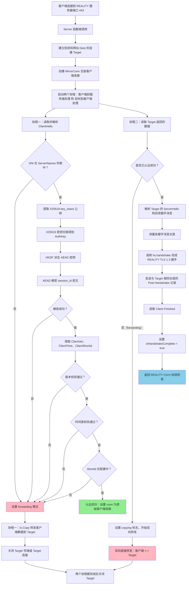
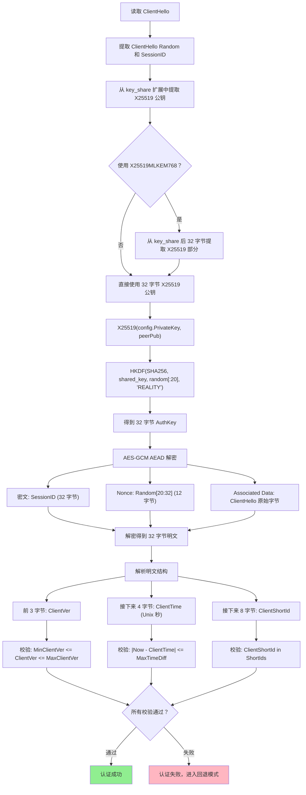
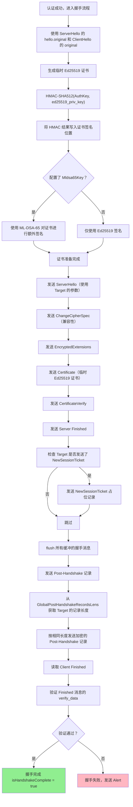
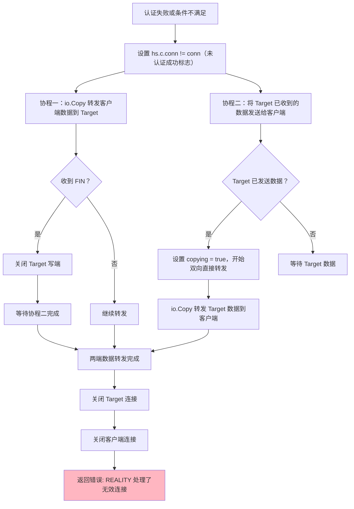
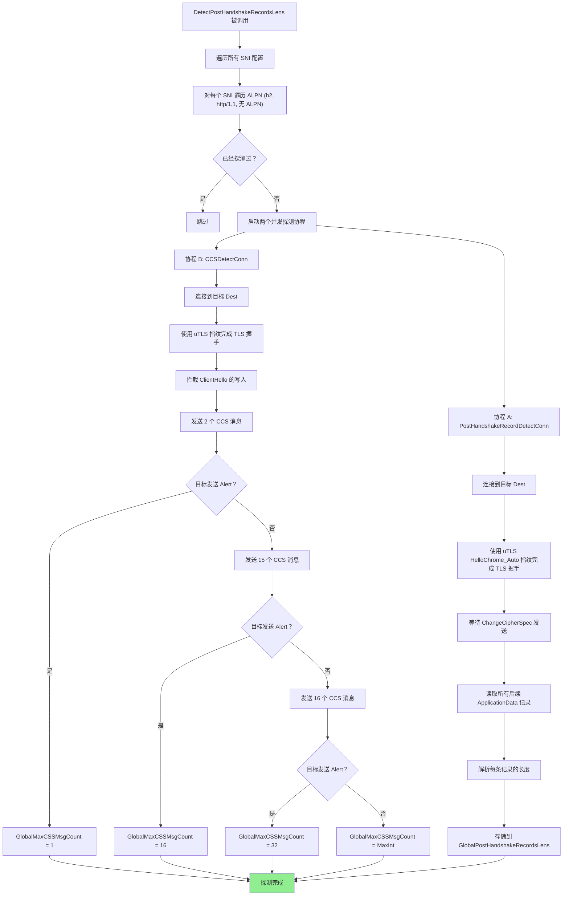
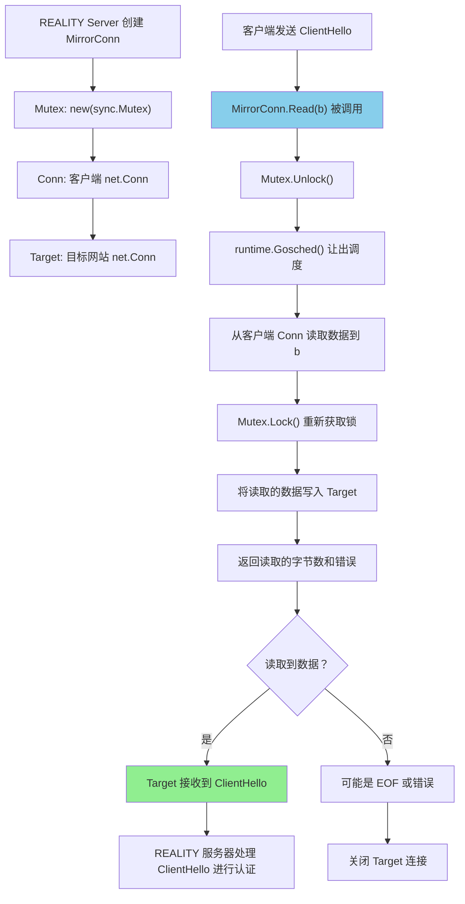

# REALITY 协议详解

## 目录

- "一、协议概述"
- "二、设计目的与动机"
- "三、核心功能"
- "四、协议架构"
- "五、关键设计权衡"
- "六、认证与加密机制"
- "七、核心数据结构"
- "八、重要流程详解"
- "九、回退机制"
- "十、记录探测机制"
- "十一、后量子密码学支持"
- "十二、安全考虑"
- "十三、与标准 TLS 的差异"
- "十四、配置参数说明"

---

## 一、协议概述

"REALITY 是一种服务器端 TLS 协议实现，是 Go 标准库 crypto/tls 包（基于 Go 1.24.0）的一个分支。它的核心目标是彻底消除服务器端可被检测的 TLS 指纹特征，同时保持前向安全性（Forward Secrecy），并防御证书链攻击。REALITY 协议的安全性超越了传统 TLS。"

"REALITY 协议由 XTLS/Project X 团队维护，主要作为 Xray-core 项目的传输安全层使用。与传统的 TLS 部署不同，REALITY 不需要购买域名或配置 TLS 服务器，它可以直接指向其他已有的网站，利用目标网站的真实 TLS 特征来伪装自身。"

"在 REALITY 模式下，服务端表现得像一个普通的端口转发——对于任何中间观察者而言，REALITY 服务器的流量与直接访问目标网站（SNI 指定的目标）的流量完全无法区分。这使得 REALITY 实现了完整的、与指定 SNI 目标无法区分的真实 TLS。"

---

## 二、设计目的与动机

### 2.1 传统 TLS 部署的局限性

"在传统的 TLS 部署中，服务器需要拥有自己的域名和有效的 TLS 证书。这带来了几个问题："

"第一，域名和证书是可被识别的。任何网络观察者都可以通过检查 TLS 握手过程中的 ServerHello 和 Certificate 消息，识别出该服务器使用的证书信息、域名信息以及 TLS 指纹特征。这些特征可以被用于流量分类、检测甚至封锁。"

"第二，证书链攻击。当中间人（MITM）能够替换服务器的证书时，传统的 TLS 客户端可能无法察觉。例如，某些网络环境中的代理设备会安装自定义的根证书，对经过的 TLS 连接进行中间人解密和检查。"

"第三，部署成本。使用传统 TLS 需要购买域名、配置证书（或使用 Let's Encrypt 等免费证书服务但需要定期续签），增加了部署和维护的复杂度。"

### 2.2 REALITY 的解决方案

"REALITY 通过以下设计解决上述问题："

"REALITY 服务端不需要自己的域名或证书。当认证的客户端连接时，服务器使用临时的、一次性生成的 Ed25519 密钥对签发临时可信证书。当未认证的连接到达时，所有流量被原样转发到目标网站（如 example.com:443），使得服务器在观察者看来只是一个端口转发器。"

"REALITY 的认证机制基于 X25519 密钥交换和 AEAD 加密的隐藏载荷。只有持有正确私钥的服务器才能解密并验证客户端身份，这个过程对中间观察者完全不可见——它看起来就像正常的 X25519 密钥交换。"

"REALITY 在握手完成后，会精确模仿目标网站的 Post-Handshake 记录长度和 ChangeCipherSpec 行为，使得认证通过的连接在流量模式上也与目标网站无法区分。"

---

## 三、核心功能

### 3.1 零指纹 TLS 服务器

"REALITY 服务端不暴露任何可被用于 TLS 指纹识别的特征。具体而言："

"在标准 TLS 握手中，服务器的 ServerHello 消息包含固定的版本号、密码套件选择、扩展列表等信息，这些组合起来形成了独特的服务器 TLS 指纹。REALITY 通过以下方式消除指纹："

"REALITY 服务器在认证通过后，不会发送自己的 ServerHello 和证书链。相反，它先连接到目标网站，读取目标网站返回的 ServerHello 消息及其后续握手消息的长度信息，然后使用临时 Ed25519 密钥生成的临时证书来完成与客户端的 TLS 1.3 握手。握手完成后，REALITY 服务器还会发送与目标网站相同长度的 Post-Handshake 记录。因此，从客户端的角度来看，它收到的是一个看起来正常的 TLS 1.3 握手，而从网络观察者的角度来看，服务器的行为与目标网站完全一致。"

### 3.2 前向安全性

"REALITY 使用 X25519（或 X25519MLKEM768）密钥交换实现前向安全性。每次握手都使用临时密钥，即使长期私钥在未来被泄露，也无法解密过去的通信记录。"

### 3.3 证书链攻击防御

"REALITY 客户端设计为只接受临时可信证书（由临时认证密钥签发）。如果客户端收到目标网站的真实证书（说明连接被重定向到目标或被中间人拦截），客户端会进入爬虫模式而非代理模式。如果收到无效证书，客户端会发送 TLS Alert 并断开连接。这种设计使得 REALITY 客户端能够区分正常代理连接、重定向连接和中间人攻击。"

### 3.4 无缝回退机制

"当 REALITY 服务器无法认证客户端（例如客户端没有使用 REALITY 协议、使用了错误的密钥、SNI 不匹配等），所有流量会被双向透明转发到目标网站。这使得非 REALITY 客户端（如普通浏览器）访问 REALITY 服务器时，会直接看到目标网站的内容，服务器表现得像一个简单的端口转发器。"

### 3.5 后量子密码学支持

"REALITY 支持 ML-DSA-65（基于 Cloudflare CIRCL 库的后量子数字签名算法）作为证书的额外签名。这为 TLS 证书提供了后量子级别的安全性保障，抵御未来量子计算机可能带来的威胁。"

---

## 四、协议架构

### 4.1 整体架构

"REALITY 协议由以下核心组件构成："

"服务器入口（tls.go）：Server 函数是 REALITY 服务端的入口点，负责接收连接、创建 MirrorConn、启动认证流程和握手流程。"

"连接层（conn.go）：Conn 结构体封装了 net.Conn，实现了 TLS 记录层的读写、加密解密、握手协调等功能。halfConn 结构体表示单向（发送或接收）的记录层状态。"

"配置层（common.go）：Config 结构体扩展了 Go 标准库的 tls.Config，增加了 REALITY 特有的字段，包括目标地址、私钥、服务器名列表、短 ID 列表、客户端版本限制等。"

"握手层（handshake_server_tls13.go）：serverHandshakeStateTLS13 实现了 TLS 1.3 服务端握手状态机，包含 REALITY 特有的修改。"

"记录探测层（record_detect.go）：负责探测目标服务器的 Post-Handshake 记录长度和 ChangeCipherSpec 行为。"

"REALITY 协议的文件结构如下："

```
github.com/xtls/reality/
├── tls.go                          # 主入口点：Server(), Client(), NewListener()
├── conn.go                         # Conn 结构体，记录层，握手协调
├── common.go                       # Config 结构体，常量，版本协商
├── handshake_server_tls13.go       # TLS 1.3 服务端握手（REALITY 核心修改）
├── handshake_client.go             # 标准 TLS 客户端握手
├── handshake_messages.go           # 握手消息序列化/反序列化
├── record_detect.go                # 目标服务器探测
├── alert.go                        # TLS Alert 定义
├── cipher_suites.go                # 密码套件定义
├── auth.go                         # 签名验证
├── ech.go                          # 加密客户端 Hello 支持
├── quic.go                         # QUIC 传输集成
├── ticket.go                       # 会话票据/恢复
├── defaults.go                     # 默认曲线、签名算法、密码套件
├── cache.go                        # 证书缓存
├── prf.go                          # 伪随机函数
├── key_schedule.go                 # 密钥调度
├── tls13/                          # TLS 1.3 密钥调度
├── tls12/                          # TLS 1.2 PRF 和扩展主密钥
├── hpke/                           # HPKE (RFC 9180)
└── fips140tls/                     # FIPS 140-3 模式执行
```

### 4.2 关键连接类型

"MirrorConn：镜像连接。这是一个特殊的 net.Conn 包装器，在读取客户端数据的同时，将读取到的数据同步写入到目标连接。这确保了客户端发送的 ClientHello 等数据会被转发到目标网站，同时 REALITY 服务器也能读取并处理这些数据。"

"RatelimitedConn：限速连接。这是一个带有令牌桶速率限制的 net.Conn 包装器，用于对回退模式下的连接进行速率限制，防止滥用。"

"PostHandshakeRecordDetectConn：后握手记录探测连接。用于探测目标网站在 TLS 握手完成后发送的记录长度。"

"CCSDetectConn：ChangeCipherSpec 探测连接。用于探测目标网站对多个 ChangeCipherSpec 消息的容忍度。"

---

## 五、关键设计权衡

### 5.1 目标网站的选择

"REALITY 要求目标网站满足以下条件："

"目标网站必须支持 TLSv1.3 和 HTTP/2（H2）。这是因为 REALITY 模拟的是 TLS 1.3 握手，如果目标不支持 TLS 1.3，REALITY 服务器将无法获取正确的 ServerHello 来完成与客户端的握手。"

"目标域名不应被用于重定向（主域名可能会被重定向到 www 前缀的版本）。这是因为 REALITY 在认证通过后会维持与客户端的 TLS 连接，如果目标网站返回重定向响应，客户端可能无法正确处理。"

"目标网站的 IP 地址最好与 REALITY 服务器 IP 地址接近（地理位置和网络延迟上），这样看起来更加合理，延迟也更低。"

"目标网站如果在 Server Hello 之后的握手消息是加密传输的（如 dl.google.com），这是一个加分项，因为这进一步增加了 REALITY 模仿的真实性。"

### 5.2 回退模式的流量限制

"REALITY 支持对回退连接（未认证通过、转发到目标的连接）进行速率限制。这是通过 LimitFallbackUpload 和 LimitFallbackDownload 配置项实现的，使用令牌桶算法控制上传和下载的速率。"

"然而，REALITY 文档明确警告：速率限制本身是一个可检测的模式。如果所有回退连接都表现出相同的限速行为，这可能成为一种指纹特征。因此，REALITY 建议脚本开发者和 Web 面板开发者随机化这些参数，避免形成可识别的模式。"

### 5.3 临时证书的安全性

"REALITY 使用预生成的临时 Ed25519 密钥对在 init() 函数中生成临时证书。这个证书在程序启动时生成一次，然后被所有连接复用。证书的内容通过 HMAC-SHA512 和 AuthKey 进行动态修改，使得每次握手产生的证书签名不同。"

"这种设计的权衡是："

"优点：不需要外部 CA 签发证书，不需要配置证书文件，完全自包含。"

"缺点：临时证书的私钥在内存中是固定的，如果内存被泄露，攻击者可以伪造临时证书。但考虑到 REALITY 客户端只信任由临时认证密钥签发的证书，这种攻击的实际影响有限。"

### 5.4 不使用标准 Go TLS 测试

"REALITY 仓库中没有包含任何测试文件（_test.go）。上游 Go crypto/tls 的测试也没有被包含进来。这意味着对 REALITY 代码的修改需要格外谨慎，因为没有自动化测试来验证正确性。"

---

## 六、认证与加密机制

### 6.1 X25519 密钥交换

"REALITY 的认证过程始于标准的 TLS 1.3 X25519 密钥交换。客户端在 ClientHello 的 key_share 扩展中发送 X25519 公钥。REALITY 服务器使用配置的长期私钥与客户端公钥进行 X25519 运算，得到共享密钥。"

"具体步骤："

"REALITY 服务器从客户端的 ClientHello 中提取 X25519 key_share（32 字节公钥）。"

"如果客户端使用 X25519MLKEM768（混合后量子密钥交换），则从 key_share 的后 32 字节提取 X25519 公钥部分。"

"使用 curve25519.X25519(config.PrivateKey, peerPub) 计算共享密钥。"

"使用 HKDF（基于 SHA-256）对共享密钥进行密钥派生，派生输入包括共享密钥本身、ClientHello Random 的前 20 字节，以及标签 "REALITY"。"

### 6.2 AEAD 解密隐藏载荷

"派生出的 AuthKey 被用作 AES-GCM AEAD 的密钥。ClientHello 的 session_id 字段（32 字节）实际上是 AEAD 的密文，其明文结构如下："

```
session_id 明文结构（32 字节）:
┌─────────────────────────────────────────────────────────┐
│ ClientVer (3 字节) │ ClientTime (4 字节) │ ShortId (8 字节) │  其余填充
│                    │   Unix 时间戳       │              │
└─────────────────────────────────────────────────────────┘
```

"AEAD 的 nonce 是 ClientHello Random 的后 12 字节（从第 20 字节开始），associated data 是 ClientHello 的原始字节。"

"解密成功后，REALITY 服务器从明文中提取三个关键字段："

"ClientVer（3 字节）：客户端的 Xray 版本号，格式为 x.y.z 的三个字节编码。"

"ClientTime（4 字节）：客户端的当前时间，以大端序编码的 Unix 时间戳（秒）。"

"ClientShortId（8 字节）：客户端的短 ID，用于区分不同的客户端。"

### 6.3 认证校验

"解密并提取字段后，REALITY 服务器执行以下校验："

"ServerName 校验：客户端在 ClientHello 中指定的 SNI 必须在配置文件的 ServerNames 列表中。"

"ClientVer 校验：如果配置了 MinClientVer，客户端版本必须大于等于最小值；如果配置了 MaxClientVer，客户端版本必须小于等于最大值。"

"ClientTime 校验：如果配置了 MaxTimeDiff，客户端时间与服务器当前时间的差值必须不超过该阈值。"

"ShortId 校验：ClientShortId 必须在配置的 ShortIds 集合中。"

"所有校验通过后，连接被认证成功，进入 REALITY 握手流程。否则，连接进入回退模式。"

---

## 七、核心数据结构

### 7.1 Config 结构体（REALITY 特有字段）

"Config 是 REALITY 服务端的核心配置结构，除了继承 Go 标准库 tls.Config 的所有字段外，还增加了以下 REALITY 特有的字段："

```
REALITY 特有配置字段:

Show (bool):                          调试输出开关。如果为 true，打印详细的握手过程信息。
Type (string):                        目标连接的类型，如 "tcp"。
Dest (string):                        目标地址，如 "example.com:443"。
Xver (byte):                          PROXY 协议版本。0 表示不使用，1 或 2 表示使用对应版本。
ServerNames (map[string]bool):        允许的 SNI（服务器名）集合。
PrivateKey ([]byte):                  X25519 私钥，32 字节。
MinClientVer ([]byte):                客户端最小版本限制，3 字节。
MaxClientVer ([]byte):                客户端最大版本限制，3 字节。
MaxTimeDiff (time.Duration):          允许的最大客户端时间差。
ShortIds (map[[8]byte]bool):          允许的短 ID 集合。
Mldsa65Key ([]byte):                  ML-DSA-65 后量子签名私钥。
LimitFallbackUpload (LimitFallback):  回退连接上传速率限制。
LimitFallbackDownload (LimitFallback): 回退连接下载速率限制。
```

### 7.2 Conn 结构体（REALITY 特有字段）

```
REALITY 特有连接字段:

AuthKey ([]byte):         认证成功后得到的 X25519 共享密钥派生值。
ClientVer ([3]byte):      客户端的版本号。
ClientTime (time.Time):   客户端的时间戳。
ClientShortId ([8]byte):  客户端的短 ID。
MaxUselessRecords (int):  最大允许的无用记录数（用于处理 post-handshake 消息）。
```

### 7.3 LimitFallback 结构体

```
LimitFallback:

AfterBytes (uint64):       开始限速前允许的字节数。
BytesPerSec (uint64):      基础速率（字节/秒）。
BurstBytesPerSec (uint64): 突发速率上限（字节/秒），必须大于等于 BytesPerSec。
```

---

## 八、重要流程详解

### 8.1 REALITY 服务端完整流程

"以下流程图展示了 REALITY 服务端从接收连接到完成握手（或回退）的完整流程："



### 8.2 客户端认证详细流程

"以下流程图详细展示了 REALITY 服务端的客户端认证过程："



### 8.3 TLS 1.3 REALITY 握手流程

"以下流程图展示了认证成功后，REALITY 服务端完成 TLS 1.3 握手的详细过程："



### 8.4 回退模式流程

"以下流程图展示了认证失败时的回退模式："



---

## 九、记录探测机制

### 9.1 为什么需要记录探测

"在 TLS 1.3 中，Server Finished 消息之后，服务器可能会发送额外的 Post-Handshake 记录，如 NewSessionTicket 消息。不同的目标网站发送的 Post-Handshake 记录数量和长度各不相同。"

"REALITY 为了精确模仿目标网站的 TLS 行为，需要事先了解目标网站的 Post-Handshake 记录特征。这就是记录探测机制的作用。"

### 9.2 探测流程

"记录探测通过 DetectPostHandshakeRecordsLens 函数实现，该函数在 REALITY Listener 启动时自动调用（也可以手动调用）。"

"探测针对每个 SNI 和 ALPN 组合（h2、http/1.1、无 ALPN）执行：

"第一步，PostHandshakeRecordDetectConn 探测：连接到目标网站，完成 TLS 1.3 握手，记录 ChangeCipherSpec 之后收到的所有 ApplicationData 类型记录的长度。这些长度信息存储到 GlobalPostHandshakeRecordsLens 中。"

"第二步，CCSDetectConn 探测：连接到目标网站，在握手过程中发送不同数量的 ChangeCipherSpec 消息（2 个、15 个、16 个），观察目标网站是否会在收到过多 CCS 消息后发送 Alert。探测结果存储到 GlobalMaxCSSMsgCount 中。"

"探测结果的使用："

"在 REALITY 握手完成后，服务器从 GlobalPostHandshakeRecordsLens 中查找对应 Dest+SNI+ALPN 的记录长度列表，然后按相同长度构造并发送 Post-Handshake 记录。"

"如果探测未完成（值为 false），REALITY 会在 5 秒后回退到使用 GlobalMaxCSSMsgCount 中的 CCS 容忍度信息。"

### 9.3 探测流程图



---

## 十、MirrorConn 设计

### 10.1 MirrorConn 的作用

"MirrorConn 是 REALITY 协议中最关键的创新之一。它是一个 net.Conn 的包装器，具有以下特殊行为："

"当读取数据时，MirrorConn 从底层客户端连接读取数据，同时将读取到的数据写入到目标连接。这使得客户端发送的所有数据都被镜像（mirror）到目标网站。"

"MirrorConn 使用 sync.Mutex 进行同步，确保读取和写入操作的顺序可控。在 Read 操作中，先 Unlock 释放锁，执行 Read，然后重新 Lock，最后写入目标。这种设计确保了处理 ClientHello 的 goroutine 在写入目标之前有优先权进行下一步操作。"

"MirrorConn 的 Write 和 Close 方法被设计为始终返回错误，这是为了防止误用——MirrorConn 只应该被用于读取（并镜像），不应该被用于主动写入客户端。"

### 10.2 MirrorConn 流程图



---

## 十一、后量子密码学支持

### 11.1 X25519MLKEM768 密钥交换

"REALITY 支持 X25519MLKEM768 混合后量子密钥交换机制。这是 X25519 经典密钥交换与 ML-KEM-768（基于模块格的后量子密钥封装机制）的组合。"

"X25519MLKEM768 的 key_share 数据由两部分组成："

"前 1152 字节：ML-KEM-768 封装密钥（EncapsulationKeySize768）。"

"后 32 字节：X25519 公钥。"

"在服务端处理时，共享密钥由 ML-KEM 共享密钥（32 字节）和 X25519 共享密钥（32 字节）拼接而成，共 64 字节。"

### 11.2 ML-DSA-65 证书签名

"REALITY 支持使用 ML-DSA-65（Module-Lattice-Based Digital Signature Algorithm）对证书进行额外签名。这是 NIST 后量子密码标准化的结果。"

"当配置了 Mldsa65Key 时，REALITY 生成的临时证书会包含一个额外的扩展（OID 0.0），其中存放 ML-DSA-65 签名。签名的输入是 HMAC-SHA512(AuthKey, ClientHello || ServerHello) 的摘要。"

"这种设计提供了双重保护：Ed25519 签名提供了经典的椭圆曲线安全性，ML-DSA-65 签名提供了后量子安全性。"

---

## 十二、安全考虑

### 12.1 前向安全性

"REALITY 使用前向安全的 X25519 密钥交换。每次连接都使用客户端的临时密钥和服务端的长期私钥进行密钥交换。由于客户端密钥是临时的，即使服务端的长期私钥在未来被泄露，攻击者也无法使用它来解密过去的通信——因为缺少客户端的临时私钥。"

### 12.2 重放攻击防护

"REALITY 通过以下机制防护重放攻击："

"ClientTime 校验：客户端发送的时间戳与服务器当前时间的差值受到 MaxTimeDiff 限制。旧的 ClientHello 会因为时间戳过期而被拒绝。"

"Random 作为 AEAD nonce：ClientHello 的 Random 字段被用作 AEAD 解密的 nonce，确保每个 ClientHello 都是唯一的。"

"ShortId 校验：短 ID 可以用于标识特定的客户端，如果某个 ShortId 被发现被重用或泄露，可以从 ShortIds 配置中移除它。"

### 12.3 回退模式的安全性

"在回退模式下，REALITY 服务器将客户端与目标网站之间的流量直接转发。这种转发是透明的，REALITY 服务器不会解密或修改任何流量。这意味着："

"回退模式下的连接使用目标网站的真实 TLS 证书，与直接访问目标网站完全相同。"

"速率限制（如果启用）可能被检测到，因此建议随机化限速参数。"

"PROXY 协议（如果启用）会将客户端的真实 IP 地址传递给目标网站。"

### 12.4 已知的安全限制

"REALITY 的临时证书私钥（ed25519Priv）在程序启动时生成一次并在整个程序生命周期中复用。这意味着如果攻击者能够获取该私钥，他们可以在整个程序运行期间伪造临时证书。然而，这仅影响 REALITY 客户端（因为非 REALITY 客户端不验证临时证书）。"

"REALITY 不处理 TLS 1.2 及更早版本的连接。如果客户端不支持 TLS 1.3，连接将被拒绝。"

"REALITY 的认证机制依赖于 X25519 密钥交换的隐蔽性。如果分析者能够区分正常的 X25519 密钥交换和 REALITY 的认证密钥交换，可能会暴露 REALITY 的存在。但在实践中，这种区分在标准 TLS 流量中是极其困难的。"

---

## 十三、与标准 TLS 的差异

### 13.1 主要差异

| 特性 | 标准 TLS 1.3 | REALITY |
|------|-------------|---------|
| 服务端证书 | 使用预配置的 X.509 证书链 | 使用临时 Ed25519 证书（可选 ML-DSA-65 额外签名） |
| 认证机制 | 无（或客户端证书认证） | 基于 X25519 + AEAD 的隐藏认证 |
| ServerHello | 服务端自主生成 | 从目标网站读取参数后伪造 |
| Post-Handshake | 按服务端自身逻辑生成 | 精确模仿目标网站的记录长度 |
| 未认证连接 | 拒绝连接 | 转发到目标网站（回退模式） |
| 记录层 | 标准处理 | 增加了握手消息长度测量和模仿 |
| 速率限制 | 不支持 | 可选的回退连接速率限制 |
| PROXY 协议 | 不支持 | 可选的 PROXY 协议支持 |

### 13.2 代码差异点

"REALITY 在以下关键位置修改了标准 Go TLS 代码："

"Server 函数（tls.go）：替换了标准的 Server 函数实现，增加了 REALITY 特有的认证和转发逻辑。"

"serverHandshakeStateTLS13.handshake（handshake_server_tls13.go）：注释掉了标准的 processClientHello、checkForResumption、pickCertificate 调用，替换为 REALITY 特有的处理逻辑。"

"serverHandshakeStateTLS13.sendServerParameters：注释掉了标准的 ServerHello 写入，替换为直接使用预先准备好的 hello.original 数据。"

"conn.go 的 encrypt 方法：增加了 REALITY 特有的握手消息长度模仿逻辑（handshakeLen 数组）。"

"record_detect.go：全新文件，实现目标服务器探测机制。"

---

## 十四、配置参数说明

### 14.1 必需参数

```
privateKey (string):     X25519 私钥。通过 xray x25519 命令生成。
shortIds ([]string):     允许的短 ID 列表。可以是空字符串或 2-16 个十六进制字符（0-f）。
serverNames ([]string):  允许的 SNI 列表。不支持 * 通配符。
target (string):         目标地址，格式为 "example.com:443"。
```

### 14.2 可选参数

```
show (bool):             调试输出开关。默认 false。
xver (int):              PROXY 协议版本。默认 0（不使用）。
minClientVer (string):   客户端最低版本，格式 "x.y.z"。
maxClientVer (string):   客户端最高版本，格式 "x.y.z"。
maxTimeDiff (int):       最大时间差，单位毫秒。默认 0（不限制）。
mldsa65Seed (string):    ML-DSA-65 种子。通过 xray mldsa65 命令生成。
limitFallbackUpload:     回退上传限速。afterBytes: 开始限速前字节数；bytesPerSec: 基础速率；burstBytesPerSec: 突发上限。
limitFallbackDownload:   回退下载限速。格式同上。
```

### 14.3 客户端对应参数

```
password (string):       服务端私钥对应的公钥（客户端用作密码）。
shortId (string):        服务端短 ID 之一。
serverName (string):     服务端 SNI 之一。
fingerprint (string):    uTLS 指纹模拟，默认 "chrome"。
spiderX (string):        爬虫初始路径和参数，建议每个客户端不同。
mldsa65Verify (string):  服务端 mldsa65Seed 对应的公钥，用于证书后量子验证。
```
