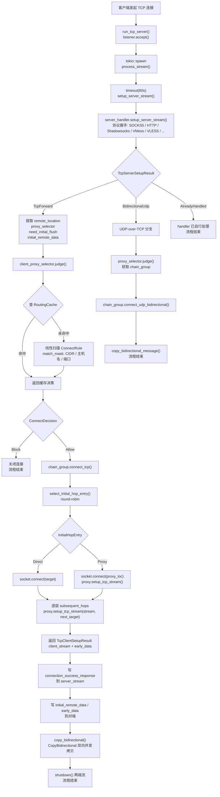
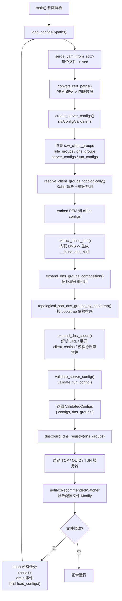
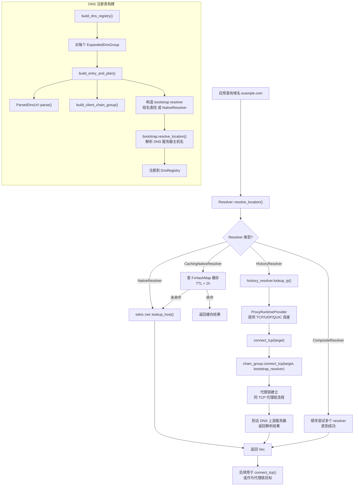
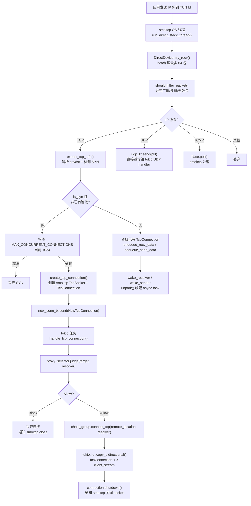
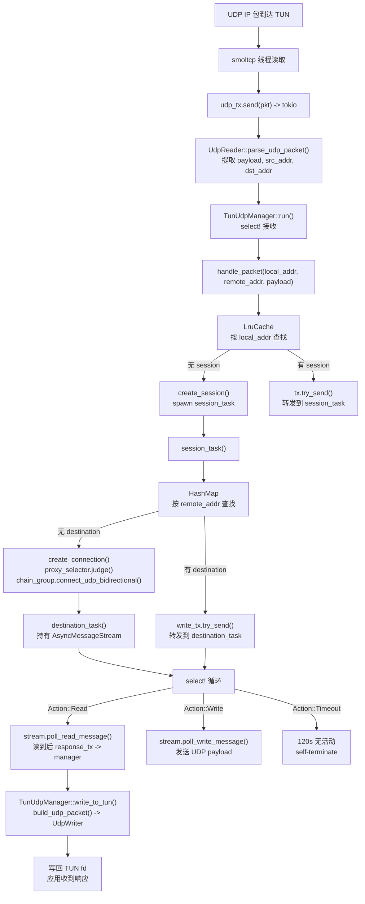
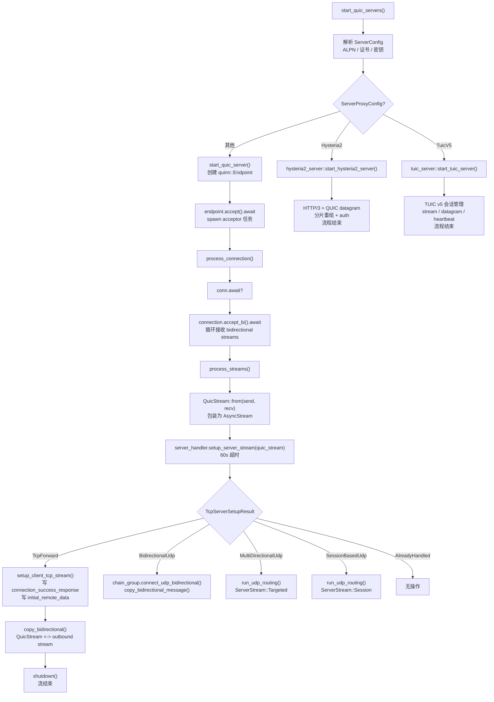
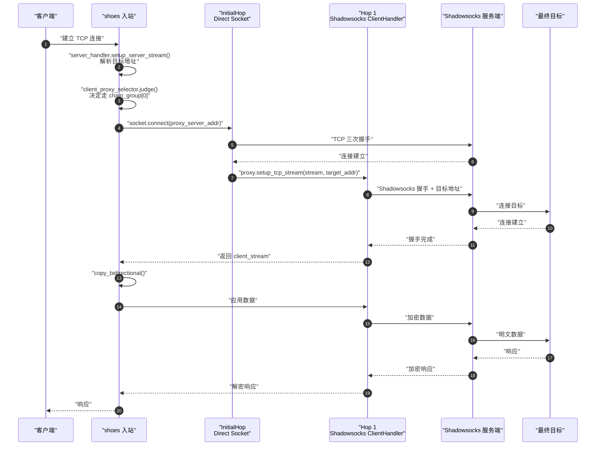
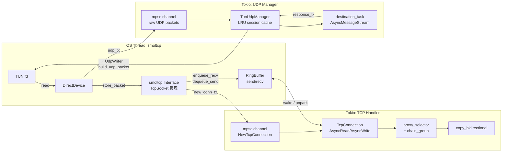

# 关键流程与流程图

本文档用 Mermaid 流程图展示 `shoes` 中最重要的端到端流程。

> **语法约定**：所有流程图节点文本均用双引号包裹，确保渲染兼容性。

---

## TCP 代理链完整流程

从外部客户端建立一条 TCP 连接，到通过代理链访问远程目标，再到双向数据转发的完整生命周期。

### 关键文件与行号参考

| 阶段 | 文件 | 关键函数/行 |
|------|------|------------|
| Accept | `src/tcp/tcp_server.rs` | `run_tcp_server` ~L30 |
| Per-connection | `src/tcp/tcp_server.rs` | `process_stream` ~L121 |
| Server setup | `src/tcp/tcp_handler.rs` | `TcpServerHandler` ~L72 |
| Routing | `src/client_proxy_selector.rs` | `judge` ~L283 |
| Chain build | `src/tcp/chain_builder.rs` | `build_client_proxy_chain` ~L19 |
| Chain exec | `src/client_proxy_chain.rs` | `connect_tcp` ~L242 |
| Bidirectional copy | `src/copy_bidirectional.rs` | `copy_bidirectional` ~L294 |

---

## 配置加载与校验流程

从 YAML 文件到运行时 `ValidatedConfigs` 的完整转换链。

---

## DNS 解析与代理链路由流程

一条 DNS 查询如何被解析，以及 DNS 上游如何走代理链。

---

## TUN TCP 流程

TUN 设备模式下，一个 TCP  SYN 包如何被拦截、经过代理链、到达远端。

---

## TUN UDP 流程

TUN 模式下 UDP 包不走 smoltcp socket，而是直接通过 session-manager 路由。

---

## QUIC 服务器连接处理流程

QUIC endpoint 接受连接后，如何复用现有 TCP 协议 handler 处理 bidirectional streams。

---

## 代理链连接建立时序

以一条两跳代理链（直连 -> Shadowsocks -> 目标）为例，展示时序。

---

## TUN / VPN 三线程数据交换

展示 smoltcp 线程、TCP handler task、UDP manager task 之间的协作关系。

