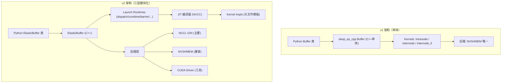
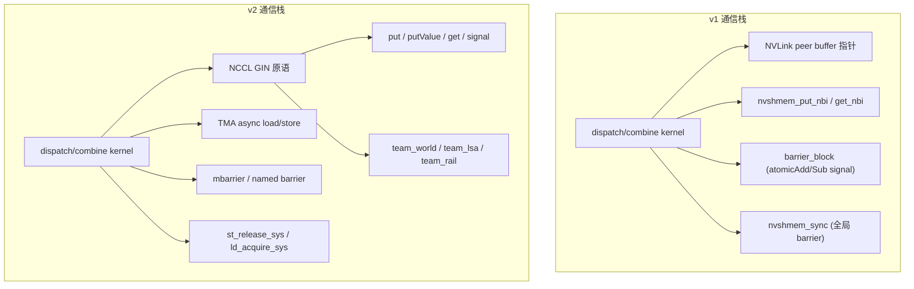
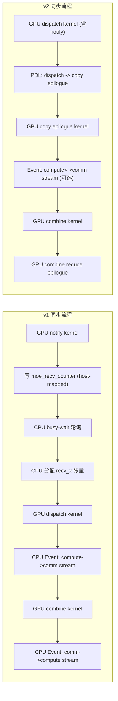
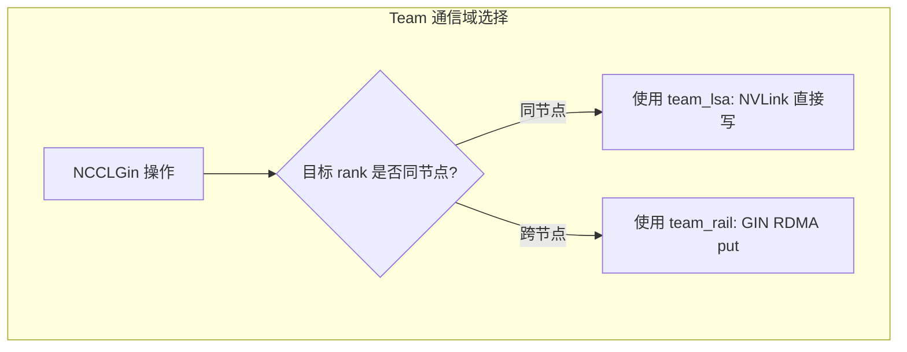
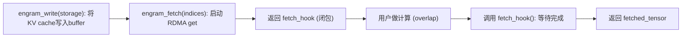
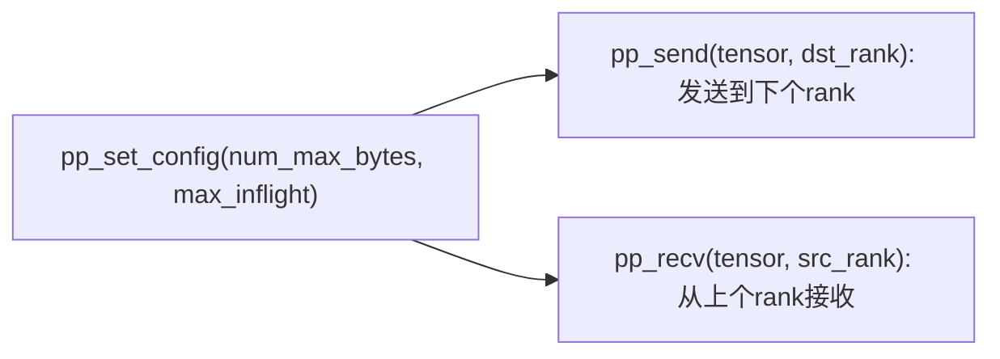
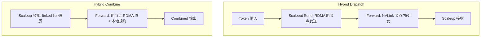

# DeepEP v1 vs v2 通信机制全面对比分析

> 基于 main 分支 (v1) 与 epv2-release 分支 (v2) 代码全面阅读对比

---

## 概述

DeepEP v1 和 v2 的核心目标相同——为 MoE (Mixture-of-Experts) 模型提供高性能的 all-to-all 通信（dispatch 和 combine）。但 v2 在架构上进行了根本性的重写，引入了全新的后端抽象、JIT 编译系统、弹性通信能力，并将版本从 1.2.1 提升到 2.0.0。

本文档从**通信机制**的角度，系统性地对比两个版本的异同。

---

## 一、整体架构对比

### 1.1 模块结构

| 层面 | v1 (main) | v2 (epv2-release) |
|------|-----------|-------------------|
| Python 包 | `deep_ep/` 单模块 | `deep_ep/` 子包结构 |
| Python 入口 | `Buffer` (deep_ep/buffer.py) | `ElasticBuffer` + `Buffer`(legacy) + `EPHandle` |
| C++ 绑定 | `csrc/deep_ep.cpp` → `deep_ep_cpp` | `csrc/python_api.cpp` → `deep_ep._C` |
| C++ 核心 | `deep_ep::Buffer` (单体) | `legacy::Buffer` + `elastic::ElasticBuffer` |
| 内核目录 | `csrc/kernels/` | `csrc/kernels/legacy/` + `csrc/kernels/elastic/` |
| 内核实现 | `.cu` 文件预编译 | `.cuh` 头文件 JIT 编译 |

### 1.2 架构层次对比



---

## 二、通信流程对比

### 2.1 Dispatch（分发）整体流程

```mermaid
flowchart TD
    subgraph "v1 Dispatch"
        V1_A["输入: x, topk_idx, topk_weights"]
        V1_B["get_dispatch_layout (独立GPU kernel)"]
        V1_C["计算 num_tokens_per_rank 等"]
        V1_D{"路径选择"}
        V1_D1["Intranode (NVLink)"]
        V1_D2["Internode (NVLink+RDMA)"]
        V1_D3["LowLatency (纯RDMA)"]
        V1_E1["notify_dispatch + CPU sync"]
        V1_E2["dispatch (send/recv warp)"]
        V1_F1["notify_dispatch (RDMA+NVL barrier)"]
        V1_F2["dispatch (5种warp角色)"]
        V1_G1["low_latency_dispatch (单kernel)"]
        V1_H["返回: recv_x + handle + event"]
        V1_A --> V1_B --> V1_C --> V1_D
        V1_D -->|"num_rdma_ranks<=1"| V1_D1
        V1_D -->|"num_rdma_ranks>1"| V1_D2
        V1_D -->|"low_latency_mode"| V1_D3
        V1_D1 --> V1_E1 --> V1_E2 --> V1_H
        V1_D2 --> V1_F1 --> V1_F2 --> V1_H
        V1_D3 --> V1_G1 --> V1_H
    end

    subgraph "v2 Dispatch"
        V2_A["输入: x, topk_idx, topk_weights"]
        V2_B["自动计算 SM/QP 数"]
        V2_C{"handle 缓存?"}
        V2_C1["从handle中恢复布局信息，跳过CPU同步"]
        V2_C2["非缓存路径"]
        V2_D{"hybrid_mode?"}
        V2_D1["Dispatch kernel (notify + TMA dispatch)"]
        V2_D2["Dispatch copy epilogue"]
        V2_E1["Hybrid dispatch kernel"]
        V2_E1a["notify warps: 统计计数"]
        V2_E1b["scaleout send warps: RDMA写"]
        V2_E1c["forward warps: NVLink转发"]
        V2_E2["Copy epilogue"]
        V2_F["返回: recv_x + handle + EventOverlap"]
        V2_A --> V2_B --> V2_C
        V2_C -->|"handle!=None"| V2_C1 --> V2_D
        V2_C -->|"handle==None"| V2_C2 --> V2_D
        V2_D -->|"单scaleout域"| V2_D1 --> V2_D2 --> V2_F
        V2_D -->|"多scaleout域"| V2_E1 --> V2_E1a --> V2_E1b --> V2_E1c --> V2_E2 --> V2_F
    end
```



### 2.2 Combine（规约）整体流程

```mermaid
flowchart TD
    subgraph "v1 Combine"
        V1_A["输入: x, handle, topk_weights, bias"]
        V1_B{"路径选择"}
        V1_C1["cached_notify_combine + barrier"]
        V1_C2["combine (NVLink 累加写回)"]
        V1_D1["cached_notify (RDMA+NVL barrier)"]
        V1_D2["combine (RDMA+NVL 转发+累加)"]
        V1_E["返回: combined_x + combined_weights + event"]
        V1_A --> V1_B
        V1_B -->|"intranode"| V1_C1 --> V1_C2 --> V1_E
        V1_B -->|"internode"| V1_D1 --> V1_D2 --> V1_E
    end

    subgraph "v2 Combine"
        V2_A["输入: x, handle, topk_weights, bias[0/1]"]
        V2_B["复用 dispatch 的 SM/QP 数"]
        V2_C{"hybrid_mode?"}
        V2_D1["launch_combine (写回远端对称buffer)"]
        V2_D2["launch_combine_reduce_epilogue"]
        V2_D2a["从buffer读取 + topk_weights 累加"]
        V2_D2b["添加 bias_0 + bias_1"]
        V2_E1["launch_hybrid_combine"]
        V2_E1a["scaleup warps: linked list取数据"]
        V2_E1b["forward warps: RDMA收+本地规约"]
        V2_F["返回: combined_x + combined_weights + EventOverlap"]
        V2_A --> V2_B --> V2_C
        V2_C -->|"单scaleout域"| V2_D1 --> V2_D2 --> V2_D2a --> V2_D2b --> V2_F
        V2_C -->|"多scaleout域"| V2_E1 --> V2_E1a --> V2_E1b --> V2_F
    end
```



---

## 三、通信机制详细对比

### 3.1 内存管理机制

| 特性 | v1 | v2 |
|------|-----|-----|
| **节点内分配** | `cudaMalloc` + CUDA IPC Handle 交换 | NCCL Symmetric Memory Window |
| **跨节点分配** | NVSHMEM 对称堆 (`nvshmem_malloc`) | NCCL Symmetric Memory (`ncclMemAlloc`) |
| **IPC 交换** | `dist.all_gather_object` 传输 IPC handle | 无需交换（NCCL 自动管理） |
| **指针访问** | `buffer_ptrs[rank]` 数组（GPU端） | `get_sym_ptr()` LSA 地址转换 |
| **最大 NVL peer** | 8 (`NUM_MAX_NVL_PEERS`) | 无硬限制 |
| **Host-mapped计数** | `moe_recv_counter` / `moe_recv_expert_counter` | `workspace` 统一管理 |

### 3.2 通信后端对比



### 3.3 同步机制对比

| 时机 | v1 | v2 |
|------|-----|-----|
| **节点内 GPU 同步** | `barrier_block`: atomicAdd/Sub + volatile load | `nvlink_barrier` + `mbarrier` + phase 位翻转 |
| **跨节点 GPU 同步** | `nvshmem_sync` (全部 rank) | `gin_barrier` (QP flush + signal) |
| **CPU-GPU 同步** | CPU busy-wait `moe_recv_counter` | 可选 (`do_cpu_sync`)，可完全避免 |
| **kernel 间同步** | CPU 事件管理 (`EventOverlap`) | PDL (Programmatic Dependent Launch) |
| **Stream 控制** | GPU event + `stream_wait` | GPU event + `record_stream` + PDL |

### 3.4 同步流程对比



v2 的关键改进：整个 dispatch→combine 流水线无需 CPU 介入，通过 PDL 实现 kernel-to-kernel 的低延迟衔接。

### 3.5 NCCL GIN 三种通信域

v2 引入的三种 NCCL Team 类型，在不同场景下自动选择最优通信路径：

| Team 类型 | 用途 | 通信方式 | 适用场景 |
|-----------|------|----------|----------|
| `ncclTeamTagWorld` | 全局通信 | 自动选择 NVLink 或 RDMA | 点对点数据传输 |
| `ncclTeamTagLsa` | NVLink 域 | LSU 对称指针直接访问 | 节点内 peer 间 |
| `ncclTeamTagRail` | RDMA 域 | GIN put/get/red_add_rel | 跨节点通信 |



---

## 四、Kernel 实现对比

### 4.1 数据搬运方式

| 方式 | v1 | v2 |
|------|-----|-----|
| **基本读写** | `int4` / `int8` 向量化 load/store | `longlong4_t` (256-bit) + TMA |
| **跨 NVLink 写** | `st_na_global` (non-coherent) | TMA store + GIN put |
| **批量拷贝** | 手动 warp 协作循环 | TMA `cp.async.bulk` + mbarrier |
| **Ring buffer** | channel_head/tail 协议 | channel linked list + tail 批量更新 |
| **预取** | 无 | TMA prefetch (与 RDMA overlap) |

### 4.2 Warp 角色分工对比

**v1 intranode dispatch**：
- SM 0 (metadata): 写入 rank/expert 计数矩阵
- Even SMs (sender): NVLink 写入远端 buffer
- Odd SMs (receiver): 从本地 buffer 读取到 recv_x

**v1 internode dispatch**（5 种 warp 角色）：
- `kRDMASender` (7 warps): RDMA put 发送数据
- `kRDMASenderCoordinator` (1 warp): 管理 RDMA 发送窗口
- `kRDMAAndNVLForwarder` (8 warps): 从 RDMA 读 → NVLink 写
- `kForwarderCoordinator`: 聚合 tail 索引
- `kNVLReceivers`: 从 NVLink buffer 读 → recv_x

**v2 dispatch**（3 种 warp 角色）：
- `notify warps` (4 warps): 统计 token 数，GIN 通知
- `dispatch warps`: TMA 拷贝到远端对称 buffer
- (hybrid 模式额外) `forward warps`: RDMA 接收 → NVLink 转发

### 4.3 编译模型对比

```mermaid
flowchart TD
    subgraph "v1 预编译"
        A["setup.py build"]
        B["固定源码: intranode/internode/internode_ll.cu"]
        C["SWITCH_RANKS / SWITCH_HIDDEN 宏"]
        D["有限组合: 2/4/8 ranks, 固定 hidden sizes"]
        E["输出: deep_ep_cpp.so"]
        A --> B --> C --> D --> E
    end

    subgraph "v2 JIT 编译"
        F["kernel launch 时"]
        G["launcher 计算最优参数"]
        H["Runtime::generate(args) 生成C++代码"]
        I["hash(code+flags) 检查缓存"]
        J{"cache hit?"}
        K["加载 .cubin"]
        L["NVCC 编译 .cubin"]
        M["缓存到 ~/.deep_ep/cache/"]
        N["launch_kernel() 启动"]
        F --> G --> H --> I --> J
        J -->|"yes"| K --> N
        J -->|"no"| L --> M --> K --> N
    end
```



---

## 五、API 差异

### 5.1 构造参数

**v1** `Buffer.__init__`:
```python
Buffer(group, num_nvl_bytes, num_rdma_bytes,
       low_latency_mode=False, num_qps_per_rank=24,
       allow_nvlink_for_low_latency_mode=True,
       allow_mnnvl=False, use_fabric=False,
       explicitly_destroy=False, enable_shrink=False,
       comm=None)
```

**v2** `ElasticBuffer.__init__`:
```python
ElasticBuffer(group,
              num_bytes=None,  # 或 MoE 参数自动计算
              num_max_tokens_per_rank=0, hidden=0, num_topk=0,
              use_fp8_dispatch=False,
              deterministic=False, allow_hybrid_mode=True,
              allow_multiple_reduction=True,
              prefer_overlap_with_compute=True,
              sl_idx=3, num_allocated_qps=0,
              num_cpu_timeout_secs=300, num_gpu_timeout_secs=100,
              explicitly_destroy=False)
```

### 5.2 Dispatch 签名

**v1** `Buffer.dispatch`:
```python
def dispatch(self, x, topk_idx=None, topk_weights=None,
             num_tokens_per_rank=None,
             num_tokens_per_rdma_rank=None,
             is_token_in_rank=None,
             num_tokens_per_expert=None,
             previous_event=None, async_finish=False,
             allocate_on_comm_stream=False,
             handle=None, num_worst_tokens=0)
```

**v2** `ElasticBuffer.dispatch`:
```python
def dispatch(self, x, topk_idx=None, topk_weights=None,
             cumulative_local_expert_recv_stats=None,
             num_experts=None, num_max_tokens_per_rank=None,
             expert_alignment=None,
             num_sms=0, num_qps=0,
             previous_event=None,
             previous_event_before_epilogue=None,
             async_with_compute_stream=False,
             allocate_on_comm_stream=False,
             handle=None, do_handle_copy=True,
             do_cpu_sync=None, do_expand=False,
             use_tma_aligned_col_major_sf=False)
```

---

## 六、v2 新增功能

### 6.1 Engram (远程 KV Cache)



用于推理场景的远端 KV cache 获取，通过 NCCL GIN 的 RDMA get 实现。

### 6.2 Pipeline Parallel (PP) Send/Recv



NVLink 域内的 PP ring 通信，支持多 in-flight tensor。

### 6.3 All-Gather Reduce-Scatter (AGRS)


Session 化 AGRS，基于 NVLink 对称内存的 batched memcpy。

### 6.4 混合模式 (Hybrid Mode)

多节点多 GPU 时，RDMA 跨节点 + NVLink 节点内转发：



---

## 七、异同点总结

### 7.1 相同点

1. **核心目标**: 都是为 MoE 模型提供高效的 dispatch/combine all-to-all 通信
2. **通信模式**: 都支持 NVLink 节点内和 RDMA 跨节点通信
3. **Buffer 抽象**: 都使用 Buffer 类管理通信上下文和内存
4. **异步 API**: 都支持 CUDA event 实现 compute/comm stream overlap
5. **Two-layer 设计**: Python API → C++/CUDA 内核的两层架构
6. **SM 控制**: 都支持限制通信 kernel 使用的 SM 数量
7. **FP8 支持**: 都支持 FP8 dispatch 和 BF16 combine

### 7.2 核心差异汇总

| 维度 | v1 | v2 |
|------|-----|-----|
| **版本** | 1.2.1 | 2.0.0 |
| **通信后端** | NVSHMEM 唯一 | NCCL GIN + NVSHMEM + CUDA Driver 三后端 |
| **编译方式** | 预编译 (AOT) | JIT 编译 (运行时) |
| **内存管理** | CUDA IPC + nvshmem_malloc | NCCL Symmetric Memory Window |
| **同步机制** | barrier_block + CPU busy-wait | GPU barrier (并行分层) + PDL |
| **Kernel 模板** | 有限 (SWITCH 宏 2/4/8 ranks) | 全模板 (任意参数组合 JIT 编译) |
| **数据搬运** | int4/int8 向量化 LD/ST | TMA (Tensor Memory Accelerator) |
| **CPU 同步** | 必须 (或预设最大值) | 可选 (可完全 GPU 端到端) |
| **SM 选择** | 手动 `Buffer.num_sms` | 自适应带宽模型自动计算 |
| **确定性** | 不支持 | 支持 |
| **Expand 模式** | 不支持 | 支持 (每个 topk 独立槽位) |
| **CUDA Graph** | 有限 (需预设 worst tokens) | 原生支持 |
| **通信模式** | dispatch + combine | dispatch + combine + Engram + PP + AGRS |
| **QPs** | 固定 24 | 自适应 (17~129) |
| **Channel 架构** | 固定 | 自适应多 channel 每 SM |
| **进程组** | PyTorch dist 或 mpi4py | PyTorch dist + NCCL Communicator |

---

## 八、文件映射

### v1 到 v2 的迁移映射

| v1 路径 | v2 路径 |
|----------|----------|
| `deep_ep/buffer.py` | `deep_ep/buffers/legacy.py` (保留) + `deep_ep/buffers/elastic.py` (新增) |
| `deep_ep/__init__.py` | `deep_ep/__init__.py` (重写) |
| `deep_ep/utils.py` | `deep_ep/utils/event.py` + `deep_ep/utils/comm.py` + `deep_ep/utils/envs.py` + ... |
| `csrc/deep_ep.cpp` | `csrc/python_api.cpp` (新入口) |
| `csrc/deep_ep.hpp` | `csrc/legacy/buffer.hpp` + `csrc/elastic/buffer.hpp` |
| `csrc/kernels/intranode.cu` | `csrc/kernels/legacy/intranode.cu` |
| `csrc/kernels/internode.cu` | `csrc/kernels/legacy/internode.cu` |
| `csrc/kernels/internode_ll.cu` | `csrc/kernels/legacy/internode_ll.cu` |
| `csrc/kernels/configs.cuh` | 移除 (常量移至各模块) |
| `csrc/kernels/buffer.cuh` | 移除 (被 NCCL 对称窗口替代) |
| `csrc/kernels/launch.cuh` | `csrc/kernels/legacy/launch.cuh` |
| `csrc/kernels/api.cuh` | `csrc/kernels/legacy/api.cuh` |
| 无 | `csrc/kernels/elastic/` (全新弹性 launch runtime) |
| 无 | `csrc/kernels/backend/` (全新后端抽象层) |
| 无 | `csrc/jit/` (全新 JIT 编译系统) |
| 无 | `deep_ep/include/deep_ep/impls/` (全新 JIT kernel 实现头文件) |
| 无 | `deep_ep/include/deep_ep/common/` (全新公共设备端代码) |
| 无 | `csrc/indexing/main.cu` (语法检查索引) |
