# NVIDIA Fabric Manager 技术文档

## 1. 项目概述

### 1.1 项目目的与功能

NVIDIA Fabric Manager (nv-fabricmanager) 是 NVIDIA 开发的企业级 NVLink/NVSwitch 网络拓扑管理软件。它负责在多 GPU 系统中自动发现、配置和管理 NVLink/NVSwitch 网络拓扑，确保 GPU 之间的高速互连通信正常工作。

**核心功能:**

- **拓扑发现**: 自动发现系统中的 NVSwitch 设备、GPU 设备及其之间的 NVLink 连接关系
- **链路训练**: 执行 NVLink 链路的初始化和训练过程，确保链路达到预期的高速状态
- **拓扑验证**: 验证实际发现的拓扑与配置文件中定义的预期拓扑是否匹配
- **分区管理**: 支持共享 NVSwitch 多租户模式下的分区配置和激活
- **高可用性(HA)**: 支持 FM 服务重启后状态恢复
- **降级模式管理**: 处理设备故障时的降级策略
- **心跳监控**: 监控 GFM 与各节点 LFM 之间的通信状态

### 1.2 解决的问题

在现代 AI 和 HPC 计算系统中，多 GPU 系统通过 NVLink/NVSwitch 网络实现 GPU 间的高速直连通信。这些网络拓扑极其复杂：

- 一个 DGX/HGX 系统可能包含多达 16 个 GPU 和 12 个 NVSwitch
- 每个 NVSwitch 有多达 64 个端口
- NVLink 连接需要精确的链路训练才能达到最高速度
- 多节点系统需要协调跨节点的链路配置

Fabric Manager 解决了以下关键问题：

1. **自动化拓扑管理**: 替代手动配置，自动发现和配置复杂的 NVLink 网络
2. **跨节点协调**: 在多节点系统中协调各节点的链路训练和配置
3. **故障处理**: 处理设备故障时的降级策略，保证系统持续运行
4. **多租户支持**: 在共享 NVSwitch 场景下管理分区，支持虚拟化环境

### 1.3 支持的运行模式

Fabric Manager 支持三种运行模式：

| 模式 | 说明 | 适用场景 |
|------|------|----------|
| `FM_MODE_BAREMETAL` | 裸金属模式 | 专用物理服务器 |
| `FM_MODE_SHARED_NVSWITCH` | 共享 NVSwitch 多租户模式 | 虚拟化环境，多个 VM 共享 NVSwitch |
| `FM_MODE_VGPU` | vGPU 多租户模式 | vGPU 虚拟化场景 |

### 1.4 支持的 NVSwitch 架构

通过 NVConfig 配置支持：

- **LR10**: 早期 NVSwitch 架构 (NVCFG_GLOBAL_NVSWITCH_IMPL_LR10)
- **LS10**: 新一代 NVSwitch 架构 (NVCFG_GLOBAL_NVSWITCH_IMPL_LS10)，支持多播功能

---

## 2. 系统架构

### 2.1 整体架构

Fabric Manager 采用**两层管理架构**：

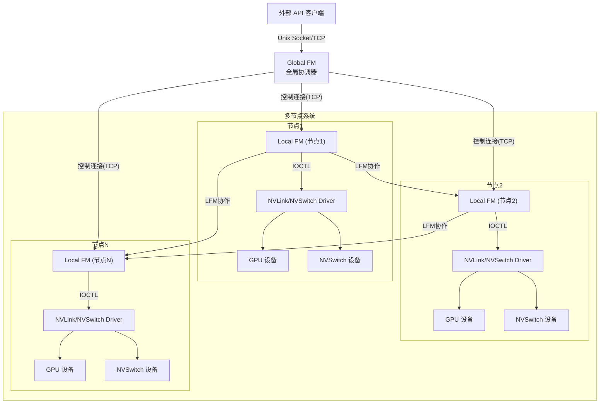
```mermaid
flowchart TB
    subgraph "多节点系统"
        subgraph "节点1"
            LFM1["Local FM (节点1)"]
            GPU1["GPU 设备"]
            SW1["NVSwitch 设备"]
            DRV1["NVLink/NVSwitch Driver"]
        end
        
        subgraph "节点2"
            LFM2["Local FM (节点2)"]
            GPU2["GPU 设备"]
            SW2["NVSwitch 设备"]
            DRV2["NVLink/NVSwitch Driver"]
        end
        
        subgraph "节点N"
            LFMN["Local FM (节点N)"]
            GPUN["GPU 设备"]
            SWN["NVSwitch 设备"]
            DRVN["NVLink/NVSwitch Driver"]
        end
    end
    
    GFM["Global FM<br/>全局协调器"]
    
    GFM -->|"控制连接(TCP)"| LFM1
    GFM -->|"控制连接(TCP)"| LFM2
    GFM -->|"控制连接(TCP)"| LFMN
    
    LFM1 -->|"LFM协作"| LFM2
    LFM1 -->|"LFM协作"| LFMN
    LFM2 -->|"LFM协作"| LFMN
    
    LFM1 -->|"IOCTL"| DRV1
    DRV1 --> GPU1
    DRV1 --> SW1
    
    LFM2 -->|"IOCTL"| DRV2
    DRV2 --> GPU2
    DRV2 --> SW2
    
    LFMN -->|"IOCTL"| DRVN
    DRVN --> GPUN
    DRVN --> SWN
    
    API["外部 API 客户端"]
    API -->|"Unix Socket/TCP"| GFM
```

### 2.2 Global Fabric Manager (GFM)

GFM 是整个系统的全局协调器，负责：

**职责:**
- 解析拓扑配置文件，理解预期的网络拓扑
- 协调所有节点 LFM 的初始化顺序
- 发送链路训练请求到各节点 LFM
- 收集各节点上报的设备信息和连接状态
- 执行拓扑验证，检查实际拓扑与配置是否一致
- 管理共享 NVSwitch 分区
- 处理设备故障和降级策略
- 提供 API 接口供外部客户端查询状态

**关键组件:**

| 类名 | 功能 |
|------|------|
| `GlobalFabricManager` | GFM 主类，协调所有操作 |
| `FMFabricParser` | 解析拓扑配置文件 |
| `FMTopologyValidator` | 验证拓扑一致性 |
| `GlobalFMNVLinkIntf` | NVLink 操作接口 |
| `GlobalFMNVLinkConnRepo` | NVLink 连接信息仓库 |
| `GlobalFMNVLinkDevRepo` | NVLink 设备信息仓库 |
| `GlobalFmHaMgr` | 高可用状态管理 |
| `GlobalFmDegradedModeMgr` | 降级模式管理 |
| `GFMFabricPartitionMgr` | 分区管理 |
| `FMFabricNode` | 代表一个远程节点 |
| `FMGlobalHeartbeat` | 心跳监控 |

### 2.3 Local Fabric Manager (LFM)

LFM 运行在每个节点上，负责管理本地的 NVSwitch 和 GPU 设备：

**职责:**
- 与本地 NVSwitch/NVLink 驱动交互，执行 IOCTL 操作
- 执行本地设备的 NVLink 链路训练
- 上报本地设备信息到 GFM
- 与其他节点 LFM 协作进行跨节点链路训练
- 处理本地设备错误上报
- 执行 NVSwitch 心跳监控

**关键组件:**

| 类名 | 功能 |
|------|------|
| `LocalFabricManagerControl` | LFM 主控制类 |
| `LocalFMSwitchInterface` | 单个 NVSwitch 设备接口 |
| `LocalFMNVLinkDrvIntf` | NVLink 驱动 IOCTL 接口 |
| `LocalFMNVLinkReqInit` | 链路初始化请求处理 |
| `LocalFMNVLinkReqConnTrain` | 链路训练请求处理 |
| `LocalFMNVLinkReqDiscovery` | 设备发现请求处理 |
| `LocalFMCoOpMgr` | LFM 间协作管理 |
| `LocalFMGpuMgr` | GPU 设备管理 |
| `LocalFmSwitchHeartbeatReporter` | NVSwitch 心跳上报 |

### 2.4 通信机制

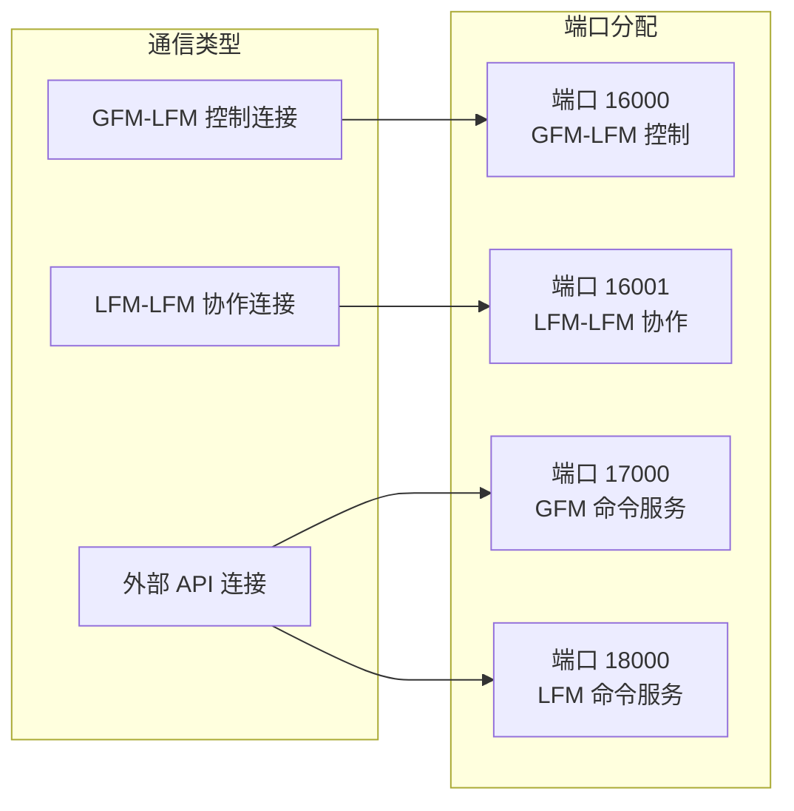
```mermaid
flowchart LR
    subgraph "通信类型"
        direction TB
        A["GFM-LFM 控制连接"]
        B["LFM-LFM 协作连接"]
        C["外部 API 连接"]
    end
    
    subgraph "端口分配"
        P1["端口 16000<br/>GFM-LFM 控制"]
        P2["端口 16001<br/>LFM-LFM 协作"]
        P3["端口 17000<br/>GFM 命令服务"]
        P4["端口 18000<br/>LFM 命令服务"]
    end
    
    A --> P1
    B --> P2
    C --> P3
    C --> P4
```

**通信协议:**
- 基于 TCP/IP 的 socket 通信
- 使用 Protocol Buffers (protobuf) 进行消息序列化
- 使用 libevent 库实现事件驱动的网络通信
- 支持同步和异步消息发送

---

## 3. 核心子模块详解

### 3.1 拓扑解析模块 (FMFabricParser)

**位置**: `globalfm/GlobalFmFabricParser.cpp`

**功能**: 解析拓扑配置文件，构建预期的网络拓扑模型

**解析的数据结构:**

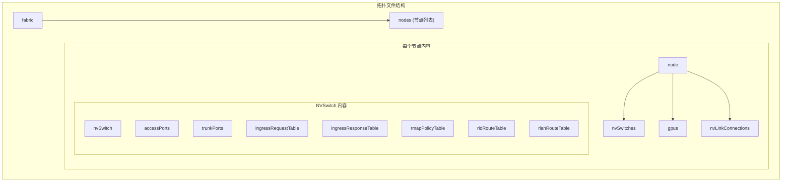
```mermaid
flowchart TB
    subgraph "拓扑文件结构"
        FABRIC["fabric"]
        NODES["nodes (节点列表)"]
        
        FABRIC --> NODES
        
        subgraph "每个节点内容"
            NODE["node"]
            SWITCHES["nvSwitches"]
            GPUS["gpus"]
            CONNS["nvLinkConnections"]
            
            NODE --> SWITCHES
            NODE --> GPUS
            NODE --> CONNS
            
            subgraph "NVSwitch 内容"
                SW["nvSwitch"]
                ACCESS_PORTS["accessPorts"]
                TRUNK_PORTS["trunkPorts"]
                REQ_TBL["ingressRequestTable"]
                RESP_TBL["ingressResponseTable"]
                RMAP_TBL["rmapPolicyTable"]
                RID_TBL["ridRouteTable"]
                RLAN_TBL["rlanRouteTable"]
            end
        end
    end
```

**关键数据结构:**

| 数据结构 | 说明 |
|----------|------|
| `NodeCfg` | 节点配置信息 |
| `nvswitchCfg` | NVSwitch 配置映射 |
| `portInfo` | 端口信息映射 |
| `gpuCfg` | GPU 配置映射 |
| `reqEntry` | Ingress Request 表 |
| `respEntry` | Ingress Response 表 |
| `rmapEntry` | Remap Policy 表 |
| `ridEntry` | RID Route 表 |
| `rlanEntry` | RLAN Route 表 |
| `nvLinkConnMap` | NVLink 连接映射 |
| `sharedNvswitchPartitionCfg` | 共享分区配置 |

**端口类型:**

- **Access Port**: 连接 GPU 的端口
- **Trunk Port**: 连接其他 NVSwitch 的端口（用于跨 Switch 通信）

### 3.2 NVLink 链路训练模块

**位置**: `localfm/LocalFMNVLinkReqConnTrain.cpp`, `localfm/LocalFMNVLinkReqInit.cpp`

**功能**: 执行 NVLink 链路的初始化和训练过程

**NVLink 状态转换流程:**

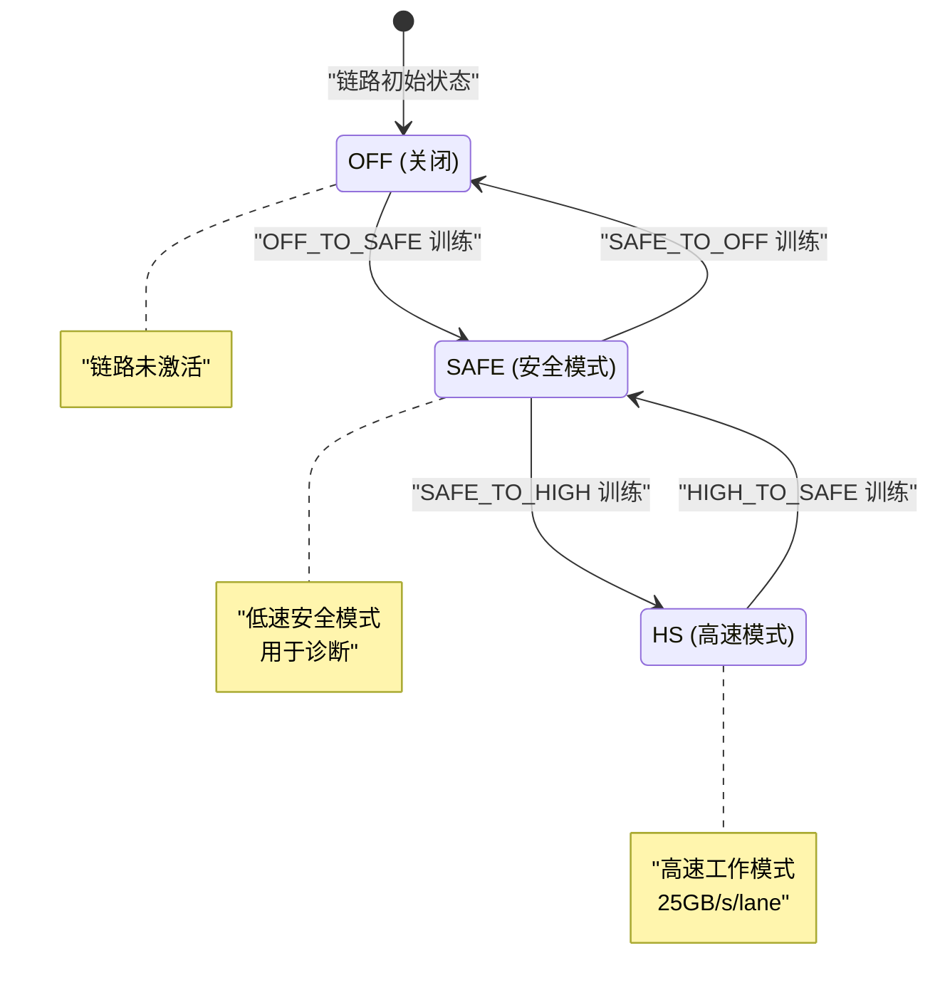
```mermaid
stateDiagram-v2
    [*] --> OFF: "链路初始状态"
    
    OFF --> SAFE: "OFF_TO_SAFE 训练"
    SAFE --> HS: "SAFE_TO_HIGH 训练"
    HS --> SAFE: "HIGH_TO_SAFE 训练"
    SAFE --> OFF: "SAFE_TO_OFF 训练"
    
    state "OFF (关闭)" as OFF
    state "SAFE (安全模式)" as SAFE
    state "HS (高速模式)" as HS
    
    note right of OFF: "链路未激活"
    note right of SAFE: "低速安全模式<br/>用于诊断"
    note right of HS: "高速工作模式<br/>25GB/s/lane"
```

**训练请求类型 (FMNVLinkTrainType):**

| 类型 | 说明 |
|------|------|
| `NVLINK_TRAIN_OFF_TO_SAFE` | 从关闭状态训练到安全模式 |
| `NVLINK_TRAIN_SAFE_TO_HIGH` | 从安全模式训练到高速模式 |
| `NVLINK_TRAIN_TO_OFF` | 关闭链路 |
| `NVLINK_TRAIN_HIGH_TO_SAFE` | 从高速模式回到安全模式 |
| `NVLINK_TRAIN_SAFE_TO_OFF` | 从安全模式关闭链路 |

**跨节点链路训练协调:**

对于跨节点的 NVLink 连接（如 trunk link），需要 Master LFM 和 Slave LFM 协调：

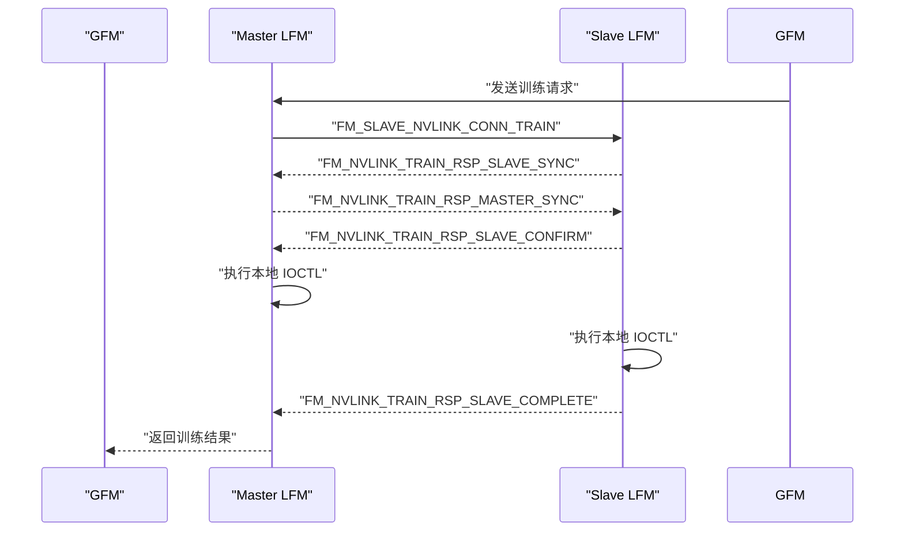
```mermaid
sequenceDiagram
    participant "GFM"
    participant "Master LFM"
    participant "Slave LFM"
    
    GFM->>"Master LFM": "发送训练请求"
    "Master LFM"->>"Slave LFM": "FM_SLAVE_NVLINK_CONN_TRAIN"
    "Slave LFM"-->>"Master LFM": "FM_NVLINK_TRAIN_RSP_SLAVE_SYNC"
    "Master LFM"-->>"Slave LFM": "FM_NVLINK_TRAIN_RSP_MASTER_SYNC"
    "Slave LFM"-->>"Master LFM": "FM_NVLINK_TRAIN_RSP_SLAVE_CONFIRM"
    "Master LFM"->>"Master LFM": "执行本地 IOCTL"
    "Slave LFM"->>"Slave LFM": "执行本地 IOCTL"
    "Slave LFM"-->>"Master LFM": "FM_NVLINK_TRAIN_RSP_SLAVE_COMPLETE"
    "Master LFM"-->>"GFM": "返回训练结果"
```

**训练请求生命周期状态:**

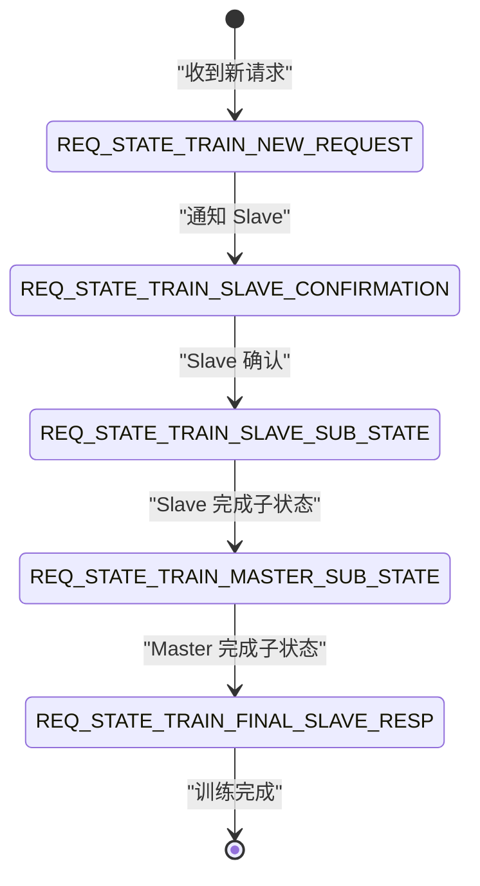
```mermaid
stateDiagram-v2
    [*] --> REQ_STATE_TRAIN_NEW_REQUEST: "收到新请求"
    REQ_STATE_TRAIN_NEW_REQUEST --> REQ_STATE_TRAIN_SLAVE_CONFIRMATION: "通知 Slave"
    REQ_STATE_TRAIN_SLAVE_CONFIRMATION --> REQ_STATE_TRAIN_SLAVE_SUB_STATE: "Slave 确认"
    REQ_STATE_TRAIN_SLAVE_SUB_STATE --> REQ_STATE_TRAIN_MASTER_SUB_STATE: "Slave 完成子状态"
    REQ_STATE_TRAIN_MASTER_SUB_STATE --> REQ_STATE_TRAIN_FINAL_SLAVE_RESP: "Master 完成子状态"
    REQ_STATE_TRAIN_FINAL_SLAVE_RESP --> [*]: "训练完成"
```

### 3.3 设备发现模块 (LocalFMNVLinkReqDiscovery)

**位置**: `localfm/LocalFMNVLinkReqDiscovery.cpp`

**功能**: 发现本地 NVLink 设备及其连接关系

**发现的 IOCTL 操作:**

| IOCTL | 说明 |
|-------|------|
| `IOCTL_NVLINK_DISCOVER_INTRANODE_CONNS` | 发现节点内 NVLink 连接 |
| `IOCTL_NVLINK_WRITE_DISCOVERY_TOKENS` | 写入发现令牌 |
| `IOCTL_NVLINK_READ_DISCOVERY_TOKENS` | 读取发现令牌 |

**发现令牌机制:**

Discovery Token 用于跨节点链路发现时的端点识别：

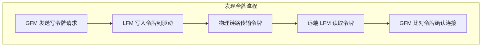
```mermaid
flowchart TB
    subgraph "发现令牌流程"
        A["GFM 发送写令牌请求"]
        B["LFM 写入令牌到驱动"]
        C["物理链路传输令牌"]
        D["远端 LFM 读取令牌"]
        E["GFM 比对令牌确认连接"]
    end
    
    A --> B --> C --> D --> E
```

### 3.4 拓扑验证模块 (FMTopologyValidator)

**位置**: `globalfm/FMTopologyValidator.cpp`

**功能**: 验证实际发现的拓扑与配置文件是否一致

**验证流程:**

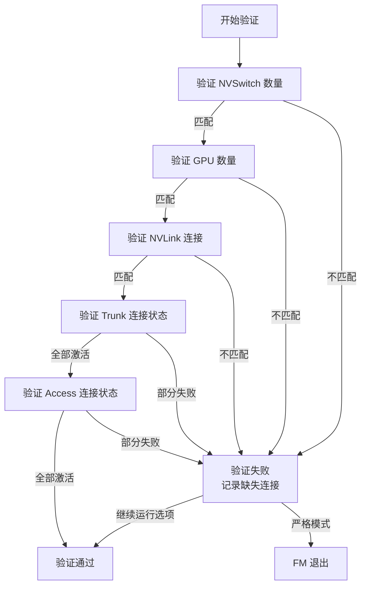
```mermaid
flowchart TB
    START["开始验证"]
    
    CHECK_SWITCH["验证 NVSwitch 数量"]
    CHECK_GPU["验证 GPU 数量"]
    CHECK_CONN["验证 NVLink 连接"]
    CHECK_TRUNK["验证 Trunk 连接状态"]
    CHECK_ACCESS["验证 Access 连接状态"]
    
    PASS["验证通过"]
    FAIL["验证失败<br/>记录缺失连接"]
    
    START --> CHECK_SWITCH
    CHECK_SWITCH -->|"匹配"| CHECK_GPU
    CHECK_SWITCH -->|"不匹配"| FAIL
    CHECK_GPU -->|"匹配"| CHECK_CONN
    CHECK_GPU -->|"不匹配"| FAIL
    CHECK_CONN -->|"匹配"| CHECK_TRUNK
    CHECK_CONN -->|"不匹配"| FAIL
    CHECK_TRUNK -->|"全部激活"| CHECK_ACCESS
    CHECK_TRUNK -->|"部分失败"| FAIL
    CHECK_ACCESS -->|"全部激活"| PASS
    CHECK_ACCESS -->|"部分失败"| FAIL
    
    FAIL -->|"继续运行选项"| PASS
    FAIL -->|"严格模式"| END["FM 退出"]
```

### 3.5 分区管理模块 (GFMFabricPartitionMgr)

**位置**: `globalfm/GFMFabricPartitionMgr.cpp`

**功能**: 在共享 NVSwitch 多租户模式下管理分区

**分区状态:**

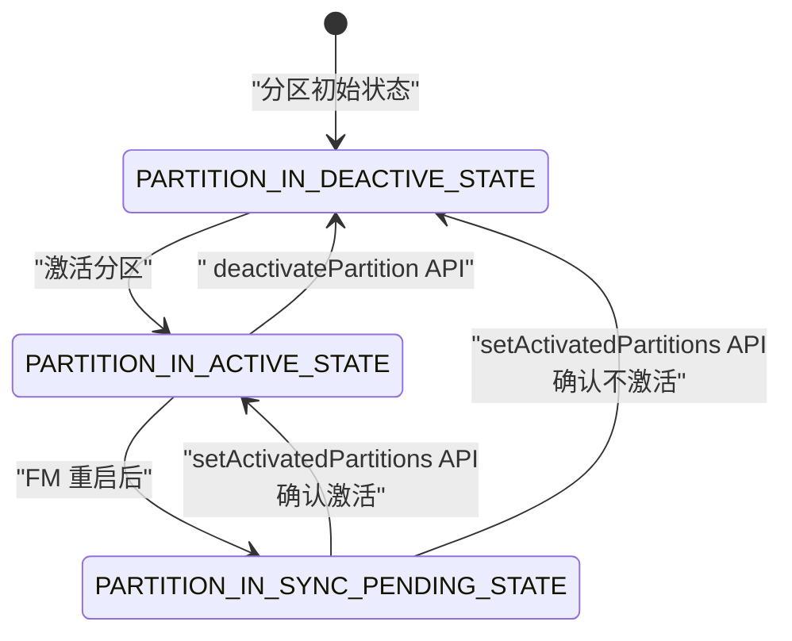
```mermaid
stateDiagram-v2
    [*] --> DEACTIVE: "分区初始状态"
    
    DEACTIVE --> ACTIVE: "激活分区"
    ACTIVE --> DEACTIVE: " deactivatePartition API"
    
    ACTIVE --> SYNC_PENDING: "FM 重启后"
    SYNC_PENDING --> ACTIVE: "setActivatedPartitions API<br/>确认激活"
    SYNC_PENDING --> DEACTIVE: "setActivatedPartitions API<br/>确认不激活"
    
    state "PARTITION_IN_DEACTIVE_STATE" as DEACTIVE
    state "PARTITION_IN_ACTIVE_STATE" as ACTIVE
    state "PARTITION_IN_SYNC_PENDING_STATE" as SYNC_PENDING
```

**分区激活流程:**

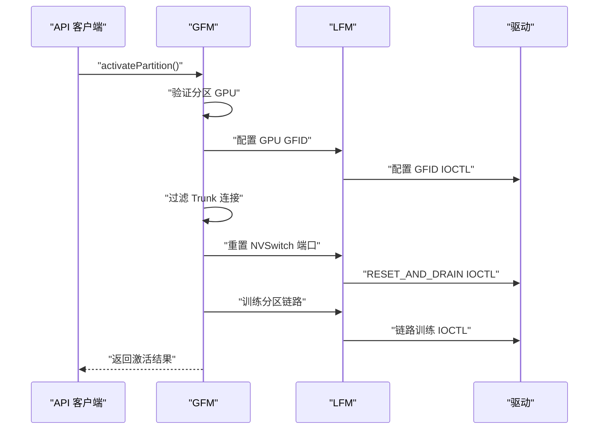
```mermaid
sequenceDiagram
    participant "API 客户端"
    participant "GFM"
    participant "LFM"
    participant "驱动"
    
    "API 客户端"->>"GFM": "activatePartition()"
    "GFM"->>"GFM": "验证分区 GPU"
    "GFM"->>"LFM": "配置 GPU GFID"
    "LFM"->>"驱动": "配置 GFID IOCTL"
    "GFM"->>"GFM": "过滤 Trunk 连接"
    "GFM"->>"LFM": "重置 NVSwitch 端口"
    "LFM"->>"驱动": "RESET_AND_DRAIN IOCTL"
    "GFM"->>"LFM": "训练分区链路"
    "LFM"->>"驱动": "链路训练 IOCTL"
    "GFM"-->>"API 客户端": "返回激活结果"
```

### 3.6 高可用模块 (GlobalFmHaMgr)

**位置**: `globalfm/GlobalFmHaMgr.cpp`

**功能**: 支持 FM 服务重启后恢复状态

**HA 状态保存内容:**

- 分区激活状态
- 设备降级状态
- 初始化完成标记

**HA 流程:**

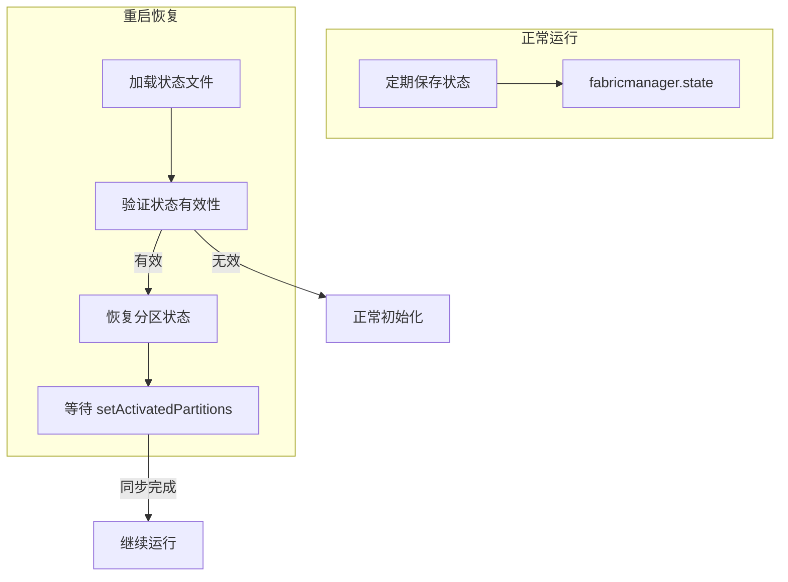
```mermaid
flowchart TB
    subgraph "正常运行"
        SAVE["定期保存状态"]
        STATE_FILE["fabricmanager.state"]
    end
    
    subgraph "重启恢复"
        LOAD["加载状态文件"]
        VALIDATE["验证状态有效性"]
        RESTORE["恢复分区状态"]
        SYNC["等待 setActivatedPartitions"]
    end
    
    SAVE --> STATE_FILE
    
    LOAD --> VALIDATE
    VALIDATE -->|"有效"| RESTORE
    VALIDATE -->|"无效"| NORMAL["正常初始化"]
    RESTORE --> SYNC
    SYNC -->|"同步完成"| RUNNING["继续运行"]
```

### 3.7 降级模式管理模块 (GlobalFmDegradedModeMgr)

**位置**: `globalfm/GlobalFmDegradedModeMgr.cpp`

**功能**: 处理设备故障时的降级策略

**故障类型与处理策略:**

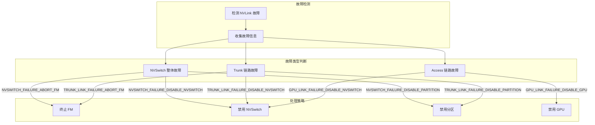
```mermaid
flowchart TB
    subgraph "故障检测"
        DETECT["检测 NVLink 故障"]
        COLLECT["收集故障信息"]
    end
    
    subgraph "故障类型判断"
        SWITCH_FAIL["NVSwitch 整体故障"]
        TRUNK_FAIL["Trunk 链路故障"]
        ACCESS_FAIL["Access 链路故障"]
    end
    
    subgraph "处理策略"
        ABORT_FM["终止 FM"]
        DISABLE_SW["禁用 NVSwitch"]
        DISABLE_PART["禁用分区"]
        DISABLE_GPU["禁用 GPU"]
    end
    
    DETECT --> COLLECT --> SWITCH_FAIL
    COLLECT --> TRUNK_FAIL
    COLLECT --> ACCESS_FAIL
    
    SWITCH_FAIL -->|"NVSWITCH_FAILURE_ABORT_FM"| ABORT_FM
    SWITCH_FAIL -->|"NVSWITCH_FAILURE_DISABLE_NVSWITCH"| DISABLE_SW
    SWITCH_FAIL -->|"NVSWITCH_FAILURE_DISABLE_PARTITION"| DISABLE_PART
    
    TRUNK_FAIL -->|"TRUNK_LINK_FAILURE_ABORT_FM"| ABORT_FM
    TRUNK_FAIL -->|"TRUNK_LINK_FAILURE_DISABLE_NVSWITCH"| DISABLE_SW
    TRUNK_FAIL -->|"TRUNK_LINK_FAILURE_DISABLE_PARTITION"| DISABLE_PART
    
    ACCESS_FAIL -->|"GPU_LINK_FAILURE_DISABLE_GPU"| DISABLE_GPU
    ACCESS_FAIL -->|"GPU_LINK_FAILURE_DISABLE_NVSWITCH"| DISABLE_SW
```

### 3.8 心跳监控模块

**位置**: `globalfm/GlobalFmHeartbeat.cpp`, `localfm/LocalFmSwitchHeartbeatReporter.cpp`

**功能:**
- GFM 监控各节点 LFM 的存活状态
- LFM 监控本地 NVSwitch 的心跳

**心跳机制参数:**

| 参数 | 值 | 说明 |
|------|-----|------|
| `HEARTBEAT_INTERVAL` | 10 秒 | 心跳发送间隔 |
| `HEARTBEAT_THRESHOLD` | 6 | 连续缺失次数阈值 |
| `switchHeartbeatTimeout` | 可配置 | NVSwitch 心跳超时 |

**心跳超时处理:**

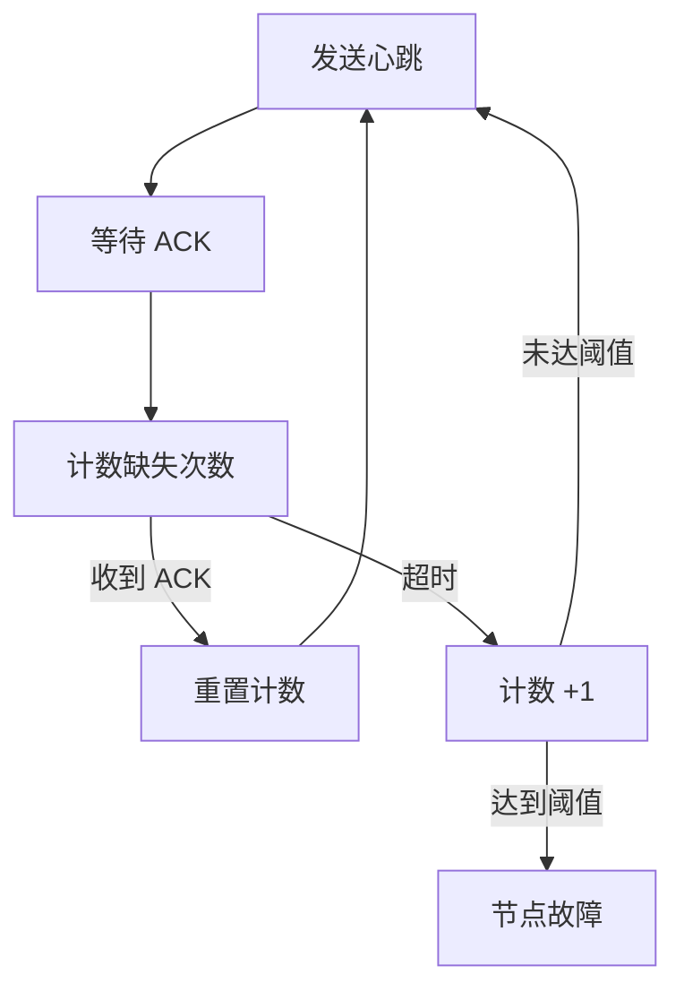
```mermaid
flowchart TB
    SEND["发送心跳"]
    WAIT["等待 ACK"]
    COUNT["计数缺失次数"]
    
    SEND --> WAIT --> COUNT
    
    COUNT -->|"收到 ACK"| RESET["重置计数"]
    RESET --> SEND
    
    COUNT -->|"超时"| INCR["计数 +1"]
    INCR -->|"未达阈值"| SEND
    INCR -->|"达到阈值"| FAIL["节点故障"]
```

### 3.9 通信基础设施 (infra/transport)

**位置**: `infra/transport/`

**核心组件:**

| 类名 | 功能 |
|------|------|
| `FmConnection` | 连接基类，管理连接状态 |
| `FmClientConnection` | 客户端连接实现 |
| `FmServerConnection` | 服务端连接实现 |
| `FmSocketMessage` | Socket 消息封装 |
| `workqueue` | 工作队列，用于异步请求处理 |

**连接状态:**

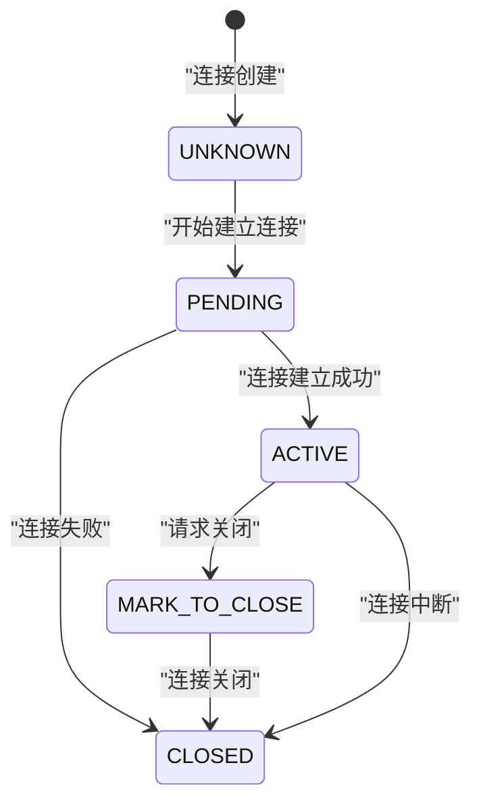
```mermaid
stateDiagram-v2
    [*] --> UNKNOWN: "连接创建"
    UNKNOWN --> PENDING: "开始建立连接"
    PENDING --> ACTIVE: "连接建立成功"
    PENDING --> CLOSED: "连接失败"
    ACTIVE --> MARK_TO_CLOSE: "请求关闭"
    MARK_TO_CLOSE --> CLOSED: "连接关闭"
    ACTIVE --> CLOSED: "连接中断"
```

**消息读取状态:**

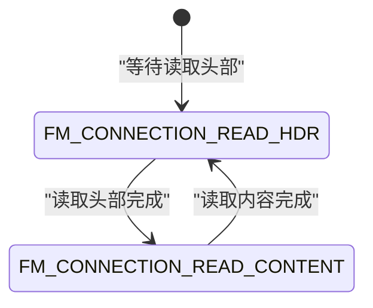
```mermaid
stateDiagram-v2
    [*] --> FM_CONNECTION_READ_HDR: "等待读取头部"
    FM_CONNECTION_READ_HDR --> FM_CONNECTION_READ_CONTENT: "读取头部完成"
    FM_CONNECTION_READ_CONTENT --> FM_CONNECTION_READ_HDR: "读取内容完成"
```

---

## 4. 关键流程详解

### 4.1 Fabric Manager 启动流程

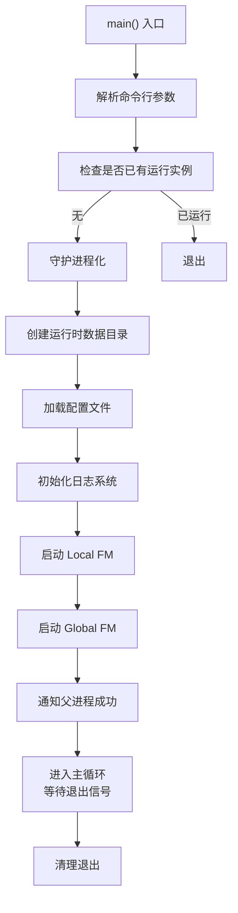
```mermaid
flowchart TB
    START["main() 入口"]
    
    PARSE_CMD["解析命令行参数"]
    CHECK_DAEMON["检查是否已有运行实例"]
    DAEMONIZE["守护进程化"]
    CREATE_DIR["创建运行时数据目录"]
    LOAD_CONFIG["加载配置文件"]
    INIT_LOG["初始化日志系统"]
    
    START_LFM["启动 Local FM"]
    START_GFM["启动 Global FM"]
    
    NOTIFY_PARENT["通知父进程成功"]
    MAIN_LOOP["进入主循环<br/>等待退出信号"]
    CLEANUP["清理退出"]
    
    START --> PARSE_CMD --> CHECK_DAEMON -->|"无"| DAEMONIZE
    CHECK_DAEMON -->|"已运行"| EXIT1["退出"]
    DAEMONIZE --> CREATE_DIR --> LOAD_CONFIG --> INIT_LOG --> START_LFM --> START_GFM --> NOTIFY_PARENT --> MAIN_LOOP --> CLEANUP
```

### 4.2 GFM 初始化流程

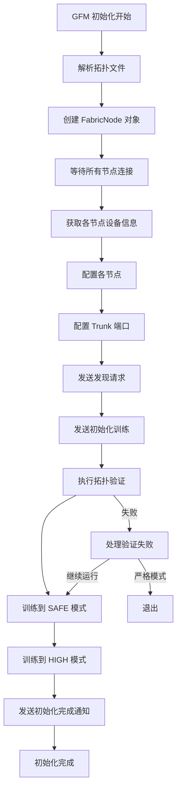
```mermaid
flowchart TB
    START["GFM 初始化开始"]
    
    PARSE_TOPO["解析拓扑文件"]
    CREATE_NODES["创建 FabricNode 对象"]
    WAIT_CONN["等待所有节点连接"]
    
    GET_INFO["获取各节点设备信息"]
    CONFIGURE["配置各节点"]
    CONFIGURE_TRUNK["配置 Trunk 端口"]
    
    DISCOVER["发送发现请求"]
    TRAIN_INIT["发送初始化训练"]
    
    VALIDATE["执行拓扑验证"]
    
    TRAIN_SAFE["训练到 SAFE 模式"]
    TRAIN_HIGH["训练到 HIGH 模式"]
    
    SEND_DONE["发送初始化完成通知"]
    
    START --> PARSE_TOPO --> CREATE_NODES --> WAIT_CONN --> GET_INFO --> CONFIGURE --> CONFIGURE_TRUNK --> DISCOVER --> TRAIN_INIT --> VALIDATE --> TRAIN_SAFE --> TRAIN_HIGH --> SEND_DONE --> FINISH["初始化完成"]
    
    VALIDATE -->|"失败"| FAIL_HANDLE["处理验证失败"]
    FAIL_HANDLE -->|"继续运行"| TRAIN_SAFE
    FAIL_HANDLE -->|"严格模式"| EXIT["退出"]
```

### 4.3 单节点 NVLink 初始化流程

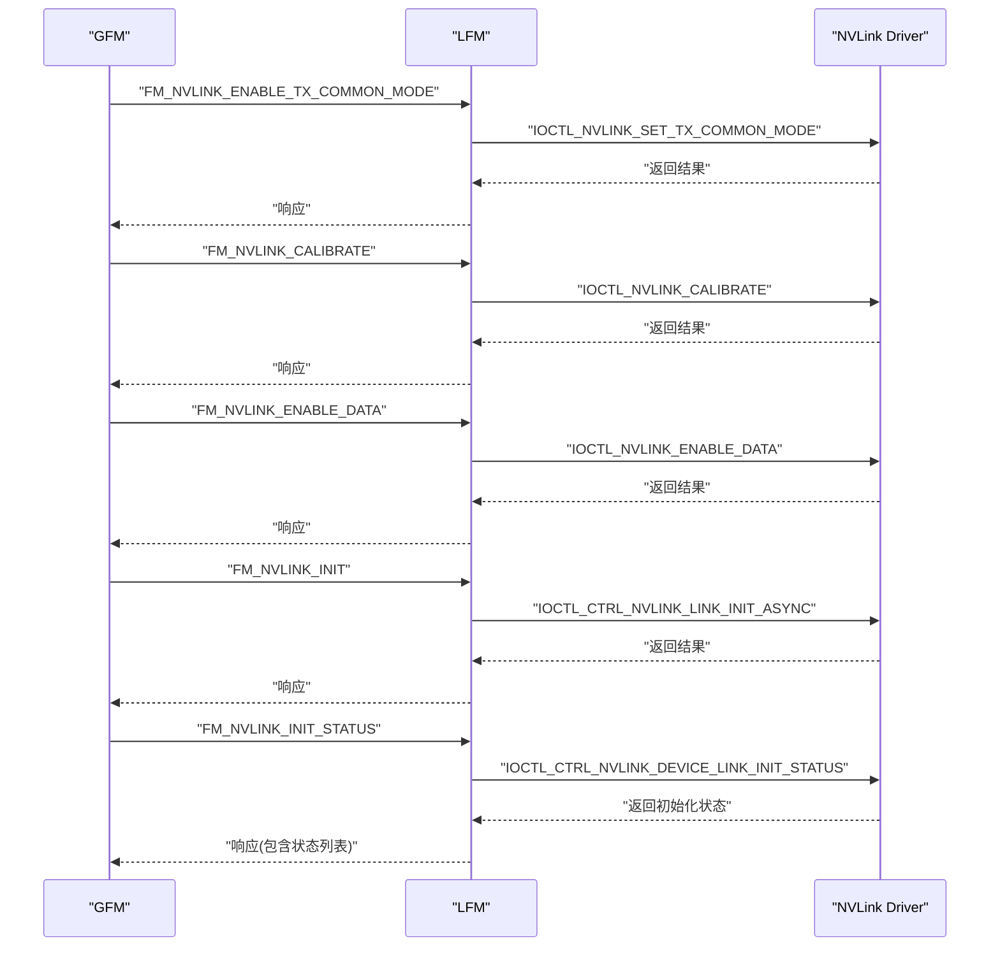
```mermaid
sequenceDiagram
    participant "GFM"
    participant "LFM"
    participant "NVLink Driver"
    
    "GFM"->>"LFM": "FM_NVLINK_ENABLE_TX_COMMON_MODE"
    "LFM"->>"NVLink Driver": "IOCTL_NVLINK_SET_TX_COMMON_MODE"
    "NVLink Driver"-->>"LFM": "返回结果"
    "LFM"-->>"GFM": "响应"
    
    "GFM"->>"LFM": "FM_NVLINK_CALIBRATE"
    "LFM"->>"NVLink Driver": "IOCTL_NVLINK_CALIBRATE"
    "NVLink Driver"-->>"LFM": "返回结果"
    "LFM"-->>"GFM": "响应"
    
    "GFM"->>"LFM": "FM_NVLINK_ENABLE_DATA"
    "LFM"->>"NVLink Driver": "IOCTL_NVLINK_ENABLE_DATA"
    "NVLink Driver"-->>"LFM": "返回结果"
    "LFM"-->>"GFM": "响应"
    
    "GFM"->>"LFM": "FM_NVLINK_INIT"
    "LFM"->>"NVLink Driver": "IOCTL_CTRL_NVLINK_LINK_INIT_ASYNC"
    "NVLink Driver"-->>"LFM": "返回结果"
    "LFM"-->>"GFM": "响应"
    
    "GFM"->>"LFM": "FM_NVLINK_INIT_STATUS"
    "LFM"->>"NVLink Driver": "IOCTL_CTRL_NVLINK_DEVICE_LINK_INIT_STATUS"
    "NVLink Driver"-->>"LFM": "返回初始化状态"
    "LFM"-->>"GFM": "响应(包含状态列表)"
```

### 4.4 NVLink 连接发现流程

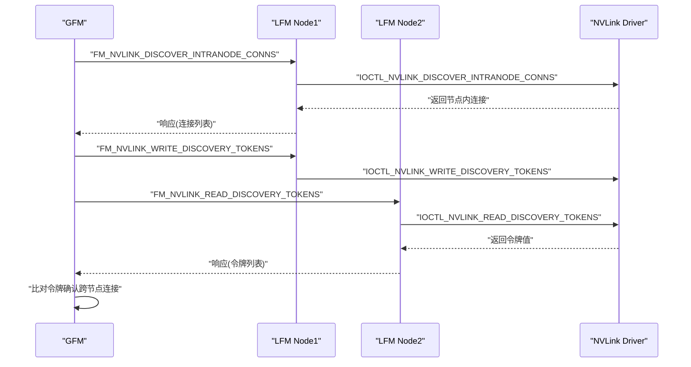
```mermaid
sequenceDiagram
    participant "GFM"
    participant "LFM Node1"
    participant "LFM Node2"
    participant "NVLink Driver"
    
    "GFM"->>"LFM Node1": "FM_NVLINK_DISCOVER_INTRANODE_CONNS"
    "LFM Node1"->>"NVLink Driver": "IOCTL_NVLINK_DISCOVER_INTRANODE_CONNS"
    "NVLink Driver"-->>"LFM Node1": "返回节点内连接"
    "LFM Node1"-->>"GFM": "响应(连接列表)"
    
    "GFM"->>"LFM Node1": "FM_NVLINK_WRITE_DISCOVERY_TOKENS"
    "LFM Node1"->>"NVLink Driver": "IOCTL_NVLINK_WRITE_DISCOVERY_TOKENS"
    
    "GFM"->>"LFM Node2": "FM_NVLINK_READ_DISCOVERY_TOKENS"
    "LFM Node2"->>"NVLink Driver": "IOCTL_NVLINK_READ_DISCOVERY_TOKENS"
    "NVLink Driver"-->>"LFM Node2": "返回令牌值"
    "LFM Node2"-->>"GFM": "响应(令牌列表)"
    
    "GFM"->>"GFM": "比对令牌确认跨节点连接"
```

### 4.5 NVSwitch 配置流程

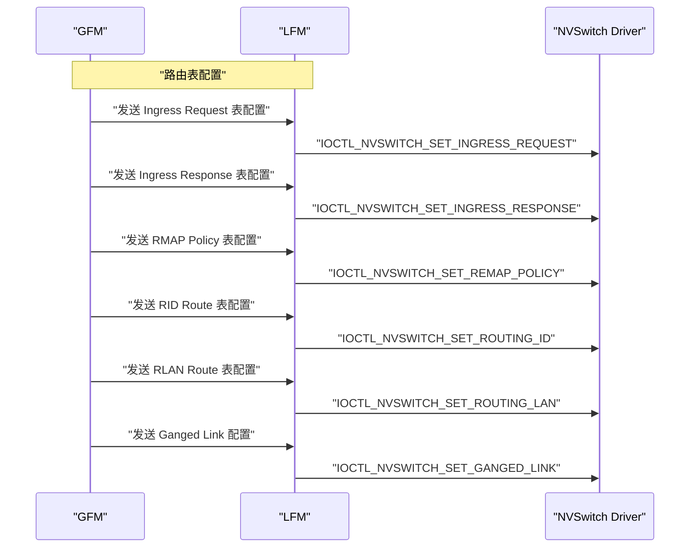
```mermaid
sequenceDiagram
    participant "GFM"
    participant "LFM"
    participant "NVSwitch Driver"
    
    Note over "GFM","LFM": "路由表配置"
    
    "GFM"->>"LFM": "发送 Ingress Request 表配置"
    "LFM"->>"NVSwitch Driver": "IOCTL_NVSWITCH_SET_INGRESS_REQUEST"
    
    "GFM"->>"LFM": "发送 Ingress Response 表配置"
    "LFM"->>"NVSwitch Driver": "IOCTL_NVSWITCH_SET_INGRESS_RESPONSE"
    
    "GFM"->>"LFM": "发送 RMAP Policy 表配置"
    "LFM"->>"NVSwitch Driver": "IOCTL_NVSWITCH_SET_REMAP_POLICY"
    
    "GFM"->>"LFM": "发送 RID Route 表配置"
    "LFM"->>"NVSwitch Driver": "IOCTL_NVSWITCH_SET_ROUTING_ID"
    
    "GFM"->>"LFM": "发送 RLAN Route 表配置"
    "LFM"->>"NVSwitch Driver": "IOCTL_NVSWITCH_SET_ROUTING_LAN"
    
    "GFM"->>"LFM": "发送 Ganged Link 配置"
    "LFM"->>"NVSwitch Driver": "IOCTL_NVSWITCH_SET_GANGED_LINK"
```

### 4.6 分区激活流程

```mermaid
sequenceDiagram
    participant "外部 API"
    participant "GFM PartitionMgr"
    participant "LFM"
    participant "Driver"
    
    "外部 API"->>"GFM PartitionMgr": "activatePartition(nodeId, partitionId)"
    
    "GFM PartitionMgr"->>"GFM PartitionMgr": "验证分区存在"
    "GFM PartitionMgr"->>"GFM PartitionMgr": "验证分区 GPU"
    
    "GFM PartitionMgr"->>"LFM": "attachGpu(uuid)"
    "LFM"->>"Driver": "GPU attach IOCTL"
    
    "GFM PartitionMgr"->>"GFM PartitionMgr": "配置 GPU GFID"
    "GFM PartitionMgr"->>"LFM": "configGpuGfid(uuid, gfid)"
    "LFM"->>"Driver": "GFID 配置 IOCTL"
    
    "GFM PartitionMgr"->>"GFM PartitionMgr": "过滤分区 Trunk 连接"
    
    "GFM PartitionMgr"->>"LFM": "resetSwitchLinks(physicalId, linkMask)"
    "LFM"->>"Driver": "RESET_AND_DRAIN_LINKS IOCTL"
    
    "GFM PartitionMgr"->>"GFM PartitionMgr": "发送链路训练请求"
    "GFM PartitionMgr"->>"LFM": "链路训练消息"
    "LFM"->>"Driver": "训练 IOCTL"
    
    "GFM PartitionMgr"-->>"外部 API": "返回激活结果"
```

### 4.7 错误处理流程

```mermaid
flowchart TB
    DETECT["NVSwitch/GPU 错误检测"]
    
    REPORT["LFM 上报错误到 GFM"]
    
    ANALYZE["GFM 分析错误类型"]
    
    subgraph "错误类型"
        FATAL["致命错误"]
        NON_FATAL["非致命错误"]
    end
    
    ANALYZE --> FATAL
    ANALYZE --> NON_FATAL
    
    FATAL --> ABORT["终止 FM"]
    
    NON_FATAL --> DEGRADE["进入降级模式"]
    
    DEGRADE --> DISABLE_DEV["禁用故障设备"]
    DEGRADE --> DISABLE_LINK["禁用故障链路"]
    DEGRADE --> DISABLE_PART["禁用受影响分区"]
    
    DISABLE_DEV --> NOTIFY["通知各节点"]
    DISABLE_LINK --> NOTIFY
    DISABLE_PART --> NOTIFY
    
    NOTIFY --> TURN_OFF["关闭相关 NVLink"]
    TURN_OFF --> CONTINUE["继续运行"]
```

---

## 5. 数据流与消息类型

### 5.1 Protocol Buffer 消息定义

**位置**: `infra/protobuf/`

| Proto 文件 | 说明 |
|------------|------|
| `fabricmanager.proto.precomp` | FM 主消息定义 |
| `fmlib.proto` | FM Library API 消息 |
| `fabricmanagerHA.proto` | HA 状态消息 |
| `topology.proto.precomp` | 拓扑配置消息 |
| `memmgr.proto.precomp` | 内存管理消息 |
| `fmInternalLib.proto` | 内部 API 消息 |

### 5.2 主要消息类型

| 消息类型 | 说明 | 发送方向 |
|----------|------|----------|
| `FM_NVLINK_ENABLE_TX_COMMON_MODE` | 启用 TX 公共模式 | GFM → LFM |
| `FM_NVLINK_CALIBRATE` | RX 校准 | GFM → LFM |
| `FM_NVLINK_ENABLE_DATA` | 启用数据链路 | GFM → LFM |
| `FM_NVLINK_INIT` | 链路初始化 | GFM → LFM |
| `FM_NVLINK_INIT_STATUS` | 查询初始化状态 | GFM → LFM |
| `FM_NVLINK_DISCOVER_INTRANODE_CONNS` | 发现节点内连接 | GFM → LFM |
| `FM_NVLINK_WRITE_DISCOVERY_TOKENS` | 写入发现令牌 | GFM → LFM |
| `FM_NVLINK_READ_DISCOVERY_TOKENS` | 读取发现令牌 | GFM → LFM |
| `FM_NVLINK_GET_DEVICE_NVLINK_STATE` | 获取设备 NVLink 状态 | GFM → LFM |
| `FM_NVLINK_RESET_SWITCH_LINKS` | 重置 Switch 链路 | GFM → LFM |
| `FM_MASTER_NVLINK_CONN_TRAIN_TO_SAFE` | 训练到 SAFE | GFM → LFM |
| `FM_MASTER_NVLINK_CONN_TRAIN_TO_HIGH` | 训练到 HIGH | GFM → LFM |
| `FM_SLAVE_NVLINK_CONN_TRAIN_TO_SAFE` | Slave 训练到 SAFE | Master LFM → Slave LFM |
| `FM_NVLINK_TRAIN_RSP_SLAVE_COMPLETE` | Slave 完成响应 | Slave LFM → Master LFM |

### 5.3 IOCTL 命令映射

**NVLink IOCTL:**

| IOCTL 命令 | 功能 |
|------------|------|
| `IOCTL_NVLINK_SET_TX_COMMON_MODE` | 设置 TX 公共模式 |
| `IOCTL_NVLINK_CALIBRATE` | RX 校准 |
| `IOCTL_NVLINK_ENABLE_DATA` | 启用数据传输 |
| `IOCTL_CTRL_NVLINK_LINK_INIT_ASYNC` | 异步链路初始化 |
| `IOCTL_CTRL_NVLINK_DEVICE_LINK_INIT_STATUS` | 查询初始化状态 |
| `IOCTL_NVLINK_DISCOVER_INTRANODE_CONNS` | 发现节点内连接 |
| `IOCTL_NVLINK_WRITE_DISCOVERY_TOKENS` | 写入发现令牌 |
| `IOCTL_NVLINK_READ_DISCOVERY_TOKENS` | 读取发现令牌 |
| `IOCTL_NVLINK_TRAIN_INTRANODE_CONN` | 训练节点内连接 |
| `IOCTL_NVLINK_TRAIN_INTERNODE_CONN_LINK` | 训练跨节点主链路 |
| `IOCTL_NVLINK_TRAIN_INTERNODE_CONN_SUBLINK` | 训练跨节点子链路 |

**NVSwitch IOCTL:**

| IOCTL 命令 | 功能 |
|------------|------|
| `IOCTL_NVSWITCH_SET_INGRESS_REQUEST` | 设置 Ingress Request 表 |
| `IOCTL_NVSWITCH_SET_INGRESS_RESPONSE` | 设置 Ingress Response 表 |
| `IOCTL_NVSWITCH_SET_REMAP_POLICY` | 设置 Remap Policy 表 |
| `IOCTL_NVSWITCH_SET_ROUTING_ID` | 设置 RID Route 表 |
| `IOCTL_NVSWITCH_SET_ROUTING_LAN` | 设置 RLAN Route 表 |
| `IOCTL_NVSWITCH_SET_GANGED_LINK` | 设置 Ganged Link |
| `IOCTL_NVSWITCH_RESET_AND_DRAIN_LINKS` | 重置并排空链路 |
| `IOCTL_NVSWITCH_SET_FM_DRIVER_FABRIC_STATE` | 设置 FM 驱动状态 |
| `IOCTL_NVSWITCH_SET_FM_DEVICE_FABRIC_STATE` | 设置 FM 设备状态 |

---

## 6. 目录结构详解

```
/root/tmp/fm/
├── fabricmanager_unix.cpp      # Linux 入口程序
├── fabricmanager_win.cpp       # Windows 入口程序
├── fabricmanager.nvmk          # 主构建文件
├── makefile.nvmk               # 顶层 makefile
├── FMVersion.h                 # 版本定义
│
├── globalfm/                   # Global Fabric Manager 模块
│   ├── GlobalFabricManager.cpp/h       # GFM 主类
│   ├── GlobalFmFabricParser.cpp/h      # 拓扑解析
│   ├── GlobalFmFabricConfig.cpp/h      # 拓扑配置
│   ├── FMTopologyValidator.cpp/h       # 拓扑验证
│   ├── GlobalFMNVLinkIntf.cpp/h        # NVLink 接口
│   ├── GlobalFMNVLinkConnRepo.cpp/h    # 连接仓库
│   ├── GlobalFmHaMgr.cpp/h             # HA 管理
│   ├── GlobalFmDegradedModeMgr.cpp/h   # 降级模式
│   ├── GFMFabricPartitionMgr.cpp/h     # 分区管理
│   ├── GlobalFmHeartbeat.cpp/h         # 心跳管理
│   ├── GlobalFmFabricNode.cpp/h        # 节点管理
│   ├── GFMHelper.cpp/h                 # 辅助函数
│   └── GlobalFmMulticastMgr.cpp/h      # 多播管理(LS10)
│
├── localfm/                    # Local Fabric Manager 模块
│   ├── LocalFabricManager.cpp/h        # LFM 主类
│   ├── LocalFMSwitchInterface.cpp/h    # NVSwitch 接口
│   ├── LocalFMNVLinkDrvIntf.cpp/h      # NVLink 驱动接口
│   ├── LocalFMNVLinkReqInit.cpp/h      # 链路初始化请求
│   ├── LocalFMNVLinkReqConnTrain.cpp/h # 链路训练请求
│   ├── LocalFMNVLinkReqDiscovery.cpp/h # 设备发现请求
│   ├── LocalFMNVLinkReqConn.cpp/h      # 连接请求
│   ├── LocalFMCoOp.cpp/h               # LFM 协作管理
│   ├── LocalFMGpuMgr.cpp/h             # GPU 管理
│   ├── LocalFmControlMsgHndl.cpp/h     # 控制消息处理
│   ├── LocalFmErrorReporter.cpp/h      # 错误上报
│   └── LocalFMMemMgr.cpp/h             # 内存管理(多节点)
│
├── common/                     # 公共模块
│   ├── FMTimer.cpp/h                   # 定时器
│   ├── FmThread.cpp/h                  # 线程封装
│   ├── FMCommandServer.cpp/h           # 命令服务器
│   ├── FMNvcmClient.cpp/h              # Nvcm 客户端
│   ├── FMNVLinkDeviceRepo.cpp/h        # 设备仓库
│   ├── FMUtils.cpp/h                   # 工具函数
│   ├── FMAutoLock.h                    # 自动锁
│   ├── FmMutex.cpp/h                   # 互斥锁
│   └── FMCommonTypes.h                 # 公共类型定义
│
├── infra/                       # 基础设施
│   ├── transport/                      # 通信传输
│   │   ├── FmConnection.cpp/h          # 连接管理
│   │   ├── FmClientConnection.cpp/h    # 客户端连接
│   │   ├── FmServerConnection.cpp/h    # 服务端连接
│   │   ├── FmSocketMessage.cpp/h       # Socket 消息
│   │   ├── FmRequest.cpp/h             # 请求管理
│   │   └── workqueue.cpp/h             # 工作队列
│   │
│   ├── protobuf/                       # Protocol Buffers
│   │   ├── fabricmanager.proto.precomp # FM 消息定义
│   │   ├── fmlib.proto                 # Library API 消息
│   │   ├── fabricmanagerHA.proto       # HA 状态消息
│   │   └── topology.proto.precomp      # 拓扑消息
│   │
│   └── logging/                        # 日志系统
│       └── fm_log.cpp/h                # 日志实现
│
├── config/                      # 配置模块
│   ├── default.cfg                    # 默认配置(Linux)
│   ├── default_win.cfg                # Windows 配置
│   ├── default_vmware.cfg             # VMware 配置
│   ├── fm_config_options.cpp/h        # 配置解析
│   ├── topology/                      # 拓扑文件目录
│   └── multinode_topology/            # 多节点拓扑目录
│
├── sdk/                          # SDK 模块
│   ├── public/                        # 公共 API
│   │   ├── nv_fm_types.h              # 类型定义
│   │   └── nv_fm_agent.h              # Agent API
│   └── fmlib/                         # Library 实现
│
├── fm_internal/                  # 内部 API (MODS 测试)
│   ├── fm_internal_api.c/h           # 内部 API 实现
│   └── fmInternalApiConnHandler.c/h  # 连接处理
│
├── libs/                         # 外部依赖库
│   ├── libevent-2.0.22-stable/       # libevent 库
│   └── protobuf-2.6.0/               # protobuf 库
│
├── service/                      # 服务模块
│   └── fm_service.cpp                 # Windows 服务实现
│
├── scripts/                      # 脚本
│   └── systemd/                       # systemd 服务脚本
│
├── tests/                        # 测试模块
│   ├── dvs_tests/                     # DVS 测试
│   ├── shared_fabric_test/            # 共享 fabric 测试
│   └── utils/                          # 测试工具
│
├── Tools/                        # 工具模块
│   ├── nvswitch_audit/               # NVSwitch 审计工具
│   ├── nvswitch_utils/               # NVSwitch 工具
│   ├── nvlink_train/                 # NVLink 训练工具
│   ├── nvlink_train_mpi/             # MPI 训练工具
│   ├── topology_gen/                 # 拓扑生成工具
│   ├── shared_fabric/                # 共享 fabric 工具
│   └── fabricTool/                   # Fabric 工具
│
├── packaging/                    # 打包模块
│   └── RUN/                          # 运行打包脚本
│
└── docs/                         # 文档
    ├── fabric-manager-user-guide.pdf  # 用户指南
    └── LICENSE                        # 许可证
```

---

## 7. 配置选项详解

### 7.1 关键配置项

| 配置项 | 默认值 | 说明 |
|--------|--------|------|
| `LOG_LEVEL` | 3 | 日志级别 |
| `LOG_FILE_NAME` | `/var/log/fabricmanager.log` | 日志文件路径 |
| `ENABLE_GLOBALFM` | false | 启用 GFM |
| `ENABLE_LOCALFM` | true | 启用 LFM |
| `STARTING_TCP_PORT` | 16000 | TCP 起始端口 |
| `FABRIC_MODE` | 0 | 运行模式 |
| `UNIX_SOCKET_PATH` | `/var/run/nvidia-fabricmanager/fm.sock` | Unix Socket 路径 |
| `DAEMONIZE` | true | 守护进程模式 |
| `PID_FILE_PATH` | `/var/run/nvidia-fabricmanager/nv-fabricmanager.pid` | PID 文件路径 |
| `BIND_INTERFACE_IP` | 127.0.0.1 | 绑定接口 IP |
| `FM_CONTINUE_RUN_WITH_FAILURE` | true | 故障时继续运行 |
| `ACCESS_LINK_FAILURE_MODE` | 0 | Access 链路故障处理模式 |
| `TRUNK_LINK_FAILURE_MODE` | 0 | Trunk 链路故障处理模式 |
| `NVSWITCH_FAILURE_MODE` | 0 | NVSwitch 故障处理模式 |
| `ENABLE_TOPOLOGY_VALIDATION` | true | 启用拓扑验证 |
| `TOPOLOGY_FILE_PATH` | - | 拓扑文件路径 |
| `DISABLE_DEGRADED_MODE` | false | 禁用降级模式 |
| `GFM_WAIT_TIMEOUT` | 120 | GFM 等待超时(秒) |
| `SIMULATION_MODE` | false | 模拟模式 |
| `SWITCH_HEARTBEAT_TIMEOUT` | - | NVSwitch 心跳超时 |

### 7.2 故障处理模式值

**Access Link Failure Mode:**
- 0: `GPU_LINK_FAILURE_DISABLE_GPU` - 禁用 GPU
- 1: `GPU_LINK_FAILURE_DISABLE_NVSWITCH` - 禁用 NVSwitch

**Trunk Link Failure Mode:**
- 0: `NVSWITCH_TRUNK_LINK_FAILURE_ABORT_FM` - 终止 FM
- 1: `NVSWITCH_TRUNK_LINK_FAILURE_DISABLE_NVSWITCH` - 禁用 NVSwitch
- 2: `NVSWITCH_TRUNK_LINK_FAILURE_DISABLE_PARTITION` - 禁用分区

**NVSwitch Failure Mode:**
- 0: `NVSWITCH_FAILURE_ABORT_FM` - 终止 FM
- 1: `NVSWITCH_FAILURE_DISABLE_NVSWITCH` - 禁用 NVSwitch
- 2: `NVSWITCH_FAILURE_DISABLE_PARTITION` - 禁用分区

---

## 8. 公共 API

### 8.1 FM Library API

**位置**: `sdk/public/nv_fm_agent.h`, `sdk/public/nv_fm_types.h`

**主要 API 函数:**

| 函数 | 说明 |
|------|------|
| `fmOpenHandle` | 打开 FM 连接 |
| `fmCloseHandle` | 关闭 FM 连接 |
| `fmGetFabricPartitions` | 获取分区列表 |
| `fmActivateFabricPartition` | 激活分区 |
| `fmDeactivateFabricPartition` | 取消激活分区 |
| `fmSetActivatedFabricPartitions` | 设置激活分区列表 |
| `fmGetUnsupportedFabricPartitions` | 获取不支持分区 |

### 8.2 返回码

| 返回码 | 值 | 说明 |
|--------|-----|------|
| `FM_ST_SUCCESS` | 0 | 操作成功 |
| `FM_ST_BADPARAM` | -1 | 参数无效 |
| `FM_ST_GENERIC_ERROR` | -2 | 通用错误 |
| `FM_ST_NOT_SUPPORTED` | -3 | 不支持的操作 |
| `FM_ST_UNINITIALIZED` | -4 | 未初始化 |
| `FM_ST_TIMEOUT` | -5 | 超时 |
| `FM_ST_VERSION_MISMATCH` | -6 | 版本不匹配 |
| `FM_ST_IN_USE` | -7 | 资源正在使用 |
| `FM_ST_NOT_CONFIGURED` | -8 | 未配置 |
| `FM_ST_CONNECTION_NOT_VALID` | -9 | 连接无效 |
| `FM_ST_NVLINK_ERROR` | -10 | NVLink 错误 |

---

## 9. 构建与部署

### 9.1 构建命令

Fabric Manager 使用 NVIDIA 内部构建系统 `nvmk`：

```bash
# 构建所有目标
nvmake build

# 清理构建输出
nvmake clean

# 仅清理 FM 输出
nvmake clean_fm
```

### 9.2 构建输出

输出目录: `_out/`

主要输出文件:
- `nv-fabricmanager` - FM 可执行文件
- 各种测试可执行文件

### 9.3 部署

**Linux:**
- 通过 systemd 服务管理: `scripts/systemd/`
- PID 文件: `/var/run/nvidia-fabricmanager/nv-fabricmanager.pid`
- Unix Socket: `/var/run/nvidia-fabricmanager/fm.sock`

**Windows:**
- 作为 Windows 服务运行: `service/fm_service.cpp`
- 服务名称: `nv-fabricmanager`

---

## 10. 测试

### 10.1 DVS 测试框架

**位置**: `tests/dvs_tests/`

DVS (Driver Verification System) 测试框架用于验证 FM 功能。

**测试结构:**

- 测试 makefile: `tests/dvs_tests/makefile.nvmk`
- 测试列表: `tests/dvs_tests/testlist.mk`
- 测试脚本: `tests/dvs_tests/scripts/`

**运行测试:**

```bash
# 通过 Python 脚本运行
python scripts/run_tests_fm.py
python scripts/fm_dvs_tests.py
```

---

## 11. 总结

NVIDIA Fabric Manager 是一个复杂的企业级系统管理软件，采用两层架构 (GFM/LFM) 实现 NVLink/NVSwitch 网络的自动化管理。核心功能包括：

1. **拓扑发现与验证**: 自动发现设备连接并验证拓扑一致性
2. **链路训练**: 执行精确的 NVLink 链路状态转换训练
3. **分区管理**: 支持多租户场景下的分区配置
4. **故障处理**: 提供多种降级策略处理设备故障
5. **高可用**: 支持服务重启后的状态恢复

系统通过 Protocol Buffers 消息协议实现 GFM 与 LFM 之间的可靠通信，通过 IOCTL 与 NVIDIA 驱动交互，实现完整的 NVLink/NVSwitch 网络管理生命周期。