# NVIDIA Fabric Manager 多节点统一编址机制详解

## 1. 概述

NVIDIA Fabric Manager 的多节点统一编址（Multi-Node Unified Addressing）是实现跨节点GPU内存共享的核心机制。该机制允许不同节点上的GPU通过NVLink/NVSwitch网络直接访问远程节点的内存，实现高性能的分布式计算和内存共享。

### 1.1 核心概念

| 概念 | 说明 |
|------|------|
| **FLA (Fabric Linear Address)** | Fabric线性地址，用于跨节点内存访问的统一地址空间 |
| **GPA (Global Physical Address)** | 全局物理地址，表示节点内GPU的物理内存地址 |
| **SPA (System Physical Address)** | 系统物理地址，用于特定架构的地址映射 |
| **IMEX (Import/Export)** | 内存导入/导出机制，实现跨节点内存共享 |
| **PFN (Page Frame Number)** | 页帧号，表示物理内存页面的编号 |
| **UUID** | 导出对象的唯一标识符，用于跨节点对象定位 |
| **Routing Tables** | 路由表，包括RMAP、RID、RLAN等，用于地址路由 |

### 1.2 功能目标

1. **统一地址空间**：为多节点系统提供单一的地址视图，使所有GPU内存可被统一访问
2. **透明内存访问**：应用层无需感知内存物理位置，直接使用统一地址进行访问
3. **高性能数据传输**：通过NVLink/NVSwitch实现高带宽、低延迟的跨节点内存访问
4. **动态内存管理**：支持内存的动态导入/导出，按需建立跨节点映射

---

## 2. 整体架构

### 2.1 多节点统一编址架构图

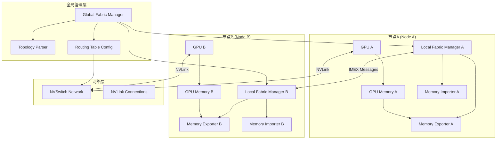
```mermaid
graph TB
    subgraph "节点A (Node A)"
        GPU_A[GPU A]
        LFM_A[Local Fabric Manager A]
        MEM_A[GPU Memory A]
        Exporter_A[Memory Exporter A]
        Importer_A[Memory Importer A]
    end
    
    subgraph "节点B (Node B)"
        GPU_B[GPU B]
        LFM_B[Local Fabric Manager B]
        MEM_B[GPU Memory B]
        Exporter_B[Memory Exporter B]
        Importer_B[Memory Importer B]
    end
    
    subgraph "全局管理层"
        GFM[Global Fabric Manager]
        TopoParser[Topology Parser]
        RoutingCfg[Routing Table Config]
    end
    
    subgraph "网络层"
        NVSwitch[NVSwitch Network]
        NVLink[NVLink Connections]
    end
    
    GPU_A --> MEM_A
    GPU_B --> MEM_B
    MEM_A --> Exporter_A
    MEM_B --> Exporter_B
    
    LFM_A --> Exporter_A
    LFM_A --> Importer_A
    LFM_B --> Exporter_B
    LFM_B --> Importer_B
    
    GFM --> LFM_A
    GFM --> LFM_B
    GFM --> TopoParser
    GFM --> RoutingCfg
    
    RoutingCfg --> NVSwitch
    
    LFM_A <-->|IMEX Messages| LFM_B
    GPU_A <-->|NVLink| NVSwitch
    GPU_B <-->|NVLink| NVSwitch
```

### 2.2 地址类型与层次结构

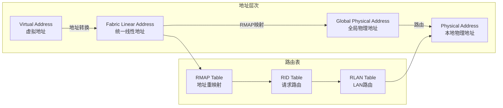
```mermaid
graph LR
    subgraph "地址层次"
        VA[Virtual Address<br/>虚拟地址]
        FLA[Fabric Linear Address<br/>统一线性地址]
        GPA[Global Physical Address<br/>全局物理地址]
        PA[Physical Address<br/>本地物理地址]
    end
    
    VA -->|地址转换| FLA
    FLA -->|RMAP映射| GPA
    GPA -->|路由| PA
    
    subgraph "路由表"
        RMAP[RMAP Table<br/>地址重映射]
        RID[RID Table<br/>请求路由]
        RLAN[RLAN Table<br/>LAN路由]
    end
    
    FLA --> RMAP
    RMAP --> RID
    RID --> RLAN
    RLAN --> PA
```

---

## 3. FLA统一地址机制

### 3.1 FLA地址结构

FLA（Fabric Linear Address）是多节点统一编址的核心，提供跨节点内存访问的统一地址空间。

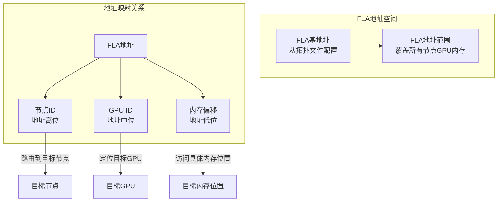
```mermaid
graph TB
    subgraph "FLA地址空间"
        FLA_BASE[FLA基地址<br/>从拓扑文件配置]
        FLA_RANGE[FLA地址范围<br/>覆盖所有节点GPU内存]
    end
    
    subgraph "地址映射关系"
        FLA_ADDR[FLA地址]
        NODE_ID[节点ID<br/>地址高位]
        GPU_ID[GPU ID<br/>地址中位]
        OFFSET[内存偏移<br/>地址低位]
    end
    
    FLA_BASE --> FLA_RANGE
    FLA_ADDR --> NODE_ID
    FLA_ADDR --> GPU_ID
    FLA_ADDR --> OFFSET
    
    NODE_ID -->|路由到目标节点| TARGET_NODE[目标节点]
    GPU_ID -->|定位目标GPU| TARGET_GPU[目标GPU]
    OFFSET -->|访问具体内存位置| TARGET_MEM[目标内存位置]
```

### 3.2 FLA地址配置流程

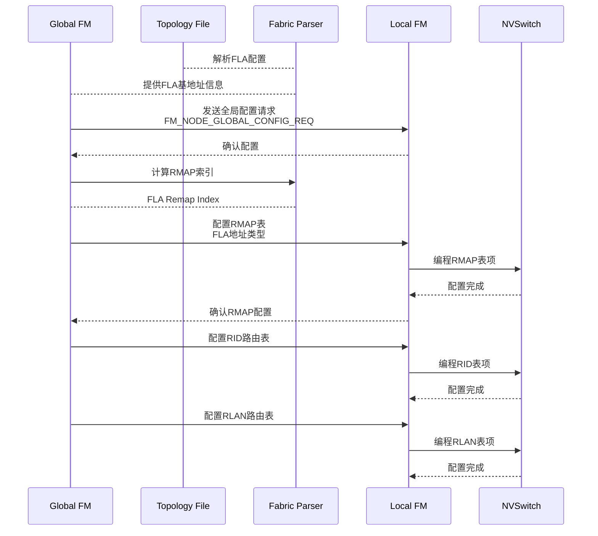
```mermaid
sequenceDiagram
    participant GFM as Global FM
    participant TopoFile as Topology File
    participant Parser as Fabric Parser
    participant LFM as Local FM
    participant NVSwitch as NVSwitch
    
    TopoFile-->Parser: 解析FLA配置
    Parser-->GFM: 提供FLA基地址信息
    
    GFM->>LFM: 发送全局配置请求<br/>FM_NODE_GLOBAL_CONFIG_REQ
    LFM-->>GFM: 确认配置
    
    GFM->>Parser: 计算RMAP索引
    Parser-->GFM: FLA Remap Index
    
    GFM->>LFM: 配置RMAP表<br/>FLA地址类型
    LFM->>NVSwitch: 编程RMAP表项
    NVSwitch-->>LFM: 配置完成
    LFM-->>GFM: 确认RMAP配置
    
    GFM->>LFM: 配置RID路由表
    LFM->>NVSwitch: 编程RID表项
    NVSwitch-->>LFM: 配置完成
    
    GFM->>LFM: 配置RLAN路由表
    LFM->>NVSwitch: 编程RLAN表项
    NVSwitch-->>LFM: 配置完成
```

### 3.3 FLA RMAP表配置代码分析

```cpp
// GlobalFmFabricConfig.cpp: configRmapTableByAddrType()
case FLA_ADDR_TYPE:
{
    // FLA entries
    remapTable = FMDeviceProperty::getFlaRemapTbl(mpGfm->getSwitchArchType());
    index = FMDeviceProperty::getFlaRemapIndexFromTargetId(
        mpGfm->getSwitchArchType(), targetId);
    info->set_firstindex(index);
    info->set_table(remapTable);
    
    for (key.index = index;
         key.index < index + FMDeviceProperty::getNumFlaRemapEntriesPerGpu(...);
         key.index++)
    {
        pCfg = getRmapEntryByTable(key, remapTable);
        if (pCfg)
        {
            pMsg = info->add_entry();
            pMsg->CopyFrom(*pCfg);
            
            // 设置有效位
            pMsg->set_entryvalid(activate ? 1 : 0);
            
            // EGM能力检查
            if (!isEgmCapable && 
                ((key.index == egmGpaIndex) || (key.index == egmFlaIndex)))
            {
                pMsg->set_entryvalid(0);
            }
            count++;
        }
    }
    break;
}
```

---

## 4. IMEX内存导入/导出机制

### 4.1 IMEX架构概览

IMEX（Import/Export）是实现跨节点内存共享的核心机制，负责管理内存对象的导入导出过程。

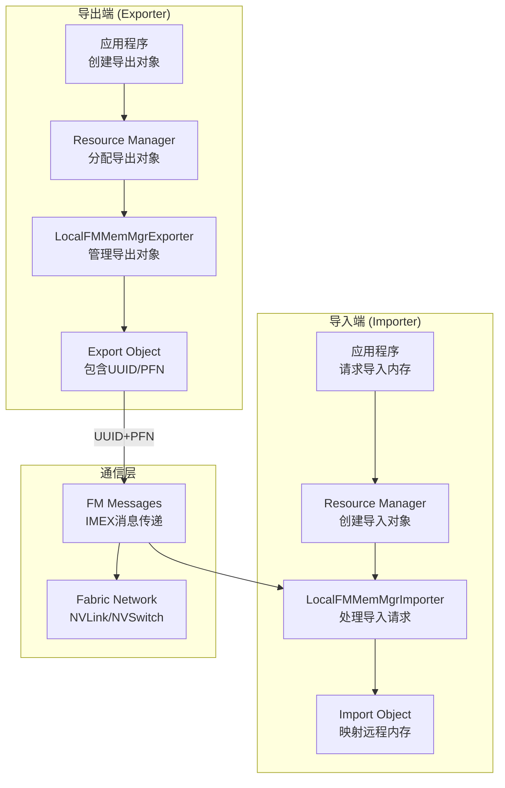
```mermaid
graph TB
    subgraph "导出端 (Exporter)"
        App_Export[应用程序<br/>创建导出对象]
        RM_Export[Resource Manager<br/>分配导出对象]
        Exporter[LocalFMMemMgrExporter<br/>管理导出对象]
        ExportObj[Export Object<br/>包含UUID/PFN]
    end
    
    subgraph "导入端 (Importer)"
        App_Import[应用程序<br/>请求导入内存]
        RM_Import[Resource Manager<br/>创建导入对象]
        Importer[LocalFMMemMgrImporter<br/>处理导入请求]
        ImportObj[Import Object<br/>映射远程内存]
    end
    
    subgraph "通信层"
        FM_Msg[FM Messages<br/>IMEX消息传递]
        Fabric[Fabric Network<br/>NVLink/NVSwitch]
    end
    
    App_Export --> RM_Export
    RM_Export --> Exporter
    Exporter --> ExportObj
    ExportObj -->|UUID+PFN| FM_Msg
    
    App_Import --> RM_Import
    RM_Import --> Importer
    Importer --> ImportObj
    FM_Msg --> Importer
    
    FM_Msg --> Fabric
```

### 4.2 内存导出对象数据结构

```cpp
// LocalFMMemMgrExporter.h: 导出对象键值结构
struct exportObjectKey {
    std::array<uint8, NV_FABRIC_UUID_LEN> exportUuid;  // 导出对象UUID
    uint16 index;                                       // 导出对象索引
};

// 导出对象数据结构
struct exportObjectData {
    uint32 exportGpuId;                 // 导出GPU ID
    uint32 exportObjectRefHandle;       // 导出对象引用句柄
    std::vector<uint32> ffn;            // 页帧号数组 (Page Frame Numbers)
    uint32 pageSize;                    // 页面大小
    uint64 size;                        // 内存大小
    uint16 importCount;                 // 导入计数
    std::set<uint16> nodeIds;           // 导入此对象的节点集合
    uint32 memFlags;                    // 内存标志
    uint32 kind;                        // 内存类型
    exportObjectKey key;                // 导出对象键值
};
```

### 4.3 内存导入请求处理流程

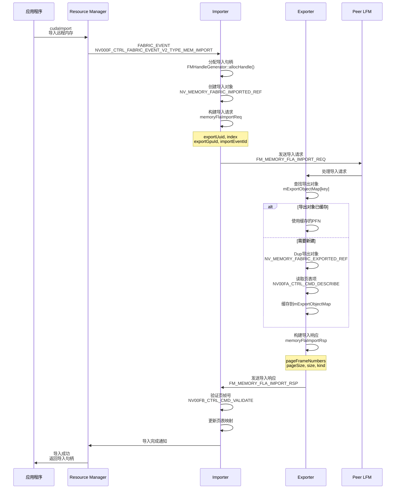
```mermaid
sequenceDiagram
    participant App as 应用程序
    participant RM as Resource Manager
    participant Importer as Importer
    participant Exporter as Exporter
    participant LFM_Peer as Peer LFM
    
    App->>RM: cudaImport<br/>导入远程内存
    RM->>Importer: FABRIC_EVENT<br/>NV000F_CTRL_FABRIC_EVENT_V2_TYPE_MEM_IMPORT
    
    Importer->>Importer: 分配导入句柄<br/>FMHandleGenerator::allocHandle()
    Importer->>Importer: 创建导入对象<br/>NV_MEMORY_FABRIC_IMPORTED_REF
    
    Importer->>Importer: 构建导入请求<br/>memoryFlaImportReq
    Note over Importer: exportUuid, index<br/>exportGpuId, importEventId
    
    Importer->>LFM_Peer: 发送导入请求<br/>FM_MEMORY_FLA_IMPORT_REQ
    
    LFM_Peer->>Exporter: 处理导入请求
    Exporter->>Exporter: 查找导出对象<br/>mExportObjectMap[key]
    
    alt 导出对象已缓存
        Exporter->>Exporter: 使用缓存的PFN
    else 需要新建
        Exporter->>Exporter: Dup导出对象<br/>NV_MEMORY_FABRIC_EXPORTED_REF
        Exporter->>Exporter: 读取页表项<br/>NV00FA_CTRL_CMD_DESCRIBE
        Exporter->>Exporter: 缓存到mExportObjectMap
    end
    
    Exporter->>Exporter: 构建导入响应<br/>memoryFlaImportRsp
    Note over Exporter: pageFrameNumbers<br/>pageSize, size, kind
    
    Exporter->>Importer: 发送导入响应<br/>FM_MEMORY_FLA_IMPORT_RSP
    
    Importer->>Importer: 验证页帧号<br/>NV00FB_CTRL_CMD_VALIDATE
    Importer->>Importer: 更新页表映射
    Importer->>RM: 导入完成通知
    
    RM->>App: 导入成功<br/>返回导入句柄
```

### 4.4 内存导出对象管理

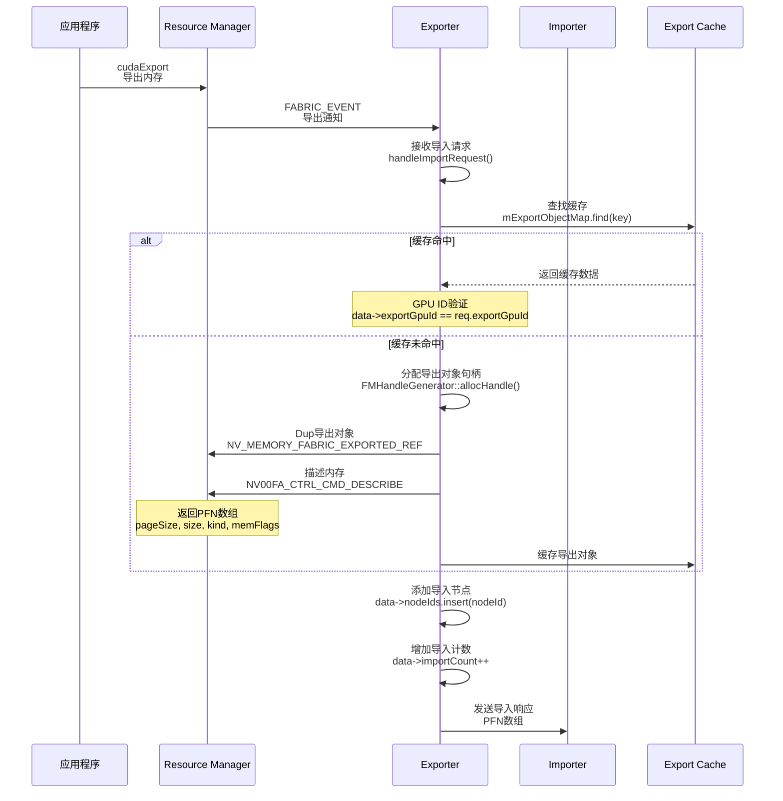
```mermaid
sequenceDiagram
    participant App as 应用程序
    participant RM as Resource Manager
    participant Exporter as Exporter
    participant Importer as Importer
    participant Cache as Export Cache
    
    App->>RM: cudaExport<br/>导出内存
    RM->>Exporter: FABRIC_EVENT<br/>导出通知
    
    Exporter->>Exporter: 接收导入请求<br/>handleImportRequest()
    
    Exporter->>Cache: 查找缓存<br/>mExportObjectMap.find(key)
    
    alt 缓存命中
        Cache-->>Exporter: 返回缓存数据
        Note over Exporter: GPU ID验证<br/>data->exportGpuId == req.exportGpuId
    else 缓存未命中
        Exporter->>Exporter: 分配导出对象句柄<br/>FMHandleGenerator::allocHandle()
        Exporter->>RM: Dup导出对象<br/>NV_MEMORY_FABRIC_EXPORTED_REF
        Exporter->>RM: 描述内存<br/>NV00FA_CTRL_CMD_DESCRIBE
        Note over RM: 返回PFN数组<br/>pageSize, size, kind, memFlags
        Exporter->>Cache: 缓存导出对象
    end
    
    Exporter->>Exporter: 添加导入节点<br/>data->nodeIds.insert(nodeId)
    Exporter->>Exporter: 增加导入计数<br/>data->importCount++
    
    Exporter->>Importer: 发送导入响应<br/>PFN数组
```

### 4.5 内存取消导入流程

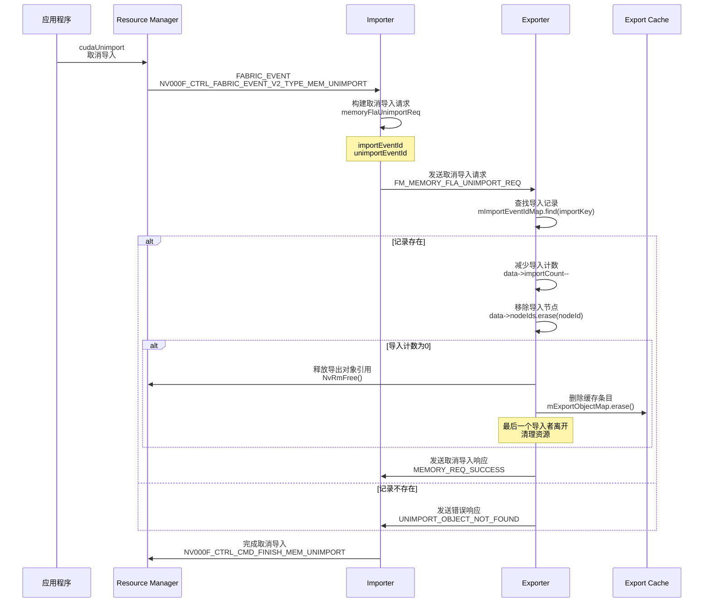
```mermaid
sequenceDiagram
    participant App as 应用程序
    participant RM as Resource Manager
    participant Importer as Importer
    participant Exporter as Exporter
    participant Cache as Export Cache
    
    App->>RM: cudaUnimport<br/>取消导入
    RM->>Importer: FABRIC_EVENT<br/>NV000F_CTRL_FABRIC_EVENT_V2_TYPE_MEM_UNIMPORT
    
    Importer->>Importer: 构建取消导入请求<br/>memoryFlaUnimportReq
    Note over Importer: importEventId<br/>unimportEventId
    
    Importer->>Exporter: 发送取消导入请求<br/>FM_MEMORY_FLA_UNIMPORT_REQ
    
    Exporter->>Exporter: 查找导入记录<br/>mImportEventIdMap.find(importKey)
    
    alt 记录存在
        Exporter->>Exporter: 减少导入计数<br/>data->importCount--
        Exporter->>Exporter: 移除导入节点<br/>data->nodeIds.erase(nodeId)
        
        alt 导入计数为0
            Exporter->>RM: 释放导出对象引用<br/>NvRmFree()
            Exporter->>Cache: 删除缓存条目<br/>mExportObjectMap.erase()
            Note over Exporter: 最后一个导入者离开<br/>清理资源
        end
        
        Exporter->>Importer: 发送取消导入响应<br/>MEMORY_REQ_SUCCESS
    else 记录不存在
        Exporter->>Importer: 发送错误响应<br/>UNIMPORT_OBJECT_NOT_FOUND
    end
    
    Importer->>RM: 完成取消导入<br/>NV000F_CTRL_CMD_FINISH_MEM_UNIMPORT
```

---

## 5. 内存管理器类详解

### 5.1 LocalFMMemMgrExporter 类

**职责**：管理本节点的内存导出对象，响应来自其他节点的导入请求。

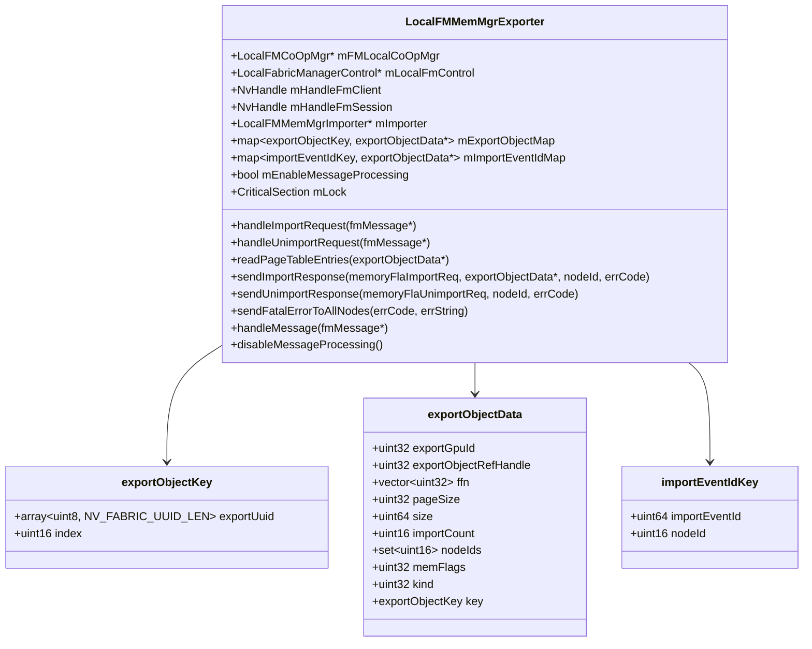
```mermaid
classDiagram
    class LocalFMMemMgrExporter {
        +LocalFMCoOpMgr* mFMLocalCoOpMgr
        +LocalFabricManagerControl* mLocalFmControl
        +NvHandle mHandleFmClient
        +NvHandle mHandleFmSession
        +LocalFMMemMgrImporter* mImporter
        +map~exportObjectKey, exportObjectData*~ mExportObjectMap
        +map~importEventIdKey, exportObjectData*~ mImportEventIdMap
        +bool mEnableMessageProcessing
        +CriticalSection mLock
        
        +handleImportRequest(fmMessage*)
        +handleUnimportRequest(fmMessage*)
        +readPageTableEntries(exportObjectData*)
        +sendImportResponse(memoryFlaImportReq, exportObjectData*, nodeId, errCode)
        +sendUnimportResponse(memoryFlaUnimportReq, nodeId, errCode)
        +sendFatalErrorToAllNodes(errCode, errString)
        +handleMessage(fmMessage*)
        +disableMessageProcessing()
    }
    
    class exportObjectKey {
        +array~uint8, NV_FABRIC_UUID_LEN~ exportUuid
        +uint16 index
    }
    
    class exportObjectData {
        +uint32 exportGpuId
        +uint32 exportObjectRefHandle
        +vector~uint32~ ffn
        +uint32 pageSize
        +uint64 size
        +uint16 importCount
        +set~uint16~ nodeIds
        +uint32 memFlags
        +uint32 kind
        +exportObjectKey key
    }
    
    class importEventIdKey {
        +uint64 importEventId
        +uint16 nodeId
    }
    
    LocalFMMemMgrExporter --> exportObjectKey
    LocalFMMemMgrExporter --> exportObjectData
    LocalFMMemMgrExporter --> importEventIdKey
```

#### 关键数据结构说明

| 结构 | 字段 | 说明 |
|------|------|------|
| `mExportObjectMap` | UUID+Index → ExportData | 按UUID索引的导出对象缓存 |
| `mImportEventIdMap` | EventID+NodeID → ExportData | 按导入事件追踪的映射 |
| `exportObjectData.ffn` | Page Frame Numbers | 物理页帧号数组 |
| `exportObjectData.nodeIds` | Set of Node IDs | 正在导入此对象的节点集合 |

### 5.2 LocalFMMemMgrImporter 类

**职责**：处理本节点的内存导入请求，与远程Exporter通信获取PFN。

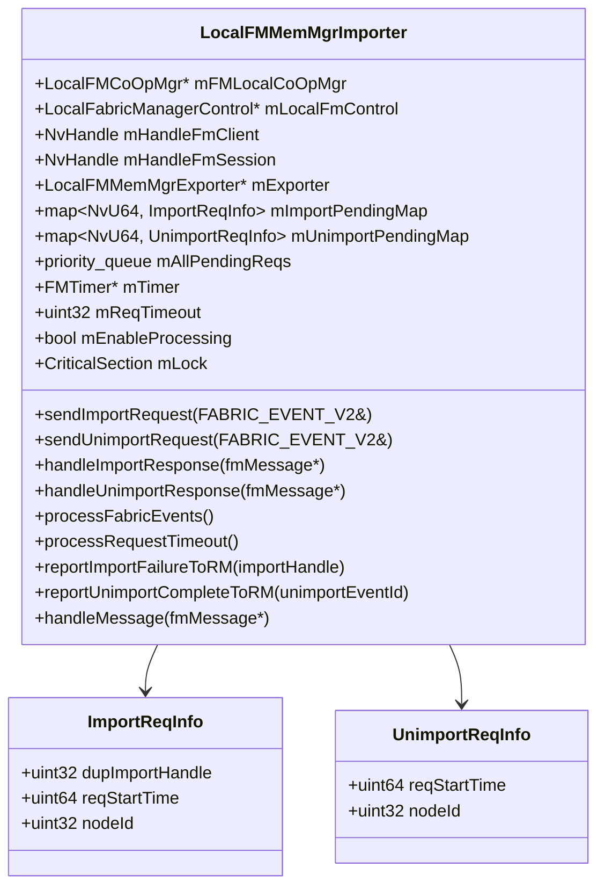
```mermaid
classDiagram
    class LocalFMMemMgrImporter {
        +LocalFMCoOpMgr* mFMLocalCoOpMgr
        +LocalFabricManagerControl* mLocalFmControl
        +NvHandle mHandleFmClient
        +NvHandle mHandleFmSession
        +LocalFMMemMgrExporter* mExporter
        +map~NvU64, ImportReqInfo~ mImportPendingMap
        +map~NvU64, UnimportReqInfo~ mUnimportPendingMap
        +priority_queue mAllPendingReqs
        +FMTimer* mTimer
        +uint32 mReqTimeout
        +bool mEnableProcessing
        +CriticalSection mLock
        
        +sendImportRequest(FABRIC_EVENT_V2&)
        +sendUnimportRequest(FABRIC_EVENT_V2&)
        +handleImportResponse(fmMessage*)
        +handleUnimportResponse(fmMessage*)
        +processFabricEvents()
        +processRequestTimeout()
        +reportImportFailureToRM(importHandle)
        +reportUnimportCompleteToRM(unimportEventId)
        +handleMessage(fmMessage*)
    }
    
    class ImportReqInfo {
        +uint32 dupImportHandle
        +uint64 reqStartTime
        +uint32 nodeId
    }
    
    class UnimportReqInfo {
        +uint64 reqStartTime
        +uint32 nodeId
    }
    
    LocalFMMemMgrImporter --> ImportReqInfo
    LocalFMMemMgrImporter --> UnimportReqInfo
```

#### 超时处理机制

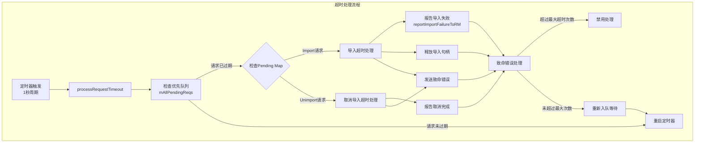
```mermaid
graph TB
    subgraph "超时处理流程"
        Timer[定时器触发<br/>1秒周期]
        ProcessTimeout[processRequestTimeout]
        CheckQueue[检查优先队列<br/>mAllPendingReqs]
        
        Timer --> ProcessTimeout
        ProcessTimeout --> CheckQueue
        
        CheckQueue -->|请求已过期| CheckMap{检查Pending Map}
        CheckQueue -->|请求未过期| RestartTimer[重启定时器]
        
        CheckMap -->|Import请求| ImportTimeout[导入超时处理]
        CheckMap -->|Unimport请求| UnimportTimeout[取消导入超时处理]
        
        ImportTimeout --> ReportFail[报告导入失败<br/>reportImportFailureToRM]
        ImportTimeout --> FreeHandle[释放导入句柄]
        ImportTimeout --> SendFatal[发送致命错误]
        
        UnimportTimeout --> ReportComplete[报告取消完成]
        UnimportTimeout --> SendFatal
        
        ReportFail --> FatalError[致命错误处理]
        FreeHandle --> FatalError
        ReportComplete --> FatalError
        SendFatal --> FatalError
        
        FatalError -->|超过最大超时次数| DisableProc[禁用处理]
        FatalError -->|未超过最大次数| Requeue[重新入队等待]
        Requeue --> RestartTimer
    end
```

### 5.3 内存消息协议定义

```protobuf
// memmgr.proto.precomp: FLA内存导入请求
message memoryFlaImportReq {
    optional bytes          exportUuid      = 1;    // 导出对象UUID
    optional uint32         index           = 2;    // 导出对象索引
    optional uint32         exportGpuId     = 3;    // 内存所属GPU ID
    optional uint64         importEventId   = 4;    // 导入事件ID
};

// FLA内存导入响应
message memoryFlaImportRsp {
    optional uint32         errCode         = 1;    // 错误码
    optional uint64         importEventId   = 2;    // 导入事件ID
    repeated uint32         pageFrameNumbers = 3;   // PFN数组
    optional uint32         kind            = 4;    // 内存类型
    optional uint32         pageSize        = 5;    // 页面大小
    optional uint64         size            = 6;    // 内存总大小
    optional uint32         memFlags        = 7;    // 内存标志
};

// FLA内存取消导入请求
message memoryFlaUnimportReq {
    optional uint64         importEventId   = 1;    // 导入事件ID
    optional uint64         unimportEventId = 2;    // 取消导入事件ID
};

// 错误码定义
enum memoryReqErrors {
    MEMORY_REQ_SUCCESS              = 0;    // 成功
    GPUD_ID_MISMATCH                = 1;    // GPU ID不匹配
    HANDLE_ALLOC_FAIL               = 2;    // 句柄分配失败
    EXPORT_OBJECT_DUP_FAIL          = 3;    // 导出对象复制失败
    READ_PAGE_TABLE_ENTRIES_FAIL    = 4;    // 读取页表失败
    UNIMPORT_OBJECT_NOT_FOUND       = 5;    // 未找到取消导入对象
};
```

---

## 6. 路由表机制

### 6.1 路由表体系结构

NVSwitch路由表体系由多层表格构成，共同实现FLA地址到物理内存的完整路由路径。

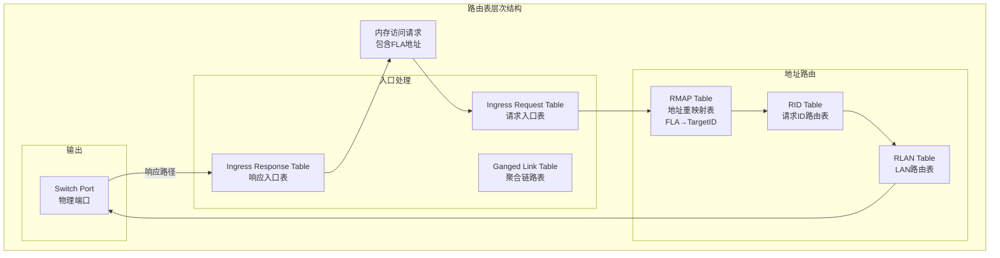
```mermaid
graph TB
    subgraph "路由表层次结构"
        Request[内存访问请求<br/>包含FLA地址]
        
        subgraph "入口处理"
            IngressReq[Ingress Request Table<br/>请求入口表]
            IngressResp[Ingress Response Table<br/>响应入口表]
            GangedLink[Ganged Link Table<br/>聚合链路表]
        end
        
        subgraph "地址路由"
            RMAP[RMAP Table<br/>地址重映射表<br/>FLA→TargetID]
            RID[RID Table<br/>请求ID路由表]
            RLAN[RLAN Table<br/>LAN路由表]
        end
        
        subgraph "输出"
            Port[Switch Port<br/>物理端口]
        end
        
        Request --> IngressReq
        IngressReq --> RMAP
        RMAP --> RID
        RID --> RLAN
        RLAN --> Port
        
        Port -->|响应路径| IngressResp
        IngressResp --> Request
    end
```

### 6.2 RMAP表详解

RMAP（Remap Policy Table）负责将FLA地址重映射到目标GPU ID。

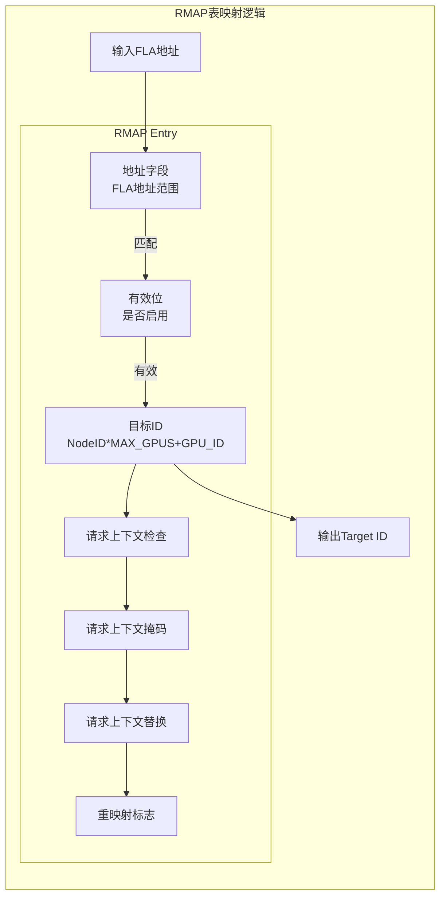
```mermaid
graph LR
    subgraph "RMAP表映射逻辑"
        FLA_In[输入FLA地址]
        
        subgraph "RMAP Entry"
            Address[地址字段<br/>FLA地址范围]
            TargetID[目标ID<br/>NodeID*MAX_GPUS+GPU_ID]
            EntryValid[有效位<br/>是否启用]
            ReqContextChk[请求上下文检查]
            ReqContextMask[请求上下文掩码]
            ReqContextRep[请求上下文替换]
            RemapFlags[重映射标志]
        end
        
        Target_Out[输出Target ID]
    end
    
    FLA_In --> Address
    Address -->|匹配| EntryValid
    EntryValid -->|有效| TargetID
    TargetID --> Target_Out
    
    TargetID --> ReqContextChk
    ReqContextChk --> ReqContextMask
    ReqContextMask --> ReqContextRep
    ReqContextRep --> RemapFlags
```

#### RMAP表配置代码

```cpp
// GlobalFmFabricConfig.cpp: RMAP表配置
FMIntReturn_t FMFabricConfig::configRmapTableByAddrType(
    uint32_t nodeId, uint32_t partitionId, uint32_t switchPhysicalId,
    uint32_t portNum, std::list<uint32_t> &gpuPhysicalIds, 
    bool activate, FabricAddrType addrType)
{
    // 根据地址类型选择重映射表
    switch (addrType)
    {
        case GPA_ADDR_TYPE:
            remapTable = FMDeviceProperty::getGpaRemapTbl(archType);
            index = FMDeviceProperty::getGpaRemapIndexFromTargetId(archType, targetId);
            break;
            
        case FLA_ADDR_TYPE:
            remapTable = FMDeviceProperty::getFlaRemapTbl(archType);
            index = FMDeviceProperty::getFlaRemapIndexFromTargetId(archType, targetId);
            break;
            
        case SPA_ADDR_TYPE:
            remapTable = FMDeviceProperty::getSpaRemapTbl(archType);
            index = FMDeviceProperty::getSpaRemapIndexFromSpaAddress(archType, spaAddress);
            break;
    }
    
    // 配置每个GPU的RMAP表项
    for (auto gpuPhysicalId : gpuPhysicalIds)
    {
        uint32_t targetId = nodeId * MAX_NUM_GPUS_PER_NODE + gpuPhysicalId;
        // 设置表项有效位
        pMsg->set_entryvalid(activate ? 1 : 0);
        pMsg->set_targetid(targetId);
    }
}
```

### 6.3 RID/RLAN路由表

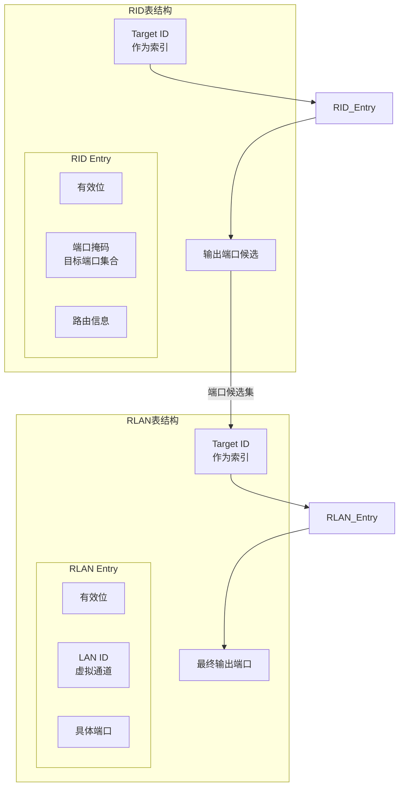
```mermaid
graph TB
    subgraph "RID表结构"
        TargetID_RID[Target ID<br/>作为索引]
        subgraph "RID Entry"
            RID_Valid[有效位]
            RID_Port[端口掩码<br/>目标端口集合]
            RID_Route[路由信息]
        end
        Port_Out_RID[输出端口候选]
    end
    
    TargetID_RID --> RID_Entry
    RID_Entry --> Port_Out_RID
    
    subgraph "RLAN表结构"
        TargetID_RLAN[Target ID<br/>作为索引]
        subgraph "RLAN Entry"
            RLAN_Valid[有效位]
            RLAN_Lan[LAN ID<br/>虚拟通道]
            RLAN_Port[具体端口]
        end
        Port_Out_RLAN[最终输出端口]
    end
    
    TargetID_RLAN --> RLAN_Entry
    RLAN_Entry --> Port_Out_RLAN
    
    Port_Out_RID -->|端口候选集| TargetID_RLAN
```

### 6.4 路由表配置流程

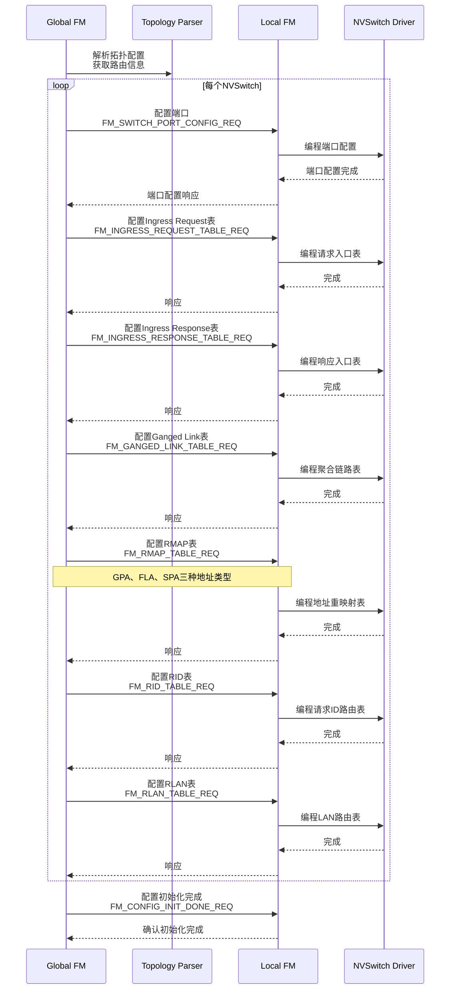
```mermaid
sequenceDiagram
    participant GFM as Global FM
    participant Parser as Topology Parser
    participant LFM as Local FM
    participant NVSwitch as NVSwitch Driver
    
    GFM->>Parser: 解析拓扑配置<br/>获取路由信息
    
    loop 每个NVSwitch
        GFM->>LFM: 配置端口<br/>FM_SWITCH_PORT_CONFIG_REQ
        LFM->>NVSwitch: 编程端口配置
        NVSwitch-->>LFM: 端口配置完成
        LFM-->>GFM: 端口配置响应
        
        GFM->>LFM: 配置Ingress Request表<br/>FM_INGRESS_REQUEST_TABLE_REQ
        LFM->>NVSwitch: 编程请求入口表
        NVSwitch-->>LFM: 完成
        LFM-->>GFM: 响应
        
        GFM->>LFM: 配置Ingress Response表<br/>FM_INGRESS_RESPONSE_TABLE_REQ
        LFM->>NVSwitch: 编程响应入口表
        NVSwitch-->>LFM: 完成
        LFM-->>GFM: 响应
        
        GFM->>LFM: 配置Ganged Link表<br/>FM_GANGED_LINK_TABLE_REQ
        LFM->>NVSwitch: 编程聚合链路表
        NVSwitch-->>LFM: 完成
        LFM-->>GFM: 响应
        
        GFM->>LFM: 配置RMAP表<br/>FM_RMAP_TABLE_REQ
        Note over GFM,LFM: GPA、FLA、SPA三种地址类型
        LFM->>NVSwitch: 编程地址重映射表
        NVSwitch-->>LFM: 完成
        LFM-->>GFM: 响应
        
        GFM->>LFM: 配置RID表<br/>FM_RID_TABLE_REQ
        LFM->>NVSwitch: 编程请求ID路由表
        NVSwitch-->>LFM: 完成
        LFM-->>GFM: 响应
        
        GFM->>LFM: 配置RLAN表<br/>FM_RLAN_TABLE_REQ
        LFM->>NVSwitch: 编程LAN路由表
        NVSwitch-->>LFM: 完成
        LFM-->>GFM: 响应
    end
    
    GFM->>LFM: 配置初始化完成<br/>FM_CONFIG_INIT_DONE_REQ
    LFM-->>GFM: 确认初始化完成
```

---

## 7. 跨节点连接发现机制

### 7.1 Discovery Token机制

Discovery Token用于识别跨节点的NVLink连接，通过写入和读取token来建立连接映射。

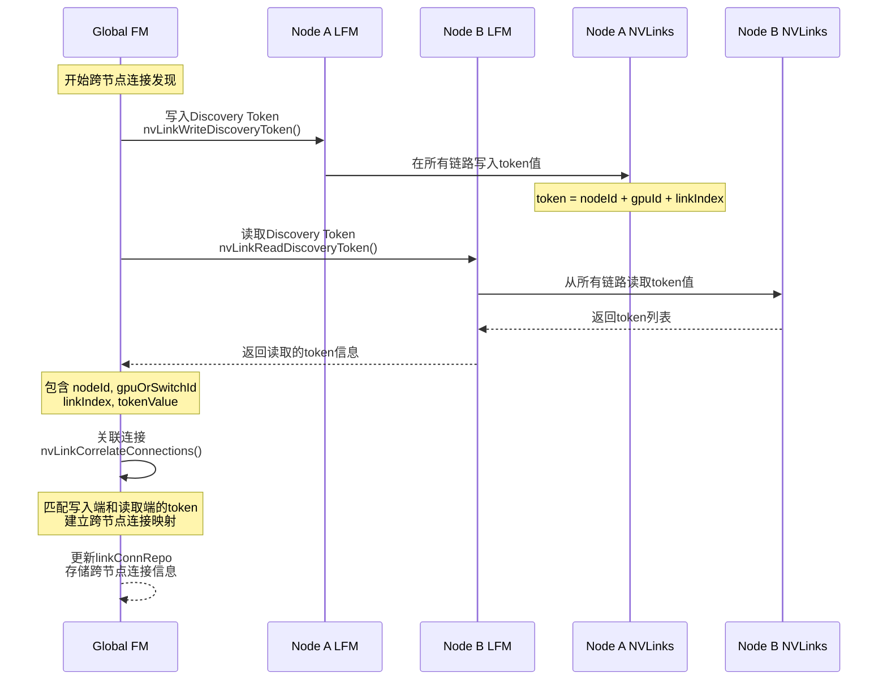
```mermaid
sequenceDiagram
    participant GFM as Global FM
    participant NodeA as Node A LFM
    participant NodeB as Node B LFM
    participant LinkA as Node A NVLinks
    participant LinkB as Node B NVLinks
    
    Note over GFM: 开始跨节点连接发现
    
    GFM->>NodeA: 写入Discovery Token<br/>nvLinkWriteDiscoveryToken()
    NodeA->>LinkA: 在所有链路写入token值
    Note over LinkA: token = nodeId + gpuId + linkIndex
    
    GFM->>NodeB: 读取Discovery Token<br/>nvLinkReadDiscoveryToken()
    NodeB->>LinkB: 从所有链路读取token值
    LinkB-->>NodeB: 返回token列表
    
    NodeB-->>GFM: 返回读取的token信息
    Note over GFM: 包含 nodeId, gpuOrSwitchId<br/>linkIndex, tokenValue
    
    GFM->>GFM: 关联连接<br/>nvLinkCorrelateConnections()
    Note over GFM: 匹配写入端和读取端的token<br/>建立跨节点连接映射
    
    GFM-->>GFM: 更新linkConnRepo<br/>存储跨节点连接信息
```

### 7.2 SID机制

SID（Source ID）用于跨节点链路的身份识别，替代Discovery Token提供更可靠的连接标识。

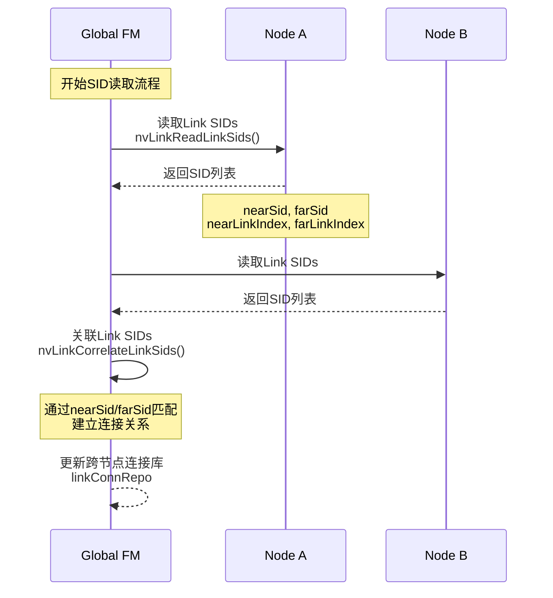
```mermaid
sequenceDiagram
    participant GFM as Global FM
    participant NodeA as Node A
    participant NodeB as Node B
    
    Note over GFM: 开始SID读取流程
    
    GFM->>NodeA: 读取Link SIDs<br/>nvLinkReadLinkSids()
    NodeA-->>GFM: 返回SID列表
    Note over NodeA: nearSid, farSid<br/>nearLinkIndex, farLinkIndex
    
    GFM->>NodeB: 读取Link SIDs
    NodeB-->>GFM: 返回SID列表
    
    GFM->>GFM: 关联Link SIDs<br/>nvLinkCorrelateLinkSids()
    Note over GFM: 通过nearSid/farSid匹配<br/>建立连接关系
    
    GFM-->>GFM: 更新跨节点连接库<br/>linkConnRepo
```

#### SID数据结构

```cpp
// FMNVLinkTypes.h: SID信息结构
typedef struct FMLinkSidInfo
{
    uint32 nodeId;           // 节点ID
    uint64 gpuOrSwitchId;    // GPU或Switch ID
    uint64 nearSid;          // 近端SID
    uint32 nearLinkIndex;    // 近端链路索引
    uint64 farSid;           // 远端SID
    uint32 farLinkIndex;     // 远端链路索引
} FMLinkSidInfo;

typedef std::list<FMLinkSidInfo> FMNVLinkSidList;
```

### 7.3 跨节点连接信息管理

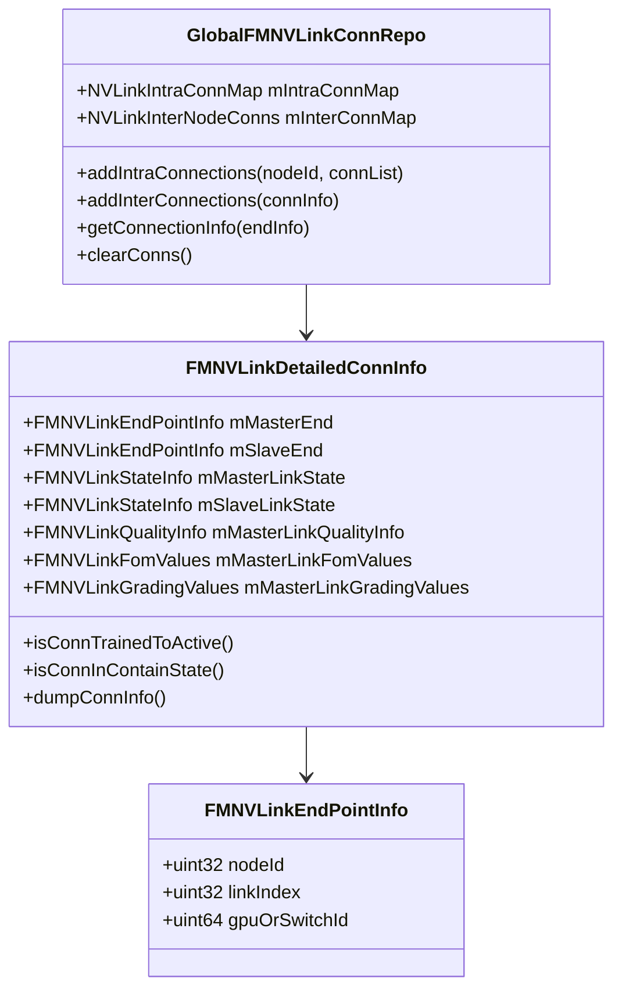
```mermaid
classDiagram
    class GlobalFMNVLinkConnRepo {
        +NVLinkIntraConnMap mIntraConnMap
        +NVLinkInterNodeConns mInterConnMap
        
        +addIntraConnections(nodeId, connList)
        +addInterConnections(connInfo)
        +getConnectionInfo(endInfo)
        +clearConns()
    }
    
    class FMNVLinkDetailedConnInfo {
        +FMNVLinkEndPointInfo mMasterEnd
        +FMNVLinkEndPointInfo mSlaveEnd
        +FMNVLinkStateInfo mMasterLinkState
        +FMNVLinkStateInfo mSlaveLinkState
        +FMNVLinkQualityInfo mMasterLinkQualityInfo
        +FMNVLinkFomValues mMasterLinkFomValues
        +FMNVLinkGradingValues mMasterLinkGradingValues
        
        +isConnTrainedToActive()
        +isConnInContainState()
        +dumpConnInfo()
    }
    
    class FMNVLinkEndPointInfo {
        +uint32 nodeId
        +uint32 linkIndex
        +uint64 gpuOrSwitchId
    }
    
    GlobalFMNVLinkConnRepo --> FMNVLinkDetailedConnInfo
    FMNVLinkDetailedConnInfo --> FMNVLinkEndPointInfo
```

---

## 8. 并行跨节点链路训练

### 8.1 并行训练架构

多节点系统采用并行训练机制，同时对多条跨节点链路进行训练，提高训练效率。

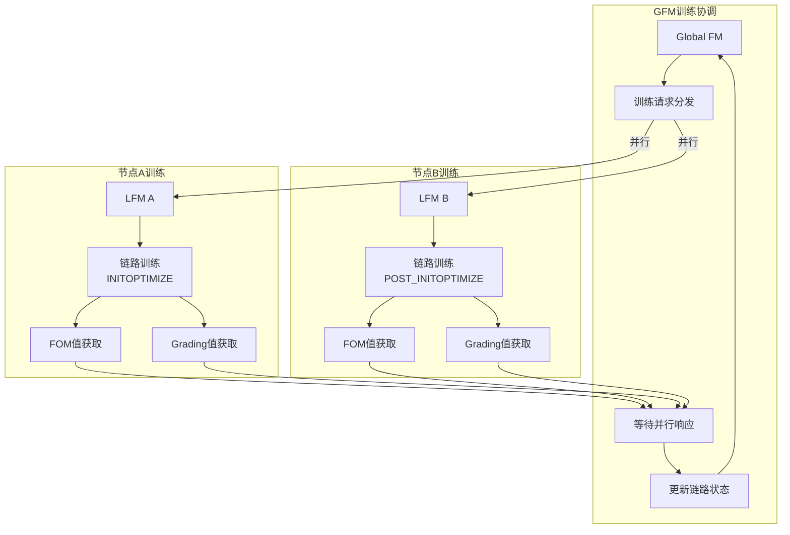
```mermaid
graph TB
    subgraph "GFM训练协调"
        GFM[Global FM]
        TrainReq[训练请求分发]
        WaitResp[等待并行响应]
        UpdateState[更新链路状态]
    end
    
    subgraph "节点A训练"
        LFM_A[LFM A]
        Train_A[链路训练<br/>INITOPTIMIZE]
        FOM_A[FOM值获取]
        Grade_A[Grading值获取]
    end
    
    subgraph "节点B训练"
        LFM_B[LFM B]
        Train_B[链路训练<br/>POST_INITOPTIMIZE]
        FOM_B[FOM值获取]
        Grade_B[Grading值获取]
    end
    
    GFM --> TrainReq
    TrainReq -->|并行| LFM_A
    TrainReq -->|并行| LFM_B
    
    LFM_A --> Train_A
    LFM_B --> Train_B
    
    Train_A --> FOM_A
    Train_A --> Grade_A
    Train_B --> FOM_B
    Train_B --> Grade_B
    
    FOM_A --> WaitResp
    FOM_B --> WaitResp
    Grade_A --> WaitResp
    Grade_B --> WaitResp
    
    WaitResp --> UpdateState
    UpdateState --> GFM
```

### 8.2 并行训练流程

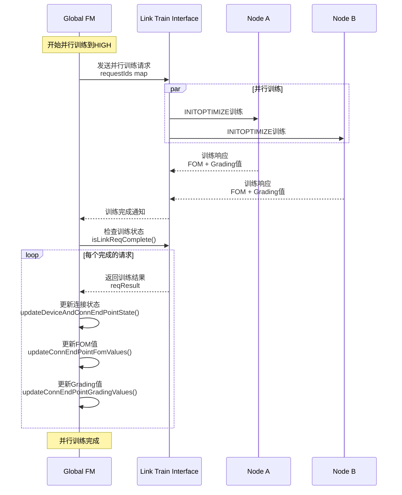
```mermaid
sequenceDiagram
    participant GFM as Global FM
    participant TrainIntf as Link Train Interface
    participant NodeA as Node A
    participant NodeB as Node B
    
    Note over GFM: 开始并行训练到HIGH
    
    GFM->>TrainIntf: 发送并行训练请求<br/>requestIds map
    
    par 并行训练
        TrainIntf->>NodeA: INITOPTIMIZE训练
        TrainIntf->>NodeB: INITOPTIMIZE训练
    end
    
    NodeA-->>TrainIntf: 训练响应<br/>FOM + Grading值
    NodeB-->>TrainIntf: 训练响应<br/>FOM + Grading值
    
    TrainIntf-->>GFM: 训练完成通知
    
    GFM->>TrainIntf: 检查训练状态<br/>isLinkReqComplete()
    
    loop 每个完成的请求
        TrainIntf-->>GFM: 返回训练结果<br/>reqResult
        GFM->>GFM: 更新连接状态<br/>updateDeviceAndConnEndPointState()
        GFM->>GFM: 更新FOM值<br/>updateConnEndPointFomValues()
        GFM->>GFM: 更新Grading值<br/>updateConnEndPointGradingValues()
    end
    
    Note over GFM: 并行训练完成
```

### 8.3 训练类型枚举

```cpp
// FMNVLinkTypes.h: NVLink训练类型
typedef enum FMNVLinkTrainType
{
    NVLINK_TRAIN_OFF_TO_SAFE = 0,
    NVLINK_TRAIN_SAFE_TO_HIGH,
    NVLINK_TRAIN_TO_OFF,
    NVLINK_TRAIN_HIGH_TO_SAFE,
    NVLINK_TRAIN_SAFE_TO_OFF,
    
    // 多节点特有训练类型
    NVLINK_TRAIN_SAFE_TO_INITOPTIMIZE,
    NVLINK_TRAIN_POST_INITOPTIMIZE,
    NVLINK_TRAIN_INTERNODE_PARALLEL_INITOPTIMIZE_TO_HIGH,
    NVLINK_TRAIN_INTERNODE_PARALLEL_TO_OFF,
    NVLINK_TRAIN_INTERNODE_PARALLEL_OPTICAL_ENABLE_INF_MODE,
    NVLINK_TRAIN_INTERNODE_PARALLEL_OPTICAL_ENABLE_MAINTENANCE_RX,
    NVLINK_TRAIN_INTERNODE_PARALLEL_OPTICAL_ENABLE_MAINTENANCE_TX,
    NVLINK_TRAIN_INTERNODE_PARALLEL_OPTICAL_DISABLE_INF_MODE,
    NVLINK_TRAIN_INTERNODE_PARALLEL_OPTICAL_ENABLE_FORCE_EQ,
    NVLINK_TRAIN_INTERNODE_PARALLEL_OPTICAL_DISABLE_FORCE_EQ,
    NVLINK_TRAIN_INTERNODE_PARALLEL_OPTICAL_CHECK_EOM_STATUS,
    NVLINK_TRAIN_INTERNODE_PARALLEL_GET_LINK_STATE,
    NVLINK_TRAIN_INTERNODE_GET_GRADING_AND_FOM_VALUES,
    
    // 子链路训练
    NVLINK_TRAIN_SAFE_TO_HIGH_SUBLINK,
    NVLINK_TRAIN_SAFE_TO_HIGH_MAINLINK,
    NVLINK_TRAIN_HIGH_TO_SAFE_SUBLINK,
    NVLINK_TRAIN_HIGH_TO_SAFE_MAINLINK,
    NVLINK_TRAIN_OFF_TO_SAFE_SUBLINK,
    NVLINK_TRAIN_OFF_TO_SAFE_MAINLINK
} FMNVLinkTrainType;
```

### 8.4 FOM和Grading值获取

```mermaid
sequenceDiagram
    participant GFM as Global FM
    participant Helper as GFMHelper
    participant TrainIntf as Link Train Interface
    participant LFM as Local FM
    
    Note over GFM: 训练完成后获取质量指标
    
    GFM->>Helper: getGradingAndFomValues()
    Helper->>TrainIntf: 发送获取请求<br/>NVLINK_TRAIN_INTERNODE_GET_GRADING_AND_FOM_VALUES
    
    TrainIntf->>LFM: 获取FOM值<br/>NVSWITCH_GET_FOM_VALUES
    LFM-->>TrainIntf: 返回FOM数组
    
    TrainIntf->>LFM: 获取Grading值<br/>NVSWITCH_GET_GRADING_VALUES
    LFM-->>TrainIntf: 返回Grading数据
    
    TrainIntf-->>Helper: 返回质量指标
    
    Helper->>Helper: updateConnEndPointFomValues()
    Helper->>Helper: updateConnEndPointGradingValues()
    
    Helper-->>GFM: 质量指标获取完成
```

#### FOM/Grading数据结构

```cpp
// FMNVLinkTypes.h: FOM值结构
typedef struct FMNVLinkFomValues
{
    uint8 numLanes;
    uint16 fomValues[NVSWITCH_NVLINK_MAX_LANES];
} FMNVLinkFomValues;

// Grading值结构
typedef struct FMNVLinkGradingValues
{
    uint8 laneMask;
    uint8 txInit[NVSWITCH_CCI_XVCR_LANES];
    uint8 rxInit[NVSWITCH_CCI_XVCR_LANES];
    uint8 txMaint[NVSWITCH_CCI_XVCR_LANES];
    uint8 rxMaint[NVSWITCH_CCI_XVCR_LANES];
} FMNVLinkGradingValues;
```

---

## 9. LFM间协作通信

### 9.1 Peer LFM通信架构

```mermaid
graph TB
    subgraph "LFM间通信架构"
        LFM_A[Local FM A]
        LFM_B[Local FM B]
        LFM_C[Local FM C]
        
        CoOpMgr_A[CoOp Manager A]
        CoOpMgr_B[CoOp Manager B]
        CoOpMgr_C[CoOp Manager C]
        
        TCP_A[TCP Connection A]
        TCP_B[TCP Connection B]
        TCP_C[TCP Connection C]
    end
    
    LFM_A --> CoOpMgr_A
    LFM_B --> CoOpMgr_B
    LFM_C --> CoOpMgr_C
    
    CoOpMgr_A <-->|IMEX Messages| TCP_A
    CoOpMgr_B <-->|IMEX Messages| TCP_B
    CoOpMgr_C <-->|IMEX Messages| TCP_C
    
    TCP_A <--> CoOpMgr_B
    TCP_A <--> CoOpMgr_C
    TCP_B <--> CoOpMgr_A
    TCP_B <--> CoOpMgr_C
```

### 9.2 Peer Node信息传递

```mermaid
sequenceDiagram
    participant GFM as Global FM
    participant Parser as Topology Parser
    participant LFM_A as LFM A
    participant LFM_B as LFM B
    
    GFM->>Parser: 解析节点配置
    Parser-->>GFM: 返回节点信息列表
    Note over Parser: nodeId, IPAddress
    
    GFM->>LFM_A: 发送Peer节点信息<br/>FM_NODE_INFO_MSG
    Note over GFM,LFM_A: 包含所有节点的<br/>nodeId和IPAddress
    
    GFM->>LFM_B: 发送Peer节点信息
    Note over GFM,LFM_B: 同样的节点信息
    
    LFM_A->>LFM_A: 存储Peer节点信息
    LFM_B->>LFM_B: 存储Peer节点信息
    
    LFM_A->>LFM_B: 建立TCP连接
    LFM_B-->>LFM_A: 连接建立成功
    
    Note over LFM_A,LFM_B: Peer LFM连接就绪<br/>可用于IMEX消息传递
```

---

## 10. 条件编译与功能开关

### 10.1 NVCFG多节点功能开关

所有多节点相关功能通过 `NVCFG(GLOBAL_FEATURE_RID72837_KT_MULTINODE)` 条件编译控制：

```cpp
#if NVCFG(GLOBAL_FEATURE_RID72837_KT_MULTINODE)
    // 多节点特有代码
    // 包括：
    // - FLA内存导入导出
    // - 跨节点连接发现
    // - SID机制
    // - 并行链路训练
    // - FOM/Grading值获取
    // - Peer LFM通信
#endif
```

### 10.2 受控的多节点功能模块

| 模块 | 条件编译宏 | 功能说明 |
|------|------------|----------|
| LocalFMMemMgr.cpp | NVCFG(MULTINODE) | 基础IMEX功能 |
| LocalFMMemMgrExporter.cpp | NVCFG(MULTINODE) | FLA导出管理 |
| LocalFMMemMgrImporter.cpp | NVCFG(MULTINODE) | FLA导入管理 |
| GFMHelper.cpp | NVCFG(MULTINODE) | 跨节点发现/训练 |
| GlobalFmFabricConfig.cpp | NVCFG(LS10) | SPA地址类型 |
| FMNVLinkTypes.h | NVCFG(MULTINODE) | 多节点训练类型 |

---

## 11. 完整工作流程示例

### 11.1 跨节点内存共享完整流程

```mermaid
sequenceDiagram
    participant AppA as App on Node A
    participant AppB as App on Node B
    participant LFM_A as LFM A
    participant LFM_B as LFM B
    participant GFM as Global FM
    participant NVSwitch as NVSwitch Network
    
    Note over GFM: 系统初始化阶段
    
    GFM->>LFM_A: 发送全局配置
    GFM->>LFM_B: 发送全局配置
    
    GFM->>LFM_A: 发送Peer节点信息
    GFM->>LFM_B: 发送Peer节点信息
    
    LFM_A->>LFM_B: 建立Peer连接
    
    GFM->>LFM_A: 配置路由表<br/>RMAP/RID/RLAN
    GFM->>LFM_B: 配置路由表
    
    LFM_A->>NVSwitch: 编程路由表
    LFM_B->>NVSwitch: 编程路由表
    
    Note over GFM: 运行阶段 - 内存导出
    
    AppA->>LFM_A: cudaMalloc + cudaExport
    Note over AppA: 创建导出对象<br/>获得UUID
    
    Note over AppB: 运行阶段 - 内存导入
    
    AppB->>LFM_B: cudaImport(UUID)
    LFM_B->>LFM_B: Fabric Event触发
    LFM_B->>LFM_A: 发送导入请求<br/>FM_MEMORY_FLA_IMPORT_REQ
    
    LFM_A->>LFM_A: 处理导入请求
    Note over LFM_A: 查找导出对象<br/>读取PFN数组
    
    LFM_A->>LFM_B: 发送导入响应<br/>FM_MEMORY_FLA_IMPORT_RSP
    Note over LFM_A: 包含PFN、pageSize、size
    
    LFM_B->>LFM_B: 验证PFN
    Note over LFM_B: NV00FB_CTRL_CMD_VALIDATE
    
    AppB->>AppB: 导入成功<br/>可访问远程内存
    
    Note over AppA,AppB: 数据传输阶段
    
    AppB->>NVSwitch: 使用FLA地址访问
    NVSwitch->>LFM_A: RMAP查找Target ID
    NVSwitch->>LFM_A: RID路由到端口
    NVSwitch->>AppA: 物理内存访问
    
    NVSwitch-->>AppB: 返回数据
    Note over AppB,AppA: 高带宽NVLink传输
    
    Note over AppA,AppB: 清理阶段
    
    AppB->>LFM_B: cudaUnimport
    LFM_B->>LFM_A: 发送取消导入请求
    
    LFM_A->>LFM_A: 减少导入计数
    LFM_A->>LFM_B: 发送取消导入响应
    
    AppA->>LFM_A: cudaFree导出对象
    Note over LFM_A: 清理导出资源
```

---

## 12. 总结

### 12.1 关键技术要点

1. **FLA统一地址空间**：提供跨节点GPU内存的统一地址视图，简化分布式应用开发
2. **IMEX机制**：通过UUID标识和PFN传递实现透明的跨节点内存映射
3. **多层路由表**：RMAP→RID→RLAN的层次化路由确保正确的数据传输路径
4. **Discovery Token/SID**：可靠的跨节点连接发现和识别机制
5. **并行训练**：高效的多链路并行训练提升系统初始化速度
6. **FOM/Grading**：链路质量评估机制确保系统性能

### 12.2 设计优势

| 方面 | 优势 |
|------|------|
| 透明性 | 应用无需感知内存物理位置 |
| 高性能 | NVLink/NVSwitch高带宽低延迟 |
| 可扩展 | 支持多节点大规模系统 |
| 可靠性 | 完整的错误处理和超时机制 |
| 灵活性 | 动态内存导入导出管理 |

### 12.3 相关文件索引

| 文件路径 | 核心功能 |
|----------|----------|
| `localfm/LocalFMMemMgr.h/cpp` | 基础IMEX协调 |
| `localfm/LocalFMMemMgrExporter.h/cpp` | FLA导出对象管理 |
| `localfm/LocalFMMemMgrImporter.h/cpp` | FLA导入请求处理 |
| `globalfm/GlobalFmFabricConfig.cpp` | 路由表配置 |
| `globalfm/GFMHelper.cpp` | 跨节点发现/训练 |
| `common/FMNVLinkTypes.h` | 多节点数据类型定义 |
| `infra/protobuf/memmgr.proto.precomp` | IMEX消息协议 |