# NCCL `src/device/` 代码深度分析文档

> 基于对 NCCL 源码的逐文件阅读分析，本文档系统梳理 `src/device/` 目录下 GPU Device Code 的功能、原理、机制与流程。

---

## 目录

1. [整体架构概览](#1-整体架构概览)
2. [基础设施层](#2-基础设施层)
   - 2.1 [op128.h — 128位内存操作与BytePack抽象](#21-op128h)
   - 2.2 [reduce_kernel.h — 归约函数体系](#22-reduce_kernelh)
   - 2.3 [common_kernel.h — 通用归约拷贝引擎](#23-common_kernelh)
3. [内核框架层](#3-内核框架层)
   - 3.1 [common.h / common.cu — 共享内存结构与内核入口](#31-commonh--commoncu)
   - 3.2 [onerank.cu — 单节点归约](#32-onerankcu)
4. [通信原语层（Primitives）](#4-通信原语层primitives)
   - 4.1 [primitives.h — 原语框架与协议抽象](#41-primitivesh)
   - 4.2 [prims_simple.h — Simple协议](#42-prims_simpleh)
   - 4.3 [prims_ll.h — LL协议](#43-prims_llh)
   - 4.4 [prims_ll128.h — LL128协议](#44-prims_ll128h)
   - 4.5 [三种协议对比分析](#45-三种协议对比分析)
5. [集合通信操作层](#5-集合通信操作层)
   - 5.1 [all_reduce.h](#51-all_reduceh)
   - 5.2 [all_gather.h](#52-all_gatherh)
   - 5.3 [all_gather_v.h](#53-all_gather_vh)
   - 5.4 [reduce_scatter.h](#54-reduce_scatterh)
   - 5.5 [broadcast.h](#55-broadcasth)
   - 5.6 [reduce.h](#56-reduceh)
   - 5.7 [sendrecv.h](#57-sendrecvh)
6. [网络卸载模块](#6-网络卸载模块)
   - 6.1 [network/unpack/](#61-networkunpack)
7. [Symmetric模块（新一代对称原语）](#7-symmetric模块)
   - 7.1 [kernel.cuh](#71-kernelcuh)
   - 7.2 [primitives.cuh](#72-primitivescuh)
   - 7.3 [data_ops.cuh](#73-data_opscuh)
   - 7.4 [all_reduce.cuh](#74-all_reducecuh)
   - 7.5 [all_gather.cuh / reduce_scatter.cuh](#75-all_gathercuh--reduce_scattercuh)
   - 7.6 [GIN Scratch 子系统](#76-gin-scratch-子系统)
8. [性能优化与设计权衡总结](#8-性能优化与设计权衡总结)

---

## 1. 整体架构概览

NCCL 的 `src/device/` 目录包含所有运行在 GPU 上的 CUDA Device 代码。这些代码以 kernel 形式执行，负责实际的数据搬运和归约计算。整体分为四个层次：

```
┌──────────────────────────────────────────────┐
│              集合通信操作层                      │
│  all_reduce.h, all_gather.h, reduce_scatter.h │
│  broadcast.h, reduce.h, sendrecv.h            │
├──────────────────────────────────────────────┤
│              通信原语层 (Primitives)            │
│  primitives.h → prims_simple.h                │
│               → prims_ll.h                    │
│               → prims_ll128.h                 │
├──────────────────────────────────────────────┤
│              内核框架层                         │
│  common.h, common.cu (ncclKernelMain)         │
│  common_kernel.h (reduceCopy)                 │
├──────────────────────────────────────────────┤
│              基础设施层                         │
│  op128.h (128位操作), reduce_kernel.h (归约)    │
│  network/unpack/ (网络卸载)                     │
└──────────────────────────────────────────────┘
```

### 核心设计理念

- **模板元编程**：大量使用 C++ 模板特化，在编译期确定数据类型、归约操作、算法、协议的组合，消除运行时分支开销。
- **协议抽象**：三种通信协议（Simple/LL/LL128）通过统一的 Primitives 接口暴露给上层算法，算法代码与协议解耦。
- **角色分工**：kernel 内线程按角色分配（WaitRecv/WaitSend/PostRecv/PostSend/Worker），通过共享内存协调。

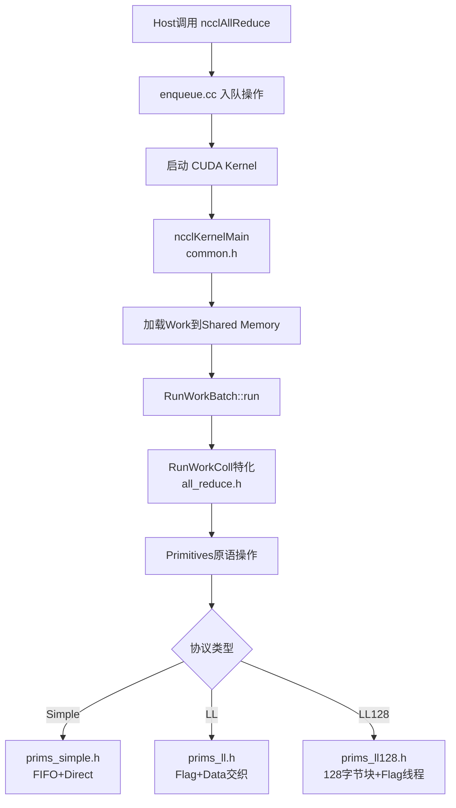

---

## 2. 基础设施层

### 2.1 op128.h

**功能**：提供底层内存操作原语，是整个 device 代码的数据搬运基石。

#### 核心组件

**`BytePack<Size>` 联合体**：

这是一个递归定义的字节包联合体，大小从 1 字节到 16 字节。它利用 `half[2]` 实现二分递归，使得归约操作可以高效地对任意大小的包进行分治计算。

```cpp
template<> union BytePack<16> {
  BytePack<8> half[2];  // 递归分裂
  uint8_t u8[16]; uint16_t u16[8]; uint32_t u32[4]; uint64_t u64[2];
  ulong2 ul2[1], native;
};
```

**设计初衷**：归约操作需要对不同宽度的数据包（1/2/4/8/16字节）进行统一处理。BytePack 提供了一种类型安全的字节级操作容器，其 `half[2]` 结构支持归约函数的递归分治。

**内存加载/存储函数**：

- `ld_global` / `st_global`：全局内存（设备显存）的 volatile 加载/存储
- `ld_shared` / `st_shared`：共享内存的 volatile 加载/存储
- `ld_volatile_global`：volatile 语义的全局内存读取（用于轮询）
- `ld_relaxed_gpu_global` / `st_relaxed_sys_global`：带内存序语义的加载/存储（`sm_70+`）
- `ld_acquire_sys_global` / `st_release_sys_global`：acquire/release 语义
- `fence_acq_rel_sys`：系统级内存屏障（跨 GPU 同步必需）

**底层硬件特性利用**：

这些函数直接使用 PTX 内联汇编：
- `ld.volatile.global.v2.u64`：128位 volatile 加载，防止编译器优化掉轮询
- `ld.relaxed.sys.global.u64`：sm_70+ 的 relaxed 语义，比 volatile 更高效
- `fence.acq_rel.sys`：对应 GPU 的 `bar.sync` + `membar.sys`，确保跨 NVLink/PCIe 的内存可见性
- `cvta.to.shared` / `cvta.to.global`：地址空间转换，PTX 级别的指针转换

**`multimem_st_global`**（Hopper/sm_90+）：

使用 `multimem.st.global` PTX 指令，这是 NVIDIA NVLink SHARP (NVLS) 的核心指令。它将数据广播到多GPU的共享内存区域，由硬件执行多播。

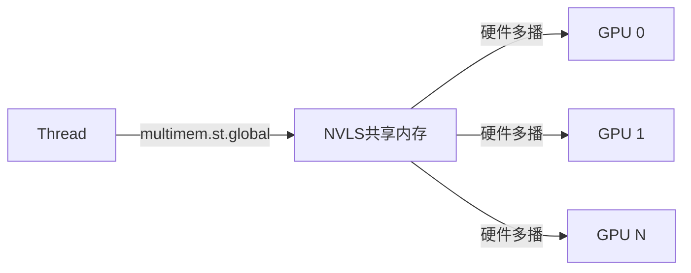

**`copyGlobalShared_WarpUnrolled`**：Warp 级的全局↔共享内存拷贝，以 16 字节对齐块为单位，每个 lane 处理一块，用于高效搬运数据。

### 2.2 reduce_kernel.h

**功能**：定义所有归约操作的类型特化实现，是 NCCL 支持各种数据类型和归约操作的核心。

#### 归约函数类层次

| 类名 | 对应操作 | 说明 |
|------|---------|------|
| `FuncCopy<T>` | 无操作拷贝 | 不做归约，仅拷贝 |
| `FuncSum<T>` | 求和 | 最常用操作 |
| `FuncProd<T>` | 求积 | |
| `FuncMinMax<T>` | 最大/最小值 | 通过 XOR mask 实现统一的 Min/Max |
| `FuncPreMulSum<T>` | 先乘再求和 | 用于 ncclAvg 等需要预乘系数的场景 |
| `FuncSumPostDiv<T>` | 先求和后除 | 整数类型的 ncclAvg 实现 |

#### 归约操作的分治实现

所有归约操作通过 `Apply_Reduce<Fn, EltPerPack>` 模板实现，采用递归分治策略：

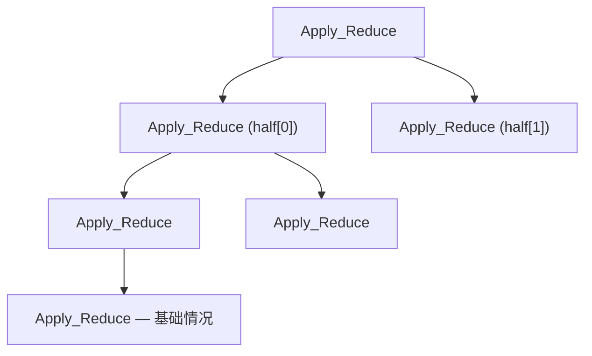

**设计初衷**：GPU 的 SIMD 执行模型中，不同数据宽度需要不同的指令。递归分治让编译器为每种 `(归约操作, 数据类型, 包大小)` 组合生成最优代码，而无需手写所有组合。

**关键优化**：

- **half2 向量化**：`FuncSum<half>` 在 `EltPerPack=2` 时使用 `__hadd2`，一次指令处理两个 half 值
- **uint8_t 特殊优化**：4 字节打包的 uint8 求和使用位操作 `__byte_perm` 替代逐字节加法
- **FuncMinMax 的 XOR trick**：通过 XOR mask 将 Min/Max 统一为一种比较逻辑，`isMinNotMax` 标志控制方向
- **FuncSumPostDiv 的快速除法**：使用乘以倒数 + 修正的方式避免整数除法：`q = __umulhi(x, reciprocal); if(x - q*divisor >= divisor) q++`

#### Multimem 归约加载（NVLS）

`Apply_LoadMultimem` 使用 `multimem.ld_reduce.relaxed.sys.global.add` PTX 指令，这是 NVLink SHARP 的硬件归约能力：

```cpp
asm volatile("multimem.ld_reduce.relaxed.sys.global.add.acc::f32.f16x2 %0, [%1];"
    : "=h"(reg.native) : "l"(addr) : "memory");
```

**原理**：该指令从 NVLS 共享内存地址加载并执行原子归约（如 add/min/max），多个 GPU 的线程同时执行时，硬件自动完成归约，无需软件层面的显式通信。

**精度控制**：`.acc::f32` 修饰符指定累加精度。对 half/bfloat16 类型，使用 float32 精度累加以减少误差。

### 2.3 common_kernel.h

**功能**：提供核心的 `reduceCopy` 和 `reduceCopyPacks` 函数——NCCL device 端最核心的数据搬运+归约引擎。

#### `reduceCopyPacks` 函数

这是所有数据移动的底层实现。模板参数极为丰富：

| 参数 | 含义 |
|------|------|
| `RedFn` | 归约函数（FuncSum等） |
| `T` | 数据类型 |
| `Unroll` | 循环展开因子 |
| `BytePerPack` | 每个包的字节数 |
| `MultimemSrcs/Dsts` | 使用 multimem 指令的源/目标数量 |
| `MinSrcs/MaxSrcs` | 编译期已知的源/目标范围 |
| `PreOpSrcs` | 是否对源数据执行预操作 |

**执行模型**：

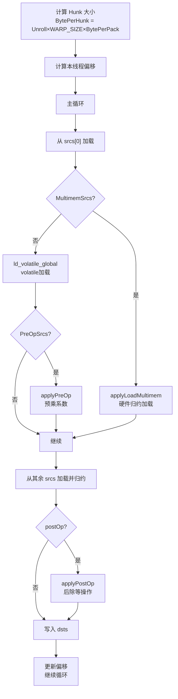

**性能考虑**：

1. **Volatile 加载**：源数据使用 volatile 加载而非 acquire 语义，因为配对的生产者使用 volatile/fence 保证数据可见性。Volatile 比 acquire 快约 2 倍（在 Ampere 上）。
2. **对齐优化**：如果指针 16 字节对齐，使用 128 位加载；否则降级到元素大小。
3. **多级包大小**：先尝试 `BigPackSize`（16字节），再降级到 `sizeof(T)`，确保处理所有对齐情况。
4. **Warp 旋转**：循环结束后通过 `warp = -nHunksAhead` 旋转 warp 分配，让工作量最少的 warp 成为 warp 0，实现负载均衡。

#### `reduceCopy` 函数

`reduceCopy` 是 `reduceCopyPacks` 的包装器，自动处理对齐和多级包大小降级：

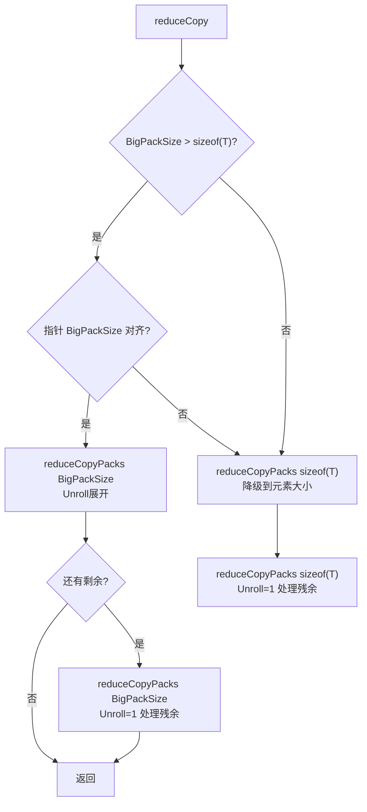

---

## 3. 内核框架层

### 3.1 common.h / common.cu

**功能**：定义 kernel 的共享内存布局、入口函数、Work 加载机制。

#### 共享内存结构

```cpp
struct ncclShmemData {
    struct ncclDevKernelArgs args;   // kernel 参数
    int channelId;                   // 当前 channel ID
    int aborted;                     // 中止标志
    struct ncclKernelComm comm;      // 通信器（buffSizes等）
    struct ncclDevChannel channel;   // 通道信息（peers等）
    
    int batchIx, nextBatchIx;        // Work batch 索引
    enum ncclDevWorkType workType;   // Work 类型
    uint16_t funcId;                 // 函数表索引
    int nWorks;                      // Work 数量
    
    struct ncclShmemGroup groups[NCCL_MAX_GROUPS]; // 每组通信信息
    char workStorage[...];           // Work 数据存储
};
extern __shared__ ncclShmemData ncclShmem;
extern __shared__ ulong2 ncclShmemPerWarp[];  // 每 warp 的 scratch 空间
```

**设计初衷**：
- 共享内存（48KB+）延迟约 5ns，比全局内存（200-800ns）快数十倍
- 将频繁访问的连接信息、步骤计数器缓存到共享内存
- `ncclShmemPerWarp` 为每个 warp 提供独立的 scratch 空间，用于 LL128 协议的数据暂存

#### `ncclKernelMain` — Kernel 入口

这是所有 NCCL device kernel 的统一入口，流程如下：

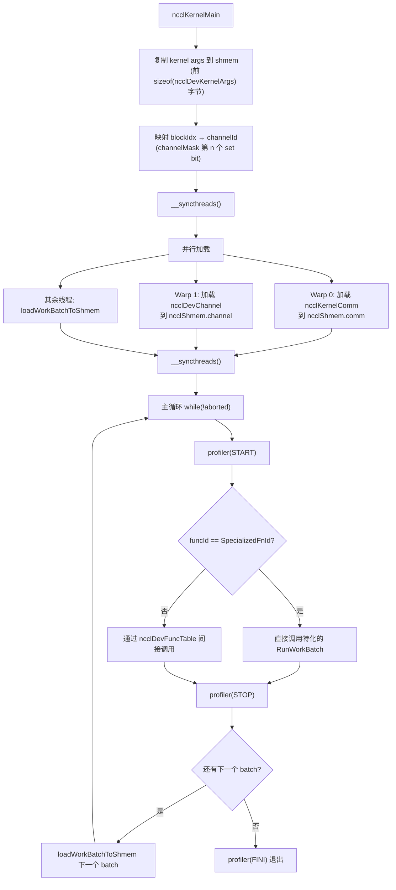

**`loadWorkBatchToShmem` 的精妙设计**：

1. 使用 warp 内的 `fns` 位操作替代 PTX 的 `fns` 指令（更快的软件实现）
2. 参数空间与全局空间的加载分开处理，避免编译器将参数结构体溢出到本地内存
3. 只用 64 个线程加载，为更大的 channel 留出带宽
4. 支持跨 batch 的 work 链（`nextExtends`），一个 kernel 调用可处理多个 batch

#### Barrier 同步原语

```cpp
barrier_sync(name)           // 全部 nthreads 参与的 barrier
barrier_sync(name, nThreads) // 指定线程数参与
barrier_red_or(vote, name)   // barrier + OR 归约投票
```

使用 PTX `barrier.sync.aligned` 指令，这是 GPU 硬件级的屏障同步，命名空间 0-15 可用。代码中 barrier 名字通过 `15-group` 计算，避免不同 group 冲突。

#### `RunWorkBatch` 模板

这是 kernel 的第二层分发：

```cpp
template<ncclFunc_t Fn, typename T, typename RedOp, int Algo, int Proto>
struct RunWorkBatch {
    __device__ void run() {
        // 处理 redOpArg 指针解引用
        for (int w=0; w < nWorks; w++) {
            RunWorkColl<Fn, T, RedOp, Algo, Proto>().run(tid, subtn, work);
        }
    }
};
```

**设计权衡**：`RunWorkBatch` 处理多个 work 的批处理。每个 work 可能有不同的 `nWarps`（子线程数），在 work 切换时如果 `nWarps` 不同则需要 `__syncthreads()`。这确保了同一个 batch 内不同大小的通信操作可以共享一次 kernel 启动。

### 3.2 onerank.cu

**功能**：处理单节点（nranks=1）的特殊情况。

当只有一个 rank 时，集合通信退化为本地操作：
- 对于 `ncclSum` 等简单操作：直接 `cudaMemcpy`
- 对于 `ncclPreMulSum`：需要执行 `scalar * input → output` 的 kernel

`oneRankReduce` kernel 使用 `reduceCopy` 模板，将其 `PreOpSrcs=1` 来应用预乘。

---

## 4. 通信原语层（Primitives）

### 4.1 primitives.h

**功能**：定义三种协议的抽象接口和辅助类型。

#### 协议类型

```cpp
// Simple: FIFO 队列 + 可选 Direct 访问
template<int SlicePerChunk, int StepPerSlice, int Unroll, int MultimemSrcs, int MultimemDsts>
struct ProtoSimple {
    static constexpr int Id = NCCL_PROTO_SIMPLE;
    static constexpr int MaxGroupWidth = 2;  // 支持两个 group 并行
};

// LL: Low-Latency，8字节数据+8字节标志
struct ProtoLL {
    static constexpr int Id = NCCL_PROTO_LL;
    static constexpr int MaxGroupWidth = 1;
};

// LL128: 128字节块中嵌入标志
struct ProtoLL128 {
    static constexpr int Id = NCCL_PROTO_LL128;
    static constexpr int MaxGroupWidth = 1;
};
```

#### Fan 类型（扇入扇出抽象）

```cpp
template<int MaxRecv, int MaxSend> struct FanAsymmetric; // 收发不对称
template<int MaxArity> struct FanSymmetric;              // 收发对称（如 Ring）
```

**设计初衷**：树形算法需要 `FanAsymmetric<3,1>` 或 `<1,3>`（3个子节点1个父节点），环形算法需要 `FanSymmetric<1>`（1前1后）。对称版本只存一个 `n` 值，节省寄存器——这对 GPU 编程至关重要，因为寄存器压力直接影响 occupancy。

#### 统一原语接口

所有协议的 Primitives 类提供相同的操作方法：

| 方法 | 功能 |
|------|------|
| `send(inpIx, eltN)` | 发送输入缓冲区数据 |
| `sendFromOutput(outIx, eltN)` | 从输出缓冲区发送 |
| `recv(outIx, eltN, postOp)` | 接收到输出缓冲区 |
| `recvReduceSend(inpIx, eltN)` | 接收+归约+转发 |
| `recvReduceCopy(inpIx, outIx, eltN, postOp)` | 接收+归约+写入 |
| `copySend(inpIx, outIx, eltN, postOp)` | 拷贝+发送 |
| `recvCopySend(outIx, eltN, postOp)` | 接收+转发 |
| `recvReduceCopySend(inpIx, outIx, eltN, postOp)` | 接收+归约+写入+转发 |
| `directSend/DirectRecv/...` | Direct 版本（绕过 FIFO） |

**`PrimitivesWithoutDirect`** 适配器：LL 和 LL128 不支持 Direct 操作，通过此适配器将 direct 调用降级为普通调用。

### 4.2 prims_simple.h

**功能**：Simple 协议的完整实现——NCCL 最常用的通信协议。

#### 核心机制

Simple 协议使用 **FIFO 队列 + 步骤计数器** 实现生产者-消费者同步：

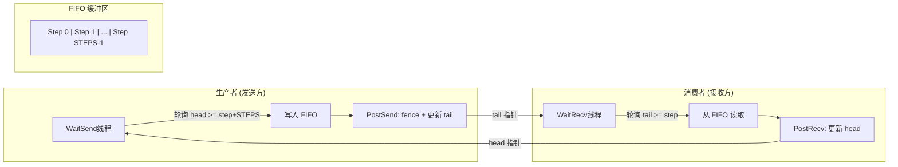

**步骤计数器同步**：
- `connStepPtr` 指向远程的步骤计数器（head 或 tail）
- 发送方等待：`connStepCache + NCCL_STEPS >= step + StepPerSlice`（有可用 FIFO 槽位）
- 接收方等待：`connStepCache >= step + StepPerSlice`（数据已到达）
- 使用 volatile 加载轮询，避免 L1 缓存返回过期数据

#### 线程角色分配

```cpp
// 线程分配（假设 nrecv=1, nsend=1, nthreads=512）
tid 0:          WaitRecv (轮询发送方的 tail)
tid 1:          WaitSend (轮询接收方的 head)  
tid 2..508:     Workers (执行 reduceCopy)
tid 509:        PostRecv (更新本地 head)
tid 510:        PostSend (fence + 更新本地 tail)
tid 511:        (extra PostSend or PostRecv)
```

**nworkers 计算**：当有发送操作且线程数 >= `NCCL_SIMPLE_EXTRA_GROUP_IF_NTHREADS_GE`(256) 时，保留一个额外 warp 用于 PostSend 的 threadfence 延迟隐藏。

#### Direct 机制

Simple 协议支持 Direct 模式，跳过 FIFO 直接读写远端 GPU 内存：

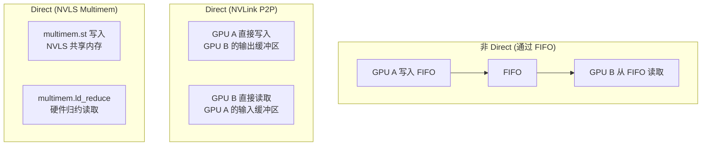

**Direct 模式的指针交换**：

1. `DirectWrite` 模式：发送方将本地输出缓冲区指针通过 `ptrExchange` 槽位传递给接收方
2. `DirectRead` 模式：接收方从 `ptrExchange` 获取发送方的缓冲区指针，直接读取
3. NVLS 模式：使用 `multimem` 指令，指针指向 NVLS 共享内存区域

**`ptrExchange` 同步**：使用 volatile 指针的 spin-wait，生产者等待 `*slot == nullptr` 后写入指针，消费者等待 `*slot != nullptr` 后读取并清零。

#### `genericOp` — 通用操作引擎

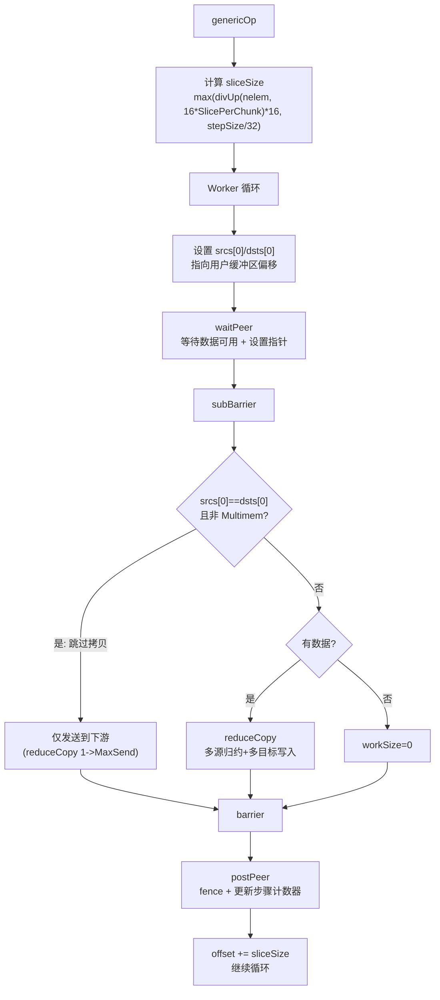

**Slice 大小的自适应调整**：
- 初始值：`stepSize * StepPerSlice`
- 下限：`max(divUp(remaining, 16*SlicePerChunk)*16, stepSize/32)`
- 当剩余数据少于 `loopCount` 时，缩小 `chunkCount` 以减少尾部浪费

#### Scatter/Gather 操作

```cpp
ScatterGatherOp<DirectRecv, DirectSend, Recv, Send>(...)
```

用于 NVLS 和 CollNet 的 Scatter/Gather 模式：
- **Scatter**：将输入按 `peerOffset` 分块发送到不同 peer
- **Gather**：从不同 peer 接收数据块到输出缓冲区
- `skip` 参数跳过自身 rank 的块（环形避免重复）
- `shift` 参数实现 peer 间的负载均衡偏移

#### PAT（Pattern）模式

PAT 算法用于特定硬件（如 NVSwitch）的优化 AllGather/ReduceScatter：
- 使用 `primsModePatRs` / `primsModePatAg` 模式
- 32 个维度（2^n offset）独立操作
- 专用算法线程生成操作序列，worker 线程执行数据搬运

### 4.3 prims_ll.h

**功能**：LL（Low-Latency）协议实现——低延迟场景。

#### 核心机制：Flag-Data 交织

LL 协议在每个 16 字节行中嵌入标志：

```
|  data1 (4B)  |  flag1 (4B)  |  data2 (4B)  |  flag2 (4B)  |
```

每行 8 字节有效数据 + 8 字节标志，数据效率 50%。

**Flag 计算**：`NCCL_LL_FLAG(step) = step * 0x10000001`（简单递增模式，避免与初始值 0 冲突）

#### 数据读取：两阶段 Volatile 加载

```cpp
uint64_t readLL(int offset, int i) {
    do {
        // 阶段1: 发起 volatile 加载
        asm volatile("ld.volatile.global.v4.u32 {%0,%1,%2,%3}, [%4];"
            : "=r"(data1), "=r"(flag1), "=r"(data2), "=r"(flag2) : "l"(&src->i4));
    } while (flag1 != expected_flag || flag2 != expected_flag);
    return data1 + ((uint64_t)data2 << 32);
}
```

**设计初衷**：Volatile 加载保证每次都从 L2/显存读取最新值，而不被 L1 缓存阻塞。Flag 的变化表明数据已写入完成——这比 Simple 的步骤计数器更细粒度（行级 vs 块级），因此延迟更低。

#### LL Cleanup

```cpp
if ((sendStep[i] & NCCL_LL_CLEAN_MASK) == NCCL_LL_CLEAN_MASK) {
    // 将整个 slice 的 flag 重置为当前 flag，防止 flag 回绕后与旧值冲突
    for (int o = offset; o < stepLines; o += nthreads)
        storeLL(sendPtr(i)+o, 0, sendFlag(i));
}
```

Flag 使用 32 位无符号整数，每步递增，约 40 亿步后回绕。Cleanup 机制定期清理旧 flag 值。

#### DataLoader 处理非对齐

当数据类型 ≤ 2 字节时，可能存在对齐问题。DataLoader 通过 32 位对齐加载 + `__funnelshift_r` 移位来处理：


### 4.4 prims_ll128.h

**功能**：LL128 协议实现——在延迟和带宽间取得平衡。

#### 核心机制：128 字节块中的嵌入式标志

每 128 字节（16×uint64_t）为一个块单元：
- 14 个字用于数据（`NCCL_LL128_DATAELEMS = 14`）
- 2 个字用于标志（`NCCL_LL128_LINEELEMS = 16`）
- 数据效率：14/16 = 87.5%

**Flag 线程**：每个 warp 中 `tid%8 == 7` 的线程是 flag 线程，负责写入和检查标志。其余线程写入数据。这减少了标志检查的 overhead。

#### 寄存器加载策略

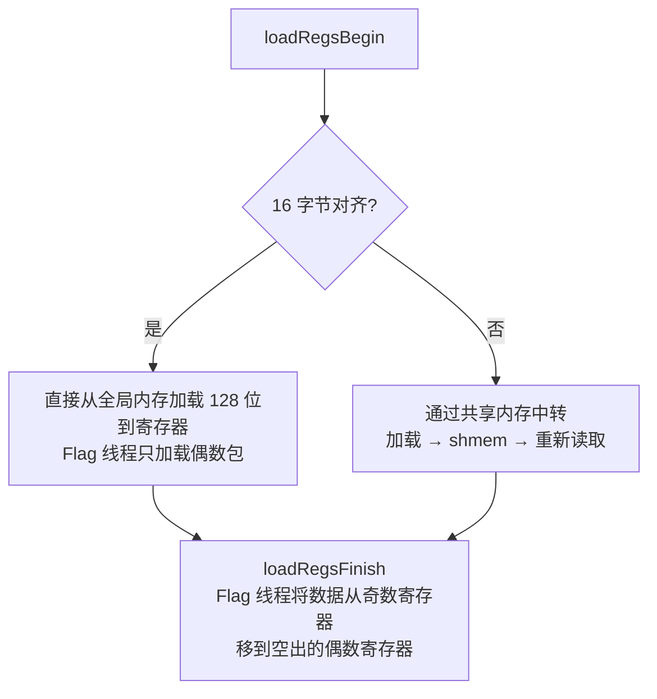

**设计权衡**：两阶段加载（Begin + Finish）允许将寄存器 shuffle 延迟到数据依赖满足之后，从而让 shuffle 延迟与内存访问延迟重叠。

#### `recvReduceSendCopy` — 核心数据路径

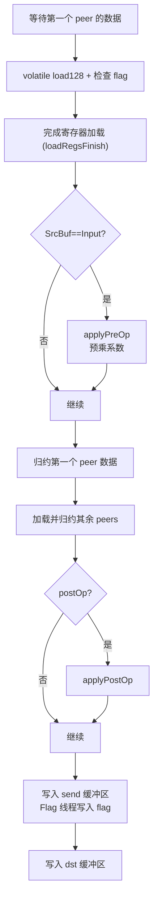

### 4.5 三种协议对比分析

| 特性 | Simple | LL | LL128 |
|------|--------|-----|-------|
| **数据效率** | ~100%（无开销） | 50%（一半是 flag） | 87.5%（14/16） |
| **延迟** | 中（步骤计数器粒度） | 低（行级 flag） | 低（块级 flag） |
| **带宽利用率** | 高 | 中（开销大） | 高 |
| **同步机制** | 步骤计数器（tail/head） | 逐行 flag volatile 轮询 | 128B 块 flag 线程 |
| **Direct 支持** | ✅（P2P Read/Write, NVLS） | ❌（仅 FIFO） | ❌（仅 FIFO） |
| **典型场景** | 大消息量，NVLink | 极小消息，延迟敏感 | 中小消息，延迟+带宽平衡 |
| **Buffer 用量** | buffSize/STEPS per step | buffSize/STEPS/2 per step | buffSize/STEPS*14/16 per step |
| **MaxGroupWidth** | 2（支持收发并行） | 1 | 1 |

**选择策略**：
- **NVLink + 大消息** → Simple（Direct 模式可跳过 FIFO，零拷贝）
- **PCIe + 小消息** → LL128（87.5% 效率，低延迟）
- **极小消息 (<1KB)** → LL（最低延迟，尽管效率低）
- **NVLS 硬件** → Simple with Multimem（硬件归约，最优性能）

---

## 5. 集合通信操作层

### 5.1 all_reduce.h

**功能**：实现 AllReduce 集合通信——所有 rank 归约求和/最大/最小后广播结果。

#### 支持的算法

| 算法 | 协议 | 说明 |
|------|------|------|
| Ring | Simple/LL/LL128 | 经典环形 AllReduce |
| Tree (UpDown) | Simple | 二叉树上归约+下广播 |
| Tree (Split) | Simple/LL/LL128 | 线程分割为归约+广播两组 |
| CollNet Direct | Simple | 网络集合加速器 |
| CollNet Chain | Simple | 链式网络集合 |
| NVLS | Simple | NVLink SHARP 硬件加速 |
| NVLS Tree | Simple | NVLS + 树形 |

#### Ring AllReduce 流程

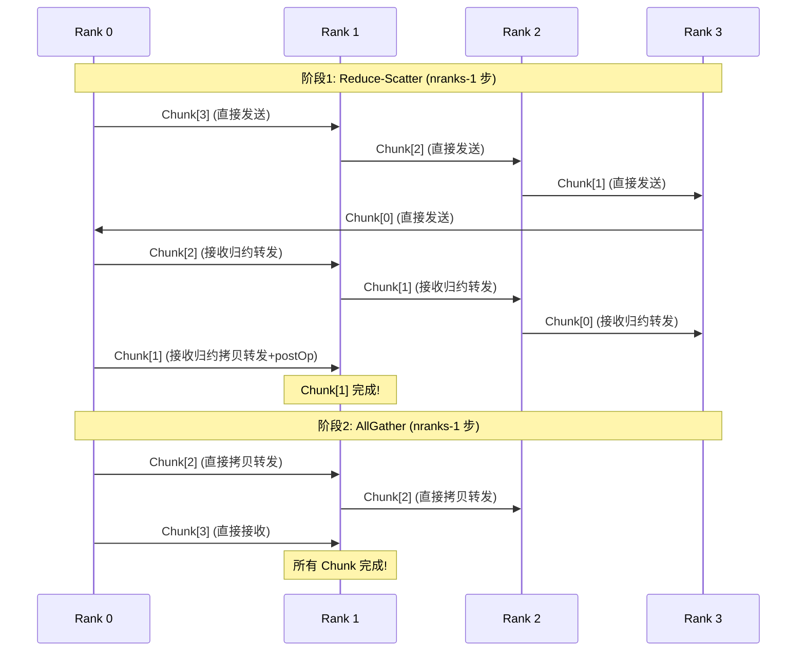

**Ring 的 SlicePerChunk/StepPerSlice**：

- AllReduce Ring 使用 `ALLREDUCE_CHUNKSTEPS/ALLREDUCE_SLICESTEPS`
- 将 chunk 进一步分为 slice，支持流水线并行（发送当前 slice 的同时处理下一个 slice）

#### Tree Split AllReduce

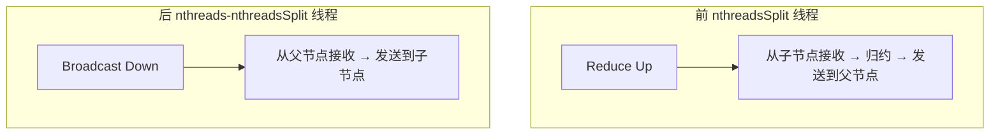

**线程分割比例**：
- Simple：`nthreads/2`，若 >= 256 则额外 +64
- LL/LL128：70% 归约 / 30% 广播（归约计算更密集）

**Split vs UpDown 的选择**：

在 `sm_80` 且 CUDA 11.2-11.3 上使用 UpDown（已知 workaround），其他情况使用 Split。Split 的优势是收发可以流水线重叠。

#### NVLS AllReduce

NVLS 模式利用 NVLink SHARP 的硬件多播和归约能力：

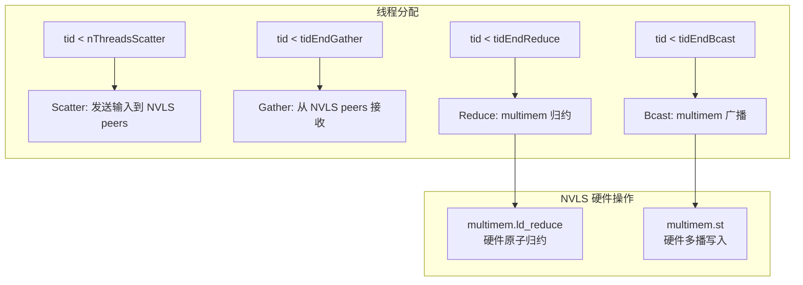

**单节点 vs 多节点**：
- 单节点：Scatter → NVLS Reduce+Bcast → Gather（纯硬件）
- 多节点：增加网络发送/接收阶段，NVLS 在节点内归约，IB SHARP 在节点间归约

### 5.2 all_gather.h

**功能**：AllGather——每个 rank 贡献数据，所有 rank 获得所有数据。

#### Ring AllGather

```mermaid
sequenceDiagram
    sequenceDiagram
    participant R0 as Rank 0
    participant R1 as Rank 1
    participant R2 as Rank 2
    participant R3 as Rank 3
    
    Note over R0,R3: nranks-1 步，每步发送一个 rank 的数据
    
    R0->>R1: Step0: R0 的数据
    R1->>R2: Step1: R0 的数据 (转发)
    R2->>R3: Step2: R0 的数据 (转发)
    
    Note over R0,R3: 每步的 rankDest = ringRanks[nranks - j]
```

AllGather 只有拷贝操作，没有归约。Ring 算法中每步将一个 rank 的数据沿环传递。

**Direct 模式**：AllGather 支持直接写入目标 rank 的输出缓冲区对应位置（`DirectSend/DirectCopySend`），避免中间缓冲区拷贝。

**NetOffload 模式**（`isNetOffload=true`）：当只有一个进程每节点（1PPN）且使用网络注册时，仅使用 1 个 warp 驱动 Ring 算法，其余 warp 并行拷贝源数据到目标缓冲区。

#### PAT AllGather

PAT 算法使用对数维度的并行操作：

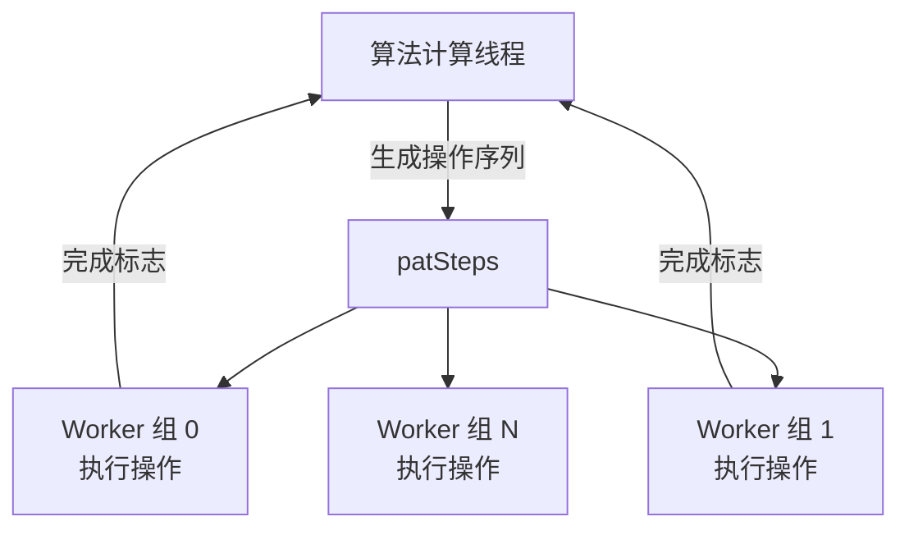

`PatAGAlgorithm` 类动态生成操作序列，`parallelFactor` 控制并行度，worker 线程按组并行执行。

#### NVLS AllGather

NVLS 模式使用 `Scatterer<BcastSendNotRecv>` 仿函数，通过 Primitives 的 `process` 方法执行：

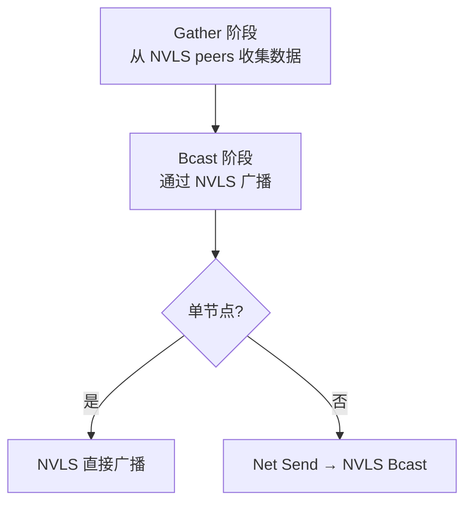

**Scatterer 设计**：作为模板仿函数传给 `prims.process()`，在 `process` 内部的每个 slice 循环中被调用。它处理 rail-aware 的地址计算——将逻辑偏移映射到物理 GPU 的缓冲区位置。

### 5.3 all_gather_v.h

**功能**：AllGatherV——变长 AllGather，每个 rank 贡献不同大小的数据。

这是一个相对简单的实现，使用 Ring 算法的 `send/copySend/recvCopySend/recv` 操作：

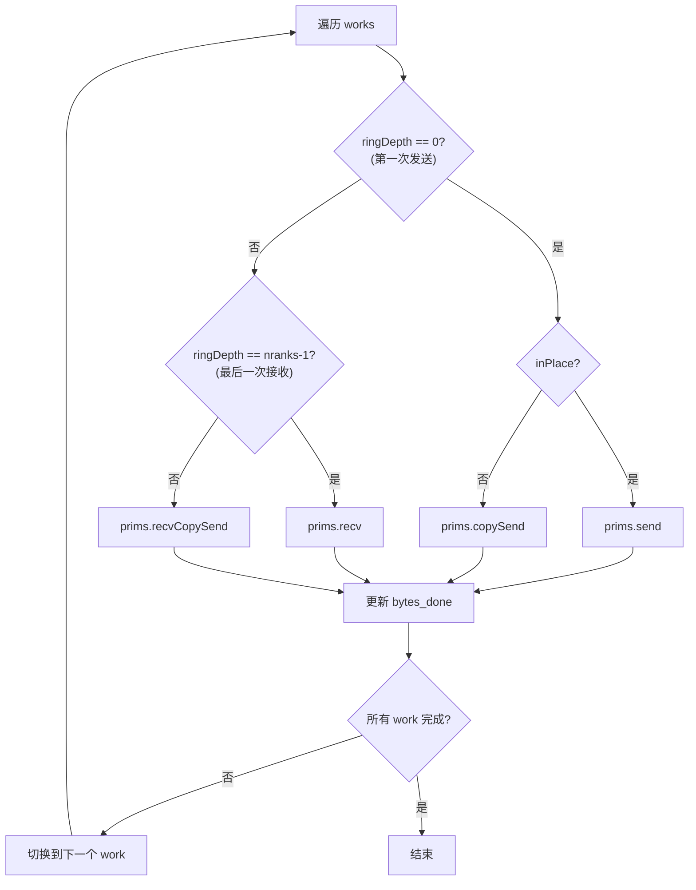

**动态进度跟踪**：每个 work 的 `bytes` 字段在每次迭代中减少 `chunkBytes`，直到所有 work 的 `bytes` 归零。

### 5.4 reduce_scatter.h

**功能**：ReduceScatter——归约所有 rank 的数据，每个 rank 获得归约结果的不同部分。

#### Ring ReduceScatter

```mermaid
sequenceDiagram
    participant R0 as Rank 0
    participant R1 as Rank 1
    participant R2 as Rank 2
    participant R3 as Rank 3
    
    Note over R0,R3: nranks-1 步 Reduce-Scatter
    Step0: R0->>R1: 发送 R3 的 chunk
    Step1: R0<-R1: R2 接收归约转发 (recvReduceSend)
    Step2: R0<-R1: R1 接收归约拷贝 (recvReduceCopy + postOp)
    Note over R0: R0 的 chunk 归约完成!
```

**postOp 在 ReduceScatter 中的角色**：最后一步使用 `recvReduceCopy(..., postOp=true)` 执行后处理操作（如 PreMulSum 的除法）。

#### PAT ReduceScatter

与 PAT AllGather 类似，使用 `PatRSAlgorithm` 生成操作序列，但执行的是 `patReduce` 而非 `patCopy`。

#### NVLS ReduceScatter

NVLS 模式的 ReduceScatter 使用 `Scatterer<ReduceSendNotRecv>` 仿函数处理 rail-aware 的 scatter/reduce：

```mermaid
graph TD
    A["Scatter 阶段"] --> B["Reduce 阶段<br/>multimem 归约"]
    B --> C{单节点?}
    C -->|是| D["NVLS Reduce → 输出"]
    C -->|否| E["Net Recv → Scatter → NVLS Reduce → Net Send"]
```

### 5.5 broadcast.h

**功能**：Broadcast——一个 rank 广播数据到所有 rank。

Ring Broadcast 实现非常直接：

```cpp
if (rank == root) {
    prims.directSend(offset, offset, nelem);         // root 发送
} else if (nextRank == root) {
    prims.directRecv(offset, nelem);                  // root 前一个 rank 接收
} else {
    prims.directRecvCopyDirectSend(offset, offset, nelem);  // 其他 rank 转发
}
```

**NetOffload**：类似 AllGather，1PPN 时只用 1 warp 驱动 Ring，其余 warp 并行拷贝（root rank 的 input → output）。

### 5.6 reduce.h

**功能**：Reduce——所有 rank 的数据归约到根 rank。

```cpp
if (prevRank == root) {
    prims.send(offset, nelem);                        // root 前一个 rank 发送
} else if (rank == root) {
    prims.recvReduceCopy(offset, offset, nelem, true); // root 接收归约
} else {
    prims.recvReduceSend(offset, nelem);              // 其他 rank 归约转发
}
```

### 5.7 sendrecv.h

**功能**：点对点 Send/Recv。

#### 线程分配策略

SendRecv 使用巧妙的 warp 分配策略：

```cpp
// 使用 ballot + popc 计算除法（比硬件除法快 3 倍）
int nWarpPerWork = __popc(__ballot_sync(~0u, nWorks*(lane+1) <= nWarps));
int nRecvWarpPerWork = nWarpPerWork<=4 ? nWarpPerWork/2 : (nWarpPerWork-1)/2;
int nSendWarpPerWork = nWarpPerWork<=4 ? nRecvWarpPerWork : nRecvWarpPerWork+1;
```

**设计初衷**：多个 SendRecv work 可以共享一个 kernel launch。每个 work 的收发操作需要独立的线程组。使用 warp 级 ballot + popc 替代整数除法，在 GPU 上快约 3 倍。

**Self-copy 优化**：当 `sendRank == myRank` 时（发送给自己），直接使用 `reduceCopy` 做本地拷贝，不需要通过网络。

**协议选择**：每个 work 可以独立选择 Simple 或 LL 协议（`work->sendProtoLL` / `work->recvProtoLL`），适应不同消息大小。

---

## 6. 网络卸载模块

### 6.1 network/unpack/

**功能**：实现 GPU 端的网络数据解包（Unpack），支持将网络接收的 scatter/gather IOVEC 数据重组到连续缓冲区。

#### unpack_defs.h — 数据结构定义

```cpp
union alignas(16) loadMeta {
    uint64_t r64[2];
    struct { uint32_t src_off; uint32_t len; uint64_t dst_off; };
};

struct netUnpackMeta {
    loadMeta mem[NCCL_NET_DEVICE_UNPACK_MAX_QUEUE_DEPTH][NET_UNPACK_MAX_SLICE_PAGES];
    uint64_t cnt[NCCL_NET_DEVICE_UNPACK_MAX_QUEUE_DEPTH];  // 每个 step 的页数
};

struct unpackNetDeviceHandle {
    struct netUnpackMeta *meta;   // 映射到 GPU 的元数据
    void* bounce_buf;            // 弹性缓冲区
    uint64_t head;               // 消费者位置
};
```

**原理**：网络接收的数据可能是不连续的 IOVEC（来自 RDMA scatter），需要根据每页的 `(src_off, len, dst_off)` 元数据将数据从 bounce buffer 拷贝到用户缓冲区的正确位置。

#### unpack.h — 解包实现

```mermaid
flowchart TD
    A["ncclNetDeviceUnpack<Recv=1>"] --> B["遍历 mask 中的 peer"]
    B --> C["ncclNetDeviceUnpackInner"]
    C --> D["加载元数据计数 (meta_cnt)"]
    D --> E["分页加载元数据到共享内存"]
    E --> F["每页处理"]
    
    F --> G["从 shmem 读取 loadMeta"]
    G --> H["根据对齐选择 bulkLoad"]
    H --> I["从 bounce_buf 拷贝到用户缓冲区"]
    I --> J["处理尾部 < 16 字节的数据"]
```

**`bulkLoad<sz>` 特化**：根据地址对齐选择 1/2/4/8/16 字节的加载粒度。16 字节对齐使用 `load128`，其他使用相应大小的 volatile 加载。

**`ppw()` 函数**：计算每个 warp 处理的页数，动态平衡负载：

```cpp
int ppw(const int nbytes, int nw) {
    int v = DIVUP(nbytes, SLICE_PAGE_SIZE);
    v = DIVUP(v, nw);
    while (v > WARP_SHM_PAGE_CNT) v = DIVUP(v, 2);  // 不超过共享内存容量
    return v;
}
```

**设计目标**：将网络数据解包从 CPU proxy 线程卸载到 GPU，减少数据路径上的 CPU 开销和跨设备同步延迟。这在高速网络（InfiniBand 400Gbps+）上尤为重要，因为 CPU 可能成为瓶颈。

---

## 7. Symmetric模块（新一代对称原语）

Symmetric 模块是 NCCL 的新一代 GPU 通信原语，利用 LSA（Local System Address）和 GIN（GPU Interconnect Network）等新一代硬件特性，提供更高效的对称通信操作。

### 7.1 kernel.cuh

**功能**：声明 Symmetric kernel 的所有操作函数模板。

支持的变体：

| 函数 | 说明 |
|------|------|
| `ncclSymkRun_AllReduce_AGxLL_R` | AllReduce: AG×LL + Reduce |
| `ncclSymkRun_AllReduce_AGxLLMC_R` | AllReduce: AG×LLMC + Reduce (多通道) |
| `ncclSymkRun_AllReduce_RSxLD_AGxST` | AllReduce: RS×LD + AG×ST |
| `ncclSymkRun_AllReduce_RSxLDMC_AGxSTMC` | AllReduce: RS×LDMC + AG×STMC |
| `ncclSymkRun_AllGather_LL/LLMC/ST/STMC` | AllGather 变体 |
| `ncclSymkRun_ReduceScatter_LL/LD/LDMC` | ReduceScatter 变体 |
| `ncclSymkRun_ReduceScatter_RailA2A_*` | ReduceScatter Rail AllToAll 变体 |

**命名规则**：`OPxPROTOCOL[_MC]`，MC = Multi-Channel。

### 7.2 primitives.cuh

**功能**：Symmetric 模块的基础设施。

#### `ncclSymkArgsHandler`

这是 Symmetric kernel 的参数处理器，封装了通信器、通道、work 的访问逻辑：

```cpp
struct ncclSymkArgsHandler {
    ncclDevComm const& comm;
    ncclLLA2AHandle const& lsaLLA2A;        // LSA AllToAll 句柄
    ncclGinOutboxHandle const& ginOutbox;    // GIN 发件箱
    ncclGinInboxA2AHandle const& ginInboxRail; // GIN 收件箱
    ncclGinCounter_t ginCounterPerBlock;     // GIN 计数器
    ncclGinSyncHandle const& ginSyncHandle;  // GIN 同步句柄
};
```

**Work 分区**：`getWorkRange<T>()` 将 work 按 Cell（`NCCL_SYM_KERNEL_CELL_SIZE` 字节）分区到不同的 CUDA block，使用定点分数（16.16 格式）实现精确的负载均衡。

#### `ncclSymPtr<T>` — Symmetric 指针

Symmetric 指针封装了 LSA（Local System Address）访问能力：

```cpp
ncclSymPtr<T>::localPtr()          // 本地 GPU 地址
ncclSymPtr<T>::peerPtr(team, peer) // 远程 GPU 地址（LSA）
ncclSymPtr<T>::lsaPtr(peer)        // LSA 偏移地址
ncclSymPtr<T>::multimemPtr(...)    // NVLS 多播地址
```

#### `ncclLsaPointerGetter`

```cpp
struct ncclLsaPointerGetter {
    void* base;
    uint32_t stride4G;  // 4GB 步幅
    T* operator()(int lsaPeer) const {
        return (T*)add4G(base, lsaPeer * stride4G);
    }
};
```

**原理**：LSA 使用 4GB 对齐的步幅来区分不同 GPU 的缓冲区。`add4G` 利用 32 位地址空间的自然溢出实现 4GB 偏移计算，避免了 64 位乘法。

#### 累加类型选择

```cpp
template<> struct ncclSymkAccumType<FuncSum, __half, false> { using Type = float; };
template<> struct ncclSymkAccumType<FuncSum, __nv_bfloat16, false> { using Type = float; };
```

**设计权衡**：半精度（fp16/bf16）在 GPU 上累加时使用 float32 精度，以减少大数组求和时的精度损失。这在分布式训练中尤为重要，因为成千上万次的累加会显著放大误差。

### 7.3 data_ops.cuh

**功能**：Symmetric 模块的数据加载/存储操作。

#### Cache-line 感知的加载存储

```cpp
ldcs(GMemTag, p)  // 通过 __ldcs 绕过 L1 缓存，直接从 L2 加载
stcs(GMemTag, p)  // 通过 __stcs 流式写入，不污染 L1
ldcs(SMemTag, p)  // 共享内存直接访问
```

**设计初衷**：在 AllReduce 的 deep loop 中，线程从多个 peer 读取数据。使用 `__ldcs`（cache-streaming load）避免将远程数据填满 L1 缓存，保持 L1 空间给本地热数据。

#### Pack 加载系统

```cpp
loadPacks<Pack, nPacks>(packs, mem, eltsAlignMin, elts, nElts, padElts, packIx, stride, lastEmpty);
```

处理三种情况：
1. **对齐 + 无 padding**：直接强制类型转换读取
2. **有 padding**：通过共享内存中转，处理首尾不对齐
3. **完全不对齐**：逐元素读取

#### Warp 级 AllReduce

`warpAllReduce` 在 warp 内执行归约：

```mermaid
graph TD
    A[每个线程持有 acc0] --> B["对 nRanks-1 个 peer:<br/>acc = reduce(acc, peer_value)"]
    B --> C["写入所有 peer 的输出"]
```

**优化**：UnrollPeers 参数控制内层循环展开度。当 nRanks 较大时（如 8），一次内循环处理多个 peer，减少循环开销。

### 7.4 all_reduce.cuh

**功能**：Symmetric 模块的 AllReduce 实现。

#### `allreduceDeep` — 主计算路径

```mermaid
flowchart TD
    A["加载本 rank 的输入 acc0"] --> B["等待 barrier"]
    B --> C["主循环"]
    
    C --> D["从 rank+1 加载数据 tmp1"]
    D --> E["归约 acc1 = reduce(cast(acc0), cast(tmp1))"]
    E --> F["继续从其余 ranks 加载并归约"]
    F --> G["将结果写入所有 ranks 的输出"]
    G --> H["前进到下一个数据块"]
    H --> I{"还有数据?"}
    I -->|是| C
    I -->|否| J["结束"]
```

**关键特征**：
- 所有 rank 的数据在 LSA 空间中都是可寻址的
- 每个线程直接从所有 peer 读取数据并归约，无需显式通信步骤
- 使用 `UnrollPeers` 展开内层循环，减少分支
- 累加类型自动提升（fp16 → fp32）

#### 与传统 AllReduce 的对比

| 特性 | 传统 Ring/Tree | Symmetric Deep |
|------|---------------|----------------|
| 通信步骤 | 2(n-1) 步 | 1 步（并行读取） |
| 延迟 | O(n) × 网络延迟 | O(1) 延迟 |
| 带宽利用 | 每步 1/n 带宽 | 全带宽 |
| 硬件要求 | 任意互连 | LSA/GIN 支持 |
| 适用场景 | 大消息 | 中小消息 |

### 7.5 all_gather.cuh / reduce_scatter.cuh

**功能**：Symmetric 模块的 AllGather 和 ReduceScatter。

#### AllGather — `bcastDeep`

```cpp
// 每个 rank 将自己的数据广播到所有 peer 的输出缓冲区
for each peer r:
    outPacks.lsaPtr(r)[u*WARP_SIZE] = tmp[u];  // LSA 写入
```

#### ReduceScatter — `reduceDeep`

```cpp
// 每个 rank 从所有 peer 读取数据并归约
for each peer r:
    acc = reduce(acc, cast(inpPacks.peerPtr(world, r)[...]));
// 写入到输出
for each peer r:
    outPacks.peerPtr(world, r)[...] = acc;
```

#### GIN 辅助的变体

`all_gather_gin.cuh` 和 `reduce_scatter_gin.cuh` 使用 GIN（GPU Interconnect Network）的 outbox/inbox 机制进行同步和数据传输，支持 Rail-aware 的 AllToAll 模式。

### 7.6 GIN Scratch 子系统

**功能**：GIN（GPU Interconnect Network）的 scratch buffer 管理。

#### 核心概念

- **Outbox**：每个 GPU 的发送缓冲区，其他 GPU 可以远程读取
- **Inbox A2A**：AllToAll 模式的接收缓冲区，支持按步分块
- **Counter**：轻量级同步原语
- **Signal**：GIN 信号机制，支持 `add` 和 `wait` 操作

#### `ncclGinOutboxSession`

```mermaid
sequenceDiagram
    participant GPU0 as GPU 0
    participant GPU1 as GPU 1
    
    GPU0->>GPU0: apportion(nBufs_log2)<br/>划分缓冲区
    GPU0->>GPU0: getBuf(i)<br/>获取第 i 个缓冲区
    GPU0->>GPU0: 写入数据
    GPU0->>GPU1: advance(n)<br/>通知已写入 n 个缓冲区
    
    GPU1->>GPU1: waitBufs(i0, n)<br/>等待缓冲区可用
    GPU1->>GPU0: 读取 Outbox 数据
```

#### `ncclGinInboxA2ASession`

支持步进式 AllToAll：

```cpp
postSends(subcoop, step0, nSteps, getPtr, getEltCount, getCompletion);
waitRecvs(subcoop, step0, nSteps);
finishRecvs(subcoop, step0, nSteps);
endRound(coop);
```

**信号机制**：
- C2S（Consumer-to-Sender）信号：通知发送方缓冲区已就绪
- R2R（Round-to-Round）信号：同步轮次进度
- 使用 `ncclGin_SignalAdd` 原子添加信号值
- `waitSignal` 在 GPU 上轮询等待信号达到期望值

---

## 8. 性能优化与设计权衡总结

### 8.1 内存层次优化

| 优化 | 技术 | 原因 |
|------|------|------|
| Shared Memory 缓存 | 将连接信息、步骤计数器缓存到 shmem | 延迟 ~5ns vs 全局内存 ~200ns |
| Warp Scratch | 每 warp 独立 scratch 空间 | LL128 的数据暂存，避免 warp 间冲突 |
| L1 Bypass (`__ldcs`) | 流式加载绕过 L1 | 远程数据不污染 L1，保持热数据在缓存 |
| Volatile vs Acquire | 使用 volatile 而非 acquire 语义 | volatile 更快，与生产者的 volatile 写配对正确 |

### 8.2 线程组织优化

| 优化 | 技术 | 原因 |
|------|------|------|
| 角色分离 | Wait/Post/Worker 线程分离 | PostSend 的 threadfence 不影响 Worker 的计算 |
| 额外 Warp | `NCCL_SIMPLE_EXTRA_GROUP_IF_NTHREADS_GE` | 线程数 >= 256 时多一个 warp 隐藏 threadfence 延迟 |
| Warp 级 Barrier | nthreads==WARP_SIZE 时用 `__syncwarp` | 比 `barrier.sync` 更轻量 |
| Ballot + Popc | 替代整数除法 | GPU 上约快 3 倍 |

### 8.3 通信优化

| 优化 | 技术 | 原因 |
|------|------|------|
| Direct P2P | 绕过 FIFO 直接读写远端内存 | 省去一次拷贝，降低延迟 |
| NVLS Multimem | 硬件多播 + 硬件归约 | 消除软件归约开销，O(1) 延迟 |
| Slice Pipelining | 将 chunk 分为多个 slice | 发送当前 slice 时处理下一个 slice |
| 协议选择 | Simple/LL/LL128 自适应 | 不同消息大小的最优策略不同 |

### 8.4 编译期优化

| 优化 | 技术 | 原因 |
|------|------|------|
| 模板特化 | 所有类型×操作×算法×协议组合 | 零运行时开销 |
| 编译期范围 | `MinSrcs/MaxSrcs` 模板参数 | 编译器可以展开循环并省略不可能的分支 |
| `#pragma unroll` | 关键循环手动展开 | 减少 loop overhead，增加指令级并行 |
| Register Shuffle | LL128 的两阶段加载 | 将寄存器重排延迟与内存访问重叠 |

### 8.5 容错与安全

| 机制 | 实现 | 原因 |
|------|------|------|
| Abort 检查 | `checkAbort()` + `NCCL_SPINS_BEFORE_CHECK_ABORT` | 每 10000 次自旋检查一次中止标志，平衡延迟和响应性 |
| Barrier OR 投票 | `barrier_red_or` | 所有线程投票决定是否中止，避免死锁 |
| Flag Cleanup | LL 协议定期清理 flag | 防止 32 位 flag 回绕与旧值冲突 |
| PostSend Fence | `fence_acq_rel_sys` 后再更新 tail | 确保数据写入在通知之前对远端可见 |

---

## 附录：文件清单与行数统计

| 文件 | 行数 | 主要功能 |
|------|------|---------|
| common.h | 428 | 共享内存结构、内核入口、Work加载 |
| common.cu | 74 | Generic kernel、GIN reset |
| common_kernel.h | 285 | reduceCopy 引擎 |
| op128.h | 517 | 128位内存操作、BytePack |
| reduce_kernel.h | 1054 | 归约函数体系 |
| primitives.h | 158 | 原语框架、协议抽象 |
| prims_simple.h | 1129 | Simple 协议实现 |
| prims_ll.h | 406 | LL 协议实现 |
| prims_ll128.h | 435 | LL128 协议实现 |
| all_reduce.h | 781 | AllReduce 算法 |
| all_gather.h | 562 | AllGather 算法 |
| all_gather_v.h | 108 | AllGatherV |
| reduce_scatter.h | 512 | ReduceScatter 算法 |
| broadcast.h | 85 | Broadcast |
| reduce.h | 77 | Reduce |
| sendrecv.h | 174 | Send/Recv |
| onerank.cu | 84 | 单节点处理 |
| unpack.h | 288 | 网络数据解包 |
| unpack_defs.h | 63 | 解包数据结构 |
| kernel.cuh | 41 | Symmetric kernel 声明 |
| primitives.cuh | 318 | Symmetric 基础设施 |
| data_ops.cuh | 570 | Symmetric 数据操作 |
| all_reduce.cuh | 474 | Symmetric AllReduce |
| all_gather.cuh | 333 | Symmetric AllGather |
| all_gather_gin.cuh | 101 | Symmetric AG + GIN |
| reduce_scatter.cuh | 423 | Symmetric ReduceScatter |
| reduce_scatter_gin.cuh | 292 | Symmetric RS + GIN |
| gin_scratch.h | 111 | GIN Scratch 接口 |
| gin_scratch__types.h | 186 | GIN Scratch 类型 |
| gin_scratch__funcs.h | 275 | GIN Scratch 函数 |
| **总计** | **~10,344** | |
