# DeepEP 深度技术分析文档

> 基于 DeepEP 源码 (https://github.com/deepseek-ai/DeepEP) 的全面分析  
> 分析模型: GLM-5.1

---

## 目录

- [第一部分：功能、原理与实现机制](#第一部分功能原理与实现机制)
  - [1.1 项目概览](#11-项目概览)
  - [1.2 核心架构](#12-核心架构)
  - [1.3 Dispatch 机制详解](#13-dispatch-机制详解)
  - [1.4 Combine 机制详解](#14-combine-机制详解)
  - [1.5 低延迟模式](#15-低延迟模式)
  - [1.6 内存管理与 Buffer 设计](#16-内存管理与-buffer-设计)
- [第二部分：高性能优化分析](#第二部分高性能优化分析)
- [第三部分：关键 Q&A](#第三部分关键-qa)
- [第四部分：总结与评价](#第四部分总结与评价)

---

## 第一部分：功能、原理与实现机制

### 1.1 项目概览

DeepEP 是 DeepSeek 开源的专为 **Mixture-of-Experts (MoE)** 模型的 **Expert Parallelism (EP)** 设计的 GPU 通信库。其核心功能是提供高效的 all-to-all 通信原语，即 **Dispatch**（分发）和 **Combine**（聚合），用于在 MoE 推理和训练中将 token 路由到正确的 expert 并将结果聚合回来。

**两大通信模式：**

| 模式 | 适用场景 | 通信方式 | 特点 |
|------|----------|----------|------|
| Normal (高吞吐) | 训练、推理 Prefilling | NVLink + RDMA 转发 | 高吞吐量，支持 SM 数量控制 |
| Low-latency (低延迟) | 推理 Decoding | 纯 RDMA (IBGDA) | 极低延迟，Hook 式重叠，不占用 SM |

**支持的硬件特性：**
- Ampere (SM80) 和 Hopper (SM90) GPU
- NVLink（节点内通信）
- InfiniBand RDMA（节点间通信）
- FP8 低精度操作（`float8_e4m3fn`）
- NVSHMEM + IBGDA（GPU 直接发起 RDMA 操作）

### 1.2 核心架构

#### 1.2.1 整体分层架构

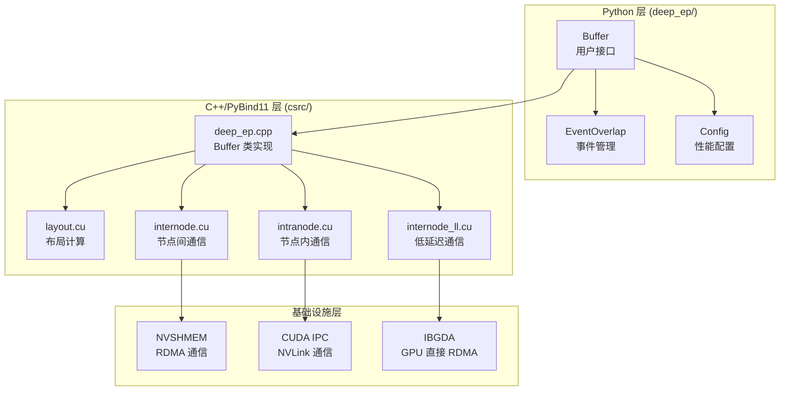

#### 1.2.2 Rank 组织模型

DeepEP 将全局 rank 组织为一个二维网格：

```
全局 Rank = RDMA_Rank × NUM_MAX_NVL_PEERS + NVL_Rank

其中:
- NUM_MAX_NVL_PEERS = 8 (每节点最多 8 个 GPU)
- NUM_MAX_RDMA_PEERS = 20 (最多 20 个 RDMA 节点)
- 最大支持 8 × 20 = 160 个 rank
```

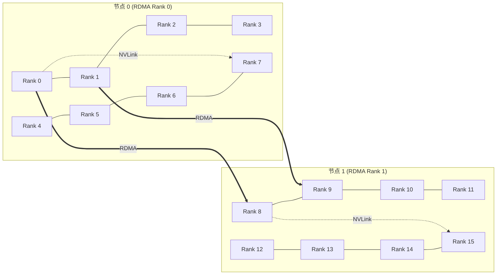

**节点内 (Intranode)**：同节点的 GPU 通过 NVLink 直连，通过 CUDA IPC 共享内存缓冲区实现零拷贝通信。

**节点间 (Internode)**：不同节点中相同 NVL_Rank 的 GPU 通过 RDMA 网络互连（如 Rank 0 ↔ Rank 8 ↔ Rank 16...），使用 NVSHMEM 分配对称堆内存。

#### 1.2.3 Buffer 初始化流程

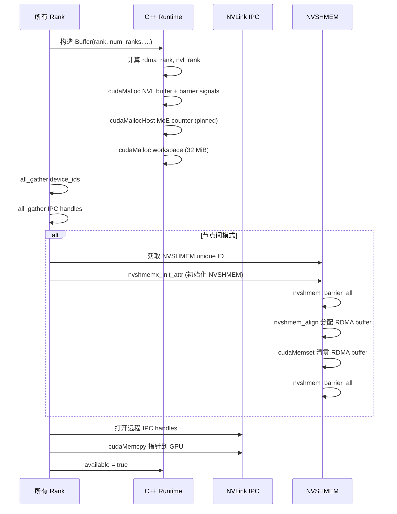

**Buffer 初始化关键细节：**
- NVL buffer 通过 `cudaMalloc` 或 `cuMemCreate`（Fabric 模式）分配，通过 `cudaIpcGetMemHandle` 导出给其他 rank
- Barrier signal 内存嵌入在 NVL buffer 尾部（`num_nvl_bytes` 之后），用于节点内同步
- MoE counter 使用 `cudaMallocHost`（pinned memory），映射到 GPU 地址空间，使 CPU 和 GPU 都能访问
- RDMA buffer 通过 NVSHMEM 的 `nvshmem_align` 分配，所有 rank 的对称堆内存

### 1.3 Dispatch 机制详解

Dispatch 是将 token 发送到其目标 expert 所在 rank 的过程。它分为三个阶段：**布局计算 → 元数据通知 → 数据传输**。

#### 1.3.1 阶段一：布局计算 (`get_dispatch_layout`)

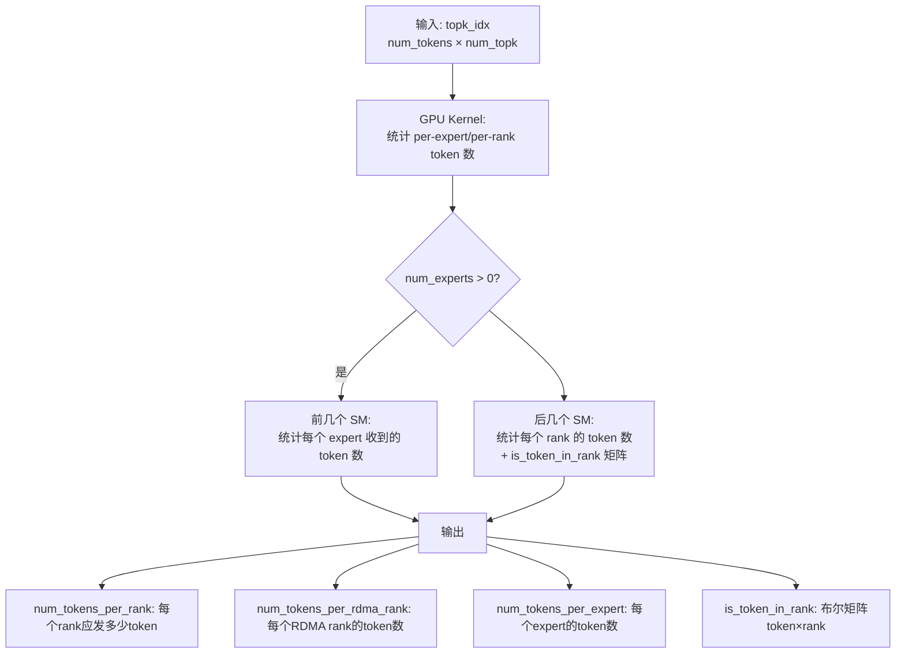

**布局计算 Kernel 实现 (`layout.cu`)：**

该 kernel 使用两个阶段的 SM 分配：
1. **前 N 个 SM**：每个 SM 负责 `kNumExpertsPerSM=4` 个 expert，统计每个 expert 被选中的 token 数
2. **后 M 个 SM**：每个 SM 负责 `kNumRanksPerSM=8` 个 rank，统计每个 rank 的 token 数并构建 `is_token_in_rank` 矩阵

使用 warp-level reduce（`warp_reduce_sum`）进行高效求和。

#### 1.3.2 阶段二：元数据通知 (Notify)

**节点内通知 (`intranode::notify_dispatch`)：**

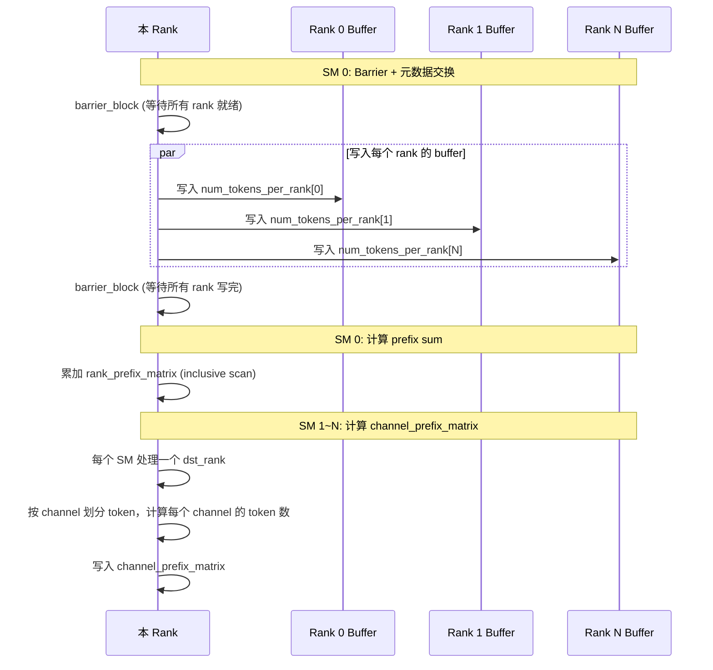

**关键数据结构：**
- **`rank_prefix_matrix[num_ranks][num_ranks]`**：前缀和矩阵，`rank_prefix_matrix[dst][src]` 表示 rank `src` 发送到 rank `dst` 的累积 token 数
- **`channel_prefix_matrix[num_ranks][num_channels]`**：每个 channel 的前缀和，用于 chunked 数据传输的负载均衡
- **`moe_recv_counter`**（pinned memory）：GPU 写入后缀和结果，CPU 通过 busy-wait 获取接收到的总 token 数
- **`moe_recv_expert_counter`**（pinned memory）：每个 local expert 接收到的 token 数（对齐到 `expert_alignment`）

**节点间通知 (`internode::notify_dispatch`)：**

节点间场景更复杂，需要**两层通知**：RDMA 层和全局层。

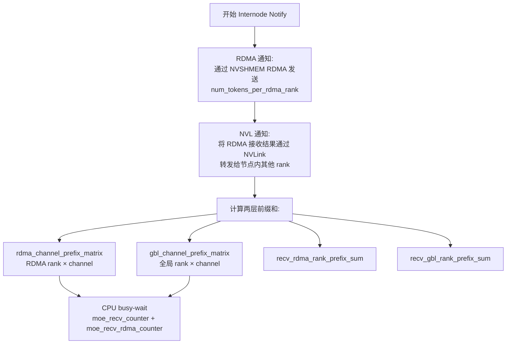

#### 1.3.3 阶段三：数据传输 (Data Dispatch)

**节点内 Dispatch (`intranode::dispatch`)：**

采用 **chunked（分块）并行传输**策略：

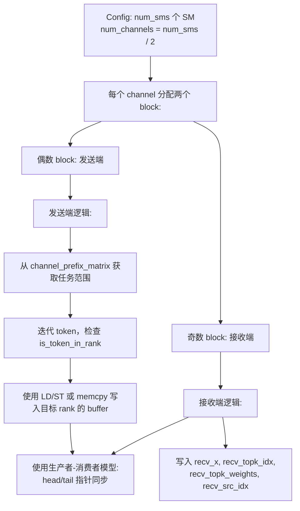

**Chunked 传输机制核心：**
- 每个 channel 在目标 rank 的 buffer 中有独立的队列空间
- 发送端按 chunk 写入数据并更新 `tail` 指针
- 接收端从 `head` 读取数据并更新 `head` 指针
- 配置参数 `num_max_nvl_chunked_send_tokens` 和 `num_max_nvl_chunked_recv_tokens` 控制每次 chunk 的大小
- Buffer 使用 `AsymBuffer` 管理，每个 rank 的 buffer 指针独立（支持 NVLink peer-to-peer）

**节点间 Dispatch (`internode::dispatch`)：**

节点间场景采用**两跳传输**策略：

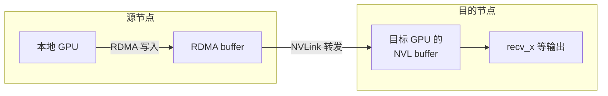

**两跳转发过程：**
1. **RDMA 跳**：源 rank 通过 NVSHMEM RDMA (`nvshmem_put_nbi`) 将数据写入目标节点中相同 GPU index 的 RDMA buffer
2. **NVLink 跳**：目标节点内，负责接收的 rank 通过 NVLink 将 RDMA buffer 中的数据转发到目标 rank 的 NVL buffer

**SourceMeta 结构体**：记录每个 token 的来源信息（`src_rdma_rank` + 8 位 `is_token_in_nvl_rank` 位掩码），用于 combine 阶段的反向路由。

**Cached 模式**：如果使用 handle 重用布局信息，则跳过 notify 阶段，仅做 barrier + 清理 flags，然后直接执行数据传输。

#### 1.3.4 Dispatch 完整流程图

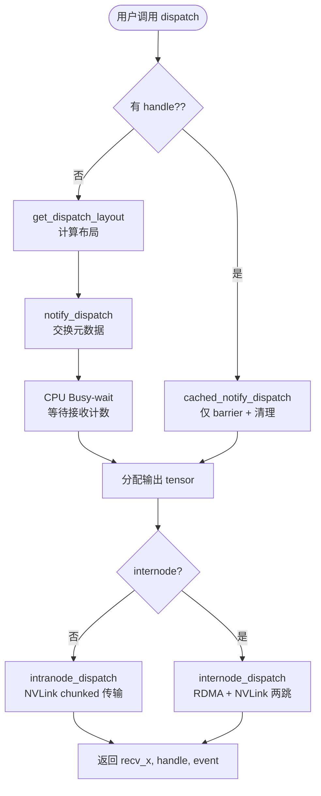

### 1.4 Combine 机制详解

Combine 是 dispatch 的逆过程：将 expert 处理后的 token 聚合（reduce）回原始 rank。

#### 1.4.1 Combine 核心流程

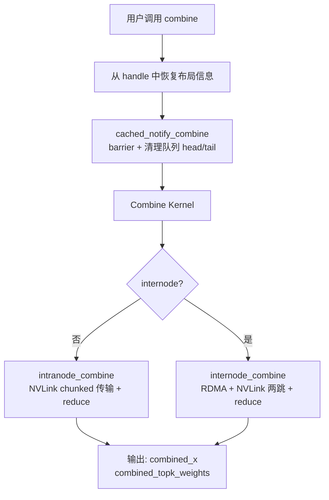

**Combine 与 Dispatch 的关键区别：**

| 特性 | Dispatch | Combine |
|------|----------|---------|
| 数据方向 | 发送 token 到 expert rank | 从 expert rank 收回 token |
| 权重处理 | 不做 reduce，直接转发 | 做 weighted reduce（加权求和） |
| 布局信息 | 需要计算布局 | 复用 dispatch 的 handle |
| 偏置 | 无 | 支持 bias 参数（最多 2 个） |
| 输出 | 收到的 token 按发送 rank 排序 | 聚合后按原始 token 顺序排列 |

#### 1.4.2 Combine Reduce 逻辑

在 combine 中，每个原始 token 可能被分发到多个 expert（top-k 选择），因此需要将这些 expert 的输出加权求和：

```
combined_x[token_i] = Σ(topk_weights[token_i][k] * expert_output[token_i][k])
```

**节点内 Combine：**
- 使用 dispatch 返回的 `send_head` 和 `src_idx` 确定每个 token 的原始位置
- 使用 `rank_prefix_matrix` 和 `channel_prefix_matrix` 进行 chunked 传输的反向操作
- 支持 bias（最多 2 个 bias tensor）直接加到最终结果上

**节点间 Combine：**
- 反向两跳：先 NVLink 聚合到 RDMA rank 代表，再 RDMA 发送回源节点
- 使用 `src_meta`（SourceMeta）确定每个 token 的来源 RDMA rank 和 NVL rank
- 使用 `rdma_channel_prefix_matrix` 和 `gbl_channel_prefix_matrix` 进行两层 chunked 传输

#### 1.4.3 Dispatch-Combine 对称性

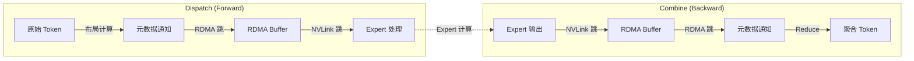

### 1.5 低延迟模式

低延迟模式专为推理 **Decoding** 阶段设计（batch size 小，延迟敏感），使用纯 RDMA（IBGDA）实现，**不占用 SM 资源**。

#### 1.5.1 IBGDA 机制

**IBGDA (InfiniBand GPU Direct Async)** 允许 GPU 线程直接发起 RDMA 操作，无需 CPU 介入：

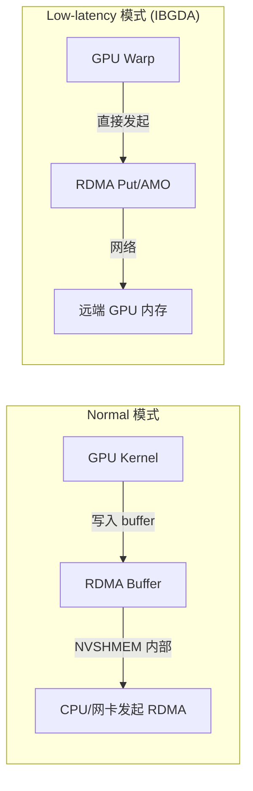

**关键特性：**
- 使用 `nvshmemi_ibgda_put_nbi_warp` 进行 warp-level RDMA 写入
- 使用 `nvshmemi_ibgda_amo_nonfetch_add` 进行 atomic 操作（传递 expert 计数）
- 低延迟 dispatch 使用负计数协议：初始值为 0，发送端 atomicAdd `-(num_tokens+1)`，接收端通过负值判断数据到达并计算实际 token 数
- 每个 expert 分配独立的 QP (Queue Pair)，`num_qps_per_rank` 必须等于 `num_local_experts`
- 如果目标 rank 在同一节点（通过 NVLink 可达），自动回退到 NVLink 路径

#### 1.5.2 低延迟 Dispatch 流程

```mermaid
flowchart TD
    A[low_latency_dispatch] --> B{发送阶段}
    B --> C[Warp Group 0~N-1:<br/>FP8 转换 + RDMA 发送]
    B --> D[最后一个 Warp:<br/>统计 expert 计数 + 清理]
    
    C --> C1[读取 token 数据]
    C1 --> C2{use_fp8?}
    C2 -->|是| C3[计算 per-128-channel amax<br/>转换为 FP8]
    C2 -->|否| C4[直接写入 BF16]
    C3 --> C5[写入 RDMA send buffer]
    C4 --> C5
    C5 --> C6[读取 topk_idx 确定 dst_expert]
    C6 --> C7[atomicAdd 获取 slot_idx]
    C7 --> C8{同节点?}
    C8 -->|是| C9[NVLink 直接写入<br/>UNROLLED_WARP_COPY]
    C8 -->|否| C10[IBGDA RDMA Put]
    
    D --> D1[统计每个 expert 的 token 数]
    D1 --> D2[等待本地 RDMA 完成]
    D2 --> D3[发送 expert 计数到远端<br/>(AMO 或 NVLink)]
    
    B --> E{接收阶段}
    E --> E1[grid sync<br/>(send/recv 同一 kernel)]
    E1 --> E2[每个 warp group 负责<br/>一个 (expert, src_rank) 对]
    E2 --> E3[Busy-wait 等待接收计数<br/>(ld_acquire_sys_global)]
    E3 --> E4[AtomicAdd 获取输出 slot]
    E4 --> E5[Copy 数据到 packed_recv_x]
```

**低延迟 Dispatch 的核心设计：**

1. **零 CPU 介入**：GPU 线程直接发起 RDMA，不需要 CPU 参与
2. **Expert 优先调度**：每个 SM 的 warp group 负责一组 expert，直接按 expert 索引发送到目标 rank
3. **Atomic Slot 分配**：使用 `atomicAdd` 在远端 buffer 中分配 slot，避免预协商。发送端先在本地 send buffer 中做好 FP8 转换和打包，然后通过 IBGDA 或 NVLink 直接写入远端预分配的接收 slot
4. **超时与容错**：接收端有超时检测（`NUM_TIMEOUT_CYCLES` ≈ 200G cycles），超时后可 mask 掉故障 rank
5. **计数协议**：dispatch 使用 `atomic_counter_per_expert`（slot 分配）+ `atomic_finish_counter_per_expert`（发送完成计数 + `FINISHED_SUM_TAG` 标记）双重计数
5. **Buffer 双缓冲**：使用两个对称 buffer 交替使用，`low_latency_buffer_idx ^= 1`

#### 1.5.3 低延迟 Combine 流程

```mermaid
flowchart TD
    A[low_latency_combine] --> B{发送阶段}
    B --> B1[读取 expert 处理后的数据]
    B1 --> B2{use_logfmt?}
    B2 -->|是| B3[LogFMT 编码<br/>10-bit 压缩]
    B2 -->|否| B4[BF16 直接发送]
    B3 --> B5[RDMA/NVLink 发送到目标 rank]
    B4 --> B5
    
    B --> C{接收阶段}
    C --> C1[等待远端数据到达<br/>(flag-based 同步)]
    C1 --> C2[读取 src_info 和 layout_range]
    C2 --> C3[加权 reduce:<br/>topk_weights × 数据]
    C3 --> C4[写入 combined_x]
```

**LogFMT 编码**：一种 10-bit 对数格式编码，将 BF16 数据压缩为 10 位（1 符号位 + 9 位），减少约 37.5% 的通信量。使用 warp-level 的 per-128-channel max/min 计算。

#### 1.5.4 Hook 机制（通信-计算重叠）

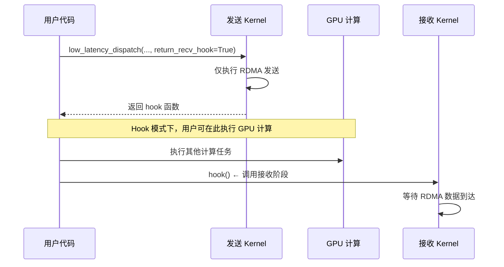

这是 DeepEP 的一个重要设计：将 dispatch/combine 分为发送和接收两个阶段，用户可以在中间插入计算任务，实现通信-计算重叠，而**不占用任何 SM 资源**（因为是纯 RDMA）。

### 1.6 内存管理与 Buffer 设计

#### 1.6.1 NVL Buffer 布局（节点内）

```
┌──────────────────────────────────────────────────────┐
│ NVL Buffer (每个 rank 一块)                          │
├──────────────────────────────────────────────────────┤
│ rank_prefix_matrix [num_ranks × num_ranks × int]     │  ← 元数据
│ expert_sizes [num_ranks × num_local_experts × int]   │  ← 元数据
│ channel_start [num_channels × num_ranks × int]       │  ← 队列偏移
│ channel_end [num_channels × num_ranks × int]         │  ← 队列偏移
│ queue_head [num_channels × num_ranks × int]          │  ← 生产者指针
│ queue_tail [num_channels × num_ranks × int]          │  ← 消费者指针
│ data_buffer [channels × ranks × chunk × hidden]      │  ← 数据
│ src_idx_buffer [channels × ranks × chunk × int]      │  ← 源索引
│ topk_idx_buffer [channels × ranks × chunk × topk]    │  ← Top-k 索引
│ topk_weight_buffer [channels × ranks × chunk × topk] │  ← Top-k 权重
│ scale_buffer [channels × ranks × chunk × scales]     │  ← FP8 缩放
├──────────────────────────────────────────────────────┤
│ barrier_signals [num_ranks × int]                    │  ← 同步信号
│ buffer_ptrs_gpu [num_ranks × void*]                  │  ← 指针数组
│ barrier_signal_ptrs_gpu [num_ranks × int*]           │  ← 指针数组
└──────────────────────────────────────────────────────┘
```

#### 1.6.2 RDMA Buffer 布局（低延迟模式）

```mermaid
graph TD
    subgraph "LowLatencyLayout (两个对称 buffer)"
        B0[Buffer 0] 
        B1[Buffer 1]
    end
    
    subgraph "每个 Buffer 包含:"
        S[Signaling Buffer<br/>num_experts × sizeof(int)]
        SEND[Send Buffer<br/>max(dispatch, combine) × num_msgs]
        RECV[Recv Data Buffer<br/>max(dispatch, combine) × num_msgs]
    end
    
    B0 --> S
    B0 --> SEND
    B0 --> RECV
```

**Buffer 双缓冲交替**：`low_latency_buffer_idx ^= 1`，当前 buffer 用于通信，下一个 buffer 在使用前被清理（`next_clean`）。

#### 1.6.3 Fabric 模式

对于 MNNVL（Multi-Node NVLink）场景，支持 `use_fabric=True`，使用 `cuMemCreate` / `cuMemExportToShareableHandle` 替代 `cudaMalloc` / `cudaIpcGetMemHandle`，实现跨节点 NVLink 内存共享。

---

## 第二部分：高性能优化分析

### 2.1 硬件亲和性优化

#### 2.1.1 NVLink 与 RDMA 双通道利用

DeepEP 的核心优化之一是**充分利用 NVLink 和 RDMA 的非对称带宽**：

- NVLink: ~160 GB/s（H800），用于节点内通信
- RDMA: ~50 GB/s（CX7 400 Gb/s），用于节点间通信

**Normal 模式的两跳设计**巧妙地将两种通道组合：
1. RDMA 只传一次（源节点 → 目标节点的同 GPU index）
2. NVLink 做节点内转发（收到后转发到目标 GPU）

这避免了 RDMA 需要连接所有 GPU 对的开销，同时充分利用了 NVLink 的高带宽。

#### 2.1.2 IBGDA GPU 直接 RDMA

低延迟模式使用 IBGDA 让 GPU 线程直接发起 RDMA 操作：

- **消除 CPU 开销**：传统方式需要 GPU→CPU→网卡 的数据路径，IBGDA 让 GPU warp 直接操作网卡
- **不占用 SM**：IBGDA 操作由网卡硬件处理，GPU 只需发起请求
- **支持 Hook 重叠**：发送和接收分离，中间可插入计算

### 2.2 并行性优化

#### 2.2.1 Chunked 分块传输

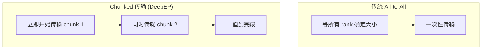

**优势：**
- 通信与元数据计算重叠：在后续 token 数量还在计算时，前面的 chunk 已经开始传输
- 更好的负载均衡：通过 channel 划分，每个 SM 独立处理一个子集
- 减少尾延迟：小 chunk 意味着最后一个 chunk 的等待时间更短

关键配置参数：
- `num_max_nvl_chunked_send_tokens`：每次发送的 chunk 大小
- `num_max_nvl_chunked_recv_tokens`：接收 buffer 每个 chunk 的大小
- 这些参数通过 `Config` 对象配置，并提供了针对不同 rank 数的推荐值

#### 2.2.2 Channel 并行

每个 channel 使用一对 block（发送 + 接收），总 channel 数 = `config.num_sms / 2`。这使得通信吞吐量与使用的 SM 数量成线性关系，用户可以通过 `Buffer.set_num_sms()` 灵活控制。

#### 2.2.3 Warp-Level 并行

在低延迟 kernel 中，使用 warp group 的方式组织线程：
- 每个 SM 分配 `num_warp_groups = ceil(num_experts / num_device_sms)` 个 warp group
- 每个 warp group 包含 `num_warps_per_group = 32 / num_warp_groups` 个 warp
- 第一个到倒数第二个 warp 做数据发送，最后一个 warp 做计数和清理

### 2.3 内存优化

#### 2.3.1 L1/L2 Cache 控制

大量使用 PTX 内联汇编精细控制缓存行为：

```cuda
// 不分配 L1 cache 的读取（流式读取，不重复使用）
ld.global.nc.L1::no_allocate.L2::256B

// 不分配 L1 cache 的写入（流式写入）
st.global.L1::no_allocate
```

这在 all-to-all 通信场景中非常关键——数据只读写一次，不应污染 L1 cache。

#### 2.3.2 内存序 (Memory Ordering) 控制

```cuda
st_release_sys_global   // 系统级 release 语义（跨 GPU/节点可见）
ld_acquire_sys_global   // 系统级 acquire 语义
st_release_cta          // CTA 级 release
ld_acquire_gpu.global   // GPU 级 acquire
```

精确的内存序控制避免了不必要的全局内存栅栏，在保证正确性的同时最大化性能。

#### 2.3.3 CUDA IPC 零拷贝

节点内通信使用 CUDA IPC 直接写入目标 GPU 的内存，避免了通过 CPU 中转的开销。所有 rank 的 buffer 指针通过 `cudaMemcpy` 复制到 GPU 端（`buffer_ptrs_gpu`），使得 GPU kernel 可以直接访问任何 peer 的 buffer。

### 2.4 异步与重叠优化

#### 2.4.1 双流异步模型

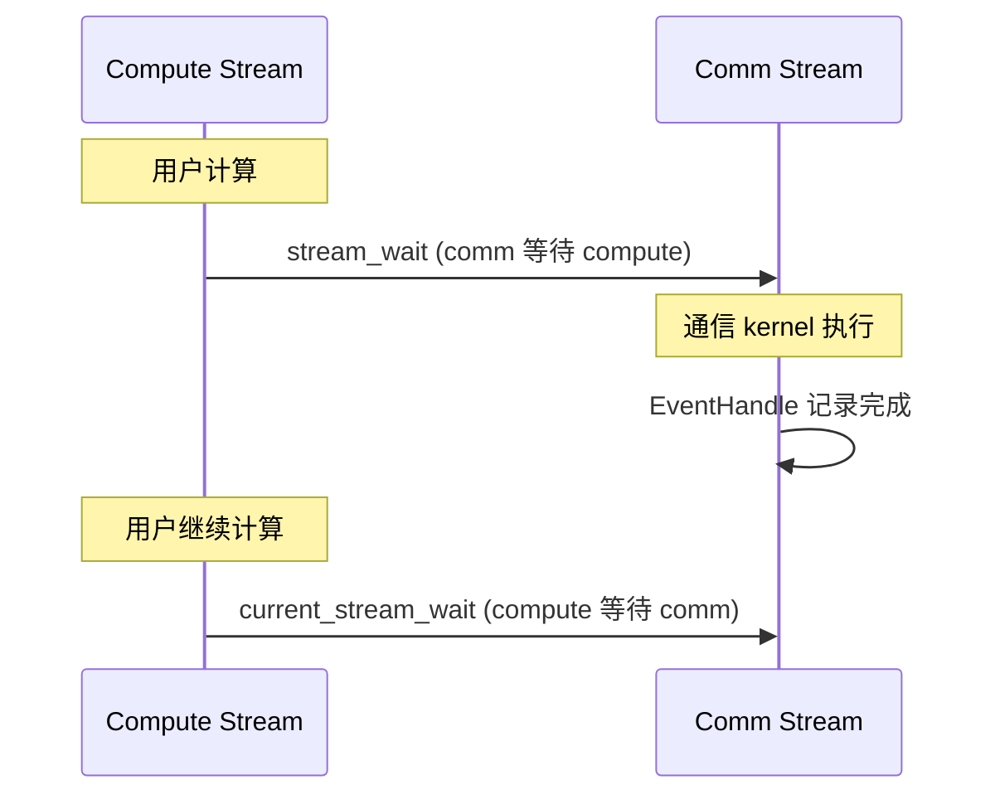

使用 `async_finish=True` + `EventOverlap`：
- 通信在独立 stream 上异步执行
- 用户可以在等待通信完成期间执行其他计算
- `EventOverlap` 封装了 CUDA event，支持 `with` 语法

#### 2.4.2 Pinned Memory Counter

使用 `cudaMallocHost` 分配 pinned memory 作为 GPU-CPU 通信通道：
- GPU kernel 将接收到的 token 计数写入 pinned memory
- CPU busy-wait 读取该值
- `cudaHostGetDevicePointer` 获取 GPU 可访问的映射地址

这比传统的 `cudaMemcpyAsync` + stream synchronize 更高效，因为 GPU 直接写入 CPU 可见的内存。

### 2.5 FP8 与量化优化

#### 2.5.1 Per-128-Channel FP8 转换

在低延迟 dispatch 中，使用 per-128-channel 的 FP8 量化：

```
对于每 128 个连续元素：
1. 计算 amax = max(|x[i]|)
2. scale = FP8_MAX / amax (with margin)
3. x_fp8[i] = round(x[i] * scale)
```

通信量从 BF16 的 2 bytes/element 降低到 FP8 的 1 byte/element + 4 bytes/128elements（scale），节省约 48% 的带宽。

#### 2.5.2 UE8M0 缩放格式

支持 UE8M0（无偏移的 8 位幂标度）作为缩放因子，将 scale 从 float32 压缩为 uint8，进一步节省通信量。要求 `round_scale=True`（将 scale 取整为 2 的幂）。

#### 2.5.3 LogFMT 10-bit 编码

在 combine 中可选使用 LogFMT 编码：
- 将 BF16 值编码为 10-bit 对数格式
- 使用 `log2f_approx` 和 `exp2f_approx` PTX 指令加速
- 通信量降低约 37.5%（10/16）

### 2.6 容错与弹性

#### 2.6.1 Shrink 模式

低延迟模式支持 `enable_shrink=True`，启用 rank 级别的故障检测和屏蔽：

```mermaid
flowchart TD
    A[通信超时检测] --> B{是否超时?}
    B -->|是| C[atomicExch mask_buffer[dst_rank] = 1]
    C --> D[后续通信跳过被 mask 的 rank]
    B -->|否| E[正常通信]
    
    F[low_latency_update_mask_buffer] --> G[手动 mask/unmask rank]
    H[low_latency_query_mask_buffer] --> I[查询当前 mask 状态]
    J[low_latency_clean_mask_buffer] --> K[清空所有 mask]
```

**超时检测机制**：
- 发送端和接收端都有 `NUM_TIMEOUT_CYCLES`（约 200G cycles ≈ 100s）的超时检测
- 超时后自动 mask 掉故障 rank
- 使用 barrier 同步确保所有 rank 的一致视图

### 2.7 其他优化

#### 2.7.1 UNROLLED_WARP_COPY 宏

核心数据拷贝宏，使用 warp 级别展开拷贝：
```cuda
UNROLLED_WARP_COPY(8, lane_id, N, dst, src, ld_nc_global, st_na_global);
```
- 展开 8 次 `int4` 读取（128 bytes per unroll）
- 一个 warp（32 线程）一次拷贝 128 × 8 = 1024 bytes
- 使用 `ld.global.nc.L1::no_allocate` 流式读取 + `st.global.L1::no_allocate` 流式写入

#### 2.7.2 Aggressive PTX 指令

使用多个 Hopper 特有的 PTX 指令：
- `elect.sync`：warp 内随机选举一个线程（比 `lane_id == 0` 更公平）
- `mbarrier`：高效的多线程同步原语
- `fence.mbarrier_init`：mbarrier 初始化的轻量内存栅栏

可通过 `DISABLE_AGGRESSIVE_PTX_INSTRS` 在不稳定平台上禁用。

#### 2.7.3 QP Depth 管理

```python
self.nvshmem_qp_depth = int(os.environ.get('NVSHMEM_QP_DEPTH', '1024'))
assert self.nvshmem_qp_depth >= (num_max_dispatch_tokens_per_rank + 1) * 2
```

确保 QP 深度始终大于在途 WR 数量，从而**跳过 WQ slot 检查**，减少发送路径上的开销。

---

## 第三部分：关键 Q&A

### Q1: DeepEP 解决的核心问题是什么？

**A:** 在 MoE 模型的 Expert Parallelism 中，每个 token 需要被发送到持有其目标 expert 的 GPU（dispatch），expert 处理完成后结果需要聚合回来（combine）。这个 all-to-all 通信是 MoE 模型的主要通信瓶颈。DeepEP 提供了高效、低延迟的 dispatch/combine kernel，适配不同的工作负载场景（训练 vs 推理）。

### Q2: Normal 模式和 Low-latency 模式的主要区别是什么？

**A:**

| 特性 | Normal 模式 | Low-latency 模式 |
|------|-------------|------------------|
| 目标 | 高吞吐（训练/Prefilling） | 低延迟（Decoding） |
| 通信方式 | NVLink + NVSHMEM RDMA | 纯 IBGDA RDMA |
| SM 占用 | 需要占用 SM | 不占用 SM |
| CPU 同步 | 需要（busy-wait counter） | 不需要 |
| CUDA Graph | 有限支持（num_worst_tokens） | 不支持 |
| 延迟 | 数百微秒到毫秒级 | ~77-370 微秒 |
| Hook 重叠 | 不支持 | 支持 |
| 适用 batch | 大 batch（4096+ tokens） | 小 batch（128 tokens） |

### Q3: 为什么节点间通信采用两跳设计（RDMA + NVLink 转发）？

**A:** 
1. **减少 RDMA 连接数**：如果每个 GPU 都与所有远端 GPU 建立 RDMA 连接，需要 N×N 个连接。两跳设计中，只有相同 GPU index 的 rank 之间建立 RDMA 连接，连接数降低为 N 个。
2. **适配非对称带宽**：NVLink 带宽（~160 GB/s）远高于 RDMA（~50 GB/s），节点内转发的开销很小。
3. **简化路由**：通过 `gbl_channel_prefix_matrix` 的两级前缀和，清晰管理 RDMA 和 NVLink 两层路由。

### Q4: `get_dispatch_layout` 的作用是什么，为什么需要单独的步骤？

**A:** `get_dispatch_layout` 计算 token 到 rank 的映射关系，包括：
- 每个 rank 需要发送多少 token
- 每个 expert 需要处理多少 token  
- 每个 token 是否属于某个 rank（`is_token_in_rank` 矩阵）

将其作为独立步骤的好处：
1. **提前获取元数据**：在数据传输前就知道每个 rank 的接收量，便于内存分配
2. **支持 Handle 复用**：布局信息缓存在 handle 中，backward pass 可以复用
3. **异步执行**：可以与计算 overlap

### Q5: Chunked 传输如何工作？为什么比一次性传输更高效？

**A:** Chunked 传输将数据分成固定大小的 chunk，通过 head/tail 指针的生产者-消费者模型在 channel 上并行传输。

优势：
1. **流水线化**：发送端和接收端可以并行工作，不需要等待全部数据就绪
2. **更好的 SM 利用**：多个 channel 并行工作，每个 channel 传输一小部分数据
3. **减少内存峰值**：不需要为完整的接收数据预分配空间，只需 `num_max_nvl_chunked_recv_tokens` 的 buffer
4. **隐藏延迟**：后续 chunk 的通知可以与前面 chunk 的传输重叠

### Q6: IBGDA 是什么？为什么对低延迟至关重要？

**A:** IBGDA (InfiniBand GPU Direct Async) 允许 GPU 线程直接发起 RDMA 操作，完全绕过 CPU。在 DeepEP 中：
- GPU warp 使用 `nvshmemi_ibgda_put_nbi_warp` 直接写入远端 GPU 内存
- 使用 `nvshmemi_ibgda_amo_nonfetch_add` 直接在远端执行 atomic 操作
- 数据路径：GPU → 网卡 → 远端 GPU（无 CPU 介入）
- 这将 dispatch 延迟从毫秒级降低到百微秒级

### Q7: Handle 机制如何工作？为什么 dispatch 和 combine 需要 handle？

**A:** Handle 是一个 tuple，保存了 dispatch 阶段计算的布局信息：

**节点内 handle:** `(rank_prefix_matrix, channel_prefix_matrix, recv_channel_prefix_matrix, recv_src_idx, is_token_in_rank, send_head)`

**节点间 handle:** `(is_token_in_rank, rdma_channel_prefix_matrix, gbl_channel_prefix_matrix, recv_rdma_channel_prefix_matrix, recv_rdma_rank_prefix_sum, recv_gbl_channel_prefix_matrix, recv_gbl_rank_prefix_sum, recv_src_meta, send_rdma_head, send_nvl_head)`

Handle 的作用：
1. **Combine 复用**：combine 需要知道 token 的来源信息以正确 reduce
2. **Cached dispatch**：如果布局不变（如 backward pass），可以跳过布局计算直接传输
3. **反向路径**：dispatch 中源 → 目标的映射，combine 中反向使用

### Q8: CPU busy-wait 会不会浪费 CPU 资源？

**A:** 会，但这是一个有意的权衡：
- 使用 `cudaMallocHost` 的 pinned memory，CPU 读取延迟极低（~100ns）
- 在 Normal 模式中，GPU 需要将接收计数写入 pinned memory，CPU busy-wait 是获取该值的最快方式
- 在低延迟模式中完全避免了 CPU 同步
- 释放 GIL (`pybind11::gil_scoped_release`) 确保不会阻塞其他 Python 线程
- 有超时保护（`NUM_CPU_TIMEOUT_SECS = 100s`）

### Q9: FP8 dispatch 如何保证精度？scale factor 是如何传递的？

**A:** DeepEP 使用 per-128-channel 的 FP8 量化：
1. 每 128 个连续 hidden 元素计算一个 amax
2. scale = `FP8_MAX / amax`（带 margin 防止溢出）
3. Scale factor 随数据一起传输（在消息尾部）
4. 接收端用 scale 将 FP8 转回 BF16

Scale 格式选项：
- **float32**：`hidden / 128` 个 scale（每 128 元素一个）
- **UE8M0**：`hidden / 512` 个 packed scale（round 到 2 的幂后压缩为 8 位）

Scale tensor 的 layout 使用 **column-major**（转置后存储），以兼容 TMA (Tensor Memory Accelerator) 加载。

### Q10: Buffer 大小是如何确定的？

**A:** 通过 `Config.get_nvl_buffer_size_hint()` 和 `Config.get_rdma_buffer_size_hint()` 计算推荐大小。主要考虑因素：
- Channel 数量（`num_sms / 2`）
- 每个 rank 的 chunk 大小
- Hidden 维度和数据类型
- Top-k 数量
- Scale 数量

用户需要为所有 rank 计算最大的 buffer 需求，然后分配。

### Q11: 低延迟模式为什么只能同时持有 2 个结果 tensor？

**A:** 因为低延迟模式使用双缓冲交替设计（`low_latency_buffer_idx ^= 1`），只有两个 buffer。如果持有超过 2 个结果 tensor，第三个 dispatch/combine 会覆盖第一个还在使用的 buffer。这是空间（显存）和时间（延迟）的权衡。

### Q12: `expert_alignment` 参数的作用是什么？

**A:** 在 dispatch 中，接收到的每个 local expert 的 token 数会对齐到 `expert_alignment` 的倍数。这使得下游的 GEMM kernel 可以使用固定大小的 tile，避免动态 shape 带来的性能下降。代价是可能有少量 padding token，但在大 batch 下影响很小。

### Q13: NVSHMEM 在 DeepEP 中的角色是什么？

**A:** NVSHMEM 提供了：
1. **对称堆内存**：所有 rank 的 RDMA buffer 在 NVSHMEM 对称堆上分配，每个 rank 可以通过相同的偏移量访问远端 rank 的内存
2. **RDMA 操作 API**：`nvshmem_put_nbi`、`nvshmem_get_nbi` 等
3. **IBGDA 支持**：GPU 直接发起 RDMA 的底层实现
4. **Team 管理**：`nvshmem_team_split_strided` 创建子 team，支持低延迟模式下的 RDMA rank 分组
5. **同步原语**：`nvshmem_barrier_all` 等

### Q14: `num_worst_tokens` 如何实现 CUDA Graph 兼容？

**A:** 当指定 `num_worst_tokens` 时：
- CPU 不再 busy-wait 接收计数
- 直接分配 `num_worst_tokens` 大小的输出 tensor（worst case）
- 实际接收到的 token 数通过 `num_recv_tokens_per_expert_list` 返回（但为空列表）
- 这消除了 CPU-GPU 同步，使 dispatch 可以被 CUDA Graph 捕获

限制：仅在节点内模式下可用。

### Q15: Combine 的 bias 参数是什么用途？

**A:** Combine 支持 0~2 个 bias tensor（`torch.bfloat16`），直接加到 combine 的最终结果上。这在 MoE 模型中用于 residual connection 或 additive bias。支持两个 bias 是为了灵活性（例如一个用于 residual，一个用于 layernorm bias）。

### Q16: 两跳设计中的死锁如何避免？

**A:** 代码中有专门的断言确保避免死锁：
```cpp
EP_HOST_ASSERT(config.num_max_nvl_chunked_recv_tokens % num_rdma_ranks == 0);
EP_HOST_ASSERT(config.num_max_nvl_chunked_send_tokens <= config.num_max_nvl_chunked_recv_tokens / num_rdma_ranks);
```
这确保：
1. NVL 接收 buffer 大小是 RDMA rank 数的倍数
2. 发送 chunk 不超过每个 RDMA rank 分到的接收空间
3. 发送端永远不会因为接收 buffer 满而阻塞

### Q17: `allocate_on_comm_stream` 参数的用途？

**A:** 控制输出 tensor 的内存分配在通信 stream 上完成，而非计算 stream。这在 CUDA Graph 模式下很重要，因为 tensor 的所有权需要归属于正确的 stream。使用时需要配合 `async_finish=True` 和 `previous_event`。

### Q18: 低延迟模式中 dispatch 和 combine 的超时检测有何不同？

**A:** 两者机制类似但细节不同：

**Dispatch 超时：**
1. 接收端 busy-wait `rdma_recv_count[local_expert * num_ranks + src_rank]`，初始值为 0
2. 发送端完成后通过 AMO 或 NVLink 写入负值（`-num_tokens - 1`）
3. 接收端检测到非零值后，计算 `num_recv_tokens = -value - 1`
4. 超时后 mask 故障 rank，将 `num_recv_tokens` 设为 0（`-(-1) - 1 = 0`）

**Combine 超时：**
1. 接收端 busy-wait `rdma_recv_flag[global_expert_idx]`，初始值为 0
2. 发送端完成所有数据传输后，通过 AMO 或 NVLink 写入 1 作为完成标志
3. 超时后 mask 故障 rank
4. 两者都使用 `ld_acquire_sys_global` 确保跨节点内存可见性

**A:**
1. **发送端**：RDMA 发送完成后通过 `atomic_add_release_global` 增加完成计数
2. **接收端**：使用 `ld_acquire_sys_global` busy-wait 等待计数变化，有 `NUM_TIMEOUT_CYCLES` 超时
3. **Barrier 超时**：`clean_low_latency_buffer` 中的 barrier 也有超时检测
4. **Mask 机制**：超时后通过 `atomicExch(mask_buffer[rank], 1)` 标记故障 rank
5. **后续通信**：所有发送/接收操作前检查 `is_rank_masked()`，跳过被 mask 的 rank
6. **手动管理**：`low_latency_update_mask_buffer` / `query_mask_buffer` / `clean_mask_buffer` 提供手动控制

### Q19: DeepEP 为什么需要 NVLink？PCIe GPU 能用吗？

**A:** NVLink 是节点内高速通信的必要条件。代码中有显式检查：
```python
if 'PCIE' in torch.cuda.get_device_name():
    assert group.size() <= 2, 'PCIe GPUs only have pairwise NVLink connections'
```
PCIe GPU（如部分 A100 PCIe 版）只有两两 NVLink 连接，最多支持 EP2。这限制了节点内的扩展性。

### Q20: DeepEP 的性能数据如何解读？

**A:** 以 H800 上的 internode 64 EP 为例：
- **Dispatch**：~51 GB/s RDMA 带宽（理论最大 ~50 GB/s），说明已接近硬件极限
- **Combine**：~50 GB/s RDMA 带宽
- **低延迟 128 EP dispatch**：~192 us 延迟，~39 GB/s RDMA 带宽

注意：Normal 模式的瓶颈带宽通常是 RDMA（最慢链路），低延迟模式在 rank 数少时可以达到更高的等效带宽（如 8 EP dispatch 达到 98 GB/s，利用了 NVLink）。

---

## 第四部分：总结与评价

### 4.1 设计初衷与目标

DeepEP 的设计初衷是为 **DeepSeek-V3/R1** 系列大规模 MoE 模型提供高效的 Expert Parallelism 通信方案。其核心设计目标：

1. **极致性能**：充分发挥 NVLink 和 RDMA 的硬件带宽
2. **双模式覆盖**：高吞吐模式（训练）和低延迟模式（推理）一体化
3. **适配 DeepSeek-V3 架构**：支持 group-limited gating 的非对称路由模式

### 4.2 设计权衡

| 权衡 | 选择 | 理由 |
|------|------|------|
| 吞吐 vs 延迟 | 双模式分离 | 训练和推理的优化方向不同，统一方案难以兼顾 |
| CPU 参与 vs 纯 GPU | Normal 需 CPU，Low-latency 纯 GPU | Normal 模式下 CPU busy-wait 是获取接收计数的最快方式 |
| 通用性 vs 专用性 | 高度专用 | 针对 H800 + InfiniBand 优化，牺牲了通用性 |
| Buffer 显存 | 固定预分配 | 避免运行时分配的开销，但需要较多显存 |
| 容错 | 可选 shrink 模式 | 基础模式假设所有 rank 可用，shrink 模式增加超时检测 |

### 4.3 优秀设计

1. **Chunked 传输**：精巧的生产者-消费者模型，实现了通信与元数据计算的重叠
2. **两跳路由**：巧妙利用 NVLink + RDMA 的非对称带宽，简化了连接拓扑
3. **IBGDA Hook 机制**：发送-接收分离 + Hook 回调，实现了真正的零 SM 占用通信-计算重叠
4. **PTX 级优化**：从内存序到缓存控制的底层优化，榨干硬件性能
5. **FP8 + LogFMT**：多种量化选项，灵活平衡精度和带宽

### 4.4 未来可改进点

1. **自动化调优**：Config 参数目前是手动设定/查表（代码中有 `TODO: automatically tune`），可引入 auto-tuning 机制
2. **CUDA Graph 完整支持**：当前 Normal 模式对 CUDA Graph 支持有限（仅 `num_worst_tokens` 路径，且仅节点内可用）
3. **更灵活的 Expert 数量**：当前低延迟模式要求 `num_qps_per_rank == num_local_experts`，限制了配置灵活性
4. **更广泛的硬件支持**：目前针对 H800 + InfiniBand 优化，对其他 GPU/网络适配有限
5. **动态 Buffer 管理**：固定大小的 buffer 在 workload 变化时可能浪费显存或不够用
6. **低延迟模式的 hidden 维度限制**：`internode_ll.cu` 使用编译时模板特化（`SWITCH_HIDDEN` 宏），仅支持特定的 hidden 维度
6. **RoCE 兼容性验证**：声称理论上兼容但未充分测试

### 4.5 性能优化方向

1. **网络层优化**：
   - 利用 NVSHMEM 的 SHArP (Scalable Hierarchical Aggregation and Reduction Protocol) 进行硬件加速 reduce
   - 更智能的自适应路由策略
   - 多路径 RDMA（Multi-path RDMA）增加带宽利用率

2. **GPU 架构适配**：
   - Blackwell (SM100) 架构的新特性利用（如更大的 TMA、新的 tensor core 指令）
   - NVLink 5.0 的更高带宽利用
   - HBM3e 的更大带宽

3. **算法层优化**：
   - 更精细的 FP8 量化策略（如 per-token 或 per-group scaling）
   - Token dropping 策略与通信的协同优化
   - Expert 负载均衡感知的通信调度

4. **系统层优化**：
   - 多 EP group 并发通信
   - 与 Megatron-LM / vLLM 等框架的深度集成
   - Zero-copy pipeline：减少 dispatch 到 expert 计算的数据搬运

5. **弹性与可观测性**：
   - 更完善的故障检测和自动恢复
   - 详细的性能 profiling 工具
   - 动态 rank 增减支持

---

*本文档基于 DeepEP 源码的完整分析，所有技术细节均来自代码实现。*
