# NCCL CUDA Graph Capture 机制深度分析

> 本文档系统分析 NCCL 支持CUDA Graph Capture的机制、原理与代码实现，涵盖设计目标、技术权衡、核心数据结构与关键流程。

---

## 目录

1. [背景与动机](#1-背景与动机)
2. [CUDA Graph 基础](#2-cuda-graph-基础)
3. [NCCL Graph Capture 整体架构](#3-nccl-graph-capture-整体架构)
4. [核心数据结构](#4-核心数据结构)
5. [Graph Capture 检测与传播](#5-graph-capture-检测与传播)
6. [Strong Stream 机制](#6-strong-stream-机制)
7. [Persistent Work 机制](#7-persistent-work-机制)
8. [Proxy 操作在 Graph 中的处理](#8-proxy-操作处理)
9. [Launch Order 隐式串行化](#9-launch-order)
10. [CE Collective 与 Graph Capture](#10-ce-collective)
11. [Graph Usage Mode 配置](#11-配置)
12. [Kernel Launch 与 Graph](#12-kernel-launch)
13. [完整流程图](#13-完整流程)
14. [性能分析与设计权衡评论](#14-性能评论)
15. [NCCL Stream 体系与 GPU-CPU 协作机制](#15-nccl-stream-体系与-gpu-cpu-协作机制)
16. [补充：Device 端 Work 加载与 Kernel 参数传递](#16-补充device-端-work-加载与-kernel-参数传递)
17. [补充：Kernel Launch 的硬件级属性](#17-补充kernel-launch-的硬件级属性)
18. [补充：Debug 与诊断支持](#18-补充debug-与诊断支持)
19. [补充：`cudaThreadExchangeStreamCaptureMode` 详解](#19-补充cudathreadexchangestreamcapturemode-详解)
20. [补充：Stream 与 Memory Pool 的交互](#20-补充stream-与-memory-pool-的交互)
21. [最终审核总结](#21-最终审核总结)

---

## 1. 背景与动机

### 为什么需要 CUDA Graph？

在分布式训练中，每个训练迭代重复执行相同的集合通信操作序列。默认情况下，每次 `ncclAllReduce()` 调用都涉及：
- Host 端参数检查、任务规划、proxy 操作提交
- CUDA kernel launch（涉及 driver API 调用）
- Host 端同步开销

当迭代时间短（如小模型训练），这些 host 端开销成为显著瓶颈。**CUDA Graph** 允许将一系列 GPU 操作捕获为一个图，之后通过 `cudaGraphLaunch` 一次性重放，消除逐次 kernel launch 的 host 开销。

### NCCL 支持 Graph 的核心挑战

1. **流身份丢失**：普通 `cudaStream_t` 在被图捕获后，不同 graph launch 之间不再保持身份关联
2. **Proxy 依赖**：NCCL 的集合通信依赖 CPU proxy 线程推进网络操作，但 graph 捕获期间 CPU 不能干预
3. **资源生命周期**：普通模式下每次操作后回收内存，graph 模式下需要持久化直到 graph 销毁
4. **混合执行**：同一 communicator 可能交替在 graph 内和非 graph 模式下使用

---

## 2. CUDA Graph 基础

### 核心概念

CUDA Graph 将 CUDA 操作（kernel、memcpy 等）及其依赖关系编码为有向无环图（DAG）。关键特性：
- **捕获阶段**：通过 `cudaStreamBeginCapture/EndCapture` 将 stream 上的操作录制到 `cudaGraph_t`
- **实例化**：`cudaGraphInstantiate` 将 graph 编译为可执行的 `cudaGraphExec_t`
- **重放**：`cudaGraphLaunch` 以极低延迟执行整个图
- **节点更新**：`cudaGraphExecKernelNodeSetParams` 可更新参数而不重新实例化

### 关键 API（NCCL 使用的）

| API | 作用 | NCCL 使用场景 |
|-----|------|-------------|
| `cudaStreamGetCaptureInfo_v2/v3` | 检测 stream 是否处于捕获状态，获取 graph 信息 | 检测用户 stream 是否被捕获 |
| `cudaStreamUpdateCaptureDependencies` | 修改捕获节点的依赖 | 控制 graph 内的执行顺序 |
| `cudaGraphAddEventRecordNode` | 在 graph 中添加 event record 节点 | Release 时记录 serial event |
| `cudaGraphAddDependencies` | 添加节点间依赖边 | Release 时建立依赖关系 |
| `cudaGraphRetainUserObject` | 关联用户对象到 graph | 持久化资源随 graph 销毁而回收 |
| `cudaLaunchHostFunc` | 在 stream 中插入 host 回调 | proxy 操作提交 |
| `cudaThreadExchangeStreamCaptureMode` | 切换 stream 捕获模式 | 防止内部操作被意外捕获 |

### `cudaStreamGetCaptureInfo` 返回值

```cpp
// CUDA >= 11.03
cudaStreamGetCaptureInfo(stream, &status, &graphId, &graph, &deps, &num_deps);
```

- `status`：`cudaStreamCaptureStatusActive` 表示正在捕获
- `graphId`：全局唯一标识符，区分不同的 graph 实例
- `graph`：当前正在构建的 `cudaGraph_t`
- `deps`：当前 stream 节点的依赖节点列表

---

## 3. NCCL Graph Capture 整体架构

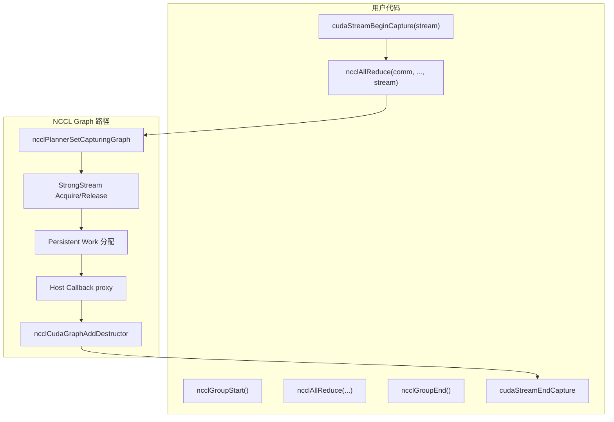

### 关键设计决策

1. **透明支持**：用户无需修改 NCCL 调用方式，只需将调用放在 `cudaStreamBeginCapture`/`EndCapture` 之间
2. **Group 内一致性**：同一 `ncclGroup` 内的所有 stream 必须处于同一 graph 或全部非捕获
3. **Persistent 资源**：graph 捕获时分配的资源绑定到 graph 的生命周期
4. **Proxy 延迟执行**：proxy 操作通过 host callback 在 graph launch 时执行

---

## 4. 核心数据结构

### 4.1 ncclCudaGraph — Graph 身份标识

**文件**：`src/include/strongstream.h`

```cpp
struct ncclCudaGraph {
  cudaStream_t origin;           // 原始被捕获的 stream
  cudaGraph_t graph;             // 正在构建的 graph
  unsigned long long graphId;    // 全局唯一 graph ID（ULLONG_MAX = 无效）
  int graphUsageMode;            // 0=仅graph, 2=支持mixing
};
```

**设计目的**：
- `graphId`：CUDA 为每个 graph 捕获会话分配唯一 ID。NCCL 用此 ID 区分不同的 graph，确保 Strong Stream 为每个 graph 维护独立的捕获状态
- `origin`：原始 stream，用于在 graph 内创建新节点时建立依赖
- `graphUsageMode`：控制 graph 与非 graph 混合执行时的同步行为

**辅助函数**：

```cpp
ncclCudaGraphNone(mode)    // 创建无效的 graph 标识（非捕获场景）
ncclCudaGraphValid(graph)  // graphId != ULLONG_MAX → 处于捕获状态
ncclCudaGraphSame(a, b)    // graphId 相等 → 同一个 graph
```

### 4.2 ncclStrongStream — 跨 Graph 一致的流抽象

**文件**：`src/include/strongstream.h`, `src/misc/strongstream.cc`

```cpp
struct ncclStrongStream {
  cudaStream_t liveStream;              // 非捕获时使用的 stream
  void* liveAcquiredBy;                 // 当前持有者（线程本地 ID）
  bool everCaptured;                     // 是否曾被 graph 捕获过
  std::mutex mutex;                      // 保护 captureHead 并发访问
  ncclStrongStreamCapture* captureHead;  // graph 捕获状态的链表
  cudaEvent_t serialEvent;              // graph 与非 graph 间同步的 event
};
```

**捕获状态链表节点**：

```cpp
struct ncclStrongStreamCapture {
  ncclStrongStreamCapture* next;
  cudaGraph_t graph;
  unsigned long long graphId;
  cudaStream_t captureStream;  // 在 graph 内代表此 strong stream 的 stream
  void* acquiredBy;
};
```

**核心问题**：普通 `cudaStream_t` 在被 graph 捕获后失去身份——同一个 stream 在不同 graph launch 中的捕获形式互不关联。`ncclStrongStream` 解决方案：
1. **liveStream**：非捕获模式下直接使用
2. **captureStream**：每个 graph 创建一个独立的 stream，在 graph 内代表此 strong stream
3. **serialEvent**：在 graph 执行完后记录 event，后续非捕获操作等待此 event；反之亦然

### 4.3 ncclCudaContext — 每上下文状态

```cpp
struct ncclCudaContext {
  ncclCudaContext* next;
  CUcontext hcontext;
  int refCount;
  ncclStrongStream launchOrder;  // 每设备全局 launch 顺序流
};
```

`launchOrder` 是每个 CUDA context 一个的 Strong Stream，用于建立不同 communicator 之间的隐式执行顺序（详见第9节）。

---

## 5. Graph Capture 检测与传播

### 5.1 检测入口：ncclPlannerSetCapturingGraph

**文件**：`src/enqueue.cc:2458`

每次用户调用集合通信 API（如 `ncclAllReduce`），NCCL 通过 `taskAppend` → `ncclPlannerSetCapturingGraph` 检测当前 stream 的捕获状态：

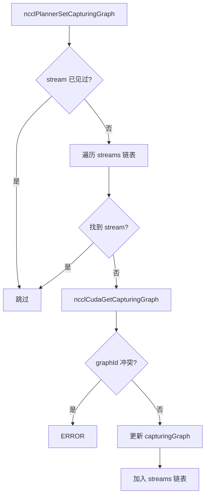

**一致性约束**：同一 `ncclGroup` 内，所有 stream 必须处于同一个 graph 或全部非捕获。混用不同 graph 会导致 `ncclInvalidUsage` 错误。

### 5.2 底层检测：ncclCudaGetCapturingGraph

**文件**：`src/misc/strongstream.cc`

调用 `cudaStreamGetCaptureInfo_v3`（或 `_v2`，取决于 CUDA 版本）获取 stream 的捕获状态。如果 `status == cudaStreamCaptureStatusActive`，则记录 graph 信息；否则标记为无效。

**版本兼容性**：需要 CUDA Runtime >= 11.03 且 Driver >= 11.03。如果不满足且检测到捕获，返回错误提示用户升级。

### 5.3 Group 级一致性约束

在 `doLaunches`（`src/group.cc`）中，检查同一 group 内所有 communicator 的 graph 状态是否一致：

```cpp
bool capturingYes = false, capturingNo = false;
// ... 遍历所有 comm ...
if (capturingYes && capturingNo) {
    WARN("Either none or all communicators in a ncclGroup() can be CUDA graph captured.");
    return ncclInvalidUsage;
}
```

**设计权衡**：允许混合使用会极大增加复杂性，NCCL 选择禁止以保持实现简洁。

---

## 6. Strong Stream 机制

### 6.1 问题：普通流在 Graph 中的身份丢失

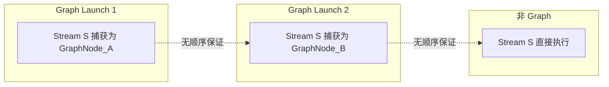

### 6.2 设计思路

Strong Stream 为每个 graph 实例创建一个独立的 "capture stream"，通过 `serialEvent` 在 graph 与非 graph 之间建立顺序：

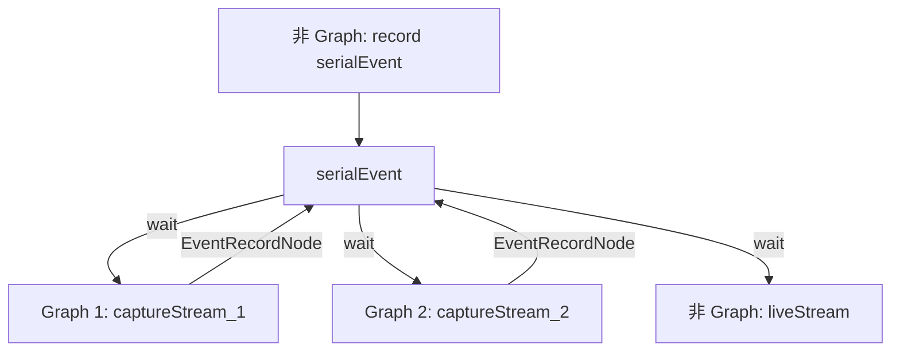

### 6.3 Acquire/Release 协议

所有对 Strong Stream 的操作必须包裹在 Acquire/Release 对中：

```cpp
cudaStream_t workStream;
ncclStrongStreamAcquire(graph, &ss, concurrent, &workStream);
// 在 workStream 上添加工作
ncclStrongStreamRelease(graph, &ss, concurrent);
```

### 6.4 Graph 内的 Acquire 流程

**文件**：`src/misc/strongstream.cc` — `ncclStrongStreamAcquire`

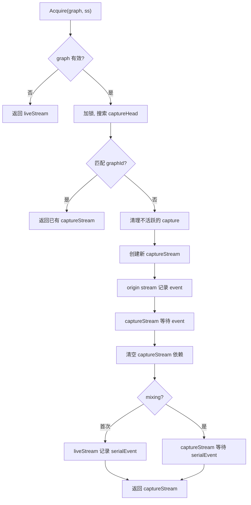

**关键技术细节**：

1. **captureStream 创建**：使用 `cudaStreamCreateWithFlags(&cap->captureStream, cudaStreamNonBlocking)` 创建独立的非阻塞 stream

2. **依赖清空**：`cudaStreamUpdateCaptureDependencies(cap->captureStream, nullptr, 0, cudaStreamSetCaptureDependencies)` 将新 captureStream 的依赖设置为空——依赖关系由 Release 操作显式建立

3. **origin 事件桥接**：通过临时 event 将 origin stream 的当前进度传递给 captureStream，使 captureStream 在 graph 内的执行位置与 origin stream 同步

### 6.5 Graph 内的 Release 流程

**文件**：`src/misc/strongstream.cc` — `ncclStrongStreamRelease`

Release 是整个机制中最复杂的部分，负责在 graph 中建立 EventRecord 节点作为 serialEvent 的写入点：

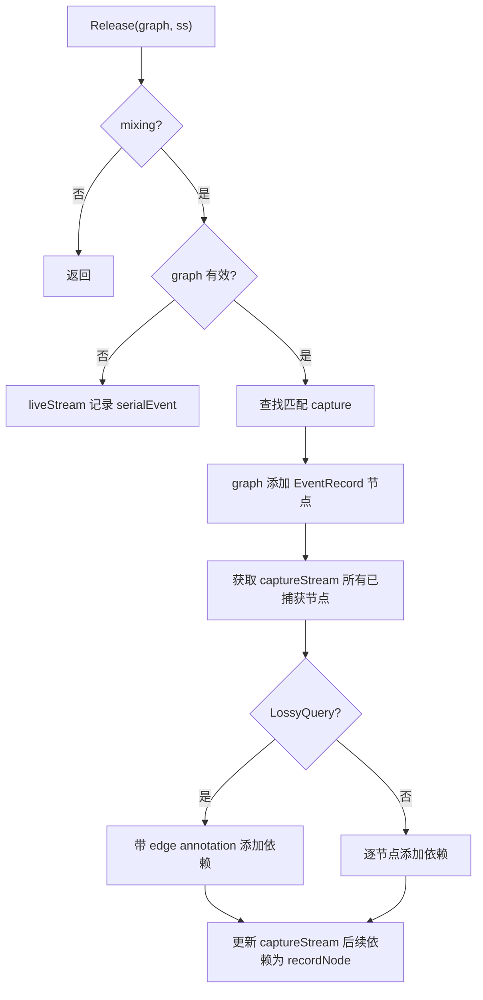

**关键操作解释**：

1. **EventRecord 节点**：`cudaGraphAddEventRecordNode` 在 graph 中创建一个节点，graph 执行时将 serialEvent 标记为已完成

2. **依赖边建立**：captureStream 上所有已捕获的节点必须先于 EventRecord 节点——确保工作完成后才记录 serialEvent

3. **后续依赖更新**：`cudaStreamUpdateCaptureDependencies` 设置 captureStream 后续操作依赖 EventRecord 节点

4. **LossyQuery 处理**（CUDA >= 12.03）：当 graph 节点有边注解时，`cudaStreamGetCaptureInfo_v3` 返回 `cudaErrorLossyQuery`，需要用 `cudaGraphAddDependencies_v2` 保留边信息

### 6.6 Mixing 模式

**场景**：同一 communicator 先非 graph 使用，再 graph 使用，再非 graph 使用。

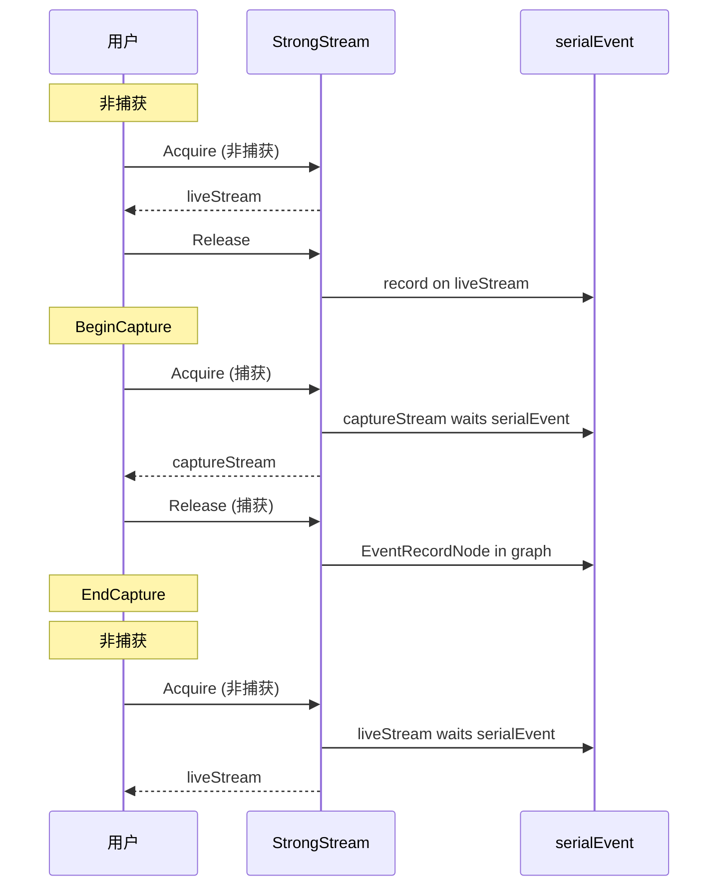

**`everCaptured` 标志**：一旦 Strong Stream 曾被 graph 捕获，后续非捕获 Acquire 都等待 serialEvent，保证正确性，代价是一个 event wait 的开销。

---

## 7. Persistent Work 机制

### 7.1 Work 存储类型

NCCL kernel 的工作描述需要存储在 GPU 可访问的内存中。三种存储策略：

| 类型 | 枚举值 | 适用场景 | 生命周期 |
|------|--------|---------|---------|
| **Args** | `ncclDevWorkStorageTypeArgs` | 小量 work，嵌入 kernel 参数 | 随 kernel 调用 |
| **Fifo** | `ncclDevWorkStorageTypeFifo` | 普通模式，环形缓冲区 | 被覆盖即回收 |
| **Persistent** | `ncclDevWorkStorageTypePersistent` | Graph 模式，独立分配 | 随 graph 销毁 |

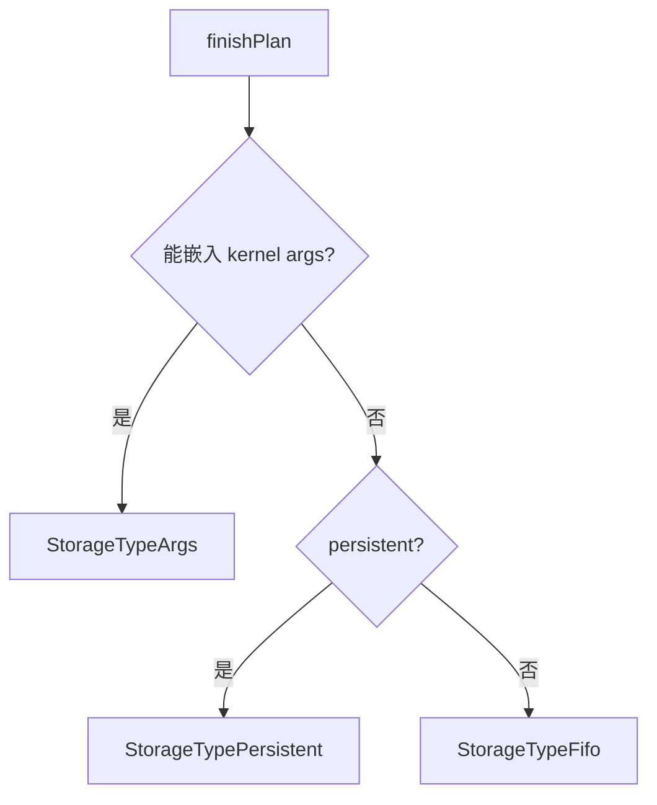

### 7.2 Persistent Work 分配流程

**文件**：`src/enqueue.cc` — `uploadWork`

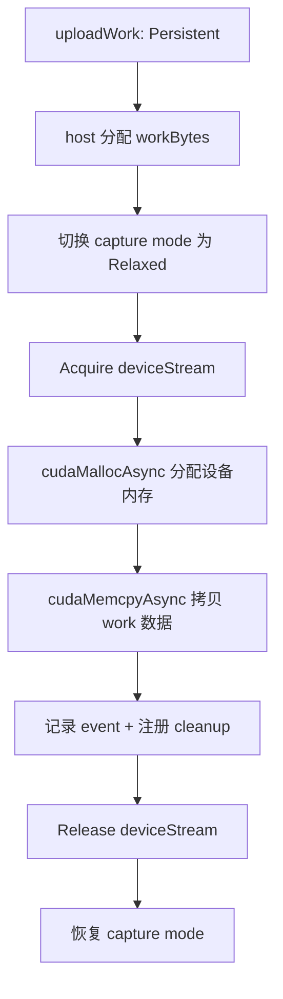

**`cudaThreadExchangeStreamCaptureMode`**：切换为 `cudaStreamCaptureModeRelaxed`，防止 `cudaMallocAsync` 等内部操作被当前 graph 捕获。这至关重要——graph launch 时这些内存应该已经就绪，而不是在 graph 执行时重新分配。

### 7.3 Persistent Work 回收

**文件**：`src/enqueue.cc` — `reclaimPlan` 和 `persistentDestructor`

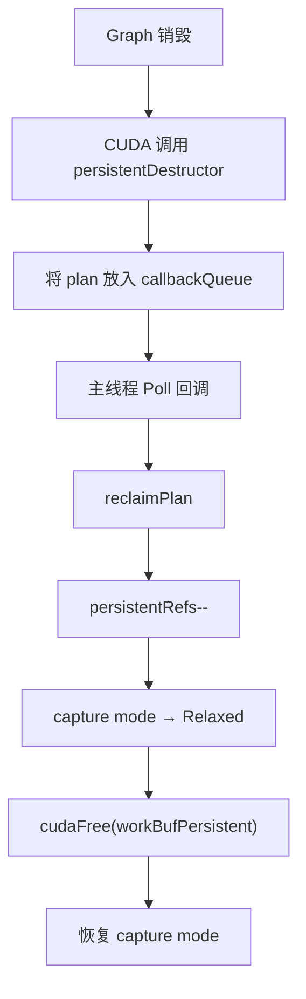

**`ncclCudaGraphAddDestructor`**：通过 CUDA User Object 机制将析构函数关联到 graph：

```cpp
cudaUserObjectCreate(&object, arg, fn, 1, cudaUserObjectNoDestructorSync);
cudaGraphRetainUserObject(graph, object, 1, cudaGraphUserObjectMove);
```

**设计权衡**：资源回收由 CUDA 运行时驱动，不依赖用户显式调用。但回收时机不确定，可能导致内存占用延长。`persistentRefs` 引用计数跟踪当前活跃的 persistent plan 数量。

### 7.4 Buffer 注册与 Graph

在 graph 捕获模式下，NCCL 通过 `ncclParamGraphRegister()` 控制是否自动注册用户 buffer：

```cpp
regBuff = (regSendBuf && regRecvBuf && ...) || (ncclCudaGraphValid(comm->planner.capturingGraph) && ncclParamGraphRegister());
```

**设计初衷**：Graph 捕获时，所有操作的 buffer 地址在 graph 实例化后就固定了。自动注册确保 IPC/NVLS 所需的 buffer 句柄在 graph launch 时就可用。`NCCL_GRAPH_REGISTER` 默认开启。

---

## 8. Proxy 操作在 Graph 中的处理

### 8.1 Host Stream Callback 机制

**核心问题**：NCCL 的 proxy 线程负责推进网络通信（如 InfiniBand 操作）。在普通模式下，proxy 操作在 `ncclGroupEnd` 时立即提交。但在 graph 模式下，graph 捕获期间不能执行 CPU 端的通信初始化。

**解决方案**：通过 `cudaLaunchHostFunc` 在 host stream 上注册回调，graph launch 时由 CUDA 运行时触发回调：

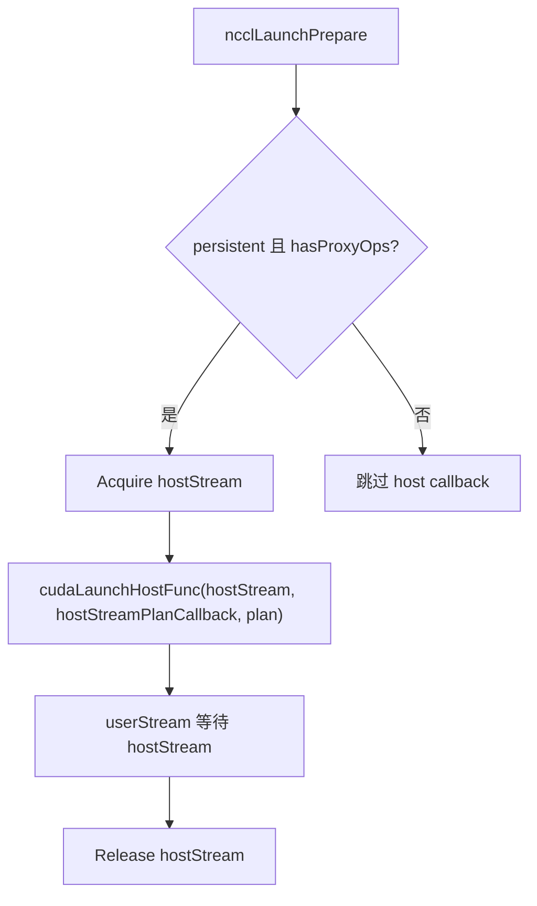

**`hostStreamPlanCallback`**：在 graph launch 时被 CUDA 调用，执行 `hostStreamPlanTask`，包括：
- 提交 proxy 操作到 proxy 线程
- 启动网络传输
- 更新 profiler 状态

**关键约束**：host callback 在 CUDA 的 internal stream 上执行，可能与其他 CUDA 操作并行。NCCL 通过 `userStream 等待 hostStream` 确保回调完成后再执行 kernel。

### 8.2 Work Counter 同步

proxy 操作需要与 kernel 的工作进度保持同步。在 graph 模式下，每次 graph launch 都是相同的工作，因此 proxy 端使用固定计数器：

```cpp
// proxy.cc — SaveProxyProfiler
if (!comm->planner.persistent) incWorkCounter(comm, op);  // 非持久化：每次递增
// 在 graph 捕获时：
if (comm->planner.persistent) incWorkCounter(comm, op);   // 持久化：也递增以保持同步
```

**设计权衡**：每次 graph launch proxy 都递增 counter，确保 proxy 线程能正确跟踪工作进度。

---

## 9. Launch Order 隐式串行化

### 问题

同一设备上的多个 communicator 可能同时 launch kernel。在非 graph 模式下，CUDA stream 的提交顺序隐式保证了串行性。但在 graph 模式下，不同 graph 的 launch 顺序不可预测。

### 解决方案：per-context launchOrder

每个 `ncclCudaContext` 维护一个 `launchOrder` Strong Stream，用于建立跨 communicator 的隐式执行顺序。

**文件**：`src/enqueue.cc` — `ncclLaunchPrepare` 和 `ncclLaunchFinish`

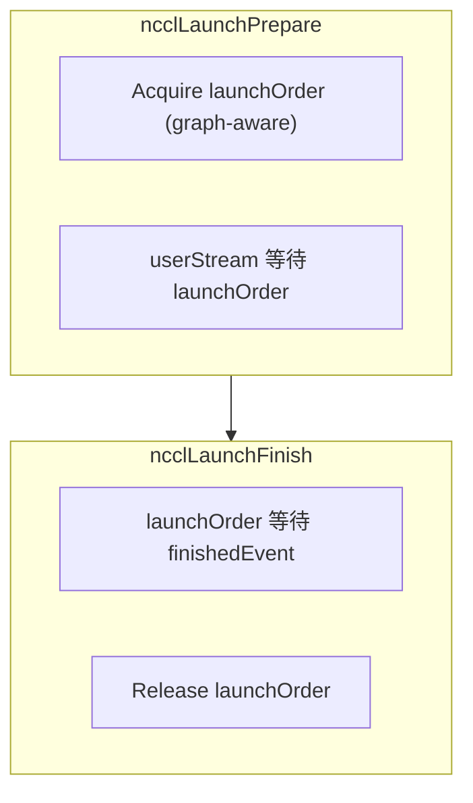

**隐式顺序模式**（由 `NCCL_LAUNCH_ORDER_IMPLICIT` 控制）：

| 模式 | 条件 | 行为 |
|------|------|------|
| `ncclImplicitOrderNone` | 默认 | 无隐式顺序 |
| `ncclImplicitOrderSerial` | Driver < 12.09 | 使用 finishedEvent 串行化 |
| `ncclImplicitOrderLaunch` | Runtime/Driver >= 12.03 | 使用 launch completion event |

**`CU_LAUNCH_ATTRIBUTE_LAUNCH_COMPLETION_EVENT`**（CUDA >= 12.03）：

```cpp
launchAttrs[attrs].id = CU_LAUNCH_ATTRIBUTE_LAUNCH_COMPLETION_EVENT;
launchAttrs[attrs].value.launchCompletionEvent.event = comm->sharedRes->launchEvent;
```

这允许 CUDA 在 kernel 完成启动（而非完成执行）时触发 event，实现更细粒度的并行性。serial 模式使用 finishedEvent（kernel 完成执行），launch 模式使用 launchEvent（kernel 完成提交），后者允许更好的 overlap。

**Graph 内的并发性**：在 graph 捕获模式下，`concurrent = true` 允许 launchOrder 的 Acquire 不持锁，因为 graph 内的顺序由 graph 结构保证。

---

## 10. CE Collective 与 Graph Capture

**文件**：`src/ce_coll.cc`

Copy Engine (CE) Collective 使用硬件 DMA 引擎而非 CUDA kernel 执行通信。在 graph 模式下，CE 操作需要特殊处理：

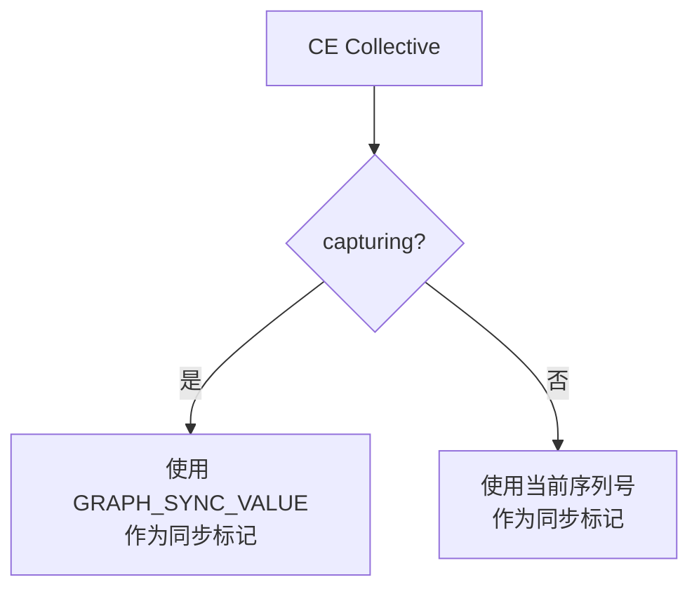

**同步值选择**：

```cpp
void* srcPtr = capturing ? (void*)&GRAPH_SYNC_VALUE : (void*)&currentSeq;
uint32_t waitValue = capturing ? GRAPH_SYNC_VALUE : currentSeq;
```

**设计初衷**：在 graph 模式下，同步值必须在所有 graph launch 中保持一致。使用固定的 `GRAPH_SYNC_VALUE` 确保每次 graph launch 使用相同的同步语义。

**CE 初始化与 Graph**：CE 的初始化（`ncclCeInit`）需要在 graph 之外执行，因此被延迟到 `ncclGroupEnd` 的注册阶段（`ncclCommGroupRegisterSymmetric`）。

---

## 11. Graph Usage Mode 配置

### graphUsageMode 值

| 值 | 含义 | serialEvent 行为 |
|----|------|------------------|
| 0 | 仅 graph 或仅非 graph | 不维护 serialEvent |
| 2 | 支持 mixing | 维护 serialEvent（有开销） |

### 配置方式

1. **环境变量**：`NCCL_GRAPH_MIXING_SUPPORT=0|1`（0 → mode 0, 1 → mode 2）
2. **Comm 配置**：`ncclConfigSet(commConfig, "graphUsageMode", "2")`
3. **默认值**：`2`（支持 mixing）

### 何时使用 mode 0

如果确定一个 communicator **只**在 graph 内或**只**在 graph 外使用，设为 0 可以消除 serialEvent 的开销。这在纯 graph 训练循环中可获得最佳性能。

### 何时使用 mode 2（默认）

如果 communicator 可能在 graph 内和 graph外交替使用（如训练循环用 graph，但初始化/保存检查点不用 graph），必须使用 mode 2 以保证正确性。

---

## 12. Kernel Launch 与 Graph

### cuLaunchKernelEx 与 Graph

NCCL 使用 `cuLaunchKernelEx` 启动 kernel，支持多种 launch attribute：

```cpp
CUlaunchConfig launchConfig = {};
// Thread Block Cluster (sm90+)
if (clusterSize) {
    launchAttrs[attrs].id = CU_LAUNCH_ATTRIBUTE_CLUSTER_DIMENSION;
    launchAttrs[attrs++].value.clusterDim = {clusterSize, 1, 1};
}
// Memory Sync Domain (sm90+)
launchAttrs[attrs].id = CU_LAUNCH_ATTRIBUTE_MEM_SYNC_DOMAIN;
launchAttrs[attrs++].value.memSyncDomain = ncclParamMemSyncDomain();
// Launch Completion Event (sm90+, CUDA 12.03+)
if (implicitOrder == ncclImplicitOrderLaunch) {
    launchAttrs[attrs].id = CU_LAUNCH_ATTRIBUTE_LAUNCH_COMPLETION_EVENT;
    launchAttrs[attrs++].value.launchCompletionEvent.event = launchEvent;
}
// Programmatic Stream Serialization (symmetric kernels)
if (plan->isSymColl && compCap >= 90) {
    launchAttrs[attrs].id = CU_LAUNCH_ATTRIBUTE_PROGRAMMATIC_STREAM_SERIALIZATION;
    launchAttrs[attrs++].value.programmaticStreamSerializationAllowed = 1;
}
```

**Graph 模式下的行为**：当 stream 处于捕获状态时，`cuLaunchKernelEx` 的效果是将 kernel 作为一个节点添加到 graph 中，而非立即执行。CUDA 运行时自动处理这一转换。

### Work FIFO 与 Graph

普通模式下，NCCL 使用 work FIFO 传递工作描述：

```
comm->workFifoBuf (环形缓冲区，GPU 可见)
    ↓
kernel 通过 workMask 定位工作项
    ↓
workFifoProduced 追踪写入位置
workFifoConsumed 追踪读取位置
```

Graph 模式下，如果 work 能嵌入 kernel args（`ncclDevWorkStorageTypeArgs`），则无需使用 FIFO。如果需要 persistent storage，则独立分配，不依赖环形缓冲区。

---

## 13. 完整流程图

### 从用户调用到 Graph 节点

```mermaid
flowchart TD
    A["用户: ncclAllReduce(comm, send, recv, count, type, op, stream)"] --> B["ncclEnqueueCheck"]
    B --> C["ncclGroupStartInternal"]
    C --> D["taskAppend"]
    D --> E["ncclPlannerSetCapturingGraph<br/>检测 stream 捕获状态"]
    E --> F["ncclGroupEndInternal"]
    F --> G["ncclPrepareTasks<br/>persistent = graph 有效?"]
    G --> H["ncclTasksRegAndEnqueue"]
    H --> I["doLaunches"]
    I --> J["ncclLaunchPrepare"]

    J --> K["Acquire deviceStream<br/>(graph-aware)"]
    K --> L["建立 stream 间依赖"]
    L --> M{"implicitOrder?"}
    M -->|非 None| N["Acquire launchOrder<br/>(graph-aware, concurrent)"]
    M -->|None| O["跳过"]
    N --> P{"persistent 且 hasProxyOps?"}
    O --> P
    P -->|是| Q["Acquire hostStream<br/>cudaLaunchHostFunc"]
    P -->|否| R["跳过"]
    Q --> S{"persistent?"}
    R --> S
    S -->|是| T["persistentRefs += nPlans"]
    T --> U["ncclCudaGraphAddDestructor"]

    U --> V["ncclLaunchKernel"]
    V --> W["uploadWork<br/>Persistent: cudaMallocAsync + cudaMemcpyAsync"]
    W --> X["cuLaunchKernelEx<br/>kernel 被捕获为 graph 节点"]

    X --> Y["ncclLaunchFinish"]
    Y --> Z["ncclStreamAdvanceToEvent<br/>deviceStream 快进到 launch 完成"]
    Z --> AA["Release launchOrder"]
    AA --> AB["Release deviceStream"]
```

### Graph 生命周期中的资源管理

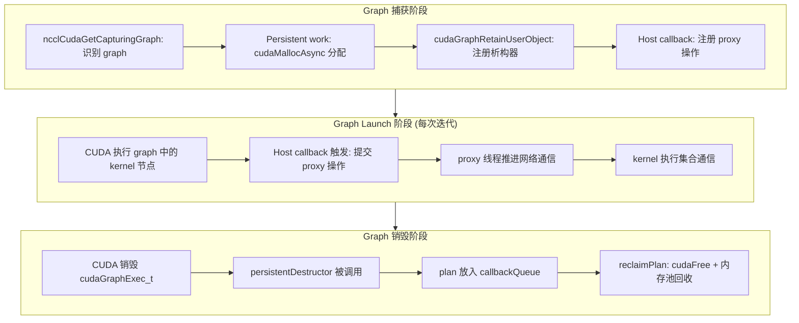

---

## 14. 性能分析与设计权衡评论

### 14.1 Graph 模式的性能收益

| 开销来源 | 非 Graph | Graph | 节省 |
|----------|---------|-------|------|
| Kernel launch latency | ~10-50μs/次 | ~1μs/次(graph launch) | ~90% |
| Host 端任务规划 | 每次 group | 捕获时一次 + launch 时轻量 callback | 显著 |
| Driver API 调用 | 每次 | 仅 graph launch 时 | 显著 |
| 参数传递 | 每次 | graph 内固定 | 显著 |

**典型收益**：在小消息 AllReduce（如 4MB）场景下，graph 模式可将端到端延迟降低 30-50%，主要来自消除 host 端开销。

### 14.2 Graph 模式的额外开销

| 开销 | 原因 | 量化 |
|------|------|------|
| serialEvent 等待 | mixing 模式下的 event wait/record | ~5-10μs/graph launch |
| Persistent 内存占用 | work 数据在 graph 生命周期内常驻 | 与 work 大小成正比 |
| Host callback 开销 | `cudaLaunchHostFunc` 比 直接调用慢 | ~10-20μs/callback |
| captureStream 管理 | 每个 graph 一个 captureStream 的创建/维护 | 可忽略（一次性） |
| `cudaThreadExchangeStreamCaptureMode` | Persistent 分配/释放时切换模式 | ~1μs/次 |

### 14.3 设计权衡评论

**1. Strong Stream 抽象的优雅性**

Strong Stream 是一个精巧的设计。它将 graph 内和非 graph 的流管理统一到同一个 Acquire/Release 接口下，调用者不需要知道当前是否在 graph 中。这种「透明性」极大地简化了 `enqueue.cc` 中的 launch 逻辑——同一份代码自动适配两种模式。

然而，这种优雅有代价：
- mixing 模式下的 serialEvent 开销是不可避免的，即使用户只使用 graph 模式（因为默认 mode=2）
- captureStream 链表管理增加了内存开销和查找时间
- Release 中的 graph 节点依赖管理极其复杂，尤其是处理 LossyQuery 的分支

**建议**：如果确定只用 graph 模式，设置 `graphUsageMode=0` 可获得最佳性能。

**2. Persistent Work 的设计选择**

NCCL 选择为 graph 模式独立分配 work 缓冲区（而非复用 FIFO），这是一个务实的设计：
- **优点**：work 数据在 graph 生命周期内稳定，不受 FIFO 回转影响
- **优点**：无需复杂的 FIFO 位置管理（graph launch 时 workFifoProduced 无法自然推进）
- **缺点**：每次 graph 捕获都分配新的设备内存，可能导致内存碎片
- **缺点**：`cudaMallocAsync` 需要切换 capture mode，增加了复杂性

**3. Proxy Host Callback 的权衡**

通过 `cudaLaunchHostFunc` 延迟执行 proxy 操作是唯一可行的方案（graph 捕获期间 CPU 无法干预），但带来两个问题：
- **延迟**：host callback 的调度延迟约 10-20μs，在小消息场景下可能抵消 graph 的收益
- **不确定性**：host callback 的执行时机由 CUDA 运行时决定，可能影响 proxy 操作的及时性

**4. 版本兼容性处理的工程价值**

NCCL 对 CUDA 版本的处理非常细致：
- `CUDART_VERSION >= 11030` 条件编译保护所有 graph 功能
- driver 版本运行时检查
- `_v2`/`_v3` API 的自动映射（CUDA 13.0+）
- LossyQuery 的优雅降级处理

这确保了 NCCL 在广泛的 CUDA 版本上正确运行，但代价是代码中充满了 `#if` 条件编译，可读性有所下降。

**5. 与 PyTorch 的协同**

PyTorch 的 `torch.cuda.make_graphed_callables` 和 CUDA Graph AMP 都依赖 NCCL 的 graph 支持。NCCL 的透明设计（用户无需修改 API 调用）使得 PyTorch 集成几乎零成本。但以下限制需要注意：
- 同一 group 内不能混合 graph 和非 graph
- 所有 communicator 必须同时处于 graph 或非 graph
- Buffer 地址在 graph 实例化后不能改变（除非使用 graph node update）

### 14.4 总体评价

NCCL 的 CUDA Graph Capture 实现是一个**工程复杂度极高**的子系统。核心设计（Strong Stream、Persistent Work、Host Callback）都是经过深思熟虑的方案，正确地解决了 graph 模式下的流身份、资源生命周期和 proxy 同步三大难题。

代码质量整体优秀，尤其是版本兼容性处理和边界情况处理非常细致。主要改进空间在于：
1. `strongstream.cc` 的 Release 函数过长（约 80 行），可拆分为更小的辅助函数
2. 条件编译虽然必要，但可以通过更好的抽象减少代码重复
3. mixing 模式的性能开销可以通过更精细的 event 管理进一步优化

在性能方面，graph 模式对小消息通信的收益是确定且显著的。对于大消息（带宽受限场景），graph 的收益相对较小，因为 kernel launch 开销占比本来就低。因此，graph 模式最适合高频小消息的分布式训练场景（如梯度 AllReduce）。

---

## 15. NCCL Stream 体系与 GPU-CPU 协作机制

> 本章系统梳理 NCCL 中所有 CUDA stream 的角色、stream 间的依赖关系、GPU kernel 与 CPU 线程的交互机制、以及完整的 GPU-CPU 协作原理。

### 15.1 NCCL 中的 Stream 全景

NCCL 管理着多个层次的 CUDA stream，每个承担不同职责：

| Stream | 类型 | 所有者 | 职责 |
|--------|------|--------|------|
| **User Stream** | 普通 `cudaStream_t` | 用户代码 | 用户提交 NCCL 操作的 stream |
| **deviceStream** | `ncclStrongStream` | `comm->sharedRes` | GPU 端内部资源管理（内存分配、channel 初始化等） |
| **hostStream** | `ncclStrongStream` | `comm->sharedRes` | Host callback 执行（proxy 操作提交） |
| **launchOrder** | `ncclStrongStream` | `comm->context` | 跨 communicator 的隐式执行顺序 |
| **captureStream** | 普通 `cudaStream_t`（per-graph） | `ncclStrongStreamCapture` | Graph 内代表 Strong Stream |
| **Proxy Progress Thread** | CPU 线程（非 CUDA stream） | `proxyState->progressState` | 推进网络通信 |

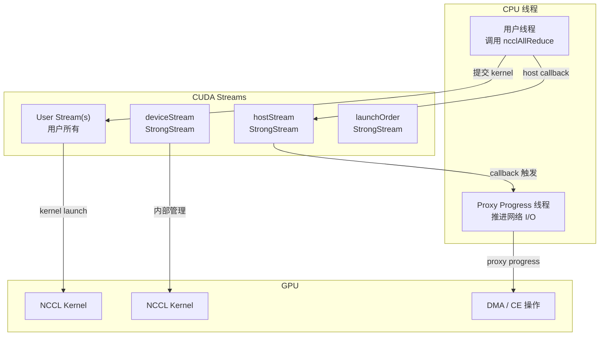

### 15.2 一次完整集合通信的 Stream 协作流程

以一次 `ncclAllReduce` 为例，展示所有 stream 和 CPU 线程的交互：

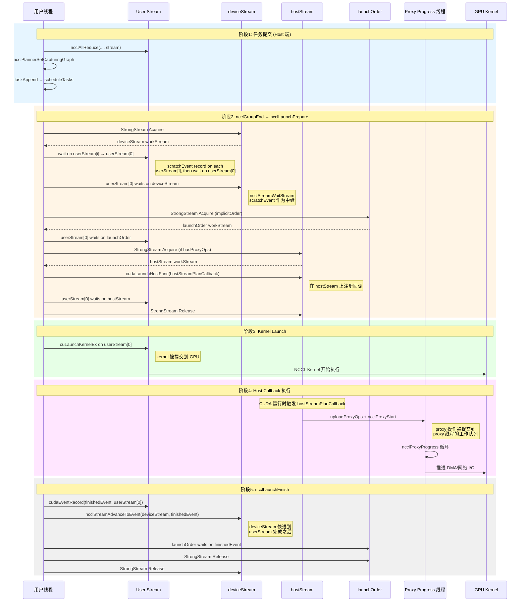

### 15.3 Stream 间的 Event 同步机制

NCCL 使用 CUDA Event 在 stream 之间建立依赖关系。核心同步原语：

#### 15.3.1 `ncclStreamWaitStream(a, b, scratchEvent)`

**用途**：让 stream `a` 等待 stream `b` 上的所有操作完成。

```
stream b:  [操作1] [操作2] [操作3] [EventRecord(scratch)]
                                              ↓
stream a:                              [WaitEvent(scratch)] [后续操作]
```

**实现**：
```cpp
ncclResult_t ncclStreamWaitStream(cudaStream_t a, cudaStream_t b, cudaEvent_t scratchEvent) {
    CUDACHECK(cudaEventRecord(scratchEvent, b));     // 在 b 上记录 event
    CUDACHECK(cudaStreamWaitEvent(a, scratchEvent, 0)); // a 等待 event
    return ncclSuccess;
}
```

**为什么需要 scratchEvent**：`cudaStreamWaitEvent` 要求 event 已被 record。scratchEvent 是一个预分配的可重用 event（`cudaEventDisableTiming`，无计时开销），避免每次创建新 event。

#### 15.3.2 `ncclStreamAdvanceToEvent(graph, stream, event)`

**用途**：让 stream 跳转到某个 event 之后，在非 graph 模式下等价于 `cudaStreamWaitEvent`，在 graph 模式下使用依赖注入避免图膨胀。

**Graph 模式下的特殊处理**：

普通方式 `cudaStreamWaitEvent(deviceStream, event)` 会在 graph 中创建一条依赖边。但 deviceStream 的 captureStream 已经通过 Acquire 引入了 graph，直接添加 WaitEvent 会导致图中出现冗余边。

`ncclStreamAdvanceToEvent` 的 graph 路径：
1. 创建临时 stream，让它等待 event
2. 获取临时 stream 的已捕获节点
3. 使用 `cudaStreamUpdateCaptureDependencies` 将这些节点设为 deviceStream 的依赖
4. 销毁临时 stream

**设计初衷**：避免在 graph 中引入 "fast-forward" 边（从 graph 的早期节点直接跳到后期节点），这种边会导致 CUDA 在图优化时产生大量中间状态，增加图实例化的时间和内存。

#### 15.3.3 `scratchEvent` 的生命周期

`comm->sharedRes->scratchEvent` 是最频繁使用的同步 event。但在某些场景下它会被"偷走"——例如 `ncclLaunchFinish` 中的 `KernelFinishCallback` 将 scratchEvent 关联到 event callback 后，需要创建新的 scratchEvent：

```cpp
ncclIntruQueueEnqueue(&comm->eventCallbackQueue, &cb->base);
// 刚偷走了 scratchEvent，必须创建新的
CUDACHECK(cudaEventCreateWithFlags(&comm->sharedRes->scratchEvent, cudaEventDisableTiming));
```

### 15.4 CUDA Event 与 Stream 的硬件原理

#### GPU 硬件层面

CUDA Event 在硬件上对应 GPU 的 **stream 优先级队列**中的某个标记点。当 stream 上的操作完成到 event record 位置时，GPU 通过 **doorbell** 机制通知 CPU 端。

```
GPU Stream Queue:
  [Kernel A] → [Kernel B] → [Event Record] → [Kernel C]
                                    ↓
                              GPU doorbell → CPU
                                    ↓
                              cudaEventQuery returns success
```

**`cudaEventDisableTiming`**：NCCL 创建的所有 event 都使用此标志。它告诉 GPU 不需要记录时间戳，消除了性能计数器的开销（约 1-2μs/event）。

**`cudaEventWaitExternal`**：在 mixing 模式下，captureStream 等待 serialEvent 时使用此标志。它允许等待来自不同 CUDA context 或甚至不同进程的 event——这是 NVLink 跨 GPU 同步的基础。

#### CPU 端的轮询与阻塞

NCCL 中有两种等待模式：

| 模式 | API | 适用场景 | CPU 开销 |
|------|-----|---------|----------|
| **轮询** | `cudaEventQuery` | `ncclCommPollEventCallbacks(waitSome=false)` | 低（非阻塞），需要重复调用 |
| **阻塞** | `cudaEventSynchronize` | `ncclCommPollEventCallbacks(waitSome=true)` | CPU 线程睡眠，零 CPU 占用 |

### 15.5 Host Callback 机制详解

#### 15.5.1 `cudaLaunchHostFunc` 原理

`cudaLaunchHostFunc(stream, fn, arg)` 在 stream 中插入一个 "host function" 节点。当 stream 上的前序操作完成后，CUDA 运行时在 CPU 端调用 `fn(arg)`。

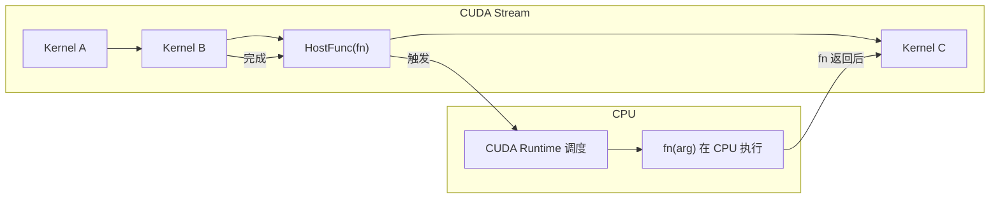

**关键约束**：
- `fn` 必须是非阻塞的（或至少快速返回），否则会阻塞整个 CUDA stream
- `fn` 中不能调用任何 CUDA API（会导致死锁）
- `fn` 的执行线程是 CUDA 内部的，不是用户线程

#### 15.5.2 NCCL 的 Host Callback 使用

NCCL 通过 hostStream（StrongStream）上的 `cudaLaunchHostFunc` 实现延迟 proxy 操作提交：

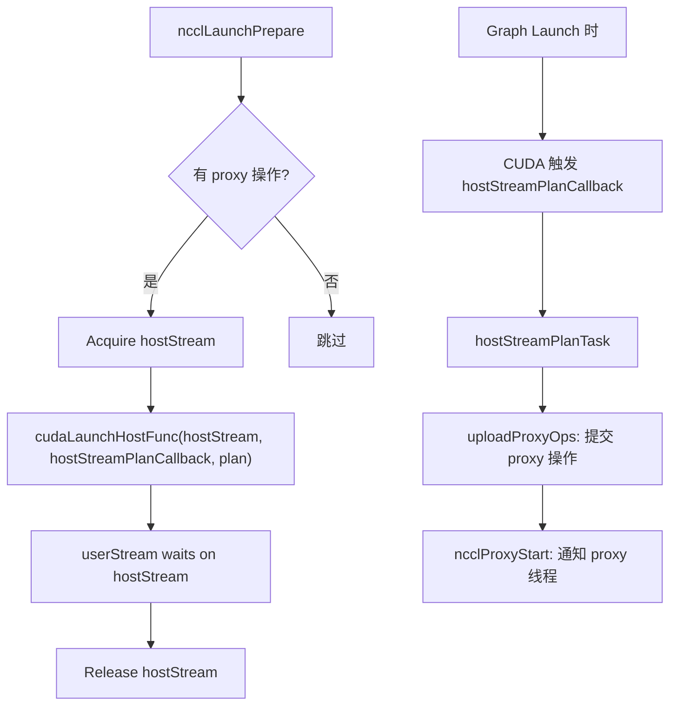

**何时需要 Host Callback**：

```cpp
if (persistent || ncclCudaLaunchBlocking || status == cudaErrorNotReady) {
    // 需要 host callback
    // persistent: graph 模式，proxy 操作不能在捕获时直接提交
    // ncclCudaLaunchBlocking: 调试模式
    // status == cudaErrorNotReady: 之前的 host 操作还未完成
}
```

**非 callback 路径**：如果不需要 host callback（非 graph 且无 pending host 操作），`hostStreamPlanTask` 在 kernel launch 后直接调用。

### 15.6 Proxy 线程：CPU 端的通信引擎

#### 15.6.1 Proxy 线程的架构

每个 GPU 设备有一个 Proxy Progress 线程，负责推进所有网络 I/O 操作：

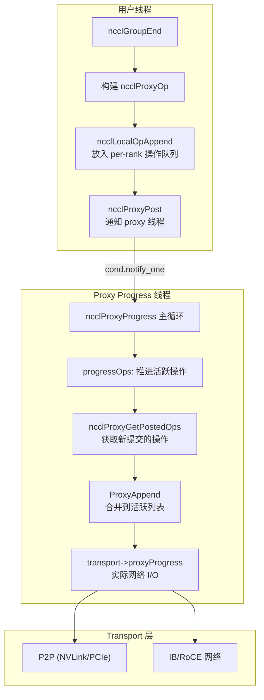

#### 15.6.2 Proxy 操作的生命周期

```mermaid
flowchart TD
    A["scheduleCollTasksToPlan<br/>规划阶段：确定算法和通道"] --> B["SaveProxy<br/>生成 ncclProxyOp"]
    B --> C{"非 persistent?"}
    C -->|是| D["直接 incWorkCounter"]
    C -->|否| E["稍后 incWorkCounter"]
    D --> F["ncclLocalOpAppend<br/>放入 per-rank 队列"]
    E --> F
    F --> G["队列满(>MAX_OPS_PER_PEER)?"]
    G -->|是| H["ncclProxyPost<br/>立即通知 proxy 线程"]
    G -->|否| I["等待更多操作批量提交"]
    H --> J["Proxy Progress 线程被唤醒"]
    I --> J

    J --> K["ncclProxyGetPostedOps<br/>从 pool 获取已提交操作"]
    K --> L["ProxyAppend<br/>合并到活跃操作列表"]
    L --> M["progressOps 循环"]
    M --> N["transport->proxyProgress<br/>实际发送/接收"]
    N --> O["完成后回收 op 到 freeList"]
```

#### 15.6.3 Work Counter：GPU-Kernel 与 CPU-Proxy 的同步

NCCL 的 kernel 和 proxy 之间通过 **workCounter** 同步进度。这是一个 `uint32_t` 值，存储在 `comm->profiler.workCounter[channelId]`：

- **Kernel 端**：在 `ncclKernelMain` 的主循环中，每处理一个 work batch，device 代码检查 `workCounter` 是否匹配预期值
- **Proxy 端**：`incWorkCounter` 在 proxy 操作提交时递增 counter

在 Graph 模式下，由于 kernel 是被重复执行的，proxy 必须在 **每次 graph launch 时都递增 workCounter**，否则 kernel 会在第二次 launch 时等待一个已经过期的 counter 值，导致死锁。

```cpp
// proxy.cc — 非持久化路径
if (!comm->planner.persistent) incWorkCounter(comm, op);
// 持久化路径（graph 模式）
if (comm->planner.persistent) incWorkCounter(comm, op);
```

### 15.7 Work FIFO：Host 与 Device 的数据传递通道

#### 15.7.1 FIFO 结构

Work FIFO 是 NCCL 中 Host 端向 GPU kernel 传递工作描述的核心机制：

```
comm->workFifoBuf (Host 可写的 GPU 内存)
┌─────────────────────────────────────────────────┐
│ [Batch 0] [Batch 1] ... [Batch N] [空余空间...]  │
└─────────────────────────────────────────────────┘
 ↑ workFifoProduced (Host 写入位置)
                    ↑ workFifoConsumed (通过 event callback 更新)
```

**关键属性**：
- 大小为 2 的幂（`workFifoBytes`），支持高效的掩码寻址
- Host 端写入（`workFifoProduced`），Device 端读取
- Device 端的消费进度通过 event callback 反馈给 Host

#### 15.7.2 FIFO 背压机制

Host 端写入 FIFO 时需要检查是否有足够空间：

```mermaid
flowchart TD
    A["waitWorkFifoAvailable(comm, desired)"] --> B{"空间足够?<br/>(produced - consumed <= size)"}
    B -->|是| C["返回"]
    B -->|否| D["ncclCommPollEventCallbacks(waitSome=true)"  ]
    D --> E["阻塞等待 event 完成<br/>更新 workFifoConsumed"]
    E --> F["检查 abort 标志"]
    F --> G{"空间足够?"}
    G -->|是| C
    G -->|否| H["yield → 重试"]
    H --> D
```

**`ncclCommPollEventCallbacks`**：轮询 event callback 队列，等待 event 完成后执行回调函数（如更新 `workFifoConsumed`）。

#### 15.7.3 FIFO 与 Persistent 的对比

| 特性 | FIFO 模式 | Persistent 模式 |
|------|----------|----------------|
| 数据位置 | 环形缓冲区（固定大小） | 独立 `cudaMallocAsync` 分配 |
| 生命周期 | 被覆盖即回收 | Graph 销毁时回收 |
| 背压 | 需要 `waitWorkFifoAvailable` | 无限制（每次捕获新分配） |
| 寻址 | `workMask = workFifoBytes-1` | `workMask = ~0u` |
| 适用 | 非 graph | Graph 捕获 |

### 15.8 Callback 队列：异步操作的完成通知

NCCL 有两个 callback 队列，分别处理不同类型的异步完成通知：

#### 15.8.1 `eventCallbackQueue` — Event 驱动的回调

```cpp
struct ncclCommEventCallback {
    ncclCommEventCallback* next;
    cudaEvent_t event;   // 触发条件
    ncclResult_t(*fn)(ncclComm* comm, ncclCommEventCallback* cb);
};
```

**使用场景**：
1. **FIFO 空间回收**：kernel 完成一定量的 work 后，通过 event 通知 host 可以回收 FIFO 空间
2. **Persistent 内存释放**：`cudaMemcpyAsync` 完成后释放 host 端的临时 buffer

**处理流程**：

```mermaid
flowchart TD
    A["ncclCommPollEventCallbacks"] --> B["切换 capture mode 为 Relaxed"]
    B --> C["遍历 eventCallbackQueue"]
    C --> D{"有 callback?"}
    D -->|否| E["恢复 capture mode → 返回"]
    D -->|是| F{"waitSome?"}
    F -->|是| G["cudaEventSynchronize<br/>阻塞等待 event"]
    F -->|否| H["cudaEventQuery<br/>非阻塞检查"]
    G --> I{"event 完成?"}
    H --> I
    I -->|是| J["执行 callback->fn"]
    I -->|否 (NotReady)| K["停止遍历"]
    J --> C
    K --> E
```

**为什么需要 `cudaThreadExchangeStreamCaptureMode`**：因为 callback 可能调用 `cudaEventDestroy`、`cudaFree` 等 CUDA API，这些操作不能在 stream 捕获模式下执行。切换为 Relaxed 模式后，这些内部操作不会被用户的 graph 捕获。

#### 15.8.2 `callbackQueue` — MPSC 无锁回调队列

```cpp
struct ncclCommCallback {
    ncclCommCallback* next;
    ncclResult_t(*fn)(ncclComm* comm, ncclCommCallback* cb);
};
```

**使用场景**：
1. **Plan 回收**：`reclaimPlan` 回收已完成的 kernel plan（包括 persistent 的 `cudaFree`）
2. **Graph 销毁通知**：`persistentDestructor` 将 plan 放入此队列

**MPSC（Multi-Producer Single-Consumer）**：多个线程可以安全地入队（host callback 线程、graph 析构线程），但只有一个线程（用户线程）出队处理。

**处理时机**：在 `ncclGroupEnd` 的清理阶段调用 `ncclCommPollCallbacks`，以及 heartbeat 中的定期清理。

### 15.9 多 Stream 聚合与依赖构建

#### 15.9.1 多 User Stream 场景

NCCL 支持在同一个 group 中使用多个 user stream（通过多次 `ncclAllReduce` 调用传入不同 stream）：

```mermaid
graph TD
    subgraph UserStreams["User Streams"]
        US0["userStream[0]"]
        US1["userStream[1]"]
        US2["userStream[2]"]
    end

    subgraph Internal["内部 Streams"]
        DS["deviceStream"]
        HS["hostStream"]
        LO["launchOrder"]
    end

    US1 -->|"event record + wait"| US0
    US2 -->|"event record + wait"| US0
    DS -->|"streamWaitStream"| US0
    LO -->|"streamWaitStream"| US0
    HS -->|"streamWaitStream"| US0
    US0 -->|"cuLaunchKernelEx"| K["NCCL Kernel"]
```

**依赖构建逻辑**（`ncclLaunchPrepare`）：

1. `userStream[0]` 等待所有其他 `userStream[i]`（通过 scratchEvent）
2. `userStream[0]` 等待 `deviceStream`（确保之前的内部管理操作完成）
3. `userStream[0]` 等待 `launchOrder`（如果启用隐式顺序）
4. `userStream[0]` 等待 `hostStream`（确保 host callback 完成后再 launch kernel）
5. Kernel 在 `userStream[0]` 上启动

**完成后的反向依赖**（`ncclLaunchFinish`）：

1. `deviceStream` 快进到 `userStream[0]` 完成之后
2. 所有 `userStream[i]` 等待 `userStream[0]` 完成
3. `launchOrder` 等待 kernel 完成（或 launch 完成，取决于 implicitOrder 模式）

### 15.10 `cudaLaunchHostFunc` 的 CUDA 内部机制

#### 15.10.1 执行模型

CUDA 运行时为每个 host function 创建一个内部工作项，插入到 stream 的命令队列中：

```
Stream 命令队列:
  [Kernel A] → [Kernel B] → [HostFunc(fn, arg)] → [Kernel C]
                                ↓
                          当 Kernel B 完成后:
                          CUDA Runtime 从内部线程池取一个线程
                          在该线程上调用 fn(arg)
                          fn 返回后，Kernel C 可以开始执行
```

**线程安全**：CUDA 保证同一 stream 上的 host function 按顺序执行。但不同 stream 上的 host function 可能并行执行。

#### 15.10.2 在 Graph 中的行为

当 stream 处于捕获状态时，`cudaLaunchHostFunc` 的效果是将 host function 节点添加到 graph：

```
cudaGraph_t:
  [KernelNode A] → [HostNode(fn)] → [KernelNode B]
```

Graph launch 时，CUDA 运行时在 **graph launch 的 stream** 上执行 host node——即 host function 在 graph launch 的上下文中被调用，而非在原始捕获的 stream 上。

### 15.11 `cudaStreamNonBlocking` 标志的意义

NCCL 创建的所有内部 stream（liveStream、captureStream 等）都使用 `cudaStreamNonBlocking`：

```cpp
cudaStreamCreateWithFlags(&stream, cudaStreamNonBlocking);
```

**默认行为 vs NonBlocking**：

| 特性 | 默认 Stream | NonBlocking Stream |
|------|------------|-------------------|
| 与 legacy stream (0) 的关系 | 自动同步 | 完全独立 |
| 与其他默认 stream | 隐式同步 | 不同步 |
| 适用场景 | — | 库内部使用 |

**为什么 NCCL 需要 NonBlocking**：NCCL 需要精确控制 stream 间的依赖关系。如果内部 stream 与用户的 legacy default stream 隐式同步，会导致无法预测的性能回退和潜在的死锁。

### 15.12 GPU-CPU 协作的完整时序

以下展示一次完整的集合通信中 GPU 和 CPU 的协作时序：

```mermaid
sequenceDiagram
    participant CPU as CPU 用户线程
    participant HS as hostStream
    participant US as User Stream
    participant GPU as GPU Kernel
    participant PX as Proxy 线程
    participant HW as 硬件(NVLink/IB)

    Note over CPU: 1. 任务规划
    CPU->>CPU: ncclGroupStart
    CPU->>CPU: taskAppend (规划算法/通道)
    CPU->>CPU: ncclGroupEnd → groupLaunch

    Note over CPU: 2. 准备阶段
    CPU->>US: Acquire deviceStream
    CPU->>US: 建立 stream 依赖
    CPU->>HS: Acquire hostStream
    CPU->>HS: cudaLaunchHostFunc(callback)
    CPU->>US: userStream waits on hostStream

    Note over CPU,GPU: 3. Kernel 启动
    CPU->>US: cuLaunchKernelEx
    US->>GPU: Kernel 开始执行

    Note over HW: 4. Proxy 推进 (与 Kernel 并行)
    HS->>PX: callback 触发: uploadProxyOps
    PX->>PX: ncclProxyGetPostedOps
    PX->>HW: 发送/接收数据
    HW-->>PX: 完成通知

    Note over GPU: 5. Kernel 执行通信
    GPU->>HW: NVLink P2P 读写
    GPU->>GPU: 归约计算
    GPU->>GPU: 完成写入

    Note over CPU: 6. 清理
    CPU->>US: cudaEventRecord(finished)
    CPU->>US: Release deviceStream
    CPU->>US: Release launchOrder
    CPU->>CPU: ncclCommPollCallbacks (回收 plan)
```

### 15.13 关键性能考虑

#### 15.13.1 Stream 依赖的最小化

NCCL 精心控制 stream 间的依赖数量，因为每条依赖都可能在 GPU 上引入一个等待点：

- **只在必要时引入 hostStream**：通过 `persistentRefs` 和 `cudaEventQuery` 检查是否真的需要 host callback
- **launchOrder 只在配置启用时使用**：`NCCL_LAUNCH_ORDER_IMPLICIT=0`（默认）时跳过
- **`ncclStreamAdvanceToEvent` 优化 graph 内的依赖**：避免引入 "fast-forward" 边

#### 15.13.2 Proxy 线程的调度效率

- **批量提交**：`MAX_OPS_PER_PEER` 限制每个 rank 累积的操作数，达到限制时批量提交
- **条件变量通知**：`ncclProxyPost` 使用 `cond.notify_one()` 唤醒 proxy 线程，避免忙等
- **空闲时让步**：`std::this_thread::yield()` 让 proxy 线程在没有工作时让出 CPU
- **自适应轮询频率**：`proxyOpAppendCounter` 控制检查新操作的频率，减少小消息场景的开销

#### 15.13.3 Event 的开销优化

- **禁用计时**：所有 event 使用 `cudaEventDisableTiming`
- **scratchEvent 复用**：避免每次同步都创建新 event
- **批量 FIFO 回收**：只有当 `workFifoProduced - workFifoProducedLastRecorded > workFifoBytes/8` 时才注册回收 callback

### 15.14 小结

NCCL 的 stream 和 GPU-CPU 协作体系是一个精心设计的三层架构：

1. **Stream 层**：User Stream、deviceStream、hostStream、launchOrder 四个 StrongStream 通过 event 同步，精确控制执行顺序
2. **数据传递层**：Work FIFO（普通模式）或 Persistent Buffer（graph 模式）在 Host 和 Device 之间传递工作描述
3. **异步协作层**：Host Callback、Proxy Progress 线程、MPSC Callback Queue 三个机制确保 CPU 和 GPU 的正确协作

这三层共同实现了：Host 端规划任务 → 提交到 GPU → Proxy 并行推进网络 I/O → GPU 执行通信 → 异步回收资源的完整闭环。每一层都针对 graph 模式和普通模式做了适配，确保用户无需关心底层细节即可获得最佳性能。

---

## 16. 补充：Device 端 Work 加载与 Kernel 参数传递

### 16.1 `ncclDevKernelArgs` — Kernel 与 Host 的参数契约

NCCL kernel 通过一个固定的参数块接收 Host 端传递的所有信息：

```cpp
struct alignas(16) ncclDevKernelArgs {
    struct ncclKernelComm* comm;       // 设备端通信器指针
    uint64_t channelMask;               // 本 kernel 涉及的 channel 位掩码
    enum ncclDevWorkStorageType workStorageType;  // FIFO / Args / Persistent
    uint32_t workMask;                  // FIFO 掩码（FIFO模式下为 size-1，其余为 ~0u）
    void* workBuf;                      // Work 数据的设备端基地址
    // 紧随其后的是 ncclDevWorkBatch 数组（变长）
};
```

**参数传递机制**：

```mermaid
flowchart TD
    subgraph Host["Host 端"]
        A["ncclMemoryStackAlloc<br/>分配 kernelArgsSize 字节"] --> B["填充 ncclDevKernelArgs"]
        B --> C["追加 ncclDevWorkBatch 数组"]
        C --> D["追加 work 数据<br/>(仅 Args 模式)"]
        D --> E["cuLaunchKernelEx<br/>传入参数指针"]
    end

    subgraph Device["Device 端"]
        F["__grid_constant__ 存储<br/>4KB 常量缓存"] --> G["ncclKernelMain<br/>从 args 读取 channelMask"]
        G --> H["blockIdx.x 对应 channel"]
        H --> I["loadWorkBatchToShmem<br/>加载 work 到共享内存"]
    end

    E -->|"4KB 参数块"| F
```

**`__grid_constant__`**（sm_70+ / CUDA 12.0+）：这是一个 CUDA 存储修饰符，将 kernel 参数存储在 GPU 的**常量缓存**中，而非通过全局内存。对所有 thread block 只读且缓存一致。好处：
- 延迟更低（常量缓存延迟 ~10ns vs 全局内存 ~200ns）
- 带宽不占用 L1/L2 缓存
- 4KB 参数块大小正好适配常量缓存的典型大小

### 16.2 `loadWorkBatchToShmem` — Device 端的 Work 加载

**文件**：`src/device/common.h`

Kernel 启动后，每个 block 对应一个 channel。Work 数据需要从全局内存（FIFO 或 Persistent buffer）加载到共享内存，供后续的计算原语使用：

```mermaid
flowchart TD
    A["blockIdx.x → batchIx"] --> B["读取 ncclDevWorkBatch"]
    B --> C["解析 offsetBitset<br/>确定本 batch 的 work 数量和位置"]
    C --> D["fnsOfBitset 计算<br/>Warp 协作构建索引表"]
    D --> E{"workStorageType?"}
    E -->|Args| F["从 kernel args 直接读取<br/>src = args + batch.offsetBase"]
    E -->|Fifo/Persistent| G["从 workBuf 读取<br/>src = workBuf + (offsetBase & workMask)"]
    F --> H["16字节包为单位拷贝到 shmem"]
    G --> H
    H --> I["nextJump 追踪链表<br/>处理同一 channel 的多个 batch"]
    I --> J{"还有更多 batch?"}
    J -->|是| K["下一个 batch"]
    J -->|否| L["开始执行 work"]
    K --> B
```

**关键设计**：

- **offsetBitset**：每个 `ncclDevWorkBatch` 包含一个 64 位位图，标记哪些 work 位置是有效的。Warp 内协作使用 `__popc` 计算索引，比 PTX 的 `fns` 指令更快
- **nextJump 链表**：同一 channel 可能有多个 work batch（当 work 数量超过单个 batch 的容量时），通过 `nextJump` 字段形成链表
- **workMask 掩码寻址**：FIFO 模式下 `workMask = workFifoBytes-1`，实现环形缓冲区的自然回转；Args 和 Persistent 模式下 `workMask = ~0u`（线性寻址）

### 16.3 Kernel 内的完整执行循环

```mermaid
flowchart TD
    A["ncclKernelMain"] --> B["加载 kernel args 到 shmem<br/>（64线程并行拷贝）"]
    B --> C["__syncthreads()"]
    C --> D["Warp 0: 加载 ncclKernelComm"]
    C --> E["Warp 1: 加载 ncclDevChannel"]
    C --> F["其余: loadWorkBatchToShmem"]
    D --> G["__syncthreads()"]
    E --> G
    F --> G
    G --> H["主循环: while(!aborted)"]
    H --> I["loadWorkBatchToShmem<br/>加载 work 到 shmem"]
    I --> J["__syncthreads()"]
    J --> K["RunWorkBatch::run<br/>执行集合通信"]
    K --> L["checkAbort"]
    L --> M{"还有更多 batch?"}
    M -->|是| I
    M -->|否| N["退出"]
```

**Device-Host 反馈**：kernel 本身不直接通知 Host 完成情况。Host 端通过 `cudaEventRecord` 在 kernel 所在的 stream 上记录完成 event 来追踪进度。FIFO 空间的回收通过 `KernelFinishCallback`（在 `ncclLaunchFinish` 中注册）实现，该 callback 在 kernel 完成后更新 `workFifoConsumed`。

---

## 17. 补充：Kernel Launch 的硬件级属性

### 17.1 Launch Attributes 全景

NCCL 通过 `cuLaunchKernelEx` 的 `CUlaunchAttribute` 机制设置多种硬件级属性。这些属性影响 kernel 在 GPU 上的调度行为，从而影响 stream 的执行语义：

| 属性 | 硬件要求 | 作用 | 对 Stream 的影响 |
|------|---------|------|----------------|
| **Cluster Dimension** | sm_90+ | 将多个 thread block 组成 Cluster，可跨 SM 共享数据 | Cluster 内的 block 保证同时调度 |
| **Cluster Scheduling Policy** | sm_90+ | `SPREAD` 策略将 Cluster 分散到不同 GPC | 减少热点，提高带宽利用率 |
| **Mem Sync Domain** | sm_90+, CUDA 12.0+ | `Remote`(默认): L2 flush 对远程 GPU 可见 | 确保 NVLink 通信的正确性 |
| **Launch Completion Event** | sm_90+, CUDA 12.03+ | kernel 完成提交（非完成执行）时触发 event | launchOrder 使用此 event 实现细粒度串行化 |
| **Programmatic Stream Serialization** | sm_90+, CUDA 12.03+ | 允许 kernel 在执行中主动 yield，等待 stream 上的前序操作 | Symmetric kernel 使用此特性 |
| **NVLink Util Centric Scheduling** | sm_100+, CUDA 13.0+ | 优化 NVLink 带宽利用的调度策略 | Blackwell 架构专用 |

### 17.2 Mem Sync Domain 详解

```cpp
NCCL_PARAM(MemSyncDomain, "MEM_SYNC_DOMAIN", cudaLaunchMemSyncDomainRemote);
```

**背景**：sm_90 (Hopper) 引入了 Memory Sync Domain 机制。GPU 有两个 sync domain：
- **Local**：`st.release` 只对本地 GPU 的 L2 生效
- **Remote**：`st.release` 对所有通过 NVLink 连接的 GPU 的 L2 生效

**NCCL 选择 Remote**：NCCL 的集合通信涉及跨 GPU 的内存访问（P2P Read/Write、NVLS Multimem），必须确保写入对所有 peer GPU 可见。Remote domain 使得 kernel 内的 `st.release` 自动触发跨 GPU 的 L2 flush，无需额外的 `fence.acq_rel.sys` 指令。

**对 Stream 的意义**：Mem Sync Domain 是 kernel 级属性，不影响 stream 的调度顺序，但影响 kernel 内内存操作的可见性语义。同一 stream 上的两个 kernel 如果使用不同的 sync domain，可能出现内存可见性问题——NCCL 统一使用 Remote 避免了这种情况。

### 17.3 Programmatic Stream Serialization (PSS)

**仅用于 Symmetric kernel**（`plan->isSymColl && compCap >= 90`）。

PSS 允许 kernel 主动查询"我是否在被 graph 捕获"或"stream 上是否有未完成的前序操作"，并在必要时 yield。这使得 Symmetric kernel 可以在 graph 内正确地与 stream 上的其他操作同步，而无需 CUDA 运行时的干预。

**硬件原理**：sm_90 的 Cluster 硬件提供了一种轻量级的 "trap" 机制，kernel 可以通过 `sts.retry` 指令暂停当前 warp，等待某个条件满足后恢复执行。PSS 利用了这一机制。

### 17.4 Launch Completion Event vs Finish Event

NCCL 区分两种 kernel 完成事件：

| 事件 | 类型 | 含义 | 使用场景 |
|------|------|------|----------|
| `launchEvent` | Launch Completion | Kernel 已被提交到 GPU 硬件队列 | launchOrder 串行化（CUDA >= 12.03） |
| `scratchEvent`（finishedEvent）| Finish | Kernel 所有 thread 执行完毕 | deviceStream 快进、userStream 等待 |

```mermaid
graph LR
    subgraph Timeline["GPU 时间线"]
        A["Kernel 开始提交"] --> B["Launch Completion"] --> C["Kernel 执行中..."] --> D["Finish"]
    end
    
    B -->|"launchEvent 触发"| E["launchOrder 可以下一个 launch"]
    D -->|"finishedEvent 触发"| F["deviceStream/userStream 可以继续"]
```

**设计权衡**：使用 Launch Completion Event 允许下一个 kernel 在当前 kernel 仍在执行时就提交，实现 kernel 间的 overlap。代价是如果下一个 kernel 依赖前一个 kernel 的输出数据，需要额外的同步。NCCL 的 launchOrder 只用于建立隐式顺序（不传递数据依赖），因此 Launch Completion 是安全且更高效的选择。

---

## 18. 补充：Debug 与诊断支持

### 18.1 `CUDA_LAUNCH_BLOCKING` 支持

NCCL 检测 `CUDA_LAUNCH_BLOCKING` 环境变量（通过 `ncclCudaLaunchBlocking`）。当启用时，所有 kernel launch 变为同步——Host 端在 kernel 完成后才返回。这影响 Host Callback 的决策：

```cpp
if (persistent || ncclCudaLaunchBlocking || status == cudaErrorNotReady) {
    // 需要 host callback
}
```

在 `CUDA_LAUNCH_BLOCKING=1` 时，即使用户不在 graph 模式，NCCL 也使用 host callback 路径提交 proxy 操作。这是因为同步模式下，kernel 在 `ncclLaunchKernel` 返回时已经完成，此时 proxy 操作必须已经提交。

### 18.2 `ncclStrongStreamSynchronize` 的使用场景

Strong Stream 提供 `ncclStrongStreamSynchronize` 方法，用于阻塞等待所有已提交的操作完成：

```cpp
ncclResult_t ncclStrongStreamSynchronize(struct ncclStrongStream* ss) {
    CUDACHECK(cudaStreamWaitEvent(ss->liveStream, ss->serialEvent, 0));
    CUDACHECK(cudaStreamSynchronize(ss->liveStream));
    return ncclSuccess;
}
```

**关键细节**：先等待 `serialEvent` 再同步 `liveStream`。这是因为在 mixing 模式下，最近的操作可能在 graph 内（已通过 EventRecordNode 记录 serialEvent），而非在 liveStream 上。先等待 serialEvent 确保无论操作在 graph 内还是 graph 外，都能被正确等待。

**使用场景**：`initChannel` 和 `initNvlsChannel` 在 `deviceStream` 上分配和初始化 channel 资源后，调用 `ncclStrongStreamSynchronize` 确保初始化完成后再返回给调用者。

---

## 19. 补充：`cudaThreadExchangeStreamCaptureMode` 详解

### 19.1 问题背景

当用户的 stream 处于 graph 捕获状态时，**所有**在该线程上发出的 CUDA 操作都会被捕获——包括 NCCL 内部的管理操作（如 `cudaMallocAsync`、`cudaFree`、`cudaEventDestroy`）。这些内部操作不应该成为用户 graph 的一部分。

### 19.2 `cudaThreadExchangeStreamCaptureMode` 的作用

```cpp
cudaStreamCaptureMode mode = cudaStreamCaptureModeRelaxed;
CUDACHECK(cudaThreadExchangeStreamCaptureMode(&mode));
// ... 执行内部 CUDA 操作（不会被捕获）...
CUDACHECK(cudaThreadExchangeStreamCaptureMode(&mode)); // 恢复原始模式
```

这个 API 是 **线程级**的——它影响当前 CPU 线程上所有 stream 的捕获行为。`cudaStreamCaptureModeRelaxed` 允许当前线程上的操作不被捕获，即使 stream 处于捕获状态。

### 19.3 NCCL 中的使用位置

| 位置 | 操作 | 原因 |
|------|------|------|
| `uploadWork` (Persistent) | `cudaMallocAsync`, `cudaMemcpyAsync` | 内存分配/拷贝不应被捕获 |
| `reclaimPlan` | `cudaFree` | 资源释放不应被捕获 |
| `ncclCommPollEventCallbacks` | `cudaEventSynchronize`, `cudaEventDestroy` | Event 操作不应被捕获 |

**恢复模式**：`cudaThreadExchangeStreamCaptureMode` 通过参数的「交换」语义工作——传入新值，返回旧值。NCCL 使用局部变量保存旧值，操作完成后恢复。

---

## 20. 补充：Stream 与 Memory Pool 的交互

### 20.1 `cudaMallocAsync` 与 Stream 的关系

NCCL 在 Persistent Work 分配中使用 `cudaMallocAsync`：

```cpp
CUDACHECK(cudaMallocAsync(&fifoBufDev, workBytes, comm->memPool, deviceStream));
```

`cudaMallocAsync` 将内存分配操作关联到指定的 stream，分配在 stream 执行到该点时才实际发生。这意味着：

1. **顺序保证**：分配在 deviceStream 上的所有前序操作之后执行
2. **可见性保证**：分配完成后，后续的 `cudaMemcpyAsync` 可以立即使用该内存
3. **Stream 捕获安全**：由于 `cudaThreadExchangeStreamCaptureMode` 已切换为 Relaxed，分配不会被 graph 捕获

### 20.2 `cudaFree` 在 Graph 销毁时

Persistent buffer 的释放通过 `reclaimPlan` → `cudaFree` 实现。这里也必须切换 capture mode，因为 graph 销毁可能在用户的下一个捕获会话中触发（通过 `cudaGraphDestroy`）：

```cpp
// reclaimPlan
if (plan->workStorageType == ncclDevWorkStorageTypePersistent) {
    cudaStreamCaptureMode mode = cudaStreamCaptureModeRelaxed;
    CUDACHECK(cudaThreadExchangeStreamCaptureMode(&mode));
    CUDACHECK(cudaFree(plan->workBufPersistent));
    CUDACHECK(cudaThreadExchangeStreamCaptureMode(&mode));
}
```

---

## 21. 最终审核总结

经过对代码的逐项核对，本文档覆盖了 NCCL CUDA Stream 和 GPU-CPU 协作的以下关键方面：

| 方面 | 章节 | 代码文件 | 完备性 |
|------|------|---------|--------|
| Graph 检测与传播 | 5 | enqueue.cc, strongstream.cc | ✓ |
| Strong Stream 机制 | 6 | strongstream.cc | ✓ |
| Persistent Work | 7 | enqueue.cc | ✓ |
| Proxy Host Callback | 8 | enqueue.cc, proxy.cc | ✓ |
| Launch Order | 9 | enqueue.cc | ✓ |
| CE 与 Graph | 10 | ce_coll.cc | ✓ |
| Stream 全景与协作流程 | 15 | enqueue.cc | ✓ |
| Event 同步 | 15.3 | strongstream.cc | ✓ |
| Host Callback 机制 | 15.5 | enqueue.cc | ✓ |
| Proxy 线程架构 | 15.6 | proxy.cc | ✓ |
| Work FIFO | 15.7 | enqueue.cc, device.h | ✓ |
| Callback 队列 | 15.8 | comm.h | ✓ |
| Kernel 参数传递 | 16 | device.h, common.h | ✓ |
| Device 端 Work 加载 | 16.2 | common.h | ✓ |
| Launch Attributes | 17 | enqueue.cc | ✓ |
| Mem Sync Domain | 17.2 | enqueue.cc | ✓ |
| PSS | 17.3 | enqueue.cc | ✓ |
| Launch vs Finish Event | 17.4 | enqueue.cc | ✓ |
| CUDA_LAUNCH_BLOCKING | 18.1 | cudawrap.cc, enqueue.cc | ✓ |
| StrongStreamSynchronize | 18.2 | strongstream.cc, channel.cc | ✓ |
| Capture Mode Exchange | 19 | strongstream.cc, enqueue.cc, comm.h | ✓ |
| Stream 与 Memory Pool | 20 | enqueue.cc | ✓ |
| Graph Usage Mode | 11 | init.cc | ✓ |
