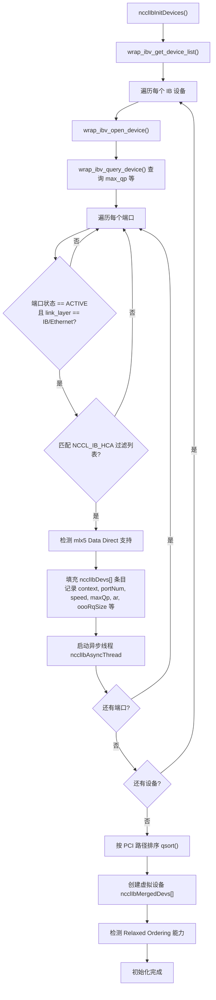
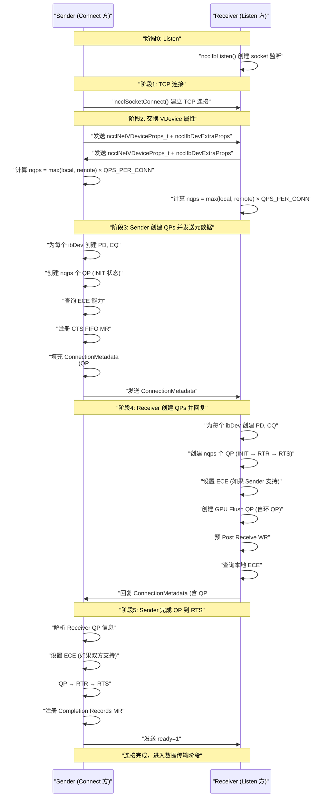
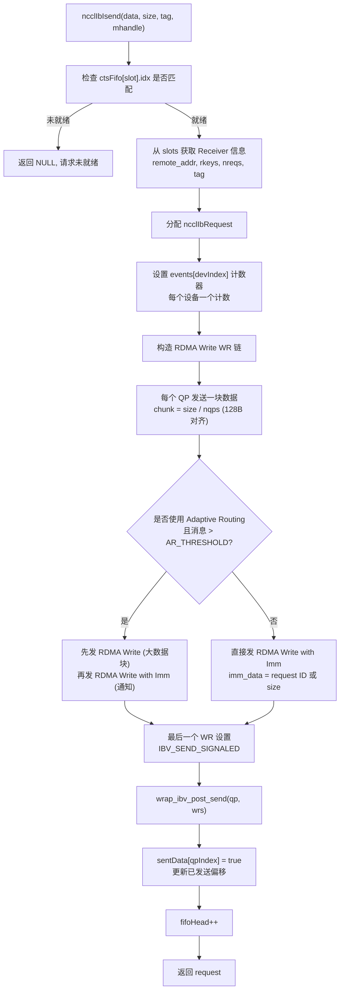
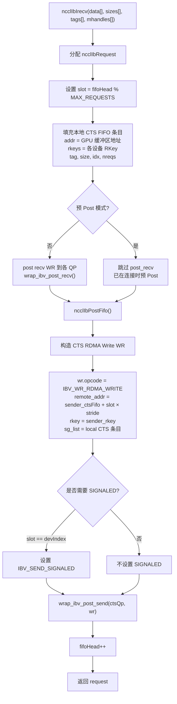
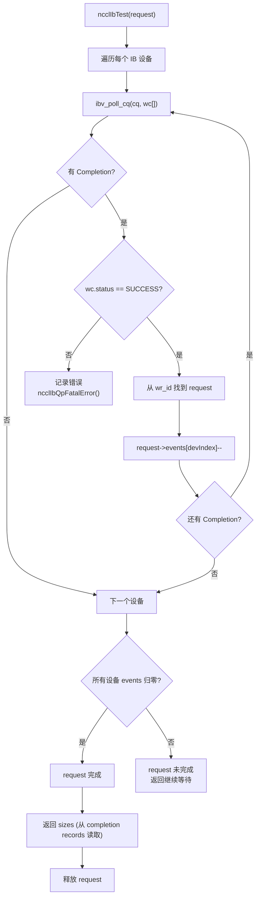

# NCCL IB/RDMA Transport 实现分析

## 一、整体架构

NCCL 的网络传输层通过 `ncclNet_t` 插件接口抽象，IB/RDMA 是其中最核心的实现。

```
GPU Kernels (device/)          Host CPU Side
     │                              │
  CUDA collectives           transport/net.cc (transport 层封装)
                                    │
                   transport/net_ib/ (IB/RDMA 实现)
                   ├── init.cc          设备发现与初始化
                   ├── connect.cc       QP 创建、连接建立
                   ├── p2p.cc           数据收发 (isend/irecv/test/flush)
                   ├── p2p_resiliency*  弹性与故障恢复
                   ├── reg.cc           内存注册 (MR)
                   └── gin.cc           GIN (GPUNetIO/DOCA) 支持
                              │
                     Verbs API (libibverbs / libmlx5)
                              │
                    InfiniBand / RoCE NIC
```

## 二、设备发现与初始化 (init.cc)

### 2.1 物理设备探测流程

`ncclIbInitDevices()` 是入口，流程如下：



每个物理设备记录在 `struct ncclIbDev`：

```c
struct ncclIbDev {
  ibv_context* context;        // 设备上下文
  ibv_pd* pd;                  // Protection Domain (引用计数共享)
  uint8_t portNum;             // 端口号
  uint8_t link;                // IB 或 RoCE
  int speed;                   // 带宽 (Mbps)，从 active_speed × width 计算
  int maxQp;                   // 设备最大 QP 数
  int ar;                      // Adaptive Routing 开关 (IB 网络默认开启)
  uint32_t oooRqSize;          // Out-of-Order Receive Queue 容量
  struct ncclIbMrCache mrCache; // 内存注册缓存
  enum ncclIbProvider ibProvider; // NONE 或 MLX5
};
```

速度映射覆盖 SDR (2.5Gbps) 到 XDR (200Gbps)。

### 2.2 虚拟设备合并 (VDevice)

NCCL 支持将多个物理 NIC 合并为一个虚拟设备（Rail-optimized 拓扑）：

```c
struct ncclIbMergedDev {
  ncclNetVDeviceProps_t vProps; // 包含多个物理设备索引
  int speed;                     // 聚合带宽
  char devName[];                // 如 "mlx5_0+mlx5_1+mlx5_2+mlx5_3"
};
```

- `NCCL_IB_MERGE_VFS=1`: 同一物理卡的多端口 VF 合并
- `NCCL_IB_MERGE_NICS=1`: 多个物理 NIC 合并为一个虚拟 NIC
- 合并时要求链路类型一致（不能混 IB 和 RoCE）

### 2.3 GID 选择策略

RoCE 环境下，GID 表可能有多个条目，NCCL 自动选择最优 GID：

1. 地址族匹配 (`NCCL_IB_ADDR_FAMILY`: AF_INET 或 AF_INET6)
2. 子网前缀匹配 (`NCCL_IB_ADDR_RANGE`)
3. RoCE 版本匹配 (`NCCL_IB_ROCE_VERSION_NUM`: v1 或 v2)
4. 排除 link-local (fe80::) 和全零 GID

IB 环境下，如果端点在不同子网，使用 FLID (Routable FLID GID Index)。

### 2.4 特性检测

| 特性 | 检测方式 | 环境变量 |
|------|---------|---------|
| GDR (GPUDirect RDMA) | `cuMemGetHandleForAddressRange` | - |
| DMA-BUF | `ibv_reg_dmabuf_mr` dummy call | - |
| Relaxed Ordering | `ibv_reg_mr_iova2` 可用性 | `NCCL_IB_PCI_RELAXED_ORDERING` |
| Adaptive Routing | 仅 IB 链路默认开启 | `NCCL_IB_ADAPTIVE_ROUTING` |
| OOO RQ | `mlx5dv_query_device` | `NCCL_IB_OOO_RQ` |
| Data Direct (CX-8) | `mlx5dv_get_data_direct_sysfs_path` | `NCCL_IB_DATA_DIRECT` |

## 三、连接建立 — QP 握手 (connect.cc)

### 3.1 连接全流程



### 3.2 QP 创建策略

**QP 数量计算：**

```
nqps = max(local_ndevs, remote_ndevs) × NCCL_IB_QPS_PER_CONNECTION
```

默认 `NCCL_IB_QPS_PER_CONNECTION=1`，即每个物理设备 1 个 QP。如果两端设备数不同，取较大值，确保对称。

**QP 分布（Striped）：**

QP 按 `qpIndex % ndevs` 的 striped 方式分配到各设备，实现负载均衡：

```
例：2 设备，4 QPs
  Dev0 → QP0, QP2
  Dev1 → QP1, QP3
```

### 3.3 QP 状态机


各阶段配置内容：

| 状态 | 配置项 |
|------|--------|
| INIT | pkey、端口号、qp_access_flags (`REMOTE_WRITE`) |
| RTR | 远端 QP 号、远端 GID/LID、MTU（取两端较小值）、Traffic Class、Service Level、local GID index |
| RTS | timeout (默认 20)、retry count (默认 7)、RNR retry (7=无限重试)、max_rd_atomic (1)、sq_psn (0) |

### 3.4 QP 属性

**Sender 端 QP：**

```c
qp_type              = IBV_QPT_RC           // Reliable Connected
max_send_wr          = 2 × 256              // 发送 Work Request 数
max_recv_wr          = 0                    // Sender 不接收数据
max_send_sge         = 1
max_inline_data      = NCCL_IB_USE_INLINE ? sizeof(ncclIbSendFifo) : 0
qp_access_flags      = IBV_ACCESS_REMOTE_WRITE
```

**Receiver 端 QP：**

```c
qp_type              = IBV_QPT_RC
max_recv_wr          = 256                  // 预 Post 的接收 WR
max_send_wr          = 256 × 2              // CTS 消息用
max_send_sge         = 1
qp_access_flags      = REMOTE_WRITE | REMOTE_ATOMIC | REMOTE_READ
```

### 3.5 ECE (Enhanced Connection Establishment)

针对 Mellanox ConnectX-6 及以上网卡，ECE 支持增强型连接参数协商：

1. Sender 创建 QP 后调用 `ibv_query_ece()` 查询 ECE 能力
2. 通过 socket 交换双方的 ECE 信息
3. 双方都支持时调用 `ibv_set_ece()` 启用

### 3.6 CTS FIFO 设计

CTS (Clear-to-Send) 是 NCCL 的流控机制：Receiver 通过 RDMA Write 将接收就绪信息写入 Sender 的 FIFO。

```c
struct ncclIbSendFifo {
  uint64_t addr;           // Receiver 的 GPU 缓冲区地址
  uint64_t size;           // 接收大小
  uint32_t rkeys[];        // 每个设备的 RKey
  uint32_t nreqs;          // multi-recv 的请求数
  uint32_t tag;            // 匹配 tag
  uint64_t idx;            // FIFO 序列号
};
```

关键约束：
- FIFO 大小：`NET_IB_MAX_REQUESTS × NCCL_NET_IB_MAX_RECVS`（256 × 8）条目
- **32 字节对齐**，确保 Relaxed Ordering 下不会跨条目乱序写入
- Sender 通过 `ibv_reg_mr` 注册 FIFO 为 `REMOTE_WRITE | REMOTE_READ`

### 3.7 Completion Records

用于跨设备完成状态跟踪的共享内存结构：

```c
struct ncclIbRequestCompletionRecord {
  int sizes[NCCL_NET_IB_MAX_RECVS];   // Sender 写入：传输大小
  bool completions[NCCL_IB_MAX_QPS];  // Receiver 写入：完成标志
};
```

- Sender 通过 RDMA Write 将大小写入 Receiver 的 completion records
- Receiver 通过 RDMA Write 将完成标志写入 Sender 的对应结构
- 这是故障恢复时判断数据是否真正到达的关键机制

## 四、数据传输路径 (p2p.cc)

### 4.1 发送流程 (ncclIbIsend)

NCCL 的 IB 发送是 **基于 RDMA Write 的推送模型**，而非传统的 Send/Recv：



**数据分片逻辑：**

```c
// 每个 QP 承担均等的数据块，128 字节对齐
chunk_size = DIVUP(DIVUP(send_size, nqps), 128) * 128;
// QP i 从 offset = i × chunk_size 开始发送
// 如果某 QP 没有剩余数据，则 sge.length = 0, num_sge = 0
```

**Adaptive Routing 优化：**

当消息大于 `NCCL_IB_AR_THRESHOLD`（默认 8192 字节）且 AR 开启时：
- 先发一个大的 RDMA Write（走确定性路径）
- 最后再发 RDMA Write with Imm（走 AR 路由，带通知）
- 这样 AR 的路径不确定性只影响最后的控制消息

### 4.2 接收流程 (ncclIbIrecv)

接收方不是被动等待数据，而是主动"通知" Sender：



**预 Post Receive WR：**

连接建立时在每个 QP 上预 Post N 个空的 Receive WR，避免数据路径上每次都调用 `post_recv`。由 `NCCL_IB_PREPOST_RECV_WORK_REQUESTS` 控制。

### 4.3 完成检测 (ncclIbTest)



**请求匹配方案：**

- **BY_INDEX** (默认): wr_id 直接是 slot 索引
- **BY_ID**: wr_id 编码了 request ID（从 immediate data 中提取），用于乱序到达场景

### 4.4 Flush 机制 (ncclIbIflush)

当 PCIe 路径无序时，需要确保 GPU 内存数据对 CPU/NIC 可见：

```c
// 使用专用的 GPU Flush QP（自环 QP，连接到自己）
wr.opcode = IBV_WR_RDMA_READ          // RDMA Read 确保数据已被读取
wr.wr.rdma.remote_addr = GPU 地址
wr.wr.rdma.rkey = mhandle->rkey
wr.send_flags = IBV_SEND_SIGNALED
wrap_ibv_post_send(flushQP, &wr, &bad_wr);
```

`forceFlush=1` 的场景：CX-8 Data Direct 模式下 PCIe C2C 路径无序。

## 五、内存注册 (reg.cc)

```c
ncclResult_t ncclIbRegMr(void* comm, void* data, size_t size, int type, void** mhandle) {
    // type = NCCL_PTR_HOST 或 NCCL_PTR_CUDA
    for each ibDev:
        if (type == NCCL_PTR_CUDA && gdrSupport):
            mr = ibv_reg_mr(pd, data, size,
                           IBV_ACCESS_LOCAL_WRITE |
                           IBV_ACCESS_REMOTE_WRITE |
                           IBV_ACCESS_RELAXED_ORDERING);
        else:
            mr = ibv_reg_mr(pd, data, size, ...);
        mhandle->mrs[devIndex] = mr;
}
```

**MR 缓存机制：** 对重复使用的地址范围，复用已注册的 MR，避免重复注册开销。

**DMA-BUF 注册（CUDA 12+）：** 通过 fd 注册，支持 CUDA IPC 共享的内存。

## 六、多 NIC 策略与 Rail-Optimized 拓扑

### 6.1 设备到 Channel 的映射

NCCL 将多个 Channel 映射到多个 NIC 上，实现带宽聚合：

```
Channel 0 → NIC 0
Channel 1 → NIC 1
Channel 2 → NIC 0
Channel 3 → NIC 1
...
```

拓扑检测（`graph/topo.cc`）根据 PCI 拓扑自动选择最优映射。

### 6.2 Rail-Optimized

在 HGX/DGX 系统中，每个 GPU 直连一个 NIC（8 GPU + 8 NIC）：

- `ndevs` 通常为 1（每个 merged dev 代表一个物理 NIC）
- 每个 GPU-NCCL 实例只使用自己的 NIC
- 跨节点通信通过 NIC-to-NIC 直连

### 6.3 异构设备处理

当两端设备数不匹配时：

```c
// 取 max(local_ndevs, remote_ndevs) 作为 QP 数
comm->base.nqps = max(localNqps, remoteNqps);
// 实际数据传输时使用 nDataQps = max(local_ndevs, remote_ndevs)
```

## 七、弹性与故障恢复 (p2p_resiliency*)

### 7.1 选择性重传 (Selective Retransmission)

```c
// 每个 request 跟踪在每个 QP 上的发送状态
req->send.sentData[qpIndex] = true;

// 重传时跳过已发送数据的 QP
if (req->send.sentData[qpIndex] == true) {
    // 调整地址和偏移，只传未发送部分
    wr->sg_list->addr += already_sent;
    wr->wr.rdma.remote_addr += already_sent;
    continue;
}
```

### 7.2 端口故障检测

独立线程 `ncclIbPortRecoveryThread` 监控：

- CQ 错误计数 (`fatalErrorCount`)
- QP 状态异常
- 通过 `ncclIbStatsFatalError()` 原子标记

### 7.3 Out-of-Order Receive Queue (OOO RQ)

Mellanox CX-7+ 支持的硬件乱序接收：

```c
// 创建 QP 时设置 MLX5DV_QP_CREATE_OOO_DP
dvAttr.create_flags |= MLX5DV_QP_CREATE_OOO_DP;
// 前提条件: AR 必须开启, 且双方都支持
```

允许数据在 QP 内部乱序到达，无需严格 PSN 顺序。

## 八、关键数据结构总览

### ncclIbSendComm

```
ncclIbSendComm
├── base (ncclIbNetCommBase)
│   ├── vProps            ← 虚拟设备属性 (ndevs, devs[])
│   ├── qps[N]            ← QP 数组
│   ├── activeQps[N]      ← 实际使用的 QP 指针
│   ├── nqps              ← QP 总数
│   ├── nDataQps          ← 用于数据传输的 QP 数
│   ├── remDevs[]         ← 远端设备信息 (GID, LID, MTU, rkey)
│   ├── remOooRq / localOooRq
│   ├── sock              ← 控制面 socket
│   ├── resiliency        ← 弹性模块
│   ├── stats             ← 统计信息
│   ├── fifoHead          ← FIFO 头指针
│   └── recvMatchingScheme ← BY_INDEX 或 BY_ID
├── ctsFifo[][]           ← CTS FIFO (256 × 8 条目)
├── sges[] / wrs[]        ← 预分配的 SGE 和 WR
├── devs[]                ← 每设备状态
│   ├── base (pd, cq, gidInfo)
│   ├── ctsFifoMr         ← CTS FIFO MR
│   ├── putSignalScratchpadMr
│   └── cmplsRecordsMr    ← 远端完成记录 MR
├── remCmplsRecords       ← 远端完成记录 (shadow)
│   ├── elems[][N]        ← 大小数组
│   ├── addr              ← 远端地址
│   └── rkeys[]           ← 每个设备的 RKey
├── sendReqs[][]          ← 发送请求跟踪 (slot → req[])
└── sendReqsCnt[]         ← 每个 slot 的请求计数
```

### ncclIbRecvComm

```
ncclIbRecvComm
├── base (ncclIbNetCommBase)
│   └── ... (同 SendComm)
├── devs[]
│   ├── base (pd, cq, gidInfo)
│   ├── gpuFlush.qp       ← GPU 刷新 QP (自环)
│   ├── ctsFifoMr         ← 本地 CTS FIFO MR
│   └── cmplsRecordsMr    ← 本地完成记录 MR
├── remCtsFifo            ← 远端 CTS FIFO (shadow)
│   ├── elems[][N]        ← 本地构造的 CTS 条目
│   ├── addr              ← 远端 FIFO 地址
│   └── rkeys[]           ← 远端 RKey
├── cmplsRecords[]        ← 本地完成记录
├── recvReqs[]            ← 接收请求哈希表 (id → req)
├── gpuFlushHostMem       ← 刷新用的 host 内存
├── flushEnabled          ← 是否启用 flush
└── prepostReceiveWorkRequests ← 是否预 Post recv WR
```

### ncclIbRequest

```
ncclIbRequest
├── base                  ← 所属 comm
├── type                  ← SEND / RECV / FLUSH
├── sock                  ← 控制 socket
├── id                    ← 请求 ID (等于 slot)
├── nreqs                 ← multi-recv 数量
├── events[]              ← 每设备完成计数器
├── devBases[]            ← 每设备 base 指针
├── send                  ← 发送专属
│   ├── size              ← 数据大小
│   ├── data              ← 数据指针
│   ├── lkeys[]           ← 每设备 LKey
│   └── sentData[]        ← 每 QP 是否已发送 (重传用)
└── recv                  ← 接收专属
    ├── cmplsRecords      ← 完成记录指针
    └── aggSize           ← 聚合大小
```

## 九、环境变量速查

| 变量 | 默认值 | 说明 |
|------|--------|------|
| `NCCL_IB_HCA` | 全部 | 指定使用的 IB 设备 (如 `=mlx5_0` 或 `^mlx5_2` 排除) |
| `NCCL_IB_QPS_PER_CONNECTION` | 1 | 每个物理设备的 QP 数量 |
| `NCCL_IB_ADAPTIVE_ROUTING` | IB=1, RoCE=0 | 自适应路由 |
| `NCCL_IB_PCI_RELAXED_ORDERING` | 2 (auto) | PCI 宽松排序 |
| `NCCL_IB_TIMEOUT` | 20 | IB 传输超时 |
| `NCCL_IB_RETRY_CNT` | 7 | 重试次数 |
| `NCCL_IB_GID_INDEX` | -1 (auto) | GID 索引 |
| `NCCL_IB_SL` | -1 (auto) | Service Level |
| `NCCL_IB_TC` | -1 (auto) | Traffic Class (RoCE) |
| `NCCL_IB_OOO_RQ` | 0 | Out-of-Order RQ |
| `NCCL_IB_DATA_DIRECT` | 1 | CX-8 Data Direct DMA |
| `NCCL_IB_MERGE_NICS` | 1 | 合并多个 NIC 为虚拟设备 |
| `NCCL_IB_DISABLE` | 0 | 禁用 IB 传输 |
| `NCCL_IB_AR_THRESHOLD` | 8192 | AR 优化阈值（字节） |
| `NCCL_OOB_NET_IFNAME` | device 0 | Bootstrap OOB 网卡 |
