# Xray-core 深度技术解析文档

> 版本：基于 Xray-core v26.3.27 代码分析
> 生成时间：2026-04-07

---

## 目录

1. [项目概述](#1-项目概述)
2. [整体架构](#2-整体架构)
3. [核心模块详解](#3-核心模块详解)
4. [数据流与处理流程](#4-数据流与处理流程)
5. [协议实现](#5-协议实现)
6. [传输层机制](#6-传输层机制)
7. [性能优化机制](#7-性能优化机制)
8. [设计初衷与权衡](#8-设计初衷与权衡)
9. [附录：Mermaid 流程图](#9-附录mermaid-流程图)

---

## 1. 项目概述

### 1.1 项目背景与目标

Xray-core 是一个基于 Go 语言开发的高性能代理平台，起源于 XTLS 协议，旨在提供一套完整的网络代理解决方案。项目从 v2fly/v2ray-core 分叉而来，但在性能、安全性和功能上进行了大量增强。

**核心设计目标：**

| 目标 | 说明 |
|------|------|
| 高性能 | 通过 XTLS、零拷贝、splice 等技术实现接近原生网络的性能 |
| 抗审查 | 支持 REALITY、uTLS、WebSocket 等多种伪装技术 |
| 模块化 | 插件化架构，支持灵活扩展 |
| 多协议 | 支持 VLESS、VMess、Trojan、Shadowsocks 等多种代理协议 |
| 路由智能 | 基于域名、IP、协议的精细化流量路由 |

### 1.2 版本信息

```go
// core/core.go
var (
    Version_x byte = 26
    Version_y byte = 3
    Version_z byte = 27
)
```

---

## 2. 整体架构

### 2.1 架构总览

Xray-core 采用分层架构设计，从下到上依次为：

```
┌─────────────────────────────────────────────────────────────────┐
│                         应用层 (Proxy)                           │
│  ┌─────────┐ ┌─────────┐ ┌─────────┐ ┌─────────┐ ┌─────────────┐ │
│  │  VLESS  │ │ VMess   │ │ Trojan  │ │Shadowsocks│ │  Freedom   │ │
│  └─────────┘ └─────────┘ └─────────┘ └─────────┘ └─────────────┘ │
├─────────────────────────────────────────────────────────────────┤
│                      路由层 (Routing)                            │
│  ┌─────────────────┐  ┌─────────────────┐  ┌─────────────────┐  │
│  │   Router        │  │   Dispatcher    │  │  Load Balancer  │  │
│  │  (路由决策)      │  │  (调度分发)      │  │  (负载均衡)      │  │
│  └─────────────────┘  └─────────────────┘  └─────────────────┘  │
├─────────────────────────────────────────────────────────────────┤
│                      传输层 (Transport)                          │
│  ┌─────────┐ ┌─────────┐ ┌─────────┐ ┌─────────┐ ┌─────────────┐ │
│  │   TCP   │ │   mKCP  │ │WebSocket│ │ gRPC    │ │   XHTTP     │ │
│  └─────────┘ └─────────┘ └─────────┘ └─────────┘ └─────────────┘ │
├─────────────────────────────────────────────────────────────────┤
│                      安全层 (Security)                           │
│  ┌─────────┐ ┌─────────┐ ┌─────────┐ ┌─────────────────────────┐ │
│  │  TLS    │ │  uTLS   │ │ REALITY │ │   XTLS (Vision)         │ │
│  └─────────┘ └─────────┘ └─────────┘ └─────────────────────────┘ │
├─────────────────────────────────────────────────────────────────┤
│                      基础设施层 (Infrastructure)                  │
│  ┌─────────┐ ┌─────────┐ ┌─────────┐ ┌─────────┐ ┌─────────────┐ │
│  │   DNS   │ │  Stats  │ │ Policy  │ │   Log   │ │   Mux/XUDP  │ │
│  └─────────┘ └─────────┘ └─────────┘ └─────────┘ └─────────────┘ │
└─────────────────────────────────────────────────────────────────┘
```

### 2.2 核心 Instance 架构

```go
// core/xray.go
type Instance struct {
    statusLock                 sync.Mutex
    features                   []features.Feature
    pendingResolutions         []resolution
    pendingOptionalResolutions []resolution
    running                    bool
    resolveLock                sync.Mutex
    ctx                        context.Context
}
```

**Instance 职责：**
- 作为所有 Feature 的容器和管理器
- 处理 Feature 间的依赖解析（Dependency Resolution）
- 管理 Inbound/Outbound Handler 的生命周期
- 提供统一的启动和关闭机制

---

## 3. 核心模块详解

### 3.1 Feature 系统

**Feature 接口定义：**

```go
// features/feature.go
type Feature interface {
    common.HasType      // Type() interface{}
    common.Runnable     // Start() error, Close() error
}
```

**核心 Feature 列表：**

| Feature | 类型标识 | 功能描述 | 实现位置 |
|---------|----------|----------|----------|
| DNS Client | `dns.ClientType()` | 域名解析 | `app/dns/` |
| Router | `routing.RouterType()` | 路由决策 | `app/router/` |
| Dispatcher | `routing.DispatcherType()` | 请求调度 | `app/dispatcher/` |
| Inbound Manager | `inbound.ManagerType()` | 入站管理 | `app/proxyman/inbound/` |
| Outbound Manager | `outbound.ManagerType()` | 出站管理 | `app/proxyman/outbound/` |
| Policy Manager | `policy.ManagerType()` | 策略管理 | `app/policy/` |
| Stats Manager | `stats.ManagerType()` | 统计管理 | `app/stats/` |

**依赖解析机制：**

```go
// Instance.RequireFeatures 实现原理
func (s *Instance) RequireFeatures(callback interface{}, optional bool) error {
    // 1. 通过反射获取回调函数参数类型
    // 2. 检查所需 Feature 是否已注册
    // 3. 如果全部满足，立即调用回调
    // 4. 否则加入 pendingResolutions 等待后续解析
}
```

### 3.2 Dispatcher（调度器）

**DefaultDispatcher 结构：**

```go
// app/dispatcher/default.go
type DefaultDispatcher struct {
    ohm    outbound.Manager    // 出站管理器
    router routing.Router      // 路由器
    policy policy.Manager      // 策略管理器
    stats  stats.Manager       // 统计管理器
    fdns   dns.FakeDNSEngine   // FakeDNS 引擎
}
```

**Dispatch 流程：**

1. **目标验证**：检查 destination 是否有效
2. **Session 初始化**：创建/获取 Outbound session
3. **链接创建**：通过 `getLink()` 创建 uplink/downlink pipe
4. **流量统计**：根据 policy 配置统计用户信息
5. **协议嗅探**（可选）：识别 HTTP/TLS/QUIC/BT 等协议
6. **路由决策**：调用 Router 选择出站
7. **请求分发**：调用 Outbound Handler 处理

**Sniffing 机制：**

```go
type Sniffer struct {
    sniffer []protocolSnifferWithMetadata
}

// 支持的嗅探器（按优先级）：
// 1. FakeDNS (metadata)
// 2. HTTP (TCP)
// 3. TLS (TCP)  
// 4. BitTorrent (TCP)
// 5. QUIC (UDP)
// 6. uTP (UDP)
```

### 3.3 Router（路由器）

**路由决策流程：**

```
┌─────────────────────────────────────────────────────────────┐
│                     PickRoute 流程                          │
├─────────────────────────────────────────────────────────────┤
│ 1. 检查 SkipDNSResolve（避免 DNS 循环解析）                  │
│ 2. 根据 DomainStrategy 决定是否预解析域名                     │
│ 3. 遍历所有 Rule，调用 Apply() 进行匹配                      │
│ 4. 如果未匹配且策略为 IpIfNonMatch，执行 DNS 解析后重试      │
│ 5. 返回匹配的路由或 ErrNoClue                               │
└─────────────────────────────────────────────────────────────┘
```

**Domain Strategy 矩阵：**

| 策略值 | 行为描述 |
|--------|----------|
| AsIs | 不解析域名，直接使用原始目标 |
| UseIP | 优先使用 IP（IPv4+IPv6） |
| UseIPv4 | 优先使用 IPv4 |
| UseIPv6 | 优先使用 IPv6 |
| UseIPv4v6 | 优先 IPv4，回退 IPv6 |
| UseIPv6v4 | 优先 IPv6，回退 IPv4 |
| ForceIP | 强制解析为 IP |
| ForceIPv4 | 强制解析为 IPv4 |
| ForceIPv6 | 强制解析为 IPv6 |

### 3.4 Buffer 系统

**Buffer 设计：**

```go
// common/buf/buffer.go
const Size = 8192  // 8KB 标准缓冲区大小

type Buffer struct {
    v         []byte           // 底层字节数组
    start     int32            // 有效数据起始偏移
    end       int32            // 有效数据结束偏移
    ownership ownership        // 所有权类型
    UDP       *net.Destination // UDP 目标信息
}
```

**Buffer 池化管理：**

```go
var pool = bytespool.GetPool(Size)

func New() *Buffer {
    buf := pool.Get().([]byte)
    return &Buffer{v: buf}
}

func (b *Buffer) Release() {
    if b.ownership == managed && cap(b.v) == Size {
        pool.Put(b.v)
    }
}
```

**MultiBuffer 设计：**

```go
type MultiBuffer []*Buffer

// 关键操作：
// - MergeMulti: 合并两个 MultiBuffer
// - SplitBytes: 分离指定字节数
// - ReleaseMulti: 释放所有 Buffer
// - Compact: 合并碎片
```

### 3.5 Pipe 机制

**Pipe 结构：**

```go
// transport/pipe/impl.go
type pipe struct {
    sync.Mutex
    data        buf.MultiBuffer
    readSignal  *signal.Notifier
    writeSignal *signal.Notifier
    done        *done.Instance
    errChan     chan error
    option      pipeOption
    state       state
}
```

**核心特性：**

- **背压控制**：通过 `limit` 配置缓冲区大小上限
- **非阻塞写**：`DiscardOverflow` 选项允许丢弃溢出数据
- **信号通知**：使用 `signal.Notifier` 实现高效的读写等待
- **中断机制**：支持 `Interrupt()` 强制终止连接

---

## 4. 数据流与处理流程

### 4.1 入站连接处理流程

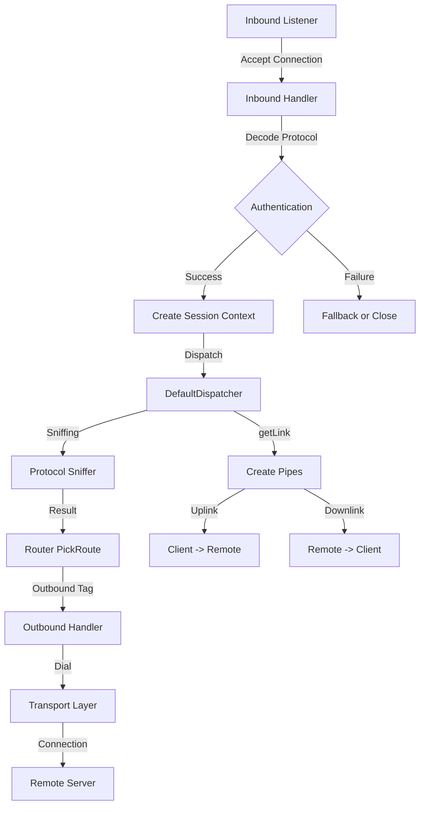

### 4.2 出站连接处理流程

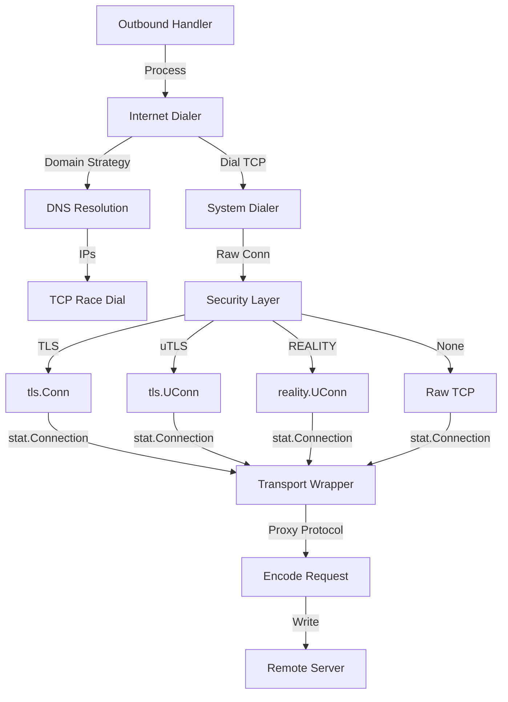

### 4.3 数据传输双工流程

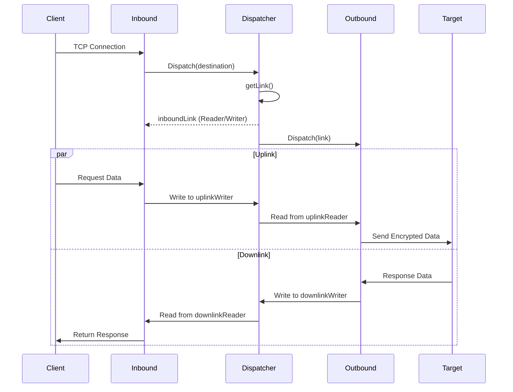

---

## 5. 协议实现

### 5.1 VLESS 协议

**协议特点：**
- 无状态设计，降低服务端资源消耗
- UUID 认证，无需复杂握手
- 支持 XTLS Vision 零拷贝优化
- 支持 Mux 多路复用

**请求头结构：**

```
+------+-------+----------+--------+--------+----------+
| Ver  |  UUID |  Addon   | Cmd    | Addr   |  Port    |
| 1B   |  16B  | Variable | 1B     | Variable| 2B      |
+------+-------+----------+--------+--------+----------+
```

**XTLS Vision 机制：**

```go
// proxy/proxy.go
type TrafficState struct {
    UserUUID               []byte
    NumberOfPacketToFilter int  // 默认 8 个包
    EnableXtls             bool // 是否启用 XTLS
    IsTLS12orAbove         bool
    IsTLS                  bool
    Cipher                 uint16
    RemainingServerHello   int32
    Inbound                InboundState
    Outbound               OutboundState
}
```

**Vision 核心逻辑：**

1. **包过滤阶段**：分析前 8 个数据包，识别 TLS 特征
2. **TLS 检测**：通过 TLS record type (0x16=handshake, 0x17=application) 识别
3. **ServerHello 解析**：提取 cipher suite，判断是否为 TLS 1.3
4. **直接传输模式**：确认 TLS 1.3 后，切换到直接 copy 模式

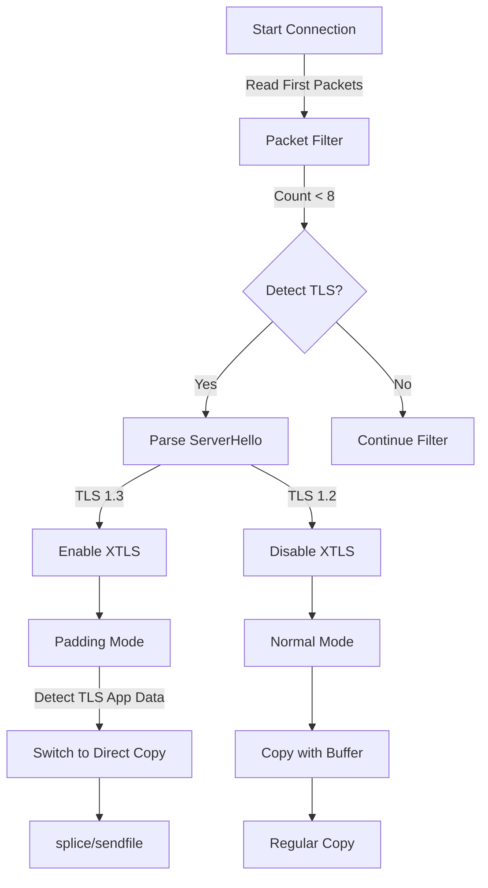

### 5.2 VMess 协议

**认证流程：**
1. 时间校验（允许 ±2 分钟漂移）
2. HMAC 校验请求头
3. 解密请求体
4. 响应认证

**加密方式：**
- AEAD：AES-128-GCM, ChaCha20-Poly1305
- Legacy：AES-128-CFB（已弃用）

### 5.3 Trojan 协议

**特点：**
- 类似 HTTPS 的协议外观
- 首次握手携带密码哈希
- 简单高效的协议设计

### 5.4 Shadowsocks / Shadowsocks 2022

**传统 Shadowsocks：**
- 流加密（已弃用）
- AEAD 加密

**Shadowsocks 2022：**
- 基于 SIP022 标准
- 增强的安全性设计
- 更好的抗重放保护

---

## 6. 传输层机制

### 6.1 传输层架构

```
┌─────────────────────────────────────────────────────────────┐
│                    Transport Layer                          │
├─────────────────────────────────────────────────────────────┤
│  Stream Settings                                            │
│  ├── Protocol: tcp / kcp / ws / grpc / splithttp / httpupgrade │
│  ├── Security: none / tls / utls / reality / xtls          │
│  └── Socket Options: mark / tproxy / tcpFastOpen           │
├─────────────────────────────────────────────────────────────┤
│  Dialer Chain                                               │
│  System Dialer → Proxy Dialer → Security → Transport       │
└─────────────────────────────────────────────────────────────┘
```

### 6.2 REALITY 实现

**核心机制：**

REALITY（Realistic Encryption Layer Identity Transition Yield）是一种高级传输层伪装技术，能够完全模拟真实网站的 TLS 指纹。

```mermaid
flowchart TD
    A[Client Hello] -->|SessionID[0:2]=Version| B[Server Reality Check]
    A -->|SessionID[4:7]=Timestamp| B
    A -->|SessionID[8:15]=ShortID| B
    B -->|X25519MLKEM768| C[Shared Secret]
    C -->|HKDF| D[AuthKey]
    D -->|AEAD Seal| E[Encrypted SessionID]
    E --> F[Server Verify]
    F -->|Success| G[X25519+ECH Certificate]
    F -->|Failure| H[Redirect to Real Website]
    H --> I[Spider Crawl]
```

**客户端实现关键点：**

```go
// transport/internet/reality/reality.go
func UClient(c net.Conn, config *Config, ctx context.Context, dest net.Destination) (net.Conn, error) {
    // 1. 构建 HandshakeState，注入版本信息到 SessionID
    // 2. 使用 X25519MLKEM768 密钥交换
    // 3. 通过 HKDF 派生 AuthKey
    // 4. 使用 AEAD 加密 SessionID
    // 5. 握手成功后验证服务器证书签名
    // 6. 失败时启动 Spider 模拟正常浏览器行为
}
```

**Spider 机制：**
- 当验证失败时，客户端模拟浏览器访问目标网站
- 爬取页面链接，递归访问
- 生成真实的 HTTP 流量特征

### 6.3 TLS / uTLS

**TLS 配置：**

```go
// transport/internet/tls/config.go
type Config struct {
    Certificate         []*Certificate
    ServerName          string
    AllowInsecure       bool
    NextProtocol        []string
    EnableSessionResumption bool
    Fingerprint         string  // uTLS fingerprint
}
```

**uTLS 指纹伪装：**
- 支持 Chrome、Firefox、Safari 等主流浏览器指纹
- 通过 `fingerprint` 配置选择
- 在 TLS 握手时模拟真实浏览器的 ClientHello

### 6.4 Mux (多路复用)

**Mux 协议帧结构：**

```
+--------+--------+--------+--------+--------+----------------+
| Length | Session| Status | Option | Target |    Data        |
| 2B     | ID 2B  | 1B     | 1B     | Variable|   Variable     |
+--------+--------+--------+--------+--------+----------------+
```

**SessionStatus：**
- 0x01: New - 新建会话
- 0x02: Keep - 保持会话（传输数据）
- 0x03: End - 结束会话
- 0x04: KeepAlive - 保活

**ClientWorker 管理：**

```go
// common/mux/client.go
type ClientWorker struct {
    sessionManager *SessionManager
    link           transport.Link
    done           *done.Instance
    timer          *time.Ticker
    strategy       ClientStrategy
}

type ClientStrategy struct {
    MaxConcurrency uint32  // 最大并发连接数
    MaxConnection  uint32  // 最大总连接数
}
```

### 6.5 XUDP

**XUDP 设计目标：**
- NAT 穿透优化
- UDP 连接追踪
- 全局 ID 去重

```go
// common/xudp/xudp.go
func GetGlobalID(ctx context.Context) (globalID [8]byte) {
    // 基于 inbound source 地址计算 Blake3 哈希
    h := blake3.New(8, BaseKey)
    h.Write([]byte(inbound.Source.String()))
    copy(globalID[:], h.Sum(nil))
}
```

---

## 7. 性能优化机制

### 7.1 零拷贝技术

**Splice 机制（Linux/Android）：**

```go
// proxy/proxy.go
func CopyRawConnIfExist(ctx context.Context, readerConn, writerConn net.Conn, 
                        writer buf.Writer, timer *signal.ActivityTimer) error {
    // 1. 解包获取底层 TCPConn
    // 2. 检查两端都支持 Splice
    // 3. 调用 tc.ReadFrom(readerConn) 直接在内核态传输
}
```

**触发条件：**
1. 操作系统为 Linux 或 Android
2. 两端都是 TCP 连接
3. 经过了 XTLS Vision 握手确认
4. CanSpliceCopy 标记为 1

### 7.2 Buffer 池化

```go
// common/buf/buffer.go
var pool = bytespool.GetPool(Size)  // 8KB

func New() *Buffer {
    buf := pool.Get().([]byte)
    return &Buffer{v: buf}
}

func (b *Buffer) Release() {
    if cap(b.v) == Size {
        pool.Put(b.v)
    }
}
```

**性能收益：**
- 减少 GC 压力
- 避免内存碎片
- 快速分配/释放

### 7.3 并发控制

**Happy Eyeballs (IPv4/IPv6 并行)：**

```go
// transport/internet/happy_eyeballs.go
func TcpRaceDial(ctx context.Context, src net.Address, ips []net.IP, 
                 port net.Port, sockopt *SocketConfig, domain string) (net.Conn, error) {
    // 并行拨号多个 IP
    // 返回最先成功的连接
    // 取消其他 pending 的连接
}
```

**DNS 并行查询：**

```go
// app/dns/dns.go
func (s *DNS) parallelQuery(domain string, option dns.IPOption) ([]net.IP, uint32, error) {
    // 并发向多个 DNS 服务器查询
    // 按组竞争，返回最快结果
}
```

### 7.4 连接预热

```go
// proxy/vless/outbound/outbound.go
type Handler struct {
    testpre  uint32
    preConns chan *ConnExpire
}

// 预先建立连接，减少首次请求延迟
```

---

## 8. 设计初衷与权衡

### 8.1 架构设计原则

| 原则 | 说明 | 权衡 |
|------|------|------|
| **Feature 化** | 所有功能都抽象为 Feature 接口 | 增加了启动时的依赖解析复杂度，但提高了模块化程度 |
| **Context 传递** | 使用 Go context 传递会话信息 | 需要 careful 设计避免 context 污染，但实现了优雅的跨层通信 |
| **Pipe 抽象** | 使用 Pipe 替代直接 net.Conn 传递 | 增加了内存拷贝（大多数情况下），但实现了灵活的流控制 |
| **反射依赖注入** | 使用反射进行 Feature 依赖解析 | 运行时开销，但实现了松耦合的模块间协作 |

### 8.2 协议设计权衡

**VLESS 无状态设计：**
- ✅ 优点：服务端资源消耗低，高并发性能好
- ❌ 缺点：无法做复杂的会话管理，依赖 TLS 层安全

**XTLS Vision 直接传输：**
- ✅ 优点：TLS 流量零拷贝，性能接近直连
- ❌ 缺点：依赖特定的 TLS 1.3 实现，需要精确的特征识别

**REALITY 伪装：**
- ✅ 优点：完美模拟真实网站指纹，难以检测
- ❌ 缺点：配置复杂，需要目标网站配合，失败时有延迟惩罚

### 8.3 性能与功能权衡

| 组件 | 性能优化 | 功能代价 |
|------|----------|----------|
| Splice | 内核态零拷贝 | 仅支持 Linux/Android，需要 RAW socket |
| Mux | 减少连接数 | 增加单点故障风险，头部开销 |
| XUDP | NAT 优化 | 需要全局状态管理，内存占用 |
| Buffer Pool | 减少 GC | 常驻内存增加 |

### 8.4 安全设计权衡

**多层加密设计：**

```
┌──────────────────────────────────────────────────────┐
│                 传输层加密 (TLS/REALITY)              │
├──────────────────────────────────────────────────────┤
│                 代理协议加密 (VLESS/VMess)            │
├──────────────────────────────────────────────────────┤
│                 传输层混淆 (Mux Padding)              │
└──────────────────────────────────────────────────────┘
```

- **分层安全**：即使一层被攻破，仍有其他层保护
- **性能代价**：多层加密增加了 CPU 消耗和延迟
- **平衡策略**：XTLS Vision 在确认安全后切换到直接传输

---

## 9. 附录：Mermaid 流程图

### 9.1 整体请求处理流程

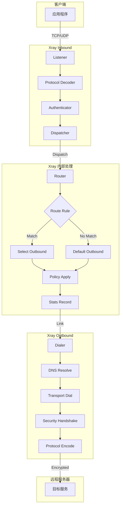

### 9.2 Sniffing 与路由流程

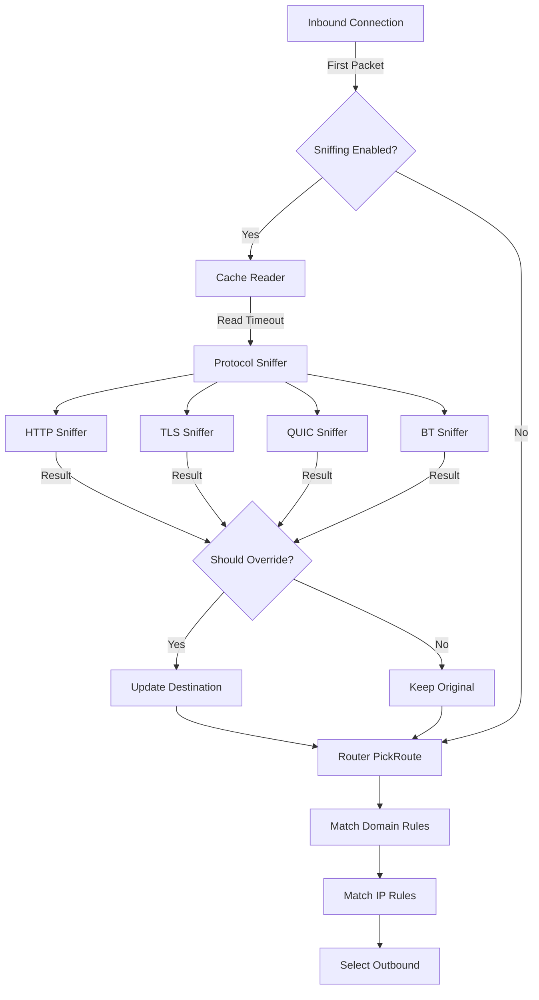

### 9.3 VLESS XTLS Vision 流程

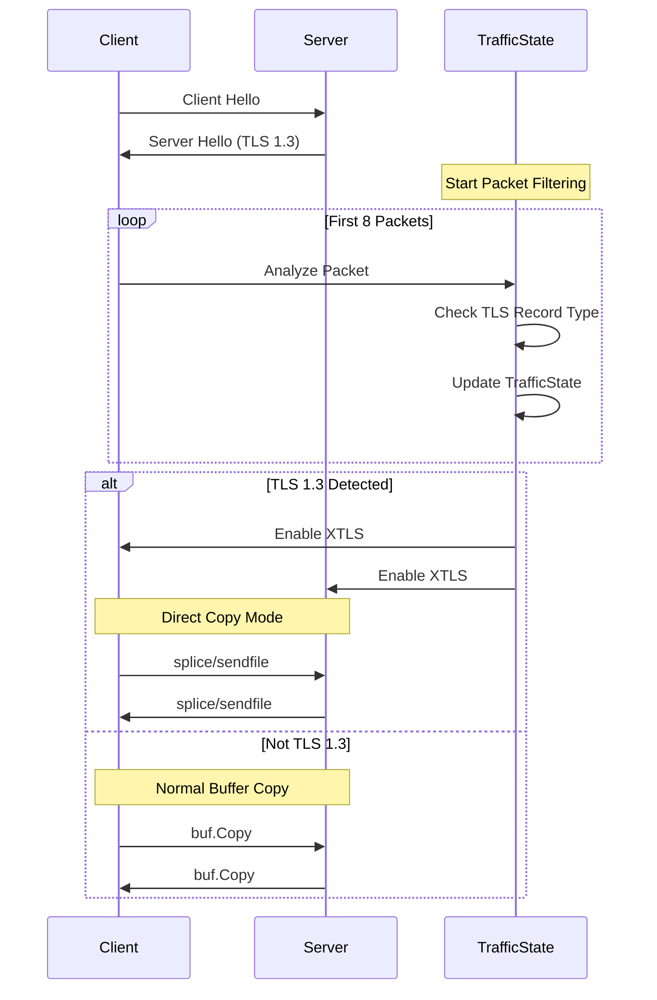

### 9.4 Mux 会话管理流程

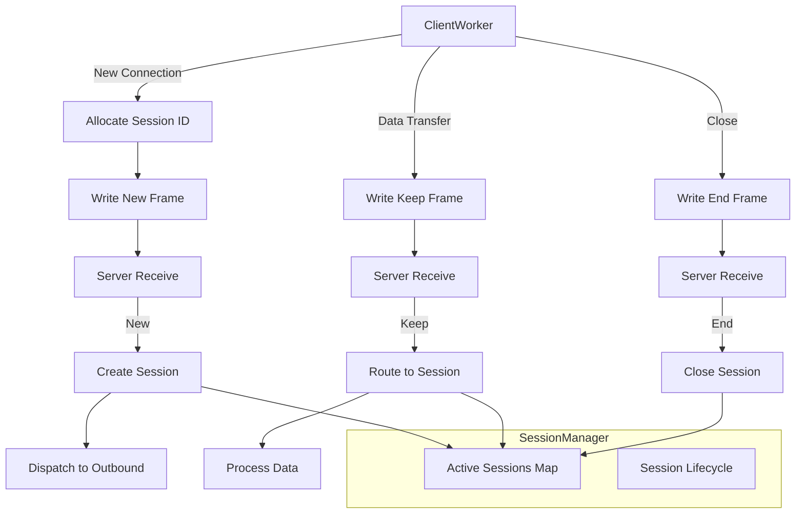

### 9.5 REALITY 握手流程

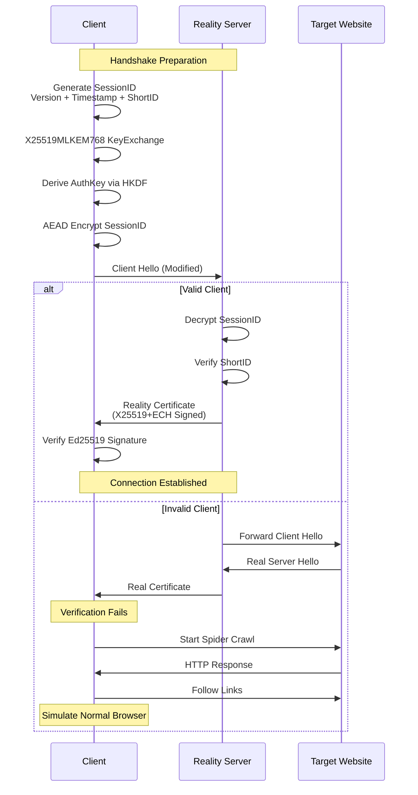

### 9.6 DNS 查询流程

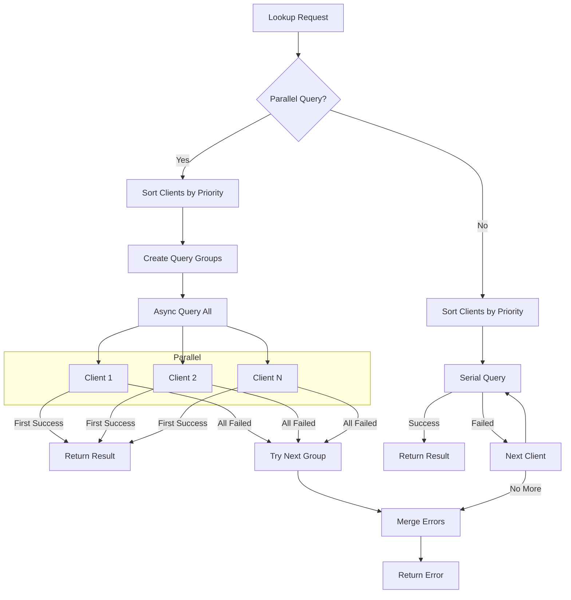

### 9.7 Buffer 生命周期

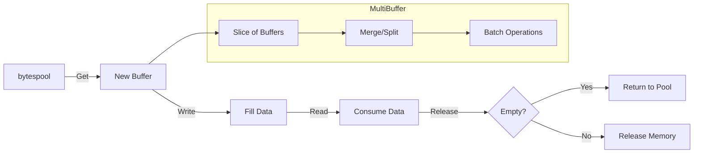

### 9.8 统计与策略流程

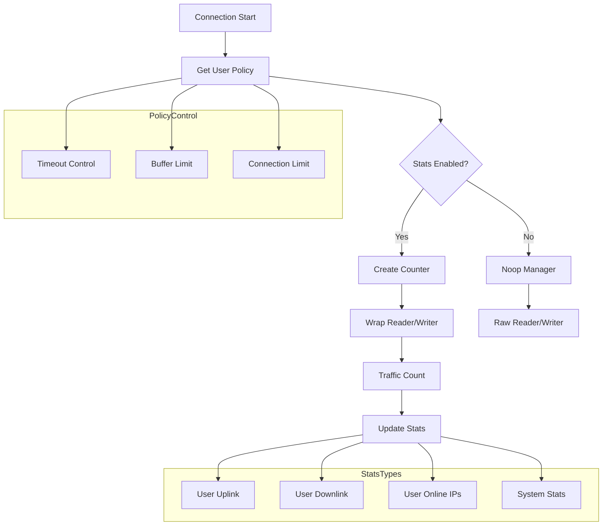

---

## 10. 总结

Xray-core 是一个经过精心设计的网络代理平台，其核心优势体现在：

1. **高性能架构**：通过 XTLS Vision 实现 TLS 流量的零拷贝传输，结合 splice/sendfile 技术达到接近原生网络性能

2. **模块化设计**：Feature 系统提供了灵活的扩展机制，支持第三方功能的无缝集成

3. **多层安全防护**：从传输层到应用层的多层加密，结合 REALITY 的指纹伪装技术，提供了强大的抗审查能力

4. **智能路由**：基于域名、IP、协议的精细化路由控制，支持负载均衡和故障转移

5. **资源优化**：Buffer 池化、连接复用、并行 DNS 等机制有效降低了资源消耗

通过对代码的深入分析，我们可以看到 Xray-core 在性能、安全性和功能性之间取得了精妙的平衡，每个设计决策都经过了深思熟虑的权衡。

---

*文档结束*
